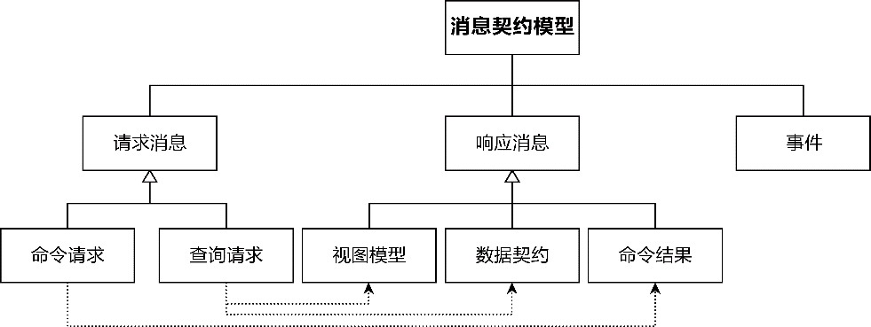
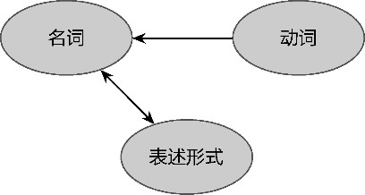
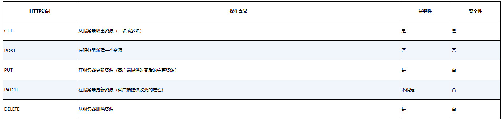
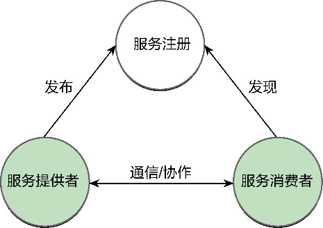
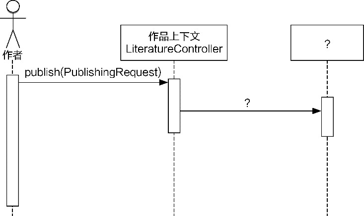
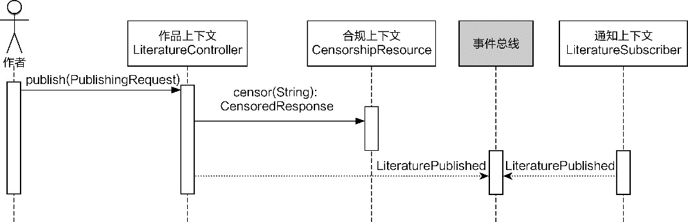
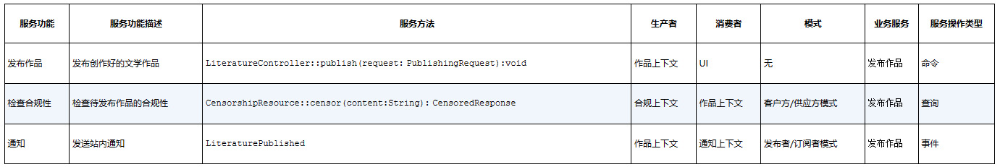

## 第11章 服务契约设计

> 社会秩序是一种神圣的权利，它是所有其他权利的基础。但是，这种权利绝非源于自然，而是建立在契约的基础之上。

> ——让-雅克·卢梭，《社会契约论》

在软件领域，使用最频繁的词语之一就是“服务”。领域驱动设计也有领域服务和应用服务之分，菱形对称架构则将开放主机服务分为远程服务和本地服务，其中本地服务即Eric Evans提出的应用服务。全局分析阶段输出的业务需求也被我称为业务服务。业务服务满足了角色的服务请求，在解空间体现为服务与客户的协作关系，形成的协作接口可称为契约(contract)。一个业务服务对应于架构映射阶段需要定义的服务契约，体现为菱形对称架构北向网关的开放主机服务。服务契约面向服务模型，它向客户端传递的消息数据称为消息契约。消息契约是组成服务契约的一部分。

### 11.1 消息契约

消息契约对应上下文映射的发布语言模式，根据客户端发起对服务操作的类型，分为命令、查询和事件。

·命令：是一个动作，要求其他服务完成某些操作，会改变系统的状态。

·查询：是一个请求，查看是否发生了什么事。重要的是，查询操作没有副作用，也不会改变系统的状态。

·事件：既是事实又是触发器，用通知的方式向外部表明发生了某些事。

不同的操作类型决定了客户端与服务端不同的协作模式，常见的协作模式包括请求/响应(request/response)模式、即发即忘(fire-and-forget)模式与发布/订阅(publish/subscribe)模式。查询操作采用请求/响应模式。命令操作如果需要返回操作结果，也需选择请求/响应模式，否则可以选择即发即忘模式，并结合业务场景选择定义为同步或异步操作。至于事件，自然选择发布/订阅模式。

#### 11.1.1 消息契约模型

操作类型与协作模式决定了消息契约模型。

遵循请求/响应协作模式的消息契约分为请求消息与响应消息。请求消息按照操作类型的不同分为查询请求(query request)和命令请求(command request)。若操作为命令，返回的响应消息为命令结果(command result)；若操作为查询，返回的响应消息又分为两种：面向前端UI的视图模型(view model)与面向下游限界上下文的数据契约(data contract)。遵循即发即忘协作模式的消息契约只有命令请求消息，遵循发布/订阅协作模式的消息契约就是事件本身。整个消息契约模型如图11-1所示。



*图11-1 消息契约模型*

消息契约模型最好遵循统一的命名规范。

对于请求消息，我建议以“动名词+Request”的形式命名，例如，将查询商品请求命名为QueryingProductRequest，将下订单请求命名为PlacingOrderRequest，有的实践通过Query与Command后缀来区分查询操作与命令操作，也是很好的做法，尤其在CQRS架构模式（参见第18章）中，这样的命名能更清晰地区分操作类型。

对于响应消息，建议视图模型以Presentation或View为后缀，数据契约以Response为后缀，命令结果以Result为后缀。例如，查询订单返回的数据契约命名为OrderResponse，向前端UI返回的视图模型则为OrderPresentation或OrderView，取消订单的命令结果命名为OrderCancellingResult。如果返回的视图模型和数据契约为多个消息契约对象，就要看消息契约对象的集合是否具有业务含义，再决定是否有必要对集合类型进行封装，因为封装的集合类型会直接影响到响应消息的契约定义。视图模型与数据契约尽量以扁平结构返回，若确实需要嵌套（如订单嵌套了订单项），那么内嵌类型也应定义对应的消息契约对象（如OrderResponse嵌套OrderItemResponse）。

消息契约模型定义在限界上下文的外部网关层，它的引入是为了保护领域模型，这是菱形对称架构明确要求的。对远程服务而言，为它定义消息契约模型的做法，实则运用了数据传输对象(data transfer object，DTO)模式（参见第19章）。

之所以引入消息契约模型而非直接暴露领域模型，不只是“为了减少方法调用的数量”。以下原因说明了远程服务直接调用领域模型对象的坏处。

·通信机制：领域模型对象在进程内传递，无须序列化和反序列化。为了支持分布式通信，需要让领域模型对象支持序列化，这就造成了对领域模型的污染。

·安全因素：领域驱动设计提倡避免贫血模型，且多数领域实体对象并非不可变的值对象。若直接暴露给外部服务，调用者可能会绕过服务方法直接调用领域对象封装的行为，或者通过set方法修改其数据。

·变化隔离：若将领域对象直接暴露，就可能受到外部调用请求变化的影响。领域逻辑与外部调用的变化方向往往不一致，需要一层间接的对象来隔离这种变化。

引入专门的消息契约对象自然也有付出。在大多数业务场景中，消息契约对象与对应的领域模型对象之间的相似度极高，会造成一定程度的代码重复，也会增加二者之间的转换成本。

#### 11.1.2 消息契约的转换

领域模型对象与消息契约对象之间的转换应基于信息专家模式，优先考虑将转换行为分配给消息契约对象，因为它最了解自己的数据结构。相反，领域模型对象位于限界上下文的内部领域层，遵循“整洁架构”^（参见第12章）思想，它不应该知道消息契约对象。

转换行为分为两个方向。

一个方向是将消息契约对象转换为领域模型对象。由于消息契约对象将自身实例转换为领域模型对象，故而定义为实例方法：

```
package com.dddexplained.eas.trainingcontext.message;
public class NominationRequest implements Serializable {
   private String ticketId;
   private String trainingId;
   private String candidateId;
   private String candidateName;
   private String candidateEmail;
   private String nominatorId;
   private String nominatorName;
   private String nominatorEmail;
   private TrainingRole nominatorRole;
   public NominationRequest(String ticketId,
                     String trainingId,
                     String candidateId,
                     String candidateName,
                     String candidateEmail,
                     String nominatorId,
                     String nominatorName,
                     String nominatorEmail,
                     TrainingRole nominatorRole) {
      this.ticketId = ticketId;
      this.trainingId = trainingId;
      this.candidateId = candidateId;
      this.candidateName = candidateName;
      this.candidateEmail = candidateEmail;
      this.nominatorId = nominatorId;
      this.nominatorName = nominatorName;
      this.nominatorEmail = nominatorEmail;
      this.nominatorRole = nominatorRole;
   }
   public Candidate toCandidate() {
      return new Candidate(candidateId, candidateName, candidateEmail, TrainingId.from
(trainingId));
   }
}
```

另一个方向是将领域模型对象转换为消息契约对象。由于消息契约对象的实例还没有创建，故而定义为静态方法：

```
package com.dddexplained.eas.trainingcontext.message;
public class TrainingResponse implements Serializable {
   private String trainingId;
   private String title;
   private String description;
   private LocalDateTime beginTime;
   private LocalDateTime endTime;
   private String place;
   public TrainingResponse(
          String trainingId,
          String title,
          String description,
          LocalDateTime beginTime,
          LocalDateTime endTime,
          String place) {
      this.trainingId = trainingId;
      this.title = title;
      this.description = description;
      this.beginTime = beginTime;
      this.endTime = endTime;
      this.place = place;
   }
   public static TrainingResponse from(Training training) {
      return new TrainingResponse(
             training.id().value(),
             training.title(),
             training.description(),
             training.beginTime(),
             training.endTime(),
             training.place());
   }
}
```

领域模型对象往往以聚合（参见第15章）为单位，聚合的设计原则要求聚合之间通过根实体的ID进行关联。如果消息契约需要组装多个聚合，又未提供聚合的信息，就需要求助于南向网关的端口访问外部资源。例如，当Order聚合的OrderItem仅持有productId时，如果客户端执行查询请求时希望返回具有产品信息的订单，就需要在组装OrderResponse消息对象时通过ProductClient端口获得产品信息。为了避免消息契约对象依赖南向网关的端口，最好由专门的装配器(assembler)对象^负责消息契约对象的装配：

```
package com.dddexplained.ecommerce.ordercontext.message;
public class OrderResponseAssembler {
   private ProductClient productClient;
   public OrderResponse of(Order order) {
      OrderResponse orderResponse = OrderResponse.of(order);
      orderResponse.addAll(compose(order));
      return orderResponse;
   }
   private List<OrderItemResponse> compose(Order order) {
      Map<String, ProductResponse> orderIdToProduct = retrieveProducts(order);
      return order.getOrderItems.stream()
                                          .map(oi ->compose(oi, orderIdToProduct))
                                          .collect(Collectors.toList());
   }
   private Map<String, ProductResponse> retrieveProducts(Order order) {
      List<String> productIds = order.items().stream.map(i -> i.productId()).collect
(Collectors.toList());
      return productClient.allProductsBy(productIds);
   }
   private OrderItemResponse compose(OrderItem orderItem, Map<String, ProductResponse> 
orderIdToProduct) {
      ProductResponse product = orderIdToProduct.get(orderItem.getProductId());
      return OrderItemResponse.of(orderItem, product);
   }
}
```

有的设计实践将消息契约与抽象的服务契约接口放在一个单独的JAR包（或.NET程序集）中，此时的消息契约就不能依赖领域模型，则可以考虑在应用服务层引入专门的装配器对象。

消息契约模型与领域模型的转换不属于领域逻辑的一部分，因而一定要注意维护好菱形对称架构中内部领域层与外部网关层的边界。

### 11.2 服务契约

领域驱动设计的服务契约对应上下文映射的开放主机服务模式，通常指采用分布式通信的远程服务。如果不采用跨进程通信，则应用服务也可认为是服务契约，与远程服务共同组成菱形对称架构的北向网关。

#### 11.2.1 应用服务

Eric Evans定义了领域驱动设计的分层架构，在领域层和用户界面层之间引入了应用层：“应用层要尽量简单，不包含业务规则或者知识，而只为下一层（指领域层）中的领域对象协调任务，分配工作，使它们互相协作。”^44若采用对象建模范式（参见附录A），遵循面向对象的设计原则，应尽可能为领域层定义细粒度的领域模型对象。细粒度设计不利于它的客户端调用，基于KISS(Keep It Simple and Stupid)原则或最小知识原则，我们希望调用者了解的知识越少越好、调用越简单越好，这就需要引入一个间接的层来封装。这就是应用层存在的主要意义。

**1.应用服务设计的准则**

应用层定义的内容主要为应用服务(application service)，它是外观(facade)模式的体现，即“为子系统中的一组接口提供一个一致的界面，外观模式定义了一个高层接口，这个接口使得这一子系统更加容易使用”^122。使用外观模式的场景主要包括：

·当你要为一个复杂子系统提供一个简单接口时；

·当客户程序与抽象类的实现部分之间存在着很大的依赖性时；

·当你需要构建一个层次结构的子系统时，使用外观模式定义子系统中每层的入口点。

这3个场景恰好说明了应用服务作为外观的本质。对外，应用服务为外部调用者提供了一个简单统一的接口，该接口为一个完整的业务服务提供了自给自足的功能，使得调用者无须求助于别的接口就能满足服务请求；对内，应用服务自身并不包含任何领域逻辑，仅负责协调领域模型对象，通过其领域能力来组合完成一个完整的应用目标。应用服务是调用领域层的入口点，通过它降低客户程序与领域层之间的依赖，自身不应该包含任何领域逻辑。由此可得到应用服务设计的第一条准则：不包含领域逻辑的业务服务应被定义为应用服务。

一个完整的业务服务，多数时候不仅限于领域逻辑，也不仅限于访问数据库或者其他第三方服务，往往还需要和如下逻辑进行协作：

·消息验证；

·错误处理；

·监控；

·事务；

·认证与授权；

·……

Scott Millett等人认为以上内容属于基础架构问题^679。它们与具体的领域逻辑无关，且在目标系统中，可能会作为复用模块被诸多服务调用。调用时，这些关注点是与领域逻辑交织在一起的，属于横切关注点。

从面向切面编程(aspect-oriented programming，AOP)的角度看，所谓“横切关注点”就是那些在职责上是内聚的，但在使用上又会散布在所有对象层次中，且与所散布到的对象的核心功能毫无关系的关注点。与“横切关注点”对应的是“核心关注点”，就是与系统业务有关的领域逻辑。例如，订单业务是核心关注点，提交订单时的事务管理以及日志记录则是横切关注点：

```
public class OrderAppService {
   @Service
   private PlacingOrderService placingOrderService;
   // 事务管理为横切关注点
   @Transactional(propagation=Propagation.REQUIRED)
   public void placeOrder(Order order) {
      try {
         placingOrderService.execute(order);
      } catch (DomainException ex | Exception ex) {
         // 日志记录为横切关注点
         logger.error(ex.getMessage());
         // ApplicationException派生自RuntimeException，事务会在抛出该异常时回滚
         throw new ApplicationException("failed to place order", ex);
      }
   }
}
```

横切关注点与具体的业务无关，与核心关注点在逻辑上应该是分离的。为保证领域逻辑的纯粹性，应尽量避免将横切关注点放在领域模型对象中。于是，应用服务就成了与横切关注点协作的最佳位置。由此，可以得到应用服务设计的第二条准则：与横切关注点协作的服务应被定义为应用服务。

**2.应用服务与领域服务**

虽然说应用服务被推出到领域层外，放到了一个单独的应用层中，但它对领域模型对象的包装也常常让人无法区分这些包装逻辑算不算领域逻辑的一部分。于是，在领域驱动设计社区，就产生了应用服务与领域服务之辩。例如，对“下订单”用例而言，我们在各自的领域对象中定义了如下行为：

·验证订单是否有效；

·提交订单；

·移除购物车中已购商品；

·发送邮件通知买家。

这些行为的组合正好满足了“下订单”这个完整用例的需求，同时，为了保证客户调用的简便性，我们需要协调这4个领域行为。这一协调行为牵涉到不同的领域对象，因此只能定义为服务。此时，这个服务应该定义为应用服务，还是领域服务？

Eric Evans没能就此给出一个确凿的答案。他的阐释反倒让这一争辩变得云山雾罩：“应用层类（这里指应用服务）是协调者，它们只负责提问，而不负责回答，回答是领域层的工作。”^110该怎么理解这一阐释？我们可以将“提问”理解为Why，即明确应用服务代表的业务服务的服务价值；“回答”则是What，就像下级汇报工作一般，即领域服务向应用服务汇报它到底做了什么。这实际上是服务价值与业务功能之间的关系。业务服务为发起服务请求的角色提供了服务价值，该价值由应用服务提供。要实现这一服务价值，需要若干业务功能按照某种顺序进行组合，组合的顺序就是编制，编制的业务功能就是回答问题的领域模型对象。

针对业务功能的编制工作，应用与领域的边界恰恰显得含混不清。毕竟，在一些领域服务的内部，也不乏对业务功能的编制，因为业务功能是具有层级的。价值与功能在不同的层次会产生一种层层递进的递归关系。例如，下订单是业务价值，验证订单就是实现该业务价值的业务功能。再进一层，又可以将验证订单视为业务价值，而将验证订单的配送地址有效性作为实现该业务价值的业务功能。

Scott Millett等人又给出了一个判断标准：“决定一系列交互是否属于领域的一种方式是提出‘这种情况总是会出现吗？’或者‘这些步骤无法分开吗？’的问题。如果答案是肯定的，这看起来就是一个领域策略，因为这些步骤总是必须一起发生的。如果这些步骤可以用若干方式重新组合，可能它就不是一个领域概念。”^690这一判断标准大约是基于“任务编制”得出的结论。如果领域逻辑的步骤必须一起发生，就说明这些逻辑不存在“任务编制”的可能，因为它们在本质上是一个整体，只是基于单一职责原则与分治原则进行了分解，做到对象各司其职而已。如果领域步骤可以用若干方式重新组合，就意味着可以有多种方式进行“任务编制”。因此，任务编制逻辑就属于应用逻辑的范畴，编制的每个任务则属于领域逻辑的范畴。前者由应用服务来承担，后者由领域模型对象来承担。

还有一种区分标准是辨别逻辑到底是应用逻辑还是领域逻辑。在领域驱动设计背景下，领域与软件系统服务的行业有关，如金融行业、制造行业、医疗行业和教育行业等。在领域驱动设计统一过程的全局分析阶段，我们将目标系统问题空间的领域划分为核心子领域、通用子领域和支撑子领域，它们解决的是不同的问题关注点。在解空间，应用服务和领域服务都属于一个具体的限界上下文，必然映射到问题空间的某一个子领域上。由此，似乎可以得出一个推论：领域逻辑对应问题空间各个子领域包含的业务知识和业务规则；应用逻辑则为了完成业务服务而包含除领域逻辑之外的其他业务逻辑，包括作为基础架构问题的横切关注点，也可能包含对非领域知识相关的处理逻辑，如对输入、输出格式的转换等。这些逻辑并不在子领域的问题空间范围内。

Eric Evans用银行转账的案例讲解应用逻辑与领域逻辑的差异。他说：“资金转账在银行领域语言中是一项有意义的操作，而且它涉及基本的业务逻辑。”^69这就说明资金转账属于领域逻辑。至于应用服务该做什么，他又说道：“如果银行应用程序可以把我们的交易进行转换并导出到一个电子表格文件中，以便进行分析，那么这个导出操作就是应用服务。‘文件格式’在银行领域中是没有意义的，它也不涉及业务规则。”^69

到底选择应用服务还是领域服务，就看它的实现到底属于应用逻辑的范畴，还是领域逻辑的范畴，判断标准就是看服务代码蕴含的知识是否与它所处的限界上下文要解决的问题关注点直接有关。如此说来，针对“下订单”业务服务，在前面列出的4个领域行为中，只有“发送邮件”与购买子领域没有关系，因此可考虑将其作为要编制的任务放到应用服务中。如此推导出来的订单应用服务实现为：

```
public class OrderAppService {
   @Service
   private PlacingOrderService placingOrderService;
   // 此时将NotificationService视为基础设施服务
   @Service
   private NotificationService notificationService;
   // 事务管理为横切关注点
   @Transactional(propagation=Propagation.REQUIRED)
   public void placeOrder(PlacingOrderRequest request) {
      try {
         Order order=request.to();
         orderService.placeOrder(order);
         notificationService.send(notificationComposer.compose(order));
      } catch (InvalidOrderException Exception ex) {
         // 日志记录为横切关注点
         logger.error(ex.getMessage());
         // ApplicationException派生自RuntimeException，事务会在抛出该异常时回滚
         throw new ApplicationException("failed to place order", ex);
      }
   }
}
```

即便如此，应用逻辑与领域逻辑的边界线依旧模糊。通过菱形对称架构维护的领域与网关的边界，应用服务与领域服务将作为不同的角色构造型（参见第16章）。它们承担不同的职责，共同参与到一个业务服务的实现中。通过对应用服务与领域服务之间的协作进行约定，就可以破解应用服务与领域服务之争。

#### 11.2.2 远程服务

建立服务模型的思想不同，定义的远程服务也不同，由此驱动出来的服务契约模型也有所不同。大体而言，可分为：面向资源的服务建模思想驱动出服务资源契约，它又根据调用者的不同分为资源服务和控制器服务；面向行为的服务建模思想驱动出服务行为契约，采用了面向服务架构(service-oriented architecture，SOA)的概念模型，被定义为提供者服务；面向事件的服务建模思想驱动出服务事件契约，该契约的消费者反而成了限界上下文的开放主机服务，即订阅者服务。

**1.服务资源契约**

面向资源的服务建模思想，遵循了REST架构风格。Jim Webber等人认为REST服务设计的关键是从资源的角度思考服务设计：“资源是基于Web系统的基础构建块，在某种程度上，Web经常被称作是‘面向资源的’。一个资源可以是我们暴露给Web的任何东西，从一个文档或视频片段，到一个业务过程或设备。从消费者的观点看，资源可以是消费者能够与之交互以达成某种目标的任何东西。”^12

服务本身是一种行为，但面向资源的服务建模思想要求我们将关注点放在该行为要操作的目标对象上，由此识别出服务资源来组成服务模型。例如查询订单服务行为操作的目标对象为订单，资源就应该是Orders。有的服务看起来似乎只有行为没有资源，这就驱使我们去寻找那个隐含的资源概念，而不能通过行为建立服务模型。例如执行一次统计分析，不能将服务资源建模为AnalysisService，而应该尝试识别资源对象：执行统计分析就是创建一个分析结果，资源为AnalysisResults。

如果服务资源面向下游限界上下文，可以将该服务以“＜资源名＞+Resource”格式命名，例如OrderResource；如果服务资源面向前端UI，可遵循模型-视图-控制器(Model-View-Controller，MVC)模式，资源就是模型，服务为控制器，可以以“＜模型名＞+Controller”格式命名，例如OrderController。无论是资源还是模型，结合领域驱动设计，都可以映射为领域模型中的聚合，即以聚合根实体为入口，将聚合内的领域模型当作资源。

仅仅识别出资源并不足以建立服务资源模型，建立服务资源模型的最终目的是设计REST风格服务。一个REST风格服务实际上是对客户端与资源之间交互协作的抽象，利用了关注点分离原则分离了资源、访问资源的动作和表述资源的形式，如图11-2所示。



*图11-2 客户端与资源协作的抽象模型*

资源作为名词，是对一组领域概念的映射；动词是在资源上执行的动作。服务端在执行完该动词后，返回给客户端的内容则以某种表述形式呈现，它们共同组成了一个完整的服务资源契约。

为了保证客户端与服务端之间的松耦合，REST架构风格对访问资源的动词提炼了统一的接口。这正是Roy Fielding推导REST风格时的一种架构约束，他认为：“使REST架构风格区别于其他基于网络的架构风格的核心特征是，它强调组件之间要有一个统一的接口。通过在组件接口上应用通用性的软件工程原则，整体的系统架构得到了简化，交互的可见性也得到了改善。实现与它们所提供的服务是解耦的，这促进了独立的可进化性。然而，付出的代价是，统一接口降低了效率，因为信息都使用标准化的形式来转移，而不能使用特定于应用的需求的形式。”

为了满足统一接口的约束，REST采用标准的HTTP语义，即GET、POST、PUT、DELETE、PATCH、HEAD、OPTION、TRACE这8种不同类型的HTTP动词，来描述客户端和服务端的交互。到底选择哪一类型的动词，除了从业务行为的特性进行判断，还需要考虑两个指标：

·幂等性，即一次或多次执行该操作产生的结果是否一致；

·安全性，即操作是否改变服务器的状态，产生了副作用。

就常用的GET、POST、PUT、PATCH和DELETE而言，它们的操作含义与指标如表11-1所示。

*表11-1 常用HTTP动词*



由于REST风格服务遵循了统一接口的约束，使得它具有扩展性的同时，也牺牲了对业务语义的表达。例如，OrderResource资源的URI定义为https://dddexplained.com/cafe/orders/ 12345，HTTP动词为PUT，由此组成的服务契约无法说明该服务到底做了什么。如前所述，一个完整的服务资源契约需要包含资源、动词和表述形式，其中，表述形式就是该服务契约对应的消息契约，即消息契约中的请求消息和响应消息。请求消息可能是包含在URI中的变量或者参数，也可能包含在HTTP请求消息的消息体中；响应消息除了包含客户端需要获得的信息，还包含与HTTP动词对应的HTTP状态码。

**2.服务行为契约**

如果将服务视为一种行为，那么客户端与服务之间的协作更像一种方法调用关系。服务行为的调用者可以认为是服务消费者(service consumer)，提供服务行为的对象则是服务提供者(service provider)。为了让服务消费者能够发现服务，还需要提供者发布已经公开的服务，需要引入服务注册(service registry)，从而满足图11-3所示的SOA概念模型。



*图11-3 SOA概念模型*

以服务行为驱动服务契约的定义，需要根据消费者与提供者之间的协作关系来确定。消费者发起服务请求，提供者履行职责并返回结果，构成了服务行为契约。服务行为契约体现了协作双方的义务与权力，它的定义应遵循Bertrand Meyer提出的契约式设计(design by contract)思想。Meyer认为：“契约的主要目的是：尽可能准确地规定软件元素彼此通信时的彼此义务和权利，从而有效组织通信，进而帮助我们构造出更好的软件。”契约式设计对消费者和提供者两方的协作进行了约束：作为请求方的消费者，需要定义发起请求的必要条件，这就是服务行为的输入参数，在契约式设计中被称为前置条件(pre-condition)；作为响应方的提供者，需要阐明服务必须对消费者做出保证的条件，在契约式设计中被称为后置条件(post-condition)。前置条件和后置条件组成了服务行为契约的消息契约模型。

前置条件和后置条件是对称的：前置条件是消费者的义务，同时就是提供者的权利；后置条件是提供者的义务，同时就是消费者的权利。

以转账服务为例，从发起请求的角度来看，服务消费者为义务方，服务提供者为权利方。契约的前置条件为源账户、目标账户和转账金额。当服务消费者发起转账请求时，它的义务是提供前置条件包含的信息。如果消费者未提供这3个信息，又或者提供的信息是非法的，例如值为负数的转账金额，则服务提供者就有权利拒绝请求。

从响应请求的角度来看，权利与义务发生了颠倒，服务消费者成了权利方，服务提供者则为义务方。一旦服务提供者响应了转账请求，其义务就是返回转账操作是否成功的结果，同时，这也是消费者应该享有的权利。如果消费者不知道转账结果，就会因这笔交易而感到惴惴不安，甚而会因为缺乏足够的返回信息而发起额外的服务，例如再次发起转账请求或查询交易历史记录。这就会导致消费者和提供者之间的契约关系遭到破坏。遵循契约式设计的转账服务契约可以定义为：

```
public interface TransferService {
   TransferResult transfer(SourceAccount from, TargetAccount to, Money amount);
}
```

TransferService服务契约的定义利用SourceAccount与TargetAccount区分源账户和目标账户，通过Money类型封装货币币种，避免传递值为负数的转账金额，保证转账交易结果的准确性；TransferResult封装了转账的结果，与布尔类型不同，它不仅可以标示结果成功或失败，还可包含转账结果的提示消息。

契约式设计会谨慎地规定双方各自拥有的权利和义务。为了让服务能够更好地“招徕”顾客，会更多地考虑服务消费者，毕竟“顾客是上帝”嘛，需要让权利适当向消费者倾斜，努力让消费者更加舒适地调用服务。要保证服务接口的易用性，应遵循“最小知识法则”，让消费者对提供者尽可能少地了解，降低调用的复杂度。从契约的角度讲，就是将服务消费者承担的义务降到最少，让服务消费者提供适量的信息即可。

仍以转账服务为例。为了减少服务消费者承担的义务，可以考虑是否需要消费者提供源和目标的整个账户信息？显然，服务方自身具备了获取账户信息的能力，消费者实际只需提供账户的ID即可，于是，转账服务契约可修改为：

```
public interface TransferService {
   TransferResult transfer(String sourceAcctId, String targetAcctId, Money amount);
}
```

当服务行为设计的驱动者转向服务消费者时，设计思路就可以采用意图导向编程(programming by intention)的设计轨迹：“先假设当前这个对象中，已经有了一个理想方法，它可以准确无误地完成你想做的事情，而不是直接盯着每一点要求来编写代码。先问问自己：‘假如这个理想的方法已经存在，它应该具有什么样的输入参数，返回什么值？还有，对我来说，什么样的名字最符合它的意义？’”^

在定义服务行为模型时，我们也可以问自己以下几个问题。

·假如服务行为已经存在，它的前置条件与后置条件应该是什么？

·服务消费者应该承担的最小义务包括哪些，而它又应该享有什么样的权利？

·该用什么样的名字才能表达服务行为的价值？

采用意图导向编程设计服务契约时，需要区分触发业务服务的角色，明确它所处的业务场景。例如，同样都是投保行为，如果是企业购买团体保险，需要请求者提供保额、投保人、被保人、等级保益、受益人和销售渠道等信息；如果是货物托运人购买运输保险，请求者应提供保额、货物名称、运输路线、运输工具和开航日期等信息。

服务消费者与服务提供者之间通常采用RPC通信机制。为了调用远程服务，消费者需要在客户端获得远程服务的一个本地引用。因此，服务行为契约需要遵循接口与实现分离的设计原则，分离抽象的服务契约接口和具体的实现。消息契约与抽象的服务契约放在一起，同时部署在客户端与服务端。部署在客户端的服务契约作为调用远程服务的“代理”，服务行为契约的实现则部署在服务端。

服务行为契约的变化对客户端的影响要比服务资源契约大。由于客户端直接依赖包括消息契约的服务提供者接口，因此一旦服务接口发生了变化，就需要重新编译服务接口包。

**3.服务事件契约**

倘若客户端与服务端协作双方不再关注服务的行为，也无须操作服务资源，而是就状态变更触发的事件达成协作契约，就形成了服务事件契约。服务端的服务事件契约通过发布事件达成通知状态变更的目的；客户端的调用者会订阅事件，当事件到达后对事件进行处理。这意味着服务事件契约就是事件，是客户端与服务端之间传递的唯一媒介。这正是典型的事件驱动架构(event-driven architecture，EDA)风格（参见附录B）。

既然契约就是事件，意味着发布者与订阅者之间的耦合仅限于事件。发布者不需要知道究竟有哪些限界上下文需要订阅该事件，只需要按照自己的心意，在业务状态发生变更时发布事件；订阅方也不需要关心它所订阅的事件究竟来自何方，只需要主动拉取事件总线的事件消息，或等着事件总线将来自上游的事件消息根据事先设定的路由推送给它。

事件存在两种不同的定义风格：事件通知(event notification)和事件携带状态迁移(event-carried state transfer)。

采用事件通知风格定义的事件不会传递整个领域模型对象，而是仅携带该领域模型对象的身份标识(ID)。这样传递的事件是不完整的，倘若事件的订阅者需要进一步了解该领域模型对象的更多属性，就需要通过ID调用发布者所在限界上下文的远程服务。服务的调用为限界上下文引入了复杂的协作关系，反过来破坏了事件带来的松耦合。

为了避免不必要的限界上下文协作，可考虑将事件定义为一个自给自足的对象，这就是事件携带状态迁移的定义风格。所谓“自给自足”，是发布者与订阅者协商的结果，且只满足该事件参与协作的业务场景，并不一定要求传递整个领域模型对象。例如，对于“付款已收到”事件，就没必要在其中传递该付款所对应的所有水单信息。

为了区分事件的作用范围，我将领域层发布的事件称为领域事件(domain event)，它属于领域模型设计要素（参见第15章）定义在菱形对称架构的内部领域层；将应用服务发布的事件称为应用事件(application event)，通常定义在外部网关层。

领域事件通常用于聚合之间的协作，或者作为事件溯源模式（参见附录B）操作的对象。应用事件才是服务事件契约的组成部分，如果领域事件也需要穿越限界上下文的边界，就要保证领域事件的稳定性，这一要求与对实体、值对象的要求完全一致。为了确保限界上下文的自治性，也可以考虑将领域事件转换为应用事件。

一个定义良好的应用事件应具备如下特征：

·事件属性应以基本类型为主，保证事件的平台中立性，减少甚至消除对领域模型的依赖；

·发布者的聚合ID作为构成应用事件的主要内容；

·保证应用事件属性的最小集；

·为应用事件定义版本号，支持应用事件的版本管理；

·为应用事件定义唯一的ID；

·为应用事件定义创建时间戳，支持对事件的按序处理；

·应用事件应是不变的对象。

我们可以为应用事件定义一个抽象父类：

```
public class ApplicationEvent implements Serializable {
   protected final String eventId;
   protected final String occuredOn;
   protected final String version;
​
   public ApplicationEvent() {
      this("v1.0");
   }
​
   public ApplicationEvent(String version) {
      eventId = UUID.randomUUID().toString();
      occuredOn = new Timestamp(new Date().getTime()).toString();
      this.version = version;
   }  
}
```

我们经常会面对存在两种操作结果的应用事件。不同的结果会导致不同的执行分支，响应事件的方式也有所不同。定义这样的应用事件也存在两种不同的形式。一种形式是将操作结果作为应用事件携带的值，例如支付完成事件：

```
package com.dddexplained.store.paymentcontext.message.event;
​
public class PaymentCompleted extends ApplicationEvent {
   private final String orderId;
   private final OperationResult paymentResult;
​
   public PaymentCompleted(String orderId, OperationResult  paymentResult) {
      super();
      this.orderId = orderId;
      this.paymentResult = paymentResult;
   }
}
​
package com.dddexplained.store.paymentcontext.message.event;
​
public enum OperationResult {
   SUCCESS = 0, FAILURE = 1
}
```

这样的事件定义方式可以减少事件的个数，但由于事件自身没有体现的业务含义，事件订阅者就需要根据OperationResult的值做分支判断。例如订单上下文北向网关的远程服务PaymentEventSubscriber订阅了PaymentCompleted应用事件：

```
package com.dddexplained.store.ordercontext.northbound.remote.subscriber;
public class PaymentEventSubscriber {
   @Autowired
   private ApplicationEventHandler eventHandler;
   @KafkaListener(id = "payment", clientIdPrefix = "payment", topics = {"topic.
ecommerce.payment"}, containerFactory = "containerFactory")
   public void subscribeEvent(String eventData) {
      ApplicationEvent event = json.deserialize<PaymentCompleted>(eventData);
      eventHandler.handle(event);
   }
}
```

ApplicationEventHandler是一个接口，由应用服务OrderAppService实现，在处理PaymentCompleted应用事件时，要对支付操作的结果进行判断：

```
package com.dddexplained.store.ordercontext.northbound.local.appservice
public class OrderAppService implements ApplicationEventHandler {
   @Autowired
   private UpdatingOrderStatusService updatingService;
   @Autowired
   private ApplicationEventPublisher eventPublisher;
   public void handle(ApplicationEvent event) {
      if (event instanceOf PaymentCompleted) {
         onPaymentCompleted((PaymentCompleted)event);
      } else {...}
   }
   private void onPaymentCompleted(PaymentCompleted paymentEvent) {
      if (paymentEvent.OperationResult == OperationResult.SUCCESS) {
         updatingService.execute(paymentEvent.orderId(),OrderStatus.PAID);
         ApplicationEvent orderPaid = composeOrderPaidEvent(paymentEvent.orderId());
         eventPublisher.publishEvent("payment", orderPaid);
      } else {...}
   }
}
```

要保证订阅者代码的简洁性，可以采用第二种形式，即通过事件类型直接表现操作的结果：

```
public class PaymentSucceeded extends ApplicationEvent {
   private final String orderId;
​
   public PaymentSucceeded (String orderId) {
      super();
      this.orderId = orderId;
   }
}
public class PaymentFailed extends ApplicationEvent {
   private final String orderId;
   public PaymentFailed (String orderId) {
      super();
      this.orderId = orderId;
   }
}
```

应用事件的类型直接表达了支付结果，订阅者就可以为各个应用事件分别编写处理方法：

```
private void onPaymentSucceeded(PaymentSucceeded paymentEvent) {}
private void onPaymentFailed(PaymentFailed paymentEvent) {}
```

服务事件契约往往需要引入事件总线完成事件的发布与订阅。事件的传递采用了异步非阻塞的通信方式，发布者在发布事件后无须等候，也不关心该事件是否被订阅，被哪些限界上下文订阅。除了事件，参与协作的发布上下文与订阅上下文可以做到完全自治。

### 11.3 设计服务契约

倘若限界上下文采用菱形对称架构，则限界上下文之间、前端与限界上下文之间以及限界上下文与伴生系统之间的协作都将通过北向网关与南向网关进行。

设计服务契约，实则是要定义限界上下文远程服务或应用服务的服务契约。倘若目标系统的系统分层架构（参见第12章）引入了边缘层，在定义服务契约时，还需要从UI的角度思考控制器远程服务的契约定义。

在限界上下文边界内，远程服务与应用服务的服务方法通常形成一对一的映射关系。它们都作为角色构造型（参见第16章）满足客户端向目标系统发起的服务请求，提供服务价值。如此一来，远程服务或应用服务的服务方法就会作为服务驱动设计（参见第16章）的唯一入口点，服务方法履行的职责其实就是全局分析阶段获得的业务服务。

#### 11.3.1 业务服务的细化

对发起服务请求的角色而言，目标系统是一个黑箱。但到了架构映射阶段，目标系统的问题空间已经被映射为由多个限界上下文组成的解空间，一个业务服务有可能需要多个限界上下文共同协作。因此，要设计服务契约，就应该围绕着业务服务开展。

无论是限界上下文北向网关的远程服务，还是边缘层的控制器远程服务，都可以响应角色发出的服务请求。在前后端分离的架构下，应用服务通常不会直接面对角色发起的服务请求，但可能参与限界上下文的协作，即面对下游限界上下文南向网关客户端端口的调用。这种调用关系发生在限界上下文之间，除了需要确定服务契约，还需要确定上下文映射模式。

设计服务契约时，需要注意区分以下概念：

·公开给UI前端或外部调用者的服务契约；

·公开给下游限界上下文的服务契约。

为了更加准确地识别出目标系统所有限界上下文公开的服务契约，就需要针对全局分析阶段获得的业务服务进行细化。设计服务契约时，无须考虑领域模型对象，只需要考虑：

·面向UI的控制器服务；

·面向第三方调用或下游限界上下文的资源服务；

·面向第三方调用或下游限界上下文的供应者服务；

·面向下游限界上下文的应用服务；

·发生在发布者与订阅者之间的应用事件；

·作为发布语言的消息契约。

设计服务契约的前提是已经识别出目标系统的限界上下文。当我们开始针对业务服务进行梳理时，可以抹去领域逻辑的细节，重点关注：

·哪一个限界上下文（或边缘层）公开服务，以响应角色的服务请求；

·哪些限界上下文参与了业务服务的执行，定义了什么样的服务。

为了弄清楚参与业务服务的协作方式，需要为业务服务编写业务服务规约。例如，文学平台的发布作品业务服务规约如下。

服务编号：L0006

服务名：发布作品

服务描述：

作为作者

我想要发布我的作品

以便更多读者阅读我的作品

触发事件：

作者点击“发布文章”按钮

基本流程：

1.检查作品是否符合发布标准

2.对作品内容进行违规检查

3.发布作品

4.发送消息通知作品的订阅者

替代流程：

1a.如果作品不符合发布标准，提示“作品不符合发布标准”

2a.如果作品内容未通过违规检查，提示“作品内容包含敏感内容，禁止发布”

3a.如果作品发布失败，提示失败原因

验收标准：

1.作品标题字数不得超过50个字符（1个汉字为2个字符）

2.作品标题只能使用汉字、英文字符和数字

3.发布的作品必须包含标题、作品类型和作品内容，且内容在规定字数范围内

4.作品发布成功后，状态为“已发布”

5.作品的订阅者收到作品发布的通知

6.作品的订阅者可以阅读已发布的作品

梳理出业务服务规约有利于我们根据业务的执行步骤绘制服务序列图。

#### 11.3.2 服务序列图

服务序列图的本质是UML的序列图(sequence diagram)。序列图通过消息流产生一种不断向前的设计驱动力。限界上下文作为序列图的参与对象，发出的消息实则就是我们要识别的服务契约，而消息之间的传递，也代表了限界上下文之间的协作。如果执行步骤还需要与目标系统之外的伴生系统产生协作，则伴生系统也将作为序列图的参与对象。我将这样由伴生系统与限界上下文参与的序列图称为服务序列图。引入服务序列图的目的就是弄清楚限界上下文之间、限界上下文与伴生系统、外部调用者与限界上下文之间的执行序列，从而帮助我们确定服务契约。

业务服务中由角色发起的服务请求是服务序列图的起点。绘制服务序列图的前提是已经通过架构映射阶段的V型映射过程获得了限界上下文。

以文学平台为例，假定我们通过V型映射过程对业务服务进行归类与归纳，识别出如下限界上下文：

·会员上下文；

·作品上下文；

·社交上下文；

·促销上下文；

·合规上下文；

·账户上下文；

·推荐上下文；

·支付上下文；

·通知上下文。

现在分析“发布作品”这一业务服务。

如果不考虑边缘层，文学平台的作者应该向作品上下文的控制器远程服务发起“发布作品”的服务请求。该业务服务操作的资源是“作品”(literature)。作品上下文是发布作品业务服务的当前限界上下文，是服务序列图的设计起点，如图11-4所示。



*图11-4 服务序列图的设计起点*

作品上下文作为当前限界上下文，在绘制服务序列图时，就应当以自治的角度对其进行思考：哪些执行步骤是它可以自我履行的，哪些执行步骤又需要求助于其他限界上下文或伴生系统。分析的标准无非两点：业务能力和领域知识，这也正是限界上下文的特征。

根据发布作品的业务服务规约，发布作品时，需要先检查作品是否符合发布标准，检查规则包括作品标题、类型、内容字数等基本属性是否符合要求，这些领域知识是作品上下文具备的，故而无须求助其他限界上下文。作品内容的违规检查能力明确规定由合规上下文承担，因此在服务序列图中，紧接着参与协作的上下文为合规上下文。同理，发布作品成功后，需要借助通知上下文的能力向订阅者发送站内通知。考虑到通知可以采用异步方式进行，可以由作品上下文发布应用事件到事件总线，通知上下文向事件总线订阅该事件。至于订阅者的信息，就在作品上下文中，属于它能够自我履行的职责范围。最终获得的服务序列图如图11-5所示。



*图11-5 发布作品的服务序列图*

服务序列图以动态交互的形式展现了限界上下文之间的协作关系。同时，通过对消息的定义也驱动出了与该业务服务相关的服务契约。

#### 11.3.3 服务契约的表示

根据服务序列图输出的内容，即可获得服务契约的定义，可以通过表11-2所示的服务契约表列出每个服务契约的设计信息。

*表11-2 服务契约表*



服务契约表的格式并非固定或唯一的，我们也可以添加更详尽的列来描述服务契约的信息，例如增加服务契约的命名空间、消息契约定义等。表中的“模式”指的是上下文映射模式。如果该服务契约并非发生在限界上下文之间，可以将模式标记为“无”。

表现服务契约的格式并不重要，只要能清晰地描述服务契约的基本属性，为后续的领域建模提供设计参考，什么样的格式都可以。例如，我们也可以采用文档形式描述每个服务契约：

服务：LiteratureController

业务服务：发布作品

命名空间：iworks.literaturecontext.northbound.remote.controller

服务契约定义：publish(request: PublishingRequest):void

描述：发布创作好的文学作品

模式：无

操作类型：命令

上下文映射图（或者BRC卡）与定义好的服务契约共同组成了架构映射战略设计方案（参见附录D）。上下文映射图体现了目标系统应用架构的全貌，服务契约重点明确了服务的契约，为限界上下文之间的集成以及领域特性团队的并行开发提供参考依据与设计指导。
