## 第12章 领域驱动架构

> 我们谈到交响乐的“架构”，反过来，又将架构称为“凝固的音乐”。

> ——Deryck Cooke，《音乐语言》

领域驱动架构是针对领域驱动设计建立的一种架构风格。它以领域为核心驱动力，以业务能力为核心关注点，建立目标系统的架构解决方案。其核心元模型为系统上下文与限界上下文，并以它们为边界，形成各自的架构模式：系统分层架构模式与菱形对称架构模式。

### 12.1 菱形对称架构

限界上下文是架构映射阶段的基本架构单元，每个限界上下文都是一个自治的独立王国。一个典型的限界上下文是以领域模型为核心关注点进行纵向切分的自治单元。它在边界内维护着由自己控制的架构体系，使得内部所有的软件元素共同形成一个相对独立的主体，为系统贡献了内聚的业务能力。它在领域驱动设计中的重要性不言而喻。然而，Eric Evans在提出限界上下文的概念时，并没有提出与之匹配的架构模式。他提出的分层架构是对整个系统的层次划分，核心思想是将领域单独分离出来。这是从技术维度对整个系统的横向切分，与限界上下文领域维度的纵向切分形成了一种交错的架构体系。从系统层次观察这种交错的架构体系，可以映射出系统级的架构，而对于限界上下文内部，我们也亟需一种架构模式来表达它内部的视图，以满足它的自治特性。领域驱动设计社区做出的尝试是为限界上下文引入六边形架构。

#### 12.1.1 六边形架构

六边形架构(hexagonal architecture)又被称为端口适配器(port and adapter)，由Alistair Cockburn提出。Cockburn给出的定义为：无论是被用户、程序、还是自动化测试或批处理脚本驱动，应用程序都能一视同仁地对待，最终使得应用程序能独立于运行时设备和数据库进行开发与测试。

应用程序封装了领域逻辑，并将其放在六边形的边界内，使得它与外界的通信只能通过端口和适配器进行。端口存在两个方向：入口和出口。与之相连的适配器自然也存在两种适配器：入口适配器（inbound adapter，又称driving adapter）和出口适配器（outbound adapter，又称driven adaptor）。入口适配器负责处理系统外部发送的请求（即驱动应用程序运行的用户、程序、自动化测试或批处理脚本向入口适配器发起），将该请求适配为符合内部应用程序执行的输入格式，转交给端口，再由端口调用应用程序。出口适配器负责接收内部应用程序通过出口端口传递的请求，对其进行适配后，向位于外部的运行时设备和数据库发起请求。

从内外边界的视角观察端口与适配器的协作，整个过程如图12-1所示。

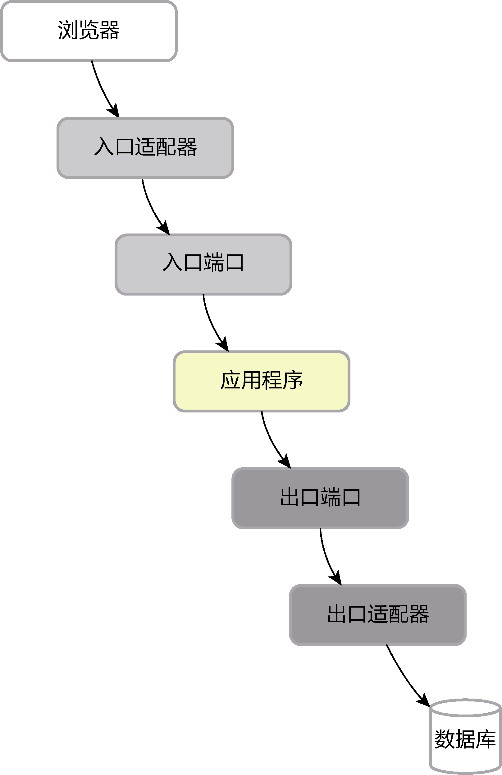

*图12-1 端口与适配器的协作方向*

在Cockburn对六边形架构的初始定义中，应用程序位于六边形边界内部，封装了支持业务功能的领域逻辑。入口端口与出口端口在六边形边界上，前者负责接收外部的入口适配器转换过来的请求，后者负责发送应用程序的请求给外部的出口适配器，由此可以勾勒出一个清晰的六边形，如图12-2所示。

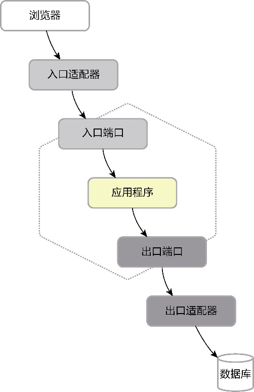

*图12-2 端口所在的六边形*

限界上下文是在专有知识语境下业务能力的体现。这一业务能力固然以领域模型为核心，却必须通过与外部环境的协作方可支持其能力的实现。因此，限界上下文的边界实则包含了对驱动它运行的入口请求的适配与响应逻辑，也包含了对外部设备和数据库的访问逻辑。要将限界上下文与六边形架构结合起来，就需要将入口适配器和出口适配器放在限界上下文的边界内，构成一个外部的六边形，如图12-3所示。

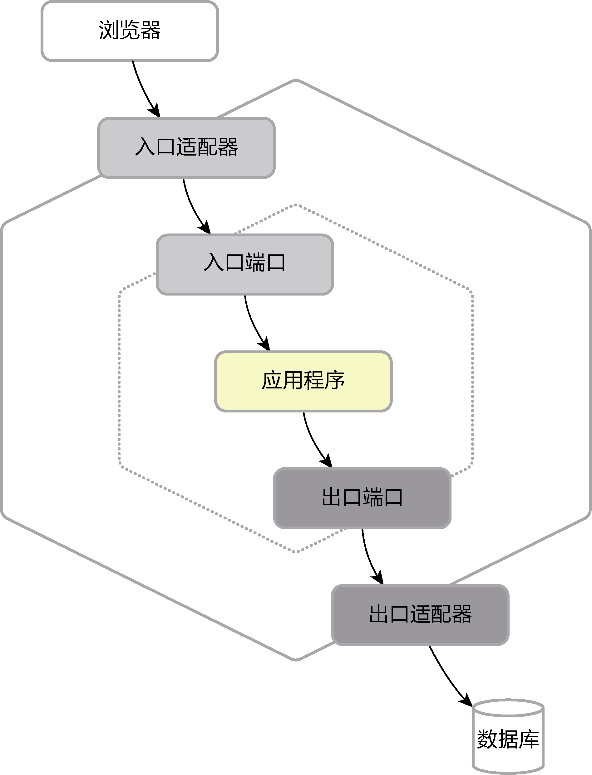

*图12-3 适配器所在的六边形*

六边形架构清晰地勾勒出限界上下文的两个边界。

·外部边界：通过外部六边形将单独的业务能力抽离出来，隔离了不同的业务关注点。我将此六边形称为“应用六边形”。

·内部边界：通过内部六边形将领域单独抽离出来，隔离了业务复杂度与技术复杂度。我将此六边形称为“领域六边形”。

以预订机票场景为例。用户通过浏览器访问订票网站，向订票系统发起订票请求。根据六边形架构，浏览器访问的网站前端位于应用六边形之外，属于驱动应用程序运行的起因。订票请求通过浏览器发送给以REST风格服务契约定义的控制器服务ReservationController。ReservationController作为入口适配器，介于应用六边形与领域六边形之间，在接收到以JSON格式传递的前端请求后，将其转换（反序列化）为入口端口ReservationAppService需要的请求对象。入口端口为应用服务，位于领域六边形的边界之上。当它接收到入口适配器转换后的请求对象后，调用位于领域六边形边界内的领域服务TicketReservation，执行领域逻辑。在执行订票的领域逻辑时，需要向数据库添加一条订票记录。这时，位于领域六边形边界内的领域模型对象会调用出口端口ReservationRepository。出口端口为资源库，位于领域六边形的边界之上，定义为接口，真正访问数据库的逻辑则由介于应用六边形与领域六边形间的出口适配器ReservationRepositoryAdapter实现。该实现访问了数据库，将端口发送过来的插入订票记录的请求转换为数据库能够处理的消息，执行插入操作。该业务场景在六边形架构中的体现如图12-4所示。

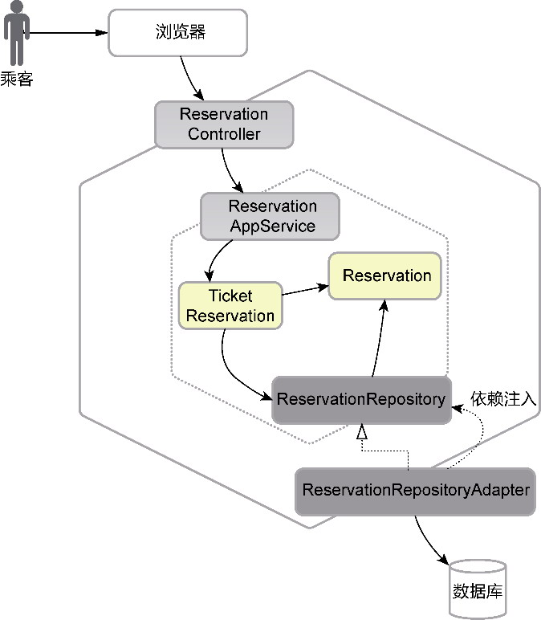

*图12-4 预订机票场景的六边形架构*

六边形架构中的端口是解耦的关键。入口端口体现了“封装”的思想，既隔离了外部请求转换必需的技术实现，如REST风格服务的序列化机制与HTTP请求路由等基础设施功能，又防止了领域模型向外泄露，因为端口公开的服务接口方法已经抹掉了领域模型的信息。出口端口体现了“抽象”的思想，它通常被定义为抽象接口，不包含任何具体访问外部设备和数据库的实现。入口端口抵御了外部资源可能对当前限界上下文造成的侵蚀，因此，入口适配器与入口端口之间的关系是一个依赖调用关系；出口端口隔离了领域逻辑对技术实现以及外部框架或环境的依赖，因此，出口适配器与出口端口之间的关系是接口实现关系。

#### 12.1.2 整洁架构思想

Robert Martin总结了六边形架构以及其他相似架构（如DCI架构）的共同特征，他认为：“它们都具有同一个设计目标：按照不同关注点对软件进行切割。也就是说，这些架构都会将软件切割成不同的层，至少有一层只包含该软件的业务逻辑，而用户接口、系统接口则属于其他层。”^限界上下文同样是对软件系统的切割：外部切割的方向是领域维度的业务能力；内部切割的方向是技术维度的关注点，体现清晰的层次结构。内部切割的层次结构也应遵循整洁架构(clean architecture)^的思想。Robert Martin使用图12-5体现整洁架构。

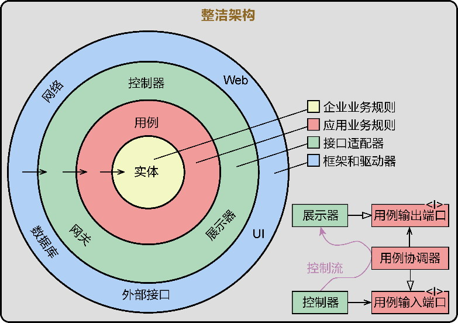

*图12-5 整洁架构*

该架构思想提出的模型是一个类似内核模式的内外层架构。由内及外分为4层，包含的内容分别为：

·企业业务规则；

·应用业务规则；

·接口适配器；

·框架和驱动器。

解密整洁架构模型，可以发现许多值得深思的架构特征。

·不同层次的组件的变化频率不相同，引起变化的原因也不相同。

·层次越靠内的组件依赖的内容越少，处于核心的业务实体没有任何依赖。

·层次越靠内的组件与业务的关系越紧密，属于特定领域的内容，因而难以形成通用的框架。

·业务实体封装了企业业务规则，准确地讲，它组成了面向业务的领域模型。

·应用业务规则层是打通内部业务与外部环境的一个通道，因而提供了输出端口与输入端口，但它对外呈现的接口是一个用例，体现了系统的应用逻辑。

·接口适配器层包含了网关、控制器与展示器，用于打通应用业务逻辑与外层的框架和驱动器。

·位于外部的框架与驱动器负责对接外部环境，不属于限界上下文的范畴，但选择这些框架和驱动器，是设计决策要考虑的内容。

遵循整洁架构思想的限界上下文就是要根据变化的速率与特征进行切割，定义一个由同心圆组成的内外分离的架构模型。该模型的每个层次体现了不同的关注点，维持了清晰的职责边界。在这个架构模型中，外层圆代表的是机制，内层圆代表的是策略^。机制属于技术实现的细节，容易受到外界环境变化的影响；策略与业务有关，封装了限界上下文最为核心的领域模型，最不容易受到外界影响而变化。遵循稳定依赖原则(stable dependencies principle)^，一个软件元素应该依赖于比自己更稳定的软件元素，因此，依赖方向应该从外层圆指向内层圆，以保证核心的领域模型更加纯粹，不对外部易于变化的事物形成依赖，隔离了外部变化的影响。

整洁架构与六边形架构一脉相承。六边形架构中的应用六边形与领域六边形就是根据变化速率对关注点的切割，位于外层的适配器分别通过职责委派与接口实现依赖了内部对应的端口，端口又依赖了内部的领域模型。

但是，六边形架构仅仅区分了内外边界，提炼了端口与适配器角色，却没有规划限界上下文内部各个层次与各个对象之间的关系；整洁架构又是通用的架构思想，提炼的是企业系统架构设计的基本规则与主体。二者都无法完美地契合限界上下文的架构诉求。因此，当我们将六边形架构与整洁架构思想引入限界上下文时，还需要引入分层架构给出更为细致的设计指导，即确定层、模块和角色构造型（参见第16章）之间的关系。

#### 12.1.3 分层架构

分层架构是运用最为广泛的架构模式，几乎每个软件系统都需要通过层(layer)来隔离不同的关注点(concern point)，以此应对不同需求的变化，使得这种变化可以独立进行。Scott Millett等人解释了在领域驱动设计中引入分层架构模式的原因和目的：“为了避免将代码库变成大泥球并因此减弱领域模型的完整性且最终减弱可用性，系统架构要支持技术复杂度与领域复杂度的分离。引起技术实现发生变化的原因与引起领域逻辑发生变化的原因显然不同，这就导致基础设施和领域逻辑问题会以不同速率发生变化。”^104

引起变化的原因不同导致了变化的速率不同，体现了单一职责原则(single-responsibility principle，SRP)。Robert Martin认为单一职责原则就是“一个类应该只有一个引起它变化的原因”^，换言之，如果有两个引起类变化的原因，就需要将类分离。若将单一职责原则运用到分层架构模式，考虑的变化粒度就是层。

软件的经典三层架构自顶向下由用户界面层(user interface layer)、业务逻辑层(business logic layer)和数据访问层(data access layer)组成，如图12-6所示。

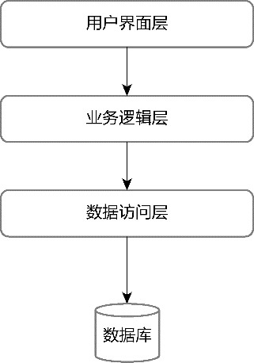

*图12-6 经典三层架构*

经典三层架构在过去的大多数企业系统中得到广泛运用，这有其历史原因：在提出该分层架构模式的时代，多数企业系统往往较为简单，本质上都是采用客户端-服务器风格的数据库管理系统，对业务的处理就是对数据库的管理，而用户界面的呈现与业务逻辑并未在物理上分离。如果在逻辑上不加以解耦，就无法有效隔离界面呈现、业务功能与数据访问，代码纠缠在一起，形成大泥球一般的代码库。分层满足了职责分类的要求。

领域驱动设计在经典三层架构的基础上做了改良，在用户界面层与业务逻辑层之间引入了新的一层，即应用层。同时，层次的命名也发生了变化。业务逻辑层被更名为领域层自然是题中应有之义，而将数据访问层更名为基础设施层，则突破了之前数据库管理系统的限制，扩大了这个负责封装技术复杂度的基础逻辑层的内涵。图12-7为Eric Evans定义的分层架构^43。

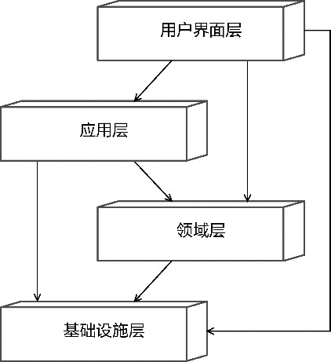

*图12-7 领域驱动设计的分层架构*

Eric Evans对各层的职责做了简单的描述^44，如表12-1所示。

*表12-1 层的职责*

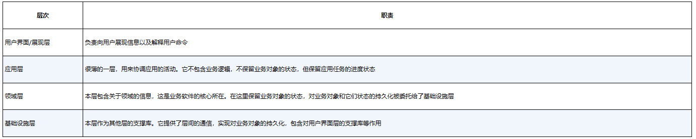

视分层为一个固有的架构模式，其滥觞应为Frank Buschmann等人著的《面向模式的软件架构（卷1）：模式系统》。Buschmann等人对分层的描述为：“分层架构模式有助于构建这样的应用：它能被分解成子任务组，其中每个子任务组处于一个特定的抽象层次上。”^

所谓的“分层”是逻辑上的分层，为一种水平的抽象层次。既然为水平的分层，必然存在层的高与低，抽象层次的不同，又决定了分层的数量。因此，为了理解分层架构，我们需要解决如下问题：

·分层的依据与原则是什么；

·层与层之间是怎样协作的。

**1.分层的依据与原则**

之所以要以水平方式对整个系统进行分层，是因为我们下意识地确定了一个认知规则：机器为本，用户至上。机器是运行系统的基础，但我们打造的系统却是为用户提供服务的。分层架构中的层次越往上，其抽象层次就越面向业务、面向用户；分层架构中的层次越往下，其抽象层次就变得越通用、面向设备。为什么经典分层架构为三层架构？正是源于这样的认知规则：向上，面向用户的体验与交互；居中，面向应用与业务逻辑；向下，面对各种外部资源与设备。

在为系统建立分层架构时，完全可以基于经典三层架构，沿着水平方向进一步切分属于不同抽象层次的关注点。因此，分层的第一个依据是基于关注点为不同的调用目的划分层次。领域驱动设计的分层架构之所以要引入应用层，目的就是给调用者提供完整的业务用例，使调用者无须与细粒度的领域模型对象直接协作。

分层的第二个依据是面对变化。分层时应针对不同的变化原因确定层次的边界，严禁层次之间互相干扰，或者至少将变化对各层带来的影响降到最低。例如，对数据库结构的修改会影响到基础设施层的数据模型以及领域层的领域模型，但当我们仅需修改基础设施层中数据库访问的实现逻辑时，就不应该影响到领域层了。层与层之间的关系应该是正交的。

我们还应该遵循单一抽象层次原则(SLAP)，运用到分层架构，就是确保同一层的组件处于同一个抽象层次。

**2.层之间的协作**

在大多数人的固有认识中，分层架构的依赖都是自顶向下传递的。从抽象层次看，层次越处于下端，就会变得越通用，与具体的业务隔离得越远，从而形成基础设施层。为了避免重复制造轮子，它还会调用位于系统外部的平台或框架，如依赖注入框架、对象关系映射(object relational mapping，ORM)框架、消息中间件等，以完成更加通用的功能。若依赖的传递方向仍然采用自顶向下方式，就会导致包含领域逻辑的领域层依赖于基础设施层，又因为基础设施层依赖于外部平台或框架，使得领域层也将受制于外部平台或框架。

依赖倒置原则(dependency inversion principle，DIP)^提出了对自顶向下依赖的挑战，要求高层模块不应该依赖于低层模块，二者都应该依赖于抽象。这个原则正本清源，给了我们新的思路——谁规定在分层架构中，依赖就一定要沿着自顶向下的方向传递？我们常常理解依赖，是因为被依赖方需要为依赖方（调用方）提供功能支撑。这是从功能复用的角度来考虑的，但不能忽略变化对系统产生的影响！与建造房屋一样，分层的模块需要“构建”在稳定的模块之上。谁更稳定？抽象更稳定。因此，依赖倒置原则隐含的本质是，我们要依赖不变或稳定的元素（类、模块或层），也就是该原则的第二句话：抽象不应该依赖于细节，细节应该依赖于抽象。

这一原则实际是面向接口设计原则的体现，即“针对接口编程，而不是针对实现编程”^。遵循这一原则，作为调用者的高层模块只知道低层模块的抽象，而懵然不知其实现。这样带来的好处是：

·低层模块的细节实现可以独立变化，避免变化对高层模块产生污染；

·编译时，高层模块可以独立于低层模块单独存在；

·对高层模块而言，低层模块的实现是可替换的。

倘若高层依赖于低层的抽象，就必然面对一个问题：如何将具体的实现传递给高层的类？在高层通过接口隔离了对具体实现的依赖，意味着这个具体依赖被转移到了外部，究竟使用哪一种具体实现，应由外部的调用者决定，只有在运行调用者代码时，才将外面的依赖传递给高层的类。Martin Fowler形象地将这种机制称为依赖注入(dependency injection)。

层之间的协作还有可能是自底向上通信，例如在计算机集成制造系统中，往往会由低层的设备监测系统去监测设备状态的变化。当状态发生变化时，需要将变化的状态通知到上层的业务系统。如果说自顶向下的消息传递被描述为“请求”（或调用），则自底向上的消息传递则被形象地称为“通知”。倘若颠倒一下方向，自然也可以视为这是上层对下层的观察，故而可以运用观察者(observer)模式，在上层定义Observer接口，并提供update()方法供下层主体(subject)在感知状态发生变更时调用。

面向接口设计带来了低层实现对高层抽象的依赖，观察者模式带来了低层主体对高层观察者的依赖。它们都体现了分层架构中低层对高层的依赖，颠覆了固有思维形成的自顶向下的依赖方向。

理解了分层的依据和原则，确定了层之间的协作关系，就能够更加自如地运用分层架构。它通过水平抽象体现了关注点分离。只要存在相同抽象层次的关注点，就可以单独为其建立一个逻辑层。抽象层数不是固定的，每一层的名称也不必一定遵循经典的分层架构要求。当然，层的数量需要权衡：层太多，会引入太多的间接而增加不必要的开支；层太少，又可能导致关注点不够分离，使得系统的结构不够合理。

#### 12.1.4 演进为菱形对称架构

回到限界上下文的内部视图。

六边形架构通过外部的应用六边形与内部的领域六边形，将整个限界上下文分隔为图12-8所示的3个区域。

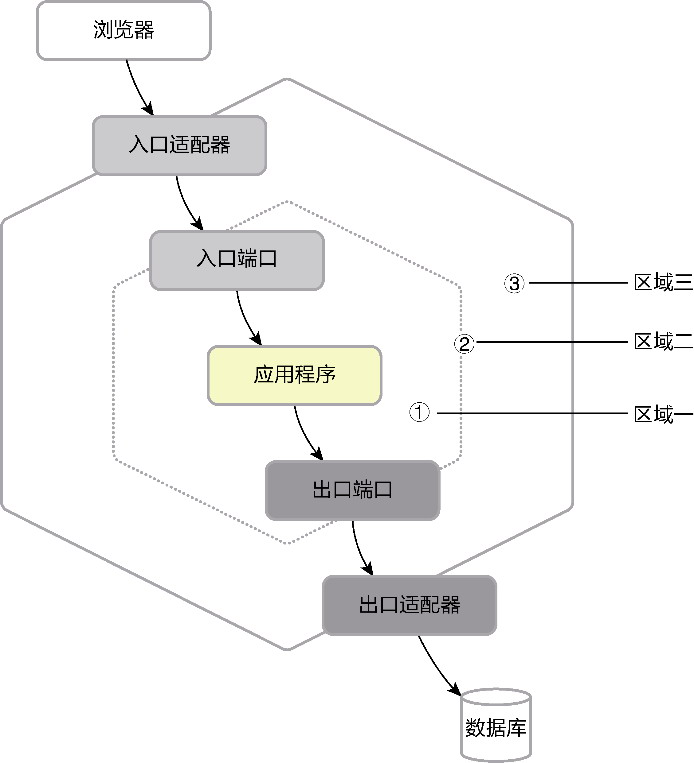

*图12-8 六边形架构分隔的3个区域*

可惜，六边形架构并未对这3个区域命名，这就为团队的协作交流制造了障碍。例如，当团队成员正在讨论一个入口端口的设计时，需要确定入口端口在代码模型的位置，即它的命名空间。我们既不可能说它放在“领域六边形的边线”上，也不可能为该命名空间定义一个冗长的包名，例如currentbc.boundaryofdomainhexagon。命名的目的是交流，然后形成一种约定，就可以使沟通更为默契。因此，我们需要寻找一种“架构的统一语言”，为这些区域命名，如此即可将六边形的设计元素映射到代码模型对应的命名空间。

从关注点分离的角度看，六边形架构实则为隔离内外的分层架构，因此我们完全可以将两个六边形隔离出来的3个区域映射到领域驱动设计的分层架构上。映射时，自然要依据设计元素承担的职责来划分层次。

·入口适配器：响应边界外客户端的请求，需要实现进程间通信以及消息的序列化和反序列化。这些功能皆与具体的通信技术有关，故而映射到基础设施层。

·入口端口：负责协调外部客户端请求与内部应用程序之间的交互，恰好与应用层的协调能力相配，故而映射到应用层。

·应用程序：承担了整个限界上下文的领域逻辑，包含了当前限界上下文的领域模型，毫无疑问，应该映射到领域层。

·出口端口：作为一个抽象的接口，封装了对外部设备和数据库的访问，由于它会被应用程序调用，遵循整洁架构内部层次不能依赖外部层次的原则，只能映射到领域层。

·出口适配器：访问外部设备和数据库的真正实现，与具体的技术实现有关，应该映射到基础设施层。

如此就建立了六边形架构与领域驱动分层架构之间的映射关系，如图12-9所示。

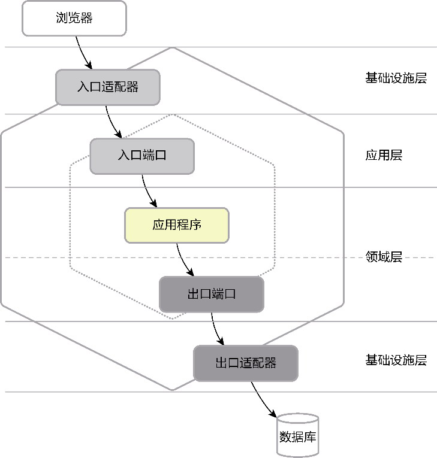

*图12-9 六边形架构与分层架构*

通过这一映射，我们为六边形架构的设计元素找到了统一语言。例如，入口端口属于应用层，它的命名空间自然应命名为currentbc.application。这一映射关系与命名规则实则为指导团队开发的架构原则。当团队成员在讨论设计方案时，一旦确定该类属于入口端口，大家就都能知道它归属于应用层，定义在application命名空间下。

在确定分层架构与六边形架构的映射关系时，对出口端口的层次映射显得非常勉强，二者在设计概念上存在冲突。六边形架构的出口端口用于抽象领域模型对外部环境的访问，位于领域六边形的边线之上。根据分层原则，我们应该将介于领域六边形与应用六边形的中间区域划分到基础设施层；根据六边形架构的协作原则，领域模型若要访问外部资源，又需要调用出口端口；根据整洁架构思想，位于内部的领域层不能依赖外部的基础设施层，自然也就不能依赖出口端口了。

要消弭设计原则的矛盾，唯一的办法是将出口端口放在领域层。对访问数据库的出口端口而言，领域驱动设计定义的资源库（参见第15章）就放在了领域层。将资源库放在领域层确有论据佐证，毕竟，在抹掉数据库技术的实现细节后，资源库的接口方法就是对聚合（参见第15章）的管理，包括查询、修改、增加和删除行为。这些行为也可视为领域逻辑的一部分。然而，领域模型要访问的外部环境不仅限于数据库，还包括文件、网络和消息队列等，也包括别的限界上下文与目标系统之外的伴生系统。为了隔离领域模型与外部环境，同样需要为它们定义抽象的出口端口。它们又该放在哪里呢？

如果仍然将这些出口端口放在领域层，就很难自圆其说。例如，出口端口EventPublisher负责将事件发布到消息队列，如果放在领域层，即使作为抽象接口不提供任何具体实现，也会显得不伦不类。如果将其移出，放在外部的基础设施层，又违背了整洁架构思想。如果将资源库从其他出口端口单独剥离出来，又破坏了六边形架构对端口定义的一致性。

与其如此纠结，不如尝试突破观念！

我们可以将六边形架构看作一个对称的架构：以领域为轴心，入口适配器与出口适配器是对称的，入口端口与出口端口也是对称的。同时，适配器又必须和端口对应，如此方可保证架构的松耦合。剖析端口与适配器的本质，实质上都是对外部系统或外部资源的处理，只是处理的方向各有不同。Martin Fowler将“封装访问外部系统或资源行为的对象”定义为网关^，引入限界上下文的内部架构，就代表了领域层与外部环境之间交互的出入口，即：

网关 = 端口 + 适配器

网关统一了端口和适配器。根据入口与出口方向的不同，为了体现它所处的方位，我将网关分别命名为北向网关(northbound gateway)与南向网关(southbound gateway)。

北向网关提供了由外向内的访问通道。这一访问方向符合整洁架构的依赖方向，因此不必对北向网关元素进行抽象，只需为外部的调用者提供服务契约。为了避免内部领域模型的泄露，北向网关的服务契约不能直接暴露领域模型对象，需要为组成契约的方法参数和返回值定义专门的模型。该模型主要用于调用者的请求和响应，因而称为“消息契约模型”。北向网关的服务契约必须调用领域模型的业务方法才能满足调用者的请求，由于领域模型并不知道消息契约模型，需要北向网关负责完成这两个模型之间的互换。北向网关既要对外提供服务契约，又要对内完成模型的转换，相当于同时承担了端口与适配器的作用，因而不再区分入口端口和入口适配器。限界上下文的外部请求可能来自进程外，也可能来自进程内，进程内外的差异，决定了通信协议的不同。有必要根据进程的边界将北向网关分为本地网关与远程网关，前者支持进程内通信，后者用于进程间通信。

南向网关负责封装领域层对外部环境的访问。所谓“外部环境”，包括如数据库、消息队列、文件系统之类的环境资源，也包括目标系统内的上游限界上下文与目标系统外的伴生系统，它们也是组成整洁架构的最外层圆环，包含了具体的技术细节。这些外部环境变化的方向和频率与领域模型完全不同，需要分离抽象接口与具体实现，也就是六边形架构的出口端口与出口适配器，它们共同组成了南向网关。南向网关的命名已经代表了出口方向，因此无须区分入口和出口，可直接命名为端口与适配器。端口未提供任何实现，即使被领域层的领域模型调用，也不会将技术实现混入领域逻辑中。运行时，系统通过依赖注入将适配器实现注入领域层，满足领域逻辑对外部设备的访问需求。

整个对称架构的结构如下所示：

·

      北向网关

·远程

·本地

·领域

·

      南向网关

·端口

·适配器

六边形架构的入口适配器与入口端口在对称架构中被合并为北向网关，并依据通信协议的区别分为远程网关与本地网关；出口端口与出口适配器共同组成了南向网关，在对称架构中分别代表南向网关的抽象和实现。如此，即构成了图12-10所示的由内部领域模型与外部网关组成的对称架构。

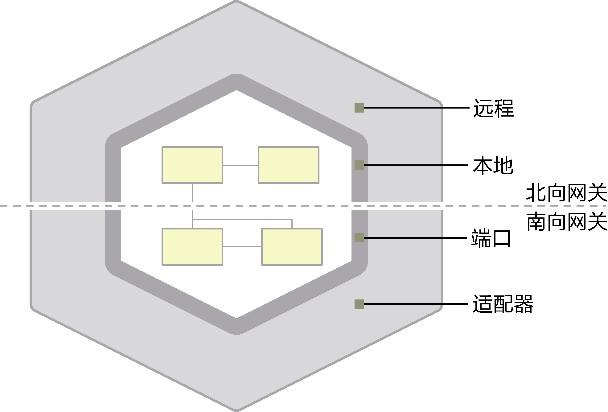

*图12-10 内部领域模型与外部网关组成的对称架构*

对称架构凸显了领域层的重要地位，抹去了领域驱动设计原有分层架构中的基础设施层与应用层，以对称的外部网关层代替。在限界上下文内部，网关层为领域层与外部环境之间的协作提供支撑，二者的区别仅在于方向。

该对称架构虽脱胎于六边形架构与分层架构，却又有别于二者。对称架构北向网关定义的远程网关与本地网关同时承担了端口与适配器的职责，这实际上改变了六边形架构端口-适配器的风格。领域层与南北网关层的内外分层结构，以及南向网关规定的端口与适配器的分离，又与领域驱动设计的分层架构渐行渐远。为了更好地体现这一架构模式的对称特质，我换用菱形结构来表达，将其称为菱形对称架构(rhomboid symmetric architecture)，如图12-11所示。

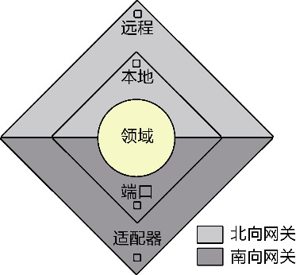

*图12-11 菱形对称架构*

#### 12.1.5 菱形对称架构的组成

菱形对称架构从分层架构与六边形架构汲取了营养，形成了以领域为轴心的内外分层对称结构，以此作为推荐的限界上下文内部架构。考虑到目前的系统多采用前后端分离的架构，且前端UI的设计更多是从用户体验的角度对视图元素进行划分，与限界上下文的边界划分并不吻合，因此，限界上下文边界并未将前端UI包含在内。一个遵循了菱形对称架构的限界上下文包括的设计元素有：

·北向网关的远程网关；

·北向网关的本地网关；

·领域层的领域模型；

·南向网关的端口抽象；

·南向网关的适配器实现。

限界上下文以领域模型为核心向南北方向对称发散，在边界内形成了清晰的逻辑层次。内部领域层与外部网关层恰好体现了业务复杂度与技术复杂度的分离。每个组成元素之间的协作关系表现了清晰直观的自北向南的调用关系。仍以预订机票场景为例，参与该场景的各个类在菱形对称架构下的位置与协作关系如图12-12所示。

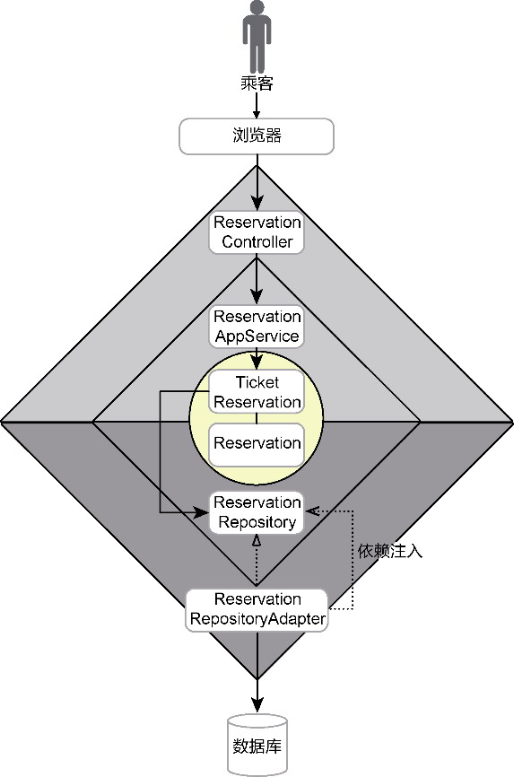

*图12-12 预订机票的菱形对称架构*

本地网关ReservationAppService映射为领域驱动设计元模型中的应用服务，对外提供了完整的预订机票用例，对内调用了领域层的领域模型对象。为了支持分布式调用，在本地网关之上定义了远程网关ReservationController，它是一个面向前端视图遵循MVC模式设计的远程服务。端口ReservationRepository映射为领域驱动设计元模型中的资源库，是对数据库访问的抽象。适配器ReservationRepositoryAdapter提供了该端口的实现。领域层的领域服务TicketReservation调用了端口，并在运行时将适配器注入领域服务，以支持机票预订记录的持久化。

资源库作为端口

资源库作为南向网关的端口，颠覆了领域驱动设计对资源库的定位。资源库的作用在于管理聚合的生命周期，将资源库接口视为领域模型的一部分，是领域驱动设计的一条重要指导原则。即便如此，我仍然愿意将资源库放到南向网关。无论资源库是什么，它本质上起到了分离领域行为与持久化行为的作用。它的操作单元是聚合，一个聚合对应一个资源库。聚合是领域模型中最小的自治单元，为了保证领域模型的稳定性，它不会依赖于任何外部资源，甚至不应该感知到资源库的存在，只有领域服务才需要与资源库协作。为了隔离领域模型与数据库的持久化，有必要对资源库进行抽象，这不正是端口与适配器应该履行的职责吗？数据库如此，其他外部资源与环境同样如此。如果我们对所有的外部环境一视同仁，皆以端口抽象之，以适配器封装内部的技术细节，就能保证架构方案的简单性。

资源库需要操作领域模型，领域模型中的领域服务又依赖抽象的端口，这可能导致领域层与南向网关的端口之间形成双向依赖。考虑到菱形对称架构的领域层与网关层仅仅是一种逻辑划分，只要确保二者在编译时放在同一个模块中，这样的双向依赖就是可以接受的。为了保证领域模型的纯粹性，端口与适配器之间的分离才是至关重要的。

菱形对称架构规定，只有外部网关层可以访问内部的领域层。这符合整洁架构的设计原则，唯一的例外是内部领域层对外部南向网关端口的依赖。但由于端口都是抽象的，它仍然遵循稳定依赖原则和依赖倒置原则。

菱形对称架构完全满足限界上下文的自治特征。菱形的边界即限界上下文的边界，以最小完备的方式实现了领域模型的知识语境；内部的领域模型自成一体，以自我履行的方式响应外部网关对它的调用，满足业务能力的服务要求；远程网关与本地网关对领域模型的封装，避免了内部的变化对外部的调用者产生影响，满足了限界上下文的独立进化能力；端口对外部资源访问的抽象，防止了外部的变化对领域模型的影响，使得限界上下文的内部成为稳定空间。显然，菱形对称架构对自治架构单元的呼应，能够更好地保证限界上下文具有响应变化的演进能力。

菱形对称架构通过外部网关层构筑了限界上下文的边界，它包裹的领域模型通常采用领域建模驱动设计获得，使得架构映射阶段与领域建模阶段形成了过程的衔接。针对不同的业务场景，在网关边界的保护下，也可以采用不同方式建立领域模型，例如，针对业务操作主要为“增删改查”的业务场景，采用事务脚本与贫血模型也未尝不可；在一些特殊场景下，如统计分析或CQRS的查询场景，领域模型甚至可以被弱化至无，即领域模型对象等同于数据模型和消息契约模型。这样的菱形对称架构可以称为弱化的菱形对称架构，但仍然满足了限界上下文的“独立进化”和“稳定空间”特性。在架构层面，它与采用领域建模形成领域模型的常规菱形对称架构并无差异，仍然是自治的架构单元。

#### 12.1.6 引入上下文映射

菱形对称架构还能有机地与上下文映射模式结合起来，充分展现了这一架构风格更加适用于领域驱动设计。二者的结合主要体现在北向网关与南向网关对上下文映射模式的借用。

**1.引入开放主机服务**

对比上下文映射的通信集成模式，开放主机服务模式的设计目标与菱形对称架构的北向网关完全一致。开放主机服务为限界上下文提供对外公开的一组服务，以便下游限界上下文方便地调用它。根据限界上下文通信边界的不同，进程内通信调用本地网关，进程间通信调用远程网关。二者都遵循开放主机服务模式。

为了更好地体现上下文映射模式，可以将北向网关的远程网关和本地网关分别命名为远程服务和本地服务。

远程服务是为跨进程通信定义的开放主机服务。根据通信协议和消费者的差异，远程服务可分为资源服务、控制器服务、供应者服务和订阅者服务。它们分别属于服务资源契约、服务行为契约和服务事件契约（参见第11章）。

本地服务是为进程内通信定义的开放主机服务，对应于应用层的应用服务。引入应用服务的价值在于：

·对领域模型形成了一层间接的外观层，避免领域模型泄露；

·对于进程内协作的限界上下文，降低了跨进程调用的通信成本与序列化成本。

根据服务契约与调用方的不同，远程服务可以分为如下4种。

·资源(resource)服务：服务资源契约，面向下游限界上下文或第三方调用者，服务的消息契约模型由请求消息与响应消息组成。

·控制器(controller)服务：服务资源契约，面向UI前端，服务的消息契约模型为面向前端的展现(presentation)模型。

·提供者(provider)服务：服务行为契约，面向下游限界上下文或第三方调用者，服务的消息契约模型由请求消息与响应消息组成。

·订阅者(subscriber)服务：服务事件契约，服务的消息契约模型就是事件。

无论是什么类型的远程服务，一旦它接收到外部请求，都必须经由应用服务才能发起对领域层的调用请求。

**2.引入防腐层**

如果将防腐层防止腐化的目标从上游限界上下文扩大至当前限界上下文的所有外部环境，包括如数据库、消息队列这样的环境资源，也包括目标系统外的伴生系统，防腐层就承担了菱形对称架构南向网关的角色。其中，南向网关的端口提供了抽象，并由适配器封装访问外部环境的具体实现，它们共同组成了防腐层。

根据一个限界上下文与之协作的外部环境的不同，端口可以分为如下3种。

·资源库(repository)端口：隔离对外部数据库的访问，对应的适配器提供聚合的持久化能力。

·客户端(client)端口：隔离对上游限界上下文或第三方服务的访问，对应的适配器提供对服务的调用能力。

·发布者(publisher)端口：隔离对外部事件总线的访问，对应的适配器提供发布事件消息的能力。

若限界上下文还需要与其他外部环境，如文件、网络，也可以定义其他对应的端口。

**3.引入发布语言**

保证限界上下文自治的一个关键在于隔离领域模型。除了共享内核模式和遵奉者模式，限界上下文应尽量避免将领域模型暴露在外，因此需要为北向网关的服务建立消息契约模型。远程服务和应用服务的方法定义不应包含领域模型对象，而应采用消息契约模型。

当南向网关需要访问上游的限界上下文时，倘若上游也采用了菱形对称架构，南向网关的客户端就需要调用（复用）上游限界上下文定义的消息契约模型。如果这两个限界上下文不在同一进程，下游无法复用上游的消息契约模型，则需要定义与之对应的消息契约模型。由于南向网关的客户端端口会被领域层的领域服务调用，为了避免消息契约模型对领域模型造成污染，客户端端口的定义不应该牵涉到任何消息契约模型，对消息契约模型的调用或定义仅放在（或者隔离在）客户端适配器。

北向网关和南向网关的消息契约模型组成发布语言。

引入发布语言后，通常由北向网关的应用服务完成（或调用）消息契约模型与领域模型之间的转换。有时，远程服务与它调用的应用服务采用的消息契约模型并不相同，还需要完成两种不同消息契约模型的转换。同理，南向网关的客户端适配器也可能需要完成消息契约模型与领域模型之间的转换。

#### 12.1.7 改进的菱形对称架构

当我们将上下文映射模式引入菱形对称架构后，整个架构的设计元素变得更加简单，各层之间的关系与边界也更加清晰。它也可以体现为一种全新的分层架构，菱形对称架构与分层架构之间的关系如图12-13所示。

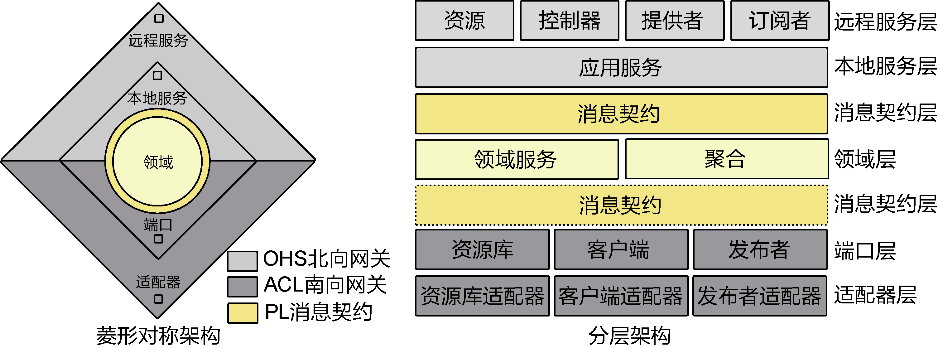

*图12-13 菱形对称架构与分层架构*

菱形对称架构对领域驱动设计的分层架构做出了调整。用户展现层被当作外部资源推到限界上下文的边界之外，还去掉了应用层和基础设施层的概念，以统一的网关层进行概括，并以北向与南向分别体现来自不同方向的请求。原本属于应用层的应用服务放在了北向网关，位于领域层的资源库则被推向了外部的南向网关，由此形成的对称结构突出了领域模型的核心作用，更加清晰地体现了业务逻辑、技术功能与外部环境之间的边界。遵循菱形对称架构的限界上下文代码模型如下：

```
currentcontext
   - ohs(northbound)
      - remote
         - controller
         - resource
         - provider
         - subscriber
      - local
         - appservice
      - pl(message)
   - domain
   - acl(southbound)
      - port
         - repository
         - client
         - publisher
      - adapter
         - repository
         - client
         - publisher
      - pl(message)
```

该代码模型使用了上下文映射的模式名，ohs代表开放主机服务模式，pl代表发布语言，acl代表防腐层模式，当然，我们也可以使用北向（northbound或north）与南向（sourthbound或sourth）取代ohs与acl作为包名，使用消息(message)契约取代pl的包名。这取决于不同团队对这些设计要素的认识。无论如何，作为整个系统的架构师，一旦确定在限界上下文层次运用菱形对称架构，就意味着向团队成员传递了统一的设计元语，潜在地给出了架构的设计原则与指导思想，即维持领域模型的清晰边界，隔离业务复杂度与技术复杂度，并将限界上下文之间的协作通信隔离在领域模型之外。

#### 12.1.8 菱形对称架构的价值

菱形对称架构可以更加清晰地展现上下文映射模式之间的差异，并凸显防腐层与开放主机服务的重要性，遵循菱形对称架构的领域驱动架构亦能够更好地响应变化。

**1.展现上下文映射模式**

让我们以查询订单业务场景来展现菱形对称架构对上下文映射模式的体现。

查询订单时，需要获取订单项对应商品的商品信息，即产生订单上下文与商品上下文的协作关系，进而产生两个限界上下文的模型依赖。随着设计视角的变化，选择的上下文映射模式也在相应发生变化，菱形对称架构可以清晰地体现这一变化。

上游的商品上下文团队总是高高在上，不大愿意理睬下游团队的呼唤，而下游团队又不愿意抛开上游团队另起炉灶，就会无奈选择遵奉者模式。或者，如果认为商品上下文设计的领域模型足够稳定，且具有非常大的复用价值，就可以主动选择共享内核模式。它们的共同特点都是复用上游的领域模型，此时的模型依赖应准确地描述为领域模型的依赖，通过菱形对称架构，可以表现为图12-14。

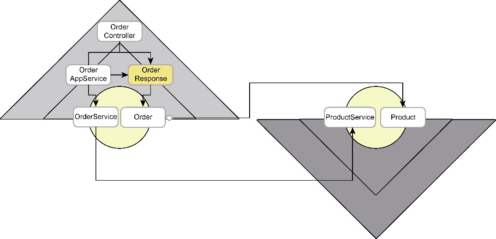

*图12-14 遵奉者或者共享内核*

图12-14清晰地展现了复用领域模型会突破菱形对称架构北向网关修筑的堡垒，让商品上下文的领域模型直接暴露在外。下游限界上下文修筑的南向网关防线也形同虚设，因为它被领域层的OrderService“完美”地忽略了。

如果订单上下文与商品上下文位于同一进程，根据菱形对称架构的定义，位于下游的订单上下文可以通过其南向网关发起对商品上下文北向网关中应用服务的调用。为了保护领域模型，商品上下文在北向网关中还定义了消息契约模型，表现为图12-15。

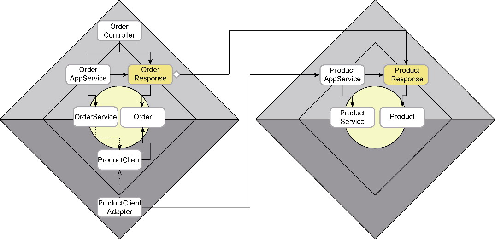

*图12-15 防腐层与开放主机服务的应用服务*

此时的菱形对称架构体现了防腐层模式与开放主机服务模式的共同协作，两边的领域模型互不知情，但为了避免重复的模型定义，位于下游的订单上下文直接复用了上游定义的消息契约模型类ProductResponse，以减少转换消息模型对象的成本。此时的“模型依赖”可以视为对“消息契约模型的依赖”，由于南向网关中的ProductClient端口对调用关系进行了抽象，防腐层的价值仍然存在。

虽然ProductClientAdapter直接复用了上游的ProductResponse类，但是，在ProductClient端口的接口定义中，却不允许出现上游的消息契约模型，否则就会让消息契约模型侵入订单上下文的领域模型中。为此，南向网关客户端端口的接口方法应操作自己的领域模型，然后由适配器完成消息契约模型与领域模型的转换。

如果订单上下文与商品上下文位于不同进程，它们之间就不存在模型依赖了，需各自定义自己的模型对象。例如，订单上下文南向网关的ProductClientAdapter调用了商品上下文北向网关的外部服务ProductResource，该服务操作的消息契约模型为ProductResponse。为了支持消息反序列化，就需要在订单上下文的南向网关定义与之一致的ProductResponse类，如图12-16所示。

如图12-16所示，在各自限界上下文内部定义各自的消息契约模型，彻底解除了两个限界上下文之间的“模型依赖”，南向网关防腐层与北向网关开放主机服务也降低了两个限界上下文的耦合。

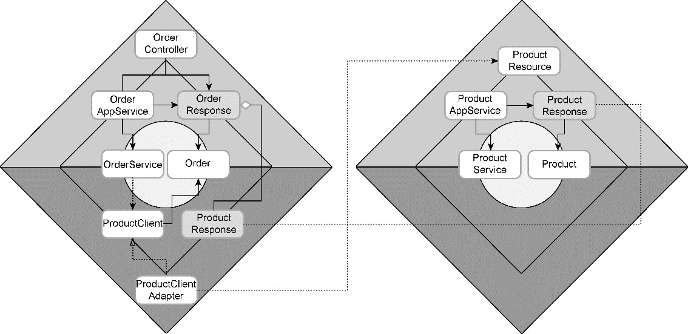

*图12-16 防腐层与开放主机服务的远程服务*

模型依赖的解除并不意味着两个限界上下文是彻底解耦的。即使它们各自定义了自己的消息契约模型，斩断了因为复用模型引起的依赖链条，却仍然存在隐含的逻辑概念映射关系，这一映射关系体现为对变化的级联反应。假如电商平台要求为销售的所有商品添加一个“是否绿色环保”的新属性，为此，商品上下文领域层的Product类新增了isGreen属性，对应地，北向网关层定义的ProductResponse类也需随之调整。这一知识的变更也会传递到下游的订单上下文。当然，通过对开放主机服务进行版本管理，或在下游引入防腐层进行隔离保护，一定程度可维持订单上下文领域模型的稳定性。但是，如果需求要求商品信息必须呈现“是否绿色环保”的属性，就只能修改订单上下文中ProductResponse类的定义了。

若真正体会了限界上下文作为知识语境的业务边界特征，就可以将订单包含的商品信息视为订单上下文的领域模型。隐含的统一语言为“已购商品”，与商品上下文的商品属于不同的领域概念，位于不同的业务边界，但共享同一个productId。

在订单上下文中，已购商品对应的领域类Product作为Order聚合的组成部分，它的生命周期与Order的生命周期绑定在一起，统一由OrderRepository管理。这意味着在保存订单时，业已保存与订单相关的商品信息，在获取订单及其商品信息时，无须求助于商品上下文。此时，查询订单的业务场景不会带来二者之间的协作关系，形成了分离方式的上下文映射模式，如图12-17所示。

或许有人会提出疑问：订单上下文的商品信息仅包含了订单需要的商品基本信息，若需获取更多商品信息，是否意味着订单上下文需要向商品上下文发起请求呢？其实不然，因为这一请求并非由订单上下文发起，而是通过客户在前端点击商品的“查看详情”按钮发起调用。由于页面已经包含了productId的值，前端可直接向商品上下文的远程服务ProductController发起调用请求，与订单上下文无关。

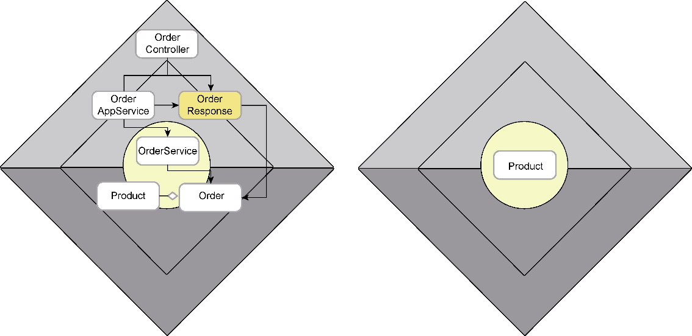

*图12-17 分离方式*

上述3种场景以及对上下文映射模式的运用，模拟了模型依赖的3种形式。

·消息契约模型依赖：上下文映射采用防腐层与开放主机服务模式结合的模式，下游上下文可以直接复用上游上下文的消息契约模型，也可以各自定义，但在逻辑概念上仍然存在依赖关系。

·领域模型依赖：上下文映射采用共享内核或遵奉者模式，下游上下文的领域模型直接复用上游上下文的领域模型。

·无模型依赖：上下文映射采用分离方式模式，限界上下文根据自己的知识语境定义自己的领域模型，从而解除了对上游的模型依赖关系。

第一种形式最为常见，菱形对称架构的南向网关与北向网关充分凸显其价值，尽可能地消除了两个限界上下文之间的耦合。

第二种形式青睐“复用”的价值，尝试满足DRY原则（即Don’t Repeat Yourself，不要重复你自己）^，力图保证整个系统只有一处表达领域概念的知识。当领域概念发生变化时，就可以做到只修改一处，避免了霰弹式修改^。但是，在领域驱动设计中，DRY原则的适用范围应为限界上下文，即只在一个限界上下文中考虑消除重复，因为过度强调复用会带来依赖的代价。

复用领域模型的决定无法预知未来的变化。一旦两个限界上下文对相同的领域模型产生了不同的需求，变化的方向就会变得不一致。于是乎，修改开始发散。谁都希望复用它，复用的理由却各不相同，使得它承担的职责越来越多，导致引起它变化的原因也越来越多，慢慢就会沦为低内聚的领域模型对象。设计从最初对霰弹式修改的规避，走向了另一个极端，产生了发散式变化^。

相较于重复，限界上下文之间的高度耦合更是不可原谅的缺点。在两个或多个限界上下文之间复用领域模型是一种危险的选择。下游限界上下文缺少南向网关的隔离，使得它无法抵御外界的影响，违背了“稳定空间”的自治特性；上游限界上下文缺少北向网关的统一接口定义，使得它轻易地将领域模型的变化传递给外界，违背了“独立进化”的自治特性。这也正是菱形对称架构引入网关层的原因。

第三种形式真正展现了限界上下文是领域模型知识语境的本质，也体现了最小完备的自治性。然而，采取分离方式建立领域模型会否引入数据冗余与同步的问题？这需要针对具体的业务场景进行分析。

第一种场景：数据存于一处，领域模型存在业务边界，但数据模型建立了关联关系。例如，订单上下文与商品上下文的领域模型都定义了Product类，但数据库只有一张商品数据表。OrderRepository在管理Order聚合的生命周期时，同时管理该聚合内部Product实体的生命周期。虽然领域概念分属不同的限界上下文，但OrderRepositoryAdapter操作的商品表就是商品上下文ProductRepositoryAdapter操作的商品表，只是操作的数据列存在差异。这一实现方式体现了领域模型和数据模型具有一定程度的无关性。领域模型在不同限界上下文中是分离的，数据模型在数据库中却可以定义在一张表中，只需在对象与关系的映射中定义不同的映射关系。当然，从领域建模的角度讲，应遵循领域模型来设计数据模型，保持二者的一致性。因此，这一设计方式本身不值得推荐。

第二种场景：数据按照不同的业务边界通过分库或者分表来分散存储，用相同的ID保持关联。如此既维护了领域的边界，也维护了数据的边界。这一设计突出了限界上下文的边界保护作用，更易于从单体架构向微服务架构迁移。该设计对业务边界的要求更高，对属性定义也更为苛刻。它不允许在不同的业务边界出现相同业务含义的属性，否则就会导致数据冗余，进而带来数据同步的问题。

例如，订单上下文内部的Product类对应了订单库中的商品表，商品上下文内部的Product类对应了商品库中的商品表，它们之间通过ProductId保证商品的唯一性。如果两个上下文的Product类都定义了name属性，就意味着两个商品表存在相同的name数据列。当一张表的name值进行了修改，就必须同步该修改另一张表。要规避这种情况，就必须守住限界上下文的领域模型边界。例如订单上下文的Product类就不应该定义name属性，如果需要获取商品名，应通过商品上下文获得。这一设计遵循了自治单元的“最小完备”性。

第三种场景：数据虽然看似存在冗余，实则在进入各自的限界上下文边界后，已经割裂了彼此之间的关系，不再依据相同的变化原因。

例如，订单上下文定义的Product类包含了price属性，商品上下文的Product类也定义了该属性。这是否导致数据冗余，当商品上下文的商品价格被修改后，需要同步保存在订单中的商品价格吗？答案是否定的。在客户提交订单后，订单包含的商品价格就与商品上下文脱离了关系，被订单上下文单独管理。在客户提交订单的那一刹那，已购商品的价格就被冻结了，之后产生的任何调价行为或促销行为，都不会作用于一个已经提交的订单。

如此看来，在维护好领域模型的知识语境的前提下，我们应优先选择分离方式。分离方式对领域模型的定义要求甚高，如果领域模型的归属依旧蒙昧未明，就“取法乎上，仅得乎中”，考虑采用消息契约模型依赖。只要守住限界上下文的业务边界，这不失为一条更具平衡特征的中策。它既能有效地维护限界上下文的领域模型边界，又能降低上下文映射带来的依赖强度。虽然付出了重复定义与模型转换的成本，换来的却是限界上下文独立演化的相对自由，这事实上正是菱形对称架构体现出来的响应变化的能力。

**2.更好地响应变化**

限界上下文之间产生协作时，可以通过菱形对称架构更好地响应协作关系的变化。它设定了一个基本原则，即下游限界上下文需要通过南向网关与上游限界上下文的北向网关进行协作。简而言之，就是防腐层与开放主机服务的协作。这是两种通信集成模式的融合，当把这一方式运用到两种团队协作模式上时，既能促进上下游团队之间的合作，又能保证各个团队相对的独立性。这两种团队协作模式就是：

·客户方/供应方模式；

·发布者/订阅者模式。

客户方/供应方模式采用同步通信实现上下游团队的协作，参与协作的角色包括下游客户方和上游供应方。

·下游客户方：防腐层的客户端端口代表上游服务的接口，客户端适配器封装了对上游服务的调用逻辑。

·上游供应方：开放主机服务的远程服务与本地的应用服务为下游提供具有业务价值的服务。

客户方的适配器究竟该调用供应方的远程服务还是本地的应用服务，取决于这两个限界上下文的通信边界。

如果客户方与供应方位于同一个进程边界，客户方的适配器就可以直接调用应用服务。进程内的调用更加健壮，更加可控，避免了分布式通信的网络传输成本，也省掉了消息协议的序列化成本。供应方的应用服务作为北向网关，同样提供了对领域模型的保护，确保了领域模型的独立性和完整性。同一进程的协作图如图12-18所示。

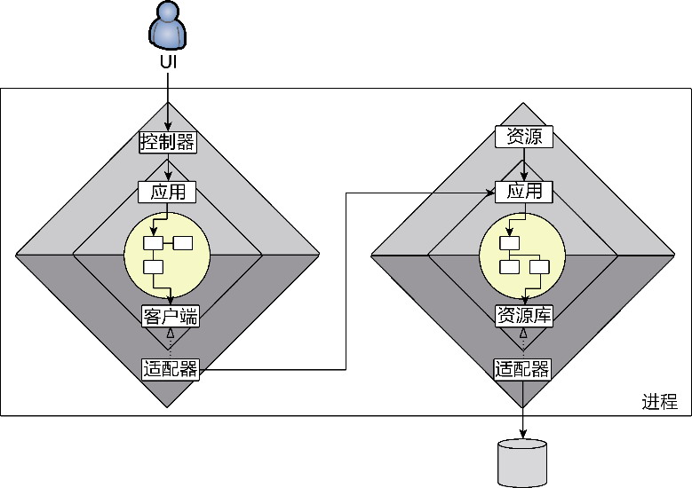

*图12-18 同一进程的协作*

如果客户方与供应方位于不同进程边界，就由远程服务来响应客户方适配器发起的调用。根据通信协议与序列化机制的不同，可以选择资源服务或供应者服务作为远程服务来响应这样的分布式调用。远程服务在收到客户端请求后，会通过应用服务将请求传递给领域层的领域模型。不同进程的协作图如图12-19所示。

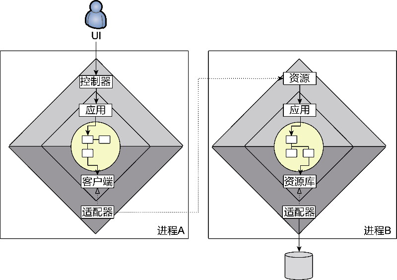

*图12-19 不同进程的协作*

虽然Eric Evans并未要求为每个参与协作的限界上下文都定义防腐层与开放主机服务，但菱形对称架构扩大了防腐层与开放主机服务的外延，使得防腐层与开放主机服务之间的协作成了客户方/供应方映射模式的标准通信模式。南向网关的防腐层保证了端口与适配器的分离，解除了对供应方开放主机服务的强耦合。开放主机服务提供的应用服务与远程服务，允许客户方与供应方的协作能够相对自如地在进程内通信与进程间通信之间完成切换，自然就可以相对轻松地将一个系统从单体架构风格迁移到微服务架构风格。

发布者/订阅者模式是采用异步通信实现上下游团队协作的模式，参与协作的角色包括上游发布者和下游订阅者。

·上游发布者：防腐层的发布者端口负责发布事件。它并不需要关心下游订阅者如何消费事件，但需要就事件契约与下游团队沟通达成一致。

·下游订阅者：开放主机服务的订阅者远程服务需要监听事件总线，获取发布者发布的事件，然后将事件传递给应用服务，应用服务担任事件处理器的角色对事件进行处理。

发布者/订阅者模式的上下游关系及参与协作的网关方向和客户方/供应方模式完全不同。发布者虽然是上游，却由南向网关的防腐层负责发布事件；订阅者虽然是下游，却由北向网关的开放主机服务负责订阅事件，进而处理事件。

在发布者/订阅者模式中，发布者与订阅者之间的耦合主要来自对事件的定义。如果发布者修改了事件，就会影响到订阅者，发布者传递给下游的知识其实就是事件本身。它们的上下游关系也就由此确定。

当两个团队分别为事件的发布者与订阅者时，它们之间往往通过引入事件总线作为中介来维持彼此的通信。在限界上下文内部，需要隔离领域模型与事件总线的通信机制。采用菱形对称模型，即可通过网关层的设计元素来实现这种隔离。事件的发布者位于南向网关，发布者端口提供抽象定义，事件的订阅者属于北向网关的远程服务，事件处理器即应用服务。

我们还需要判断是谁引起了事件的发布。

如果事件由应用服务发布，该事件就是应用事件，它的触发者可能是当前限界上下文外部的客户端。例如，前端UI发起对远程服务的调用，然后委派给了应用服务。应用服务调用领域层执行完整个业务服务的领域逻辑后，组装好待发布的应用事件，通过调用南向网关的发布者端口，由注入的发布者适配器最终完成事件的发布。完整的调用关系如图12-20所示。

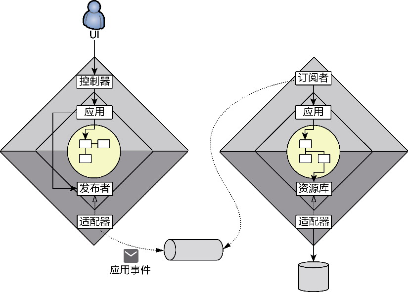

*图12-20 发布和订阅应用事件*

如果是领域层的领域模型对象在执行某一个领域行为时发布了事件，该事件就为领域事件。由于发布事件需要与外部的事件总线协作，它会调用南向网关的发布者端口。为了保证领域模型中聚合的纯粹性，应由领域服务调用发布者端口，完成对领域事件的发布。调用关系如图12-21所示。

引入事件总线的发布者/订阅者模式具有松耦合的特点。在结合了防腐层与开放主机服务之后，领域模型并不依赖发布事件与订阅事件的实现机制，意味着它们对事件总线的依赖也能够降到最低。只要通过积极的团队协作，定义满足上下游共同目标的事件，它们就能很好地响应业务的变化。

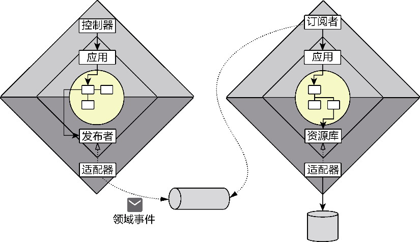

*图12-21 发布和订阅领域事件*

无论是客户方/发布方模式，还是发布者/订阅者模式，菱形对称架构都能够将上游的变化产生的影响降到最低。一个自治的限界上下文需要菱形对称架构来保证。由采用菱形对称架构的限界上下文组成的业务系统，既有高内聚的领域内核，又有松耦合的协作空间，就能更好地响应变化，使得系统具有更强的架构演进能力。

#### 12.1.9 菱形对称架构的运用

让我们通过一个简化的提交订单业务服务来说明在菱形对称架构下，限界上下文之间以及内部各个设计元素是如何协作的。参与协作的限界上下文包括订单上下文、仓储上下文、通知上下文和客户上下文。假定每个限界上下文以微服务形式部署，位于不同的进程。

提交订单业务服务的执行过程如下：

·客户向订单上下文发送提交订单的客户端请求；

·订单上下文向库存上下文发送检查库存量的客户端请求；

·库存上下文查询库存数据库，返回库存信息；

·若库存量符合订单需求，则订单上下文访问订单数据库，插入订单数据；

·插入订单成功后，移除购物车对应的购物车项；

·订单上下文调用库存上下文的锁定库存量服务，对库存量进行锁定；

·提交订单成功后，发布OrderPlaced事件到事件总线；

·通知上下文订阅OrderPlaced事件，调用客户上下文获得该订单的客户信息，组装通知内容；

·通知上下文调用短信服务，发送短信通知客户。

**1.订单上下文的内部协作**

客户要提交订单，通过前端UI向订单上下文远程服务OrderController提交请求，然后将请求委派给应用服务OrderAppService：

```
package com.dddexplained.diamonddemo.ordercontext.northbound.remote.controller;
​
@RestController
@RequestMapping(value="/orders")
public class OrderController {
   @Autowired
   private OrderAppService orderAppService;
​
   @PostMapping
   public void placeOrder(PlacingOrderRequest request) {
      orderAppService.placeOrder(request);
   }
}
​
package com.dddexplained.diamonddemo.ordercontext.northbound.local.appservice;
​
@Service
public class OrderAppService {
   @Autowired
   private OrderService orderService;
​
   @Transactional(rollbackFor = ApplicationException.class)
   public void placeOrder(PlacingOrderRequest request) {}
}
```

远程服务与应用服务操作的消息契约模型定义在message包中：

```
package com.dddexplained.diamonddemo.ordercontext.message;
​
import java.io.Serializable;
import com.dddexplained.diamonddemo.ordercontext.domain.Order;
​
public class PlacingOrderRequest implements Serializable {
   public Order to() {
      return new Order();
   }
}
```

这些消息契约模型都定义了如to()和from()之类的转换方法，用于消息契约模型与领域模型之间的互相转换。

**2.订单上下文与库存上下文的协作**

订单上下文的应用服务OrderAppService收到PlacingOrderRequest请求，在将该请求对象转换为Order领域对象后，通过领域服务OrderService提交订单。提交订单时，需要验证订单的有效性，再检查库存量。验证订单的有效性由Order聚合根承担，库存量的检查通过南向网关的客户端端口InventoryClient：

```
package com.dddexplained.diamonddemo.ordercontext.domain;
​
@Service
public class OrderService {
   @Autowired
   private InventoryClient inventoryClient;
​
   public void placeOrder(Order order) {
      if (order.isInvalid()) {
         throw new InvalidOrderException();
      }
​
      InventoryReview inventoryReview = inventoryClient.check(order);
      if (!inventoryReview.isAvailable()) {
         throw new NotEnoughInventoryException();
      }
​
      ......
   }
}
```

由于南向网关的客户端端口InventoryClient是面向领域模型的，端口的接口定义不能掺杂任何与领域模型无关的内容，故而接口方法操作的对象应为领域模型对象：

```
package com.dddexplained.diamonddemo.ordercontext.southbound.port.client;
public interface InventoryClient {
   InventoryReview check(Order order);
   void lock(Order order);
}
```

客户端适配器InventoryClientAdapter实现了端口接口，需要在其内部将领域模型对象转换为上游远程服务能够识别的消息契约对象：

```
package com.dddexplained.diamonddemo.ordercontext.southbound.adapter.client;
​
@Component
public class InventoryClientAdapter implements InventoryClient {
   private static final String INVENTORIES_RESOURCE_URL = "http://inventory-service/
inventories";
​
   @Autowired
   private RestTemplate restTemplate;
​
   @Override
   public InventoryReview check(Order order) {
      CheckingInventoryRequest request = CheckingInventoryRequest.from(order);
      InventoryReviewResponse reviewResponse = restTemplate.postForObject(INVENTORIES_
RESOURCE_URL, request, InventoryReviewResponse.class);
      return reviewResponse.to();
   }
​
   @Override
   public void lock(Order order) {
      LockingInventoryRequest inventoryRequest = LockingInventoryRequest.from(order);
      restTemplate.put(INVENTORIES_RESOURCE_URL, inventoryRequest);
   }
}
```

订单上下文与库存上下文位于不同进程，需要各自定义消息契约，故而在订单上下文的南向网关中定义对应的消息契约模型CheckingInventoryRequest和InventoryReviewResponse：

```
package com.dddexplained.diamonddemo.ordercontext.message;
​
import java.io.Serializable;
import com.dddexplained.diamonddemo.ordercontext.domain.Order;
​
public class CheckingInventoryRequest implements Serializable {
   public static CheckingInventoryRequest from(Order order) {}
}
​
package com.dddexplained.diamonddemo.ordercontext.message;
​
import java.io.Serializable;
import com.dddexplained.diamonddemo.ordercontext.domain.InventoryReview;
​
public class InventoryReviewResponse implements Serializable {
   public InventoryReview to() {}
}
```

**3.库存上下文的内部协作**

当下游的订单上下文发起对库存上下文远程服务InventoryResource的调用时，又会通过应用服务InventoryAppService来调用领域服务InventoryService，然后，经由端口InventoryRepository与适配器InventoryRepositoryAdapter访问库存数据库，获得库存量的检查结果：

```
package com.dddexplained.diamonddemo.inventorycontext.northbound.remote.resource;
​
@RestController
@RequestMapping(value="/inventories")
public class InventoryResource {
   @Autowired
   private InventoryAppService inventoryAppService;
​
   @PostMapping
   public ResponseEntity<InventoryReviewResponse> check(CheckingInventoryRequest request) {
      InventoryReviewResponse reviewResponse = inventoryAppService.checkInventory(request);
      return new ResponseEntity<>(reviewResponse, HttpStatus.OK);
   }
}
​
package com.dddexplained.diamonddemo.inventorycontext.northbound.local.appservice;
​
@Service
public class InventoryAppService {
   @Autowired
   private InventoryService inventoryService;
​
   public InventoryReviewResponse checkInventory(CheckingInventoryRequest request) {
      InventoryReview inventoryReview = inventoryService.reviewInventory(request.to());
      return InventoryReviewResponse.from(inventoryReview);
   }
}
​
package com.dddexplained.diamonddemo.inventorycontext.domain;
​
@Service
public class InventoryService {
   @Autowired
   private InventoryRepository inventoryRepository;
​
   public InventoryReview reviewInventory(List<PurchasedProduct> purchasedProducts) {
      List<String> productIds = purchasedProducts.stream().map(p -> p.productId()).
collect(Collectors.toList());
      List<Product> products = inventoryRepository.productsOf(productIds);
​
      List<Availability> availabilities = products.stream().map(p -> p.checkAvailability
(purchasedproducts)).collect(Collectors.toList());
      return new InventoryReview(availabilities);
   }
}
​
package com.dddexplained.diamonddemo.inventorycontext.southbound.port.repository;
​
@Repository
public interface InventoryRepository {
   List<Product> productsOf(List<String> productIds);
}
```

**4.订单上下文成功提交订单**

领域服务OrderService在确认了库存量满足订单需求后，通过端口OrderRepository以及适配器OrderRepositoryAdapter访问订单数据库，插入订单数据。一旦订单插入成功，还需要移除购物车中对应的购物车项。由于购物车与订单都在订单上下文中，订单上下文的领域服务OrderService可以直接调用领域服务ShoppingCartService。移除购物车项后，领域服务OrderService还要调用库存上下文的远程服务InventoryResource锁定库存量，从而成功完成订单的提单。领域服务OrderService的实现如下：

```
package com.dddexplained.diamonddemo.ordercontext.domain;
@Service
public class OrderService {
   @Autowired
   private OrderRepository orderRepository;
   @Autowired
   private InventoryClient inventoryClient;
   public void placeOrder(Order order) {
      if (!order.isValid()) {
         throw new InvalidOrderException();
      }
      InventoryReview inventoryReview = inventoryClient.check(order);
      if (!inventoryReview.isAvailable()) {
         throw new NotEnoughInventoryException();
      }
      orderRepository.add(order);
          ShoppingCartService.removeItems(order.customerId(),
              Order.purchasedProducts());
      inventoryClient.lock(order);
   }
}
```

**5.订单上下文发布应用事件**

订单上下文的应用服务OrderAppService会在OrderService成功提交订单之后组装OrderPlaced应用事件，调用端口EventPublisher，经由适配器EventPublisherAdapter将事件发布到事件总线：

```
package com.dddexplained.diamonddemo.ordercontext.northbound.local.appservice;
@Service
public class OrderAppService {
   @Autowired
   private OrderService orderService;
   @Autowired
   private EventPublisher eventPublisher;
   private static final Logger logger = LoggerFactory.getLogger(OrderAppService.class);
   @Transactional(rollbackFor = ApplicationException.class)
   public void placeOrder(PlacingOrderRequest request) {
      try {
         Order order = request.to();
         orderService.placeOrder(order);
         OrderPlaced orderPlaced = OrderPlaced.from(order);
         eventPublisher.publish(orderPlaced);
      } catch (DomainException ex) {
         logger.warn(ex.getMessage());
         throw new ApplicationException(ex.getMessage(), ex);
      }
   }
}
```

发布的OrderPlaced应用事件属于订单上下文南向网关的消息契约。位于不同进程的订阅者要订阅该应用事件，为了满足反序列化的要求，需要在所属限界上下文的北向网关定义与之对应的应用事件。在提交订单的业务场景中，该事件的订阅者只有通知上下文，因此在通知上下文北向网关的消息契约中也定义了一个相同的OrderPlaced应用事件。

**6.通知上下文订阅应用事件**

通知上下文的远程服务EventSubscriber订阅了OrderPlaced事件，一旦接收到该事件，就交由事件处理器处理该事件。事件处理器是一个接口，定义为：

```
public interface OrderPlacedEventHandler {
   void handle(OrderPlaced event);
}
```

应用服务NotificationAppService实现了事件处理器接口，可以通过调用领域层的NotificationService领域服务来处理该事件：

```
package com.dddexplained.diamonddemo.notificationcontext.northbound.remote.subscriber;
public class EventSubscriber {
   @Autowired
   private OrderPlacedEventHandler eventHandler;
   @KafkaListener(id = "order-placed", clientIdPrefix = "order", topics = {"topic.e-
commerce.order"}, containerFactory = "containerFactory")
   public void subscribeEvent(String eventData) {
      OrderPlaced orderPlaced = JSON.parseObject(eventData, OrderPlaced.class);
      eventHandler.handle(orderPlaced);
   }
}
package com.dddexplained.diamonddemo.notificationcontext.northbound.local.appservice;
@Service
public class NotificationAppService implements OrderPlacedEventHandler {
   @Autowired
   private NotificationService notificationService;
   public void handle(OrderPlaced orderPlaced) {
      notificationService.notify(orderPlaced.to());
   }
}
```

**7.通知上下文与客户上下文的协作**

NotificationService领域服务会调用端口CustomerClient，然后可以经由适配器CustomerClientAdapter向客户上下文的远程服务CustomerResource发送调用请求。在客户上下文内部，由北向南，依次通过远程服务CustomerResource、应用服务CustomerAppService、领域服务CustomerService和南向网关的端口CustomerRepository与适配器CustomerRepositoryClient完成对客户信息的查询，返回调用者需要的信息。通知上下文的领域服务NotificationService在收到该响应消息后，组装领域对象Notification，再通过本地的端口SmsClient与适配器SmsClientAdapter，调用短信服务发送通知短信：

```
package com.dddexplained.diamonddemo.notificationcontext.domain;
@Service
public class NotificationService {
   @Autowired
   private CustomerClient customerClient;
   @Autowired
   private SmsClient smsClient;
   public void notify(Notification notification) {
      CustomerResponse customerResponse = customerClient.customerOf(notification.to().id());
      notification.filledWith(customerResponse.to());
      smsClient.send(notification.to().phoneNumber(), notification.content());
   }
}
```

整个流程到此结束。显然，若每个限界上下文都采用菱形对称架构，代码结构就会变得非常清晰。各个层各个模块各个类都有着各自的职责，泾渭分明，共同协作。同时，网关层对领域层的保护是不遗余力的，没有让任何领域模型对象泄露到限界上下文边界之外。唯一带来的成本就是需要重复定义消息契约对象，并实现领域模型与消息契约模型之间的转换逻辑。

### 12.2 系统分层架构

系统上下文界定了目标系统解空间的范围，通过运用分而治之的思想，将整个解空间分解为多个限界上下文，降低了目标系统的规模。菱形对称架构模式为限界上下文内部建立了清晰的结构，并对它们之间的协作进行约束和指导。相较而言，系统上下文位于更高的层次，也需要引入与之匹配的架构模式，把限界上下文当作基本的架构单元，从目标系统的角度确定整个系统的结构。这个架构模式就是系统分层架构。

#### 12.2.1 关注点分离

对于一个大型的复杂系统，遵循关注点分离原则对其进行分解总是最为有效的降低复杂度的手段。

关注点分离需要按照变化的方向进行，如此才能满足架构的正交性。将目标系统视为一个长方体，沿纵向与横向两个方向的关注点对长方体进行纵横切分。传统的纵横切分只有一个抽象层次，即系统的抽象层次，如图12-22所示。

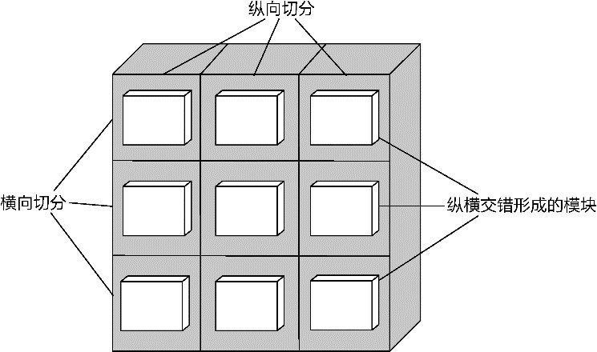

*图12-22 系统的纵横切分*

领域驱动设计则不然。限界上下文根据业务能力对整个系统进行了纵向切分，并在它的自治边界内建立了独立的架构。限界上下文的纵向切分并非彻底的、自顶向下的完整切分，例如它并没有将前端的展现层包含在内，其自治性又突破了纵横交错的界限，形成了图12-23所示的架构。

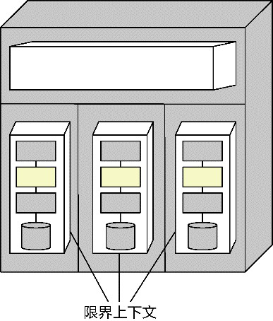

图12-23 限界上下文的纵向切分

这样的架构虽然仍然存在水平方向与垂直方向的切分，但如果将限界上下文看作一个黑箱，它更像一种扁平结构。扁平结构保证了架构的简单性，但随着系统变得越来越复杂，其抽象层次的不同会使得它的简单性无法满足系统的复杂度，就好似一家大型国际企业，往往无法采用扁平的组织结构进行有效管理。

之所以出现扁平结构，是因为我们将所有的限界上下文放在了同一个抽象层次。在系统层面，限界上下文统一了业务、持久化和数据库，作为一个整体与UI展现逻辑形成了横向切分，遂演变为由UI展现层与限界上下文组成的两层结构。

#### 12.2.2 映射子领域

限界上下文虽然是根据领域维度对目标系统进行纵向切分，但并不意味着所有的限界上下文都位于同一个水平抽象层次。这种不分主次的结构违背了领域驱动设计的精炼目标。Eric Evans指出：“一个严峻的现实是我们不可能对所有设计部分进行同等的精化，而是必须分出优先级。”^279领域驱动设计对这种优先级的回应就是为整个问题空间划分子领域，并依据重要程度划分为核心子领域、支撑子领域和通用子领域。既然架构映射阶段是对问题空间的求解过程，那么，子领域针对问题空间的优先级划分自然会影响到解空间的架构决策，并将其映射到整个系统的架构上。

子领域的划分关键在于“选择核心”，也就是精炼出那些“能够表示业务领域并解决业务问题的模型部分”^280。这部分模型能够为系统增加业务价值，形成问题空间的核心子领域到解空间限界上下文的映射。还有一部分模型，它们抽象出来的概念要么是很多业务都需要的，要么就是支撑业务的某个方面，这意味着它们借助核心子领域映射的限界上下文间接为系统提供业务价值，这部分模型在解空间的位置，正是问题空间中通用子领域和支撑子领域到解空间限界上下文的映射。要形成问题空间与解空间的同构映射，就需要为限界上下文确定优先级。我们需要改变分层架构的技术视角，从价值的角度将所有的限界上下文分为两个层次。

·业务价值层(value-added layer)：映射核心子领域。

·基础层(foundation layer)：映射通用子领域和支撑子领域。

划分子领域的目的在于确定建模的成本，并由此进行合理的工作分配。属于核心子领域的领域逻辑值得用最好的团队实施领域驱动设计，通过领域建模来保障领域模型的质量；属于通用子领域或支撑子领域的领域逻辑可以交给非核心开发人员用简便快速的方法完成，甚至可以考虑购买或者外包。这意味着位于基础层的限界上下文可以采用弱化的菱形对称架构。如图12-24所示，基础层的限界上下文可以是一个纯粹的库，不需要访问如数据库这样的外部资源，或者可以只提供属于它边界内的领域模型。

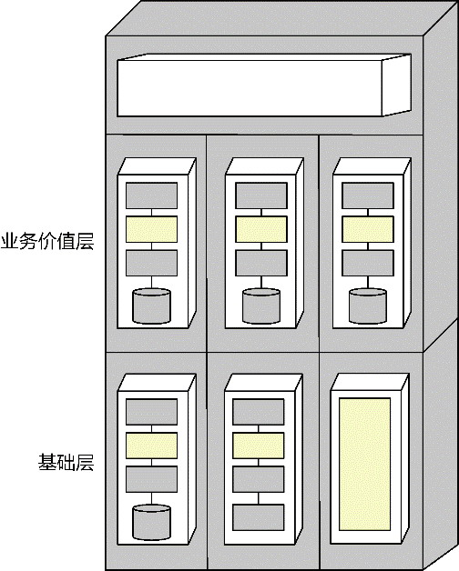

*图12-24 映射子领域的层次*

限界上下文虽然处于两个不同的层次，但并未改变业务能力纵向切分的本质，只不过它们的层次是由业务价值的差异决定的。每个限界上下文的内部都包含了属于自身业务语境的模型，只是面向的领域不同罢了。

以电商系统为例。业务价值层的配送上下文映射核心子领域，为电商系统提供了业务价值，它面向的领域与物流有关；基础层的导航上下文映射支撑子领域，并未提供直接的业务价值，却为配送功能提供了导航服务，它面向的领域与GIS有关；同样位于基础层的身份上下文映射通用子领域，为业务价值层的几乎所有限界上下文都提供了身份认证功能，但并不属于电商系统的业务价值，它面向的领域与安全有关。

不要将基础层与领域驱动设计的基础设施层混为一谈，因为在菱形对称架构中，基础设施层实际上是网关层。在系统分层架构中，架构师要学会运用限界上下文来切分业务能力的关注点。即使是技术实现细节，作为负责该限界上下文的团队，同样需要面向领域来设计，只是对领域层的设计未必需要领域建模，并可能以库的组件形式进行物理部署。技术实现的要求也使得该团队更像一个组件团队，而非领域特性团队。例如业务价值层的多个限界上下文都需要文件上传与下载功能，且这些功能都在系统上下文的边界内，就可将它们视为问题空间的支撑子领域或通用子领域，映射为基础层的限界上下文。相反，如果只有业务价值层的一个限界上下文需要文件上传和下载功能，且这些功能由团队自行实现，则这些功能就属于菱形对称架构的南向网关，对应于领域驱动设计分层架构的基础设施层。

设计时，一定要注意系统上下文的边界。系统边界之外的功能不属于任何一个限界上下文。假设某个开源库实现了文件上传和下载功能，情形就发生了变化。由于该开源库不在系统上下文的边界内，对需要调用该功能的限界上下文而言，只需在南向网关定义文件上传和下载的端口，并由适配器调用该开源库实现该功能。但是，如果文件上传和下载的适配器需要适配大量功能，甚至需要定义与文件相关的领域模型对象，或者提供系统专用的配置信息，说明该适配功能具有了独立能力，就可以在基础层定义文件传输上下文。业务价值层的各个限界上下文仍然保留南向网关的文件上传和下载端口，只是在适配器中将原来对外部开源框架的调用转为对文件传输上下文服务的调用。

#### 12.2.3 边缘层

虽然前端UI被推到限界上下文的边界之外，但系统上下文层次的架构必须考虑它，毕竟前端UI的实现也属于目标系统解空间的范围。

在限界上下文北向网关的远程服务中，控制器服务专门用于与前端UI的交互，提供代表视图展现的消息契约模型。目前流行的前端框架都遵循MVC模式或其变种模型-视图展现器(Model-View Presenter，MVP)、模型-视图-视图模型(Model-View-ViewModel，MVVM)等模式，并采用单页应用(single page application)的前端开发范式。前端呈现的内容由后端服务提供，即视图模型对象。对于一个典型的前后端分离架构，倘若采用单页应用，则前后端各对象之间的交互方式大抵如图12-25所示。

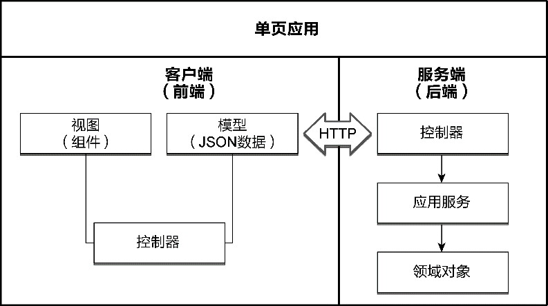

*图12-25 单页应用的前后端交互*

由于设计视角的不同，前端UI往往无法与限界上下文一一对应，一个页面可能需要向多个限界上下文的远程服务发送请求，不同请求的返回值用于渲染同一个页面的不同控件。若前端UI还需要支持多种前端应用，就会导致前端UI与限界上下文的协作关系形成叠加，进一步加剧了二者之间的不匹配关系。这种不匹配关系还会体现到团队组织上。根据康威定律，前端开发人员不属于限界上下文领域特性团队的一部分，由此需要组建专门的前端团队。前后端的不匹配会为前端团队与后端领域特性团队制造交流障碍。

此处再次引用David Wheeler的名言：“计算机科学中的大多数问题都可以通过增加一层间接性来解决。”前后端之间的不匹配问题亦可以引入间接层来解决。该间接层位于服务端，提供了与前端UI对应的服务端组件，并成为组成前端UI的一部分。面向不同的前端应用，间接层可以提供不同的服务端组件。由于引入的这一间接层具有后端服务的特征，却又为前端提供服务，因而被称为为前端提供的后端(Backends For Frontends，BFF)层。

前端团队显然更加理解UI的设计。为了更好地协调前端团队与后端领域特性团队的沟通与协作，往往由前端团队定义BFF层的接口。甚至在技术选型上，为了消除前端开发人员的技术壁垒，选择基于JavaScript的Node.js，然后由前端团队实现BFF层。

BFF层作为中间层为不同的前端应用提供服务，如分别为Web前端与移动前端提供不同的服务接口。不仅如此，它还提供了聚合服务的职责，将本该由多个限界上下文提供的远程服务聚合为一个服务，如图12-26所示。

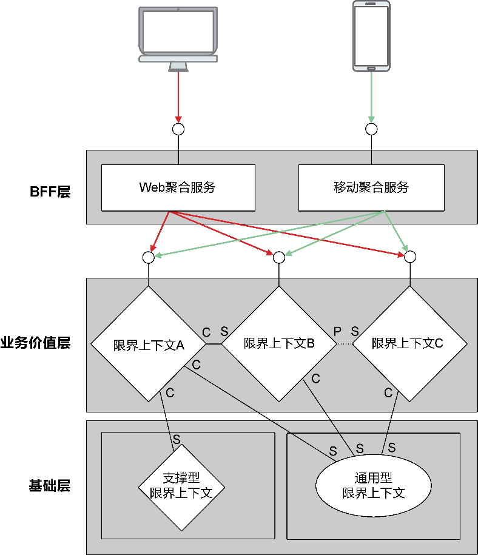

*图12-26 聚合服务*

BFF层同时履行了UI适配与服务聚合的职责，好像专门为后端建立了一个供前端访问的边缘。事实上，它确实可以建立一个网络边缘来保护后端的业务价值层与基础层。例如在物理部署上，可以将BFF层部署在一个DMZ(demilitarized zone)区，而将后端的业务价值层与基础层部署在安全级别更高的防火墙内网。这时的BFF层就不只限于其名称所指代的含义了。为了更好地体现这一中间层的边缘价值，可将其更名为边缘层(edge layer)。

边缘层的定义更加抽象。只要满足边缘含义的职责，事实上都可以封装在这一层。例如微服务架构风格所需的API网关，也属于介于后端与前端的边缘。整个系统分层架构的演进如图12-27所示。

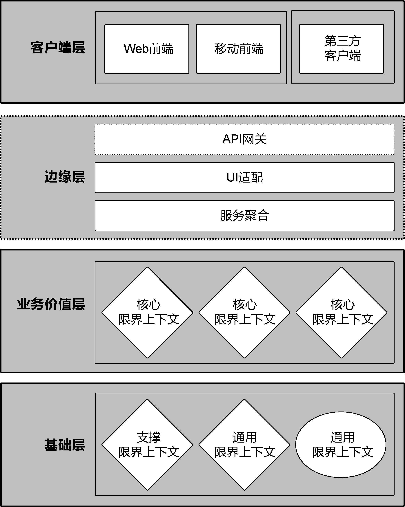

*图12-27 系统分层架构*

图12-27中的虚线框代表架构中的可选元素。例如对于非微服务架构，可以不使用API网关；对于前端调用相对简单的系统，甚至可以没有边缘层。

系统分层架构的分层体系与命名参考了SoundCloud的微服务分层架构。不同之处在于，它引入了领域驱动设计的元模型，以问题空间的子领域映射业务价值层和基础层，并将限界上下文作为层次内的基本架构单元，形成了依据价值重要性进行划分的分层架构。

### 12.3 领域驱动架构风格

一个好的架构能够响应需求变化进行不断的演进。Neal Ford等人指出：“构建演进式架构的关键之一在于决定自然组件的粒度以及它们之间的耦合，以此来适应那些通过软件架构支持的能力。”^41限界上下文的自治能力可以满足演进式架构对自然组件粒度与耦合的要求。限界上下文的菱形对称架构保证了领域模型的稳定性。网关层清晰地隔离了领域模型与外部环境，又通过运用上下文映射模式指导限界上下文之间的协作，为协作双方预留了足够的弹性空间，满足了演进式架构的要求。

架构的演进能力只是质量元素的一方面，确保架构的一致性才是设计的关键。Frederick Brooks就认为“一致性应该是所有质量原则的根基”^97，还引入Blaauw的论断——“好的架构应该是直接的，人们掌握了部分系统后就可以推测出其他部分”——来说明满足了一致性的架构才是好的计算机架构。

一个一致的架构必须遵循统一的架构风格。那么，什么是风格呢？Roy Fielding认为：“风格是一种用来对架构进行分类和定义它们的公共特征的机制。每一种风格都为组件的交互提供了一种抽象，并且通过忽略架构中其余部分的偶然性细节，来捕获一种交互模的本质特征。”

显然，风格是对架构的一种分类。这一分类是由软件元素（即定义中的组件）及软件元素之间交互的公共特征决定的。忽略架构中的偶然性细节，就是要找出那些稳定不变的本质特征，对其进行抽象。

领域驱动设计在架构层面获得的抽象元素就是系统上下文与限界上下文，它们围绕领域为核心驱动力，以业务能力为核心关注点，分别形成了两个层次的架构模式：系统分层架构模式与菱形对称架构模式。系统分层架构保证了整个系统上下文结构的一致性；菱形对称架构规定了限界上下文清晰的边界，并对它们的交互形成了约束与指导。毫无疑问，它们共同组成了一种独特的架构风格。根据其特征，我将其命名为领域驱动架构风格。

架构风格必须是清晰的。Brooks认为清晰的风格源自“设计者在大范围的宏观与微观决策中获得了一定程度的一致性”^99。对于一个高度复杂的软件系统架构，领域驱动架构风格以系统上下文为宏观层次，对该层次的架构决策由系统分层架构进行规范。到了微观层次，领域驱动架构风格以限界上下文为基本的架构单元，它的架构决策由菱形对称架构进行规范。系统分层架构与菱形对称架构虽然层次不同，设计的驱动力与关注点却是一致的，都是以领域为核心驱动力，以业务能力为核心关注点做出的决策。这就保证了架构在宏观与微观决策中的一致性，也决定了它的清晰风格。

领域驱动架构风格如图12-28所示。

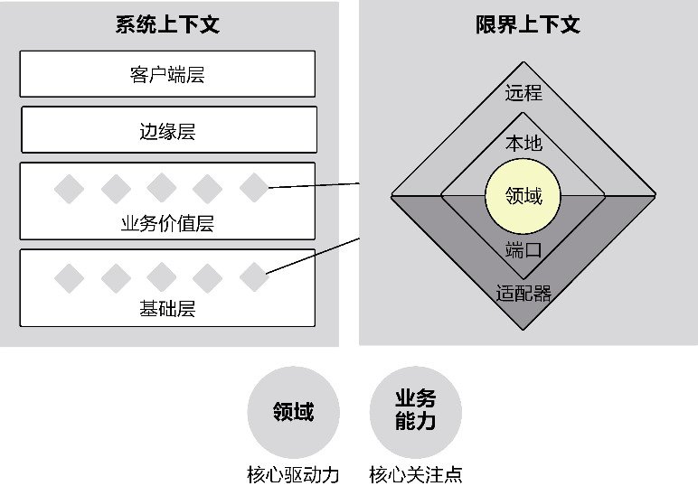

*图12-28 领域驱动架构风格*

领域驱动架构风格充分利用了限界上下文的自治性与开放性。

当限界上下文化身为运行在进程内部的库时，即演进为单体架构模式；当限界上下文根据不同的业务场景定义为不同的通信边界时，即演进为面向服务架构模式（或者认为是单体架构与微服务架构组成的混合架构）；当限界上下文的通信边界被界定为进程间通信时，即演进为微服务架构模式；当限界上下文之间的协作采用发布者/订阅者映射模式时，即演进为事件驱动架构模式。显然，支撑领域驱动架构风格演进能力的关键要素，正是领域驱动战略设计的核心模式——限界上下文。

领域驱动架构风格充分利用了系统上下文对解空间的边界定义，并在约束一致性的同时，保证了设计的实用性。

系统分层架构对限界上下文进行了界定与规范，使得它们能够采取一致的方式提供业务能力。同时，根据限界上下文所属子领域的不同，结合具体的业务场景降低对限界上下文的设计要求，不再一视同仁地严格要求运用菱形对称架构；对于基础层的限界上下文，甚至可以不采用领域建模。

根据业务能力进行纵向切分的限界上下文未必满足面向前端的服务请求。系统分层架构引入边缘层来封装和聚合各个自治的业务能力，同时为前端提供不同的展现模型。无论是单体架构模式、面向服务架构模式还是微服务架构模式，实则都可以遵循系统分层架构。它们之间的区别仅在于限界上下文的通信边界。如此就可以让遵循领域驱动设计的系统架构做到业务架构与应用架构、数据架构的统一，并保证这三者与技术架构的隔离。
