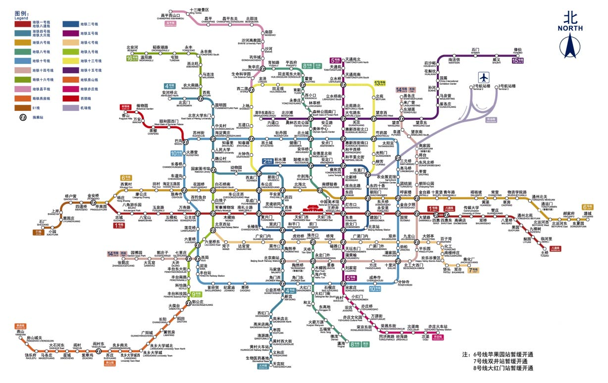
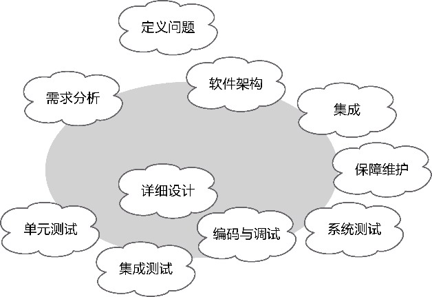
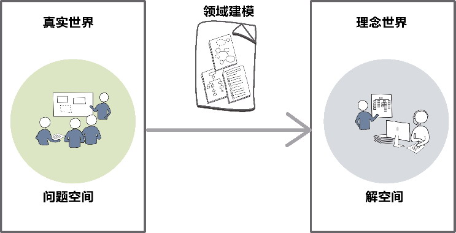
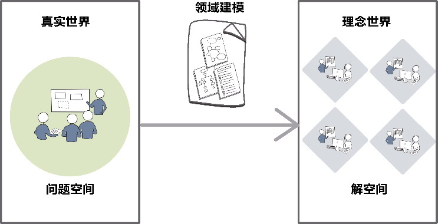
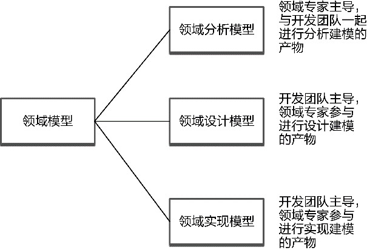
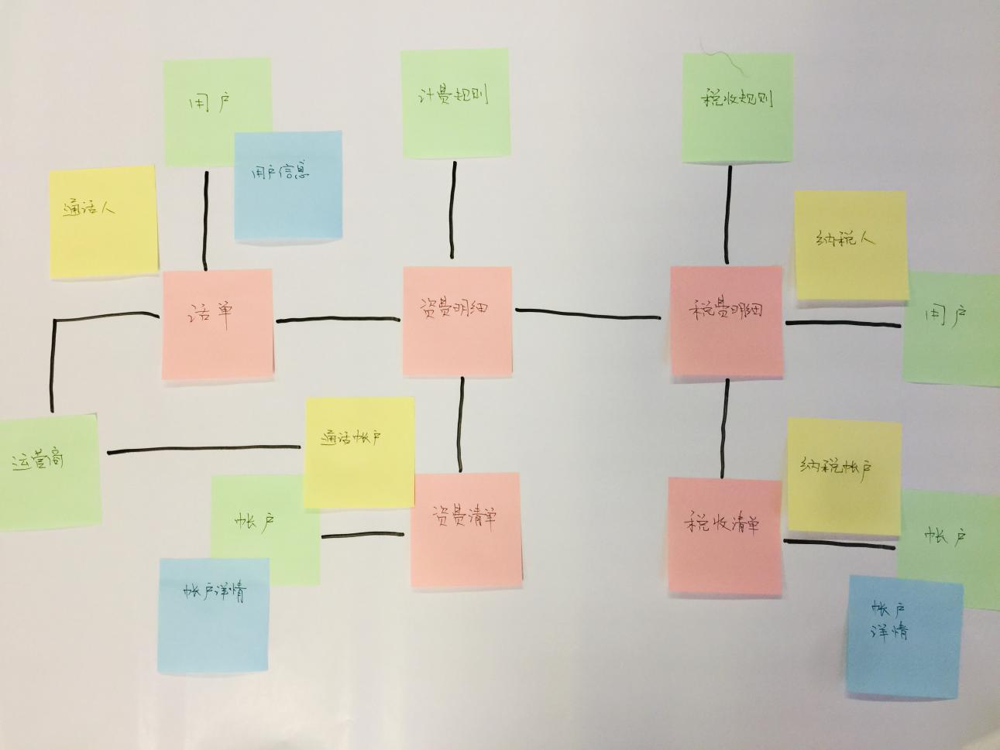
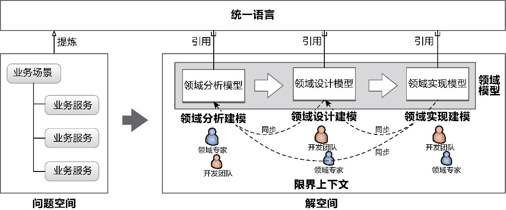
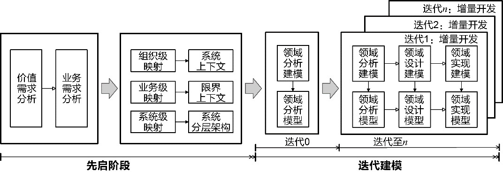

## 第13章 模型驱动设计

> 他就像一个魔法师，从大礼帽里变出一只老鹰，随后掏出一只鸽子。随后，他解释，拆析，并重构他那令人费解的哲思。

> ——马洛伊·山多尔，《伪装成独白的爱情》

从架构映射阶段进入领域建模阶段，简单说来，就是跨过战略视角的限界上下文边界进入它的内部，从菱形对称架构的内外分层进入每一层尤其是领域层的内部进行战术设计。在思考如何进行领域建模时，首先需要思考的问题就是：什么是模型？

### 13.1 软件系统中的模型

先来看看Eric Evans对模型的阐述：“为了创建真正能为用户活动所用的软件，开发团队必须运用一整套与这些活动有关的知识体系。所需知识的广度可能令人望而生畏，庞大而复杂的信息也可能超乎想象。模型正是解决此类信息超载问题的工具。模型这种知识形式对知识进行了选择性的简化和有意的结构化。适当的模型可以使人理解信息的意义，并专注于问题。”^2

如何才能让庞大而复杂的信息变得更加简单，让分析人员的心智模型可以容纳这些复杂的信息呢？那就是利用抽象化繁为简，通过标准的结构来组织和传递信息，形成可以推演的解决方案。这就是模型。模型反映了现实问题，表达了真实世界存在的概念，但它并不是真实问题与真实世界本身，而是分析人员对它们的一种加工和提炼。这就好比真实世界中的各种物质可以用化学元素来表达，例如流动的水是真实世界存在的物体，而“水”(water)这个词则是该物体与之对应的概念，H~2O则是水的化学式，也是一种模型。同时，H~2O也是化学世界的统一语言。

模型往往是交流的有效工具，因而需要用经济而直观的形式来表达，其中最常用的表现形式之一就是图形。例如轨道交通线网图，如图13-1所示。

该交通线网图体现了模型的许多特点。首先，它是抽象的，并非真实世界中轨道交通线网的真实缩影，图中的每个线路其实都是理想化的几何图形，以线段为主，仅仅展现了方位、走向和距离。其次，它利用了可视化的元素。这些元素实际上都是传递信息的信号量，例如使用不同的颜色来区分线路，使用不同大小的形状与符号来区分普通站点与中转站。最后，模型传递了重要的模型要素，例如线路、站点、站点数量、站点距离、中转站以及方向，因为对乘客而言，仅需要这些要素即可获得有用的路径规划与指导信息。

*图13-1 城市轨道交通线网图*

模型的重要性并不体现在它的表现形式，而在于它传递的知识。它是从需求到编码实现的知识翻译器，通过对杂乱无章的问题进行梳理，消除无关逻辑乃至次要逻辑的噪声，然后按照知识语义进行分类与归纳，遵循设计标准与规范建立一个清晰表达业务需求的结构。这个梳理、分类和归纳的过程就是建模的过程，建立的结构即模型。

### 13.2 模型驱动设计

建模过程与软件开发生命周期的各种不同的活动息息相关，它们之间的关系大体如图13-2所示。

*图13-2 软件开发生命周期的各种活动*

建模活动用灰色的椭圆表示，它涵盖了需求分析、软件架构、详细设计、编码与调试等活动，有时候，测试、集成和保障维护活动也会在一定程度上影响系统的建模。为了便于更好地理解建模过程，我将整个建模过程中主要开展的活动称为“建模活动”，并统一归纳为分析活动、设计活动和实现活动。每一次建模活动都是一次对知识的提炼和转换，产出的成果就是各个建模活动的模型。

·分析活动：观察真实世界的业务需求，依据设计者的建模观点对业务知识进行提炼与转换，形成表达了业务规则、业务流程或业务关系的逻辑概念，建立分析模型。

·设计活动：运用软件设计方法进一步提炼与转换分析模型中的逻辑概念，建立设计模型，使得模型在满足需求功能的同时满足更高的设计质量。

·实现活动：通过编码对设计模型中的概念进行提炼与转换，建立实现模型，构建可以运行的高质量软件，同时满足未来的需求变更与产品维护。

整个建模过程如图13-3所示。

*图13-3 建模过程*

不同的建模活动建立了不同的模型，图13-3表达的建模过程体现了这3种模型的递进关系。但是，这种递进关系并不意味着分析、设计和实现是一种前后相连的串行过程，而应该是分析中蕴含了设计，设计中夹带了实现，甚至到了实现后还要回溯到设计和分析的一种迭代的、螺旋上升的演进过程。不过，在建模的某一瞬间，针对同一问题，分析、设计和实现这3个活动不能同时进行。它们其实是相互影响、不断切换和递进的关系。一个完整的建模过程，就是模型驱动设计(model-driven design)。

在进行模型驱动设计时，同样需要区分问题空间和解空间，否则，就可能会将问题与解决方案混为一谈，在不清楚问题的情况下开展建模工作，从而输出一个错误模型，无法真实地反映真实世界。即使面对同一个问题空间，当我们采取不同的视角对问题进行分解时，也会引申出不同视角的解决方案，并驱使我们建立不同类型的模型。

将问题空间抽取出来的概念视为数据信息，在求解过程中关注数据实体的样式和它们之间的关系，由此建立的模型就是数据模型；将每个问题视为目标系统为客户端提供的服务，在求解过程就会关注客户端发起的请求以及服务返回的响应，由此建立的模型就是服务模型；围绕着问题空间的业务需求，在求解过程中力求提炼出表达领域知识的逻辑概念，由此建立的模型就是领域模型。毫无疑问，领域驱动设计选择的建模过程，实则是领域模型驱动设计。

针对真实世界的问题空间建立抽象的模型，会组成一个由抽象领域概念组成的理念世界。理念世界是真实世界问题空间向解空间的一个投影，投影的方法就是对问题空间求解的方法。在领域驱动设计中，这个求解方法就是领域建模，如图13-4所示。

*图13-4 问题空间到解空间的领域建模*

当系统规模达到一定程度后，软件复杂度陡然增加，要想直接将问题空间映射为解空间的领域模型，需要极高的驾驭能力。建立的领域模型也仅仅体现了对真实世界的一个水平切面，在面对业务变化时，其稳定性与响应能力都面临着极大的考验。

架构映射阶段在这个过程中起到了关键的架构支撑作用。以限界上下文为核心要素构建的架构是在更高的抽象层次上对业务的划分，故而它的稳定性要强于领域模型。菱形对称架构与系统分层架构沿着变化方向与维度对关注点进行了有效的切分，提高了整个系统响应变化的能力。映射获得的架构形成了支撑这个系统的骨架，确保它应对风险和响应变化的能力。整个系统的解空间通过限界上下文进行了分解，使得整个系统的规模得到了有效的控制。真实世界投射而成的理念世界被限界上下文分割为多个小的解空间。对限界上下文进行领域建模，就相当于对一个小规模的软件系统进行领域建模，如图13-5所示。

*图13-5 对限界上下文进行领域建模*

领域建模属于战术层次的求解方法，对应于领域驱动设计统一过程的领域建模阶段，在架构映射阶段输出的架构方案的指导下进行。作为领域模型知识语境的限界上下文，也会对建立的领域模型进行约束，并通过边界确保领域模型在该范围内的完整性和一致性。领域建模阶段形成的求解过程就是领域模型驱动设计。它在如下方面有别于其他模型驱动设计：

·以领域为建模起点，提炼真实世界的领域知识，建立领域模型；

·建立的领域模型以限界上下文作为控制边界。

### 13.3 领域模型驱动设计

领域模型驱动设计以提炼和转换业务需求中的领域知识为设计的起点。提炼领域知识时，要排除技术因素对建模产生的影响，一切围绕着业务需求而来。尤其在领域建模的分析活动中，领域模型表达的是业务领域的概念，完全独立于软件开发技术。Martin Fowler就认为：“这种独立性可以使技术不会妨碍对问题的理解，并使得最终的模型能够适用于所有类型的软件技术。”^3

#### 13.3.1 领域模型

Eric Evans强调了模型的重要性，总结了模型在领域驱动设计中的作用^：

·模型和设计的核心互相影响；

·模型是团队所有成员使用的统一语言的中枢；

·模型是浓缩的知识。

如何才能得到能够准确表达业务需求的模型呢？首先，我们需要认识到模型和领域模型是两个不同层次的概念。根据我们观察真实世界业务需求的视角，建模过程建立的模型还可以是数据模型或服务模型。领域模型驱动设计建立的模型自然是“领域模型”，可以将其定义为以“领域”为关注核心的模型，是对领域知识严格的组织且有选择的抽象。

即便有了这个定义，也没能清晰地说明领域模型到底长什么样子，包含了什么内容。

领域模型究竟是什么？是使用建模工具绘制出来的UML图？是通过编程语言实现的代码？或者干脆就是一个完整的书面设计文档？我认为，UML图、代码和设计文档仅仅是表达领域模型的一种载体。绘制出来的UML图或者编写的代码与文档如果没有传递领域知识，那就不是领域模型。因此，领域模型应该具备以下特征：

·运用统一语言来表达领域中的概念；

·蕴含业务活动和规则等领域知识；

·对领域知识进行适度的提炼和抽象；

·由一个迭代的演进的过程建立；

·有助于业务人员与技术人员的交流。

既然如此，不管采用的表现形式如何，只要一个模型正确地传递了领域知识，并有助于业务人员与技术人员的交流，就可以说是领域模型。这是一个更不容易犯错误的定义。它其实体现了一种建模原则。很可惜，这样的原则并不能指导开发团队运用领域驱动设计。诸如这样打太极的原则与模糊定义，并不能让开发团队满意。他们还是会执着地追问：“领域模型到底是什么？”

Eric Evans并没有就此做出正面解答，但他在模型驱动设计中提到了模型与程序设计之间的关系：“模型驱动设计不再将分析模型和程序设计分离开，而是寻求一种能够满足这两方面需求的单一模型。”^31这说明分析模型和程序设计应该一起被放入同一个模型中。这个单一模型就是“领域模型”。他反复强调程序设计与程序实现应该忠实地反映领域模型，并指出：“软件系统各个部分的设计应该忠实地反映领域模型，以便体现出这二者之间的明确对应关系。”^32同时，还要求：“从模型中获取用于程序设计和基本职责分配的术语。让程序代码成为模型的表达。”^32在我看来，分析真实世界后提炼出的概念模型，就是领域分析模型；设计对领域模型的反映，就是领域设计模型；代码对领域模型的表达，就是领域实现模型。领域分析模型、领域设计模型和领域实现模型在领域视角下，成了领域模型中相互引用和参考的不可或缺的组成部分，它们分别是分析建模活动、设计建模活动和实现建模活动的产物。

模型驱动设计非常强调模型的一致性。Eric Evans甚至认为：“将分析、建模、设计和编程工作过度分离会对模型驱动设计产生不良影响。”^39这正是我将分析、设计和实现都统一到模型驱动设计中的原因。因此，倘若我们围绕着“领域”为核心进行设计，采用的就是领域模型驱动设计，整个领域模型应该包含图13-6所示的领域分析模型、领域设计模型和领域实现模型。

*图13-6 领域模型的构成*

领域建模阶段的不同活动获得的领域模型其侧重点不同，参与建模的人员也有所差异，分别获得的模型共同构成了一个完整的领域模型。

#### 13.3.2 共同建模

为了保证领域模型的一致性、真实性、完整性，并将模型蕴含的知识传递到团队的每一个成员，无论是领域建模的哪一个阶段，都应尽可能引导领域专家和整个开发团队参与到建模活动中来，进行共同建模，而不是由专职的分析师或设计师使用冷冰冰的建模工具绘制UML图。

领域模型的目的在于交流，引入直观而又具备协作能力的可视化手段能够促进共同建模。通过使用各种颜色的即时贴、马克笔和白板纸等可视化工具，让彩色的领域模型成为一种沟通交流的视觉工具，如图13-7所示。领域模型中的领域概念、协作关系皆生动形象地活跃在彩色图形上，使得团队协作成为可能，让领域模型更加直观，从而避免沟通上的误差与分歧，使得团队能够迅速就领域模型达成一致。

结对编程也可认为是共同建模的一种实践。在建立领域实现模型时，可通过结对编程进行测试驱动开发。测试用例体现了具体的业务场景，测试方法的命名更加接近自然语言，Given- When-Then模式与业务场景的描述非常契合。领域专家也可以参与到结对编程中来。由于领域层的代码模型仅为业务逻辑的表达，领域专家能够敏锐地发现代码模型是否与领域概念保持一致，从而帮助开发人员打磨代码。代码即模型，这是领域模型最理想的表现形式，也是领域建模最终的模型产物。

*图13-7 共同建模获得的领域分析模型*

#### 13.3.3 领域模型与统一语言

领域模型之所以划分为3个模型，是因为不同活动的交流对象与交流重心各不相同。在领域分析建模活动中，开发团队与领域专家一起工作，通过建立更加准确而简洁的领域分析模型，直观地传递着不同角色对领域知识的理解。在领域设计建模活动中，必须基于领域分析模型对模型中的对象做出设计改进，考虑职责的合理分配与良好的协作，建立具有指导意义的领域设计模型。在领域实现建模活动中，代码必须是领域设计模型的忠实表现，意味着它其实也忠实表现了领域分析模型蕴含的领域知识。

一言以蔽之，让领域分析模型服务于开发团队与领域专家，领域设计模型服务于软件设计人员，领域实现模型服务于开发人员。3个模型各司其职，各取所需，共同组成了领域模型。

在领域建模过程中，我们需要不断地从统一语言中汲取建模的营养，并通过统一语言维护领域模型的一致性。当开发团队根据领域分析模型建立领域设计模型时，如果发现领域分析模型的概念未能准确表达领域知识，又或者缺少了隐式概念，就需要调整领域分析模型，使得领域设计模型与领域分析模型保持一致。领域实现模型亦当如此。显然，统一语言为领域模型驱动设计提供了一致的领域概念，使得领域模型在整个领域建模阶段保持了同步。至于统一语言的获得，自然来自全局分析阶段获得的业务需求，如此就将全局分析与领域建模衔接在一起，如图13-8所示。

*图13-8 统一语言指导下的领域建模*

#### 13.3.4 迭代建模

分析、设计和实现并非3个割裂的阶段，而是领域模型驱动设计的3个建模活动。在领域驱动设计统一过程中，我将领域模型驱动设计的过程定义为领域建模阶段，主要执行3个过程工作流：

·领域分析建模；

·领域设计建模；

·领域实现建模。

这3个过程工作流就是领域模型驱动设计的3个建模活动。在项目开发过程中，这3个过程工作流并非前后衔接的瀑布流程：领域特性团队的一部分团队成员在执行领域分析建模的同时，会有另一些团队成员在进行领域设计建模和领域实现建模。

领域建模是针对问题空间的战术求解过程，同时，它也需要接受领域驱动架构风格的指导，故而在迭代建模之前，需要率先完成全局分析与架构映射。采用最小计划式开发流程，在先启阶段完成全局分析，获得价值需求和业务需求，然后执行架构映射，获得由系统上下文与限界上下文构成的领域驱动架构。为了避免分析瘫痪(analysis paralysis)，先启阶段的周期应控制在两周到一个月左右。

先启阶段结束后，就进入领域模型驱动设计的迭代开发阶段。迭代开发阶段的目标是获得领域模型，不妨参考Scott W. Ambler敏捷建模的思想，将其称为迭代建模(iteration modeling)。

领域特性团队的业务分析人员需要在迭代建模的准备阶段（迭代0）细化问题空间的业务服务，为其编写业务服务规约，然后在其基础上，通过提炼领域知识，获得由领域概念组成的领域分析模型。

从迭代1开始，按照领域建模的要求，进一步开展更为细致的领域分析建模，并结合设计元模型的设计要素，获得静态类图；再引入服务驱动设计获得动态序列图，从而和静态类图一起组成领域设计模型；最后，结合业务服务与领域设计模型，推进测试驱动开发实践进行编码开发，以小步快速的红-绿-重构反馈环不断地改进代码质量和增量开发，获得领域实现模型，交付可运行的功能特性。整个过程如图13-9所示。

*图13-9 从先启阶段到迭代建模*

迭代建模与迭代的增量开发一脉相承。它避免了在建模过程尤其是分析建模活动出现分析瘫痪，也避免了在设计建模活动中的过度设计，同时还能快速地开发出新功能及时获得用户的反馈。领域模型也随着增量开发而不断演化，始终指导着设计与开发。

迭代建模使得建模活动成为迭代开发中不可缺少的一个重要环节，但整个活动却是轻量的，有效地促进了团队成员的交流，符合Kent Beck提出的核心价值观：沟通、简单和灵活。
