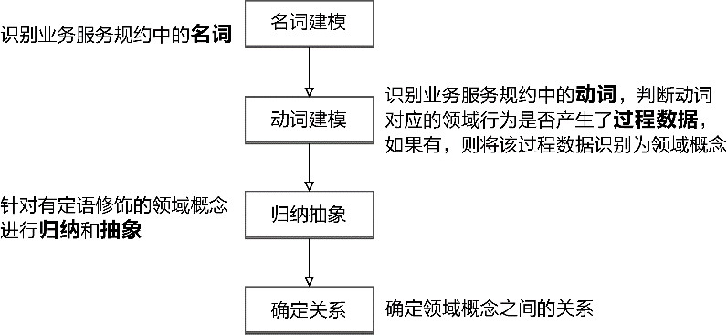
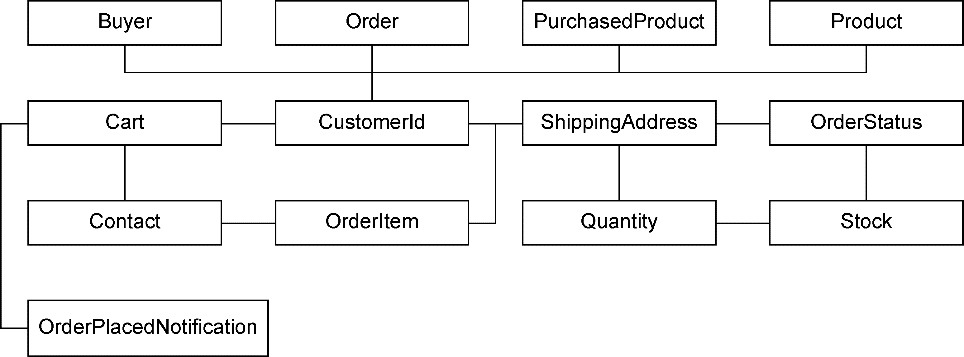
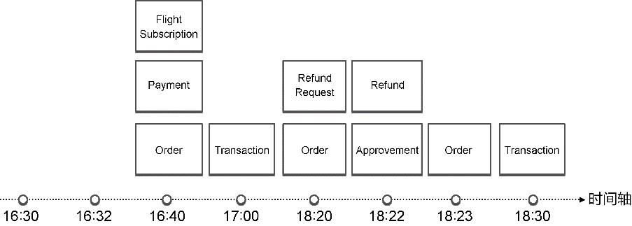
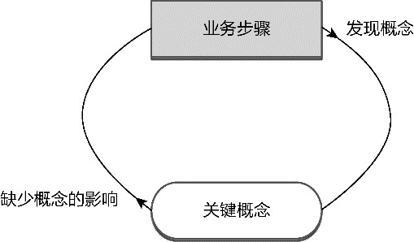
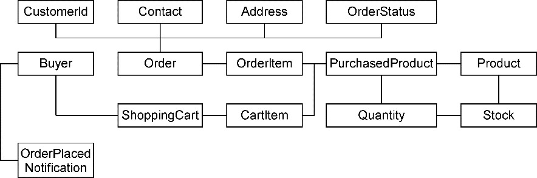
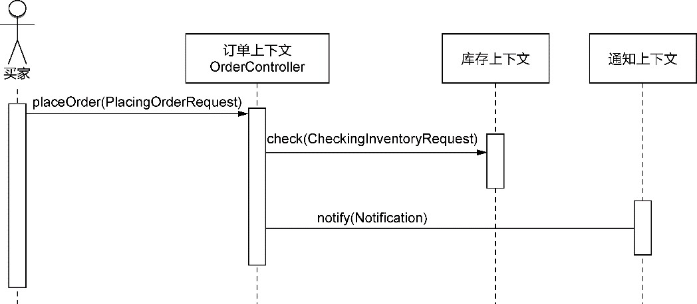
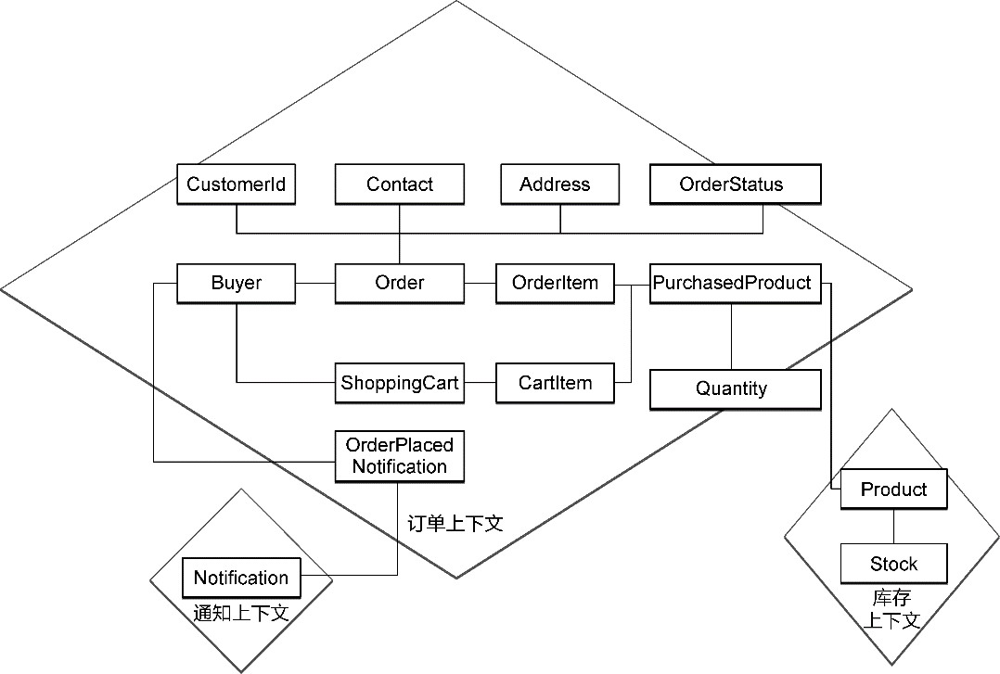

## 第14章 领域分析建模

> 是的，客户，在银行业务上，我们把和我们有来往的人通称为客户。

> ——狄更斯，《双城记》

不管采用什么样的软件开发过程，对于一个复杂的软件系统，都必然需要对问题空间展开分析，有的放矢地针对该软件系统的需求寻找设计上的解决方案。在战术层面，领域驱动设计要求的分析方法就是以“领域”为中心对业务需求展开分析建模，获得领域分析模型。这个过程要求开发团队与领域专家一起来完成。在对业务需求进行领域分析建模时，一个重要参考就是统一语言。

### 14.1 统一语言与领域分析模型

在领域建模阶段，领域模型与统一语言之间是一种相辅相成的关系。统一语言可以作为领域建模尤其是领域分析建模的依据，建立的领域模型又反过来组成了统一语言。开发人员要学会使用统一语言描述构成领域模型的类、方法甚至领域层的每一行代码，并时刻保证领域模型与统一语言的一致性。

统一语言不仅构成了领域模型，还是领域建模过程中无形的最高设计准绳。为了保证分析与设计的质量，我们需要不停地追问以下问题。

·我们设计的模型符合统一语言吗？

·限界上下文的领域概念遵循统一语言吗？

·类名与方法名满足统一语言的规范吗？

这就好比你开车到一个陌生的城市。统一语言就是地图导航，不停地发出声音提醒你行进的方向。当你驶入错误的地方时，它也会及时地修正路线，然后给予你正确的提示。

领域专家在与开发团队进行协作时，不管是“大声地”通过对话进行交流，还是形成全局分析规格说明书，只是交流的载体不同，使用的仍然是单词和短语。消除了分歧并就领域知识达成共识的统一语言，正是由这些单词和短语组成。相较于普通交流的自然语言，统一语言更加精练，更加简洁，也更加准确。字斟句酌而形成的统一语言将成为领域分析建模的一把利器。

### 14.2 快速建模法

为了快速通过业务需求获得领域模型，Russell Abbott提出了一种“名词动词法”。他建议写下问题描述，然后划出名词和动词。名词代表了候选对象，动词代表了这些对象上的候选操作。如果在领域分析建模之前，业务分析人员能够提供高质量的业务服务规约，就可以快速识别规约中的名词，提炼出领域概念，组成领域分析模型。

由于领域分析建模应由领域专家主导开发团队共同建模，为防引起交流上的障碍，应尽量避免引入软件设计要素。我一直认为，在分析之初，不考虑任何技术实现手段，一切围绕着领域知识进行建模，是领域模型驱动设计的关键。通过动词识别领域对象的操作，实则进入了设计范畴。毕竟，对方法的识别牵涉到职责分配的合理问题，若职责分配不当，会导致对象之间的协作不合理。我倾向于在领域设计建模时通过服务驱动设计确定职责的分配，而在领域分析建模阶段，目的还是寻找出领域概念。

识别业务服务的名词固然可以快速获得领域分析模型，但一些隐藏的领域概念可能会被我们遗漏，一些关键领域概念的缺失影响了领域分析模型的质量。针对业务服务的动词进行建模可以作为一种有效的补充手段。

对动词建模并非为领域模型对象分配职责、定义方法，而是将识别出来的动词当作一个领域行为，然后看它是否产生了影响管理、法律或财务的过程数据。该过程数据表现的概念同样属于领域分析模型，实际是Peter Coad定义的时标架构型(moment-interval archetype)。理解什么是时标架构型，有助于针对动词建模。

时标架构型的核心要素是时刻或时段。它代表了出于商业和法律上的原因，我们需要处理并跟踪的某些事情，这些事情是在某个时刻或某一段时间内发生的……（它）寻找的是问题空间中具有重要意义的时刻或时段。^显然，时刻或时段是时标架构型的特征属性。在这个时刻或时段，有某件事情发生了，而这件事情对我们要处理的领域而言，具有重要意义。如果缺少对它的记录，就会影响到商业的运营管理、造成经济损失或引起法律纠纷。一言以蔽之，时标架构型的核心要素包括时刻/时段和重大事件，二者缺一不可。例如，一次销售发生在某一个时刻，如果缺少对销售的记录，会影响企业的收支估算，影响销售人员的提成。一次租赁从登记入住到租约期满，发生在一个时段，如果缺少对租赁的记录，会导致租赁双方的法律纠纷。

具有时标架构型特征的对象可称之为“时标对象”，时标对象的时刻或时段是代表业务含义的关键属性，不能将记录数据的创建或修改时间戳与时标属性混为一谈，也不可认为属于日期/时间类型的业务属性是时标属性。例如，一个员工具有出生日期属性，但员工的出生日期对一个企业而言，没有重要意义，因而不是时标属性。即使一个对象具有时标属性，也未必就是时标对象。例如，员工入职日期是值得记录的关键时标属性，但员工却并非时标对象，因为员工这个对象并非入职日期这个时刻发生的事件，入职OnBoarding对象才是。

寻找时标对象要先从业务流程中找到任何一个重大的时刻或时段，再来分析在这个时刻或时段到底发生了什么事情，是否需要记录过程数据，如果缺少了过程数据，会否对运营管理产生影响，会否带来经济损失，或引起法律纠纷。例如，在2020年6月7日9时：

·学生甲在图书馆借阅了一本《领域驱动设计》；

·客户乙取走了一笔3000元人民币的款项；

·交警丙处理了一起交通违法事项；

·买家丁在淘宝购买了一支护手霜。

以上事件都发生在2020年6月7日9时，产生的记录在各自系统都具有不可缺失的重要意义。缺少一次借阅记录，可能导致图书馆丢失一本书；交易记录存储失败，会影响银行的对账；少记录一次处罚，会影响执法公正；订单找不到了，可能产生买家和卖家间的纠纷。

结合时标对象的特征，可以将其理解为一个领域行为在某个时刻或时段生成的过程数据。如前给出的例子，借阅图书行为产生了借阅记录(Borrowing)，取款行为产生了交易记录(Transaction)，罚款行为开出了罚单(Ticket)，购买护手霜行为产生了订单(Order)，这些对象无一不是行为的中间结果，也就是操作行为的过程数据。之所以称为“过程数据”，是因为它并非执行该领域行为的目标。例如，取款行为的目标是钞票，不是交易记录，购买护手霜行为的目标是护手霜，不是订单。

为了区别Russell Abbott提出的“名词动词法”，同时也希望快速推进领域分析建模的过程，响应迭代建模的精神，我将这一分析建模方法称之为快速建模法，它的建模过程分为4个步骤，如图14-1所示。

*图14-1 快速建模法的建模过程*

#### 14.2.1 名词建模

名词建模的基础是业务服务规约，建模人员迅速找出规约描述中的名词，在统一语言的指导下将其一一映射为领域模型对象。这些领域模型对象往往最容易识别，以此为基础就可以轻易地获得一个像模像样的领域分析模型。这一成果势必会增加建模人员的建模信心。统一语言的梳理与参考也促进了建模人员对业务的理解。

通过名词建模时，不要犹豫。只要名词属于领域概念，符合统一语言的要求，就快速将它拈出来，放到领域分析模型中。

以电商系统的提交订单业务服务为例，它的规约描述如下。

服务编号：EC-0010

服务名：提交订单

服务描述：

作为买家，

我想要提交订单，

以便买到我心仪的商品。

触发事件：

买家点击“提交订单”按钮

基本流程：

1.验证订单有效性；

2.验证库存；

3.插入订单；

4.从购物车中移除所购商品；

5.通知买家订单已提交。

替代流程：

1a.如果订单无效，给出提示信息；

2a.如果所购商品缺货，给出提示信息；

3a.若订单提交失败，给出失败原因。

验收标准：

1.订单需要包含客户ID、配送地址、联系信息及已购商品的订单项；

2.订单项中商品的购买数量要小于或等于库存量；

3.订单提交成功后，订单状态更改为“已提交”；

4.购物车对应商品被移除；

5.买家收到订单已提交的通知。

业务服务规约中以下划线标记的内容都是名词，对应于领域分析模型中的类型或类型的属性。即使为类型的属性，若该属性体现了领域概念的特征，也当识别为领域类型。例如，名词“配送地址”(ShippingAddress)是“订单”(Order)的属性，但同样体现了“地址”这一重要的领域概念。业务服务的角色在领域分析模型中同样应该被定义为类型，它与构成业务服务宾语的领域概念之间存在关联关系，如“买家”(Buyer)与“订单”(Order)。

业务服务规约的用词表达要遵循统一语言的标准要求。当然，自然语言的表达形式往往不够精确，因而在将名词转换为领域概念时，需要进一步分析和甄别，尤其要注意描述不当带来的分析陷阱，或者要善于发觉描述中可能隐藏的概念。例如“购物车对应商品被移除”描述了购物车中的商品，但实际指的是“购物车项被移除”。只不过在买家心中，并不存在“购物车项”这一概念。

在勾勒出需求描述中的名词时，需要注意部分中文词语需要结合上下文判断词性（英文却不必如此）。例如“通知(notify)买家订单已提交”和“买家收到订单已提交的通知(notification)”都包含了“通知”一词，但后者才是名词，表达了“通知”的领域概念。图14-2就是对提交订单业务服务规约运用名词建模获得的领域分析模型。

*图14-2 运用名词建模获得的领域分析模型*

在该模型中，我定义了OrderPlacedNotification而非Notification来表示通知的领域概念，这是希望清晰地表达提交订单的通知行为。倘若认为通知的类型取决于传递给它的值，则可以定义通用的Notification类。

#### 14.2.2 动词建模

名词之后是动词。再次强调，识别动词并非为领域模型对象分配职责、定义方法，而是将识别出来的动词当作一个领域行为，然后看它是否产生了影响管理、法律或财务的过程数据，从而获得时标对象并将其放到领域分析模型中。并非每一个动词都会产生过程数据，如果没有，就跳过，继续识别下一个动词；一旦找到，就将其放到领域分析模型。

例如，作为咨询师的我在2020年6月6日接受了一个咨询任务，要在次日从成都到北京出差。为此，我需要预订去程机票。以下是我的一系列操作行为。

·6月6日16时30分，我使用自己的账号名登录到一家旅行网站：登录行为产生了登录请求，它与企业运营和管理无关，无须产生过程数据。

·6月6日16时32分，我查询了6月7日从成都到北京的航班：查询航班行为获得了航班查询结果，它与企业运营和管理无关，不需要被识别为领域模型对象。

·6月6日16时40分，我选定了查询结果中的一个去程航班，在输入乘客信息后提交订单，发起支付：提交订单行为生成了机票预订订单，支付行为产生支付凭证，旅行网站会向航空公司预订航班；订单、支付凭证影响到企业的财务和账目，航班预订影响到乘客的权益，直接或间接影响到企业的运营和管理，识别出过程数据Order、Payment和FlightSubscription。

·6月6日17时，旅行网站通知我订票成功：通知行为会产生订票成功的通知信息，但它与企业运营和管理无关；旅行网站完成订票支付交易，它会影响企业的财务账目，例如对往来账的清算与结算，识别出过程数据Transaction。

·6月6日18时20分，客户突然调整了咨询任务安排，延期到一个月后执行。我需要取消航班：重新登录网站取消订单，并发起退款请求。订单状态变更影响到乘客和航空公司的权益；退款请求影响到企业的交易账目，直接或间接影响到企业的运营和管理，识别出过程数据Order和RefundRequest。

·6月6日18时22分，旅行网站管理员审核退票请求，审核通过并发起退款：取消订单的审核记录和退款记录影响到企业的审计与财务账目，直接或间接影响到企业的运营和管理，识别出过程数据Approvement和Refund。

·6月6日18时23分，订单取消成功：订单的状态变更影响到乘客和航空公司的权益，间接影响到企业的运营和管理，识别出过程数据Order。

·6月7日18时30分，退款成功：退款操作为旅行网站与支付中介之间的一次交易，影响到乘客和企业的权益与财务账目，直接影响到企业的运营和管理，识别出过程数据Transaction。

需要记录的过程数据如图14-3所示，它们就是动词建模识别出来的领域模型对象。

*图14-3 过程数据组成的时间轴*

通过动词寻找时标对象时，可以针对动词对应的领域行为发起与领域专家之间的问答，当然也可以是设计者自己的自问自答。提问的模式如下所示。

·针对动词代表的领域行为，是否需要记录过程数据？

·如果缺少了过程数据，会否影响运营管理、引起法律纠纷或造成经济损失？

第一个问题是正向的，驱动出隐藏的关键概念；第二个问题是反向的，用以验证挖掘出来的业务概念是否真的属于领域分析模型中的核心概念。正反两个方向的分析驱动力如图14-4所示。

*图14-4 正反两个方向的分析驱动力*

在提交订单业务服务规约中，以波浪线标记的内容都是动词，分别为：提交、买、验证、移除、通知。针对这些动词代表的领域行为，就可以做正反方向的分析。例如，针对动词“提交”对应的提交订单行为，询问：

·提交订单是否需要记录过程数据？

于是发现，订单正是提交行为产生的过程数据。继续询问：

·如果缺少了订单，会否影响运营管理、引起法律纠纷或造成经济损失？

显然，如果没有订单，库存无法针对该订单配送商品，买家和卖家可能就商品的购买产生不必要的纠纷。通过动词建模，就识别出了订单领域概念。

针对“验证”对应的验证订单有效性与验证订单库存行为进行询问，发现验证行为只会产生验证结果，无须记录任何过程数据，可以忽略该动词。

动词建模可以找到名词建模可能遗漏的具有时标对象特征的领域概念，弥补了名词建模的不足。

#### 14.2.3 归纳抽象

通过名词建模和动词建模快速确定领域分析模型后，为提高模型的质量，可对已有领域概念进行归纳抽象。归纳抽象时，主要针对那些由定语修饰的领域概念。

名词建模直接将业务服务描述中的名词转换为领域模型，其中，可能包含那些有定语修饰的名词，如配送地址、家庭地址、已付款金额、冻结资金等。要注意分辨它们是类型的差异，还是值的差异。如果是值的差异，类型就应该相同，应归并为一个领域概念。例如，收货地址与家庭地址表达了不同的值，但它们其实都是地址Address类型；订单状态和商品状态似乎修饰的都是状态，但实际上代表完全不同的值，两个概念不能合并。

倘若修饰名词的定语也是一个名词，且为领域分析模型中的领域概念，它对应的领域概念就可能是另一个领域概念的属性，如账户状态、开户行地址，可认为是账户(Account)和开户行(AccountBank)领域概念的属性。可以确认一下这样的属性是否有单独定义领域概念的必要。领域驱动设计鼓励在领域分析建模阶段形成细粒度的领域概念。

有些定语的修饰比较隐晦，要注意对主要名词的甄别。例如收款行与付款行，看起来好像两个完整的词，实则可以定义为“收款的银行”与“付款的银行”。如此一来，就清晰地体现了它们都是银行Bank类型，区别在于职责（角色）的不同。

通过对领域概念的归纳抽象，可把过于零乱分散的领域概念做进一步过滤，让领域分析模型变得更加紧凑和精简。当然，不要为了抽象而抽象，否则可能删掉一些有价值的领域概念。整体看来，领域分析建模提炼出来的领域概念是多比少好，在分不清楚一个领域概念该保留还是删除时，应优先考虑保留，待到领域设计建模时再做进一步甄别。

在归纳抽象过程中，还要注意剔除掉那些与业务服务的服务价值明显不符，对整个领域模型也没有贡献的领域概念。例如，“取款”业务服务规约的描述中出现了“银行”这一名词，它被放到了领域模型中。银行作为一个场所，确实是取款行为的发生地，但对取款服务而言，银行这一概念并不真正参与到取款行为中，也就对领域模型没有贡献，可以考虑剔除。

#### 14.2.4 确定关系

一旦获得了领域分析模型的领域概念，就可以进一步确定它们之间的关系。

这一步骤对领域分析建模起到了推波助澜的作用。Martin Fowler认为：“如果某个类型拥有多种相似的关联，可以为这些关联对象定义一个新的类型，并建立一个知识级类型来区分它们。”^也就是说，如果发现用一个领域概念来描述关系更为合理，就可以将该关系建模为一个领域概念，尤其对于多对多关系，往往提醒着建模者需要去寻找可能隐藏在关系背后的领域概念。

例如，读者(Reader)与作品(Work)之间存在关联关系，表达了一种收藏的概念，故而可以提炼出收藏(Favorite)领域概念。

针对提交订单业务服务，在通过名词建模和动词建模获得的领域概念中，订单(Order)与所购商品(PurchasedProduct)之间存在多对多关系。在二者的关系上，实则需要建立订单项(OrderItem)概念。一个订单包含多个订单项，一个订单项包含一个所购商品，由此就简化了订单与所购商品之间的关系。同理，购物车(Cart)与商品(Product)之间的关系也可以引入购物车项(CartItem)领域概念。

最终，通过快速建模法为提交订单业务服务获得了图14-5所示的领域分析模型。

*图14-5 运用快速建模获得的领域分析模型*

### 14.3 领域分析模型的精炼

统一语言与快速建模法可以驱动团队研究问题空间的词汇表，快速地帮助团队获得初步的领域分析模型，获得的模型品质受限于语言描述的写作技巧。统一语言的描述更多体现了对真实世界的模型描述，缺乏深入精准的分析与统一的抽象，使得我们很难发现隐含在统一语言背后的重要概念。由此获得的领域分析模型还需要进一步精炼。

对相同或相近的领域进行建模分析时，一定有章法和规律可循。例如，不同电商系统的领域模型定有相似之处，不同的财务系统自然也得遵循普遍适用的会计准则。这并非运用行业术语这么简单，而是结合领域专家的知识，将这些相同或相似的模型抽象出来，形成可以参考和复用的概念模型，就是Martin Fowler提出的分析模式。他认为：“分析模式是一组概念，这些概念反映了业务建模中的通用结构。它可以只与某个特定的领域相关，也可以跨越多个领域。”^分析模式独立于软件技术。领域专家可以理解这些模式，这是领域分析建模尤为关键的一点。

建立领域分析模型时，可参考别人已经总结好的分析模式，如Martin Fowler在《分析模式：可复用的对象模型》中介绍的模式覆盖了组织结构、单位数量、财务模型、库存与账务、计划以及合同（期权、期货、产品以及交易）等领域，Peter Coad等人在《彩色UML建模》一书中也针对制造和采购、销售、人力资源管理、项目管理、会计管理等领域给出了领域模型。这些领域模型皆可视为分析模式的一种体现，可作为我们建立领域分析模型的参考。

当一个团队在一个行业中工作良久，团队中的每个成员都可能成长为领域专家，通过对核心子领域的深入分析，完全有能力建立自己的分析模式。具有丰富领域知识的设计人员身兼领域专家与软件设计师之职，无形中消除了沟通与知识的壁垒。遗憾的是，许多软件设计师要么不具备业务分析和建模能力，要么因为不够重视错过了成为建模专家的机会。实际上，在领域分析建模活动中，扮演重要作用的不是开发团队，而是领域专家。Martin Fowler就认为：“我相信有效的模型只有那些真正在问题空间中工作的人才能建造出来，而不是软件开发人员，不管他们曾经在这个问题空间工作了多久。”^

认识到分析模式是企业的一份重要资产，或许就能说服领域专家将更多的时间用到寻找和总结分析模式的工作上来。总结出一种模式并不容易，需要高度的抽象能力和总结能力。无论如何，为系统的核心子领域引入一些相对固化的模式，总是值得的。Eric Evans就认为：“利用这些分析模式可以避免一些代价高昂的尝试和失败过程，而直接从一个已经具有良好表达力和易实现的模型开始工作，并解决一些可能难于学习的微妙的问题。我们可以从这样一个起点来重构和实验^。”

运用分析模式可以改进领域分析模型。Martin Fowler说：“对于你自己的工作，看看是否有和模式相近的，如果有，用模式试试看。即使你相信自己的解决方案更好，也要使用模式并找出你的方案更适合的原因。我发现这样可以更好地理解问题。其他人的工作也同样如此。如果你找到一个相近的模式，把它当作一个起点来向你正在回顾的工作发问：‘它和模式相比强在哪里？模式是否包含该工作中没有的东西？如果有，重要吗？’”^

当然，分析模式并非万能的灵药。即使已经为该领域建立了成熟的分析模式，也需要随着需求的变化不断地维护这个核心模式。注意，模式并非模型，它的抽象层次要高于模型，故而具有一定通用性。正因为此，它无法真实传递完整的领域知识。分析模式是领域分析建模的参考，利用一些模式与建模原则，可以帮助我们进一步精炼领域分析模型，使其变得更加稳定，又具有足够的弹性。

### 14.4 领域分析模型与限界上下文

在领域分析建模阶段，不要忘记将限界上下文引入领域分析模型。限界上下文是领域模型的业务边界，即领域模型的知识语境。由于在架构映射阶段已经为业务服务确定了限界上下文的边界，通过业务服务建立领域分析模型时，自然而然就能确定模型的边界。例如，提交订单业务服务属于订单上下文，那么根据该业务服务识别出来的领域模型对象，自然也会优先放到订单上下文。

一个业务服务可能需要多个限界上下文共同协作，这一过程通过服务序列图已有清晰地呈现。图14-6展示了提交订单业务服务的服务序列图。

*图14-6 提交订单业务服务的服务序列图*

订单上下文与库存上下文、通知上下文之间存在协作关系。在建立领域分析模型时，对应的领域概念也应根据它与限界上下文的亲密度做出合理分配。

由于领域分析模型已经确定了对象之间的关系，因此，需要特别关注存在关系的两个领域模型对象分属不同限界上下文的情形。如果二者存在非常强的耦合关系，可以反思限界上下文的边界是否合理，或者领域模型的划分是否正确。这也说明领域驱动设计统一过程的3个阶段并非自上而下的瀑布过程。全局分析阶段定义了体现统一语言的价值需求与业务需求，架构映射阶段控制了领域模型的边界与粒度，领域建模阶段又通过实证角度验证了架构映射方案的合理性，并将领域建模确定的概念反馈给全局分析时定义的统一语言，形成了一种螺旋上升的迭代分析与设计过程。

在确定领域分析模型与限界上下文的关系时，需要充分考虑到限界上下文作为领域模型知识语境的特征。倘若一个相同名称的领域概念需要引入定语修饰才能区分领域概念的差异性，说明需要限界上下文作为它的业务边界。例如，领域概念“所购商品”对商品添加了定语修饰，说明与订单项有关的商品概念不同于商品上下文的商品概念，需要为其引入限界上下文。

统一语言在这个过程也发挥着重要的作用，尤其当不同的领域特性团队针对不同的业务流程与业务服务进行分析建模时，各自提炼出来的领域概念可能出现以下3种情况。

·名称不同、含义相同的类：订单上下文的领域特性团队根据自己的业务服务提炼出支付凭条领域概念，支付上下文的领域特性团队则提炼出交易记录领域概念。在电商平台中，这两个概念代表相同的含义，需要达成一致。

·名称相同、含义不同的类：在配送商品业务服务中，提及了配货员通过订单对商品进行配送。它和订单上下文提炼出来的订单概念名称相同，但在库存上下文中，配货员是按照配货单进行拣货的，需要按照统一语言的要求，在库存上下文中将订单概念更名为配货单。

·名称相同、含义相同的类：在提交订单业务服务中，提炼出了参与该业务服务的买家服务为领域概念，并根据统一语言的要求统一命名为客户，同时，在管理客户的若干业务服务中，对应的领域特性团队也定义了该概念。它们的名称相同，含义也相同，需要根据知识语境判断这样的概念是否需要在多个限界上下文中重复定义。

通过快速建模法分析业务服务获得的领域分析模型需要和架构映射输出的限界上下文结合起来，为领域分析模型添加限界上下文的业务边界，如图14-7所示。

*图14-7 确定了限界上下文的领域分析模型*

确定领域模型与限界上下文的关系时，可以从业务能力所需的领域知识角度判断领域模型的归属，并在统一语言的指导下明确领域模型的知识语境，划分它的业务边界。
