## 第15章 领域模型设计要素

> 我的职责就是管理世界与世界的相互关系，就是理顺事物的顺序，

> 就是让结果出现在原因之后，就是不使含义与含义相混淆，

> 就是让过去出现在现在之前，就是让未来出现在现在之后。

> ——村上春树，《海边的卡夫卡》

领域分析建模是对真实世界的抽象与提炼，获得的领域分析模型表现了领域相关的业务知识。若采用对象建模范式（参见附录A），获得的就是映射真实世界的对象模型。它距离编码实现还差了“最后一公里”，也就是缺乏设计上的指导。只确定领域模型对象是不行的，还需要关心它们的职责分配、生命周期管理、与外部环境之间的协作机制，这些内容由领域设计模型来传递与表达。

### 15.1 领域设计模型

领域驱动设计强调以“领域”为核心驱动力。领域模型不应包含任何技术实现因素，模型中的对象真实地表达了领域概念，却不受技术实现的约束。我将这样由对象组成的领域模型，称为理想的对象模型。

#### 15.1.1 理想的对象模型

理想的对象模型都是完美的，现实的对象模型却各有各的不完美之处。当我们在谈论对象时，往往不带一丝烟火气，不会考虑数据的存储、性能的瓶颈以及依赖的千丝万缕，而以为对象诗意地栖居在计算机的内存世界中自给自足。对象模型一经创建，就构成了一张可以通达任何角落的对象网络，允许调用者自由使用，仿佛它们唾手可得。然而，对象如人，有自己的“生老病死”，也有各自不同的能力和性格。创造这些对象的我们，可以操纵它们的生死，但若要这个由对象组成的世界向着“善”的方向发展，就不能给予对象绝对的自由。

对象存在“生老病死”，内存是这些对象的运行空间。我们需要有类似科幻剧《西部世界》中的能力，可以让系统暂停、重启，这就需要为系统中每个对象的数据提供一份不会丢失的副本。这并非业务因素带来的制约，而是基础设施产生的局限，这就引入了领域对象模型的第一个问题：领域模型对象如何实现数据的持久化？

对象掌握的信息并不均等，使得对象之间需要互通有无。理想的对象模型可以组成一张四通八达的网，使得信号可以畅通地从A对象传递到B对象，也使得我们获取对象的区别仅在于需要途经的网络节点数量。可惜现实并非如此，内存资源是昂贵的，加载不必要对象带来的性能损耗也不可轻视，这就引入了领域对象模型的第二个问题：领域模型对象的加载以及对象间的关系该如何处理？

每个对象各有性格：有的对象具有强烈的身份意识，处处希望彰显自己的与众不同之处；有的对象则默默地提供重要的能力支撑却不自显。不同性格的对象被加载到内存，就对管理和访问提出了不同的要求，这并非堆与栈的隔离可以解决的，若不加以辨别与控制，就无法让这些对象和平共处，这就引入了领域对象模型的第三个问题：领域模型对象在身份上是否存在明确的差别？

总有一些对象不体现领域概念，只展现操作的结果。不幸的是，这些操作往往并不安全，会带来状态的变更，而状态变更又该如何传递给其他关心这些状态的对象呢？理想的对象图并不害怕状态的变迁，因为一切变化都可以准确传递，且无须考虑彼此之间的依赖。现实却非如此。如何安全地控制状态变化？如何在监听这种变化的同时，不至于引入多余的依赖？这就引入了领域对象模型的第四个问题：领域模型对象彼此之间如何做到弱依赖地完成状态的变更通知？

#### 15.1.2 战术设计元模型

领域分析模型创造的对象模型有意识地忽略了这些问题。这是明智的选择：人力有限，不可能每件事情都面面俱到。对象建模范式对对象模型的创建提供了设计指导，例如职责的合理分配、共性特征的抽象，都在竭力创建和维护一个良好的对象世界。然而，这些普遍适用的对象设计原则与模式并未针对面向领域的分析对象模型给出明确的设计意见，未能根本解决如上所述的4个问题。领域驱动设计则不然。它为领域而生，却又从不忽略技术因素会对模型带来的影响，甚至可以说，它正是因为太重视，才会特地引入各种战术层面的设计元模型，以一种敬而远之的态度小心地将技术与领域结合起来，避免形成空谈主义的对象理想国。这些战术设计元模型如图15-1所示。

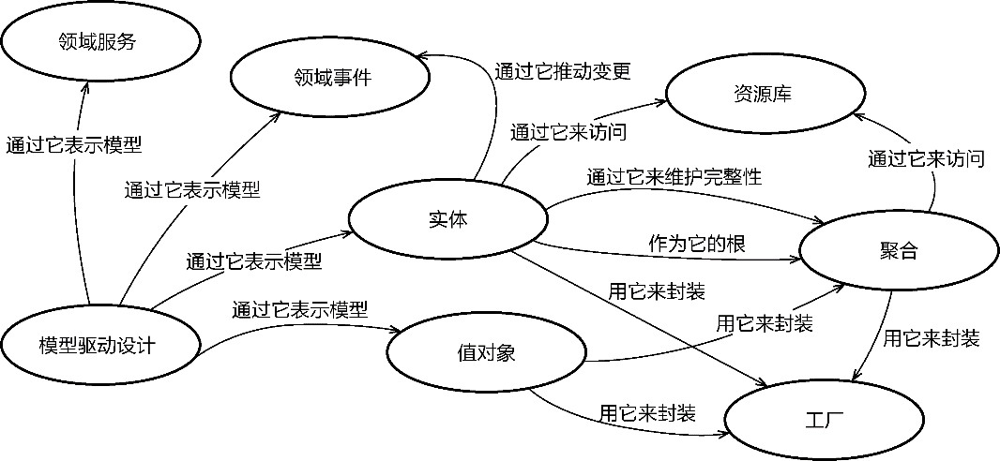

*图15-1 战术设计元模型*

战术设计元模型规定了组成领域设计模型中各个模型元素的含义，又与一系列设计实践结合起来，对设计进行规范和约束，帮助开发团队创建符合领域驱动设计原则的领域设计模型。

设计元模型规定：只能由实体、值对象、领域服务和领域事件表示模型，如此即可避免将领域逻辑泄露到领域层外的其他地方，例如菱形对称架构的外部网关层。聚合用于封装实体和值对象，并维持自己边界内所有对象的完整性。要访问聚合，只能通过聚合根的资源库，这就隐式地划定了边界和入口，有效控制了聚合内所有类型的领域对象。若聚合的创建逻辑较为复杂或存在可变性，可引入工厂来创建聚合内的领域对象。若牵涉到实体的状态变更，领域元模型建议通过领域事件来推动。

战术设计元模型的各种模式与模型元素优雅地解决了理想对象模型存在的问题。

(1)领域模型对象如何实现数据的持久化？资源库模式隔离了领域逻辑与数据库实现，并将领域模型对象当作生命周期管理的资源，将持久化领域对象的介质抽象为资源库。

(2)领域模型对象的加载以及对象间的关系该如何处理？领域驱动设计引入聚合划分领域模型对象的边界，并在边界内管理所有领域模型对象之间的关系，使其在对象的协作与完整性之间取得平衡。

(3)领域模型对象在身份上是否存在明确的差别？领域驱动设计使用实体与值对象区分领域模型对象的身份，避免了不必要的身份跟踪与额外的并发控制要求。

(4)领域模型对象彼此之间如何能弱依赖地完成状态的变更通知？领域驱动设计引入了领域事件，通过发布与订阅领域事件解除聚合与聚合之间的依赖，体现状态变迁的特性。

#### 15.1.3 模型元素的哲学依据

领域分析模型是对真实世界的一种抽象，形成的对象模型到了领域设计建模阶段就被划分为不同的模型元素，作为解决真实世界业务问题的设计元语。

领域驱动设计是以何为根据做出如此分类的呢？我从亚里士多德的范畴学说中寻找到了理论依据。在亚里士多德的逻辑学中，“范畴”为kategorein（动词）或kategoria（名词），他常说“kategorein ti katatinos”，翻译过来就是“述说某物于某物”(assert something of something)。一个范畴其实就是一个主语-谓语(subject is predication)的结构，其中，主语就是被谓语描述的主体。

亚里士多德将范畴分为10类：实体(substance)、分量、性质、关系、场所、时间、位置/姿态、状态、动作和被动^247。这10类范畴说明了我们人类描绘事物的10种方式，每种方式都可采用主语-谓语结构分别描述为：是什么、什么大小、什么性质、什么关系、在哪里、在何时、处于什么状态、有什么、在做什么，以及如何受影响^247。例如以如下格式进行描述。

·描述实体：这是人。

·描述分量：它有1米长。

·描述性质：这是白色。

在亚里士多德的哲学观中，实体是描述事物的主体，其他范畴必须“内居”于一主体。所谓“内居”，按亚里士多德的解释是指不能离开或独立于所属的主体。既然有这种“内居”的主从关系，整个范畴就有了两重划分。实体是真实世界的形而上学基础，而其他范畴则成为实体的属性，需要有某种实体作为属性的基础。

亚里士多德企图通过自己的逻辑学来解释和演绎我们生存的这个世界。在软件领域，要解释和演绎的不正是我们要解决的位于问题空间的真实世界吗？二者毫无疑问存在相通之处。利用软件术语可阐释亚里士多德划分的10类范畴。实体可以理解为我们要描绘的事物的主体。分量、性质、关系、场所、时间、位置/姿态与状态都是该主体的属性。状态会因为主动发起的动作或被动的遭遇引起实体属性的变化，此即状态的变迁。导致状态变化的动作对应为领域行为，被动的遭遇就是该主动行为产生的结果。作为描述事物的主体，要求其他范畴必须内居于一主体，直接体现了对象的封装思想。若实体主体又作为一种属性内居于另一主体，实际就是聚合的体现。

描述真实世界的哲学语言与描述对象世界的设计语言就在“形而上学”的抽象层次找到了符合逻辑的结合点，从而为领域驱动设计的模型对象确定了哲学依据。

·实体：实体范畴，是谓语描述的主体。它包含了其他范畴，包括引起属性变化和状态迁移的动作。

·值对象：为主体对象的属性，通常代表分量、性质、关系、场所、时间或位置/姿态。

·领域事件：封装了主体的状态，代表了因为动作导致的状态变迁产生的被动遭遇，即过去发生的事实。

·领域服务：其他范畴必须“内居”于一主体，若动作代表的业务行为无法找到一个主体对象来“内居”，就以领域服务作为特殊主体封装。

在哲学依据的支撑下，我们开始有了“世界创造者”的气度，创造着一个受设计约束的对象世界。这个世界的创造不是随意的，每一次行动都有迹可循：寻找主体，就是在辨别实体；确定主体的属性，就是在辨别值对象，且清晰地体现了二者的职责分离与不同粒度的封装；确定主体的状态，就是在辨别领域事件；最后，只有在找不到主体去封装领域逻辑时，才会定义领域服务。

### 15.2 实体

实体(entity)这个词被我们广泛使用，甚至过分使用。设计数据库时，我们用到实体，Len Silverston就说：“实体是一个重要的概念，企业希望建立和存储的信息都是关于实体的信息。”^6在分解系统的组成部分时，我们用到实体，Edward Crawley等人就说：“实体也称为部件、模块、例程、配件等，就是用来构成全体的各个小块。”^9

还是从哲学中搬来实体的概念。如前所述，亚里士多德认为实体是我们要描述的主体，巴门尼德则认为实体是不同变化状态的本体。这两个颇为抽象的论断差不多可以表达领域驱动设计中“实体”这个概念，那就是能够以主体类型的形式表达领域逻辑中具有个性特征的概念，而这个主体的状态在相当长一段时间内会持续地变化，因此需要一个身份标识来标记。

如果我们认同范畴理论中“其他范畴必须内居于一主体”的论断，则说明实体必须包括属性与行为，属性往往又由别的次要主体（同样为实体）或表示数量、性质的值对象组成。这一设计遵循了封装的思想，将一个实体拥有的信息封装为不同抽象层次的概念，降低了理解的成本。例如，在一些复杂的企业系统中，真实世界对应的主体概念往往具有几十乃至上百个属性，若缺乏封装，就会因为暴露太多的信息让实体类变得过分臃肿。当实体的属性被封装为不同层次的实体和值对象时，与之相关的行为也需要随之转移。如此才满足信息专家模式，既能避免贫血模型与事务脚本的实现，又能形成对象之间良好的行为协作。

一个典型的实体应该具备3个要素：

·身份标识；

·属性；

·领域行为。

#### 15.2.1 身份标识

身份标识（identity，简称为ID）是实体对象的必要标志，在领域驱动设计中，没有身份标识的领域对象就不是实体。实体的身份标识就好像每个公民的身份号码，用以判断相同类型的不同对象是否代表同一个实体。除了帮助我们识别实体的同一性，身份标识的主要目的还是管理实体的生命周期。实体的状态可以变更，这意味着我们不能根据实体的属性值判断其身份，如果没有唯一的身份标识，就无法跟踪实体的状态变更，也就无法正确地保证实体从创建、更改到消亡的生命过程。

一些实体只要求身份标识具有唯一性即可，如评论(Comment)实体、博客(Blog)实体或文章(Article)实体的身份标识，都可以使用自动增长的Long类型、随机数、UUID或GUID。这样的身份标识并无任何业务含义。

有些实体的身份标识规定了一定的组合规则，例如公民(Citizen)实体、员工(Employee)实体与订单(Order)实体的身份标识，遵循了一定的业务规则。这样的身份标识蕴含了领域知识，体现了领域概念，如订单(Order)实体可能会将下单渠道号、支付渠道号、业务类型、下单日期组装在订单ID中，公民(Citizen)实体的身份标识就是“公民身份号码”这一领域概念。定义规则的好处在于我们可以通过解析身份标识获取有用的领域信息，例如解析订单号即可获知该订单的下单渠道、支付渠道、业务类型与下单日期等，解析一个公民的身份号码可以直接获得该公民的部分基础信息，如出生日期、性别等。

正因如此，在设计实体的身份标识时，通常可以将身份标识的类型分为两种类型：通用类型与领域类型。

通用类型的ID值没有业务含义，采用了一些常用的技术手段来满足其唯一性，例如基于随机数的标识、数据库自增长的标识、根据机器MAC地址和时间戳生成的标识等。既然与具体业务无关，就意味它可以不限于领域，形成一种通用的功能。为避免重复，可以事先实现各种通用类型的ID，然后将其作为基础层共享内核的一部分，让各个限界上下文的领域模型都能复用。

根据ID的共同特征，可以定义一个通用的Identity接口：

```
package com.dddexplained.sparrow.core.domain;
public interface Identity<T> implements Serializable {
   T value();
}
```

随机数的身份标识如下接口所示：

```
public interface RandomIdentity<T> extends Identity<T> {
   T next();
}
```

如果需要按照一定规则生成身份标识，而唯一性的保证由随机数来承担，则可以定义RuleRandomIdentity类。它实现了RandomIdentity接口：

```
@Immutable
public class RuleRandomIdentity implements RandomIdentity<String> {
   private String value;
   private String prefix;
   private int seed;
   private String joiner;
   private static final int DEFAULT_SEED = 100_000;
   private static final String DEFAULT_JOINER = "_";
   private static final long serialVersionUID = 1L;
   public RuleRandomIdentity() {
      this("", DEFAULT_SEED, DEFAULT_JOINER);
   }
   public RuleRandomIdentity(int seed) {
      this("", seed, DEFAULT_JOINER);
   }
   public RuleRandomIdentity(String prefix, int seed) {
      this(prefix, seed, DEFAULT_JOINER);
   }
   public RuleRandomIdentity(String prefix, int seed, String joiner) {
      this.prefix = prefix;
      this.seed = seed;
      this.joiner = joiner;
      this.value = compose(prefix, seed, joiner);
   }
   @Override
   public final String value() {
      return this.value;
   }
   @Override
   public final String next() {
      return compose(prefix, seed, joiner);
   }
   private String compose(String prefix, int seed, String joiner) {
      long suffix = new Random(seed).nextLong();
      return String.format("%s%s%s", prefix, joiner, suffix);
   }
}
```

UUID可以视为一种特殊的随机数，实现了RandomIdentity接口：

```
@Immutable
public class UUIDIdentity implements RandomIdentity<String> {
   private String value;
   public UUIDIdentity() {
      this.value = next();
   }
   private static final long serialVersionUID = 1L;
   @Override
   public String next() {
      return UUID.randomUUID().toString();
   }
   @Override
   public String value() {
      return value;
   }
}
```

这些基础的身份标识类应具备序列化的能力，以便支持分布式通信。注意，包括UUID在内的随机数并不能支持分布式环境的唯一性，需要特殊的算法（例如SnowFlake算法）来避免在分布式系统内产生身份标识的碰撞。

领域类型的身份标识通常与各个限界上下文的实体对象有关，例如为Employee定义EmployeeId类型，为Order定义OrderId类型。在定义领域类型的身份标识时，可以选择恰当的通用类型身份标识作为父类，然后在自身类的定义中封装生成身份标识的领域逻辑。例如，EmployeeId会根据企业的要求生成具有统一前缀的标识，就可以让EmployeeId继承自RuleRandomIdentity，并让企业名称作为身份标识的前缀：

```
public final class EmployeeId extends RuleRandomIdentity<String> {
   private static final String COMPANY_NAME = "dddcompany"; 
   public EmployeeId(int seed) {
      super(COMPANY_NAME, seed);
   }
}
```

由于ID自身包含了组装ID值的业务逻辑，因而建议将其定义为值对象，保持值的不变性，同时提供身份标识的常用方法，隐藏生成身份标识值的细节，以便应对未来可能的变化。

通用类型和领域类型ID的区别仅在于值是否代表了业务含义。作为实体的身份标识，它们都具有业务价值。例如，博客文章实体Post的ID由没有业务含义的随机值组成，但它的业务价值在于标志博客文章的身份，确认其唯一性。当用户通过复制已有文章的形式新建了一篇博客文章时，这两个Post对象的所有属性完全一致，但ID不同，从业务角度讲仍然视为两篇完全不同的博客文章。我们也可将博客文章的身份标识定义为领域类型的ID，例如通过连接符“-”将文章标题的每个单词拼接为ID的值，这一形式实际与UUID组成的ID并无本质差异，只是领域类型的ID具有自说明能力，可帮助人理解。例如，一篇博客文章为《推行DDD的思考》，英文标题为“Thinking of practicing DDD”。通过以上两种形式，其ID表达为：

```
通用类型：b61ab323300a
领域类型：thinking-of-practicing-ddd
```

根据b61ab323300a的值无法推测这篇文章到底讲了什么，但它就是这篇文章的身份标识。有的博客系统甚至同时支持这两种形式，考虑周到的博客系统甚至为其建立了内部的映射关系，就好像IP地址与域名的映射一样。由于文章的ID可能作为REST风格服务接口URI的一部分，在建立了它们的映射关系后，如下的两个URI指向的是同一篇博客文章：

```
https://www.dddexplained.com/p/b61ab323300a
https://www.dddexplained.com/p/thinking-of-practicing-ddd
```

实体ID不管被定义为通用类型还是领域类型，都是领域驱动的设计结果。选择何种类型，取决于业务功能的要求。

如果每个实体的身份标识都定义为自定义的ID类，一旦产生跨限界上下文之间对实体（实则是对聚合的根实体）ID的引用，就可能因为自定义的ID类型产生两个限界上下文之间不必要的耦合。我的建议是将实体类自身的ID定义为ID类，而将它引用的别的实体ID定义为语言的基本类型，同时，为领域类型的ID类定义一个静态的工厂方法，方便二者之间的转换。例如顾客Customer实体的身份标识定义为值对象CustomerId，它继承自UUIDIdentity通用类型，本质上是一个字符串，那么在订单Order实体内部，需要引用的就不是CustomerId类，而是String类型的customerId：

```
package com.dddexplained.ecommerce.ordercontext.order;
public class Order extends Entity<OrderId> {
   private String customerId;
}
package com.dddexplained.ecommerce.customercontext.customer;
public class CustomerId extends UUIDIdentity {
   public static CustomerId of(String customerIdValue) {
      return new CustomerId(customerIdValue);
   }
}
```

订单上下文的Order实体并不需要复用CustomerId，只要确定顾客ID的值就可以确定二者之间的关系，无须引入对CustomerId类型的依赖，也不用考虑分布式通信时的序列化支持，因为语言的基本类型都支持序列化。

#### 15.2.2 属性

实体的属性用来说明主体的静态特征，并持有数据与状态。通常，我们会依据粒度的粗细将属性分为原子属性与组合属性。定义为开发语言内建类型的属性就是原子属性，如整型、布尔型、字符串类型等，表述了不可再分的属性概念。与之相反，组合属性则通过自定义类型来表现，可以封装高内聚的一系列属性，实则也体现了主体内嵌的领域概念。如Product实体的属性定义：

```
public class Product extends Entity<ProductId> {
   private String name;
   private int quantity;
   private Category category;
   private Weight weight;
   private Volume volume;
   private Price price;
}
```

Product实体的name、quantity属性属于原子属性，分别被定义为String与int类型；category、weight、volume、price等属性为组合属性，类型为自定义的Category、Weight、Volume和Price类型。

两种属性间是否存在分界线？例如，能否将category定义为String类型，将weight定义为double类型？又或者，能不能将name定义为Name类型，将quantity定义为Quantity类型？划定这条边界线的标准就是：该属性是否存在约束规则、组合因子或属于自己的领域行为。

先看约束规则。相较于产品的名称(name)属性而言，产品的类别(category)属性具有更强的约束性。产品的类别多而细，且存在一个复杂的层次结构，单单靠一个字符串无法表达如此丰富的约束条件与层次结构。当然，如果需求对产品名称也有明确的约束，例如长度约束、字符内容约束，自然也应该将其定义为Name类型。

再看组合因子。判断属性是否不可再分，如重量(weight)与体积(volume)属性有着明显的特征：需要值与计数单位共同组合。如果只有值而无单位，就会因为单位不同导致计算错误、概念混乱，例如，2kg与2g显然是不同的值，不能混为一谈。至于数量(quantity)属性之所以被设计为原子属性，是因为在当前业务背景下假定它没有计数单位的要求，无须组合。如果需求要求商品数量的单位存在诸如万、亿的变化，又或者以箱、盒、件等不同的量化单位区分不同的商品，作为原子属性的quantity就缺乏业务的表现能力，必须定义为组合属性。

最后来看领域行为。多数静态语言不支持为内建类型扩展自定义行为，要为属性添加属于自己的领域行为，只能选择组合属性。如Product的价格(price)属性需要提供针对该领域概念的运算行为，若不定义为Price组合属性，就无法封装这些领域行为。

组合属性可以是实体，也可以是值对象，取决于该属性是否需要身份标识。

当我们学会将实体的属性尽可能定义为组合属性时，就会在实体内部形成各自的抽象层次。每个抽象层次对应的类型都专注于做自己的事情，各司其职，依据各自持有的数据与状态以及和领域概念之间的黏度分配职责，实体类就能变得更加内聚，承担的职责也就更单一。例如，一个机场的业务系统需要统计每个航班的运载信息，包括进港、出港的旅客信息、行李信息、邮件信息、货物信息等。运载信息的实体类为CarryLoad，如果不考虑封装属性，该类的定义会变得较为庞大而松散：

```
public class CarryLoad extends Entity<CarryLoadId> {
   private String region;
   private String originStation;
   private String destinationStation;
   private Integer legNo;
   private Integer inAdultSum;
   private Integer inChildSum;
   private Integer inBabiesSum;
   private Integer inDivertAdultSum;
   private Integer inDivertChildSum;
   private Integer inDivertBabiesSum;
   private Integer outAdultSum;
   private Integer outChildSum;
   private Integer outBabiesSum;
   private Integer outDivertAdultSum;
   private Integer outDivertChildSum;
   private Integer outDivertBabiesSum;
   private BigDecimal inBaggageWeightSum;
   private Integer inBaggageCount;
   private BigDecimal inMailWeightSum;
   private Integer inMailCount;
   private BigDecimal inCargoWeightSum;
   private Integer inCargoCount;
   private BigDecimal outBaggageWeightSum;
   private Integer outBaggageCount;
   private BigDecimal outMailWeightSum;
   private Integer outMailCount;
   private BigDecimal outCargoWeightSum;
   private Integer outCargoCount;
   private BigDecimal divertBaggageWeightSum;
   private Integer divertBaggageCount;
   private BigDecimal divertMailWeightSum;
   private Integer divertMailCount;
   private BigDecimal divertCargoWeightSum;
   private Integer divertCargoCount;
}
```

CarryLoad实体类的定义好似一个没有文件夹的文件系统，所有属性都位于一个抽象层次，缺乏对信息的隐藏，形成了一个扁平的对象结构。倘若按照内聚的领域概念进行封装，就能建立不同的抽象层次，有利于信息的隐藏和领域逻辑的复用：

```
public class CarryLoad extends Entity<CarryLoadId> {
   private String region;
   private CityPair cityPair;
   private Integer legNo;
   private PassengerLoad inPassengerLoad;
   private BaggageLoad inBaggageLoad;
   private MailLoad inMailLoad;
   private CargoLoad inCargoLoad;
   private PassengerLoad outPassengerLoad;
   private BaggageLoad outBaggageLoad;
   private MailLoad outMailLoad;
   private CargoLoad outCargoLoad;
   private BaggageLoad divertBaggageLoad;
   private MailLoad divertMailLoad;
   private CargoLoad divertCargoLoad;
}
```

调整后的运载CarryLoad实体通过CityPair封装了起降机场。起降机场也是航空领域的一个领域概念。PassengerLoad隐藏了旅客运载量的细节，BaggageLoad隐藏了行李运载量的细节，MailLoad隐藏了邮件运载量的细节，CargoLoad隐藏了货物运载量的细节，从而清晰地呈现了运载内容：

·进站的旅客、行李、邮件、货物的运载量；

·出站的旅客、行李、邮件、货物的运载量；

·中转的行李、邮件、货物的运载量。

在排除了其他细节的干扰后，运载概念的身份基本能做到不言自明。

为实体定义更小概念的组合属性，就好像雕刻师不断凿去多余的内容来清晰地呈现雕刻物的模样。把这些细小的概念以及与之对应的职责推给各自的属性类，当前实体才能专注于自身概念的身份。

#### 15.2.3 领域行为

实体拥有领域行为，可以更好地说明其作为主体的动态特征。一个不具备动态特征的对象，是一个哑对象，一个“蠢”对象。这样的对象明明坐拥宝山（自己的属性）而不自知，还去求助他人操作自己的状态，着实有些“愚蠢”。为实体定义表达领域行为的方法，与前面讲到组合属性需要封装自己的领域行为是一脉相承的，都是“职责分治”设计思想的体现。

根据不同的行为特征，我将实体拥有的领域行为分为：

·变更状态的领域行为；

·自给自足的领域行为；

·互为协作的领域行为。

**1.变更状态的领域行为**

实体对象的状态由属性持有。与值对象不同，实体对象允许调用者更改其状态。许多语言都支持通过get与set访问器（或类似的语法糖）访问状态，这实际上是技术因素干扰着领域模型的设计。领域驱动设计认为，由业务代码组成的实现模型是领域模型的一部分，业务代码中的类名、方法名应从业务角度表达领域逻辑。领域专家最好也能够参与到编程元素的命名讨论上，使得业务代码遵循统一语言。如果不考虑一些框架对实体类get/set访问器的限制，应让变更状态的方法名满足业务含义。例如，修改产品价格的领域行为应该定义为changePriceTo(newPrice)方法，而非setPrice(newPrice)：

```
public class Product extends Entity<ProductId> {
   public void changePriceTo(Price newPrice) {
      if (!this.price.sameCurrency(newPrice)) {
         throw new CurrencyException("Cannot change the price of this product to a 
different currency");
      }
      this.sellingPrice = newPrice;
   }
}
```

这时的领域行为不再是一个简单的设置操作，它蕴含了领域逻辑。方法名也传递了业务知识，突破了set访问器的范畴，成了实体类拥有的领域行为，也满足了信息专家模式的要求，形成了对象之间行为的协作。

**2.自给自足的领域行为**

自给自足意味着实体对象只操作了自己的属性，不外求于别的对象。这种领域行为最容易管理，因为它不会和别的实体对象产生依赖。即使实现逻辑发生了变化，只要定义好的接口无须调整，就不会将变化传递出去。

变更状态的领域行为由于要改变实体的状态，往往会产生副作用。自给自足的领域行为则不同，主要对实体已有的属性值包括调用该实体组合属性定义的方法返回的值进行计算，返回调用者希望获得的结果。

例如，一个订单结算OrderSettlement实体定义了payNumber、paidAmount和payments属性。payments属性为List＜Payment＞类型。订单结算实体定义了计算总额的领域行为。正常情况下，订单结算的总额就是paidAmount的值，但是，当payNumber的值等于payments的记录个数时，需要检查payments的总额是否等于paidAmount。如果不相等，就要抛出异常来说明订单结算存在问题。该领域行为对应的方法totalAmount()定义为：

```
public class OrderSettlement extends Entity<OrderSettlementId> {
   private Integer payNumber;
   private Money payAmount;
   private List<Payment> payments;
   public Money totalAmount() {
      if (payNumber == payments.size()) {
         if (!payAmount.equals(totalPayAmount())) {
            throw new OrderSettlementException("Error with calculating total price 
for Order Settlement.");
         }
      }
      return payAmount;
   }
   private Money totalPayAmount() {
      Money totalAmount = new Money(0);
      for (Payment payment : payments) {
         totalAmount = totalAmount.add(payment.getPayAmount());
      }
      return totalAmount;
   }
}
```

该领域行为并不复杂，但充分体现了行为的自给自足。整个方法仅操作了订单结算实体自己拥有的属性，包括payNumber、payAmount和payments。

**3.互为协作的领域行为**

实体不可能都做到自给自足，有时也需要调用者提供必要的信息。这些信息往往通过方法参数传入，这就形成了领域对象之间互为协作的领域行为。例如，要计算贸易订单实际应缴的税额，首先应该获得该贸易订单的纳税额度。这个纳税额度等于订单所属的纳税调节额度汇总值减去手动调节纳税额度值。获得的纳税额度再乘以贸易订单的总金额，就是贸易订单实际应缴的税额。贸易订单的纳税调节为另一个实体对象TaxAdjustment。一个贸易订单存在多个纳税调节，因此可引入一个容器对象TaxAdjustments。该对象本质上是一个领域服务，提供了计算纳税调节额度汇总值和手动调节纳税额度值的方法：

```
public class TaxAdjustments {
   private List<TaxAdjustment> taxAdjustments;
   private BigDecimal zero = BigDecimal.ZERO.setScale(taxDecimals, taxRounding);
   public BigDecimal totalTaxAdjustments() {
      return taxAdjustments
                   .stream
                   .reduce(zero, (ta, agg) -> agg.add(ta.getAmount()));
   }
   public BigDecimal manuallyAddedTaxAdjustments() {
      return taxAdjustments
                   .stream
                   .filter(ta -> ta.isManual())
                   .reduce(zero, (ta, agg) -> agg.add(ta.getAmount()));
   }
}
```

贸易订单TradeOrder实体对象计算税额的领域行为实现为：

```
public class TradeOrder {
   public BigDecimal calculateTotalTax(TaxAdjustments taxAdjustments) {
      BigDecimal existedOrderTax = taxAdjustments.totalTaxAdjustments();
      BigDecimal manuallyAddedOrderTax = taxAdjustments.manuallyAddedTaxAdjustments();
      BigDecimal taxDifference = existedOrderTax.substract(manuallyAddedOrderTax).setScale
(taxDecimals, taxRounding);
      return totalAmount().multiply(taxDifference).setScale(taxDecimals, taxRounding);
   }
}
```

TradeOrder与TaxAdjustments根据自己拥有的数据各自计算自己的税额部分，从而完成合理的职责协作。这种协作方式体现了职责的分治。

还有一种特殊的领域行为，就是针对实体包括值对象进行“增删改查”，即对应为增加、删除、修改和查询这4个操作，它们负责管理对象的生命周期。领域驱动设计将这些行为分配给了专门的资源库对象，实体无须承担“增删改查”的职责。实体拥有的变更状态的领域行为，修改的只是对象的内存状态，与持久化无关。除了“增删改查”，创建行为也是对象生命周期管理的一部分，代表了对象在内存中从无到有的实例化。创建行为本由实体的构造函数履行，但当创建的行为逻辑较为复杂，又或者存在变化，就可以引入工厂类或工厂方法来封装实体的创建逻辑。无论是创建，还是增删改查，都需要结合聚合边界来管理实体的生命周期。

### 15.3 值对象

值对象(value object)通常作为实体的属性，也就是亚里士多德提到的分量、性质、关系、场所、时间、位置/姿态等范畴。正如Eric Evans所说，“当我们只关心一个模型元素的属性时，应把它归类为值对象。我们应该使这个模型元素能够表示出其属性的意义，并为它提供相关功能。值对象应该是不可变的。不要为它分配任何标识，而且不要把它设计成像实体那么复杂。”^64

在进行领域设计建模时，可优先考虑使用值对象而非实体对象建模。值对象没有唯一标识，就可以卸下管理身份标识的负担。值对象设计为不变的，就不用考虑并发访问带来的问题，因此比实体对象更容易维护，更容易测试，更容易优化，也更容易使用，它是设计建模模型元素的第一选择。

#### 15.3.1 值对象与实体的本质区别

一个领域概念到底该用值对象还是实体类型，第一个判断依据是看业务的参与者对它的相等判断是依据值还是依据身份标识。——前者是值对象，后者是实体。

在办理还书手续的业务场景中，图书管理员并不关心图书的信息，而是判断归还的图书ID是否包含在借阅记录中。如果所借图书丢失了，读者即使自行购买了一本相同的图书来尝试归还，也不能正常办理还书手续，因为所借图书的ID已经丢失了。此时只能执行办理图书遗失的异常流程。因此，图书Book在借阅管理场景中应定义为实体类型。

在乘客登机的业务场景中，登机口工作人员需要扫描每位乘客的登机牌，以验证乘客的登机信息是否符合当前登机口的航班信息。扫描时，系统只需要确定登机牌的ID即可确认该航班的旅客身份，故而登机牌BoardingCard应定义为实体类型；乘客要想知道在哪个登机口登机，只需记住登机口的值。因此，登机口BoardingGate就可以定义为值对象。

第二个判断依据是确定对象的属性值是否会发生变化，如果变化了，究竟是产生一个完全不同的对象，还是维持相同的身份标识。——前者是值对象，后者是实体。

在员工的出勤记录业务场景中，依据相等性进行判断时，可以认为出勤记录的值相等就是同一条出勤记录，这意味着我们可以将其定义为值对象；然而，出勤记录的状态值是可以更改的，假定根据打卡的结果判断该员工为旷工，在员工提出申请并证明其忘记打卡时，就需要修改出勤记录的状态。修改后的出勤记录还是同一条出勤记录，其同一性只能通过唯一的身份标识进行判断，这意味着应将出勤记录定义为实体。

最后一个判断依据是生命周期的管理。值对象没有身份标识，意味着无须管理其生命周期。从对象的角度看，它可以随时被创建或被销毁，甚至也可以被随意克隆用到不同的业务场景。实体则不同，在创建之后，系统就需要负责跟踪它状态的变化情况，直到它被删除。有的对象虽然通过值进行相等性判断，但在具体业务场景中，又可能面对生命周期管理的需求。这时，就需要将该对象定义为实体。

在考勤系统的设置假期业务场景中，假期Holiday类的值包含年份、假期周期、假期类型。显然，只要这些值完全相同，就可以认为是同一个假期，因此Holiday具有值对象的特征。然而，在设置假期时，又需要对假期单独进行创建、查询、修改和删除等生命周期操作，且Holiday也不附属于另外的任何一个实体。这时，就需要将Holiday定义为实体。

显然，这3个判断依据是层层递进的，要确定一个领域概念究竟是值对象还是实体，需要审慎判断，综合考量。

在针对不同限界上下文进行领域建模时，注意不要被看似相同的领域概念误导，以为概念相同，设计元素的定义也应该相同。任何设计都不能脱离具体业务的上下文。以钞票为例，在商品的购买领域，交易双方只需要关心货币的面值、真伪与货币单位。假如交易用到的两张人民币的面值都为100元，只要它们都不是伪钞，则此100元与彼100元并无实质差别，可认为是值相等的同一对象。因此，钞票Money在购买上下文应定义为值对象。然而，在印钞车间的生产领域，管理者关心的不仅是每张钞票的面值和货币单位，还要通过印在钞票上的唯一标识来区分每一张钞票的身份，那么在印钞上下文，钞票Money就应定义为实体。

实体与值对象的本质区别在于是否拥有唯一的身份标识。因为实体拥有身份标识，资源库才能管理和控制它的生命周期；因为值对象没有身份标识，就可以不用考虑值对象的生命周期，可以随时创建、随时销毁一个值对象，无须跟踪它的状态变更。值对象缺乏身份标识，在领域设计模型中，往往作为实体的附庸，表达实体的属性。

#### 15.3.2 不变性

考虑到值对象只需关注值的特点，领域驱动设计建议尽量将值对象设计为不变类。若能保证值对象的不变性，就可以减少并发控制的成本，因为一个不变的类是线程安全的。

要保证值对象的不变性，不同的开发语言有着不同的实践。Scala语言用val来声明变量不可变更，使用不变集合保证容器的不变性，还引入了样例类(case class)这样的语法糖（每个样例类都是不变的值对象）。Java语言的值类型都具有不变性。对于一些细粒度的具有可列举特性的领域概念，如长度单位、分类类别等，往往将其定义为值对象，如果还要同时保证它的不变性，可考虑将其定义为属于值类型的枚举。如果使用C#，可考虑将值对象定义为结构(struct)类型，因为C#的结构类型是一种可封装数据和行为的值类型，本身具备了不变性。

Java枚举类型的表现能力不足以表示大多数领域概念，而Java又未像C#那样提供结构类型，故而在多数时候，还是需要将值对象定义为属于引用类型的自定义类型。为了保证它的不变性，需要施加一些约束。Brian Goetz等人确定了不变类定义需满足的几个条件^38：

·对象创建以后其状态就不能修改；

·对象的所有字段都是final类型；

·对象是正确创建的（创建期间没有this引用溢出）。

如下Money值对象的定义就保证了不变性：

```
@Immutable
public final class Money {
   private final double faceValue; 
   private final Currency currency;
   public Money() {
      this(0d, Currency.RMB)
   }
   public Money(double value, Currency currency) {
      this.faceValue = value;
      this.currency = currency; 
   }
   public Money add(Money toAdd) {
      if (!currency.equals(toAdd.getCurrency())) {
         throw new NonMatchingCurrencyException("You cannot add money with different 
currencies.");
      }
      return new Money(faceValue + toAdd.getFaceValue(), currency);
   }
   public Money minus(Money toMinus) {
      if (!currency.equals(toMinus.getCurrency())) {
          throw new NonMatchingCurrencyException("You cannot remove money with different 
currencies.");
      }
      return new Money(faceValue - toMinus.getFaceValue(), currency);
   }
}
```

Money类的faceValue与currency字段均被声明为final字段，由构造函数初始化。faceValue字段的类型为不变的double类型，currency字段为不变的枚举类型。add()与minus()方法并没有直接修改当前对象的值，而是返回了一个新的Money对象。显然，既要保证对象的不变性，又要满足更新状态的需求，就需要用一个保存了新状态的实例来“替换”原有的不可变对象。这种方式看起来会导致大量对象被创建，从而占用不必要的内存空间，影响程序的性能，但事实上，由于值对象往往比较小，内存分配的开销并没有想象中的大。由于不可变对象本身是线程安全的，无须加锁或者提供保护性副本，因此它在并发编程中反而具有性能优势。

#### 15.3.3 领域行为

值对象的名称容易让人误会它只该拥有值，不应拥有领域行为。实际上，只要采用了对象建模范式，无论实体对象还是值对象，都需要遵循面向对象设计的基本原则，如信息专家模式，将操作自身数据的行为分配给它。Eric Evans之所以将其命名为值对象，是为了强调对它的领域概念身份的确认，即关注重点在于值。

值对象拥有的往往是“自给自足的领域行为”。这些领域行为能够让值对象的表现能力变得更加丰富，更加智能。它们通常为值对象提供如下能力：

·自我验证；

·自我组合；

·自我运算。

**1.自我验证**

当一个值对象拥有自我验证的能力时，拥有和操作值对象的实体类就会变得轻松许多。否则，实体类就可能充斥大量的验证代码，干扰了读者对主要领域逻辑的理解。按照职责分配的要求，一旦实体的属性定义为值对象，就连带着需要将属性值的验证职责也转移到值对象，做到自我验证。

所谓“验证”，就是验证设置给值对象的外部数据是否合法。若属性值与其生命周期有关，就需要在创建该值对象时进行验证。验证逻辑是构造函数的一部分，可以是常规验证，如非空判断，也可能包含业务规则，如满足业务条件的取值范围、类型等。倘若验证未通过，一般需要抛出表达业务含义的自定义异常。这些自定义异常皆派生自领域层的异常超类DomainException。

领域驱动设计对异常的处理

不管是遵循分层架构，还是菱形对称架构，都可以针对异常划分层次，并通过为异常建立统一的层超类，来统一对异常的处理。领域层的异常层超类为DomainException，北向网关应用层的异常层超类为ApplicationException，南向网关层不需要考虑自定义异常，因为它的实现代码抛出的异常属于访问外部资源的基础设施框架。

异常的划分方式体现了分层架构对异常的考虑。领域层通过自定义异常表现领域校验逻辑与错误消息，到了应用层，又保证了异常的统一性。异常分层机制确保了代码的健壮性与简单性。领域层作为整洁架构的内部核心，无须关注基础设施层抛出的系统异常，而是将自定义异常当作领域逻辑的一部分。在编写领域层的代码时，对异常的态度为“只抛出，不捕获”，将所有领域层的异常带来的错误和隐患，都交给外层的应用服务。应用服务对待异常的态度迥然不同，采用了“捕获底层异常，抛出应用异常”的设计原则。

为了让应用服务告知远程服务调用者究竟是什么样的错误导致异常抛出，可以分别为应用层定义如下3种异常子类，均派生自ApplicationException类型：

ApplicationDomainException，由领域逻辑错误导致的异常；

ApplicationValidationException，由输入参数验证错误导致的异常；

ApplicationInfrastructureException，由基础设施访问错误导致的异常。

遵循了分层的异常设计原则后，可以考虑将异常的层超类定义为非受控异常RuntimeException的子类，如此就可以避免异常对接口方法的污染。

如果验证逻辑相对复杂，就建议将验证逻辑的细节提取到一个私有方法validate()，确保构造函数的实现更加简洁。例如，针对Order实体，我们定义了Address值对象，Address值对象又嵌套定义了ZipCode值对象：

```
public class ZipCode {
   private final String zipCode;
   public ZipCode(String zipCode) {
      validate(zipCode);
      this.zipCode = zipCode;
   }
   public String value() {
      return this.zipCode;
   }
   private void validate(String zipCode) {
      if (Strings.isNullOrEmpty(zipCode)) {
         throw new InvalidZipCodeException("Zip code could not be null or empty");
      }
      if (!isValid(zipCode)) {
         throw new InvalidZipCodeException("Valid zip code is required");
      }
   }
   private boolean isValid(String zipCode) {
        String reg = "[1-9]\\d{5}";
        return Pattern.matches(reg, zipCode);
   }
}
public class Address {
   private final String province;
   private final String city;
   private final String street;
   private final ZipCode zip;
   public Address(String province, String city, String street, ZipCode zip) {
      validate(province, city, street, zip); // 方法中还需要验证zip为null的情况
      this.province = province;
      this.city = city;
      this.street = street;
      this.zip = zip;
   }
}
```

自我验证方法保证了值对象的正确性。如果我们将每个组成实体属性的值对象都定义为具有自我验证能力的类，就可以使得组成程序的基本单元变得更加健壮，间接提高了整个软件系统的健壮性。值对象的验证逻辑是领域逻辑的一部分，我们应为其编写单元测试。

自我验证的领域行为仅验证外部传入的设置值。倘若验证功能还需求助外部资源，例如查询数据库以检查name是否已经存在，这样的验证逻辑就不再是“自给自足”的，不能交由值对象承担。

**2.自我组合**

值对象往往牵涉对数据值的运算。为了更好地表达其运算能力，可定义相同类型值对象的组合运算方法，使得值对象具备自我组合能力。

引入组合方法既可以保证值对象的不变性，避免组合操作直接对状态进行修改，又是对组合逻辑的封装与验证，避免引入与错误对象的组合。例如，Money值对象的add()与minus()方法验证了不同货币的错误场景，避免了直接计算两种不同货币的Money。注意，Money类的组合方法并没有妄求对货币进行汇率换算，因为汇率计算牵涉到对外部汇率服务的调用，不符合值对象领域行为“自给自足”的特性。

值对象在表达数量时，可能牵涉到单位换算。与货币动态变化的汇率不同，计量单位的换算依据固定的转换比例。例如，长度单位中的毫米、分米、米和千米之间的比例都是固定的。长度与长度单位皆为值对象，分别定义为Length与LengthUnit。Length具有自我组合的能力，支持长度值的四则运算。如果参与运算的长度单位不同，就需要换算。长度计算与单位换算是两个不同的职责，依据信息专家模式，LengthUnit类具有换算比例的值，就该承担单位换算的职责。由于长度单位是可列举的值，故而定义为枚举类型：

```
public enum LengthUnit {
   MM(1), CM(10), DM(100), M(1000);
   private int ratio;
   LengthUnit(int ratio) {
      this.ratio = ratio;
   }
   int convert(Unit target, int value) {
      return value * ratio / target.ratio;
   }
}
```

LengthUnit枚举的字段值ratio并未定义getRatio()方法，因为该数据并不需要提供给外部调用者。当Length对象计算长度时，若需单位换算，可以调用LengthUnit的convert()方法，而不是获得ratio的换算比例。这才是正确的行为协作模式：

```
public class Length {
   private int value;
   private LengthUnit unit;
   public Length() {
      this(0, LengthUnit.MM)
   }
   public Length(int value, LengthUnit unit) {
      this.value = value;
      this.unit = unit;
   }
   public Length add(Length toAdd) {
      int convertedValue = toAdd.unit.convert(this.unit, toAdd.value);
      return new Length(convertedValue + this.value, this.unit);
   }
}
```

**3.自我运算**

自我运算是根据业务规则对属性值进行运算的行为。根据需要，参与运算的值也可以通过参数传入。例如，Location值对象拥有longitude与latitude属性值，只需再提供另一个地理位置，就可计算两个地理位置之间的直线距离：

```
@Immutable
public final class Location {
   private final double longitude;
   private final double latitude;
   public Location(double longitude, double latitude) {
      this.longitude = longitude;
      this.latitude = latitude;
   }
   public double getLongitude() {
      return this.longitude;
   }
   public double getLatitude() {
      return this.latitude;
    }   
   public double distanceOf(Location location) {
      double radiansOfStartLongitude = Math.toRadians(longitude);
      double radiansOfStartDimension = Math.toRadians(latitude);
      double radiansOfEndLongitude = Math.toRadians(location.getLongitude());
      double raidansOfEndDimension = Math.toRadians(location.getLatitude());
      return Math.acos(
         Math.sin(radiansOfStartLongitude) * Math.sin(radiansOfEndLongitude) +
         Math.cos(radiansOfStartLongitude) * Math.cos(radiansOfEndLongitude) * Math.cos
(raidansOfEndLatitude - radiansOfStartLatitude)
      );
   }
}
```

在定义了计算距离的领域行为后，Location值对象就拥有了运算的能力，可以与其他领域模型对象产生行为的协作。例如，要查询距当前位置最近的餐厅，领域服务RestaurantService调用了Location的distanceOf()方法：

```
public class RestaurantService {
   private static long RADIUS = 3000;
   private RestaurantRepository restaurantRepo;
   @Override
   public Restaurant neareastRestaurant(Location location) {
      List<Restaurant> restaurants = restaurantRepo.allRestaurantsOf(location, RADIUS);
      if (restaurants.isEmpty()) {
         throw new RestaurantException("Required restaurants not found.");
      }
      Collections.sort(restaurants, new RestaurantComparator(location));
      return restaurants.get(0);
   }
   private final class RestaurantComparator implements Comparator<Restaurant> {
      private Location currentLocation;
      public RestaurantComparator(Location currentLocation) {
         this.currentLocation = currentLocation;
      }
      @Override
      public int compare(Restaurant r1, Restaurant r2) {
         return r1.getLocation().distanceOf(currentLocation).compareTo(r2.getLocation(). distanceOf(currentLocation));
      }
   }   
}
```

一个拥有合理领域行为的值对象可以分摊担在实体身上的重任，让实体的职责变得更单一。由于无须管理值对象的生命周期，因此值对象可能被多个实体类调用，如Money、Address这样的值对象，可能会被多个限界上下文的领域模型调用，可考虑将它们定义在共享内核中，以便跨限界上下文的复用。此时，为值对象分配自给自足的领域行为就变得更有必要，因为它能避免零散的领域逻辑在多个限界上下文的实体类中泛滥，体现了良好的职责边界。

#### 15.3.4 值对象的优势

在进行领域设计建模时，要善于运用值对象而非内建类型去表达那些细粒度的领域概念（仅就静态语言而言）。相较于内建类型，值对象的优势更加明显。

·内建类型无法展现领域概念，值对象则不然。例如String与Name、int与Age相比，显然后者更加直观地体现了业务含义。

·内建类型无法封装显而易见的领域逻辑，值对象则不然。除了少数语言提供了为已有类型扩展方法的机制，内建类型都是封闭的。如果属性定义为内建类型，就无法封装领域行为，只能将其交给拥有属性的主对象，导致作为主对象的实体变得很臃肿。

·内建类型缺乏验证能力，值对象则不然。对强类型语言而言，类型的验证包括两方面：对类型的自身验证和对值的验证。如前所述，值对象具有自我验证的能力，其定义的类型自身也是一种隐含的验证。例如，分别定义书名与书号为Title与ISBN值对象后，如果调用者将书的编号误传给书名，编译器会检查到类型不匹配的错误；如果这两个属性都定义为String类型，编译器就检查不到这种错误。

学会定义值类型表达细粒度的领域概念，是领域驱动设计更加推崇的实践。

### 15.4 聚合

在理解聚合(aggregate)的概念之前，需要先理清面向对象设计中类之间的关系。

#### 15.4.1 类的关系

正如生活中的我们难以做到“老死不相往来”，类之间必然存在关系。如此才可以通力合作，形成合力。既然对象建模范式将真实世界的领域概念建模为类，管理类与类之间的关系就成了领域建模过程中不可回避的问题。

对象建模需要表达的类关系包括^63：

·泛化(generalization)；

·关联(association)；

·依赖(dependency)。

**1.泛化关系**

泛化关系体现了通用的父类与特定的子类之间的关系。在编程语言中往往表示为子类继承父类或子类派生自父类。父类定义通用的特征，特化的子类在继承了父类的特征之外，定义了符合自身特性的特殊实现。泛化关系在UML类图中以空心三角形加实线的形式表现。例如，图15-2中的Shape类是所有形状的泛化，它包括Rectangle子类和Circle子类。

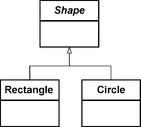

*图15-2 泛化关系*

泛化关系会导致子类与父类之间的强耦合，父类发生的任何变更都会传递给子类，形成所谓的“脆弱的基（父）类”。修改父类的实现需要慎之又慎，因为一处变更就可能影响到它的所有子类，悄悄地改变子类的行为。在面向对象设计要素中，我们往往使用继承这一术语来表示泛化关系。

**2.关联关系**

关联关系代表了类之间的一种结构关系，用以指定一个类的对象与另一个类的对象之间存在连接关系^141。关联关系包括一对一、一对多和多对多关系，在UML类图中分别用连线和数字标记关联关系和关系的数量。如果两个类之间的关联关系存在方向，则需要使用箭头表示关联的导航方向。如果没有箭头，就表示存在双向关联。例如，在图15-3的类图中，用户组UserGroup与用户User存在双向的关联关系，一个用户组可以包含多个用户，一个用户可以同时属于多个用户组，它们的关系为多对多；用户User与密码Password存在具有导航方向的关联关系，一个用户可以拥有多个密码，密码不能拥有用户，它们的关系为一对多。


*图15-3 关联关系的类图*

存在一种特殊的关联关系：关联双方分别体现整体与部分的特征，代表整体的对象包含了代表部分的对象。这就是组合关系。依据关系的强弱，组合关系又分为合成(composition)关系与聚合(aggregation)关系。

合成关系不仅代表了整体与部分的包含关系，还体现了强烈的“所有权”(ownership)特征。这种所有权使得二者的生命周期存在一种啮合关系，即组成合成关系的两个对象属于同一个生命周期。当代表整体概念的主对象被销毁时，代表部分概念的从对象也将随之而被销毁。在UML类图中，使用实心的菱形标记合成关系，菱形标记位于代表整体概念的主类一侧。例如，图15-4中School和Classroom的关系就是合成关系：学校拥有对教室的所有权，学校被销毁了，教室也就不存在了。

聚合关系同样代表了整体和部分的包含关系，却没有所有权特征，不会约束它们的生命周期，故而关联强度要弱于合成关系。在UML类图中，使用空心的菱形标记聚合关系。例如，图15-5中Classroom和Student存在聚合关系：教室并未拥有学生的所有权，教室被销毁了，学生依旧存在。


*图15-4 School与Classroom的合成关系*


*图15-5 Classroom与Student的聚合关系*

在组合关系的连线上，同样可以通过数字标记一对一或一对多关系。例如，在图15-6的类图中，一个School包含多个Classroom。

显然，满足组合关系的两个类不应存在多对多关系，因为两个类不可能互为整体和部分。

**3.依赖关系**

依赖关系代表一个类使用了另一个类的信息或服务。依赖关系存在方向，因此在UML类图中，往往用一个带箭头的虚线线条表示。虚线线条也说明了依赖的双方耦合较弱。依赖关系产生于：

·类的方法接收了另一个类的参数；

·类的方法返回了另一个类的对象；

·类的方法内部创建了另一个类的实例；

·类的方法内部使用了另一个类的成员。

以Driver类与Car类为例，由于Car类的实例作为参数传递给了Driver类的drive()方法，二者建立了图15-7所示的依赖关系。


*图15-6 标记组合关系的数量*


*图15-7 Driver与Car的依赖关系*

在类图中，如果类的名称为斜体字，说明它是一个抽象类型，图15-7中的Car类就是一个抽象类型。

#### 15.4.2 模型的设计约束

领域对象模型表达了领域概念映射的类以及类之间的关系，类的关系导致了对象之间的耦合。如果不对类的关系加以控制，耦合就会蔓延。一旦需要考虑数据持久化、一致性、对象之间的通信机制以及加载数据的性能等设计约束，网状的耦合关系就会成为致命毒药，直接影响领域设计模型的质量。

**1.控制类的关系**

控制类的关系无非从以下3点入手：

·去除不必要的关系；

·降低耦合的强度；

·避免双向耦合。

对象模型是真实世界的体现。真实世界的两个领域概念存在关系，对象模型就会体现这种关系，但对关系类型的确认以及对关系的实现却需要审慎地处理。如果确定类之间的关系没有必要存在，就要果断地“斩断”它。例如，配送单需要订单的信息，看起来需要为它们建立关系，但由于配送单已经和包裹存单建立了关系，从而间接获得了订单的信息，就需要斩断配送单与订单之间的关系。

倘若关系不可避免，就需要考虑降低耦合的强度。

一种策略是引入泛化提取通用特征，形成更弱的依赖或关联关系，如Car对汽车的泛化使得Driver可以驾驶各种汽车。

正确识别合成还是聚合的关联关系，也能降低耦合强度。Grady Booch将合成表达的整体/部分关系定义为“物理包容”，即整体在物理上包容了部分。这也意味着部分不能脱离于整体单独存在。Booch说：“区分物理包容是很重要的，因为在构建和销毁组合体的部分时，它的语义会起作用。”^142例如，订单Order与订单项OrderItem就体现了物理包容的特征，一方面Order对象的创建与销毁意味着OrderItem对象的创建与销毁，另一方面OrderItem也不能脱离Order单独存在，因为没有Order对象，OrderItem对象是没有意义的。

与“物理包容”关系相对的是聚合代表的“逻辑包容”关系，即它们在逻辑上（概念上）存在组合关系，但在物理上整体并未包容部分，例如Customer与Order。虽然客户拥有订单，但客户并没有在物理上包容拥有的订单。客户与订单的生命周期完全独立。

避免双向耦合是对象设计的共识，除非一些特殊模式需要引入“双重委派”，例如设计模式中的访问者(visitor)模式，但这种双重委派主要针对的是类之间的依赖（使用）关系。

存在双向关联的两个类必然会带来双向耦合，因此需要在建立对象模型时注意保持类的单一导航方向。例如，Student与Course存在多对多关系，一个学生可以参加多门课程，一门课程可以有多名学生参加。它们的关系如图15-8所示。


*图15-8 Student与Course的关系*

在代码中，学生与课程的双向关联可以通过为各自类引入集合属性来表达：

```
public class Student {
   private Set<Course> courses = new HashSet<>();
   public Set<Course> getCourses() {
      return this.courses;
   }
}
public class Course {
   private Set<Student> students = new HashSet<>();
   public Set<Student> getStudents() {
      return this.students;
   }
}
```

Student与Course之间彼此引用形成了双向导航。从调用者角度看，双向导航是一种“福音”，因为无论从哪个方向获取信息都很便利。例如，我想要获得学生郭靖选修的课程，通过Student到Course的导航方向有：

```
Student guojing = studentRepository.studentByName（"郭靖"）;
Set<Course> courses = guojing.getCourses();
```

反过来，我想知道“领域驱动设计”这门课程究竟有哪些学生选修，通过Course到Student的导航方向有：

```
Course dddCourse = courseRepository.courseByName（"领域驱动设计"）;
Set<Student> students = dddCourse.getStudents();
```

虽然调用方便了，对象的加载却变得有些笨重，关系更加复杂，甚至出现循环加载的问题。

领域设计模型除了要正确地表达真实世界的领域逻辑，还需要考虑质量因素对设计模型产生的影响。例如，具有复杂关系的对象图对于运行性能和内存资源消耗是否带来了负面影响？想想看，当我们通过资源库分别获得Student类和Course类的实例时，是否需要各自加载所有选修课程与所有选课学生？不幸的是，当你为学生加载了所有选修课程之后，业务场景却不需要这些信息——这不是白费力气嘛！延迟加载(lazy loading)虽然可以解决问题，但它不仅会使模型变得更加复杂，还会受到ORM框架提供的延迟加载实现机制的约束，使得领域设计模型受到外部框架的影响。

**2.引入边界**

在一个复杂的软件系统中，即使通过正确地甄别和控制关系来改进模型，但由于规模的原因，由对象建立的模型最终还是会形成图15-9所示的一张彼此互联互通的对象网。这张对象网好像错综的蜘蛛网，通过一个类的对象可以导航到与之直接或间接连接的类。

随着领域模型规模的增长，这种网状结构会变得越来越复杂，对象的层次变得越来越深，类之间的关系难以梳理和控制，牵一发而动全身。如此下去，模型的实现者和维护者真的可能成为被困在蛛网中的蚊虫了。

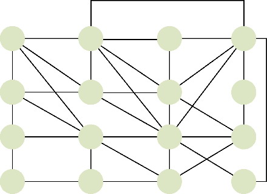

*图15-9 对象网*

对关系的控制可以让对象模型中类之间的关系变得更简单。同时，还需要引入边界来降低和限制领域类之间的关系，不能让关系之间的传递无限蔓延。Eric Evans就说：“减少设计中的关联有助于简化对象之间的遍历，并在某种程度上限制关系的急剧增多。但大多数业务领域中的对象都具有十分复杂的联系，以至于最终会形成很长、很深的对象引用路径，我们不得不在这个路径上追踪对象。在某种程度上，这种混乱状态反映了真实世界，因为真实世界中就很少有清晰的边界。”^81

领域设计模型并非真实世界的直接映射。如果真实世界缺乏清晰的边界，在设计时，我们就应该给它清晰地划定边界。划定边界时，同样需要依据“高内聚松耦合”原则，让一些高内聚的类居住在一个“社区”内，彼此友好地相处；不相干或者松耦合的类分开居住，各自守住自己的边界，在开放“社交通道”的同时，随时注意抵御不正当的访问要求。如此一来，就能形成睦邻友好的协作条约。

这种边界不是限界上下文形成的控制边界，因为它限制的粒度更细，可以认为是类层次的边界。每个边界都有一个主对象作为“社区的外交发言人”，总体负责与外部社区的协作。一旦引入这种类层次的边界，就可以去掉一些类的关系，仅保留主对象之间的关系，原本错综复杂的对象网就变成了如图15-10所示的由各个对象社区组成的对象图，图中的关系变得更加简单而清晰。

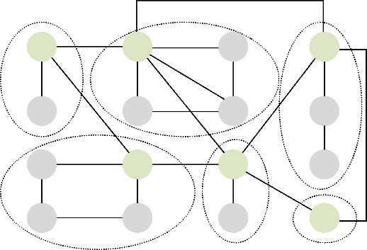

*图15-10 对象社区组成的对象图*

如果规定边界外的对象只能访问边界内的主对象，即将边界视为对内部细节的隐藏，就可以去掉外界不关心的对象，使得图15-10可以进一步简化为如图15-11所示的对象模型。

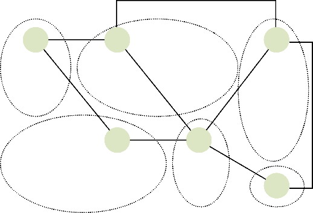

*图15-11 简化的对象模型*

忽略图15-11的边界，只需体现主对象的关系，可以使对象图变得更精简，如图15-12所示。

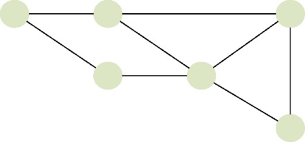

*图15-12 由主对象构成的对象模型*

Eric Evans将这种类层次的边界称为聚合，边界内的主对象称为聚合根。

#### 15.4.3 聚合的定义与特征

Eric Evans阐释了何谓聚合(aggregate)模式：“将实体和值对象划分为聚合并围绕着聚合定义边界。选择一个实体作为每个聚合的根，并允许外部对象仅能持有聚合根的引用。作为一个整体来定义聚合的属性和不变量，并将执行职责赋予聚合根或指定的框架机制。”这一定义说明了聚合的基本特征。

·聚合是包含了实体和值对象的一个边界。

·聚合内包含的实体和值对象形成一棵树，只有实体才能作为这棵树的根。这个根称为聚合根(aggregate root)，这个实体称为根实体(root entity)。

·外部对象只允许持有聚合根的引用，以起到边界的控制作用。

·聚合作为一个完整的领域概念整体，其内部会维护这个领域概念的完整性，体现业务上的不变量约束。

·由聚合根统一对外提供履行该领域概念职责的行为方法，实现内部各个对象之间的行为协作。

如图15-13所示，左侧的聚合结构图体现了以AggregateRoot为根的对象树，右侧的行为序列图则通过聚合根向外暴露整体的领域行为，内部由聚合边界内的实体和值对象共同协作。聚合的边界体现了聚合的控制能力。

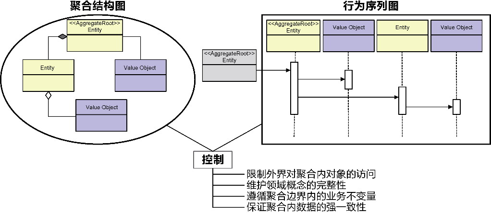

*图15-13 聚合的基本特征*

聚合内部可以包含实体和值对象。由于聚合必须选择实体作为根，因此一个最小的聚合就只有一个实体。聚合根是整个聚合的出入口，通过它控制外界对边界内其他对象的访问。在进行领域设计建模时，我们往往以根实体的名称指代整个聚合，如一个聚合的根实体为订单，则称其为订单聚合。但这并不意味着存在一个订单聚合对象。聚合是边界，不是对象。订单根实体本质上仍然属于实体类型。

聚合内部只能包含实体和值对象，每个对象都遵循信息专家模式，定义了属于自己的属性与行为，故而能够在聚合边界内做到职责的分治，但对外的权利却由聚合根来支配。聚合边界就是封装整体职责的边界，隔离出不同的访问层次。对外，整个聚合是一个完整的设计单元；对内，则需要由聚合来维持业务不变量和数据一致性。

我们必须厘清面向对象的聚合（object oriented聚合，OO聚合）与领域驱动设计的聚合（DDD聚合）之间的区别。例如，Account（账户）与Transaction（交易）之间存在OO聚合关系，一个Account对象可以聚合0～n个Transaction对象，但它们却分别属于两个不同的DDD聚合，即Account聚合和Transaction聚合，如图15-14所示。

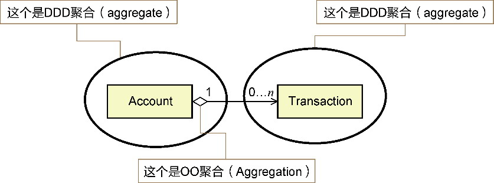

*图15-14 Account聚合和Transaction聚合*

当然，也不能将OO合成与DDD聚合混为一谈。例如，Question（问题）与Answer（答案）共同组成了一个DDD聚合，该DDD聚合的根实体为Question，它与Answer实体的类关系为OO合成关系，如图15-15所示。

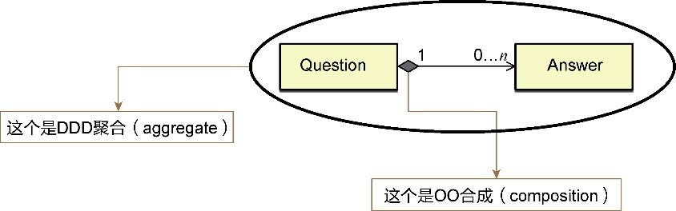

*图15-15 Question聚合*

OO聚合与OO合成代表了类与类之间的组合关系，体现了整体包含了部分的意义。DDD聚合是边界，它的边界内可以只有一个实体对象，也可以包含一些具有关联关系、泛化关系和依赖关系的实体与值对象。

#### 15.4.4 聚合的设计原则

引入聚合的目的是通过合理的对象边界控制对象之间的关系，在边界内保证对象的一致性与完整性，在边界外作为一个整体参与业务行为的协作。显然，聚合在限界上下文与类的粒度之间形成了中间粒度的封装层次，成为表达领域知识、封装领域逻辑的自治设计单元。它的自治性与限界上下文不同，体现为图15-16所示的完整性、独立性、不变量和一致性。

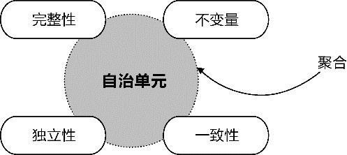

*图15-16 自治的聚合*

**1.完整性**

聚合作为一个受到边界控制的领域共同体，对外由聚合根体现为一个统一的概念，对内则管理和维护着高内聚的对象关系。对内与对外具有一致的生命周期。例如，订单聚合由Order聚合根实体体现订单的领域概念，调用者可以不需要知道订单项OrderItem，也不会认为配送地址Address是一个可以脱离订单单独存在的领域概念。要创建订单，订单项、配送地址等聚合边界内的对象也需要一并创建，否则这个订单对象就不完整。同理，销毁订单对象乃至删除订单对象（倘若设计为可删除）时，在订单聚合边界内的其他对象也需要被销毁乃至删除。

概念的完整性还要受业务场景的影响。例如，在汽车销售的零售商管理系统中，针对整车销售场景，汽车代表了一个整体的领域概念：只有组装了发动机、轮胎、方向盘等必备零配件，汽车才是完整的。但是，对于零配件维修场景，需要对发动机、轮胎、方向盘等零配件进行单独管理和单独跟踪，不能再将它们合并为汽车聚合的内部对象了。因此，除了要考虑领域概念的完整性，还要考虑领域概念是否存在独立性的诉求。

**2.独立性**

追求概念的完整性固然重要，但保证概念的独立性同样重要。

·既然一个概念是独立的，为何还要依附于别的概念呢？例如，发动机需要被独立跟踪，还需要被纳入汽车这个整体概念中吗？

·一旦这个独立的领域概念被分离出去，原有的聚合是否还具备领域概念的完整性呢？例如，“离开了发动机的汽车”概念是否完整？

在理解概念的完整性时，不能将完整性视为关系的集合，认为概念只要彼此关联，就是完整概念的一部分，就需要放到同一个聚合中。完整性除了可以通过聚合来保证，也可以通过聚合之间的关系来保证，二者无非是约束机制不同。例如，考虑到独立跟踪发动机的要求，将其设计为一个单独的聚合，而汽车的完整性仍然可以通过在汽车聚合与发动机聚合之间建立关联的方式来满足。

Vaughn Vernon建议“设计小聚合”^。这主要从系统的性能和可伸缩性角度考虑的，因为维护一个庞大的聚合需要考虑事务的同步成本、数据加载的内存成本等。且不说这个所谓的“小”到底该多小，至少，“过分的小”带来的危害要远远小于“不当的大”。两害相权取其轻，根据领域概念的完整性与独立性划分聚合边界时，应先保证独立性，再考虑完整性。

考虑独立性时，可以针对聚合内的非聚合根实体询问：

·目标聚合是否已经足够完整；

·待合并实体是否会被调用者单独使用。

考虑在线试题领域中问题与答案的关系。Question若缺少Answer就无法保证领域概念的完整性，调用者也不会绕开Question去单独查看Answer，因为Answer离开Question没有任何意义。如果需要删除Question，属于该问题的Answer也没有存在的价值。因此，Question与Answer属于同一个聚合，且以Question实体为聚合根。

同样是问题与答案之间的关系，如果是为在线问答平台设计领域模型，情况就不同了。虽然从完整性看，Question与Answer依然表达了一个共同的领域概念，Answer依附于Question，但由于业务场景允许读者单独针对问题的答案进行赞赏、赞同、评论、分享、收藏等操作，还允许读者单独推荐答案（个别答案甚至成为单独的知识材料供读者学习），这些操作与特征相当于给答案赋予了“完全行为能力”。答案具备了独立性，可以脱离Question聚合，成为单独的Answer聚合。

不同于实体，值对象不存在这种独立性。值对象不能单独成为一个聚合，它必须寻找一个实体作为依存的主体，如Money等与单位、度量有关的值对象甚至会在多个聚合中重复出现。有的值对象甚至因此而需要调整设计，升级为实体，如前所述的Holiday类。

确保聚合的独立性可以指导我们设计出小聚合。聚合的边界本身是为了约束对象图，当我们一个不慎混淆了聚合的边界，就会将对象图的混乱关系蔓延到更高的架构层次，这时，设计小聚合的原则就彰显其价值了。设计在线问答平台时，考虑到Answer的独立性，分别为问题和答案建立了两个单独的聚合。当专属于问题与答案的业务逻辑变得越来越繁杂时，团队规模也将日益增大；随着用户数的增加，并发访问的压力也会增大。为解决此问题，问答平台可能需要单独为答案建立微服务。这时再来审视问与答的领域模型，就体现出Answer聚合的价值了。

对比完整性与独立性，我认为：当聚合边界存在模糊之处时，小聚合显然要优于大聚合。换言之，独立性对聚合边界的影响要高于完整性。

**3.不变量**

Eric Evans将不变量定义为“在数据变化时必须保持的一致性规则，涉及聚合成员之间的内部关系”^83。这句话传递了3个重要概念：

·数据变化；

·内部关系；

·一致。

聚合边界内的实体与值对象都是产生数据变化的因子，不变量要在数据发生变化时保证它们之间的关系仍然保持一致。以配方奶粉为例，以它为根实体的聚合维持了营养成分的不变量，例如100g奶粉，只能含10.4 g蛋白质、26.5 g脂肪、4.45 mg锌、7.0 μg维生素D、81 mg维生素C……如图15-17所示。

PowderedFormula聚合以PowderedFormula类为根实体，内部定义了多个继承自Ingredient类的营养成分值对象。整个聚合要对配方奶粉包含的各种营养成分加以控制和约束，即保证每100g的比例满足营养成分表规定的比例值。当配方奶粉的总量发生变化时，各个营养成分对应的比例应保持不变。这个约束职责由聚合的根实体履行，例如，在构造函数中遵循配方公式，只允许创建出满足配方公式不变量的配方奶粉，如此就能保证公开的add(PowderedFormula)方法不会破坏聚合内部的不变量。

不变量就像数学中的“不变式”（英文同样为invariant）或者“方程式”(formula)。例如等式3x + y=100要求x和y无论怎么变化，都必须恒定地满足等号两边的值的相等关系。等式中的x和y可类比为聚合内的对象，等式就是施加在聚合上的业务约束。如此就可将聚合的不变量定义为施加在聚合边界内部各个对象之上，使其遵守一种恒定关系的业务约束，以公式来表达就是：

```
Aggregate = IV(Root Entity, {Entities}, {Value Objects})
```

其中的IV就是聚合的不变量。

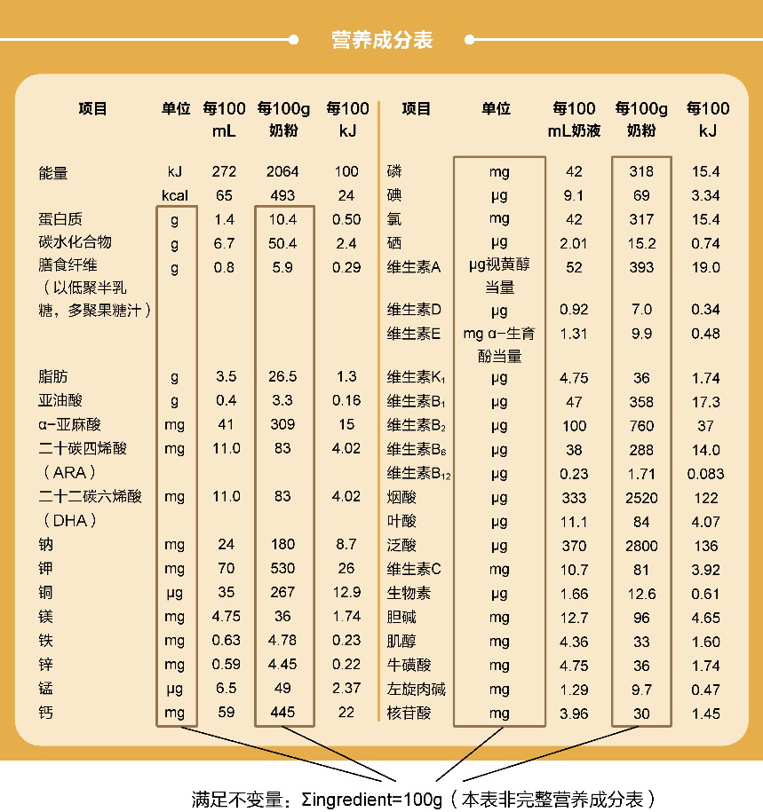

*图15-17 配方奶粉营养成分遵循不变量*

不变量代表了领域逻辑中的业务规则或验证条件，有时也可将不变量理解为“不变条件”或“固定规则”。这是一个充分条件，反过来就未必成立了。例如，“招聘计划必须由人力资源总监审批”是一条业务规则，但该规则是对角色与权限的规定，并非约束招聘计划聚合内部的恒定关系，不是不变量。又例如，“报表类别的名称不可短于8个字符，且不允许重复”是验证条件，对报表聚合内部报表类别值对象的Name属性值进行单独验证，没有对聚合内对象之间的关系进行约束，自然也非不变量。

业务规则可能符合不变量的定义。例如，“一篇博文必须至少有一个博文类别”是一条业务规则，约束了Post实体和值对象PostCategory之间的关系，可以认为是一个不变量。要满足该不变量，需要将Post与PostCategory放到同一个聚合中，并在创建Post时运用该约束检验聚合的合规性，满足该业务规则，如图15-18所示。

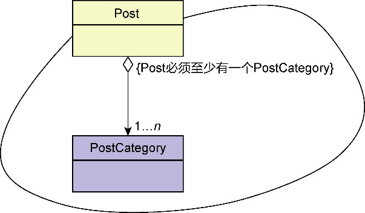

*图15-18 Post聚合维护的不变量*

设计聚合时，可以在业务服务规约的验收标准中寻找具有不变量特征的业务约束。例如，在航班计划限界上下文中，编写“修改航班计划起飞时间与计划到达时间”这一业务服务规约时，给出了如下验收标准：

·若该航班有共享航班，在修改航班计划起飞时间与计划到达时间时，关联的所有共享航班的计划起飞时间与计划到达时间也要随之修改，以保持与主航班的一致，反之亦然。

这一验收标准实则可以视为航班与共享航班之间的不变量。针对这一业务场景，需要将Flight与SharedFlight两个实体放入同一个聚合，且以Flight实体为聚合根。

**4.一致性**

聚合需要保证聚合边界内的所有对象满足不变量约束，其中一个最重要的不变量就是一致性约束，因此也可认为一致性是一种特殊的不变量。

一致性约束可以理解为事务的一致性，即在事务开始前和事务结束后，数据库的完整性约束没有被破坏。考虑电商领域订单与订单项的关系。在创建、修改或删除订单时，要求订单与订单项的数据保证强一致，因而需要将订单与订单项放到同一个聚合。反观博客平台博客与博文之间的关系，博客的创建与博文的创建并非原子操作，归属于两个不同的工作单元。虽然业务的前置条件要求在创建博文之前，对应的博客必须已经存在，但并没有要求博文与博客必须同时创建，修改和删除操作同样如此。也就是说，博客与博文不存在一致性约束，不应该放在同一个聚合。

基于一致性原则，可以将事务的范围与聚合的边界对等来看。事实上，事务的ACID特性与聚合的特性确乎存在对应关系，如表15-1所示。

*表15-1 事务特性与聚合特性的对应关系表*

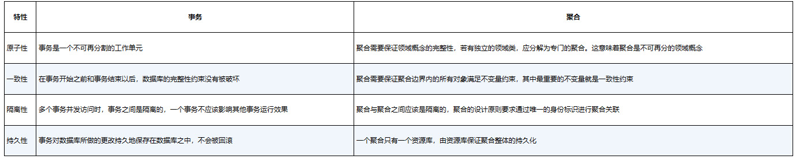

Vaughn Vernon认为：“在单个事务中，只允许对一个聚合实例进行修改，由此产生的其他改变必须在单独的事务中完成。”^这不失为设计良好聚合的规范，且隐含地表述了事务边界与聚合边界的重叠关系。倘若发现一个事务对聚合实例的修改违背了该原则，需酌情考虑修改。

·合并两个聚合：例如在执行分配问题的操作时，需要在修改问题(Issue)状态的同时，生成一条分配记录(Assignment)；若Issue和Assignment被设计为两个聚合，根据本原则，可考虑将二者合并。

·实现最终一致性：例如在执行取款操作时，需要扣除账户(Account)的余额(Balance)，并创建一条新的交易记录(Transaction)；若Account和Transaction被设计为两个聚合，而业务操作又要求二者保证事务的一致性，可考虑在二者之间引入事件，实现事务的最终一致。

遵循领域驱动设计的精神，作为技术手段的事务不应干扰领域模型的设计，故而Vernon的原则只可作为设计聚合的参考，却不能作为绝对的约束，更何况，该原则容易传递让人误解的信号，错以为是由聚合来维护事务的范围。聚合代表领域逻辑，事务代表技术实现，在确定聚合一致性原则时，可以结合事务的特征辅助我们做出判断，但事务对于一致性的实现却不能作为确定聚合边界的绝对标准。

事务范围对聚合边界的影响可从以下几个方面综合考虑。

·简单性：若参与事务范围的多个聚合位于同一进程，引入事件实现事务的最终一致性，会增加方案的复杂度。

·响应能力：虽然参与事务范围的多个聚合位于同一进程，但由此形成的事务范围变大，可能导致长时间事务，影响系统的响应能力。

·演进能力：聚合的边界比限界上下文的边界更稳定，若限界上下文的边界发生了变化，只要保证聚合边界不受影响，引入事件的方式就不会受到限界上下文边界变化的影响，保证了领域模型的稳定性。

一个聚合必须满足事务的一致性，反之则不尽然。事务范围往往面向一个完整的业务服务，怎能奢求参与该业务服务的聚合只能有一个呢？如果按照事务范围来界定聚合边界，反倒会定义出一个大聚合，与聚合的独立性相悖，除非实现最终一致性。

综上，遵循聚合的完整性、独立性、不变量和一致性原则，有利于高质量地设计聚合。完整性将聚合视为一个高内聚的整体；独立性影响了聚合的粒度；不变量是对动态关系的业务约束；一致性体现了聚合数据操作的不可分割，反过来满足了聚合的完整性、独立性和不变量。

**5.最高原则**

领域驱动设计还规定：只有聚合根才是访问聚合边界的唯一入口。这是聚合设计的最高原则。Eric Evans明确提出：“聚合外部的对象不能引用除根实体之外的任何内部对象。根实体可以把对内部实体的引用传递给它们，但这些对象只能临时使用这些引用，而不能保持引用。根可以把一个值对象的副本传递给另一个对象，而不必关心它发生什么变化，因为它只是一个值，不再与聚合有任何关联。作为这一规则的推论，只有聚合的根才能直接通过数据库查询获取。所有其他内部对象必须通过遍历关联来发现。”^83

例如，订单聚合外的对象要修改订单项的商品数量，就需要通过获得Order聚合根实体，然后通过Order操作OrderItem对象进行修改。考虑如下代码：

```
Order order = orderRepo.orderOf(orderId).get();  //通过资源库获得订单聚合
order.changeItemQuantity(orderItemId, quantity); //调用Order聚合根实体的方法修改内存中的订单项
orderRepo.save(order);  //将内存中的修改持久化到数据库
```

changeItemQuantity()方法的封装符合信息专家模式的要求，会促使聚合与外部对象的协作尽量以行为协作方式进行，同时也避免了作为聚合隐私的内部对象暴露到聚合之外，促进了聚合边界的保护作用。

这一最高原则及基于该原则的推论也侧面说明了聚合独立性的重要性：聚合内部的非聚合根实体只能通过聚合根被外界访问，无法独立访问。若需要独立访问该实体，只能将此实体独立出来，为其定义一个单独的聚合。倘若既要满足概念的完整性，又必须支持独立访问实体的需求，同时还需要约束不变量，保证一致性，就必然需要综合判断。由于聚合的最高原则规定了访问聚合的方式，使得独立性在这些权衡因素中稍占上风，成为聚合设计原则的首选。至于分离出去的聚合如何与原聚合建立关系，就需要考虑聚合之间该如何协作了。

#### 15.4.5 聚合的协作

聚合确定的领域概念完整性必然是相对的。在领域分析模型中，每个体现了领域概念的类是模型的最小单元，但在领域设计模型，聚合才是最小的设计单元。遵守“分而治之”的思想，合理划分聚合是“分”的体现，聚合之间的协作则是“合”的诉求。

论及聚合的协作，无非就是判断彼此之间的引用采用什么形式。形式分为两种：

·聚合根的对象引用；

·聚合根身份标识的引用。

根据聚合的最高原则，聚合外部的对象不能引用除根实体之外的任何内部对象，但同时允许聚合内部的对象保持对其他聚合根的引用。不过，领域驱动设计社区对此却有不同的看法，主流声音更建议聚合之间通过身份标识进行引用。但是，这一建议似乎又与对象协作相悖。

对象模型与领域设计模型的一个本质区别就是后者提供了聚合的边界。聚合是一种设计约束，没有边界约束的对象模型可能随着系统规模的扩大变成一匹脱缰的马，让人难以理清楚错综复杂的对象关系。一旦引入了聚合，就不能将边界视为无物，必须尊重边界的保护与约束作用。不当的聚合协作可能会破坏聚合的边界。

在考虑聚合的协作关系时，还必须考虑限界上下文的边界。菱形对称架构不建议复用跨限界上下文的领域模型，若参与协作的聚合分属两个不同的限界上下文，自然当谨慎对待。

不能通过一个独断专行的原则统治聚合之间的所有协作场景，无论采用对象引用，还是身份标识引用，都需要深刻体会聚合为什么要协作，以及采用什么样的协作方式。聚合的协作由于都通过聚合根实体这唯一的入口，就等同于根实体的协作，也就体现为根实体之间的关联关系和依赖关系。

**1.关联关系**

聚合是一个封装了领域逻辑的基本自治单元，但它的粒度无法保证它的独立性，聚合之间产生关联关系也就不可避免。引入聚合的其中一个目的就是控制对象模型因为关联关系导致的依赖蔓延。对于聚合的关联，也当慎重对待。

对象引用往往极具诱惑力，因为它可以使得一个聚合遍历到另一个聚合非常方便，仿佛这才是面向对象设计的正确方式。例如，当Customer引用了由Order聚合根组成的集合对象时，就可通过Customer直接获得该客户所有的订单：

```
public class Customer implements AggregateRoot<Customer> {
   private List<Order> orders;
   public List<Order> getOrders() {
      return this.orders;
   }
}
```

只要坚持不要在Order中定义对Customer的引用，就能避免双向导航。这样的引用关系是否合理呢？

关键在于该由谁来获得客户的订单。在前面讲解上下文映射时，我已阐述了职责分配与履行的原则，由Customer履行订单的查询是不合理的，更何况，Customer聚合与Order聚合并不在同一个限界上下文，如此设计还会导致两个限界上下文的领域模型复用。

在领域驱动设计中，资源库才是Order聚合生命周期的真正主宰！要获得客户的订单，需从订单资源库而非客户导向订单：

```
//client
List<Order> orders = orderRepo.allOrdersBy(customerId);
```

Order和Customer并非对对方一无所知。既然不允许通过对象引用，唯一的方法就是通过身份标识建立关联。只有如此，OrderRepository才能通过customerId获得该客户拥有的所有订单。这种关联是非常隐晦的，也可保证限界上下文之间的解耦，如图15-19所示。

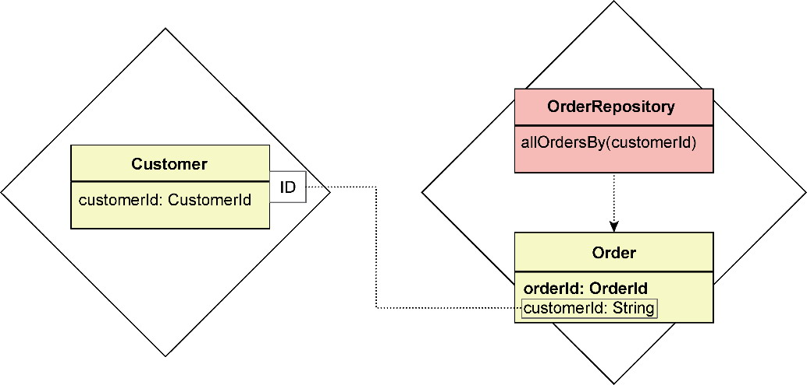

*图15-19 Order通过CustomerId建立关联*

Customer与Order在对象模型中属于普通的关联关系（即非组合的关联关系），又位于不同的限界上下文，彼此通过身份标识建立关联情有可原。然而，两个关联的聚合若属于同一个限界上下文，且属于整体/部分的组合关系，是否也需要通过身份标识建立关联呢？

是的！原因就在于生命周期的管理。

在代码模型中，当你将一个聚合或聚合的集合定义为另一个聚合的字段时，就意味着主聚合需要承担其字段的生命周期管理工作。这一做法已经违背了聚合的设计原则。例如，博客Blog和博文Post分属两个聚合，定义在同一个限界上下文中。它们之间存在组合关系，如下实现仍然不合理：

```
public class Blog extends AggregateRoot<Blog> {
   private List<Post> posts;
   public List<Post> getPosts() {
      return this.posts;
   }
}
```

Blog聚合和Post聚合的生命周期应由各自的资源库分别管理。当BlogRepository在加载Blog聚合时，并不需要加载其下的所有Post，即使采用延迟加载的方式，也不妥当。如果我们将发出导航的聚合称为主聚合，将导航指向的聚合为从聚合，则正确的设计应使得：

·主聚合不考虑从聚合的生命周期，完全不知从聚合；

·从聚合通过主聚合根实体的ID建立与主聚合的隐含关联。

Blog聚合指向Post聚合，Blog为主聚合，Post为从聚合，则设计应调整为：

```
// 主聚合Blog感知不到从聚合Post的信息
public class Blog extends AggregateRoot<Blog> {
   private BlogId blogId;
   ...
}
public class Post extends AggregateRoot<Post> {
   private PostId postId;
   // 通过主聚合的blogId建立关联
   private String blogId;
}
```

既然不允许聚合根之间以对象引用方式建立关联，那么聚合内部的对象就更不能关联外部的聚合根了，这在一定程度上会影响编码的实现。考虑Order聚合内OrderItem实体与Product聚合根之间的关系。毫无疑问，采用对象引用更加简单直接：

```
public class OrderItem extends Entity<OrderItemId> {
   // Product为商品聚合的根实体
   private Product product;
   private Quantity quantity;
   public Product getProduct() {
      return this.product;
   }
}
```

直接通过OrderItem引用的Product聚合根实例即可遍历商品信息：

```
List<OrderItem> orderItems = order.getOrderItems();
orderItems.forEach(oi -> System.out.println(oi.getProduct().getName() + " : " +
oi.getProduct().getPrice());
```

问题在于，Order聚合的资源库无法管理Product聚合的生命周期，也就是说，OrderRepository在获得订单时，无法获得对应的Product对象。既然如此，就应该在OrderItem内部引用Product聚合的身份标识：

```
public class OrderItem extends Entity<OrderItemId> {
   // Product聚合的身份标识
   private String productId;
   public String getProductId() {
      return this.productId;
   }
}
```

通过身份标识引用外部的聚合根，就能解除彼此之间强生命周期的依赖，也避免了加载引用的聚合对象。不管订单和商品是否在同一个限界上下文，若遵循菱形对称架构，订单要获得商品的值都需要通过南向网关的端口获取，区别仅在于调用的是资源库端口，还是客户端端口。只要OrderItem拥有了Product的身份标识，就可以在领域服务或应用服务通过端口获得商品的详细信息。假设订单和商品分处不同限界上下文，应用服务想要获得客户的所有订单，并要求返回的订单中包含商品的信息，就可以通过OrderResponse响应消息的装配器OrderResponseAssembler调用ProductClient获得商品信息，并将其组装为OrderResponse消息：

```
public class OrderAppService {
   @Service
   private OrderService orderService;
   @Service
   private OrderResponseAssembler assembler;
   public OrdersResponse customerOrders(String customerId) {
      List<Order> orders = orderService.allOrdersBy(customerId);
      List<OrderResponse> orderResponses = orders.stream
                                           .map(order -> assembler.assemble(order))
                                           .collect(Collectors.toList());
      return new OrdersReponse(orderResponses);
   }
}
public class OrderResponseAssembler {
   @Service
   private ProductClient productClient;
   public OrderResponse assemble(Order order) {
      OrderResponse orderResponse = transformFrom(order);
      List<OrderItemResponse> orderItemResponses = order.getOrderItems.stream()
                                           .map(oi -> transformFrom(oi))
                                           .collect(Collectors.toList());
      orderResponse.addAll(orderItemResponses);
      return orderResponse;
   }
   private OrderResponse transformFrom(Order order) { ... }
   private OrderItemResponse transformFrom(OrderItem orderItem) {
      OrderItemResponse orderItemResponse = new OrderItemResponse();
      ...
      ProductResponse product = productClient.productBy(orderItem.getProductId());
      orderItemResponse.setProductId(product.getId());
      orderItemResponse.setProductName(product.getName());
      orderItemResponse.setProductPrice(product.getPrice());
      ...      
   }
}
```

若担心每次根据商品ID获取商品信息带来性能损耗，可以考虑为ProductClient的实现引入缓存功能。倘若订单上下文与商品上下文被定义为单独运行的微服务，这一调用还需要跨进程通信，需考虑网络通信的成本。此时，引入缓存就更有必要了。

考虑到限界上下文是领域模型的知识语境，在订单上下文中的订单项关联的商品是否应该定义在商品上下文中呢？显然，在订单上下文定义属于当前知识语境的Product类（若要准确表达领域概念，也可以命名为PurchasedProduct）。该类拥有身份标识，其值来自商品上下文Product聚合根的身份标识，保证了身份标识的唯一性。它虽然具有身份标识，却可以和商品名、价格一起视为它的值，它的生命周期附属在Order聚合的OrderItem实体中，它也无须变更其值，故而可定义为Order聚合的值对象，它的数据与订单一起持久化到订单数据库中。Order的资源库在管理Order聚合的生命周期时，会建立OrderItem指向PurchasedProduct对象的导航。这一设计规避了数据冗余，因此更加合理。原本跨聚合之间的关联关系变成了聚合内部的关联，问题自然迎刃而解了。

在建立领域设计模型时，我们不能照搬面向对象设计得来的经验，直接通过对象引用建立关联，必须让聚合边界的约束力产生价值。

**2.依赖关系**

依赖关系产生的耦合要弱于关联关系，也不要求管理被依赖对象的生命周期。只要存在依赖关系的聚合位于同一个限界上下文，就应该允许一个聚合的根实体直接引用另一个聚合的根实体，以形成良好的行为协作。

聚合之间的依赖关系通常分为两种形式：

·职责的委派；

·聚合的创建。

一个聚合作为另一个聚合方法的参数，就会形成职责的委派。例如，结算账单模板为结算账单提供了模板变量的值、坐标和顺序，可以将二者在生成结算账单时的协作理解为“通过结算账单模板填充内部的值”。将SettlementBillTemplate聚合根实体作为参数传入SettlementBill的方法fillWith()，就是理所当然的实现：

```
public class SettlementBill {
   private List<BillItem> items;
   ...
   public void fillWith(SettlementBillTemplate template) {
      items.foreach(i -> i.fillWith(template.composeVariables());
   }
}
```

SettlementBill.fillWith(SettlementBillTemplate)方法的定义也形成了这两个聚合根实体之间良好的行为协作。

一个聚合创建另外一个聚合，就会形成实例化(instantiate)的依赖关系。这实际是工厂模式的运用，牵涉到对聚合生命周期的管理。

### 15.5 聚合生命周期的管理

领域模型对象的主力军是实体与值对象。这些实体与值对象又被聚合统一管理起来，形成一个个具有一致生命周期的“命运共同体”自治单元。管理领域模型对象的生命周期，实则就是管理聚合的生命周期。

所谓“生命周期”，就是聚合对象从创建开始，在成长过程中经历各种状态的变化，直至最终消亡的过程。在软件系统中，生命周期经历的各种状态取决于存储介质，分为两个层次：内存与硬盘，分别对应对象的实例化与数据的持久化。

当今的主流开发语言大都具备垃圾回收的功能。因此，除了少量聚合对象可能因为持有外部资源（通常要避免这种情形）而需要手动释放内存资源，在内存层次的生命周期管理，主要牵涉到的工作就是创建。一旦创建了聚合的实例，聚合内部各个实体与值对象的状态变更就都发生在内存中，直到聚合对象因为没有引用而被垃圾回收。

由于计算机没法做到永不宕机，且内存资源相对昂贵，一旦创建好的聚合对象在一段时间用不上，就需要被持久化到外部存储设备中，以避免其丢失，节约内存资源。无论采用什么样的存储格式与介质，在持久化层次，针对聚合对象的生命周期管理不外乎增、删、改、查这4个操作。

从对象的角度看，生命周期代表了一个实例从创建到回收的过程，就像从出生到死亡的生命过程。而数据记录呢？生命周期的起点是指插入一条新记录，该记录被删除就是生命周期的终点。领域模型对象的生命周期将对象与数据记录二者结合起来，换言之就是将内存（堆与栈）管理的对象与数据库（持久化）管理的数据记录结合起来，用二者共同表达聚合的整体生命周期，如图15-20所示。

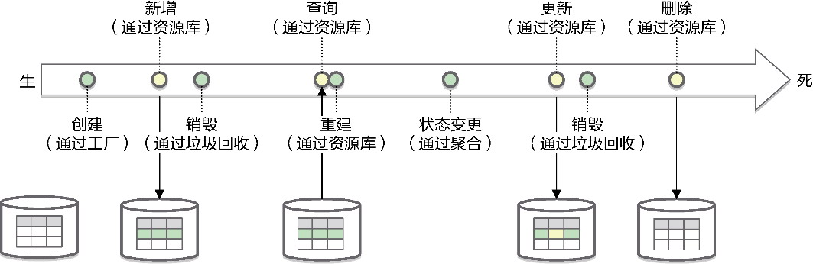

*图15-20 聚合的生命周期*

在领域模型的设计要素中，由聚合根实体的构造函数或者工厂负责聚合的创建，而后对应数据记录的“增删改查”则由资源库进行管理。如图15-20所示，聚合在工厂创建时诞生；为避免内存中的对象丢失，由资源库通过新增操作完成聚合的持久化；若要修改聚合的状态，需通过资源库执行查询，对查询结果进行重建获得聚合；在内存中进行状态变更，然后通过持久化确保聚合对象与数据记录的一致；直到删除了持久化的数据，聚合才真正宣告死亡。以文章聚合的生命周期为例：

```
// 创建文章
// 通过Post的工厂方法在内存中创建
Post post = Post.of(title, author, abstract, content);
//持久化到数据库
postRepository.add(post);
// 发布文章
// 根据postId查找数据库的Post，在内存重建Post对象
Post post = postRepository.postOf(postId);
// 内存的操作，内部会改变文章的状态
post.publish();
// 将改变的状态持久化到数据库
postRepository.update(post);
// 删除文章
// 从数据库中删除指定文章
postRepository.remove(postId);
```

需要分清楚以上代码中哪些是内存中的操作，哪些是持久化的操作。

#### 15.5.1 工厂

创建是一种“无中生有”的工作，对应于面向对象编程语言，就是类的实例化。聚合是边界，聚合根则是对外交互的唯一通道，理应承担整个聚合的实例化工作。若要严格控制聚合的生命周期，可以禁止任何外部对象绕开聚合根直接创建其内部的对象。在Java语言中，可以为每个聚合建立一个包(package)，除聚合根之外，聚合内的其他实体和值对象的构造函数皆定义为默认访问修饰符。一个聚合一个包，位于包外的其他类就无法访问这些对象的构造函数。例如Question聚合：

```
// questioncontext为问题上下文
// question为Question聚合的包名
package com.dddexplained.dddclub.questioncontext.domain.question;
public class Question extends Entity<QuestionId> implements AggregateRoot<Question> {
   public Question(String title, String description) {...}
}
// Question聚合内的Answer与聚合根位于同一个包
package com.dddexplained.dddclub.questioncontext.domain.question;
public class Answer {
   // 定义为默认访问修饰符，只允许同一个包的类访问
   Answer(String... results) {...}
}
```

许多面向对象语言都支持类通过构造函数创建它自己。说来奇怪，对象自己创建自己，就好像自己扯着自己的头发离开地球表面，完全不合情理，只是开发人员已经习以为常了。然而，构造函数差劲的表达能力与脆弱的封装能力，在面对复杂的构造逻辑时，显得有些力不从心。遵循“最小知识法则”，我们不能让调用者了解太多创建的逻辑，以免加重其负担，并带来创建代码的四处泛滥，何况创建逻辑在未来很有可能发生变化。基于以上因素考虑，有必要对创建逻辑进行封装。领域驱动设计引入工厂(factory)承担这一职责。

工厂是创建产品对象的一种隐喻。《设计模式：可复用面向对象软件的基础》的创建型模式引入了工厂方法(factory method)模式、抽象工厂(abstract factory)模式和构建者(builder)模式，可在封装创建逻辑、保证创建逻辑可扩展的基础上实现产品对象的创建。除此之外，通过定义静态工厂方法创建产品对象的简单工厂模式也因其简单性得到了广泛使用。领域驱动设计的工厂并不限于使用哪一种设计模式。一个类或者方法只要封装了聚合对象的创建逻辑，都可以被认为是工厂。除了极少数情况需要引入工厂方法模式或抽象工厂模式，主要表现为以下形式：

·由被依赖聚合担任工厂；

·引入专门的聚合工厂；

·聚合自身担任工厂；

·消息契约模型或装配器担任工厂；

·使用构建者组装聚合。

**1.由被依赖聚合担任工厂**

领域驱动设计虽然建议引入工厂创建聚合，但并不要求必须引入专门的工厂类，而是可由一个聚合担任另一个“聚合的工厂”。担任工厂角色的聚合称为“聚合工厂”，被创建的聚合称为“聚合产品”。聚合工厂往往由被引用的聚合来承担，如此就可以将自己拥有的信息传给被创建的聚合产品。例如，Blog聚合可以作为Post聚合的工厂：

```
public class Blog extends Entity<BlogId> implements AggregateRoot<Blog> {
   // 工厂方法是一个实例方法，无须再传入BlogId
   public  Post createPost(String title, String content) {
      // 这里的id是Blog的Id
      // 通过调用value()方法将id的值传递给Post，建立它与Blog的隐含关联
      return new Post(this.id.value(), title, content, this.authorId);
   }
}
```

PostService领域服务作为调用者，可通过Blog聚合创建文章：

```
public class PostService {
   private BlogRepository blogRepository;
   private PostRepository postRepository;
   public void writePost(String blogId, String title, String content) {
      Blog blog = blogRepository.blogOf(BlogId.of(blogId));
      Post post = blog.createPost(title, content);
      postRepository.add(post);
   }
}
```

当聚合产品的创建需用到聚合工厂的“知识”时，就可考虑这一设计方式。例如，培训上下文定义了Training和Course聚合，而创建Training聚合时需要判断Course的日程信息：

```
public class Course extends Entity<CourseId> implements AggregateRoot<Course> {
   private List<Calendar> calendars = new ArrayList<>();
   public Training createFrom(CalendarId calendarId) {
      if (notContains(calendarId)) {
         throw new TrainingException("Selected calendar is not scheduled for current 
course.");
      }
      return new Training(this.id, calendarId);
   }
   // calendars是Course拥有的知识，要通过它确定培训的Calendar属于课程日常计划
   private boolean notContains(CalendarId calendarId) {
      return calendars.stream().allMatch(c -> c.id().equals(calendarId));
}
}
```

由于创建方法会产生聚合工厂与聚合产品之间的依赖，若二者位于不同限界上下文，遵循菱形对称架构的要求，应当避免这一设计。

**2.引入专门的聚合工厂**

当创建的聚合属于一个多态的继承体系时，构造函数就无能为力了。例如，航班Flight聚合本身形成了一个继承体系，并组成图15-21所示的聚合：

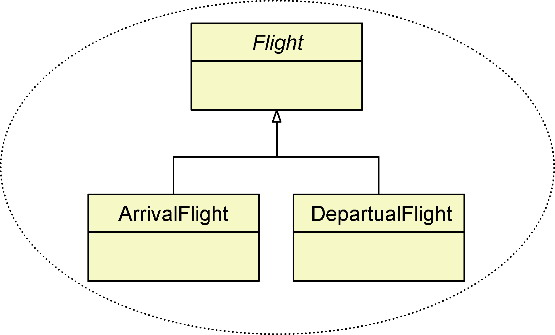

*图15-21 具有继承体系的Flight聚合*

根据进出港标志，可确定该航班针对当前机场究竟为进港航班还是离港航班，从而创建不同的子类。由于子类的构造函数无法封装这一创建逻辑，我们又不能将创建逻辑的判断职责“转嫁”给调用者，就有必要引入专门的FlightFactory工厂类：

```
public class FlightFactory {
   pubic static Flight createFlight(String flightId, String ioFlag, String airportCode, String
airlineIATACode...) {
      if (ioFlag.equalsIgnoreCase("A")) {
          return new ArrivalFlight(flightId, airportCode, airlineIATACode...);
      }
      return new DepartualFlight(flightId, airportCode, airlineIATACode...);
   }
}
```

当然，为了满足聚合创建的未来变化，亦可考虑引入工厂方法模式或抽象工厂模式，甚至通过获得类型元数据后利用反射来创建。创建方式可以是读取类型的配置文件，也可以遵循惯例优于配置(convention over configuration)原则，按照类命名惯例组装反射需要调用的类名。

由于不建议聚合依赖于访问外部资源的端口，引入专门工厂类的另一个好处是可以通过它依赖端口获得创建聚合时必需的值。例如，在创建跨境电商平台的商品聚合时，海外商品的价格采用了不同的汇率，在创建商品时，需要将不同的汇率按照当前的汇率牌价统一换算为人民币。汇率换算器ExchangeRateConverter需要调用第三方的汇率换算服务，实际上属于商品上下文南向网关的客户端端口。工厂类ProductFactory会调用它：

```
public class ProductFactory {
   @Autowired
   private ExchangeRateConverter converter;
   public Product createProduct(String name, String description, Price price...) {
      Money valueOfPrice = converter.convert(price.getValue());
      return new Product(name, description, new Price(valueOfPrice));
   }
}
```

由于需要通过依赖注入将适配器实现注入工厂类，故而该工厂类定义的工厂方法为实例方法。为了防止调用者绕开工厂直接实例化聚合，可考虑将聚合根实体的构造函数声明为包范围内限制，并将聚合工厂与聚合产品放在同一个包。

**3.聚合自身担任工厂**

聚合产品自身也可以承担工厂角色。这是一种典型的简单工厂模式，例如由Order类定义静态方法，封装创建自身实例的逻辑：

```
package com.dddexpained.ecommerce.ordercontext.domain.order;
public class Order...
   // 定义私有构造函数
   private Order(CustomerId customerId, ShippingAddress address, Contact contact, 
Basket basket) { //... }
   public static Order createOrder(CustomerId customerId, ShippingAddress address, 
Contact contact, Basket basket) {
      if (customerId == null || customerId.isEmpty()) {
         throw new OrderException("Null or empty customerId.");
      }
      if (address == null || address.isInvalid()) {
         throw new OrderException("Null or invalid address.");
      }
      if (contact == null || contact.isInvalid()) {
         throw new OrderException("Null or invalid contact.");
      }      
      if (basket == null || basket.isInvalid()) {
         throw new OrderException("Null or invalid basket.");
      }
      return new Order(customerId, address, contact, basket);
   }
}
```

这一设计方式无须多余的工厂类，创建聚合对象的逻辑也更加严格。由于静态工厂方法属于产品自身，因此可将聚合产品的构造函数定义为私有。调用者除了通过公开的工厂方法获得聚合对象，别无他法可寻。当聚合作为自身实例的工厂时，该工厂方法不必死板地定义为create××× ()。可以使用诸如of()、instanceOf()等方法名，使得调用代码看起来更加自然：

```
Order order = Order.of(customerId, address, contact, basket);
```

不只聚合的工厂，对于领域模型中的实体与值对象（包括ID类），都可以考虑定义这样具有业务含义或提供自然接口的静态工厂方法，使得创建逻辑变得更加合理而贴切。

**4.消息契约模型或装配器担任工厂**

设计服务契约时，如果远程服务或应用服务接收到的消息是用于创建的命令请求，则消息契约与领域模型之间的转换操作，实则是聚合的工厂方法。

例如，买家向目标系统发起提交订单的请求就是创建Order聚合的命令请求。该命令请求包含了创建订单需要的客户ID、配送地址、联系信息、购物清单等信息，这些信息被封装到PlacingOrderRequest消息契约模型对象中。响应买家请求的是OrderController远程服务，它会将该消息传递给应用服务，再进入领域层发起对聚合的创建。应用服务在调用领域服务时，需要将消息契约模型转换为领域模型，也就是调用消息契约模型的转换方法toOrder()。它实际上就是创建Order聚合的工厂方法：

```
package com.dddexpained.ecommerce.ordercontext.message;
public class PlacingOrderRequest implements Serializable {
   // 创建Order聚合的工厂方法
   public Order toOrder() { ... }
}
public class OrderAppService {
   private OrderService orderService;
   @Transactional
   public void placeOrder(PlacingOrderRequest orderRequest) {
      try {
         // 通过请求对象创建Order聚合
         orderService.placeOrder(orderRequest.toOrder());
      } catch (DomainException ex) { ... }
   }
}
```

如果消息契约模型持有的信息不足以创建对应的聚合对象，可以在北向网关层定义专门的装配器，将其作为聚合的工厂。它可以调用南向网关的端口获取创建聚合需要的信息。

**5.使用构建者组装聚合**

聚合作为相对复杂的自治单元，在不同的业务场景可能需要有不同的创建组合。一旦需要多个参数进行组合创建，构造函数或工厂方法的处理方式就会变得很笨拙，需要定义各种接收不同参数的方法响应各种组合方式。构造函数尤为笨拙，毕竟它的方法名是固定的。如果构造参数的类型与个数一样，含义却不相同，构造函数更是无能为力。

Joshua Bloch就建议：“遇到多个构造函数参数时要考虑用构建者(builder)。”^用构建者Builder的构建方法返回构建者自身，可以编写出遵循流畅接口(fluent interface)编程风格的API，完成对聚合对象的组装。流畅接口往往将一段长长的代码理成一条类似自然语言的句子，使代码更容易阅读。在提供流畅接口风格的构建API时，必须保证聚合的必备属性需要事先被组装，不允许调用者有任何机会创建出不健康的残缺聚合对象。

构建者模式有两种实现风格。一种风格是单独定义Builder类，由它对外提供组合构建聚合对象的API。单独定义的Builder类可以与产品类完全分开，也可以定义为产品类的内部类。例如对航班聚合对象的创建：

```
public class Flight extends Entity<FlightId> implements AggregateRoot<Flight> {
   private String flightNo;
   private Carrier carrier;
   private Airport departureAirport;
   private Airport arrivalAirport;
   private Gate boardingGate;
   private LocalDate flightDate;
   public static Builder prepareBuilder(String flightNo) {
      return new Builder(flightNo);
   }
   public static class Builder {
      // required fields
      private final String flightNo;
      // optional fields
      private Carrier carrier;
      private Airport departureAirport;
      private Airport arrivalAirport;
      private Gate boardingGate;
      private LocalDate flightDate;
      private Builder(String flightNo) {
         this.flightNo = flightNo;
      }
      public Builder beCarriedBy(String airlineCode) {
         carrier = new Carrier(airlineCode);
         return this;
      }
      public Builder departFrom(String airportCode) {
         departureAirport = new Airport(airportCode);
         return this;
      }
      public Builder arriveAt(String airportCode) {
         arrivalAirport = new Airport(airportCode);
         return this;
      }
      public Builder boardingOn(String gateNo) {
         boardingGate = new Gate(gateNo);
         return this;
      }
      public Builder flyingIn(LocalDate flyingInDate) {
         flightDate = flyingInDate;
         return this;
      }
      public Flight build() {
         return new Flight(this);
      }
   }
   private Flight(Builder builder) {
      flightNo = builder.flightNo;
      carrier = builder.carrier;
      departureAirport = builder.departureAirport;
      arrivalAirport = builder.arrivalAirport;
      boardingGate = builder.boardingGate;
      flightDate = builder.flightDate;
   }
}
```

客户端可以使用如下的流畅接口创建Flight聚合：

```
Flight flight = Flight.prepareBuilder("CA4116")
                .beCarriedBy("CA")
                .departFrom("PEK")
                .arriveAt("CTU")
                .boardingOn("C29")
                .flyingIn(LocalDate.of(2019, 8, 8))
                .build();
```

构建者的构建方法可以对参数施加约束条件，避免非法值传入。在上述代码中，由于实体属性大多数被定义为值对象，故而构建方法对参数的约束被转移到了值对象的构造函数中。定义构建方法时，要结合自然语言风格与领域逻辑为方法命名，使得调用代码看起来更像进行一次英文交流。

另一种实现风格是由被构建的聚合对象担任近乎Builder的角色，然后将可选的构造参数定义到每个单独的构建方法中，并返回聚合对象自身以形成流畅接口。仍然以Flight聚合根实体为例：

```
public class Flight extends Entity<FlightId> implements AggregateRoot<Flight> {
   private String flightNo;
   private Carrier carrier;
   private Airport departureAirport;
   private Airport arrivalAirport;
   private Gate boardingGate;
   private LocalDate flightDate;
   // 聚合必备的字段要在构造函数的参数中给出
   private Flight(String flightNo) {
      this.flightNo = flightNo;
   }
   public static Flight withFlightNo(String flightNo) {
      return new Flight(flightNo);
   }
   public Flight beCarriedBy(String airlineCode) {
      this.carrier = new Carrier(airlineCode);
      return this;
   }
   public Flight departFrom(String airportCode) {
      this.departureAirport = new Airport(airportCode);
      return this;
   }
   public Flight arriveAt(String airportCode) {
      this.arrivalAirport = new Airport(airportCode);
      return this;
   }
   public Flight boardingOn(String gate) {
      this.boardingGate = new Gate(gate);
      return this;
   }
   public Flight flyingIn(LocalDate flightDate) {
      this.flightDate = flightDate;
      return this;
   }
}
```

相较于第一种风格，它的构建方式更为流畅。从调用者角度看，它没有显式的构建者类，也没有强制要求在构建最后调用build()方法：

```
Flight flight = Flight.withFlightNo("CA4116")
                .beCarriedBy("CA")
                .departFrom("PEK")
                .arriveAt("CTU")
                .boardingOn("C29")
                .flyingIn(LocalDate.of(2019, 8, 8));
```

无论采用哪一种风格，都需要遵循统一语言对方法进行命名，使其清晰地表达业务含义和领域知识。

#### 15.5.2 资源库

资源库(repository)是对数据访问的一种业务抽象。在菱形对称架构中，它是南向网关的端口，可以解耦领域层与外部环境，使领域层变得更为纯粹。资源库可以代表任何可以获取资源的仓库，例如网络或其他硬件环境，而不局限于数据库。图15-22体现了资源库的抽象意义。

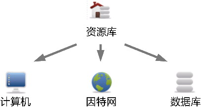

*图15-22 资源库的抽象*

领域驱动设计引入资源库，主要目的是管理聚合的生命周期。工厂负责聚合实例的诞生，垃圾回收负责聚合实例的消亡，资源库就负责聚合记录的查询与状态变更，即“增删改查”操作。资源库分离了聚合的领域行为和持久化行为，保证了领域模型对象的业务纯粹性。它和其他端口一起，成为隔离业务复杂度与技术复杂度的关键。

**1.一个聚合一个资源库**

聚合是领域建模阶段的基本设计单元，因此，管理领域模型对象生命周期的基本单元就是聚合，领域驱动设计规定：一个聚合对应一个资源库。如果要访问聚合内的非根实体，也只能通过资源库获得整个聚合后，将根实体作为入口，在内存中访问封装在聚合边界内的非根实体对象。

Eric Evans指出：“我们可以通过对象之间的关联来找到对象。但当它处于生命周期的中间时，必须要有一个起点，以便从这个起点遍历到一个实体或者对象。”^97这个所谓的“起点”，就是通过资源库查询重建后得到聚合对象的那个点，因为只有在这个时候，我们才能获得聚合对象，并以此为起点遍历聚合的根实体及内部的实体和值对象。

资源库与数据访问对象的区别

同样都是访问数据，资源库与数据访问对象(data access object，DAO)有何区别呢？

数据访问对象封装了管理数据库连接以及存取数据的逻辑，对外为调用者提供了统一的访问接口。在为数据访问对象建立抽象接口后，利用依赖注入改变依赖方向，即可解除领域层对数据访问技术细节的依赖，满足“整洁架构”思想，隔离业务逻辑与数据访问逻辑。从对技术的隔离和访问逻辑的职责分配来看，二者没有区别。

根本区别在于，数据访问对象在访问数据时，并无聚合的概念，也就是没有定义聚合的边界约束领域模型对象，使得数据访问对象的操作粒度可以针对领域层的任何模型对象。这就为调用者打开了“方便之门”，使其能够自由自在地操作实体和值对象。没有聚合边界控制的数据访问，会在不经意间破坏领域概念的完整性，突破聚合不变量的约束，也无法保证聚合对象的独立访问与内部数据的一致性。

资源库是完美匹配聚合的设计模式，要管理一个聚合的生命周期，不能绕开资源库。同时，资源库也不能绕开聚合根实体直接操作聚合边界内的其他非根实体。例如，要为订单添加订单项，不能为OrderItem定义专门的资源库。如下做法是错误的：

```
OrderItemRepository oderItemRepo;
orderItemRepo.add(orderId, orderItem);
```

OrderItem作为Order聚合的内部实体，添加订单项要以Order根实体作为唯一的操作入口：

```
OrderRepository orderRepo;
Order order = orderRepo.orderOf(orderId).get();  //orderOf()返回的是Optional<Order>
order.addItem(orderItem);
orderRepo.update(order);
```

在引入聚合与资源库后，对聚合内部实体的操作，应从对象模型的角度考虑。通过Order聚合根的addItem()方法实现对订单项的添加，亦可保证订单领域概念的完整性，满足不变量。例如，该方法可以判断要添加的OrderItem对象是否有效，并根据OrderItem中的productId判断究竟是添加订单项，还是合并订单项，然后修改订单项中所购商品的数量。

**2.资源库端口的定义**

资源库作为端口，可以视为存取聚合资源的容器。Eric Evans认为：“它（指资源库）的行为类似于集合(collection)，只是具有更复杂的查询功能。在添加和删除相应类型的对象时，资源库的后台机制负责将对象添加到数据库中，或从数据库中删除对象。这个定义将一组紧密相关的职责集中在一起，这些职责提供了对聚合根的整个生命周期的全程访问。”^100既然认为资源库是“聚合集合”的隐喻，在设计资源库端口时，亦可参考此特征定义接口方法的名称。例如，定义通用的Repository：

```
public interface Repository<T extends AggregateRoot> {
   // 查询
   Optional<T> findById(Identity id);
   List<T> findAll();
   List<T> findAllMatching(Criteria criteria);
   boolean contains(T t);
   // 新增
   void add(T t);
   void addAll(Collection<? extends T> entities);
   // 更新
   void replace(T t);
   void replaceAll(Collection<? extends T> entities);
   // 删除
   void remove(T t);
   void removeAll();
   void removeAll(Collection<? extends T> entities);
   void removeAllMatching(Criteria criteria);
}
```

资源库端口定义的接口使用了泛型，泛型约束为AggregateRoot类型，它的接口方法涵盖了与聚合生命周期有关的所有“增删改查”操作。理论上，所有聚合的资源库都可以实现该接口，如Order聚合的资源库为Repository<Order&gt;。根据ORM框架持久化机制的不同，可以为Repository<T&gt;接口提供不同的实现，如图15-23所示。

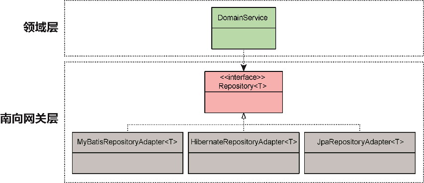

*图15-23 通用的资源库接口*

这么一个通用的资源库接口看似美好，实则具有天生的缺陷。

其一，并非所有聚合的资源库都愿意拥有大而全的资源库接口方法。例如，Order聚合不需要删除方法，又或者虽然对外公开为delete()，内部却按照需求执行了订单状态的变更操作。该如何让Repository<Order&gt;满足这一特定需求？

其二，过于通用的接口无法体现特定的业务需求。接口定义的查询或删除方法可以接收条件参数Criteria，目的是满足各种不同的查询与删除需求，但Criteria的组装无疑加重了调用者的负担。例如，查询指定顾客正在处理中的订单：

```
Criteria customerIdCriteria = new EquationCriteria("customerId", customerId);
Criteria inProgressCriteria = new EquationCriteria("orderStatus", OrderStatus.InProgress);
orderRepository.findAllMatching(customerIdCriteria.and(inProgressCriteria));
```

虽然通用的资源库接口有种种不足，但它的通用意义与复用价值仍有可取之处。要在复用、封装和代码可读性之间取得平衡，需将南向网关的端口与适配器视为两个不同的关注点。扮演端口角色的资源库接口面向以聚合为基本自治单元的领域逻辑，扮演适配器角色的资源库实现则面向持久化框架，负责完成整个聚合的生命周期管理。由于通用的资源库接口未体现业务含义，不应视为资源库端口的一部分，需转移到适配器层，被不同的资源库适配器复用。

以订单聚合为例。它的资源库端口面向聚合：

```
package com.dddexplained.ecommerce.ordercontext.southbound.port.repository;
public interface OrderRepository {
   // 查询方法的命名更加倾向于自然语言，不必体现find的技术含义
   Optional<Order> orderOf(OrderId orderId);
   // 以下两个方法在内部实现时，需要组装为通用接口的criteria
   Collection<Order> allOrdersOfCustomer(CustomerId customerId);
   Collection<Order> allInProgressOrdersOfCustomer(CustomerId customerId);
   void add(Order order);
   void addAll(Iterable<Order> orders);
   // 业务上是更新(update)，而非替换(replace)
   void update(Order order);
   void updateAll(Iterable<Order> orders);
   // 根据订单的需求，不提供删除方法
}
```

对应的资源库适配器提供了具体的实现：

```
package com.dddexplained.ecommerce.ordercontext.southbound.adapter.repository;
public class OrderRepositoryAdapter implements OrderRepository {
   // 以委派形式复用通用的资源库接口
   private Repository<Order, OrderId> repository;
   // 注入真正的资源库实现
   public OrderRepositoryAdapter(Repository<Order, OrderId> repository) {
      this.repository = repository;
   }
   public Optional<Order> orderOf(OrderId orderId) {
      return repository.findById(orderId);
   }
   public Collection<Order> allOrdersOfCustomer(CustomerId customerId) {
      // 封装了组装查询条件的逻辑
      Criteria customerIdCriteria = new EquationCriteria("customerId", customerId);
      return repository.findAllMatching(customerIdCriteria);
   }
   public Collection<Order> allInProgressOrdersOfCustomer(CustomerId customerId) {
      Criteria customerIdCriteria = new EquationCriteria("customerId", customerId);
      Criteria inProgressCriteria = new EquationCriteria("orderStatus",OrderStatus.
InProgress);
      return repository.findAllMatching(customerIdCriteria.and(inProgressCriteria));
   }
   public void add(Order order) {
      repository.save(order);
   }
   public void addAll(Collection<Order> orders) {
      repository.saveAll(orders);
   }
   public void update(Order order) {
      repository.save(order);
   }
   public void updateAll(Collection<Order> orders) {
      repository.saveAll(orders);
   }
}
```

OrderRepositoryAdapter适配器注入通用的资源库接口，实际上是将持久化的实现委派给了通用资源库接口的实现类。既然通用的资源库接口不再面向领域层的聚合，设计时就无须考虑所谓“集合”的隐喻，可以根据持久化实现机制的要求，将add()操作与replace()操作合二为一，用save()方法代表。接口方法的命名也可以遵循数据库操作的通用叫法，如删除操作仍然命名为delete()，以下是修改后的资源库通用接口：

```
public interface Repository<E extends AggregateRoot, ID extends Identity> {
   Optional<E> findById(ID id);
   List<E> findAll();
   List<E> findAllMatching(Criteria criteria);
   boolean exists(ID id);
   void save(E entity);
   void saveAll(Collection<? extends E> entities);
   void delete(E entity);
   void deleteAll();
   void deleteAll(Collection<? extends E> entities);
   void deleteAllMatching(Criteria criteria);
}
```

资源库端口、资源库适配器和通用资源库（包括接口与实现）组成了南向网关的资源库网关层。它们各自承担自己的职责，在限界上下文的南向网关中扮演各自的角色，既做到了对聚合生命周期管理的可读接口定义，又做到了业务逻辑与技术实现的隔离，还在一定程度上满足了持久化实现的复用要求，如图15-24所示。

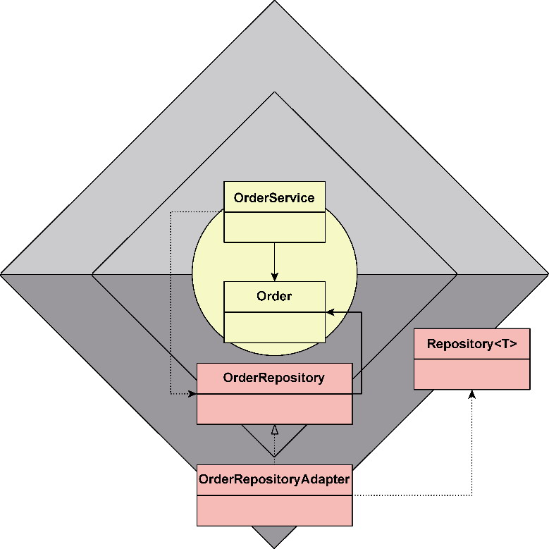

*图15-24 资源库端口、适配器与通用资源库*

领域服务OrderService调用OrderRepository端口管理Order聚合，端口的实现则为资源库适配器OrderRepositoryAdapter，通过依赖注入。为避免重复实现，在OrderRepositoryAdapter类的内部，持久化的真正工作又委派给了通用接口Repository<T&gt;，实现了Repository<T&gt;接口的具体类再完成聚合的生命周期管理。

针对资源库查询方法的设计，社区存在争议。大致可分为两派。

一派支持设计简单通用的资源库查询接口，让资源库回归本质，老老实实做好查询的工作。条件查询接口保持通用性，将查询条件的组装工作交由调用者，不然，资源库接口就需要穷举所有可能的查询条件。一旦业务增加了新的查询条件，就要修改资源库接口。如订单聚合的接口定义，在定义了allInProgressOrdersOfCustomer(customerId)方法之后，是否意味着还需要定义allCancelledOrdersOfCustomer(customerId)之类的方法呢？

另一派坚持将查询接口明确化，根据资源库的个性需求定义查询方法，方法命名也体现了领域逻辑。封装了查询条件的查询接口不会将Criteria泄露出去，归根结底，Criteria的定义本身并不属于领域层。这样的查询方法既有其业务含义，又能通过封装减轻调用者的负担。

两派观点各有其道理。一派以通用性换取接口的可扩展，却牺牲了接口方法的可读性；另一派以封装获得接口的可读性，却因为方法过于具体导致接口膨胀与不稳定。

从资源库的领域特征看，我倾向于后者，但为了兼顾可扩展性与可读性，倒不如一边为资源库定义常见的个性化查询方法，一边保留对查询条件的支持。此外，查询接口的具体化与抽象化也可折中。如查询“处理中”与“已取消”的订单，差异在于被查询订单的状态，故可将订单状态提取为查询方法的参数：

```
Collection<Order> allOrdersOf(CustomerId customerId, OrderStatus orderStatus);
```

从资源库的调用角度分析，资源库的调用者包括领域服务和应用服务。如果没有严格地设计约束限制应用服务与资源库之间的协作，一旦资源库提供了通用的查询接口，就会将组装查询条件的代码混入应用层，违背了保持应用层“轻薄”的原则。要么限制资源库的通用查询接口，要么限制应用层直接依赖资源库，如何取舍，还得结合具体业务场景做出最适合当前情况的判断。

资源库的条件查询接口设计还有第三条路可走，即引入规格(specification)模式来封装查询条件。查询条件与规格模式是两种不同的设计模式。

查询条件是一种表达式，采用了解释器(interpreter)模式^的设计思想，为逻辑表达式建立统一的抽象（如前所示的Criteria接口），然后将各种原子条件表达式定义为表达式子类（如前所示的AndCriteria类）。这些子类会实现解释方法，将值解释为条件表达式。

规格模式是策略(strategy)模式^的体现，为所有规格定义一个共同的接口，如Specification接口的isSatisfied()方法。各个规格子类实现该方法，结合规则返回Boolean值。

相较于查询条件表达式，规格模式的封装性更好。可以按照业务规则定义不同的规格子类，并且通过规格接口做到对领域规则的扩展，但业务规则的组合可能带来规格子类的数量产生爆炸性增长。与之相反，查询条件的设计方式着重寻找原子表达式，然后将组装的职责交由调用者，因此能够更加灵活地应对各种业务规则的变化，但欠缺足够的封装，将条件的组装逻辑暴露在外，加重了调用者的负担，也容易带来组装逻辑的重复。

如果系统采用CQRS模式（参见第18章）将查询与命令分离，则在命令模型的资源库中，除了保留根据聚合根实体ID获得聚合的查询方法，其余查询方法皆转移到了查询模型。CQRS模式的查询模型不再使用领域模型，也就没有了聚合的概念，可以自由自在地运用数据访问对象模式，甚至支持直接编写SQL语句。故而，CQRS模式的查询接口不在资源库的讨论之列。

### 15.6 领域服务

既然已经有了聚合这一自治的设计单元，且它遵循信息专家模式，其内部的实体与值对象皆承担了与其数据相关的领域行为逻辑，构成了一种富领域模型(rich domain model)，为何还需要引入领域服务(domain service)呢？

#### 15.6.1 聚合的问题

聚合封装了多个实体和值对象，聚合根是访问聚合的唯一入口。当业务需求需要调用聚合内实体或值对象的方法时，聚合当隐去其细节，用根实体包装这些方法，然后在方法的内部实现中将外部的请求委派给内部相应的类。封装的领域行为被固化在聚合之中，成为丰富聚合行为的关键。问题在于，虽然一些领域行为需要访问聚合封装的信息，它的实现却不稳定，常随着需求的变化而变化。为了满足领域行为的可扩展性，应该将它分配给哪个对象呢？

聚合作为多个实体与值对象的整体，是参与业务服务的自治设计单元。倘若将聚合拥有的数据称为已知数据，操作它们的领域行为就应该分配给聚合根实体。聚合的已知数据并不一定满足完整的领域需求，为了保证聚合的自治性，需要将不足的部分作为方法的参数传入。可认为参数传入的外部数据是聚合的未知数据，如果未知数据属于别的聚合，聚合之间就会产生协作。问题在于，这两个聚合之间的协作该由谁负责发起？

聚合是领域层的自治设计单元，封装了系统最为核心的业务功能。为了保证领域模型的纯粹性，菱形对称架构通过网关层分离领域逻辑与技术实现，但是为了履行一个完整的业务服务，二者又需要有机地结合起来。问题在于，如果聚合不知道端口的存在，那么业务行为与南向网关端口的协作，该由谁来负责呢？

解决这些问题的答案就是领域服务！

#### 15.6.2 领域服务的特征

根据Eric Evans定义的设计要素，领域服务与实体、值对象一样，表示了领域模型，不过，它并没有代表一个具体的领域概念，而是封装了领域行为，前提是，这一领域行为在实体或值对象中找不到栖身之地。换言之，当我们针对领域行为建模时，需要优先考虑使用值对象和实体来封装领域行为，只有确定无法寻觅到合适的对象来承担时，才将该行为建模为领域服务的方法。领域服务是领域设计建模的最后选择。

虽说领域服务是领域设计建模的最后选择，但“服务”这个词语实在太过宽泛，很容易在分配职责时形成领域服务的扩大化。例如，领域服务名为ShippingService，是否可以把与运输相关的职责都分配给它？要估算运费，和运输有关，放到ShippingService中；要处理分段运输，和运输有关，放到ShippingService中；要规划运输路径，还是和运输有关，放到ShippingService中……长此以往，领域服务就会成为存放领域逻辑的“超级大筐”，失去了设计约束的领域服务，会在看似合理的职责分配下变得越来越庞大。渐渐地，整个领域服务就会变得无所不能。当领域服务“抢”走越来越多的领域逻辑后，聚合内的实体与值对象就会被削弱，最后，领域模型的设计又走回了贫血模型加事务脚本的老路。

为了避免将领域服务中的方法设计为一个过程式的事务脚本，可以考虑控制领域服务的粒度，例如保证它履行的职责为一个单一职责的领域行为。领域服务并不映射真实世界的领域概念（名词），而单纯地体现一种领域行为（动词）。这恰与实体和值对象的建模特点完全相反。这一特征启发我们可以从命名上对领域服务施加约束。Mat Wall与Nik Silver结合他们在Guardian网站推进领域驱动设计时的实践，提出了如下建议：“为了对付这一行为，我们对应用中的所有服务进行了代码评审，并进行重构，将逻辑移到适当的领域对象中。我们还制订了一个新的规则：任何服务对象在其名称中必须包含一个动词。这一简单的规则阻止了开发人员去创建类似于ArticleService的类。取而代之，我们创建ArticlePublishingService和ArticleDeletionService这样的类。推动这一简单的命名规范的确帮助我们将领域逻辑移到了正确的地方，但我们仍要求对服务进行定期的代码评审，以确保我们在正轨上，以及对领域的建模接近于实际的业务观点。”

要求领域服务的名称必须包含动词，体现了领域服务的行为本质。它表达的领域行为应该是无状态的，相当于一个纯函数。只是在Java语言中，函数并非“一等公民”，不得已才定义类或接口作为函数“附身”的类型。

命名约束的实践可能导致太多细粒度的领域服务产生，但在领域层，这样的细粒度设计值得提倡，因为它能促进类的单一职责，保证类的复用和应对变化的能力。由于每个服务的粒度非常细，因此服务就不可能包罗万象。由于服务的定义存在设计成本，因此每当开发人员尝试创建一个新的领域服务时，命名的约束会让他（她）暂时停下来想一想，分配给这个新服务的领域逻辑是否有更好的去处？

#### 15.6.3 领域服务的运用场景

领域服务不只限于对无状态领域行为的建模。在领域设计模型中，它与聚合、资源库等设计要素拥有对等的地位。领域服务的运用场景是有设计诉求的，恰好可以呼应15.6.1节提出的3个问题。

第一个问题：虽然一些领域行为需要访问聚合封装的信息，它的实现却不稳定，常随着需求的变化发生变化，为了满足领域行为的可扩展性，应该将它分配给哪个对象呢？

信息专家模式仍然是领域设计建模时遵循的首要原则，但该模式并非放之四海而皆准，不能适用所有业务场景。如果领域行为的变化方向没有拥有数据的类保持一致，就应分离变与不变，将这一变化的领域行为从所属的聚合中剥离出来，形成领域服务。

例如，保险系统常常需要客户填写一系列问卷调查，通过了解客户的具体情况确定符合客户需求的保单策略。调查问卷Questionaire是一个聚合根实体，内部由多个处于不同层级的值对象组成了树形结构：

```
Section ->
       SubSection ->
               QuestionGroup->
                      Question->
                         PrimitiveQuestionField
```

业务需求要求将一个完整的调查问卷导出为多种形式的文件，这就需要提供转换行为，将一个聚合的值转换为多种不同格式的内容，例如CSV格式、JSON格式和XML格式。转换行为操作的数据为Questionaire聚合所拥有，遵循信息专家模式，该行为代表的职责应由聚合来履行。然而，这一转换行为却存在多种变化，不同的内容格式代表了不同的实现。显然，该行为的变化原因与调查问卷的结构无关，需要将转换行为从Questionaire聚合分开，建立一个抽象的接口QuestionaireTransformer，为其提供不同的实现，如图15-25所示。

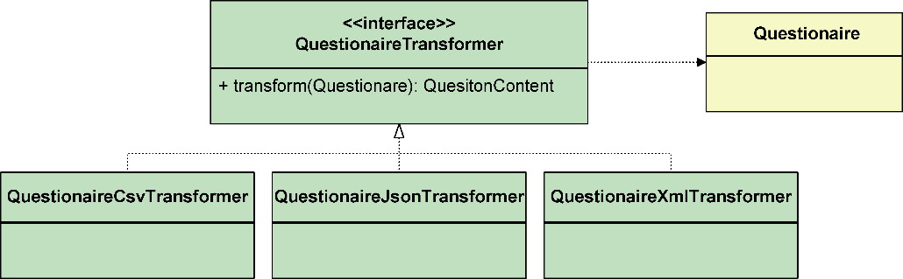

*图15-25 分离转换行为*

整个QuestionaireTransformer继承体系都可以认为是领域服务。从Questionaire中分离出QuestionaireTransformer也符合单一职责原则，根据变化的原因进行分离。

第二个问题：两个聚合之间的协作该由谁负责发起？

多数时候，一个自治的聚合无法完成一个完整的业务服务，聚合之间需要协作。协作通常采用职责委派，即一个聚合的根实体作为参数传递给另一个聚合根实体的方法，完成行为的协作。这是面向对象设计最为自然的协作方式。例如，付款记录聚合OrderSettlement与支付约定聚合PayAggreement都在支付上下文中，在计算OrderSettlement实体的支付金额时，需要PayAggreement实体计算获得的支付利率。因此，可在OrderSettlement根实体的payAmountFor()方法中，传入PayAgreement对象：

```
public class OrderSettlement {
   public BigDecimal payAmountFor(PayAgreement agreement) {
      return orderAmount.multiply(agreement.actualPayRate());
   }
}
public class PayAgreement {
   public BigDecimal actualPayRate() {
      return new BigDecimal(payRate * 0.01);
   }
}
```

聚合的生命周期由资源库管理，故而在两个聚合的协作行为之上，需要引入一个设计对象负责聚合的协作。这正是领域服务需要承担的职责，如图15-26所示。

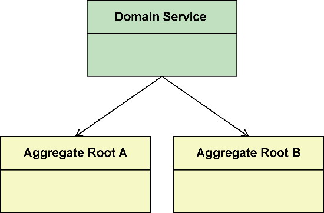

*图15-26 领域服务管理两个聚合之间的协作*

引入的领域服务调用资源库获得聚合，发起它们之间的行为协作。例如，引入PayAmountCalculator领域服务，对外提供计算支付金额的领域行为，在方法内部通过资源库端口获得彼此协作的聚合，调用它们的协作方法：

```
public class PayAmountCalculator {
   private OrderSettlementRepository orderSettlementRepo;
   private PayAggreementRepository payAggreementRepo;
   public BigDecimal calculatePayAmount(OrderSettlementId orderSettlementId) {
      BigDecimal defaultPayAmount = new BigDecimal(0);
      Optional<OrderSettlement> optOrderSettlement = orderSettlementRepo.order
SettlementOf(orderSettlementId));
      if (!optOrderSettlement.isPresent()) {
         return defaultPayAmount;
      }
      OrderSettlement orderSettlement = optOrderSettlement.get();
      PayAggreementId payAggreementId = PayAggreementId.of(orderSettlement.pay
AggreementId());
      Optional<PayAggreement> optPayAggreement = payAggreementRepo.payAggreementOf(pay
AggreementId);
      if (!optPayAggreement.isPresent()) {
         return defaultPayAmount;
      }
      PayAggreement payAggreement = optPayAggreement.get();
      // 注意，聚合之间产生了协作，但协作关系是纯粹的业务职责
      return orderSettlement.payAmountFor(payAggreement);
   }
}
```

为何不让聚合直接调用资源库端口获得另一个聚合呢？资源库的职责是管理聚合的生命周期，如果在聚合内部又使用了资源库端口，意味着资源库在“重建”聚合根对象时，还需要将该聚合根对象依赖的资源库适配器对象提供给它。这就好像蛋生鸡、鸡生蛋，可能陷入对象循环创建的怪圈。例如，OrderSettlement根实体定义了payAggreementId字段，如果聚合可以调用资源库端口：

```
public class OrderSettlement {
   private PayAggreementRepository payAggreementRepo;
   public BigDecimal payAmount() {
      Optional<PayAggreement> optPayAggreement = payAggreementRepo.payAggreementOf(this.
payAgreementId);
      if (!optPayAggreement.isPresent()) {
         return new BigDecimal(0);
      }
      return orderAmount.multiply(optPayAggrement.get().actualPayRate());
   }
}
```

实现看来没有问题，但在考虑OrderSettlement聚合的生命周期管理时，就出现了不能自圆其说的矛盾。OrderSettlementRepositoryAdapter作为资源库的适配器，通过持久化框架从数据库中查询符合条件的付款记录信息，重建为OrderSettlement对象。重建时，OrderSettlementRepositoryAdapter该如何完成对payAggreementRepo字段的依赖注入呢？要知道，资源库适配器仅提供对象与关系之间的映射，既不会设置payAggreementRepo字段的值，也不知道该设置PayAggreementRepository资源库的哪一个实现。

显然，在资源库负责管理聚合生命周期的大前提下，聚合依赖资源库端口的做法并不可行，除非在聚合内部直接实例化资源库适配器对象。但这又违背了隔离业务逻辑与技术实现的架构原则。

要让聚合直接调用资源库端口，可考虑将它作为领域行为方法的参数传入：

```
public class OrderSettlement {
   public BigDecimal payAmount(PayAggreementRepository payAggreementRepo) {}
}
```

我不喜欢这样的设计。一方面，这一设计使得传入的资源库参数无法体现聚合之间本该更加自然的协作关系；另一方面，这一设计又将创建资源库的职责转嫁给了该方法的调用者，增加了调用者的负担。

不止资源库端口，如果参与协作的聚合分属不同的限界上下文，还需要通过客户端端口获得一个聚合需要的领域模型。如果仍然让聚合对象持有该客户端端口，资源库同样不知道该如何将客户端适配器对象注入它所管理的聚合对象中。

领域服务就不存在这一问题，原因在于它是无状态的领域模型对象，不需要资源库管理其生命周期，自然就不会陷入对象循环创建的怪圈。

第三个问题：如果聚合不知道端口的存在，那么业务行为与南向网关端口的协作，该由谁来负责呢？

在真实的企业业务系统中，几乎不可能让领域逻辑完全不依赖任何外部资源以保证其纯粹性，但我们可以保证较细粒度的领域模型对象满足领域逻辑的纯粹性，这个粒度就是聚合。聚合应设计为一个稳定的不依赖于任何外部环境的设计单元。如果领域行为突破了聚合的粒度，就需要与外部资源间的协作。在菱形对称架构中，这就意味着需要调用南向网关的端口。这一职责交由领域服务来承担。

一个典型的例子是对订单的验证。如果仅仅需要验证订单的信息是否完整，订单聚合自己就能做到，验证行为就可以分配给Order聚合。倘若除了验证订单信息，还要验证所购商品的库存量是否满足购买需求，就需要访问库存上下文的远程服务。对Order聚合所在的订单上下文而言，库存上下文属于外部环境，需要通过南向网关的客户端端口访问。这时，验证订单整体有效性的领域行为就该交给OrderValidator领域服务：

```
public class OrderValidator {
   private InventoryClient inventoryClient;
​
   public void validate(Order order) {
      order.validate();
      InventoryReview inventoryReview = inventoryClient.check(order);
      if (!inventoryReview.isAvailable()) {
         throw new NotEnoughInventoryException();
      }
   }
}
```

菱形对称架构也将资源库视为南向网关的一种端口，因此，领域服务对第三个问题的应对，同时也解决了第二个问题。由此可以确定聚合设计的一条原则：不要在聚合内部引入对南向网关端口的依赖。

既然领域服务可以直接依赖南向网关端口，在协调和控制多个聚合对象时，就可以让服务方法变得更简单，甚至让调用者体会不到聚合的存在。例如，银行的转账服务发生在两个相同类型的聚合对象之间，即转出账户和转入账户，它们都是Account类型的聚合根实体对象。由于TransferingService可以通过AccountRepository获得Account聚合对象，转账服务方法只需传递转出账户与转入账户的ID以及转账金额即可：

```
public class TransferingService {
   private AccountRepository accountRepo;
   private TransactionRepository transactionRepo;
   public void transfer(AccountId sourceAccountId, AccountId targetAccountId, Money 
amount) {
      SourceAccount sourceAccount = accountRepo.accountOf(sourceAccountId);
      TargetAccount targetAccount = accountRepo.accountOf(targetAccountId);
      // 账户余额是否大于amount值，由Account聚合负责
      Transaction transaction = sourceAccount.transferTo(targetAccount, amount);
      accountRepo.save(sourceAccount);
      accountRepo.save(targetAccount);
      transactionRepo.save(transaction);
   }
    }
public class Account extends Entity<AccountId> implements AggregateRoot<Account>, 
SourceAccount, TargetAccount {
   private final const TRANSFERING_THRESHOLD = new BigDecimal(10000);
   private Money balance;
   public Account(AccountId accountId, Money balance) {
      this.id = accountId;
      this.balance = balance;
   }
   @Override
   public Transaction transferTo(TargetAccount target, Money transferAmount) {
      if (transferAmount.greaterThan(balance)) {
         throw new InsufficientFundsException("Insufficient funds.");
      }
      if (amount.greaterThan(TRANSFERING_THRESHOLD)) {
         throw new AccountException("Amount can not ..."));
      }
      decrease(transferAmount);
      target.transferMoneyFrom(transferAmount);
      return Transaction.createTransferingTransaction(accountId, target.getAccountId(),
amount);
   }
   @Override
   public void transferFrom(Money transferAmount) {
      increase(transferAmount);
   }
   private void increase(Money amount) {
      balance.add(amount);
   }
   private void decrease(Money amount) {
      balance.subtract(amount);
   }
}
```

领域服务、端口和聚合非常默契地履行各自的职责：聚合操作属于它以及它边界内的数据，履行自治的领域行为；端口通过适配器封装与外部环境交互的行为，又通过抽象隔离对具体技术实现的依赖；领域服务对外提供完整的业务功能，对内负责聚合和端口之间的协调。它们的协作机制如图15-27所示。

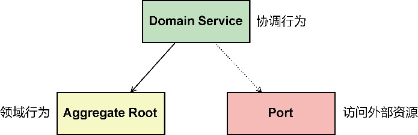

*图15-27 领域服务、聚合和端口的协作*

在所有领域模型设计要素中，领域服务的定义最为自由。正因如此，才需要限制它的自由度，明确聚合与领域服务各自的职责差异，确定领域设计建模的优先级。应优先分配领域逻辑给聚合，只有聚合无法做到的，才会考虑分配给领域服务。哪些领域逻辑是聚合无法做到的呢？根据前面的分析，可以归纳为：

·与状态无关的领域行为；

·变化方向与聚合不一致的领域行为；

·聚合之间协作的领域行为；

·聚合和端口之间协作的领域行为。

领域服务并非灵丹妙药。只有符合以上特征的领域行为才应该分配给领域服务，以避免领域服务的滥用。和谐的协作机制是好的面向对象设计，当领域服务对外承担了业务服务的领域行为时，要注意将内部的细粒度职责按照“信息专家模式”的要求分配给合适的聚合根实体，而在聚合的内部，实体与值对象之间的协作也当遵循相同的设计原则，确保职责分配的合理均衡。

### 15.7 领域事件

在理解领域事件之前，我们先看看一些正在实践的设计原则、设计思想，以此来撬动我们心中对软件世界模型根深蒂固的印象。

#### 15.7.1 建模思想的转变

Datomic是一种以简单服务组合为设计目标的新数据库。其创造者，也是Clojure语言创造者的Rich Hickey如此表达Datomic的设计哲学：“Datomic将数据库视为信息系统，而信息是一组事实(fact)，事实是指一些已经发生的事情。鉴于任何人都无法改变过去，这也意味着数据库将累积这些事实，而非原地进行更新。过去可以遗忘，但是不能改变。因此，如果某些人‘修改了’它们的地址，Datomic会存储它们拥有新地址这个事实，而非替换掉老的事实（它只是在这个时间点被简单的回收了）。这个不变性(immutability)带来了很多重要的架构优势和机会。”

Datomic对“信息即事实”的理解，推导出不变性这个重要的架构特征。这一特征恰与CQRS模式中设计命令模型的核心思想保持一致。Greg Young用一个简单的例子解释了该模式。假设定义了一个领域服务CustomerService，它的方法包括：

```
void MakeCustomerPreferred(CustomerId)
Customer GetCustomer(CustomerId)
CustomerSet GetCustomersWithName(Name)
CustomerSet GetPreferredCustomers()
void ChangeCustomerLocale(CustomerId, NewLocale)
void CreateCustomer(Customer)
void EditCustomerDetails(CustomerDetails)
```

``运用CQRS模式，就应该将该服务分解为分别负责读和写的两个服务：

```
# CustomerWriteService
void MakeCustomerPreferred(CustomerId)
void ChangeCustomerLocale(CustomerId, NewLocale)
void CreateCustomer(Customer)
void EditCustomerDetails(CustomerDetails)
# CustomerReadService
Customer GetCustomer(CustomerId)
CustomerSet GetCustomersWithName(Name)
CustomerSet GetPreferredCustomers()
```

CustomerReadService服务提供的所有方法都不会对数据产生任何副作用，而从事实的角度思考CustomerWriteService服务，它的每个方法都会因为某个命令行为导致某些事情的发生，且发生的这件事情是不可变更的。我们将这些发生的事情称为事件(event)。例如，CreateCustomer命令会触发CustomerCreated事件，ChangeCustomerLocale命令会触发CustomerLocaleChanged事件。这些命令与事件与CustomerReadService服务返回的Customer属于不同的模型，即命令模型(command model)与查询模型(query model)。

配合React进行状态管理的前端框架Redux定义了以下3条基本设计原则。

·单一数据源：整个应用的状态(state)被存储在一棵对象树(object tree)中，并且这棵对象树只存在于唯一一个状态存储(store)中；

·状态是只读的：唯一能改变状态的方法就是触发动作(action)，动作是一个用于描述已发生事件的普通对象；

·使用纯函数来执行修改：为了描述动作如何改变状态树(state tree)，需要编写reducer函数。

之所以Redux如此重视状态的管理、控制与跟踪，是因为随着用户的操作，前端UI的视图变化会引起模型的状态频繁变更，且变更产生的连锁反应也非常复杂，往往会引起一连串的模型状态变更，最后使情形变得不受控制，让人弄不明白状态究竟是在什么时候，由什么原因导致的变化。随着系统变得越来越复杂，如果无法跟踪和管理状态，就很难重现问题，因为这种变化带来的耦合，会让添加新功能变得举步维艰。

分析前端状态管理的复杂度，其罪魁祸首为变化和异步。尤其当二者混淆在一起时，这种复杂度就变得很难预测了。随着业务逻辑的渐趋复杂，以及对低延迟高响应等质量属性的提出，变化和异步这两个不稳定因素同样会在后端世界肆虐。在进行后端系统的领域驱动设计时，我们可否参考Redux的设计原则呢？

仔细分析Redux的3个设计原则，我们看到它在业务世界的建筑墙上，刻满了“状态”两个字。回想UML中的状态图以及工作流的状态机(state machine)，再来思考业务世界的本质，我们能否提出如下问题：任何业务逻辑是否都可以转换成状态的迁移？

在进行领域建模时，状态往往作为对象的属性被定义，例如订单对象定义订单状态属性Created、Registered、Granted、Canceled、Shipped、Invoiced。这种状态的迁移可以用UML状态图表示。它关注的正是状态以及状态之间的转换，导致状态发生转换的动作就是前面提及的命令。

虽然在UML状态图中，并未将状态视为事件，但这二者的本质是相同的：

·它们都是某个行为产生的结果，并与该行为相关联；

·状态与状态之间存在转换关系，称为状态转换；事件与事件之间同样存在这种转换关系，称为事件传播。

领域驱动设计将对象的状态提升为“一等公民”，赋予它领域事件(domain event)的身份。结合之前的讨论，可推演出领域事件的特征：

·领域事件代表了领域概念；

·领域事件是已经发生的事实；

·领域事件是不可变的领域对象；

·领域事件会基于某个条件而触发。

#### 15.7.2 领域事件的定义

领域事件的定义需要满足领域事件的特征要求。

领域事件的命名必须清晰地传递领域概念。这意味着需要在统一语言指导下，从业务的角度命名。作为已经发生的事实，事件的命名应采用动词的过去时态，如订单完成的事件命名为OrderCompleted。这一命名方式也是领域事件推荐的命名风格，我们无须再为其增加Event后缀。

作为不变事实的领域事件可以参考值对象的定义要求，定义为不变类。与值对象不同的是，事件的发布者与消费者在使用事件时，都通过事件的ID进行管理，因此它又具有实体的特征，需要定义代表身份唯一标识的ID属性。领域事件的ID没有任何业务含义，可定义为通用类型的身份标识。领域事件总是随着某个条件的满足而被触发，为了更好地记录和跟踪该事件，还需要保留该事件发生时的时间戳。

显然，领域事件不同于领域模型设计要素的其他模型对象。为了体现这一差异，也为了抽象领域内的所有领域事件，可以统一定义一个抽象类DomainEvent：

```
public abstract class DomainEvent {
   protected final String eventId;
   protected final String occurredOn;
   public DomainEvent() {
      eventId = UUID.randomUUID().toString();
      occurredOn = new Timestamp(new Date().getTime()).toString();
   }
}
```

领域事件只需要封装发布者希望传递的信息。当然，在定义事件属性时也需要考虑订阅者的需求，如转账成功事件TransferSucceeded本身足以说明转账的成功完成状态，但为了使订阅者在收到该事件后能够生成转账交易记录，需要在创建该事件时将转出方与转入方的账户ID、转账金额封装进去：

```
public class TransferSucceeded extends DomainEvent {
   private  final AccountId srcAccountId;
   private  final AccountId targetAccountId;
   private final Money amount;
   public TransferSucceeded(AccountId srcAccountId, AccountId targetAccountId, Money 
amount) {
      super();
      this.srcAccountId = srcAccountId;
      this.targetAccountId = targetAccountId;
      this.amount = amount;   
   }
}
```

领域事件表达了实体的状态变更和迁移，属于领域设计模型中的领域概念。结合对Datomic、Redux和CQRS模式的分析，在对业务世界进行分析时，可以以“领域事件”为核心进行领域建模。这种方式是对经典建模世界观的颠覆，推倒了堆砌着静态领域概念的名词城堡，重新建立了关注状态迁移的动态过程。由此建立的模型世界永远是变化的，因为每个状态都时刻准备着在满足某个条件时迁移到下一个状态；这个模型又是不变的，无论因为什么导致了状态迁移，产生的每个事实都不可变更。事件既然改变了我们观察真实世界的方式，就不仅是领域模型设计要素这么简单，而是一种建模的驱动力，获得的模型也异于一般而言的领域模型。根据其特性，我将其命名为“事件驱动模型”（参见附录B）。

#### 15.7.3 对象建模范式的领域事件

倘若依然采用对象建模范式定义领域事件，那么作为一种领域模型设计要素，它实际上只是实体、值对象和领域服务的一个重要补充。引入它的首要目的是更好地跟踪实体状态的变更，并在状态发生变更时，通过事件消息的通知完成领域模型对象之间的协作。在收到状态变更的事件时，参与协作的对象需要依据当前实体的状态变更决定该做出怎样的响应。这实则是对象协作的需求，只不过协作的方式发生了改变。

事件对状态变更的通知符合观察者模式的设计思路。该模式定义了主体(subject)对象与观察者(observer)对象。一个主体对象可以注册多个观察者对象，观察者对象则定义了一个回调函数。一旦主体对象的状态发生变化，调用回调函数就将变化的状态通知给所有的观察者。主体和观察者都进行了抽象，以降低二者之间的耦合。观察者模式的设计类图如图15-28所示。

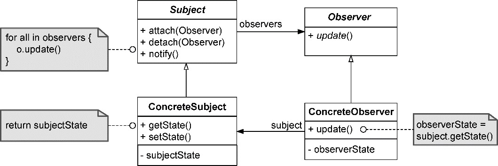

*图15-28 观察者模式*

观察者模式的意图为“定义对象间的一种一对多的依赖关系，使得当一个对象的状态发生改变时，所有依赖于它的对象都得到通知并被自动更新。 ^”改变的状态可以通过领域事件来传递：观察者模式中的主体拥有该状态，可以认为是它发布了领域事件；观察者在收到该事件后，按照自己规定的业务对事件进行处理。从这一角度讲，将观察者模式命名为领域事件的发布-订阅模式更加贴切。

仍然以客户转账的业务服务为例。在没有使用领域事件之前，TransferingService转账服务的内部在转账成功后调用TransactionRepository生成一条转账交易记录。改由领域事件后，TransferingService转账服务在转账成功后，就可发布TransferSucceeded领域事件。事件发布完毕，转账流程也就宣告结束。处理该领域事件的对象为订阅者，不同业务场景对于TransferSucceeded事件的处理逻辑并不相同。交易服务TransactionService会生成转账记录，通知服务NotificationService会发送通知短信。在发布事件后，为了通知订阅者，需要发布者注册这些订阅者。由于可能存在多个订阅者，因此需要为订阅者定义抽象的接口：

```
public interface TransferingEventSubscriber {
   void handle(TransferSucceeded transferedSucceededEvent);
   void handle(TransferFailedd transferedFailedEvent);
}
```

转账服务修改为：

```
public class TransferingService {
   private AccountRepository accountRepo;
   private TransactionRepository transactionRepo; //不需要操作交易聚合，删去
   private List subscribers;
   public TransferingService() {
      subscribers = new ArrayList<>();
   }
   // 相当于注册观察者
   public void register(TransferingEventSubscriber subscriber) {
      if (subscriber != null) {
         this.subscribers.add(subscriber);
      }
   }
   public void transfer(AccountId sourceAccountId, AccountId targetAccountId, Money 
amount) {
      try {
         SourceAccount sourceAccount = accountRepo.accountOf(sourceAccountId);
         TargetAccount targetAccount = accountRepo.accountOf(targetAccountId);
         // 账户余额是否大于amount值，由Account聚合负责
         sourceAccount.transferTo(targetAccount, amount);
         accountRepo.save(sourceAccount);
         accountRepo.save(targetAccount);
         TransferSucceeded succeededEvent = new TransferSucceed(sourceAccountId, 
targetAccountId, amount);
         publish(succeededEvent);
      } catch (DomainException ex) {
         TransferFailed failedEvent = new TransferFailed(sourceAccountId, targetAccountId, 
amount, ex.getMessage());
         publish(failedEvent);
      }
   }
   private void publish(TransferSucceeded succeededEvent) {
      for (TransferingEventSubscriber subscriber : subscribers) {
         subscriber.handle(succeededEvent);
      }
   }
   private void publish(TransferFailed failedEvent) {
      for (TransferingEventSubscriber subscriber : subscribers) {
         subscriber.handle(failedEvent);
      }
   }
}
```

TransactionService领域服务负责生成转账交易记录，是事件的订阅者：

```
public class TransactionService implements TransferingEventSubsriber {
   private TransactionRepository transactionRepo;
   @Override
   public void handle(TransferSucceeded succeededEvent) {
      Transaction transaction = Transaction.createTransferingTransaction(succeeded
Event.getSourceAccountId(),  succeededEvent.getTargetAccountId(), succeededEvent.getAmount());
      transactionRepo.save(transaction);
   }
}
```

通知服务也采用类似方式实现TransferingEventSubscriber接口。

对比之前的转账领域服务，TransferingService的职责更加单一，只负责转账。至于交易记录的生成、消息的通知都交给了关心TransferSucceeded事件的订阅者。订阅者是抽象的，也在一定程度解除了彼此之间的耦合。至于对转账场景的事务处理，则统一交给北向网关层的应用服务。它了解参与整个业务服务的聚合资源，可以放在一个事务范围内。

这一实现的前提是TransferingService领域服务、TransactionService领域服务、NotificationService领域服务以及Account和Transaction聚合都在一个限界上下文中，或者都在一个进程的范围内。如果牵涉到跨进程通信，就需要采用分布式通信的方式实现事件的发布与订阅，并采用柔性事务来满足事务一致性的要求。

考虑到事件的发布与订阅存在通用性，无论是在同一进程或者限界上下文内，还是分布式的跨进程通信，都建议采用专门的事件总线实现事件的发布和订阅。例如，引入Guava的Event Bus库，上述实现可以简化为：

```
public class TransferingService {
   private EventBus eventBus;
   private AccountRepository accountRepo;
   public TransferingService() {
      eventBus = new EventBus("Transfering");
   }
   public void register(List<TransferingEventSubscriber> subscribers) {
      for (TransferingEventSubscriber subscriber : subscribers) {
         eventBus.register(subscriber); // 通过事件总线注册订阅者
      }
   }
   public void transfer(AccountId sourceAccountId, AccountId targetAccountId, Money 
amount) {
      try {
         SourceAccount sourceAccount = accountRepo.accountOf(sourceAccountId);
         TargetAccount targetAccount = accountRepo.accountOf(targetAccountId);
         // 账户余额是否大于amount值，由Account聚合负责
         sourceAccount.transferTo(targetAccount, amount);
         accountRepo.save(sourceAccount);
         accountRepo.save(targetAccount);
         TransferSucceeded succeededEvent = new TransferSucceeded(sourceAccountId, 
targetAccountId, amount);
         eventBus.post(succeededEvent);
      } catch (DomainException ex) {
         TransferFailed failedEvent = new TransferFailed(sourceAccountId, targetAccountId, 
amount, ex.getMessage());
         eventBus.post(failedEvent);
      }
   }
}
public class TransactionService implements TransferEventSubsriber {
   private TransactionRepository transactionRepo;
   @Subscribe // Guava提供的注解，使得该方法称为事件的订阅者
   @Override
   public void handle(TransferSucceeded succeededEvent) {
      Transaction transaction = Transaction.createTransferingTransaction(succeeded
Event.getSourceAccountId(),  succeededEvent.getTargetAccountId(), succeededEvent.getAmount());
      transactionRepo.save(transaction);
   }
}
```

领域事件属于领域层的领域模型对象。如果事件参与了限界上下文之间的协作，应考虑定义应用事件，作为包裹在领域层之外的消息契约。

无论是同一个限界上下文内聚合之间传递领域事件，还是跨限界上下文传递应用事件，甚至跨进程边界（当限界上下文作为微服务边界时）传递应用事件，都符合发布-订阅模式的语义，事件的传递都由事件总线负责。事件总线是一种抽象，既可以实现为本地的事件消息通信（如Guava提供的Event Bus库），也可以由消息队列或消息中间件担任（如Kafka、RabbitMQ、RocketMQ等）。AKKA框架能够同时支持本地与分布式的事件消息通信，Spring Cloud Bus甚至为分布式消息通信建立了满足事件总线要求的通用编程模型（目前仅支持Kafka与AMQP的消息中间件）。不同框架的选择可能在一定程度影响领域模型对领域事件的操作。若严格遵循菱形对称架构，就可定义一个抽象的EventBus接口作为南向网关的端口，由它来隔离这些具体的技术实现因素对领域模型的影响。
