## 第16章 领域设计建模

> 彼节者有间，而刀刃者无厚；以无厚入有间，恢恢乎其于游刃必有余地矣。

> ——庄子，《养生主》

实体、值对象、领域事件、聚合、工厂、领域服务与资源库都属于领域驱动战术设计元模型的一部分，是解决真实世界业务问题的设计元语。实体、值对象与领域事件共同构成了描述真实世界业务问题的基本要素；聚合从设计角度为实体与值对象圈定了概念边界，并引入了工厂和资源库设计模式，用于管理聚合的生命周期；领域服务作为聚合的补充，专注于领域行为的表达，负责协调聚合之间以及聚合与端口之间的协作。显然，这些设计要素并未遵循同一种规则，从同一个维度进行划分，这导致它们之间的含义与关系显得有些模糊，层次不够清晰，影响了它们对领域设计建模的指导价值。

如果从对象建模范式的角度考虑领域设计建模，可以将每个设计要素视为完成一个业务服务进行协作时履行不同职责而扮演的角色，从而为参与业务服务的所有对象定义角色构造型(role stereotype)。

### 16.1 角色构造型

角色构造型这一概念来自Rebecca Wirfs-Brock提出的职责驱动设计方法。她认为：“在一个应用系统中，各种角色都具有自身的特征，这些特征就是构造型……从高层概念进行思考，忽略具体行为来识别对象的构造型，是非常有必要的。通过简化和特征化描述，我们能够轻易地辨明对象的角色。”^4图16-1列出了Wirfs-Brock总结的角色构造型。

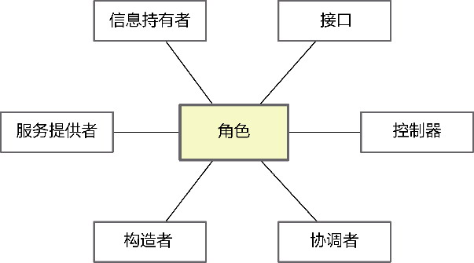

*图16-1 角色构造型*

这些角色构造型的定义及其履行的职责分别如下^4。

·信息持有者：掌握并提供信息。

·服务提供者：执行工作，通常为其他对象提供服务。

·构造者：维护对象之间的关系以及与这些关系相关的信息。

·协调者：通过向其他对象委托任务来响应事件。

·控制器：进行决策并指导其他对象的行为。

·接口：连接系统的各个部分，并在它们之间进行信息和请求的转换。

在职责驱动设计方法中，一个完整的业务服务将由属于不同角色构造型的对象共同协作，而抽象的角色构造型又由对象履行的职责决定。角色、职责和协作是职责驱动设计方法的3个关键设计要素。若能事先根据角色构造型的特征判断一个对象属于一种或多种角色构造型，就能指导设计者做出合理的职责分配，形成良好的协作。

#### 16.1.1 角色构造型与领域驱动设计

定义角色构造型的职责驱动设计方法对领域驱动设计具有极高参考价值。

让我们回到领域驱动设计的角度对这些角色构造型进行解读。这要考虑限界上下文的整个结构，而不能仅停留在领域层的领域模型，如此才能完成一个完整的业务服务。图16-2展示了菱形对称架构与分层架构的组成。

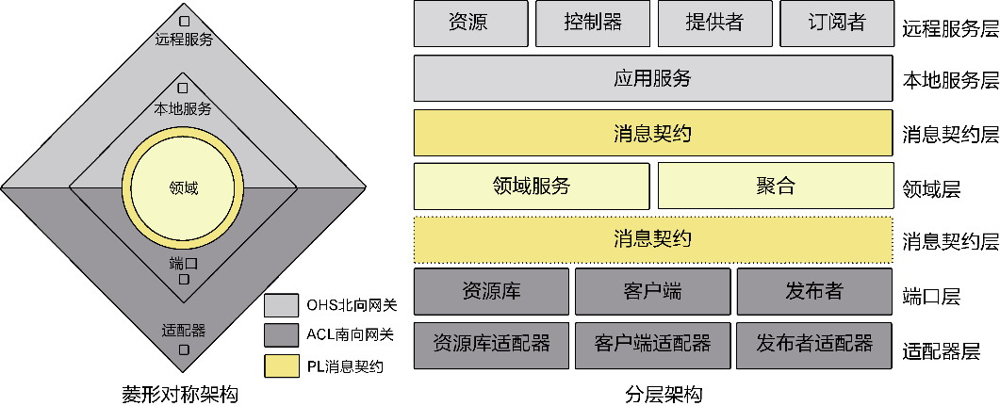

*图16-2 限界上下文的整体结构*

限界上下文内部的各种设计要素尽在此图中，通过配合共同完成一个完整的业务服务。那么，它们是否符合如前所述的角色构造型呢？

信息持有者“掌握并提供信息”，在领域层，指的就是封装了领域逻辑信息的领域模型对象，即聚合边界内的实体和值对象。遵循“信息专家模式”，应优先考虑将与信息相关的行为分配给这些信息的持有者，以避免出现贫血领域模型。我们不能将信息持有者视为一种数据契约，而应将其看作具有丰富领域行为的领域模型对象。在参与业务服务的协作时，领域驱动设计强调聚合的边界作用，并将聚合作为领域层的自治单元，因而在辨别角色构造型时，可以抹掉实体和值对象，直接将聚合视为一个整体的信息持有者即可。

领域服务扮演了服务提供者的角色，即封装没有状态的领域行为，为领域对象提供业务支持，实现不属于任何信息持有者即聚合所能执行的功能。如果业务服务的业务功能需要访问外部资源，又或者需要多个聚合共同协作，领域服务还会扮演控制器角色，通过它决策并指导聚合与端口对象之间的协作行为。

毫无疑问，工厂就是构造者角色，负责维护聚合内部实体与值对象之间的关系，创建一个将根实体暴露在外的聚合自治单元。一个聚合如果扮演了构造者角色，同样可以认为是另一个聚合产品的工厂对象。

位于本地服务层的应用服务扮演了协调者角色。它自身不封装任何业务逻辑，却对外被调用者视为参与业务服务的服务对象，提供服务价值；对内则负责领域服务与聚合之间的协调，并将调用者发送的业务请求委派给它们。

位于北向网关的远程服务与南向网关的端口都是连接当前限界上下文与其他限界上下文以及外部环境之间的接口。消息契约对象是组成接口的一部分，与对应的装配器负责完成消息信息与领域信息之间的转换，可能成为聚合产品的构造者。南向网关的适配器对象作为端口的实现封装了具体的技术实现细节，在领域设计建模时，通常不用考虑。

#### 16.1.2 领域驱动设计的角色构造型

结合职责驱动设计方法，我为领域驱动设计的设计元模型要素寻找到了对应的角色构造型。为了更好地体现领域驱动设计，我又另辟蹊径，不再将这些元模型要素归纳为职责驱动设计提及的6种角色构造型，而是直接将它们视为领域驱动设计的角色构造型，如图16-3所示。

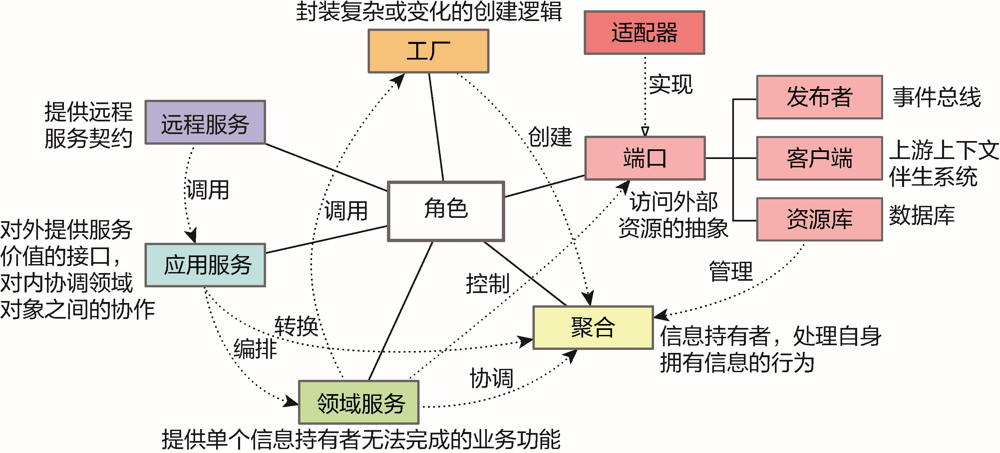

*图16-3 领域驱动设计的角色构造型*

图16-3所示的角色构造型各自履行不同的职责，彼此协作，共同完成一个具有服务价值的业务服务。它们典型的协作序列如图16-4所示。

这些角色构造型是限界上下文引入菱形对称架构之后识别出来的所有设计要素，各自履行了不同的职责。

·远程服务：若为当前限界上下文的远程服务，则负责响应角色的服务请求；若为上游限界上下文的远程服务，则响应客户端适配器的调用请求。

·应用服务：与远程服务对应，提供具有服务价值的服务接口，完成消息契约对象与领域模型对象的转换，调用或编排领域服务。

·领域服务：提供聚合无法完成的业务功能，协调多个聚合以及聚合与端口之间的协作。

·聚合：作为信息的持有者，履行自给自足的领域行为，内部实体与值对象之间的协作被聚合边界隐藏起来。

·工厂：封装复杂或可能变化的创建聚合的逻辑。

·端口：作为访问外部资源的抽象。常见端口包括对访问数据库的抽象，定义为资源库端口；对调用第三方服务包括上游限界上下文的抽象，定义为客户端端口；对发布事件到事件总线的抽象，定义为发布者端口。

·适配器：端口的实现，提供访问外部资源的具体技术实现，并通过依赖注入设置到领域服务或应用服务中。

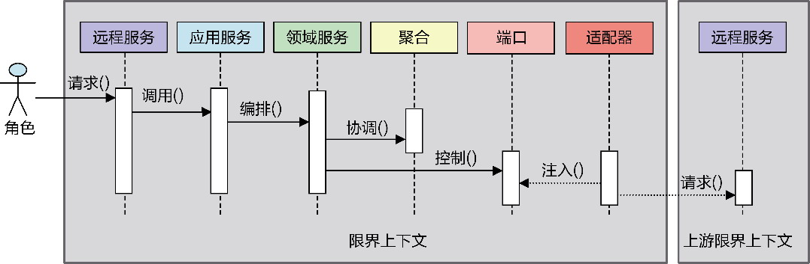

*图16-4 角色构造型的协作序列*

每个角色构造型履行的职责都是确定的。只要为参与业务服务的对象规定了角色构造型，就相当于明确了它们各自应该履行的职责。根据职责的不同，还可以明确规定它们之间的协作方式，形成约定的协作模式，如图16-5所示。

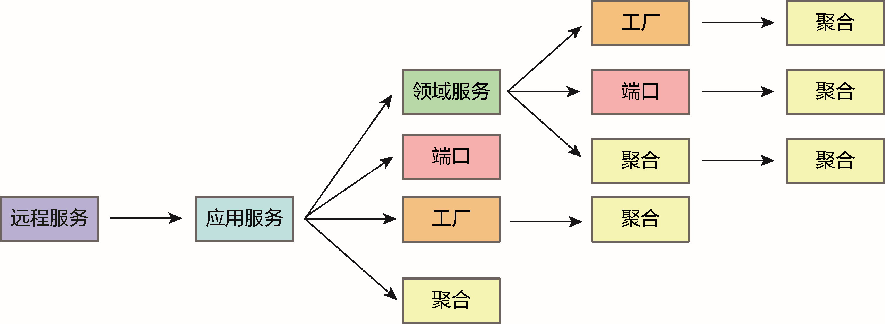

*图16-5 角色构造型的协作模式*

领域驱动设计角色构造型确定的协作模式遵守了面向对象的设计原则以及领域驱动设计的规范，阐释如下。

·远程服务与应用服务：体现了最小知识法则，保证远程服务的单一职责。

·应用服务与领域服务：由领域服务封装领域逻辑，以避免其泄露到应用层。

·应用服务与端口：应用服务可以与端口协作，用于访问外部资源。

·应用服务与工厂：只限于消息契约对象或装配器担任聚合工厂的场景。

·应用服务与聚合：应用服务在调用领域服务时，需要获得聚合，为了避免领域知识的泄露，不建议应用服务直接调用聚合实体和值对象的领域行为，对外，也必须将聚合转换为消息契约对象。

·领域服务与工厂、端口和聚合：确保了领域逻辑的职责分配，避免领域服务成为事务脚本。

·聚合：聚合只能与聚合协作，不知道其他角色构造型，保证了聚合的稳定性和纯粹性。

在这些协作模式之上还有一个基本原则，即参与协作的所有角色构造型都在同一个限界上下文的范围，遵循菱形对称架构。适配器封装了具体的技术实现，被端口隔离，除适配器之外的所有角色构造型都不知道适配器的存在。倘若业务服务需要多个限界上下文协作，则发生在角色构造型之间的协作模式只能是客户端适配器与远程服务或应用服务，如图16-6所示。

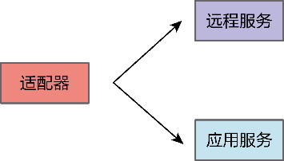

*图16-6 适配器的协作模式*

以报税系统为例，系统需要定期根据用户提交的收入信息生成税务报告文件，这是一个完整的业务服务，由报税专员向作为远程服务的控制器发起请求。业务服务的执行过程如下：

·获得符合条件的税务报告；

·将税务报告的内容转换为HTML格式的数据流；

·以HTML格式呈现方式生成PDF文件。

对外而言，生成税务报告文件是一个完整的服务，客户端的调用者无须了解该服务的实现细节。TaxReportController远程服务响应调用者的服务请求，然后将请求消息委派给TaxReportAppService应用服务。应用服务与远程服务的方法相匹配，定义了提供服务价值的方法。其方法内部并不包含具体的业务逻辑，而是调用TaxReportGenerator领域服务。该领域服务会控制资源库端口、聚合和其他服务之间的协作：首先通过TaxReportRepository端口获得TaxReport实体对象，该实体对象作为TaxReport聚合的聚合根，封装了税务报告的数据验证行为和组装行为。接着，HtmlReportProvider领域服务负责将报告对象转换为HTML格式的数据流，这一转换行为本应由TaxReport聚合承担，但由于引起它变化的原因与聚合的内部结构并不相同，故而将它分离，由专门的领域服务承担。最后，PdfReportWriter领域服务负责将该数据流写入PDF文件，生成税务报告文件。它之所以定义为领域服务，是因为它访问了文件这一外部资源，对文件的访问通过FileWriter端口对技术实现进行隔离。整个协作序列如图16-7所示。

为领域驱动设计引入角色构造型后，职责的分配变得有章可循。它还是服务驱动设计确定动态协作序列的基础。为了更好进行呈现设计模型，可以为各种角色构造型定义不同的颜色，让团队使用不同颜色的即时贴共同协作，以可视化的手段呈现领域设计模型。

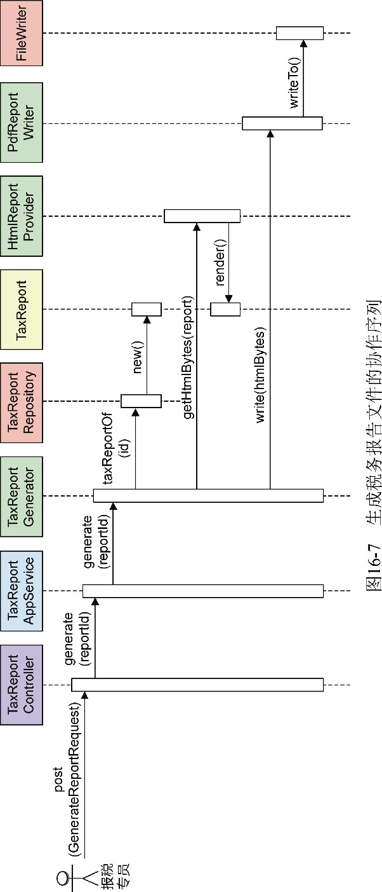

在角色构造型的基础上，我们还可以建立领域驱动设计风格的自动化评估，例如定义诸如@RemoteService、@AppService、@DomainService、@Aggregate、@Factory、@Port和@Adapter等注解用于标记角色构造型，且将协作模式演化为检验设计风格的协作验证规则，通过扫描限界上下文实现代码的方法，检查是否存在违背角色构造型协作模式的错误设计与实现。

### 16.2 设计聚合

领域分析模型的关键在于遵循统一语言，在限界上下文的限制下，努力寻找能够真实表达领域概念的对象，建立清晰的对象图；在领域分析模型的基础上，建立一个个由聚合边界封装和保护的自治边界，再以聚合为核心确定周边各个参与整体业务场景的角色构造型。因此，要建立高质量的领域设计模型，需要高质量地设计聚合。

该怎么设计聚合呢？聚合是在限界上下文控制下对领域分析模型形成的对象图的规范设计。领域分析模型的结构大而全，不足以作为编码实现的参考，类之间的关系固然需要进一步阐明，实体与值对象也需要分辨出来。然后，将聚合作为领域设计模型的控制边界，隐藏对象图的细节，让类之间的关系得到进一步的简化，这一切皆归功于对领域模型的结构控制。

庄子讲过一则庖丁解牛的故事。庖丁给魏惠王介绍他如何解牛：解牛时，需得顺着牛体天然的结构，击入大的缝隙，顺着骨节间的空处进刀。由于牛体的骨节有空隙，而屠刀的刀口却薄得像没有厚度，没有厚度似的刀口在有空隙的骨节中，真可以说是游刃有余。每当遇到筋骨交错聚结的地方，看到它难以处理，就会怵然为戒，目光更专注，动作更缓慢，用刀更轻柔，结果它霍地一声剖开了，像泥土一样散落在地上。

庖丁解牛的技巧可以总结为：

·杀牛前，需要理清牛体的结构；

·找到骨节的空隙至为关键；

·若遇筋骨交错聚结之处，需谨慎用刀。

如果我们将领域分析模型获得的对象图视为一头牛，那么聚合就是那把没有厚度的刀，正是它确立了领域设计模型的自治单元。聚合内是高内聚的实体与值对象，聚合之间当保持松耦合，聚合的边界正如牛有空隙的骨节。只要边界寻找合理，就能游刃有余。将庖丁解牛的技巧引入领域设计建模，体现为：

·弄清楚对象图的结构；

·寻找关系最薄弱处下刀，以无厚入有间；

·若依赖纠缠不清，当谨慎使用聚合。

对象图就是限界上下文控制下的领域分析模型。一个好的领域分析模型梳理好了各个领域对象之间的关系，领域对象也清晰地体现了所属限界上下文的统一语言，但这些对象的定义都是从领域分析的角度考量的，重点在于业务知识的表达。要弄清楚对象图的结构，需要结合领域模型的设计要素，辨别各个对象的类型到底是实体还是值对象。

位于同一个聚合边界的实体与值对象必然是高内聚松耦合的，因而可以根据类关系耦合度的强弱对实体和值对象进行分配。类之间的关系包括泛化、关联和依赖。它们的耦合度由强至松依次为：泛化、合成、聚合、关联、依赖，耦合度越强，放到同一个聚合的可能就越高。要正确地识别聚合，就需要理清领域模型对象尤其是实体之间的关系，并保证类关系的单一导航方向。

关系强弱并非聚合设计的唯一标准，通过关系强弱确定了聚合边界后，还需得运用聚合的设计原则对聚合的边界做进一步推敲。

鉴于此，设计聚合的过程可描述为如下的过程。

·理顺对象图：弄清楚对象图的结构，辨别类为实体还是值对象。

·分解关系薄弱处：理清实体之间的关系，保证类关系的单一导航方向，以关系强弱为界，以聚合边界为刀，逐一分解。

·调整聚合边界：怵然为戒，谨慎设计聚合，针对聚合边界模糊的地方，运用聚合设计原则做进一步推导。

这一过程借鉴了庖丁解牛的技巧，也可称为“聚合设计的庖丁解牛过程”。

#### 16.2.1 理顺对象图

要理顺对象图，就需要分辨领域分析模型的领域类究竟是实体还是值对象。

设计聚合时，值对象更容易被管理，当然也更容易被识别归属。因为聚合只能以实体为根，说明值对象不具备独立性，只能依附于实体类。例如，领域分析模型中员工与客户的地址address属性都被定义为一个相同的Address类型，对象模型如图16-8所示。

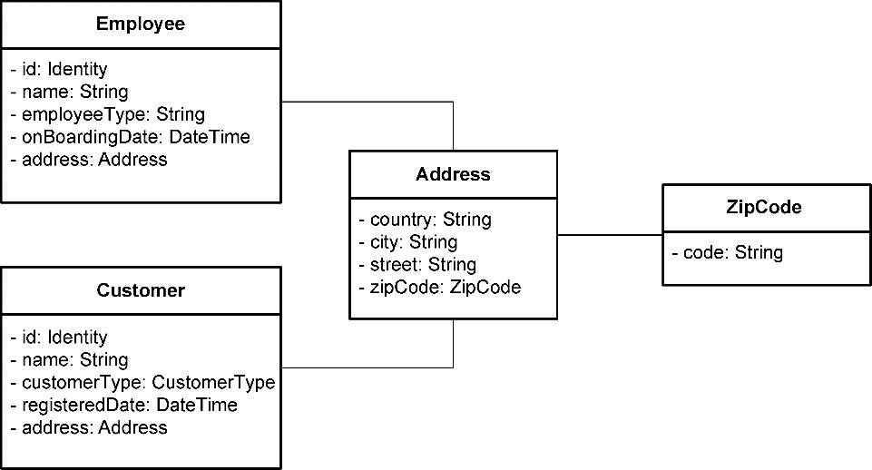

*图16-8 Address类*

到了领域设计模型，员工Employee与客户Customer属于两个聚合，它们对Address类的复用意味着需要让Address在两个聚合中形成副本，故而需将Address以及ZipCode定义为值对象，如图16-9所示。

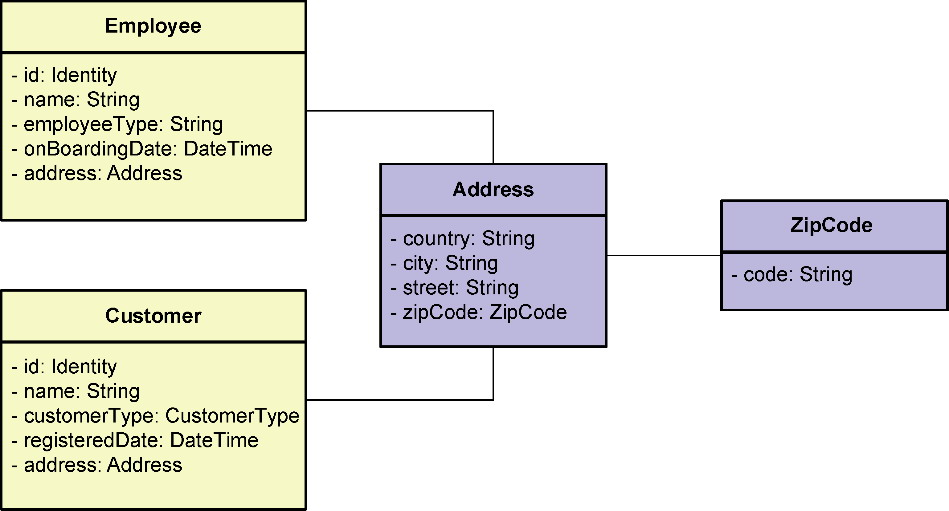

*图16-9 识别Address为值对象*

以身份标志为唯一性判断的实体不能通过克隆形成副本。没有副本，同一实体就不能同时存在于多个聚合，除非将该实体定义为两个不同的实体；没有副本，就只能引用，但聚合设计的基本原则又不允许绕开聚合根直接引用内部实体。实体的这一特征对聚合的识别产生了约束，在理顺对象图的过程中，分辨领域分析模型的类到底是实体还是值对象，就显得极为重要了。

#### 16.2.2 分解关系薄弱处

理顺对象图后，需要进一步明确类之间的关系（即确定为泛化、关联或依赖关系，当然也可以是无关系）。其中，关联关系需要进一步确认为合成关系、聚合关系还是普通的关联关系。设计时，现实模型到对象图的映射代表了不同的观察视角：前者考虑概念之间的关系，后者考虑编程语言中类的关系，实则就是指向对象的指针。

在明确了实体和值对象的基础上确定类的关系时，可以忽略值对象（前提是值对象的识别是正确的）。值对象必须依附于实体，只要值对象与实体存在关系，就和该实体位于同一个聚合边界。故而只需要确定实体之间的关系，即明确它们的关系究竟是泛化、关联（包括合成与聚合）、依赖，还是没有关系。

一旦理顺对象图，即可将泛化、合成、聚合、关联与依赖视为判断关系强弱的标志。既然聚合的边界体现了高内聚松耦合的设计思想，放在一个聚合内的实体与值对象就必然是高内聚的，这意味着实体与值对象的依赖关系越强，被放到同一个聚合的可能性就越高，它们作为整体体现了领域概念的完整性；如果实体与值对象的关系较弱甚至没有关系，则它们分属不同聚合的可能性就越高，这种分离体现了领域概念的独立性。

**1.泛化关系的处理**

泛化关系无疑是强耦合关系，然而站在调用者角度观察一个领域概念的继承体系时，却会因为不同的视角产生不同的设计。

·整体视角：调用者并不关心特化的子类之间的差异，而是将整个继承体系视为一个整体。此时应以泛化的父类作为聚合根。

·独立视角：调用者只关注具体的特化子类，体现了概念的独立性，而将泛化的父类视为概念的抽象与代码的复用机制。此时应以特化的子类作为独立的聚合根。

由父类担任聚合根说明父类体现了一个完整的领域概念，位于继承体系中的子类主要表现为行为的差异。整个继承体系是一个不可拆分的整体，每个子类都是实体，但它们的身份标识却是共享的，即身份标识的唯一性由作为聚合根的父类掌控（在实现ORM时，这一设计方式应采用单表继承）。例如，航班计划业务场景定义了图16-10所示的航班继承体系。

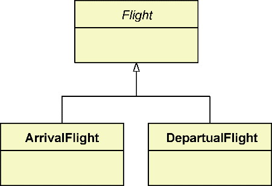

*图16-10 Flight继承体系*

Flight父类代表了一个完整的航班，它的子类共享了父类定义的身份标识，子类之间的差异除进出港标志有所不同之外，主要体现为进港、离港航班各自不同的领域行为。如果其他实体或值对象与整个继承体系之间存在关联关系，就应该与继承体系的Flight父类建立关联，例如，制订航班计划时，需要为航班指定航站楼与登机口，则Stand与Gate值对象应与Flight建立关联，如图16-11所示。

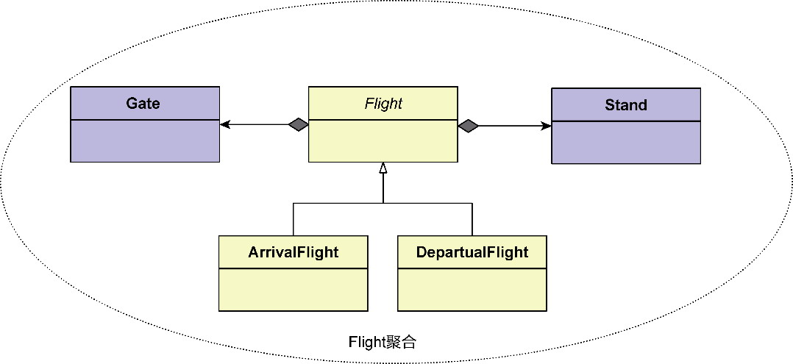

*图16-11 Flight聚合*

如果一个继承体系的子类存在不同于父类和其他子类的特定属性，说明该子类具有了领域概念的独立性，或者，也可以认为一个子类代表一个完整的领域概念。这时，就应该将继承体系中的每个子类都定义为一个单独的聚合，使得它们可以独立演化，彼此之间互不干扰，身份标识也不相同。之所以还需要建立继承体系，只是为了复用父类拥有的数据与方法，并体现了对领域概念的抽象，保留了应对领域概念变化的扩展性。

例如，养老保险、失业保险、医疗保险、孕产保险和工伤保险组成了一个继承体系，它们共同的父类为Insurance。作为该父类的子类，它们的属性与业务存在一定的差异，例如养老保险的编号为社保号(social security number)，其余保险的标号则为身份号码(ID number)，每种保险的投保方式也有所不同，可以认为它们体现了不同的保险概念，具有自身的完整性和独立性，彼此之间也不存在不变量约束和一致性要求。因此，应为子类定义各自独立的聚合，如图16-12所示。

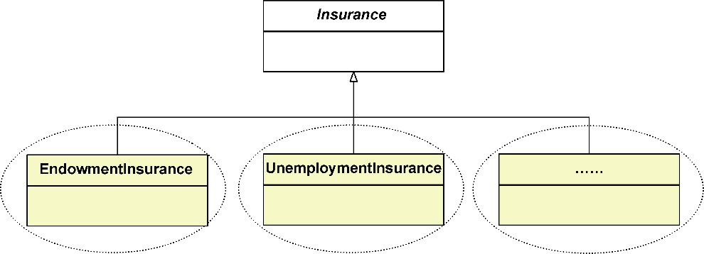

*图16-12 保险继承体系*

由于父类与子类在语义上高度相关，它们通常会放在同一个限界上下文。各个聚合根共同继承的父类就会在该限界上下文中成为一个特殊的存在，即不属于任何一个聚合，如图16-12中的Insurance父类。

即使为每个子类定义了独立的聚合，也不能抹杀泛化的父类表现的通用领域概念。考虑复用和多态的设计因素，继承体系中的通用属性与共同行为应该分配给父类。例如，养老保险、失业保险等保险具有完全相同的属性，如周期、区域、支付类型等，它们都可以作为组合属性而被定义为值对象。这些值对象应该分配给Insurance父类，如图16-13所示。

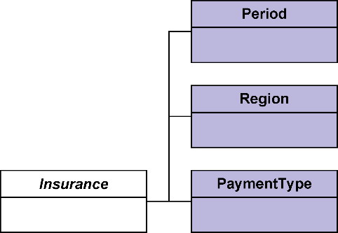

*图16-13 分配给父类的值对象*

虽然Insurance父类并非聚合，但可以认为是各个聚合根实体的抽象。借用类继承的概念，若将聚合视为一个不可分的整体，就可以为聚合也引入泛化关系，形成子聚合泛化的父聚合，如图16-14所示。

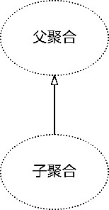

*图16-14 父聚合和子聚合*

若父聚合的根实体为抽象类，还可将其称为抽象聚合。在引入子聚合与父聚合概念之后，保险继承体系的领域设计模型可表示为如图16-15所示的样子。

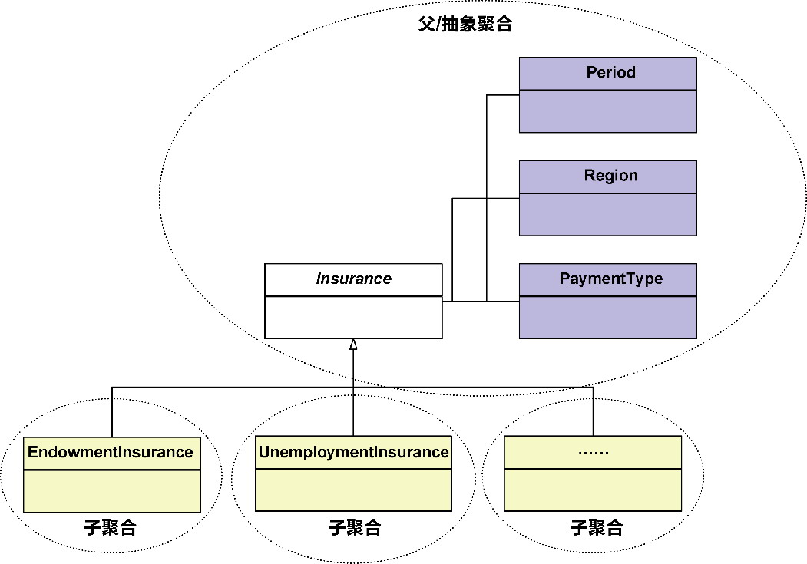

*图16-15 父/抽象聚合与子聚合*

在阅读这样的领域设计模型时，需要明确感知：处于父聚合边界内的对象在实现时应纳入子聚合的范围之内，就好似父聚合中的实体与值对象被同时复制到了各个子聚合中。

根据领域概念的演化特性和耦合的强弱，也不排除不同子类分属不同限界上下文的情况。例如，文本(PlainText)、声频(Audio)和视频(Video)都“是”媒体(Media)。它们形成了一个继承体系，但文本、声频和视频的处理逻辑与流程都存在极大的差异。因而在架构映射阶段，它们各自定义了限界上下文。如果依然保留该继承体系，父聚合该身归何处？

一种方法是，运用上下文映射中的共享内核模式，把这些媒体共用的领域概念、领域逻辑放到一个共享内核中，形成一个单独的媒体上下文，并作为文本、声频和视频限界上下文的上游，如图16-16所示。另一种方法是，彻底解散该继承体系，让文本、音频和视频成为3个毫不相干的领域概念。具体怎么选择，主要取决于该继承体系在复用性与扩展性方面能做出什么样的贡献。

领域驱动设计必须考虑限界上下文与聚合的边界，这些边界的分离实际上牵涉到通信机制、持久化等技术因子，与理想的对象设计有着本质的区别。不要埋怨这些设计上的约束，这恰恰是领域驱动设计的高明之处。在领域建模阶段，虽然是领域逻辑推动着建模的过程，但背后隐含地考量了技术的实现因素。它被藏了起来，却时时刻刻产生着影响力。

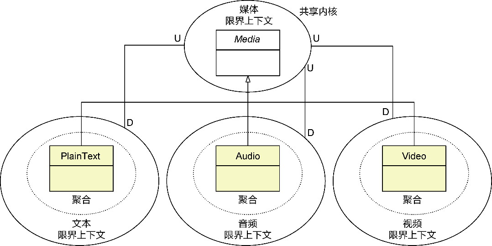

*图16-16 媒体上下文作为共享内核*

在定义继承体系时，需要注意对“是”(is)关系的判断。真实世界的一个概念是另一个概念的子概念，并不意味着这两个概念必然存在继承关系。例如开发人员是员工，测试人员也是员工，业务分析师、架构师都是员工，是否意味着可以定义图16-17所示的继承体系呢？

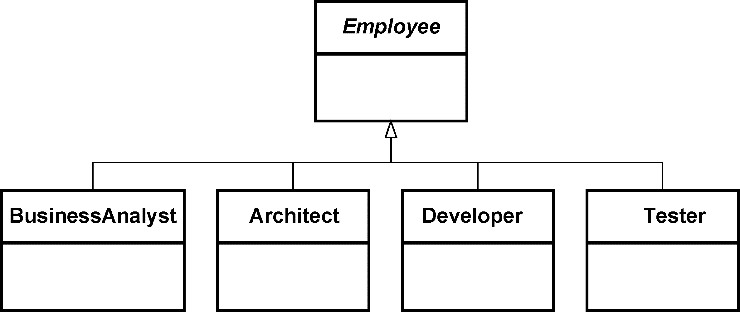

*图16-17 员工继承体系*

设计继承时，需要遵循差异化编程(programming by difference)的原则，即根据差异而非类型的值去建立继承体系。代表该类型特征的主属性往往是共性的，差异在于从属性的变化。在设计员工的继承体系时，虽然业务分析师、架构师、开发人员和测试人员与员工概念间都为“是”的关系，但就员工这一类型而言，开发人员与测试人员并无差异，差异体现在员工角色的不同。针对差异建立继承，就能获得图16-18所示的类关系。

对比图16-17和图16-18两个继承体系。前者根据“是”关系确定继承体系，后者遵循“差异化编程”，将存在差异的Role分离出去。图16-18对泛化关系的处理也遵循了合成/聚合复用原则^，即在复用逻辑时优先考虑面向对象的合成/聚合关系：是Employee合成了Role，而非将Employee作为整体建立继承体系。

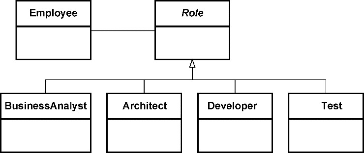

*图16-18 员工与角色*

引入聚合时，遵循差异化编程获得的继承体系由于体现为从属性的差异，往往不会作为聚合根的实体。如图16-19所示，在Employee聚合中，Employee是聚合根实体，Role继承体系皆为值对象，成为Employee实体的属性。

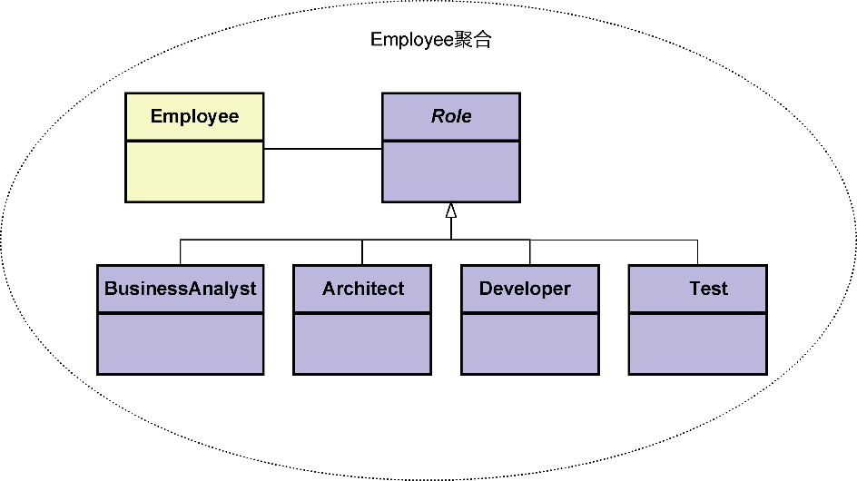

*图16-19 Employee聚合*

如此设计避免了继承体系定义的类因为多态而对聚合提出复杂的要求。

**2.关联关系的处理**

如果两个实体类之间存在关联关系，那么这个关系只要不是合成或聚合关系，都是松耦合关系，应划分到不同的聚合边界。

将实体类的合成关系理解为类实例之间的“物理包容”，意味着存在合成关系的类，其实例的生命周期保持一致，它们之间的关系也是强耦合的。应优先考虑将它们放在一个聚合边界。

实体类的聚合关系经常被与聚合角色构造型混为一谈。在第15章，我已分辨了二者之间的差异，并为避免混淆，分别将其称为OO聚合与DDD聚合。OO聚合的关系要弱于合成关系，体现了两个类实例之间的“逻辑包容”。这种逻辑包容体现了概念上的包含关系，却没有约束两个实体类的生命周期。考虑到DDD聚合对概念完整性的要求以及资源库对DDD聚合生命周期的管理，可优先考虑将两个存在OO聚合关系的实体放入不同的聚合边界。

考虑一个报表元数据管理的业务功能。报表的元数据包括报表类别、报表和查询条件。报表类别ReportCategory是报表Report的分类，每个报表至少有一个报表类别，但二者的生命周期并不一致，例如删除一个报表类别，并不会删除对应的报表，故而报表类别与报表之间仅为逻辑包容，形成了OO聚合关系。查询条件QueryCondition是用户为报表设置的查询条件，用于筛选显示在报表中的值（用户在查看报表内容时，可以选择符合分析场景的查询条件），无法脱离报表而单独存在，与报表之间属于OO合成关系。三者的关系如图16-20所示。


*图16-20 报表的类图*

梳理了对象关系后，根据合成与OO聚合的强弱关系，可获得图16-21所示的聚合设计。

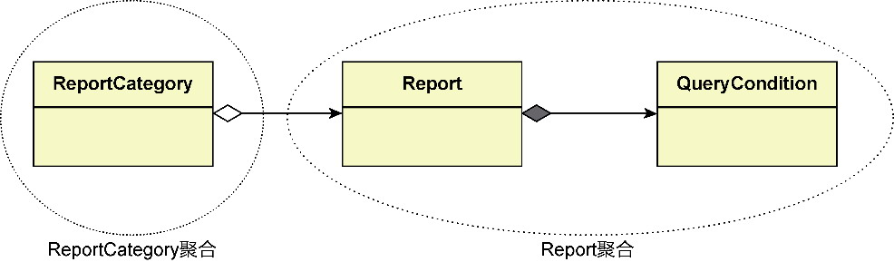

*图16-21 报表的领域设计模型*

ReportCategory聚合与Report聚合具有不同的生命周期，而在Report聚合中，Report实体与QueryCondition实体在概念上足够完整。只要获得了封装在Report实体类的元数据以及相关的查询条件QueryCondition，就能生成一个完整的报表。

**3.依赖关系的处理**

两个实体类之间的依赖体现为职责的协作，包括职责的委派与聚合的创建。这说明两个实体并不存在主/从关系，也不存在整体/部分关系，耦合的强度较之普通的关联关系更弱，可划分到不同的聚合边界。

**4.结论**

通过对泛化、关联和依赖关系的分析，得出如下结论。

·若继承体系为一个整体的概念，且子类没有各自特殊的属性，考虑将整个继承体系放入同一个聚合。否则，为各个子类定义单独的聚合。

·优先考虑将具有合成关系的实体放在同一个聚合，除此之外，存在其他关系的实体都应考虑放在不同的聚合。

根据关系的强弱，我给出了耦合度的量化指标，按照关系强弱给出分值由高到低排列，如表16-1所示。

*表16-1 关系耦合度分值与聚合边界*

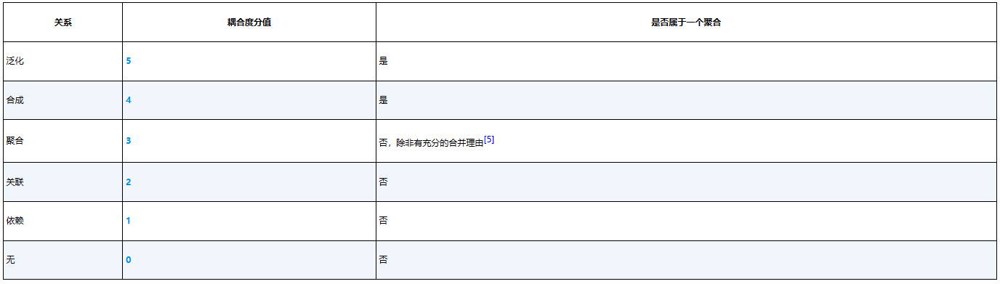

*优先考虑将具有OO聚合关系的类放到不同聚合。这遵循了“设计小聚合”原则。*

在本阶段对关系薄弱处的分解，要做到快刀斩乱麻，如表16-1所示，以耦合度分值3为分界线，快速确定聚合的边界。上述结论虽非严谨的设计原则，却提供了简单的划分依据，可以让设计者无须遵循太多的设计原则，也无须设计经验，只要确定了实体之间的关系，就可依样画葫芦。至于聚合边界是否划分合理的判定，可以留给设计过程的最后一个阶段：调整聚合边界。

#### 16.2.3 调整聚合边界

调整聚合边界是一个细致活儿。凡是对聚合边界的划分存有疑惑之处，都应该遵循聚合设计原则作进一步推导。聚合设计原则依次为：完整性、独立性、不变量和一致性。

在选择聚合设计原则推导聚合边界时，首先考虑领域概念的完整性。完整性与合成关系相得益彰。毕竟，物理包容的关系就意味着不可分割。在已经初步确定了聚合边界的基础上，可以进一步针对识别出来的聚合进行完整性判断，避免缺少必备的领域概念。

完整性体现了“合”的概念，倾向于将多个实体和值对象放在一个聚合边界内。虽然许多领域驱动设计的实践者都建议“设计小聚合”，然而权衡聚合边界的约束性与对象引用协作的简便性，只要你对聚合边界的设计充满信心，保证聚合的粒度是合理的，就不用担心聚合被设计得太大。合理的聚合边界设计要优于盲目地追求聚合的细粒度。

完整性遇见独立性时，通常需要为独立性让路。一个概念独立的领域模型对象，必然具备单独的生命周期，这使得它成为单独聚合的可能性较高。当聚合边界存在模糊之处时，小聚合显然要优于大聚合，概念独立性就成为非常有价值的参考。一个聚合既维护了概念的完整性，又保证了概念的独立性，它的粒度就是合理的。

通过完整性与独立性甄别了聚合边界之后，应从不变量着手，进一步夯实聚合的设计。不变量可以提炼自业务规则，如用户故事的验收标准，检查业务规则是否符合数据变化、一致、内部关系这3个特征，并由此来确定不变量。

一致性是一种特殊的不变量。可以从数据一致性的角度检查聚合边界的合理性。数据一致性特别是强一致性的要求，往往意味着强耦合度。如果跨聚合之间出现了数据一致性，可以再次确认是否有必要合并它们。反过来，若聚合内的实体与聚合根实体不具备强一致性，也可以考虑将它移出聚合。

在遵循聚合设计原则对聚合边界进行调整时，完整性、独立性、不变量和一致性这4个原则发挥的其实是一种合力。只有通过对多条原则的综合判断，才能让聚合边界变得越来越合理。当这4个原则出现矛盾冲突时，自然也有轻重缓急之分。整体来看，独立性体现了“分”的态势，完整性与不变量则表达了“合”的诉求。唯有一致性并无分与合的倾向性，但它在技术实现上却与事务的一致性有关，需要在小聚合与大聚合之间权衡事务控制的成本与一致性带来的收益。

以分配Sprint Backlog为例。考虑到一个Sprint Backlog只能分配给一个团队成员，这一规则牵涉到SprintBacklog类与TeamMember类之间的关系，属于不变量，似乎应该放在同一个聚合中，但团队成员又具有概念的独立性。显然，不变量与独立性之间存在冲突，该遵循哪一条原则呢？我的建议是优先考虑独立性，一方面，独立性对生命周期管理提出了不同的要求，另一方面，这样也考虑了小聚合的优势。此外，如果我们将二者的不变量视为SprintBacklog与TeamMemberId之间的约束，将TeamMember分离出去就没有任何障碍了。由此获得的聚合如图16-22所示。

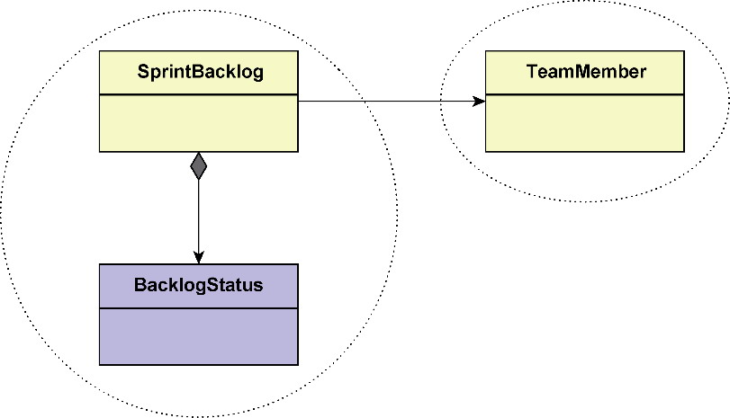

*图16-22 SpringBacklog和TeamMember*

在分配Sprint Backlog时，要求每次都需要保存对Sprint Backlog的分配，以便于查询，于是得到了SprintBacklogAssignment类，用于记录分配记录。SprintBacklogAssignment与SprintBacklog具有事务一致性，必须同时成功同时失败。本来，图16-22所示的SprintBacklog聚合已经具备了概念完整性，但根据事务一致性的要求，需要在该聚合边界中再增加一个SprintBacklogAssignment实体，如图16-23所示。

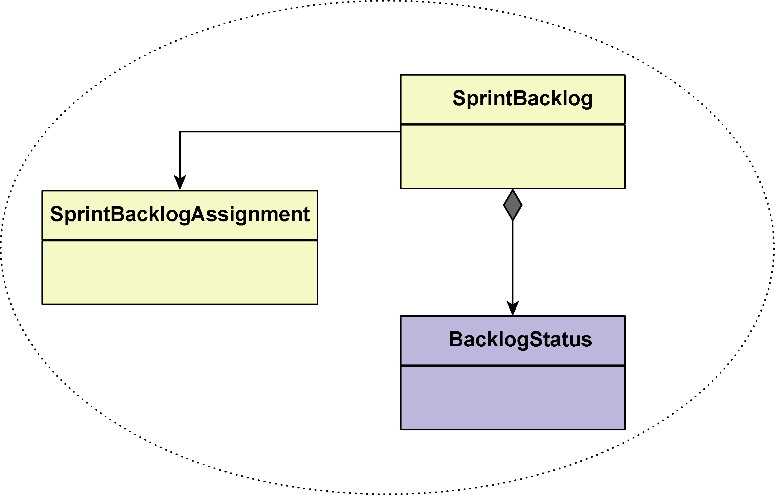

*图16-23 SprintBacklog聚合*

聚合无论大小，终究还是要正确才合理。聚合设计过程的最后一个阶段正是要借助聚合设计原则，逐步地校正聚合的边界，使我们能够获得正确的聚合，提高领域设计模型的质量。

### 16.3 服务驱动设计

聚合是领域设计建模的关键，领域层的诸多角色构造型都可以围绕聚合来获得。例如，在确定聚合之后，即可确定资源库以及工厂，领域服务与应用服务甚至面向资源的远程服务也可根据聚合的定义而推演获得。

领域设计建模要求优先将领域逻辑分配给聚合，只有聚合无法承担的领域逻辑才会分配给领域服务。在确定业务服务各个角色构造型之间的协作时，可不考虑聚合内部各个对象之间的协作，而留待领域实现建模时通过测试用例驱动出来。

识别聚合之后，领域分析模型就成为以聚合为基本设计单元的领域设计模型。此时的领域设计模型仅仅体现了各个领域对象之间的静态关系，要满足客户调用的要求，还需要了解多个角色构造型之间动态的行为协作，让它们各自履行职责共同完成一个具有服务价值的业务功能，以满足客户的服务请求。设计的方法就是基于业务服务和角色构造型确定的服务驱动设计(service-driven design)。

#### 16.3.1 业务服务

业务服务是全局分析阶段对业务场景进行分解获得的独立的业务行为。在问题空间，它是需求分析视角的产出；在解空间，它是软件设计视角的输入。它提供的服务价值就是服务契约对外公开的API，如此就拉近了需求分析与软件设计的距离，甚至可以说打通了需求分析与软件设计的鸿沟。当业务分析人员对业务服务展开深入而详尽的需求分析时，细化了的业务服务既可作为领域分析建模的输入，又是服务驱动设计的起点。

由于业务服务是一次完整的功能交互，参与到业务服务的协作对象涵盖了前面所述的所有角色构造型，而不仅限于领域模型对象。一旦完成了服务驱动设计，就等于完成了对整个业务服务的设计梳理。

#### 16.3.2 业务服务的层次

不同角色构造型参与到业务服务时，会履行各自的职责进行协作。角色构造型履行的职责具有层次，由外至内分为服务价值、业务功能和功能实现。

服务价值体现了业务服务要满足的服务请求。为实现该服务价值，业务服务被分解为多个任务，这些任务就是支撑服务价值的业务功能。当任务不需再分时，则对应具体的功能实现。不需再分的任务称为原子任务，位于原子任务之上的任务称为组合任务。图16-24展示了职责层次与业务服务任务分解之间的映射关系。

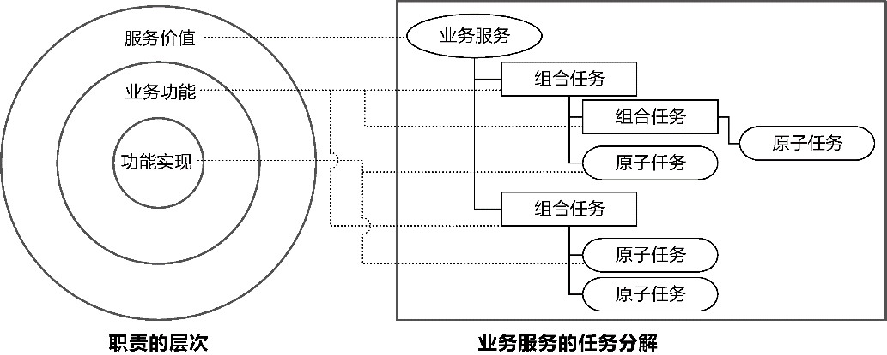

*图16-24 职责的层次与任务分解*

无论是职责的层次，还是业务服务的任务层次，皆非固定的三层结构。对业务功能而言，只要还没到具体功能实现的层次，就可继续分解，组合任务同样如此。设计者需要把握任务的粒度，对业务服务进行合理的任务分解。

#### 16.3.3 服务驱动设计方法

服务驱动设计将业务服务作为设计的起点，同时也将其作为设计决策需要考虑的业务背景。业务服务来自问题空间的全局分析，与具体的领域逻辑有关，使得它的设计驱动力与领域驱动设计的精神一脉相承。同时，它又借鉴了职责驱动设计，结合角色、职责和协作三要素共同表达了业务服务的6W模型：职责层次中的服务价值、业务功能与功能实现分别体现了Why、What与hoW，对象的角色构造型体现了Who，它们之间的协作表现出的操作序列体现了When，对象之间的协作发生在体现Where的限界上下文中。服务驱动设计的全景图如图16-25所示。

在体现服务价值的业务服务中，既有静态的任务层次分解，又有动态的角色构造型协作序列。动静结合，构成了服务驱动设计的全景图。

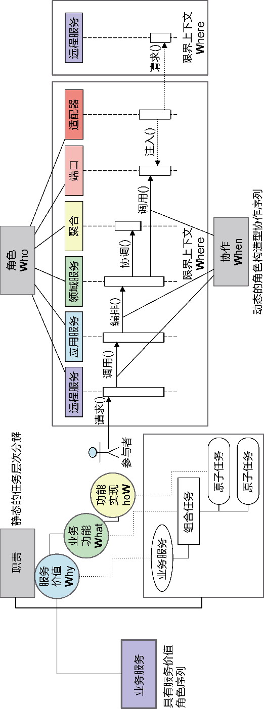

*图16-25 服务驱动设计全景图*

#### 16.3.4 服务驱动设计过程

服务驱动设计的过程分为以下两个步骤。

(1)分解任务：根据职责的层次对业务服务进行任务分解。

(2)分配职责：为角色构造型分配不同层次的职责。

在进行服务驱动设计时，领域特性团队的业务分析人员已经开始细化问题空间的业务服务，获得了业务服务规约。体现了统一语言的业务服务规约既是领域分析建模的基础，又是领域设计建模服务驱动设计的起点。

服务驱动设计在整个领域驱动设计统一过程中起到了承上启下的作用：承上，它继承了全局分析阶段输出的业务服务和业务服务规约、领域分析建模输出的领域分析模型；启下，它分解的任务作为测试驱动开发识别测试用例的起点，驱动出具体的测试代码与产品代码，建立领域实现模型。

**1.分解任务**

分解任务的过程符合设计者的思维模式。这也正是开发人员更容易编写出过程式代码的原因。设计者在面对一个业务服务寻找解决方案时，思考的往往不是对象，而是过程。这是一种自然而然的逻辑思维过程：假设我们计划去远方旅行，在确定了旅行目的地和旅行时间之后，我们充满期待地为这次旅行做准备。要准备什么呢？闭上眼睛想一想，再想一想，浮现在你脑海中的是什么呢？是否就是一系列待完成的任务：

·确定旅行路线；

·

      确定交通工具，例如乘坐飞机，于是——

·购买机票；

·查询酒店信息并预订酒店；

·……

这个思维过程有对象的出现吗？有对象之间的协作吗？是否会想到一些对象做什么，另外一些对象做什么？没有，统统没有！思考这些问题时，是我们自己在给出解决方案。所有的任务都是我们自己去执行。针对要解决的问题，设计者自己成了一个无所不知的类。潜意识中，分解出来的任务都由自己来完成。这就是设计者惯常的思维模式。

如果将业务服务视为待解决的问题，任务分解就是将问题分解为若干子问题，并将这些子问题当作一个个独立的过程(procedure)。在过程层次，讲述的是它做什么(What)，而非怎么做(hoW)。Harold Abelson等人将这种方式称为“过程抽象”^17，即将过程作为黑箱抽象，当一个过程（或任务）被当作一个黑箱时，我们就无须关注这个过程是如何解决的。例如将验证订单的过程当作黑箱，就不用考虑订单是怎么验证的。这种思维方式实际上也是一种知识的层层推进，随着层次的逐步推进，暴露在外的知识就越来越多。如此分解，就能有层次感地体现各级任务。

任务可以分解为多个层次，不管位于哪一层，分解出来的任务在它所属的层次，都是在讲述做什么(What)。因此，在描述任务时，要用简短的动词短语，避免描述太多的实现细节。分解的每一个任务都没有主语，这正是过程式设计与面向对象设计的“分水岭”。如果选择同一个类作为执行所有任务的“主语”，业务服务的每个任务就会组成事务脚本。如果将每个任务都视为一种职责，需要合适的对象来履行职责，就会形成多个角色构造型之间的协作，满足领域设计建模的设计要求。

同一层次的任务必须位于同一个抽象层次；下降到子任务的层次，每个子任务又作为一个独立的问题。继续分解，直到该问题已能独立解决，成为不需再分的原子任务为止。

什么才是不需再分的原子任务呢？需要结合领域驱动设计与角色构造型的特征解释。在领域设计建模活动中，聚合是基本的设计单元，聚合内部的实体与值对象履行的职责属于实现的内部细节，可不用考虑。同时，作为角色构造型的聚合属于信息持有者，能够完成与它拥有的信息直接相关的领域行为。这意味着一个任务若能被一个聚合对象单独完成，即可认为是一个原子任务。作为角色构造型的端口定义了访问外部资源的接口，对调用它的领域服务来说，并不关心该接口内部的具体实现，因此端口履行的职责也可认为是一个原子任务。

在确定聚合能够完成的原子任务时，要考虑聚合的生命周期。例如，要更新聚合的状态，需要先通过资源库获得（重建）该聚合，然后执行聚合的方法，最后将该变更持久化到数据库。这就需要拆分为3个原子任务，因为重建操作和持久化操作都是资源库端口履行的职责。

不需再分的任务为原子任务，包含了原子任务的任务就是组合任务。整个业务服务可分解为以业务服务为根、组合任务为枝、原子任务为叶的任务树，如图16-26所示。

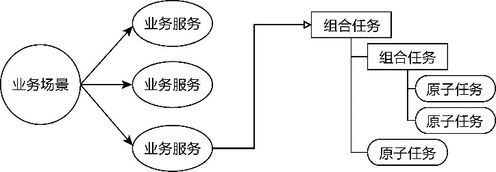

*图16-26 由组合任务和原子任务组成的任务树*

分解任务的基础是业务服务规约。一种有效的任务分解方法是针对业务服务规约的基本流程，以动词短语形式列出，作为基础任务。针对所有基础任务，以归纳法将具有相同目标的基础任务由下而上归纳为组合任务，再以分解法判断基础任务是否原子任务，如果不是，就自上而下进行拆分，直到原子任务为止。以第14章给出的提交订单业务服务为例，它的基本流程为：

(1)验证订单有效性

(2)验证订单所购商品是否缺货

(3)插入订单

(4)从购物车中移除所购商品

(5)通知买家订单已提交

分解任务时，将它们照搬过来，以动词短语的形式表达：

·

      提交订单（业务服务）

·验证订单有效性

·验证库存

·插入订单

·更新购物车

·通知买家

这些任务处于同一个层次，需要向上归纳和向下分解。显然，验证订单有效性和验证库存具有相同的目标，就是验证订单，可以归纳为一个组合任务：

·

      提交订单（业务服务）

·

          验证订单

·验证订单有效性

·验证库存

·插入订单

·移除购物车已购项

·通知买家

判断基础任务是否原子任务。对于验证订单有效性任务，订单聚合拥有验证自身有效性的信息，包括对订单项、配货地址等值的验证，可确定为原子任务；对于验证库存，需要通过客户端端口发起对库存上下文北向网关的调用，应认为是原子任务。插入订单和通知买家任务都需要访问外部资源，故而可识别为原子任务。更新购物车任务表面看来可以由购物车聚合自行完成，但执行的是生命周期管理的更新操作，需要分解为3个原子任务：

·

      提交订单（业务服务）

·

          验证订单

·验证订单有效性

·验证库存

·插入订单

·

          更新购物车

·获取购物车

·移除已购项

·保存购物车

·通知买家

自上而下的分解和由下而上的归纳可以交叉运用，直到分解的任务层次变得合理。在进行以上任务分解后，可发现验证订单、插入订单、更新购物车这3个平行的任务虽然是正交的，但它们共同组合起来，目标就是提交订单。因此，可以将它们归纳为一个组合任务：

·

      提交订单（业务服务）

·

          提交订单（组合任务）

·

              验证订单（组合任务）

·验证订单有效性（原子任务）

·验证库存（原子任务）

·插入订单（原子任务）

·

              更新购物车（组合任务）

·获取购物车（原子任务）

·移除已购项（原子任务）

·保存购物车（原子任务）

·通知买家（原子任务）

任务分解是服务驱动设计的核心，直接决定了领域设计模型的设计质量。只要把握任务应描述问题而非解决方案的设计原则，就能避免设计人员在设计建模阶段沉醉于太多的实现细节。在分辨原子任务时，将访问外部资源的行为作为原子任务的其中一个判断标准，也能保证设计的领域模型不受技术实现的影响，避免了业务复杂度与技术复杂度的交叉混合。

执行任务分解时，还需考虑对职责层次的判断。层次的划分不同，可能影响对象协作的顺序、粒度和频率。在第10章，我谈到任务分解对确定上下文映射的影响，提出遵循“最小知识法则”来评判分解过程的合理性。在进行服务驱动设计时，该原则同样有效。

任务分解的过程并不能一蹴而就。在进行职责分配时，若存在职责分配不当，也可反思任务分解是否合理。由于任务分解还停留在字面上，修改的成本非常低。

**2.分配职责**

职责的分配有赖于角色构造型。角色构造型与任务分解的层次可以有如下映射。

·远程服务：匹配业务服务，响应角色的服务请求。

·应用服务：匹配业务服务，提供满足服务价值的服务接口。

·领域服务：匹配组合任务，执行业务功能，若原子任务为无状态行为或独立变化的行为，也可以匹配领域服务。

·聚合：匹配原子任务，提供业务功能的业务实现。

·端口：匹配原子任务，抽象对外部资源的访问，主要的端口包括资源库端口、客户端端口和发布者端口。

一个业务服务往往由外部的角色触发。不管是用户、策略还是伴生系统，都必然位于限界上下文的边界之外，甚至位于进程边界之外，根据菱形对称架构的要求，需由北向网关的远程服务响应跨进程的分布式调用。一个业务服务以远程服务为起点，说明了它的完整性，也满足了连续的、不可中断的执行序列特征。

应用服务自身并不包含任何领域逻辑，仅负责协调领域模型对象，通过它们的领域能力组合完成一个完整的应用目标。这一应用目标恰好匹配业务服务体现出来的服务价值，在参与整个业务服务的角色构造型中，它起到了连接内外的作用，对外暴露了满足服务价值的服务契约，对内完成对领域服务和聚合的协调。

领域服务与聚合、端口分别映射组合任务与原子任务。原子任务的评判标准本就基于聚合的能力和端口的抽象特征，自然应该由它们来履行原子任务对应的领域行为。除了体现无状态或独立变化的领域行为，领域服务的主要目的就是控制多个聚合与端口之间的协作，由它来承担组合任务的执行，自然也是合情合理。因此，服务驱动设计到了分配职责的阶段，就演变成了一个固化的流程，如图16-27所示。

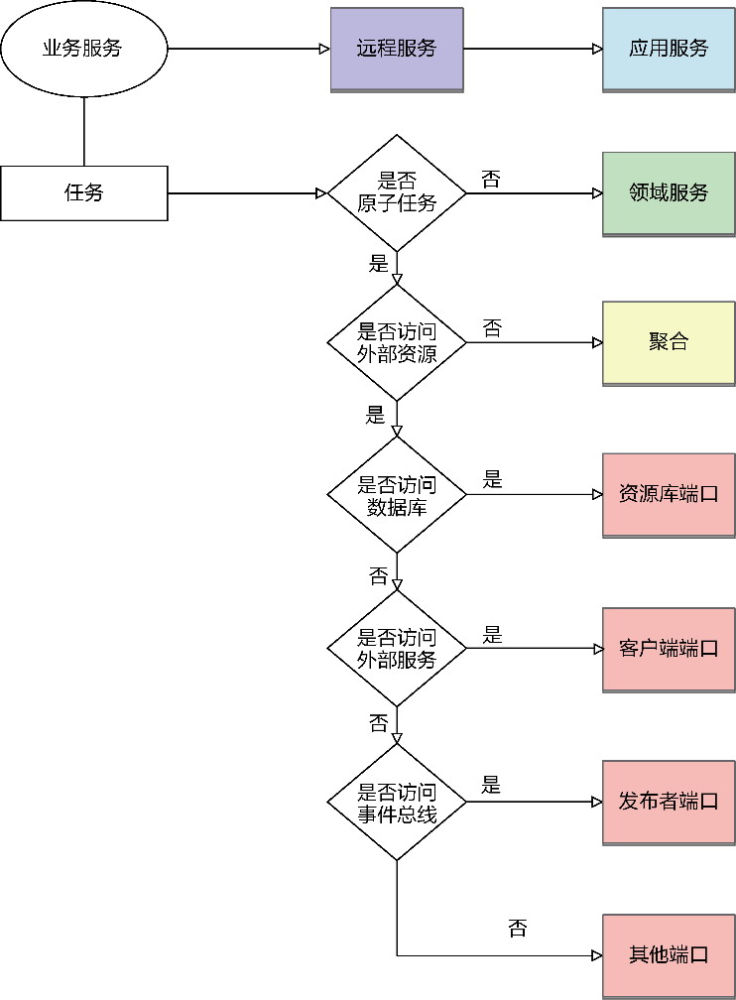

*图16-27 职责分配的流程*

采用服务驱动设计进行职责分配，可在一定程度保证职责分配的合理性，避免设计出履行太多职责的类，也能避免出现不恰当的贫血领域模型。组合任务作为当前抽象层次的一个子问题被不断分解，避免了出现巨无霸似的问题，映射组合任务的领域服务自然就不会出现无所不包的领域行为了；构成组合任务的原子任务又会被优先分配给聚合，使得聚合根实体成为拥有丰富领域行为的领域模型对象。

分配职责时，各种角色构造型的名称可参考如下命名规则。

·远程服务以服务类型作为类名的后缀：控制器服务的后缀为Controller，资源服务的后缀为Resource，提供者服务的后缀为Provider，订阅者的后缀为Subscriber；例如，提交订单业务服务的远程服务名为OrderController。

·应用服务以AppService作为类名的后缀，通常将它主要操作的聚合名组成服务名；例如，提交订单业务服务的应用服务主要操作Order聚合，命名为OrderAppService。

·业务服务以动词短语格式描述的服务价值作为远程服务和应用服务方法名称的参考；例如，提交订单的描述转换为方法名placeOrder()。

·将组合任务的动作名词化，可为领域服务名称的候选，或者以聚合名词加Service后缀命名，如果领域服务操作了多个聚合，则选择主要的聚合名词；例如，提交订单领域服务可命名为PlacingOrderService或OrderService。

·资源库端口的名称与聚合对应，并以Repository为后缀；例如，操作Order聚合的资源库端口命名为OrderRepository。

·客户端端口的名称以Client为后缀；例如，检查库存原子任务的客户端端口命名为InventoryCheckingClient。

分配职责的过程是多个角色构造型在一定序列下进行协作的过程，因此可考虑引入序列图将彼此间的协作关系进行可视化。序列图直观地体现了设计质量，确保对象之间的职责是合理分治的。一些设计“坏味道”可以清晰地在序列图中呈现出来，如图16-28所示。

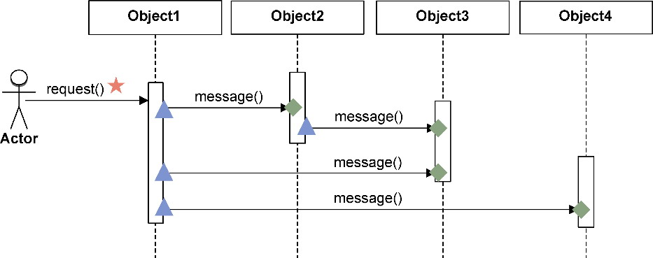

*图16-28 序列图的可视化信号*

图16-28给出了序列图的可视化信号，表达了可能存在的坏味道。

·五角星表示对一个业务服务而言，对外提供给角色的方法，应该只有一个。若存在多个五角星，说明对外的封装不够彻底，可能违背“最小知识法则”。业务服务的封装由远程服务和应用服务来体现。

·三角形：表示一个对象发起对另一个对象的调用。如果一个对象的生命线上出现过多的三角形，要么说明该对象承担了控制或协调角色，要么说明对象的职责层次不够合理。若远程服务或应用服务存在此坏味道，说明它调用了多个领域服务，可能造成领域逻辑的泄露。

·菱形：表示一个对象履行的职责。如果一个对象的生命线上出现过多的菱形，说明该对象履行了太多职责，可能违背“单一职责原则”。

对象协作的要点在于平衡，相比代码而言，序列图可以更直观地呈现协作关系的平衡度。它体现了从左到右消息传递的动态过程，也要比静态的领域设计模型更能让设计者发现可能缺失的领域对象。序列图中每个对象的调用序列非常严谨，只要消息的传递出现了断层，调用序列就无法继续往下执行，就能启发我们去寻找这个缺失的领域模型对象。

除了可视化的方式，亦可采用开发人员喜欢的代码形式展现序列图，我将这种形式称为伪代码形式的序列图脚本。以提交订单业务服务为例，它属于订单上下文，进行服务驱动设计时，应以订单上下文为主。遵循职责分配的要求，编写的序列图脚本如下：

```
OrderController.placeOrder(placingOrderRequest) {  // 业务服务对应远程服务
   OrderAppService.placeOrder(placingOrderRequest) {//应用服务的方法体现服务价值
      OrderService.placeOrder(order) { // 领域服务对应组合任务，避免领域逻辑泄露到应用服务
         OrderService.validate(order) { // 领域服务对应组合任务
            Order.validate();   // 聚合承担原子任务
            InventoryCheckingClient.check(order); // 客户端端口指向库存上下文的边界服务
         }
         OrderRepository.save(order); // 资源库端口操作订单数据表
         ShoppingCartService.removeItems(customerId,cartItems) { // 领域服务对应组合任务
            ShoppingCartRepository.cartOf(customerId); // 资源库端口操作购物车数据表
            ShoppingCart.removeItems(cartItems);  // 聚合承担原子任务
            ShoppingCartRepository.save(shoppingCart); // 资源库端口操作购物车数据表
         }
      }
      NotificationClient.notify(order); // 客户端端口指向通知上下文的边界服务
   }
}
```

通过脚本形式体现序列图的好处在于修改便利，随时可以调整类名与方法签名。脚本语法接近Java等开发语言，通过大括号可以直观体现类的层次关系，这种层次关系恰好与任务分解的层次相对应。一旦为业务服务分解了任务，就可以按照服务驱动设计中分配职责的过程，依次将业务服务、组合任务和原子任务映射到对应的角色构造型，编写序列图脚本。

ZenUML工具能够自动将脚本转换为序列图，还允许设置各种角色构造型的颜色，如此即可方便地以可视化图形展现角色构造型的协作序列，图16-29就是转换上述脚本获得的序列图。

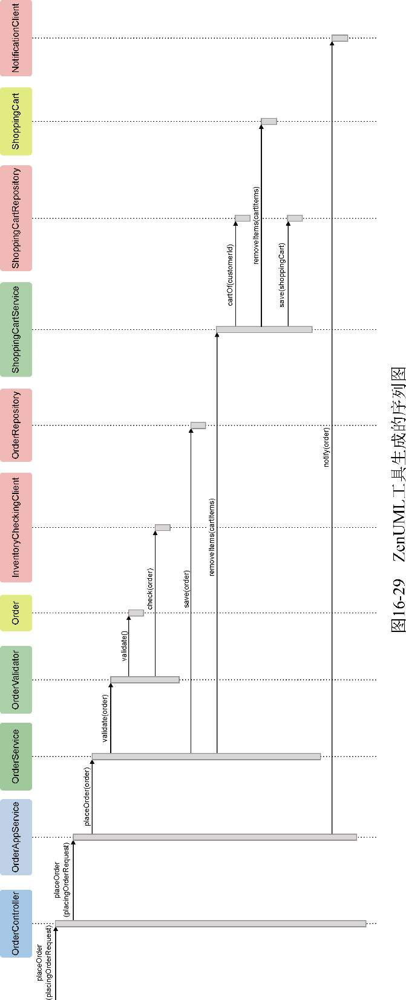

倘若通过序列图发现了设计的坏味道，又可以重新调整任务分解的层次或序列图脚本。ZenUML绘制的序列图与对应的脚本可以作为领域设计模型的一部分，成为领域设计模型类图的有效补充。由于此时仍然停留在设计阶段，调整成本较低。序列图或序列图脚本以动态方式理清整个业务服务的执行过程，有助于发现静态领域设计模型可能存在的缺陷。

编写序列图脚本时，除了要考虑职责的分配，还要思考每个对象的API设计，即序列图中彼此协作时发送的消息，包括消息名、输入参数和返回值，消息的执行形成了一条完整的消息流。编写序列图脚本，就是以模拟程序执行的方式验证设计模型的正确性。

#### 16.3.5 业务服务的关键价值

服务驱动设计通过业务服务将角色、职责和协作有机地结合在一起。它的整个设计符合从真实世界映射到领域驱动设计的对象世界的过程。业务服务是对业务需求所在的真实世界的映射，需要寻找到生活在这个世界的对象。对象强调行为的协作，而其自身却是对概念的描述。一旦我们将真实世界中的概念映射为对象，由于行为需要正确地分配给各个对象，行为就被打散了，缺少了执行步骤的时序性。

在将业务需求转换为软件设计的过程中，要找到一种既具有业务视角又具有设计视角的思维模式并非易事。服务驱动设计引入分解任务的方法，匹配了软件开发人员的思维模式。任务分解采用面向过程的思维模式，以业务视角对业务服务进行观察和剖析，利用分而治之的思想降低了领域逻辑的复杂度，同时又保证了服务的完整性。然后，再采用面向对象的思维模式，以设计视角结合职责与角色构造型，完成对职责的角色分配，通过序列图或序列图脚本体现执行服务请求的动态协作过程，反向驱动出角色构造型需要承担的职责，使得对象的设计变得更加合理，职责分配更加均衡。

这两种视角的切换是自然发生的，降低了需求理解和设计建模的难度。服务驱动设计获得的设计模型，成了领域实现建模极为友好的重要输入，尤其让建立在测试驱动开发基础上的实现过程变得更加简单。

当然，服务驱动设计并不能一劳永逸地解决设计问题。设计过程中，对于一些复杂环节，需要考虑复用和扩展，引入一些设计理念，如引入设计模式对设计做出优化和调整。这些相对灵活的设计对团队成员的能力提出了更高要求。不过，对多数业务服务而言，需要设计的变通毕竟是少数，即便不引入设计理念与设计模式，仅遵循服务驱动设计过程进行任务分解和职责分配，仍然可以保证最终实现的代码做到职责的合理分配，避免出现贫血模型与事务脚本，只是在设计上还有提升空间罢了。

这也是我提出服务驱动设计的原因：通过固化的设计流程降低团队成员的门槛，保证获得相对不错的领域实现代码。
