## 第17章 领域实现建模

> 认识和求知的基础在于不可解之物。每一条解释，中间阶段或多或少，最终都引向这里，正如触探海底的铅锤，或深或浅，但迟早会在某个地方触到海底。

> ——阿图尔·叔本华，《论世间苦难》

软件设计与开发的过程是不可分割的，那种企图打造软件工程流水线的代码工厂运作模式，已被证明难以奏效。探索设计与实现的细节，在领域建模过程中，设计在前、实现在后又是合理的选择，毕竟二者关注的视角与目标迥然不同。但这并非瀑布式的一往无前，而是要形成分析、设计和实现的小步快走与反馈闭环，在多数时候甚至要将细节设计与代码实现融合在一起。

不管设计如何指导开发，开发如何融合设计，都需要把握领域驱动设计的根本原则：以领域为设计的原点和驱动力。在领域设计建模时，务必不要考虑过多的技术实现细节，以免影响和干扰领域逻辑的设计。在设计时，让我们忘记数据库，忘记网络通信，忘记第三方服务调用，通过端口抽象出领域层需要调用的外部资源接口，即可在一定程度隔离业务与技术的实现，避免两个不同方向的复杂度产生叠加效应。

遵循整洁架构思想，我们希望最终获得的领域模型并不依赖于任何外部设备、资源和框架。简而言之，领域层的设计目标就是要达到逻辑层的自给自足，唯有不依赖于外物的领域模型才是最纯粹、最独立、最稳定的模型。

### 17.1 稳定的领域模型

一个稳定的领域模型也是最容易执行单元测试的模型。Michael C. Feathers将单元测试定义为运行得快的测试，并进一步阐释^——有些测试容易跟单元测试混淆起来，譬如下面这些测试就不是单元测试^：

·跟数据库有交互；

·进行网络间通信；

·调用文件系统；

·需要你对环境进行特定的准备（如编辑配置文件）才能运行的测试。

上述列举的测试都依赖了外部资源，实则属于测试金字塔(test pyramid)中的集成测试。测试若不依赖外部资源，就可以运行得快。运行得快才能快速反馈，并从通过的测试中获取信心。不依赖于外部资源的测试也更容易运行，遵守约束，就能驱使我们开发出仅仅包含领域逻辑的领域实现模型，满足菱形对称架构，实现业务关注点和技术关注点的分离。

#### 17.1.1 菱形对称架构与测试金字塔

菱形对称架构的每个逻辑层都定义了自己的控制边界，领域驱动设计的角色构造型位于不同的逻辑层次。菱形对称架构的分层决定了它们不同的职责与设计的粒度。层次、职责和粒度的差异，恰好与测试金字塔形成一一对应的关系，如图17-1所示。

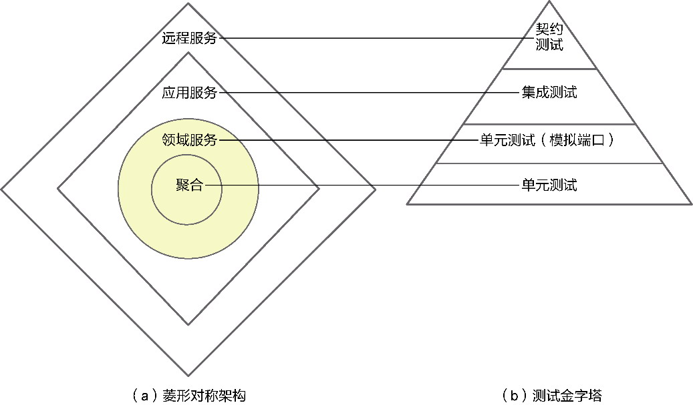

*图17-1 菱形对称架构与测试金字塔*

图17-1通过菱形对称架构表达不同的逻辑层次。北向网关层的远程服务担负的主要作用是与跨进程客户端之间的交互，强调服务提供者与服务消费者之间的履约行为。在这个层面上，我们更关心服务的契约是否正确，保护契约以避免它的变更引入缺陷，故而需要为远程服务编写契约测试。

业务核心位于领域层，但对外体现业务服务的服务价值的，是本地服务层（应用层）的应用服务。它与远程服务共同构成北向网关的边界服务。应用服务负责协调领域服务，并将消息契约转换为领域模型对象，完成一个整体的业务服务。遵循领域驱动设计对应用层的期望，需要设计为粗粒度的应用服务，相当于承担了外观服务的职责，并未真正包含具体的领域逻辑，为其编写集成测试是非常合理的选择。

服务驱动设计在分配职责时，要求将不依赖于外部资源的原子任务分配给聚合内的领域模型对象。聚合作为领域层的核心角色构造型，封装了自给自足的领域行为，与单元测试天生匹配。凡是需要访问外部资源的行为都通过端口进行了隔离，并推向处理组合任务的领域服务，由其控制聚合与端口，组成更加完整的领域行为。既然领域服务属于领域层的一部分，当然需要编写单元测试来保护它，遵循Michael C. Feathers对单元测试的定义，需要为领域服务的测试引入模拟(mock)框架，端口的抽象为模拟奠定了设计基础。

单元测试保护下的领域核心逻辑，是企业系统的核心资产，确保了领域逻辑的正确性，允许开发人员安全地对其进行重构，使得领域模型能够在稳定内核的基础上具有了持续演化的能力。

#### 17.1.2 测试形成的精炼文档

由于领域模型真实完整地体现了领域概念，为避免团队成员对这些领域概念产生不同理解，除了需要在统一语言的指导下定义领域模型对象，最好还有一种简洁的方式来表达和解释领域，尤其对于核心子领域更要如此。Eric Evans提出用精炼文档来描述和解释核心子领域，他说：“这个文档可能很简单，只是最核心的概念对象的清单。它可能是一组描述这些对象的图，显示了它们最重要的关系。它可能在抽象层次上或通过示例来描述基本的交互过程。它可能会使用UML类图或序列图、专用于领域的非标准的图、措辞严谨的文字解释或上述这些元素的组合。”^290

如果测试编写得体，测试代码也可以认为是一份精炼文档，且这样的文档还具有和实现与时俱进的演进能力，形成一种活文档(living document)。

要达成此目标，编写测试时需要遵循测试编码规范。

首先，测试类的命名应与被测类保持一致，为“被测类名称+Test后缀”。假设被测类为Account，则测试类应命名为AccountTest。一些开发工具提供通过类名快速查找类的途径，采用这一格式命名测试类，可以在查找时保证被测类与测试类总是放在一起，帮助开发人员确定产品代码是否已经被测试所覆盖。这一命名也可以清晰地告知被测类与测试类之间的关系。

其次，测试方法的命名也有讲究。要让测试类形成文档，测试方法的名称就不应拘泥于产品代码的编码规范，而以清晰表达业务或业务规则为目的。因此，我建议使用长名称作为测试方法名。例如，针对转账业务行为编写的测试方法可以命名为：

```
should_transfer_from_src_account_to_target_account_given_correct_transfer_amount()
```

测试方法名采用蛇形(snake case)风格（即下划线分隔方法的每个单词）——而非Java传统的驼峰风格——的命名方法。如果将测试类视为主语，测试方法就是一个动词短语，它告知读者被测类在什么样的场景下应该做什么事情——这正是测试方法名以should开头的原因。如果忽略下划线，这一风格的方法名其实就是对业务规则的自然语言描述。

最后，测试方法体应遵循Given-When-Then模式。该模式清晰地描述了测试的准备、期待的行为和相关的验收条件。

·Given：为要测试的方法提供准备，包括创建被测试对象，为调用方法准备输入参数实参等。

·When：调用被测试的方法，遵循单一职责原则，在一个测试方法的When部分，应该只有一条语句对被测方法进行调用。

·Then：对被测方法调用后的结果进行预期验证。

当我们阅读如下的测试类和测试方法时，是否等同于在阅读文档？

```
public class AccountTest {
   private AccountId srcAccountId;
   private AccountId targetAccountId;
   @before
     void setup(){
         srcAccountId = AccountId.of("123456");        //用于演示
         target AccountId = AccountId.of("654321");    //用于演示
   }
   @Test
   void should_transfer_from_src_account_to_target_account_given_correct_transfer_
amount() {
      // given
      Money balanceOfSrc = new Money(100_000L, Currency.RMB);
      SourceAccount src = new Account(srcAccountId, balanceOfSrc);
      Money balanceOfDes = new Money(0L, Currency.RMB);
      TargetAccount target = new Account(targetAccountId, balanceOfDes);
      Money trasferAmount = new Money(10_000L, Currency.RMB);
      // when
      src.transferTo(target, transferAmount);
      // then
      assertThat(src.getBalance()).isEqualTo(Money.of(90_000L, Currency.RMB));
      assertThat(target.getBalance()).isEqualTo(Money.of(10_000L, Currency.RMB));
   }
}
```

编写良好的单元测试本身就是“新兵训练营”的最佳教材，将其作为精炼文档用以传递领域知识好处更为明显：你无须额外为核心子领域编写单独的精炼文档，引入单元测试或者采用测试驱动开发就能自然而然收获完整的测试用例；这些测试更加真实地体现了领域模型对象之间的关系，包括它们之间的组合与交互过程；将测试作为精炼文档还能保证领域模型的正确性，甚至可以更早帮助设计者发现设计错误。

软件设计本身就是一个不断试错的过程，借助服务驱动设计可以让设计过程变得清晰简单。序列图更是具备可视化的能力，但它终归不是代码实现，序列图脚本体现的也仅仅是留存在脑海中的一种交互模式罢了。通过测试可以验证设计的正确性，而单元测试由于能够反馈快速，更是重要的验证手段。

#### 17.1.3 单元测试

如前所述，不依赖于任何外部资源的测试就是单元测试，但我们还需要就单元的含义达成共识。

**1.单元的定义**

什么是单元(unit)？因为设计角度不同，不同人对单元下的粒度定义是不同的。有人认为单元测试是针对类这个单元进行测试，有人则认为被测类的公开方法才是测试的单元……种种观点，不一而足。

原则上，一个测试类应该对应一个被测类，但由于被测类承担的职责数量不同，使得测试类与被测类未必恰好是一对一的映射关系。有的开发人员在编写单元测试时，往往根据开发工具的推荐，为一个公开的被测方法编写一个测试方法，例如被测方法为transferFrom()，测试方法就定义为testTransferFrom()。之所以如此，正是对“单元”一词的理解含混不清造成的。

我认为应该将“单元”理解为一个测试方法的目标粒度。如果目标是保证被测方法的正确性，测试的单元就是一个方法；如果目标是保证一个类的正确性，测试的单元就是一个类。终归来说，测试的目标应该是满足用户对业务功能的需求，因此，一个高质量的单元测试应针对业务功能进行编写，那么，测试类的每个测试方法就应保证一条业务规则或者一种分支场景的正确性。换言之，一个测试方法对应一个测试用例，测试的单元就是一个测试用例。

例如，为转账功能编写的测试用例为：

·一个账户正常地向另一个账户发起转账；

·若转账用户余额不足，转账失败；

·若转账金额超过规定的阈值，转账失败；

·若转账次数超过规定的当天转账次数，转账失败。

这4个测试用例应该对应一个测试类的4个测试方法，4个测试方法共同验证了转账领域行为的正确性。

**2.FIRST原则**

一个编写良好的单元测试需要遵循如下FIRST原则。

·Fast（快速）：测试要非常快，每秒能执行几百或几千个。

·Isolated（独立）：测试应能够清楚地隔离一个失败。

·Repeatable（可重复）：测试应可重复运行，且每次都以同样的方式成功或失败。

·Self-verifying（自我验证）：测试要无歧义地表达成功或失败。

·Timely（及时）：测试必须及时编写、更新和维护。

要保证测试快，就应尽可能避免单元测试访问外部资源，因为通常对外部资源的访问都会消耗较多的执行时间。

单元测试的独立性变相地说明了测试单元的粒度就是一个测试用例。从功能实现的角度看，要做到测试的独立性，就要做到一个程序分支对应一个测试方法。例如判断转账金额就存在超过金额阈值与满足金额要求的两个分支，判断余额也存在余额不足和满足余额要求的两个分支。不同的分支有不同的代码实现，它们彼此之间应该是正交的，一个测试的失败并不会影响另一个测试。测试的独立性有利于问题的定位，一旦发现某一个测试失败，就可以直接定位到该测试对应的程序分支，快速发现问题。

保证测试可重复运行，就可以避免测试出现偶然的正确性，例如针对随机或动态产生的结果，可能在上一次运行时间通过了测试，但随着时间或其他条件发生变化，测试就会失败。要保证测试可重复运行，还要避免多个测试之间共享资源的情况，这实际与测试的独立性有关。不能让上一个测试改变了一个全局变量的值从而影响下一个运行的测试。还有一种情况会影响测试的重复运行，就是资源的准备(setup)和清理(teardown)。如果单元测试的被测方法对被测试资源产生了副作用，例如修改了某个标志的值，恰巧这个值又是该方法执行时需要读取以决定执行分支的参考，就可能导致相同测试的下一次执行会失败。一言以蔽之，就是要保证同一个测试方法在每次执行前的条件完全相同。

没有自我验证的测试就是无效的测试。一个测试没有验证，就无法通过测试结果告知被测方法到底正确还是错误，因为没有验证的测试执行结果一定会成功。一些开发人员习惯在测试方法中通过打印输出结果，然后肉眼判断结果的正确性来完成测试。这一方式只能作为临时调试，如此编写的单元测试并没有提供准确的反馈信息，也无法做到对产品代码的保护。更有甚者，有人编写无自我验证的测试，目的仅仅是提高单元测试覆盖率。这种蒙混过关的做法当然不足取。

及时编写、更新和维护单元测试，目的是保证测试方法可以随着业务代码的变化动态地保障质量。测试代码也是领域资产的一部分，决定了代码的内建质量。无论是变更产品代码的已有实现，还是因为新需求增加产品代码实现，都需要及时调整测试代码，保证产品代码与测试代码的同步。

### 17.2 测试优先的领域实现建模

从设计到实现是一个不断沟通的过程。这个沟通不仅仅指团队中不同角色成员之间的沟通，还包括代码的实现者与阅读者之间的沟通。这种沟通并非面对面（除非采用结对编程）地进行，而是借代码这种“媒介”以一种穿越时空的形式进行。

之所以强调代码的沟通作用，原因在于对维护成本的考量。Kent Beck说：“在编程时注重沟通还有一个很明显的经济学基础。软件的绝大部分成本都是在第一次部署以后才产生的。从我自己修改代码的经验出发，我花在阅读既有代码的时间要比编写全新的代码长得多。如果我想减少代码所带来的开销，我就应该让它容易读懂。”^

要做到让代码易懂，需要保证代码的简单。少即是多，有时候删掉一段代码比增加一段代码更难，相应地，带来的价值可能比后者更高。许多程序员常常感叹开发任务繁重，每天要做的工作加班也做不完，与此同时，他们又在不断地臆想功能的可能变化，堆砌更为复杂的代码。明明可以直道行驶，偏偏要以迂为直，增加不必要的间接层，然后美其名曰保证系统的可扩展性。只可惜这样的可扩展性设计往往在最后沦为过度设计。Neal Ford将这种情形称为“预想开发”(speculative development)^。预想开发会事先设想许多可能需要实现的功能，就好比“给软件贴金”。程序员一不小心就会跳进这个陷阱。

Kent Beck认为程序员应追求简单的价值观。他强调：“在各个层次上都应当要求简单。对代码进行调整，删除所有不提供信息的代码。设计中不出现无关元素。对需求提出质疑，找出最本质的概念。去掉多余的复杂度后，就好像有一束光照亮了余下的代码，你就有机会用全新的视角来处理它们。”^编写代码易巧难工，卖弄太多的技巧往往会将业务真相掩埋在复杂的代码背后。

服务驱动设计从业务服务出发驱动设计，就是希望推导出恰如其分的领域设计模型。在领域实现建模阶段，既要及时验证设计的正确性，又要确保代码的沟通作用，并保证从设计到实现一脉相承的简单性，最好的方式就是测试驱动开发。

#### 17.2.1 测试驱动开发

测试驱动开发是一种测试优先的编程实现方法。作为极限编程的一种开发实践，从被Kent Beck提出至今，该方法仍然饱受争议，许多开发人员仍然无法理解：在没有任何实现的情况下，如何开始编写测试？

这实际上带来一个问题：为什么需要测试优先？

在进行软件设计与开发的过程中，每个开发人员其实都会扮演两个角色：

·接口的调用者；

·接口的实现者。

所谓“设计良好的接口”，就是让调用者用起来很舒服的接口。这种接口使用简单，不需要了解太多的知识即可被调用，清晰表达意图。要设计出如此良好的接口，就需要站在调用者角度而非实现者角度去思考接口。编写测试，其实就是在编程实现之前，假设对象已经有了一个理想的方法接口，该接口符合调用者的期望，能够完成调用者希望它完成的工作而又无须调用者了解太多的信息。实际上，这也是意图导向编程(programming by intention)思想^的体现。

测试驱动开发的一个常见误区是没有设计，一开始就挽起袖子写测试代码。事实上，测试驱动开发强调的“测试优先”，是要求需求分析优先；对需求对应的业务服务进行拆分，就是任务分解优先。开发人员不应该一开始就编写测试，而应分析需求，识别出可控粒度的业务服务，对其进行任务分解。对任务的分解就是对职责的识别。职责对应的任务必须是可验证的。如此过程，不正是服务驱动设计要求的吗？

**服务驱动设计能完美地结合测试驱动开发。分解任务是服务驱动设计的核心步骤，它进一步理清了业务服务，以便将职责分配给合适的角色构造型，是一个由外至内的设计过程。分解任务又可以进一步划分为多个可以验证的测试用例，然后按照“测试-开发-重构”的节奏开始编码实现，从最容易编写单元测试的聚合开始，再到领域服务，是一个由内至外的开发过程。服务驱动设计和测试驱动开发的关系如图17-2所示。

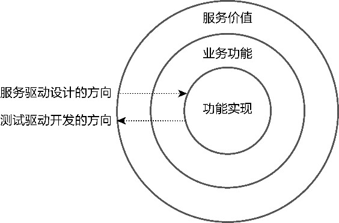

*图17-2 服务驱动设计和测试驱动开发的关系*

由于服务驱动设计已经完成了任务分解，通过序列图或序列图脚本明确了参与协作的角色构造型，乃至识别了必要的消息（即角色构造型的方法），因此在此基础上再来开展测试驱动开发会变得更加容易。以“任务分解”作为连接点，从任务到测试用例，再到测试编写，非常顺畅地实现了从领域设计建模到领域实现建模的无缝衔接，如图17-3所示。

测试驱动开发在挑选任务进行测试驱动时，需要考虑选择合适的任务。考虑因素包括：

·任务的依赖性；

·任务的复杂度。

若要考虑依赖性，应优先选择没有依赖或依赖较少的前序任务。虽说可以使用模拟的方式驱动出当前任务需要依赖的接口，但过多的模拟会让单元测试变得太脆弱。若模拟的接口缺乏稳定性，就需要同时修改实现与测试。如前所述，之所以采用由内至外的开发过程，就是为了减少依赖。

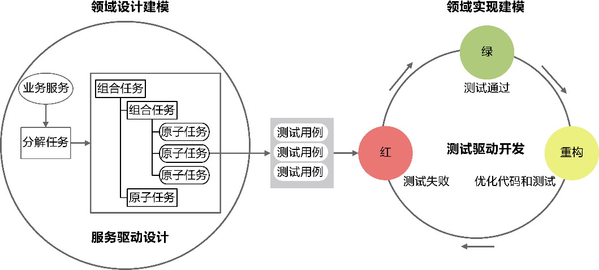

*图17-3 领域设计建模与领域实现建模的衔接*

不同任务的复杂度并不一样。为了快速地开始测试驱动开发，可以考虑先从简单的任务开始，避免因为任务太过复杂而花费太多的开发成本，影响开发的进度和信心。当然，在任务经过良好的分解后，诸多复杂问题都在某种程度上得到了一定的简化，尤其原子任务的职责都是单一的，进行测试驱动开发也会变得简单。

有人认为，测试驱动开发应优先选择重要的任务（如优先考虑编写核心的业务流程），而将非核心的任务（如对异常情况的处理）放在后面进行处理。看起来这样的理由足够充分，然而，对一个业务服务而言，只有完成了所有任务的实现，才具有完整的交付价值。无论该业务服务的任务是否重要，只要未完成，实现就是不完整的。即便一些任务只是对异常流程的处理，也构成了提供服务价值的重要一环。换言之，对于一个完整的业务服务，所有任务具有相同的重要性。

服务驱动设计可以作为测试驱动开发的基础。选择任务时，优先选择不访问外部资源的原子任务，然后依次向外挑选该原子任务组成的组合任务，就能有效避免任务之间的依赖。一旦选定要进行测试驱动的任务，就可以结合业务服务规约中的验收标准编写测试用例。编写测试用例时，需保证测试用例之间是正交的，每个测试用例都是可验证的。编写测试时，服务驱动设计确定的角色构造型可以作为被测类的候选，序列图脚本推演出来的消息定义可以作为被测方法的候选。

#### 17.2.2 测试驱动开发的节奏

测试驱动开发非常强调节奏感。测试驱动开发的“测试-开发-重构”三重奏如图17-4所示。

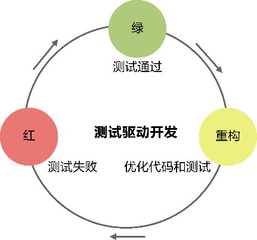

*图17-4 测试驱动开发三重奏*

首先，根据识别的测试用例编写测试。这时还没有产品代码的实现，只需要保证编写的测试方法通过编译即可，运行测试，显示红色则测试失败。然后，开发产品代码。它的唯一目的就是让红色（失败）的测试方法通过，变成绿色。一旦测试通过，就应该提交代码。最后，识别产品代码和测试代码的坏味道，若有，即刻通过重构（黄色）消除，优化代码。重构之后必须运行测试，确保重构后的代码并未破坏已经通过的测试。这也符合重构的定义：在不修改功能实现的基础上改善既有代码的设计。

“测试-开发-重构”的节奏，就是红-绿-黄的开发节奏。这好似在都市里开车，必须听从红、绿、黄3种交通信号灯的指挥，以保证交通的顺畅与安全。

为了更好地指导开发人员进行测试驱动开发，并严格遵守“测试-开发-重构”的开发节奏，Robert Martin分析了这三者之间的关系，并将其总结为如下的测试驱动开发三定律。

·定律一：一次只写一个刚好失败的测试，作为新加功能的描述。

·定律二：不写任何产品代码，除非它刚好能让失败的测试通过。

·定律三：只在测试全部通过的前提下做代码重构，或开始新加功能。

**1.定律一**

新功能是新测试驱动出来的，没有编写测试，就不应该增加新功能，而现有代码已经由测试保证，这就增强了迈向新目标的信心。

通过测试驱动新功能的开发时，开发人员扮演的角色是接口的调用者，因此，一个刚好失败的测试，表达了调用者不满于现状的诉求，而且这个诉求非常简单，就好似调用者为实现者设定的一个具有明确针对性的小目标，轻易可以达成。如果采用结对编程，就可以分别扮演调用者和实现者的角色，专注于各自的视角，让测试驱动开发的过程进展得更加顺利。

定律一要求一次只写一个测试，这是为了保证整个开发过程小步前行，做到步步为营。在没有实现产品代码让当前测试通过之前，不要新增任何测试方法。

**2.定律二**

一个测试失败了，意味着需要实现功能让测试通过。让测试刚好通过，是实现者唯一需要达成的目标。这就好似玩游戏。测试的编写者确定了完成游戏的目标，然后由此去设定每一关的关卡。游戏的玩家不能像打斯诺克那样，每击打一个球，还要去考虑击打的球应该落到哪个位置才有利于击打下一个球。只需以通过当前游戏关卡为己任，一次只通一关，让测试刚好通过。这样就能让实现者的目标明确，达到简单、快速、频繁验证的目的。

需要正确理解所谓“刚好”的度。既不要过度地实现测试没有覆盖的内容，也无须死板地拘泥于编写所谓“简单”的实现代码。简单并非简陋，既然你的编码技能与设计水平已经足以一次编写出优良的代码，就不必拖到最后，多此一举地等待重构来改进。只要没有导致过度设计，若能直接编写出整洁代码，何乐而不为？测试驱动开发强调实现代码仅仅让当前测试刚好通过，底线是“不要过度设计”，并不是说非要去做不恰当的简单实现。

遵循定律二的开发实践，就能要求测试驱动开发的开发人员克制追求大而全的野心，不写任何额外的或无关的产品代码，谨守“只要求测试恰好通过足矣”的底线，保证实现方案的简单。

**3.定律三**

测试全部通过意味着目前的功能都已实现，但未必完美。这个时候要考虑重构，在保证既有功能外部行为不变的前提下，安全地对代码设计做出优化，去除坏味道。每执行一步重构，都要运行一遍测试，保证重构没有破坏已有功能。及时而安全的重构，也会让重构的代价变得更小。

添加新功能与重构不能在同一时刻共存。一个时刻要么添加新功能，要么重构。在全部测试已经通过的情况下，若发现代码存在坏味道，应该先重构，再添加新功能。

重构的基础是识别代码的坏味道。Martin Fowler总结了包括重复代码、过长函数、过大的类、依恋情结等21种常见的代码坏味道^，并给出了对应的重构手法。重构需要随时随地进行，不要盲目地追求开发进度而忽略代码重构，就好似我们不能只为了工作而不修边幅。重构能力固然重要，但态度更加重要。当具有各种坏味道的代码积累到一定规模之后，就会积重难返，引发“破窗效应”^。注意，测试代码同样需要重构，这也满足了FIRST原则的Timely（及时）原则。

完成重构后，运行测试，确保重构未曾影响任何测试，接着代码，再考虑新加功能。此时又要遵循定律一，先编写一个刚好失败的测试，以此作为新加功能的描述。如此周而复始，以一种美妙的节奏感开始迭代地、增量地进行领域实现建模。

#### 17.2.3 简单设计

测试驱动开发遵守测试-开发-重构的循环。测试设定了新功能的需求期望，并为功能实现提供了保护；开发让实现真正落地，满足产品功能的期望；重构可以改进代码质量，降低软件的维护成本。期望-实现-改进的螺旋上升态势，为测试驱动开发闭环提供了源源不断的动力。缺少任何一个环节，循环都会停滞不动。没有期望，实现就失去了前进的目标；没有实现，期望就成了空谈；没有改进，前进的道路就会越走越窄，突破就会变得愈发艰难。

若已有清晰的用户需求，为其设定期望然后寻求实现并非难事，但是改进的标准却是模糊的。要达到什么样的目标才符合重构的要求？Martin Fowler提出的代码坏味道虽然可以作为参考，但要保证代码的嗅觉灵敏度，就需要对这些坏味道了然于胸。

研究证明，人类的短时记忆容量大约为7±2个组块，许多人可能一时无法记住所有坏味道的特征。因此，从开发到重构的过程中，可以遵循Kent Beck提出的简单设计原则。该原则的内容为：

·通过所有测试；

·尽可能消除重复；

·尽可能清晰表达；

·更少代码元素；

·以上4个原则的重要程度依次降低。

通过所有测试原则意味着我们开发的功能满足客户的需求，这是简单设计的底线原则。该原则同时隐含地告知开发团队与客户或领域专家（需求分析师）充分沟通的重要性。

尽可能消除重复原则是对代码质量提出的要求，并通过测试驱动开发的重构环节完成。注意，此原则提到的是尽可能消除重复(minimizes duplication)，而非无重复(no duplication)，因为追求极致的复用存在设计与编码的代价。

尽可能清晰表达原则要求代码要简洁而清晰地传递领域知识，在领域驱动设计的语境下，就是要遵循统一语言，提高代码的可读性，满足业务人员与开发人员的交流目的。针对核心子领域，甚至可以考虑引入领域特定语言来表现领域逻辑。

在满足这3个原则的基础上，更少代码元素原则告诫我们遏制过度设计，做到恰如其分的设计，即在满足客户需求的基础上，只要代码已经做到了最少重复与清晰表达，就不要再进一步拆分或提取类、方法和变量。

最后一个原则说明前面4个原则是依次递进的。

功能正确、减少重复、代码可读是简单设计的根本要求。一旦满足这些要求，就不能创建更多的代码元素去迎合未来可能并不存在的变化，避免过度设计。这也体现了奥卡姆剃刀原则，即“主张个别的事物是真实的存在，除此之外没有必要再设立普遍的共相，美的东西就是美的，不需要再废话多说什么美的东西之所以为美是由于美，最后这个美，完全可以用奥卡姆的剃刀一割了之。”^

所谓“普遍的共相”就是一种抽象。在软件开发中，不必要的抽象会产生多余的概念，干扰代码阅读者的判断，增加代码的复杂度。简单设计强调恰如其分，若实现的功能通过了所有测试，就意味着满足了客户的需求。这时，只需要尽可能消除重复，清晰表达设计者意图，不可再增加额外的软件元素。若存在多余实体，当用奥卡姆的剃刀一割了之。简单设计的第四条原则也可以表示为“若无必要，勿增实体”，意味着不要盲目地考虑为其增加新的软件元素。

相较于重构坏味道，简单设计为代码的重构给出了3个量化标准：重复性、可读性和简单性。重复性是一个客观的标准，可读性则出于主观的判断，故而应优先考虑尽可能消除代码的重复，然后在此基础上保证代码清晰地表达设计者的意图，提高可读性。只要达到了复用和可读，就应该到此为止，以保证实现方案的简单，不要画蛇添足地增加额外的代码元素，如变量、函数、类甚至模块。

### 17.3 领域建模过程

业务服务是领域级业务需求的问题呈现。作为领域建模过程的起点，业务服务是领域建模的基本业务单元：聚合则是领域建模的基本设计单元，在作为基本架构单元的限界上下文约束之下开展。这充分体现了领域驱动设计统一过程各个阶段之间的衔接与融合。

领域驱动设计重视以领域为驱动力的设计原则。在建模过程中，以领域为驱动力被具体化为业务服务，遵循统一语言提供了领域知识，以便在分析建模时捕捉领域概念，构成在限界上下文约束下的领域分析模型。分析模型是一个纯粹表达业务含义的对象图，在其基础上引入领域驱动设计要素，通过梳理对象图，定义以聚合为边界的领域设计类图，然后利用服务驱动设计针对业务服务分解任务，开启根据职责逐层分级、相互协作的动态之旅，输出领域设计序列图或序列图脚本，它与领域设计类图共同构成领域设计模型。业务服务的验收标准可转换为测试用例，而序列图脚本又能帮助开发人员更好地进行测试驱动开发，在“测试-开发-重构”的闭环中不断地演化领域实现模型，提高实现的质量，最终获得满足统一语言要求且能运行的领域模型。整个领域建模过程如图17-5所示。

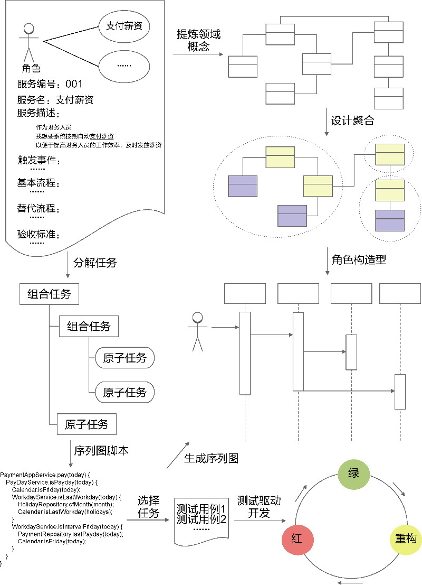

*图17-5 领域建模过程*

为了更好地理解整个领域建模过程如何基于业务服务逐层推进与演化，获得最终的领域模型，接下来我通过薪资管理系统这个完整案例加以演示和说明。

#### 17.3.1 薪资管理系统的需求说明

薪资管理系统的需求说明如下：

公司雇员有3种类型：钟点工、月薪雇员和销售人员。

对于钟点工，系统会按照雇员记录中每小时报酬字段的值为他们支付报酬。他们每天会提交记录了日期以及工作小时数的工作时间卡。如果他们每天工作超过8小时，超过部分会按照正常报酬的1.5倍进行支付。月薪雇员以月薪进行支付，在雇员记录中有月薪字段。公司会对雇员做考勤处理，如果雇员迟到、早退或旷工，会扣除其月薪的一定金额。对于销售人员，则根据他们的销售情况支付一定的报酬。他们会提交销售凭条，其中记录了销售的日期和销售产品的数量，酬金保存在雇员记录的酬金报酬字段。

在为各种类型的雇员结算薪资后，系统会根据每位雇员预留的银行账户在规定时间向其自动支付薪资。钟点工的薪资支付日期为每星期五，月薪雇员的薪资支付日期为每个月的最后一个工作日，销售人员的薪资支付日期为每隔一星期的星期五。

薪资管理系统的业务服务图如图17-6所示。

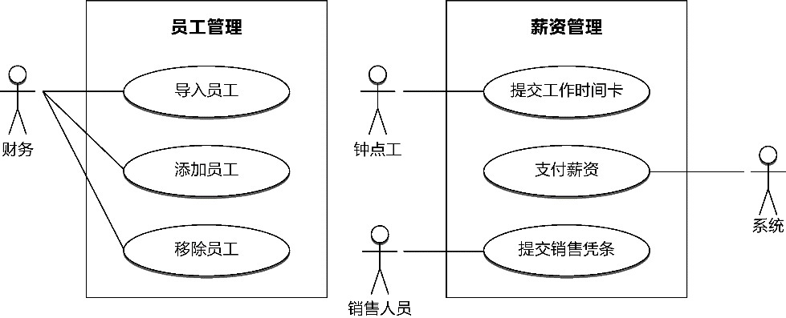

*图17-6 薪资管理系统的业务服务图*

#### 17.3.2 薪资管理系统的领域分析建模

在获得了目标系统的业务服务后，需求分析人员需要进一步细化业务服务，编写业务服务规约。如下为支付薪资的业务服务规约。

服务编号：S0006

服务名：支付薪资

服务描述：

作为财务人员（Accountant）

我想要系统按期自动支付薪资（Salary）

以便提高财务人员的工作效率，及时发放薪资

触发事件：

每天凌晨0:00自动触发

基本流程：

1.确定是否支付日(PayDay)

2.获取支付日对应类型的雇员(Employee)名单

3.计算薪资，生成雇员的工资条(Payroll)

3.1 若为钟点工雇员（HourlyEmployee），根据工作时间卡（TimeCard）与时薪计算薪资

3.2 若为月薪雇员(SalariedEmployee)，根据出勤记录(Attendance)计算薪资

3.3 若为销售人员（CommissionedEmployee），根据销售凭条（Sale Receipt）计算薪资

4.向雇员的银行账户(SavingAccount)发起转账，支付薪资

5.通过邮件(Email)通知薪资已发放，同时发送工资条给员工

替换流程：

1a.如果不是支付日，直接退出

4a.如果薪资支付失败，给出失败原因，并发送邮件给财务人员

验收标准：

1.钟点工雇员的支付日为每星期五

2.如果钟点工雇员未提交工作时间卡，视为未工作

3.工作时间卡的工作时间最低不少于1小时，最高不高于12小时

4.每天工作超过8小时，超过部分按照正常报酬的1.5倍进行结算

5.月薪雇员的支付日为每个月最后一个工作日

6.若月薪雇员的出勤记录包含旷工，将按照月薪计算出来的日薪进行扣除

7.若月薪雇员的出勤记录包含迟到、早退，将扣除日薪的20%

8.销售人员的支付日为每隔一星期的星期五

9.若销售人员未提交销售凭条，酬金报酬为0

10.会为符合支付条件的员工生成工资条

11.支付成功后，员工工资条的状态会更改为已支付

12.员工收到薪资发放的通知（Notification）

我们选择快速建模法针对支付薪资业务服务建立领域分析模型。如上业务服务规约添加下划线的内容即我们识别出来的名词，检查这些名词是否符合统一语言的要求，即可快速映射为图17-7中的领域类。

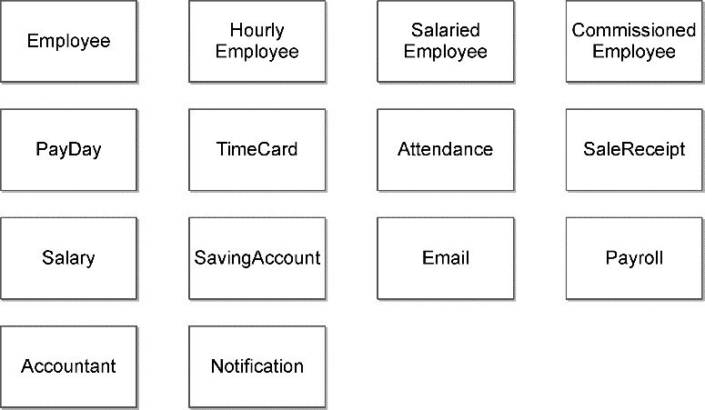

*图17-7 名词建模获得的领域分析模型*

业务服务规约添加波浪线的内容即我们识别出来的动词。逐个判断它们对应的领域行为是否需要产生过程数据。识别时，一定要从管理、法律或财务角度判断过程数据的必要性。例如，“生成雇员工资条”动作的目标数据是工资条，无须记录在某时某刻生成了工资条，因为管理人员并不关心工资条是什么时候生成的，只要工资条存在，就不会产生审计问题。“向雇员的银行账户发起转账，支付薪资”动作的目标数据是薪资，但在发起转账时，必须记录何时完成对薪资的支付，支付金额是多少，否则，若雇员没有收到薪资，就可能出现财务纠纷，于是识别出支付记录(Payment)，它是支付行为的过程数据。

不是每一个动词都会产生过程数据，如果确定没有，也不必疑惑，照实建立领域分析模型即可。

通过名词和动词识别了领域模型之后，需要对这些概念进行归纳和抽象。注意，钟点工(HourlyEmployee)、月薪雇员（SalariedEmployee）和销售人员（CommissionedEmployee）虽然在类型上都是雇员（Employee），但由于它们各有自身的业务含义，不可在领域分析模型中通过雇员对它们进行抽象，否则可能会漏掉重要的领域概念。

一旦明确了领域概念，就可进一步确定它们的关系，并检查这些关系是否隐含了领域概念。确定关系时，若能显而易见地确定关系数量，就标记出来，如钟点工(HourlyEmployee)与工作时间卡(TimeCard)，就是明显的一对多关系。最终，快速建模法获得的领域分析模型如图17-8所示。

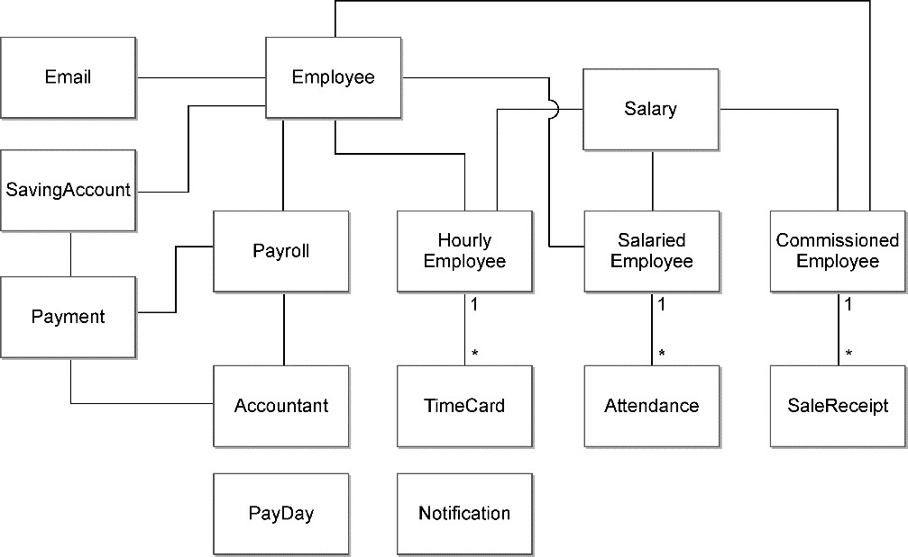

*图17-8 薪资管理系统的领域分析模型*

如果有更多的业务服务规约，快速建模法获得的领域分析模型就更丰富，也更加贴近最终输出的领域模型。

领域分析模型要受到限界上下文的约束。薪资管理系统分为员工上下文和薪资上下文，通过识别领域概念与限界上下文知识语境的关系，可以获得图17-9所示的领域分析模型。

员工上下文中的员工Employee与薪资上下文中的钟点工HourlyEmployee、月薪雇员SalariedEmployee和销售人员CommissionedEmployee充分体现了领域概念的知识语境，显然，员工上下文并不关心各种雇员类型的薪资计算和支付，而薪资上下文也不需要了解员工的基本信息。

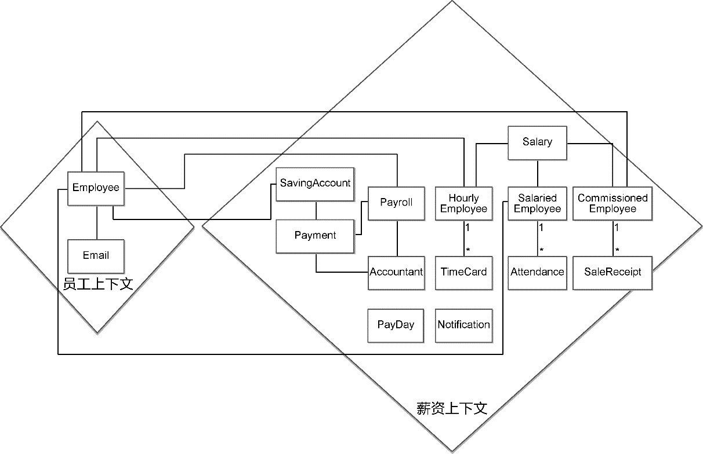

*图17-9 引入限界上下文的领域分析模型*

#### 17.3.3 薪资管理系统的领域设计建模

薪资管理系统的领域分析模型应由领域专家作为主导开展分析建模，获得的领域分析模型是纯业务的概念抽象，这些概念抽象实际上就是设计类模型的基础。接下来，需要由开发团队引入领域驱动设计要素进行设计建模，获得聚合。

**1.聚合设计**

按照聚合设计的庖丁解牛过程，首先是理顺对象图。

理顺对象图的关键是明确实体和值对象，然后明确实体之间的设计关系。毫无疑问，3种类型的雇员类都是实体类型。需要通过身份标识来管理工资条Payroll的生命周期，支付记录Payment作为支付行为的过程数据，也应被定义为实体。月薪雇员的出勤记录Attendance是从别的系统获得的，不需要在薪资管理系统中管理它的生命周期。对每个雇员而言，出勤记录的值相同，就可认为是同一条出勤记录，因此识别Attendance为值对象。工作时间卡TimeCard的相等性可以通过值决定（它的值包含员工ID），因此TimeCard也可以定义为值对象。销售凭条SalesReceipt则不同，同一个销售人员可能提交值相同的不同销售凭条，需要引入身份标识来区分，因此SalesReceipt定义为实体。财务Accountant是雇员的角色，定义为值对象。支付日PayDay的职责是判断当前日期是否支付日，本质上是一个领域服务。由此获得图17-10所示的领域设计模型。

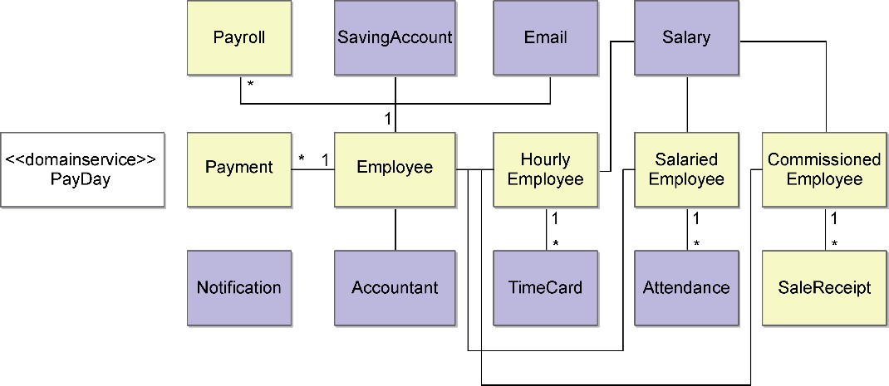

*图17-10 识别实体和值对象*

在明确对象之间的关系时，钟点工HourlyEmployee、月薪雇员SalariedEmployee和销售人员CommissionedEmployee的领域概念是相似的，似乎可以泛化为同一个父类Employee。然而，员工这些概念根据知识语境的不同，被分到了两个不同的限界上下文，若为它们引入泛化关系，就会带来两个限界上下文之间的耦合。更何况，3个雇员类的结构存在很大差异，遵循“差异式编程”原则，将它们定义为一个继承体系也是不合理的。

每种类型的员工都与工资条Payroll、支付记录Payment存在关联关系，这个关联关系是通过EmployeeId建立的，属于普通关联关系。这也说明了虽然3个雇员类完全独立，却共享了员工聚合根实体Employee拥有的身份标识EmployeeId。在领域设计模型中，这种关联关系仅仅存在于领域概念之中，设计上，已经通过引入内建类型去掉了耦合。CommissionedEmployee实体与SalesReceipt实体具有相同的生命周期，应定义为合成关系。建立了关系的领域设计模型如图17-11所示。

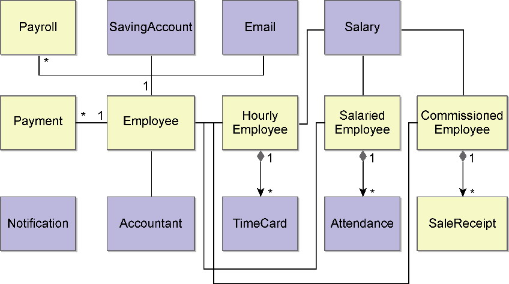

*图17-11 梳理类的关系*

一旦确定了领域类之间的关系，就可以分解关系薄弱处。目前获得的领域设计模型中，实体之间并无强耦合的泛化关系，仅有CommissionedEmployee实体与SalesReceipt实体之间的关系为合成关系，其余皆为弱依赖的普通关联关系。因此，很容易根据关系的强弱划分出图17-12所示的聚合。

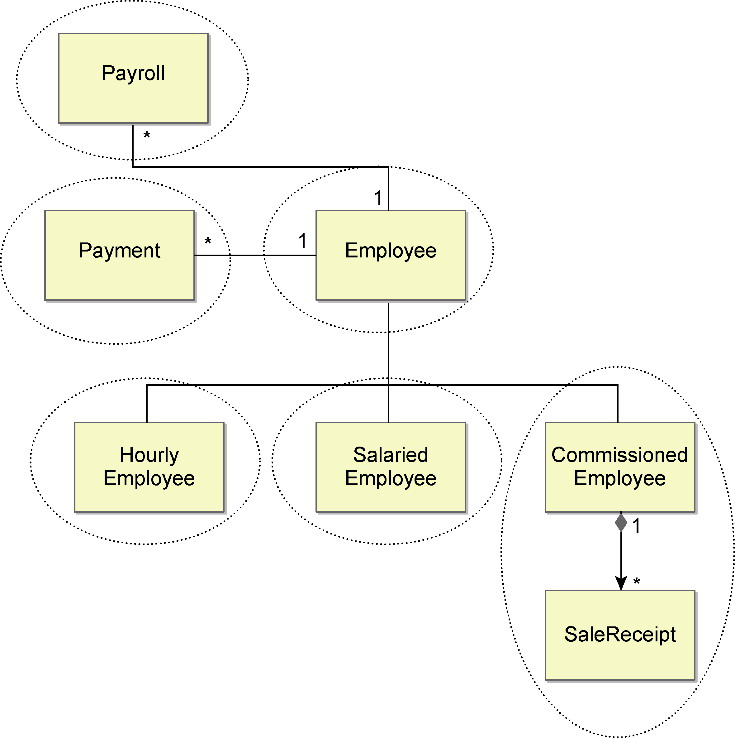

*图17-12 确定聚合*

最后，根据聚合的设计原则依次检查已经识别出的聚合，判断是否需要调整聚合的边界。目前识别的每个聚合都满足完整性、独立性、不变量和一致性，无须做任何调整。

**2.服务驱动设计**

在获得静态的领域设计模型后，开展服务驱动设计以获得动态的领域设计模型。这里选择对支付薪资业务服务进行任务分解。先将业务服务规约中的基本流程按照动词短语的形式描述出来：

·确定是否支付日期；

·获取雇员信息；

·计算雇员薪资；

·支付；

·通知雇员。

通过向上归纳与向下分解，将整个业务服务的任务最终分解为由组合任务和原子任务组成的任务树：

·

      确定是否支付日期

·确定是否为星期五

·

          确定是否为月末工作日

·获取当月的假期信息

·确定当月的最后一个工作日

·

          确定是否为间隔一星期的星期五

·获取上一次销售人员的支付日期

·确定是否间隔了一个星期

·获取雇员信息

·

      计算雇员薪资

·遍历满足条件的雇员信息

·

          根据不同雇员类型计算雇员薪资

·

              计算钟点工薪资

· 获取雇员工作时间卡

· 根据雇员日薪计算薪资

·

              计算月薪雇员薪资

· 获取月薪雇员的考勤记录

· 对月薪雇员计算月薪

·

              计算销售人员薪资

· 获取雇员销售凭条

· 根据酬金规则计算薪资

·

      支付

·向满足条件的雇员账户发起转账

·生成支付凭条

·通知雇员

一旦获得了业务服务的任务树，就可以直接按照分解的任务编写序列图脚本，并通过执行序列判断任务分解的合理性，确定是否遗漏了领域模型。如下序列图脚本表现了第一个组合任务的执行序列：

```
PaymentAppService.pay(today) {
   PayDayService.isPayday(today) {
      Calendar.isFriday(today);
      WorkdayService.isLastWorkday(today) {
         HolidayRepository.ofMonth(month);
         Calendar.isLastWorkday(holidays);
      }      
      WorkdayService.isIntervalFriday(today) {
         PaymentRepository.lastPayday(today);
         Calendar.isFriday(today);
      }
   }
}
```

注意区分PayDayService和WorkdayService的命名，它们代表了不同层级的业务目标。在“确定是否支付日期”任务这一级，业务目标为“确定是否为支付日”，故而命名为PayDayService；在“确定是否为月末工作日”与“确定是否为间隔一星期的星期五”任务这一级，业务目标为“确定是否为正确的工作日”，故而命名为WorkdayService。

执行上述原子任务的角色构造型既不是聚合，也不是端口，而是Calendar领域服务。这算是根据角色构造型分配职责的一个例外，但也符合领域服务的定义，因为这些原子任务要执行的领域行为都是无状态的。根据以上序列图脚本生成的序列图能够直观地表现这样的协作方式，如图17-13所示。

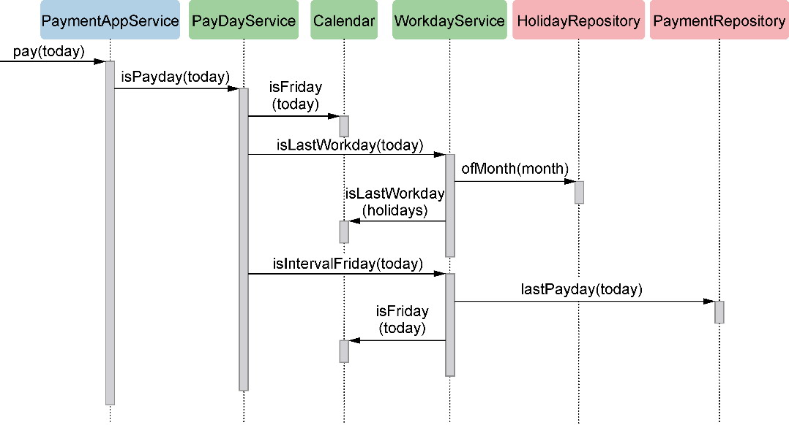

*图17-13 确定支付日期的序列图*

图17-13中的Calendar与WorkdayService在不同的抽象层次进行协作，又都被封装在PayDayService领域服务中。两个资源库也被封装到WorkdayService领域服务中。应用服务、领域服务和聚合形成了不同的隔离层次。合理的封装让最外层的应用服务了解更少的知识就能实现支付功能，避免了应用服务乃至应用层的臃肿与职责错位。

继续选择下一个任务。“获取对应雇员信息”是一个原子任务，通过访问数据库获得雇员信息。该职责操作的聚合为Employee，自然应该分配给EmployeeRepository。序列图脚本为：

```
employees = EmployeeRepository.allOf(employeeType);
```

编写序列图脚本时，需要明确每个方法的输入参数，如果返回值很重要，也需要明确给出。由于序列图体现了各个对象的协作顺序，在确定下一个方法的输入参数时，需要考虑它从何而来。当前原子任务在获取雇员信息时，需要指定雇员类型employeeType，但是从服务请求传递来的信息仅包含了today，它的上一个任务“确定是否支付日”返回的信息又只有boolean结果，于是问题出现：employeeType从何而来？

这就是序列图脚本的设计驱动力。在序列图脚本中，每个方法的调用是连贯执行的，如果协作时出现调用关系的“断链”，就说明要么缺少了参与对象，要么方法的定义存在缺失。

看起来，“确定是否支付日”任务不仅判断了当天是否为支付日，在确定为支付日时，还需要给出符合条件的雇员类型。PayDayService.isPayday(today)的返回结果就值得推敲了：这个返回结果不应该是boolean，而应该是雇员类型；由于不同雇员类型的支付日规则可能同时满足，应返回雇员类型列表；如果雇员类型列表为空，说明当天不是工作日。

返回结果的改变其实已经改变了任务的目标，不再是“确定是否支付日”，而是“确定支付日雇员类型”，分解的任务需要调整：

·

      确定支付日雇员类型

·

          确定支付日为钟点工雇员类型

·确定是否为星期五

·

          确定支付日为月薪雇员类型

·获取当月的假期信息

·确定当月的最后一个工作日

·

          确定支付日为销售人员类型

·获取上一次支付销售人员的日期

·确定是否间隔了一个星期

对应的序列图脚本也要调整：

```
PaymentAppService.pay(today) {
   employeeTypes = PayDayService.acquireEmployeeTypes(today) {
      EmployeeTypeService.payForHourlyEmployee(today) {
        Calendar.isFriday(today);
       }
      EmployeeTypeService.payForSalariedEmployee(today) {
         HolidayRepository.ofMonth(month);
         Calendar.isLastWorkday(holidays);
      }      
      EmployeeTypeService.payForCommissionedEmployee(today) {
         PaymentRepository.lastPayday(today);
         Calendar.isFriday(today);
      }
   }
}
```

这一修改过程也充分地说明了分解任务的工作无法一蹴而就，服务驱动设计不是一个瀑布过程，而是迭代的过程。

“计算雇员薪资”是一个嵌套多层的组合任务，但并没有直接体现服务价值，属于“支付薪资”业务服务的执行步骤。当我们面对相对复杂的组合任务时，为避免业务服务的序列图过于复杂，在编写序列图脚本时，可以仅考虑履行最高一层组合任务职责的领域服务，即PayrollCalculator。至于“计算雇员薪资”的设计细节，可以单独给出序列图脚本。

“支付”仍然属于组合任务。由于转账服务的实现不在薪资管理系统的范围之内，因此“向满足条件的雇员账户发起转账”就是一个访问第三方服务的原子任务。“生成支付凭条”原子任务直接体现了“支付凭条”这一领域概念。在“获取上一次销售人员的支付日期”原子任务中，其实已经驱动出支付凭条这一领域概念了，因为只有它才知道上一次的支付日期。故而当前的“生成支付凭条”原子任务的职责仍然由PaymentRepository来承担。

在隐去了“计算雇员薪资”组合任务的细节之后，整个业务服务的序列图脚本如下：

```
PaymentAppService.pay(today) {
   employeeTypes = PayDayService.acquireEmployeeTypes(today) {
      EmployeeTypeService.payForHourlyEmployee(today) {
         Calendar.isFriday(today);
      }
      EmployeeTypeService.payForSalariedEmployee(today) {
         HolidayRepository.ofMonth(month);
         Calendar.isLastWorkday(holidays);
      }      
      EmployeeTypeService.payForCommissionedEmployee(today) {
         PaymentRepository.lastPayday(today);
         Calendar.isFriday(today);
      }
   }
   employees = EmployeeRepository.allOf(employeeType);
   payrolls = PayrollCalculator.calculate(employees);
   PaymentService.pay(payrolls) {
      payment = TransferClient.transfer(account);
      PaymentRepository.add(payment);
   }
   NotificationClient.notify(payrolls);
}
```

生成的序列图如图17-14所示。

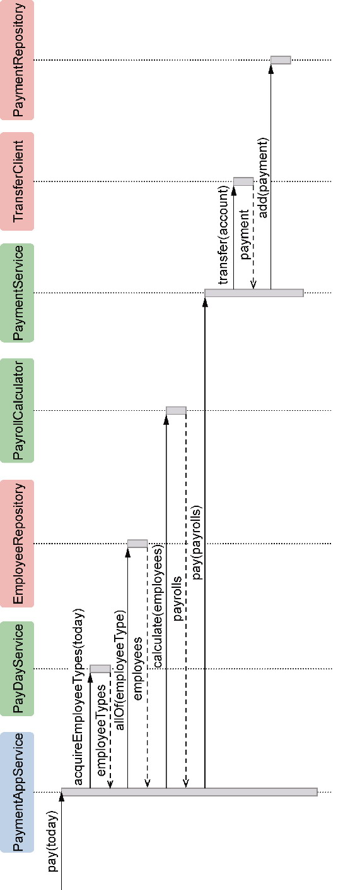

*图17-14 支付业务服务的序列图*

如果为序列图打上可视化信号标记，会发现由PaymentAppService应用服务发出的请求实在太多了，对应的请求方相继包括：

·PayDayService；

·EmployeeRepository；

·PayrollCalculator；

·PaymentService。

这说明当前设计为应用服务引入了不必要的领域逻辑，此时有必要引入一个粗粒度的领域服务，用来封装这些对象之间的协作，避免将领域逻辑泄露到应用服务。既然业务服务为支付，就可以让领域服务PaymentService来履行封装支付行为的职责，它的作用就是在应用层和领域层之间保持一条明确的界限：

```
PaymentAppService.pay(today) {
   PaymentService.pay(today) {
      PayDayService.acquireEmployeeTypes(today);
      EmployeeRepository.allOf(employeeType);
      PayrollCalculator.calculate(employees);
      PaymentService.pay(payrolls);
   }
}
```

现在再来单独处理“计算雇员薪资”组合任务。该任务的处理相对特殊，需要取舍聚合的独立性与算法的多态性。分析该组合任务，若具备面向对象的基础知识，可敏锐地觉察到“根据不同雇员类型计算雇员薪资”组合任务表达了薪资计算逻辑的抽象。设计模式中策略模式的设计意图为“定义一系列的算法，把它们一个个封装起来，并且使它们可相互替换。”^不同雇员类型的薪资计算就是不同的算法。为它们建立抽象，就可以隔离薪资计算的具体实现。看起来，这一场景非常适合运用策略模式，设计如图17-15所示。

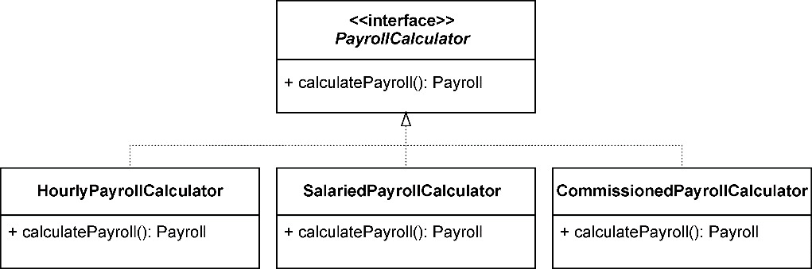

*图17-15 运用策略模式计算薪资*

PayrollCalculator继承体系仅封装了计算薪资的领域行为，薪资计算需要的数据来自对应的雇员聚合，属于该继承体系的子类都是领域服务。

这样的设计是否合理呢？让我们先来看看与之相关的领域设计模型。图17-16展示了与雇员相关的设计模型。

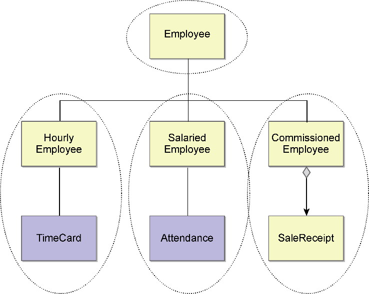

*图17-16 与雇员相关的聚合*

设计模型为每种类型的雇员都建立了一个单独的聚合，它们对应了各自的资源库。之所以要建立各自的聚合，是因为钟点工、月薪雇员和销售人员都有着自己需要维护的概念完整性。例如，钟点工需要提交工作时间卡，月薪雇员需要记录考勤记录，销售人员需要提交销售凭条。这实际上是领域驱动设计对面向对象设计带来的影响，限界上下文与聚合为自由的对象图铐上了一把枷锁。

HourlyEmployee、SalariedEmployee和CommissionedEmployee这3个聚合与Employee聚合之间并无继承关系。它们甚至属于不同的限界上下文，仅仅依靠雇员的ID保持彼此之间的隐性关联。

薪资上下文既然为雇员定义了3个不同的聚合，就意味着对应了3个不同的资源库端口。不同类型的雇员聚合定义了不同的实体和值对象，因而不能通过EmployeeRepository获取对应的雇员信息。换言之，“获取对应雇员信息任务”不应与“计算雇员薪资任务”放在一起，而应将获取雇员信息视为计算雇员薪资内部的一个执行步骤。我们需要对之前分解的任务做一些调整：

·

      支付雇员薪资

·

          确定支付日雇员类型

·

              确定支付日为钟点工雇员类型

· 确定是否为星期五

·

              确定支付日为月薪雇员类型

· 确定当月的假期信息

· 确定当月的最后一个工作日

·

              确定支付日为销售人员类型

· 获取上一次支付销售人员的日期

· 确定是否间隔了一个星期

·获取雇员信息

·

          计算雇员薪资

·

              计算钟点工薪资

· 获取钟点工雇员与工作时间卡

· 根据雇员日薪计算薪资

·

              计算月薪雇员薪资

· 获取月薪雇员与考勤记录

· 对月薪雇员计算月薪

·

              计算销售人员薪资

· 获取销售人员与销售凭条

· 根据酬金规则计算薪资

·

          支付

·向满足条件的雇员账户发起转账

·生成支付凭条

调整后的任务更加清晰地体现了薪资计算的执行逻辑，将“获取雇员信息”任务移到了“计算雇员薪资”组合任务下，使得整个任务分解的层次变得更加合理。

由此获得“计算雇员薪资”组合任务的序列图脚本：

```
PayrollCalculator.calculate(employeeTypes) {
   HourlyEmployeePayrollCalculator.calculate() {
      hourlyEmployees = HourlyEmployeeRepository.all();
      while (employee -> hourlyEmployees) {
         employee.payroll();
      }
   }
   SalariedEmployeePayrollCalculator.calculate() {
      salariedEmployees = SalariedEmployeeRepository.all();
      while (employee -> salariedEmployees) {
         employee.payroll();
      }
   }
   CommissionedEmployeePayrollCalculator.calculate() {
      commissionedEmployees = CommissionedEmployeeRepository.all();
      while (employee -> commissionedEmployees) {
         employee.payroll();
      }
   }
}
```

PayrollCalculator与具体雇员类型的薪资计算类之间的关系并非继承关系，而是将PayrollCalculator当作一个服务外观，在其内部通过雇员类型决定调用哪一个薪资计算类。这意味着序列图脚本放弃了前面所示的策略模式的运用。

之所以如此设计，是对依赖注入领域服务、资源库的考虑。如果采用了策略模式，就需要根据雇员类型决定创建什么样的PayrollCalculator。不考虑资源库的情况，可以让EmployeeType作为PayrollCalculator的工厂。然而，如前面的序列图脚本所示，不同的PayrollCalculator领域服务操作了不同的雇员聚合，意味着需要注入不同的资源库适配器，这是PayrollCalculator的工厂类无法做到的。如果将计算不同雇员薪资的领域服务看作完全不同的领域服务，就可以它们将同时注入PayrollCalculator中。在calculate(employeeTypes)方法中，根据雇员类型确定调用对应的领域服务即可：

```
public class PayrollCalculator {
    @Autowired 
    private HourlyEmployeePayrollCalculator hourlyCalculator;
    @Autowired
    private SalariedEmployeePayrollCalculator salariedCalculator;
    @Autowired
    private CommissionedEmployeePayrollCalculator commissionedCalculator;
    public List<Payroll> calculate(List<EmployeeType> employeeTypes) {
       List<Payroll> payrolls = new ArrayList<>();
       for (EmployeeType empType in employeeTypes) {
          if (empType.isHourlyEmployee()) {
             payrolls.addAll(hourlyCalculator.calculate());
          }
          if (empType.isSalariedEmployee()){
             payrolls.addAll(salariedCalculator.calculate());
          }
          if (empType.isCommissionedEmployee()){
             payrolls.addAll(commissionedCalculator.calculate());
          }
       }
       return payrolls;
    }
}
```

上述实现并未采用多态类保证代码的可扩展性，然而，参与协作的每个角色构造型履行的职责却是单一而清晰的。

注意以下3个任务：

·获取钟点工雇员与工作时间卡；

·获取月薪雇员与考勤记录；

·获取销售雇员与销售凭条。

在序列图脚本中，每个雇员聚合对应的资源库负责获取雇员及雇员的相关信息。我们没有看到诸如TimeCardRepository、AttendenceRepository和SalesReceiptRepository等资源库，更无须关心如何获得工作时间卡、考勤记录和销售凭条。这就是聚合的价值。为了保证雇员的概念完整性，聚合根的资源库在操作聚合时，会获取整个聚合边界内的所有对象。由于聚合根拥有了各自边界的实体和值对象，就可以自给自足地履行薪资计算的职责了。上述脚本中的employee.payroll()，即聚合根的领域行为。这就有效地避免了贫血模型！

#### 17.3.4 薪资管理系统的领域实现建模

获得了与支付薪资有关的领域设计模型类图和序列图脚本后，领域实现建模就可以从业务服务的验收标准开始，编写测试用例，并按照测试驱动开发的节奏建立由测试代码和产品代码组成的领域实现模型。

测试驱动开发的方向是由内至外的，可以先选择业务服务任务树内部由聚合承担的原子任务，例如选择原子任务“根据雇员日薪计算薪资”。参考业务服务规约的验收标准，为其识别如下测试用例：

·计算正常工作时长的钟点工薪资；

·计算加班工作时长的钟点工薪资；

·计算没有工作时间卡的钟点工薪资。

**1.编写测试**

目前还未实现这些测试用例。选择“计算正常工作时长的钟点工薪资”测试用例作为新加功能，为它编写一个刚好失败的测试。由于当前任务是一个原子任务，且HourlyEmployee聚合拥有计算薪资的信息，履行当前任务对应职责的角色构造型就是HourlyEmployee聚合。根据单元测试的命名规范，创建HourlyEmployeeTest测试类，编写测试：

```
public class HourlyEmployeeTest {
   @Test
   public void should_calculate_payroll_by_work_hours_in_a_week() {
   }
}
```

测试方法遵循Given-When-Then模式。考虑HourlyEmployee聚合的创建。由于钟点工每天都要提交工作时间卡，且其薪资按周结算，在创建HourlyEmployee聚合根实例时，需要传入工作时间卡的列表。当前测试用例只考虑正常工作时长，准备的工作时间卡皆为每天8小时。计算薪资的方法为payroll()，返回结果为薪资模型对象Payroll。验证时，需确保薪资的结算周期与薪资总额是正确的，故而编写的测试方法为：

```
public class HourlyEmployeeTest {
   @Test
   public void should_calculate_payroll_by_work_hours_in_a_week() {
      //given
      TimeCard timeCard1 = new TimeCard(LocalDate.of(2019, 9, 2), 8);
      TimeCard timeCard2 = new TimeCard(LocalDate.of(2019, 9, 3), 8);
      TimeCard timeCard3 = new TimeCard(LocalDate.of(2019, 9, 4), 8);
      TimeCard timeCard4 = new TimeCard(LocalDate.of(2019, 9, 5), 8);
      TimeCard timeCard5 = new TimeCard(LocalDate.of(2019, 9, 6), 8);
      List<TimeCard> timeCards = new ArrayList<>();
      timeCards.add(timeCard1);
      timeCards.add(timeCard2);
      timeCards.add(timeCard3);
      timeCards.add(timeCard4);
      timeCards.add(timeCard5);
      HourlyEmployee hourlyEmployee = new HourlyEmployee(timeCards, Money.of(10000, 
Currency.RMB));
      //when
      Payroll payroll = hourlyEmployee.payroll();
      //then
      assertThat(payroll).isNotNull();
      assertThat(payroll.beginDate()).isEqualTo(LocalDate.of(2019, 9, 2));
      assertThat(payroll.endDate()).isEqualTo(LocalDate.of(2019, 9, 6));
      assertThat(payroll.amount()).isEqualTo(Money.of(400000, Currency.RMB));
   }
}
```

测试方法名清晰地描述了“计算正常工作时长的钟点工薪资”测试用例这个新加功能，验证时，也只考虑正常工作时长的计算规则。让测试通过编译之后，运行测试，失败，如图17-17所示。

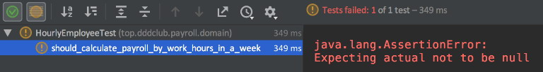

*图17-17 运行当前测试失败的结果*

**2.快速实现**

实现payroll()方法时，应仅提供满足当前测试用例预期的快速实现。以当前测试方法为例，要计算钟点工的薪资，除了需要它提供的工作时间卡，还需要钟点工的时薪，至于HourlyEmployee的其他属性，暂时可不用考虑。当前测试方法没有要求验证工作时间卡的有效性，在实现时，亦不必验证传入的工作时间卡是否符合要求，只需确保为测试方法准备的数据是正确的即可。既然当前测试方法只针对正常工作时长计算薪资，就无须考虑加班的情况。实现代码为：

```
public class HourlyEmployee {
   private List<TimeCard> timeCards;
   private Money salaryOfHour;
   public HourlyEmployee(List<TimeCard> timeCards, Money salaryOfHour) {
      this.timeCards = timeCards;
      this.salaryOfHour = salaryOfHour;
   }
   public Payroll payroll() {
      int totalHours = timeCards.stream()
            .map(tc -> tc.workHours())
            .reduce(0, (hours, total) -> hours + total);
      Collections.sort(timeCards);
      return new Payroll(timeCards.get(0).workDay(), timeCards.get(timeCards.size() –
1).workDay(), salaryOfHour.multiply(totalHours));
   }
}
```

快速实现的目的是避免过度设计。如果能一开始做出恰如其分的设计，也是可行的。例如，在上述实现代码中，需要将工作总小时数乘以Money类型的时薪，你当然可以实现为如下代码：

```
new Money(salaryOfHour.value() * totalHours, salaryOfHour.currency())
```

如果你已经熟悉迪米特法则（参见附录A），认识到以数据提供者形式进行对象协作的弊病，就会自然地想到应该在Money中定义multiply()方法，而非通过公开value和currency的get访问器让调用者完成乘法计算。我们直截了当实现如下代码，不必等着后面进行重构：

```
public class Money {
   private final long value;
   private final Currency currency;
   public static Money of(long value, Currency currency) {
      return new Money(value, currency);
   }
   private Money(long value, Currency currency) {
      this.value = value;
      this.currency = currency;
   }
   public Money multiply(int factor) {
      return new Money(value * factor, currency);
   }
   @Override
   public boolean equals(Object o) {
      if (this == o) return true;
      if (o == null || getClass() != o.getClass()) return false;
      Money money = (Money) o;
      return value == money.value &&
            currency == money.currency;
   }
   @Override
   public int hashCode() {
      return Objects.hash(value, currency);
   }
}
```

实现Money时，还重载了equals()和hashcode()方法，这是遵循领域驱动设计值对象的要求提供的，不能算作过度设计。

为了通过测试方法，我们定义并实现了HourlyEmployee、TimeCard和Payroll等领域模型对象。它们的定义都非常简单，即使你知道HourlyEmployee一定还有Id和name等基本的核心字段，也不必在现在就给出这些字段的定义。利用测试驱动开发来实现领域模型，重要的一点就是用测试驱动出这些模型对象的定义。只要不遗漏业务服务和测试用例，就一定会有测试去覆盖这些领域逻辑。一次只做好一件事情即可。

现在测试通过了，其结果如图17-18所示。

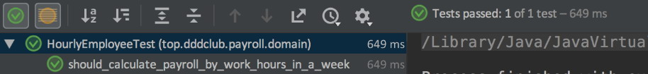

*图17-18 测试通过的结果*

此时，先不要考虑重构或编写新的测试，而应提交代码。持续集成提倡团队成员进行频繁的原子提交，保证尽快将你的最新变更反馈到团队共享的代码库上，降低代码冲突的风险，同时也能为重构设定一个安全的回滚版本。

**3.代码重构**

在新加功能之前，我们尝试发现产品代码与测试代码的坏味道。阅读代码，发现方法中的代码Collections.sort(timeCards)让人产生困惑：为什么需要对工作时间卡排序？显然，这行代码缺乏对业务逻辑的封装，直接将实现暴露出来了。排序是一种手段，目标是获得结算薪资的开始日期和结束日期。由于需要获得两个值，且这两个值代表了一个内聚的概念，故而可以定义一个内部概念Period。重构过程提取beginDate和endDate变量，定义Period内部类：

```
public Payroll payroll() {
   int totalHours = timeCards.stream()
          .map(tc -> tc.workHours())
          .reduce(0, (hours, total) -> hours + total);
   Collections.sort(timeCards);
   LocalDate beginDate = timeCards.get(0).workDay();
   LocalDate endDate = timeCards.get(timeCards.size() - 1).workDay();
   Period settlementPeriod = new Period(beginDate, endDate);
   return new Payroll(settlementPeriod.beginDate, settlementPeriod.endDate,
                      salaryOfHour.multiply(totalHours));
}
private class Period {
   private LocalDate beginDate;
   private LocalDate endDate;
   Period(LocalDate beginDate, LocalDate endDate) {
      this.beginDate = beginDate;
      this.endDate = endDate;
   }
}
```

接下来，提取方法settlementPeriod()。该方法名直接体现获得结算周期的业务目标，并将包括排序在内的实现细节封装起来：

```
public Payroll payroll() {
   int totalHours = timeCards.stream()
          .map(tc -> tc.workHours())
          .reduce(0, (hours, total) -> hours + total);
   return new Payroll(
          settlementPeriod().beginDate,
          settlementPeriod().endDate,
          salaryOfHour.multiply(totalHours));
}
private Period settlementPeriod() {
   Collections.sort(timeCards);
   LocalDate beginDate = timeCards.get(0).workDay();
   LocalDate endDate = timeCards.get(timeCards.size() - 1).workDay();
   return new Period(beginDate, endDate);
}
```

测试代码同样需要重构。测试代码中对List<TimeCard&gt;的创建无疑干扰了测试方法的主干逻辑，可以考虑将其封装为一个方法，测试的Given部分就会变得更干净：

```
public class HourlyEmployeeTest {
   @Test
   public void should_calculate_payroll_by_work_hours_in_a_week() {
      //given
      List timeCards = createTimeCards();
      Money salaryOfHour = Money.of(10000, Currency.RMB);
      HourlyEmployee hourlyEmployee = new HourlyEmployee(timeCards, salaryOfHour);
      //when
      Payroll payroll = hourlyEmployee.payroll();
      //then
      assertThat(payroll).isNotNull();
      assertThat(payroll.beginDate()).isEqualTo(LocalDate.of(2019, 9, 2));
      assertThat(payroll.endDate()).isEqualTo(LocalDate.of(2019, 9, 6));
      assertThat(payroll.amount()).isEqualTo(Money.of(400000, Currency.RMB));
   }
   private List createTimeCards() {
      TimeCard timeCard1 = new TimeCard(LocalDate.of(2019, 9, 2), 8);
      TimeCard timeCard2 = new TimeCard(LocalDate.of(2019, 9, 3), 8);
      TimeCard timeCard3 = new TimeCard(LocalDate.of(2019, 9, 4), 8);
      TimeCard timeCard4 = new TimeCard(LocalDate.of(2019, 9, 5), 8);
      TimeCard timeCard5 = new TimeCard(LocalDate.of(2019, 9, 6), 8);
      List timeCards = new ArrayList<>();
      timeCards.add(timeCard1);
      timeCards.add(timeCard2);
      timeCards.add(timeCard3);
      timeCards.add(timeCard4);
      timeCards.add(timeCard5);
      return timeCards;
   }
}
```

重构需要小步前行，每次完成一步重构，都要运行测试，避免因为重构破坏现有的功能。

**4.简单设计**

遵循简单设计原则，可以防止我们做出过度设计。例如，实现“计算正常工作时长的钟点工薪资”测试用例时，通过重构提高了代码可读性之后，就可以暂时停止重构，开启编写新测试的旅程。遵循测试驱动开发三定律，我们为“计算加班工作时长的钟点工薪资”测试用例编写测试，实现产品代码。由于需提供超过8小时的工作时间卡，而原有方法采用了固定的8小时正常工作时间，为了测试代码的复用，可提取createTimeCards()方法的参数，允许向其传入不同的工作时长。新编写的测试如下所示：

```
@Test
public void should_calculate_payroll_by_work_hours_with_overtime_in_a_week() {
   //given
   List timeCards = createTimeCards(9, 7, 10, 10, 8);
   Money salaryOfHour = Money.of(10000, Currency.RMB);
   HourlyEmployee hourlyEmployee = new HourlyEmployee(timeCards, salaryOfHour);
   //when
   Payroll payroll = hourlyEmployee.payroll();
   //then
   assertThat(payroll).isNotNull();
   assertThat(payroll.beginDate()).isEqualTo(LocalDate.of(2019, 9, 2));
   assertThat(payroll.endDate()).isEqualTo(LocalDate.of(2019, 9, 6));
   assertThat(payroll.amount()).isEqualTo(Money.of(465000, Currency.RMB));
}
```

提供的工作时间卡包含了加班、正常工作时间和低于正常工作时间3种情况，综合计算钟点工的薪资。

按照业务规则，加班时间的报酬会按照正常报酬的1.5倍进行支付，这就需要支持Money与1.5之间的乘法。在最初定义的Money类中，使用long类型来代表面值，并以分作为货币单位，原本的multiply()方法支持的因数为int类型，不满足现有需求。为保证薪资的精确计算，应修改Money类的定义，改为使用BigDecimal类型。新的测试对原有产品代码提出了新的要求，需要暂时搁置对新测试的实现，对已有产品代码按照新的需求进行调整，修改Money类的定义，并在修改后运行已有的所有测试，确保这一修改并未破坏原有测试。接下来，实现刚才编写的新测试：

```
public Payroll payroll() {
   int regularHours = timeCards.stream()
          .map(tc -> tc.workHours() > 8 ? 8 : tc.workHours())
          .reduce(0, (hours, total) -> hours + total);
   int overtimeHours = timeCards.stream()
          .filter(tc -> tc.workHours() > 8)
          .map(tc -> tc.workHours() - 8)
          .reduce(0, (hours, total) -> hours + total);
   Money regularSalary = salaryOfHour.multiply(regularHours);
   // 修改了multiply()方法的定义，支持double类型
   Money overtimeSalary = salaryOfHour.multiply(1.5).multiply(overtimeHours);
   Money totalSalary = regularSalary.add(overtimeSalary);
   return new Payroll(
          settlementPeriod().beginDate,
          settlementPeriod().endDate,
          totalSalary);
}
```

按照简单设计原则尝试消除重复，提高代码可读性。首先，可以提取8和1.5这样的常量，对代码作微量调整。阅读实现代码对filter与map函数的调用，发现函数接收的Lambda表达式操作的数据皆为TimeCard类所拥有。遵循“信息专家模式”，做到让对象之间通过行为进行协作，避免协作对象成为数据提供者，需将表达式提取为方法，然后将它们转移到TimeCard类：

```
public class TimeCard implements Comparable {
   private static final int MAXIMUM_REGULAR_HOURS = 8;
   private LocalDate workDay;
   private int workHours;
   public TimeCard(LocalDate workDay, int workHours) {
      this.workDay = workDay;
      this.workHours = workHours;
   }
   public int workHours() {
      return this.workHours;
   }
   public LocalDate workDay() {
      return this.workDay;
   }
   public boolean isOvertime() {
      return workHours() > MAXIMUM_REGULAR_HOURS;
   }
   public int getOvertimeWorkHours() {
      return workHours() - MAXIMUM_REGULAR_HOURS;
   }
   public int getRegularWorkHours() {
      return isOvertime() ? MAXIMUM_REGULAR_HOURS : workHours();
   }
}
```

这一重构说明，只要时刻注意对象之间正确的协作模式，就能在一定程度避免贫血模型。不用刻意追求为领域对象分配领域行为，通过识别代码坏味道，遵循面向对象设计原则就能逐步改进代码。重构后的payroll()方法实现为：

```
public Payroll payroll() {
   int regularHours = timeCards.stream()
          .map(TimeCard::getRegularWorkHours)
          .reduce(0, (hours, total) -> hours + total);
   int overtimeHours = timeCards.stream()
          .filter(TimeCard::isOvertime)
          .map(TimeCard::getOvertimeWorkHours)
          .reduce(0, (hours, total) -> hours + total);
   Money regularSalary = salaryOfHour.multiply(regularHours);
   Money overtimeSalary = salaryOfHour.multiply(OVERTIME_FACTOR).multiply(overtimeHours);
   Money totalSalary = regularSalary.add(overtimeSalary);
   return new Payroll(
          settlementPeriod().beginDate,
          settlementPeriod().endDate,
          totalSalary);
}
```

目前的方法暴露了太多细节，缺乏足够的层次，无法清晰表达方法的执行步骤：先计算正常工作小时数的薪资，再计算加班小时数的薪资，即可得到该钟点工最终要发放的薪资。仍然祭出重构手法，一个简单的提取方法就能达到目的。提取出来的方法既隐藏了细节，又使得主方法清晰地体现了业务步骤：

```
public Payroll payroll() {
   Money regularSalary = calculateRegularSalary();
   Money overtimeSalary = calculateOvertimeSalary();
   Money totalSalary = regularSalary.add(overtimeSalary);
   return new Payroll(
         settlementPeriod().beginDate,
         settlementPeriod().endDate,
         totalSalary);
}
```

提取方法非常有效。通过确定一个方法的高层目标，就可以识别和提取出无关的子问题域，让方法的职责变得更加单一、代码的层次更加清晰。方法在代码层次是一种非常有效的封装机制，可以让细节不再直接暴露。只要提取出来的方法拥有一个“不言自明”的好名称，代码就能变得更加可读。

接着编写第三个测试用例：计算没有工作时间卡的钟点工薪资。

在考虑该测试用例的测试方法编写时，发现一个问题：如何获得薪资的结算周期？之前的实现通过提交的工作时间卡来获得结算周期，如果钟点工根本没有提交工作时间卡，意味着该钟点工的薪资为0，但并不等于没有薪资结算周期。事实上，如果提交的工作时间卡存在缺失，也会导致获取薪资结算周期出错。以此而论，即可发现确定薪资结算周期的职责不应该由HourlyEmployee聚合承担，它也不具备该知识。然而，payroll()方法返回的Payroll对象又需要结算周期，该对象属于第15章提到的聚合的未知数据，应由外部传入，以此来保证聚合的自给自足，无须访问任何外部资源。因此，在编写新测试之前，还需要先修改已有代码：

```
public Payroll payroll(Period settlementPeriod) {
   Money regularSalary = calculateRegularSalary();
   Money overtimeSalary = calculateOvertimeSalary();
   Money totalSalary = regularSalary.add(overtimeSalary);
   return new Payroll(
          settlementPeriod.beginDate(),
          settlementPeriod.endDate(),
          totalSalary);
}
```

这时，之前重构的settlementPeriod()方法就没有存在的必要，就该果断删除，保证代码的简单。

我们看到，这里对settlementPeriod()方法的重构帮助我们找到了Period类。它代表了“结算周期”这一领域概念。为了保证领域模型的一致性，通过领域实现建模发现的领域概念需要即刻同步到之前获得的领域模型中。
