## 第18章 领域驱动设计的战略考量

> 在战略上，最漫长的迂回道路，常常是达到目的的最短途径。

> ——利德尔·哈特，《间接路线战略》

领域驱动统一过程的架构映射阶段对应解空间的战略设计，领域建模阶段对应解空间的战术设计。二者位于不同的设计层次，彼此之间又相互影响。在考虑战略设计与战术设计的融合时，有必要梳理对战术设计产生深远影响的战略设计问题。我将其称为领域驱动设计的战略考量。

### 18.1 限界上下文与微服务

限界上下文对整个目标系统进行了纵向的业务能力切分，在限界上下文内部构成了自己的架构体系，是为菱形对称架构。虽然我强调了限界上下文的自治性，但并未就限界上下文的边界本质加以详细说明，认为只要遵循限界上下文的设计要求，单体架构与微服务架构的逻辑架构是保持一致的。到了具体的技术实现，需要确定限界上下文的物理边界，因为它会直接影响架构的设计与实现。限界上下文的物理边界，实际指的是通信边界，以进程为单位分为进程内与进程间两种。

#### 18.1.1 进程内的通信边界

若限界上下文之间为进程内的通信方式，意味着它们的代码模型运行在同一个进程中，通过对象实例化的方式即可调用另一个限界上下文内部的对象。限界上下文的代码模型存在两种级别的设计方式。以Java为例，归纳如下。

·命名空间级别：通过命名空间进行界定，所有的限界上下文位于同一个工程模块(module)，编译后生成一个JAR包。

·工程模块级别：在命名空间上是逻辑分离的，不同限界上下文属于同一个项目的不同模块，编译后生成各自的JAR包。

两种级别的代码模型仅仅存在编译期的差异，后者的解耦更加彻底，可以更好地应对变化对限界上下文的影响。例如，当限界上下文A的业务场景发生变更时，我们可以只修改和重编译限界上下文A对应的JAR包，其余JAR包并不受到影响。到了运行期，这两种方式就没有任何区别了，因为它们都运行在同一个Java虚拟机(Java Virtual Machine，JVM)中，当变化发生时，整个系统都需要重新启动和运行。

如果所有限界上下文都运行在一个进程，当前架构就属于单体架构(monolithic architecture)。单体架构不一定是大泥球，也未必是糟糕设计的代名词，只要遵循限界上下文的边界（如严格遵循菱形对称架构）来定义代码模型，就能确保清晰的代码结构。由于限界上下文之间采用进程内通信，跨限界上下文之间的协作可通过下游的客户端端口直接调用上游的应用服务，无须跨进程通信，使得协作变得更加容易，也更加高效。

我们必须警惕复用带来的耦合。编写代码时，需要谨守限界上下文的边界，时刻注意不要越界，并确定限界上下文各自对外公开的接口，避免它们之间产生过多的依赖。限界上下文之间的复用是业务能力的复用，体现为设计，就是对北向网关远程服务或应用服务的复用。一旦需要将限界上下文调整为进程间的通信边界，这种重视边界控制的设计与实现能够更好地适应这种演进。

譬如在项目管理系统中，项目上下文与通知上下文之间的通信为进程内通信，当项目负责人将Sprint Backlog成功分配给团队成员之后，系统发送邮件通知该团队成员。分配职责由项目上下文的SprintBacklogService领域服务承担，发送通知的职责由通知上下文的NotificationAppService应用服务承担。考虑到未来限界上下文通信边界的变化，我们就不能在SprintBacklogService服务中直接实例化NotificationAppService对象，而是在项目上下文中定义南向网关的客户端端口NotificationClient，并由NotificationClientAdapter实现。SprintBacklogService服务依赖客户端端口，然后依赖注入适配器实现。协作过程如图18-1所示。

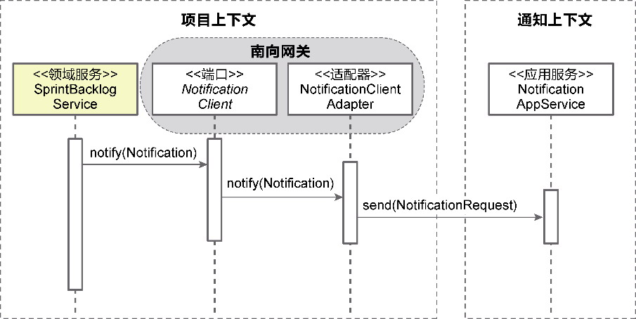

*图18-1 项目上下文与通知上下文的进程内通信*

一旦在未来需要将通知上下文演进为进程间的通信边界，该变动只会影响项目上下文的南向网关适配器，不影响其余内容。

在限界上下文边界控制下的单体架构具有清晰的结构，各个限界上下文也遵循了自治原则。它面临的主要问题是无法对指定的限界上下文进行水平伸缩，也无法对指定限界上下文进行独立替换与升级。

#### 18.1.2 进程间的通信边界

如果限界上下文的边界就是进程的边界，限界上下文之间的协作就必须采用分布式的通信方式。在物理上，限界上下文的代码模型与数据库是完全分开的，考虑协作时，因为数据库共享方式的不同，产生两种不同的风格：

·数据库共享架构；

·零共享架构。

**1.数据库共享架构**

数据库共享架构是一种折中的手段。划分限界上下文时，可能出现一种状况：代码的运行是进程分离的，数据库却共享彼此的数据，即多个限界上下文共享同一个数据库。共享数据库可以更加便利地保证数据的一致性，这或许是该方案最有说服力的证据，但也可以视为对一致性约束的妥协。

不管在物理上是否共享数据库，限界上下文之间的逻辑边界仍然需要守护，不能让一个限界上下文越界访问另一个限界上下文的数据库。在针对某手机品牌开发的舆情分析系统中，危机查询服务提供对识别出来的危机进行查询。查询时，需要通过userId获得危机处理人、危机汇报人的详细信息。图18-2所示的设计就破坏了危机分析上下文的逻辑边界，绕开了用户上下文，直接访问了用户数据表。

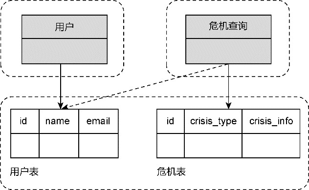

*图18-2 危机上下文直接访问用户数据表*

要注意，即便用户数据表和危机数据表位于同一个数据库，按照限界上下文的要求，它们之间其实也存在一条无形的边界，需要遵循跨限界上下文调用的“纪律”，即形成对业务能力的复用，如图18-3所示。

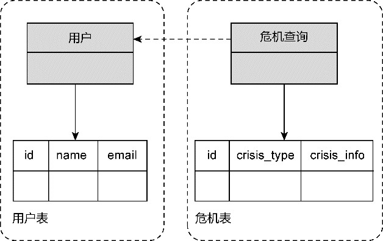

*图18-3 舆情分析系统的两种设计*

考虑到未来可能的演进，无论是单体架构，还是微服务的数据库共享风格，都需要一开始就注意避免在分属两个限界上下文的表之间建立外键约束关系。某些关系型数据库可能通过这种约束关系提供级联更新与删除的功能，这种功能反过来会影响代码的实现。一旦因为分库而去掉表之间的外键约束关系，需要修改的代码太多，就会导致演进的成本太高，甚至可能因为某种疏漏带来隐藏的bug。

数据库共享架构可能传递“反模式”的信号。当两个分处不同限界上下文的服务需要操作同一张数据表（这张表被称为“共享表”）时，意味着设计可能出现了错误。

·遗漏了一个限界上下文，共享表对应的是一个被复用的服务：买家在查询商品时，商品服务会查询价格表中的当前价格，而在提交订单时，订单服务也会查询价格表中的价格，计算当前的订单总额。共享价格数据的原因是我们遗漏了价格上下文，引入价格服务就可以解除这种不必要的数据共享。

·职责分配出现了问题，操作共享表的职责应该分配给已有的服务：舆情服务与危机服务都需要从邮件模板表中获取模板数据，然后调用邮件服务组合模板的内容发送邮件。实际上，从邮件模板表获取模板数据的职责应该分配给已有的邮件服务。

·共享表对应两个限界上下文的不同概念：仓储上下文与订单上下文都需要访问共享的产品表，但实际上这两个限界上下文需要的产品信息并不相同，应该按照领域模型的知识语境分开为各自关心的产品建立数据表。

为什么会出现这3种错误的设计？一个可能的原因在于我们没有遵循领域建模的要求，而直接对数据库进行了设计，代码没有体现正确的领域模型，导致了数据库的耦合或共享。

**2.零共享架构**

如果限界上下文之间没有共享任何外部资源，整个架构就成为零共享架构。如前面介绍的舆情分析系统，在去掉危机查询对用户表的依赖后，同时将用户数据与危机数据分库存储，就演进为零共享架构。如图18-4所示，危机分析上下文的危机数据存储在Elasticsearch中，用户上下文的用户数据存储在MySQL中，实现了资源的完全分离。

这是一种限界上下文彻底独立的架构风格，保证了边界内的服务、基础设施乃至于存储资源、中间件等其他外部资源的独立性，形成自治的微服务，体现了微服务架构的特征：每个限界上下文都有自己的代码库、数据存储和开发团队，每个限界上下文选择的技术栈和语言平台也可以不同，限界上下文之间仅仅通过限定的通信协议进行通信。

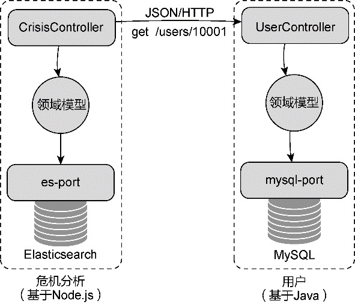

*图18-4 舆情分析系统的零共享架构*

独立运行的限界上下文实现了真正的自治，不仅每个限界上下文的内部代码能够做到独立演化，在技术选型上也可以结合自身的业务场景做出“恰如其分”的选择。譬如，危机分析上下文需要存储大规模的非结构化数据，业务上需要支持对危机数据的高性能全文本搜索，故而选择了Elasticsearch作为持久化的数据库。考虑到开发的高效以及对JSON数据的支持，团队选择了Node.js作为后端开发框架。对于用户上下文，数据量小，结构规范，采用MySQL关系数据库的架构会更简单，并使用Java作为后台开发语言。二者之间唯一的耦合就是危机分析通过HTTP访问上游的用户服务，根据传入的userId获得用户的详细信息。

彻底分离的限界上下文变得小而专，使得我们可以很好地安排遵循2PTs规则的领域特性团队去治理它。然而，这种架构的复杂度也不可低估。限界上下文之间采用进程间通信，必然影响通信的效率与可靠性。数据库是完全分离的，一旦一个服务需要关联跨库之间的数据，就需要跨限界上下文去访问，无法享受数据库自身提供的关联福利。每个限界上下文都是分布式的，如何保证数据的一致性也是一件棘手的问题。当整个系统都被分解成一个个可以独立部署的限界上下文时，运维与监控的复杂度也随之而剧增。

#### 18.1.3 限界上下文与微服务的关系

在架构映射阶段，我并未明确限界上下文的物理边界究竟是在进程内，还是在进程间。物理边界的确认并非业务角度的考虑，更多是从质量属性的角度依据分布式通信的优劣势而定。虽说在设计微服务架构时，领域驱动设计的限界上下文可以帮助团队更好地明确微服务的边界，但这却不能说明它们之间一定存在一对一的映射关系。

在确定限界上下文与微服务之间的关系时，需要考虑团队与代码的边界对它们的影响，包括团队边界和代码模型边界。

·团队边界：遵循康威定律，需要控制交流成本，不能出现一个限界上下文由两个或多个团队共同承担的情况。微服务也当如此。如果不同微服务选择了不同的技术栈，团队的边界更需要与微服务对应。如此看来，微服务的粒度要细于或等于限界上下文的粒度，然而技术栈对微服务边界的影响，也可认为是技术维度对限界上下文边界的影响。由于技术栈选择，根据业务能力切分的限界上下文，可进一步切分其边界，此时，微服务的边界等同于限界上下文的边界。

·代码模型边界：一个微服务的代码模型不能分别部署在两个不同的进程，如果分别部署了，则应被视为不同的微服务，限界上下文却未必如此。倘若一个限界上下文采用了CQRS模式，针对相同的业务，查询模型与命令模型可以部署到不同的进程，可以认为是不同的微服务，但它们在逻辑上仍然属于同一个限界上下文。如此看来，微服务的粒度要细于或等于限界上下文的粒度。

不管是否采用了限界上下文帮助团队识别微服务，对边界的确定总是无法做到一劳永逸。作为微服务的布道者之一，Martin Fowler就认为设计者无法一开始就确定稳定的微服务边界。一旦系统被设计为微服务，而微服务的边界又不合理，对它的重构难度就要远远大于单体架构。Fowler建议应该单体架构优先，通过该架构风格逐步探索系统的复杂度，确定限界上下文构成组件的边界，待系统复杂度增加，证明了微服务的必要性时，再考虑将这些限界上下文设计为独立的微服务。

一种审慎的做法是在无法明确微服务边界的合理性时，考虑将微服务的粒度设计得更粗一些，而在服务内部，通过限界上下文的边界对代码模型进行控制。微服务内部存在的多个限界上下文自然采用进程内通信，如此可降低微服务的管理成本，也避免了不必要的分布式通信成本。与数据库共享风格相似，这可以算是一种折中的服务设计模式。整个软件系统仍然由多个微服务组成，但每个微服务的粒度并不均衡，内部的限界上下文边界却又保留了继续拆分的可能性，增强了架构的演进能力。这可认为是混合了单体架构与微服务架构的混合架构风格，如图18-5所示。

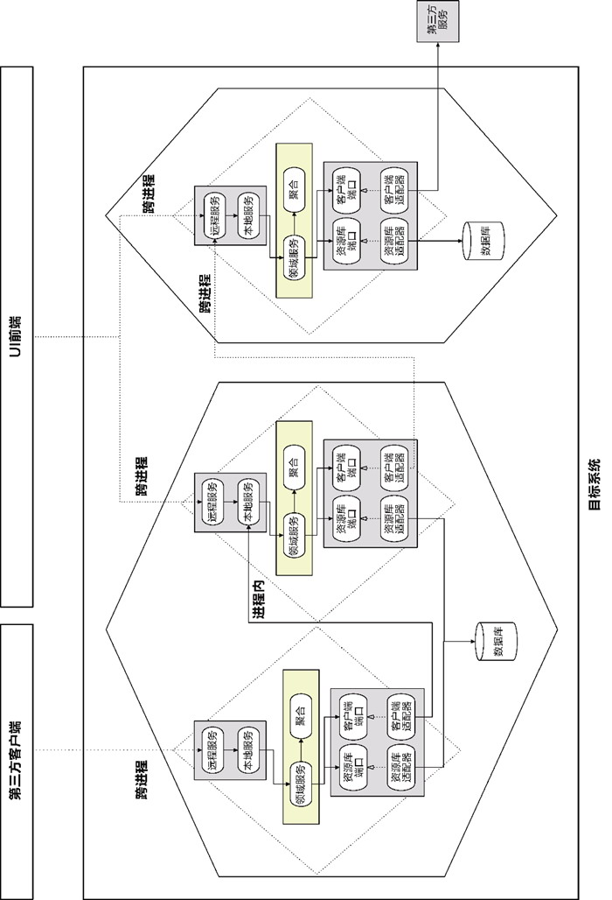

*图18-5 混合架构风格*

图18-5所示的架构充分体现了菱形对称架构北向网关的价值。它的远程服务与应用服务分别适应不同的业务场景，松耦合的结构使得整个架构能够较好地响应变化，遵循了演进式设计的要求。在这样一种糅合单体架构与微服务架构的混合架构风格中，微服务的粒度又粗于限界上下文的粒度了。因此，我们很难为限界上下文和微服务确定一个稳定的映射关系，这正是软件设计棘手之处，却也是它的魅力所在。

### 18.2 限界上下文之间的分布式通信

当一个软件系统发展为微服务架构风格的分布式系统时，限界上下文之间的协作将采用进程间的分布式通信方式。菱形对称架构通过网关层减少了通信方式的变化对协作机制带来的影响。然而，若全然无视这种变化，就无疑是掩耳盗铃了。

无论采用何种编程模式与框架来封装分布式通信，都只能做到让进程间的通信方式尽量透明，却不可抹去分布式通信固有的不可靠性、传输延迟性等诸多问题，选择的输入/输出(Input/Output，I/O)模型也会影响到计算机资源特别是CPU、进程和线程资源的使用，从而影响服务端的响应能力。分布式通信传输的数据也有别于进程内通信。选择不同的序列化框架、不同的通信机制，对远程服务接口的定义也提出了不同的要求。

#### 18.2.1 分布式通信的设计因素

一旦决定采用分布式通信，就需要考虑如下3个因素。

·通信协议：用于数据或对象的传输。

·数据协议：为满足不同节点之间的统一通信，需确定统一的数据协议。

·接口定义：接口要满足一致性与稳定性，它的定义受到通信框架的影响。

**1.通信协议**

为保障分布式通信的可靠性，网络通信的传输层需要采用TCP，以可靠地把数据在不同的地址空间上搬运。在传输层之上的应用层，往往选择HTTP，如REST架构风格的框架，或者采用二进制协议的HTTP/2，如Google的RPC框架gRPC。

可靠传输还要建立在网络传输的低延迟基础上。如果服务端无法在更短时间内处理完请求，或者处理并发请求的能力较弱，服务器资源就会被阻塞，影响数据的传输。数据传输的能力取决于操作系统的I/O模型，分布式节点之间的数据传输本质就是两个操作系统之间通过socket实现的数据输入与输出。传统的I/O模式属于阻塞I/O，与线程池的线程模型相结合。由于一个系统内部可使用的线程数量是有限的，一旦线程池没有可用线程资源，当工作线程都阻塞在I/O上时，服务器响应客户端通信请求的能力就会下降，导致通信的阻塞。因此，分布式通信一般会采用I/O多路复用或异步I/O，如Netty就采用了I/O多路复用的模型。

**2.数据协议**

客户端与服务端的通信受到进程的限制，必须对通信的数据进行序列化和反序列化，实现对象与数据的转换。这就要求跨越进程传递的消息契约对象必须能够支持序列化。选择序列化框架需要关注以下内容。

·编码格式：采用二进制还是字符串等可读的编码。

·契约声明：基于接口定义语言(Interface Definition Language，IDL)如Protocol Buffers/Thrift，还是自描述如JSON、XML。

·语言平台的中立性：如Java的Native Serialization只能用于JVM平台，Protocol Buffers可以跨各种语言和平台。

·契约的兼容性：契约增加一个字段，旧版本的契约是否还可以反序列化成功。

·与压缩算法的契合度：为了提高性能或支持大量数据的跨进程传输，需要结合各种压缩算法，例如 gzip、snappy。

·性能：序列化和反序列化的时间，序列化后数据的字节大小，都会影响到序列化的性能。

常见的序列化协议包括Protocol Buffers、Avro、Thrift、XML、JSON、Kyro、Hessian等。序列化协议需要与不同的通信框架结合，例如REST框架选择的序列化协议通常为文本型的XML或JSON，使用HTTP/2协议的gRPC自然与Protocol Buffers结合。Dubbo可以选择多种组合形式，例如HTTP+JSON序列化、Netty+Dubbo序列化、Netty+Hession2序列化等。如果选择异步RPC的消息传递方式，只需发布者与订阅者遵循相同的序列化协议即可。若业务存在特殊性，甚至可以定义自己的事件消息协议规范。

**3.接口定义**

采用不同的分布式通信机制，对接口定义的要求也不相同，例如基于XML的Web Service与REST风格服务就采用了不同的接口定义。RPC框架对接口的约束要少一些，它是一种远程过程调用(Remote Procedure Call)协议，目的是封装底层的通信细节，使得开发人员能够以近乎本地通信的编程模式来实现分布式通信。从本质上讲，REST风格服务实则也是一种RPC，只是REST架构风格对REST风格服务的接口定义给出了设计约束。至于消息传递机制要求的接口，由于它引入消息队列（或消息代理）解除了发布者与订阅者之间的耦合，因此二者之间的接口是通过事件消息来定义的。

虽然不同的分布式通信机制对接口定义的要求不同，但设计原则却是相同的，即在保证服务的质量属性基础上，尽量解除客户端与服务端之间的耦合，同时保证接口版本升级的兼容性。

#### 18.2.2 分布式通信机制

虽然有多种不同的分布式通信机制，但在微服务架构风格下，主要采用的分布式通信机制包括：

·REST；

·RPC；

·消息传递。

它们也正好对应服务契约设计中定义的服务资源契约、服务行为契约和服务事件契约。我选择了Java社区最常用的Spring Boot+Spring Cloud、Dubbo和Kafka作为这3种通信机制的代表，分别讨论它们对领域驱动设计带来的影响。

**1.REST**

遵循REST架构风格的服务即REST风格服务，通常采用HTTP+JSON序列化实现数据的进程间传输。服务的接口往往是无状态的，要求通过统一的接口来对资源执行各种操作。正因如此，远程服务的接口定义实则可以分为两个层面。其一是远程服务类的方法定义，除了方法的参数与返回值必须支持序列化，REST框架对方法的定义几乎没有任何限制。其二是REST风格服务的接口定义，在Spring Boot中就是使用@RequestMapping注解指定URI以及HTTP动词。

客户端在调用REST风格服务时，需要指定URI、HTTP动词以及请求/响应消息。通过请求直接传递的参数映射为@RequestParam，通过URI模板传递的参数映射为@PathVariable。遵循REST风格服务定义规范，一般建议参数通过URI模板传递，例如orderld参数：

```
GET /orders/{orderId}
```

对应的REST风格服务定义为：

```
package com.dddexplained.ecommerce.ordercontext.northbound.remote.resource;
​
@RestController
@RequestMapping(value="/orders")
public class OrderResource {
   @RequestMapping(value="/{orderId}", method=RequestMethod.GET)
   public OrderResponse orderOf(@PathVariable String orderId) {   }
}
```

采用以上方式定义服务接口时，参数往往定义为语言基本类型的集合。若要传递自定义的请求对象，就要使用@RequestBody注解，HTTP动词需要使用POST、PUT或DELETE。

通过REST风格服务传递的消息契约对象需要支持序列化。实现时，取决于服务设置的Content-Type类型确定为哪一种序列化协议。多数REST风格服务会选择简单的JSON协议。

下游限界上下文若要调用上游的REST风格服务，需通过REST风格客户端发起跨进程调用。在Spring Boot中，可通过RestTemplate发起对远程服务的调用：

```
package com.dddexplained.ecommerce.ordercontext.southbound.adapter.client;
​
public class InventoryClientAdapter implements InventoryClient {
   // 使用REST客户端
   private RestTemplate restTemplate;
​
   public boolean isAvailable(Order order) {
      // 自定义请求消息对象
      CheckingInventoryRequest request = new CheckingInventoryRequest();
      for (OrderItem orderItem : order.items()) {
         request.add(orderItem.productId(), orderItem.quantity());
      }
      // 自定义响应消息对象
      InventoryResponse response = restTemplate.postForObject("http://inventory-service/
inventories/order", request, InventoryResponse.class);
      return response.hasError() ? false : true;
   }
}
```

订单上下文作为下游，调用了库存上下文的远程REST风格服务：

```
package com.dddexplained.ecommerce.inventorycontext.northbound.remote.resource;
​
@RestController
@RequestMapping(value="/inventories")
public class InventoryResource {
   @RequestMapping(value="/order", method=RequestMethod.POST)
   public InventoryResponse checkInventory(@RequestBody CheckingInventoryRequest inventoryRequest) {}
}
```

由于采用了分布式通信，位于订单上下文南向网关的适配器实现并不能复用库存上下文的消息契约对象CheckingInventoryRequest和InventoryResponse，需要在当前上下文的南向网关中自行定义。

调用远程REST风格服务的客户端适配器也可以使用Spring Cloud Feign进行简化。在订单上下文，只需要给客户端端口标记@FeignClient等注解即可，如：

```
package com.dddexplained.ecommerce.ordercontext.southbound.port.client;
@FeignClient("inventory-service")
public interface InventoryClient {
   @RequestMapping(value = "/inventories/order", method = RequestMethod.POST)
   InventoryResponse isAvailable(@RequestBody CheckingInventoryRequest inventoryRequest);
}
```

这意味着客户端适配器的实现交给了Feign框架，省了不少开发工作。不过，@FeignClient注解也为客户端端口引入了对Feign框架的依赖，从整洁架构思想来看，难免显得美中不足。不仅如此，Feign接口除了不强制规定方法名，接口方法的输入参数与返回值必须与上游远程服务的接口方法保持一致。一旦上游远程服务的接口定义发生了变更，就会影响到下游客户端，这实际上削弱了南向网关引入端口的价值。

**2.RPC**

RPC是一种技术思想，即为远程调用提供一种类本地化的编程模式，封装网络通信和寻址，实现一种位置上的透明性。因此，RPC并不限于传输层的网络协议，但为了数据传输的可靠性，通常采用的还是TCP。

RPC经历了漫长的历史发展与演变，从最初的远程过程调用，到公共对象请求代理体系结构(common object request broker architecture，cORBA)提出的分布式对象(distributed object)技术，微软基于组件对象模型(component object model，COM)推出的分布式COM(distributed COM，DCOM)，再到后来的.NET Remoting以及分布式通信的集大成框架Windows Communication Foundation(WCF)，从Java的远程方法调用(remote method invocation，RMI)到企业级的分布式架构Enterprise JavaBeans(EJB)……随着网络通信技术的逐渐成熟，RPC从简单到复杂，然后又由复杂回归本质，开始关注分布式通信与高效简约的序列化机制，这一设计思想的代表就是Google推出的gRPC+ Protocol Buffers。

随着微服务架构变得越来越流行，RPC的重要价值又再度得到体现。许多开发人员发现REST风格服务在分布式通信方面无法满足高并发低延迟的需求，HTTP/1.0的连接协议存在许多限制，以JSON为主的序列化既低效又冗长，这就为RPC带来了新的机会。阿里的Dubbo就将RPC框架与微服务技术融合起来，既满足了面向接口的远程方法调用，实现分布式通信的智能容错与负载均衡，又实现了服务的自动注册和发现。这使得它成了限界上下文分布式通信的一种主要选择。

基于Dubbo定义的远程服务属于服务行为契约，远程服务作为服务行为的提供者，调用远程服务的客户端是服务行为的消费者，因此，它的设计思想不同于REST面向资源的设计。由于Dubbo采用的分布式通信本质上是一种远程方法调用（即通过远程对象代理“伪装”成本地调用）的形式，因而需要服务提供者遵循接口与实现分离的设计原则。分离出去的服务接口部署在客户端，作为调用远程代理的“外壳”，真正的服务实现则部署在服务端，并通过ZooKeeper或Consul等框架实现服务的注册。

Dubbo对服务的注册与发现依赖于Spring配置文件。框架对服务提供者接口的定义是无侵入式的，但接口的实现类必须添加Dubbo定义的@Service注解。例如，检查库存服务提供者的接口定义与普通的Java接口没有任何区别：

```
package com.dddexplained.ecommerce.inventorycontext.northbound.local.provider;
public interface InventoryProvider {
   InventoryResponse checkInventory(CheckingInventoryRequest inventoryRequest)
}
```

该接口的实现应与接口定义分开，放在不同的模块，定义为：

```
package com.dddexplained.ecommerce.inventorycontext.northbound.remote.provider;
@Service
public class InventoryProviderImpl implements InventoryProvider {
   public InventoryResponse checkInventory(CheckingInventoryRequest inventoryRequest) {}
}
```

接口与实现分离的设计遵循了Dubbo官方推荐的模块与分包原则：基于复用度分包，总是一起使用的放在同一包下，将接口和基类分成独立模块，大的实现也使用独立模块。这里所谓的基于复用度分包，按照领域驱动设计的原则，其实就是按照限界上下文进行分包。甚至可以说，领域驱动设计的限界上下文为Dubbo服务的划分提供了设计依据。

在Dubbo官方的服务化最佳实践中，给出了如下建议：

·建议将服务接口、服务模型、服务异常等均放在API包中，因为服务模型和异常也是API的一部分；

·服务接口尽可能粗粒度，每个服务方法应代表一个功能，而不是某功能的一个步骤，否则将面临分布式事务问题；

·服务接口建议以业务场景为单位划分，并对相近业务做抽象，防止接口数量爆炸；

·不建议使用过于抽象的通用接口，如Map query(Map)，这样的接口没有明确语义，会给后期维护带来不便；

·每个接口都应定义版本号，为后续不兼容升级提供可能，如<dubbo:service interface= "com.xxx.xxxService" version="1.0" /&gt;；

·服务接口增加方法或服务模型增加字段，可向后兼容；删除方法或删除字段将不兼容，枚举类型新增字段也不兼容，需通过变更版本号升级；

·如果是业务种类，以后明显会有类型增加，不建议用Enum，可以用String代替；

·服务参数及返回值建议使用POJO对象，即通过setter、getter方法表示属性的对象；

·服务参数及返回值不建议使用接口；

·服务参数及返回值都必须是传值调用，而不能是传引用调用，消费方和提供方的参数或返回值引用并不是同一个，只是值相同，Dubbo不支持引用远程对象。

分析Dubbo服务的最佳实践，了解Dubbo框架自身对服务定义的限制，可以确定在领域驱动设计中使用Dubbo作为分布式通信机制的设计实践。

遵循服务驱动设计，一个业务服务正好对应远程服务和应用服务的一个方法，它的粒度与Dubbo服务的设计要求是一致的。远程服务和应用服务的参数定义为消息契约对象，通常定义为不依赖于任何框架的POJO对象，这也符合Dubbo服务的要求。Dubbo服务的版本号定义在配置文件中，版本自身并不会影响服务定义。结合接口与实现分离原则与菱形对称架构，可以认为北向网关的应用服务就是Dubbo服务提供者的接口，对应的消息契约对象也定义在北向网关。远程服务则为Dubbo服务提供者的实现，依赖了Dubbo框架，如图18-6所示。

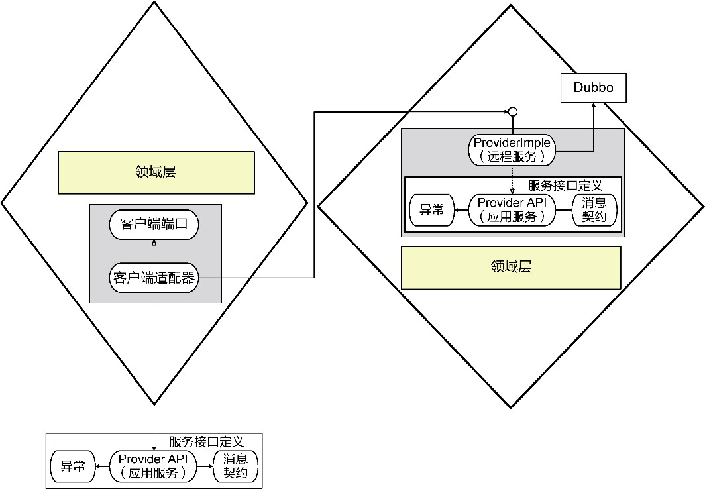

*图18-6 Dubbo的客户端与服务端协作*

客户端在调用Dubbo服务时，除了必要的配置与部署需求，与进程内通信的上下文协作没有任何区别，因为Dubbo服务接口与消息契约对象就部署在客户端，可以直接调用服务接口的方法。若有必要，仍然建议通过南向网关的端口调用Dubbo服务。

服务提供者的实现属于北向网关的远程服务，不仅实现了服务提供者的接口，还调用了应用服务。根据Dubbo框架的要求，服务提供者的接口与消息契约需要组成一个独立的模块，以便部署到客户端。这意味着应用服务与服务提供者接口需要放到不同的模块中，形成不同的JAR包，但在菱形对称架构的代码模型中，都放在northbound.local命名空间下。

比较服务资源契约，服务提供者的设计多引入了一层抽象和间接调用，但保证了菱形对称架构的一致性和对称性，如图18-7所示。

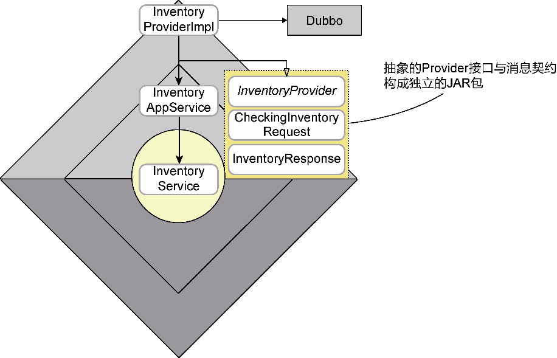

*图18-7 Dubbo服务接口与实现在菱形对称架构的位置*

Dubbo服务与REST风格服务不同，一旦服务接口发生了变化，不仅需要修改客户端代码，还需要重新编译服务接口包，重新部署在客户端。若希望客户端不依赖服务接口，可以使用Dubbo提供的泛化服务GenericService。泛化服务接口的参数与返回值只能是Map，若要表达一个自定义契约对象，需要以Map<String, Object&gt;来表达。获取泛化服务实例需要调用ReferenceConfig，这无疑增加了客户端调用的复杂度。

Dubbo服务的实现皆位于上游限界上下文，如果调用者希望在客户端也执行部分逻辑，如ThreadLocal缓存、验证参数等，根据Dubbo的要求，需要在客户端本地提供存根(Stub)实现，并在服务配置中指定stub的值。这在一定程度上会影响客户端代码的编写。

**3.事件消息传递**

REST风格服务在跨平台通信与接口一致性方面存在天然的优势。REST架构风格业已成熟，可以说是微服务通信的首选。然而，现阶段的REST风格服务主要采用了HTTP/1.0协议与JSON序列化，在数据传输性能方面表现欠佳。RPC服务解决了这一问题，但在跨平台与服务解耦方面又有着一定的技术约束。通过消息队列进行消息传递作为一种非阻塞跨平台异步通信机制，可以成为REST风格服务与RPC服务之外的有益补充。

如果将限界上下文之间传递的消息定义为事件，这种消息传递的分布式通信方式就形成了事件驱动架构风格。虽说事件驱动模型与事件驱动架构最为匹配，但只要定义好了应用事件，服务驱动设计中的远程服务、应用服务也可以实现分布式的消息传递，只是扮演的角色略有不同。

如果需要更加清晰地体现它们的职责，可以认为参与事件消息传递的关键角色包括：

·事件发布者(event publisher)；

·事件订阅者(event subscriber)；

·事件处理器(event handler)。

这一命名遵循了发布者/订阅者模式。发布事件的限界上下文称为发布上下文，属于上游；订阅事件的限界上下文称为订阅上下文，属于下游。事件发布者定义在发布上下文，事件订阅者与事件处理器定义在订阅上下文。事件消息的传递通过事件总线完成，为了支持分布式通信，通常引入消息中间件实现事件总线，常用的消息中间件有RabbitMQ、Kafka等。由于事件消息的传递需要支持分布式通信，不管事件是应用事件还是领域事件，都需要支持序列化。

图18-8展示了两个限界上下文通过发布/订阅事件消息进行协作时，各个对象角色之间的关系。

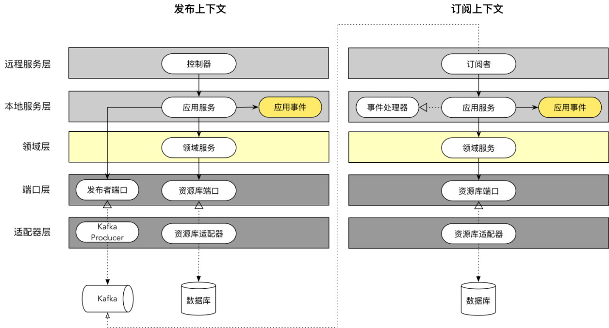

*图18-8 发布和订阅应用事件*

图18-8左侧为发布上下文，它的远程服务是满足前端UI请求的控制器，例如下订单用例，就是买家通过前端UI点击“下订单”按钮发起的服务调用请求。应用服务在收到远程服务委派过来的请求后，会调用领域服务执行对应的业务逻辑。执行完毕后，由应用服务调用注入的事件发布者适配器，将事件消息发布到由Kafka实现的事件总线。图18-8右侧为订阅上下文，远程服务为订阅者。当它监听到Kafka收到的应用事件后，通过实现了事件处理器接口的应用服务消费事件消息，然后将请求委派给领域服务，完成相应的业务逻辑。

发布者端口定义为接口，与外部框架没有任何关系：

```
@Port(type=PortType.Publisher)
public interface EventPublisher<T extends Event> {
   void publish(String topic, T event);
}
```

它的实现作为南向网关的适配器，调用了Spring Kafka的API：

```
@Adapter(type=PortType.Publisher)
public class EventKafkaPublisher<T> implements EventPublisher<T> {
   @Autowired
    private KafkaTemplate<Object, Object> template;
​
   @Override
   public void publish(String topic, T event) {
      template.send(topic, event);
   }
}
```

应用服务和领域服务都可以通过依赖注入获得EventPublisher适配器，故而它的设计与其他位于南向网关的端口和适配器并无任何差异。

事件订阅者需要一直监听Kafka的主题(topic)。不同的订阅上下文需要监听不同的主题来获得对应的事件。由于事件订阅者需要调用具体的消息队列实现，一旦接收到它关注的事件后，需要通过事件处理器处理事件，因此可以认为它是远程服务的一种，负责接收事件总线传递的远程消息。

远程服务并不实际处理具体的业务逻辑，而是作为外部事件消息的“一传手”，在收到消息后，将其转交给应用服务。为了清晰地体现处理事件的含义，应定义EventHandler接口，应用服务会实现该接口。例如，通知上下文的OrderEventSubscriber在收到OrderPlaced事件后，通过调用OrderEventHandler处理该事件：

```
public class OrderEventSubscriber {
   @Autowired
   private OrderEventHandler eventHandler;
   @KafkaListener(id = "order-placed", clientIdPrefix = "order", topics = {"topic.e-
commerce.order"}, containerFactory = "containerFactory")
   public void subscribeOrderPlacedEvent(String eventData) {
      OrderPlaced orderPlaced = JSON.parseObject(eventData, OrderPlaced.class);
      eventHandler.handle(orderPlaced);
   }
}
```

事件处理器与应用服务的定义如下所示：

```
public interface OrderEventHandler {
   void handle(OrderPlaced orderPlacedEvent);
   void handle(OrderCompleted orderCompletedEvent);
}
public class NotificationAppService implements OrderEventHandler ...
```

整体来看，无论采用什么样的分布式通信机制，明确限界上下文网关层与领域层的边界仍然非常重要。不管是REST资源或控制器、服务提供者，还是事件订阅者，都是分布式通信的直接执行者。它们不应该知道领域模型的任何一点知识，故而也不应该干扰领域层的设计与实现。应用服务与远程服务接口保持相对一致的映射关系。对领域逻辑的调用都交给了应用服务，它扮演了外观的角色。分布式通信传递的消息契约对象，包括消息契约对象与领域模型对象之间的转换逻辑，都交给了外部的网关层，充分体现了菱形对称架构的价值。

### 18.3 命令查询职责的分离

命令与查询是否需要分离，这一设计决策会对系统架构、限界上下文乃至领域模型产生直接影响。在领域驱动设计中，是否选择引入该模式是一个重要的战略考量。

在大多数领域场景中，针对领域模型对象的命令操作和查询操作具有不同的关注点，二者具有以下差异。

·查询操作没有副作用，具有幂等性；命令操作会修改状态，其中新增操作若不加约束则不具有幂等性。

·查询操作发起同步请求，需要实时返回查询结果，往往为阻塞式的请求/响应操作；命令操作可以发起异步请求，甚至可以不用返回结果，即采用非阻塞式的即发即忘操作。

·查询结果往往需要面向UI表示层，命令操作只是引起状态的变更，无须呈现操作结果。

·查询操作的频率要远远高于命令操作，领域复杂度又要低于命令操作。

既然命令操作与查询操作存在如此多的差异，采用一致的设计方案就无法更好地应对不同的客户端请求。按照领域驱动设计的原则，针对同一领域逻辑，原本应该建立一个统一的领域模型，但它可能无法同时满足具有复杂UI呈现与丰富领域逻辑的需求，无法同时满足具有同步实时与异步低延迟的需求。这时，就需要寻求改变，按照操作类型对领域模型进行划分，分别建立命令模型和查询模型，形成命令查询职责分离模式(command query responsibility segregation, CQRS)。

#### 18.3.1 CQS模式

Bertrand Meyer认为：“一个方法要么是执行某种动作的命令，要么是返回数据的查询，而不能两者皆是。换句话说，问题不应该对答案进行修改。更正式的解释是，一个方法只有在具有引用透明(referential transparent)时才能返回数据，此时该方法不会产生副作用。”这就是命令查询分离(command query separation，CQS)模式。

在代码层面，分离命令与查询的目的是隔离副作用。函数建模范式非常强调函数无副作用，要求定义为引用透明的纯函数。对象建模范式对方法定义虽没有这样严格的要求，但遵循CQS模式仍有一定的必要性。如果将其放在架构层面来考虑，命令操作与查询操作的分离不仅仅隔离了副作用，还承担了分离领域模型、响应不同调用者需求的职责。例如，当UI表示层需要获得极为丰富的查询模型时，通过严谨设计获得的聚合是否能够直接满足这一需求？如果希望执行高性能的查询请求，频繁映射关系表与对象的查询接口是否带来了太多不必要的间接转换成本？如果查询采用同步操作、命令采用异步操作，采用同一套领域模型是否能够很好地满足不同的执行请求？可以说，CQRS模式脱胎于CQS模式，是其在架构层面上的设计思想延续。

#### 18.3.2 CQRS模式的架构

CQRS模式做出的革命性改变是将模型分为命令模型和查询模型。同时，根据命令操作的特性以及质量属性的要求，酌情考虑引入命令总线、事件总线和事件存储。遵循CQRS模式的架构如图18-9所示，图中的虚线框表示元素可选。

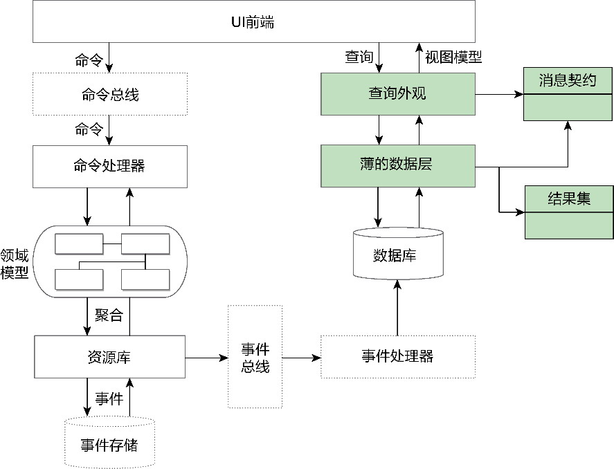

*图18-9 CQRS模式的架构*

在图18-9左侧，命令处理器操作的领域模型就是命令模型。如果没有采用事件溯源与事件存储，该领域模型与普通领域模型并无任何区别，仍然包括实体、值对象、领域服务、资源库和工厂，实体与值对象放在聚合边界内。若有必要还可以引入领域事件。

在图18-9右侧，查询操作面对查询模型，对应消息契约模型中的响应消息对象。响应消息对象并不属于领域模型，因为查询端要求查询操作干净利落、直截了当。为了减少不必要的对象转换，没有定义领域层，而是通过一个薄薄的数据层直接访问数据库。为了提高查询性能，还可以在数据库专门为查询操作建立对应的视图。查询返回的结果无须经过领域模型，直接转换为调用者需要的响应请求对象。

领域模型之所以需要为命令操作保留，是由命令操作具有的业务复杂度决定的。注意，虽然CQRS模式脱胎于CQS模式，但并不意味着其命令操作对应的方法都具有副作用，如薪资管理系统中HourlyEmployee类的payroll()方法会根据结算周期与工作时间卡执行薪资计算，只要输入的值是确定的，方法返回的结果也是确定的，满足了引用透明的规则。换言之，如果没有采用事件建模范式，聚合中的实体与值对象、领域服务的设计并不受CQRS模式的影响。CQRS模式之所以划分命令操作与查询操作，实则是针对资源库进行的改良。

资源库作为管理聚合生命周期的角色构造型，承担了增删改查的职责。CQRS模式要求分离命令操作和查询操作，相当于砍掉了资源库执行查询操作的职责。去掉查询操作后，命令操作执行的聚合又来自何处呢？难道还需要去求助专门的查询接口吗？其实不然，虽然命令模型的资源库不再提供查询方法，但根据聚合根实体的ID执行查询的方法仍然需要保留，否则就无从管理聚合的生命周期了，它的作用实则是加载一个聚合。命令模型的一个典型资源库接口应如下所示：

```
package …….commandmodel;
public interface {CommandModel}Repository {
   Optional<AggregateRoot> fromId(Identity aggregateId);
   void add(AggregateRoot aggregate);
   void update(AggregateRoot aggregate);
   void remove(AggregateRoot aggregate);
}
```

在命令端，除了需要将查询方法从资源库接口中分离出去，与领域驱动设计对领域模型的要求完全保持一致，在架构上，同样遵循菱形对称架构。查询端则不同，没有领域模型，而是直接通过北向网关的远程查询服务调用南向的DAO对象，获得的数据访问对象就是消息契约模型，也就是调用者希望获得的响应消息对象，甚至可以是UI前端需要的视图模型对象。本质上，查询端的架构遵循了弱化的菱形对称架构，即没有领域模型作为内核。建立的命令模型与查询模型如图18-10所示。

如图18-10所示，命令端与查询端位于同一个限界上下文，但采用了不同的分层架构。关键之处在于查询端无须领域模型，从而减少了不必要的抽象与间接，满足快速查询的业务需求。

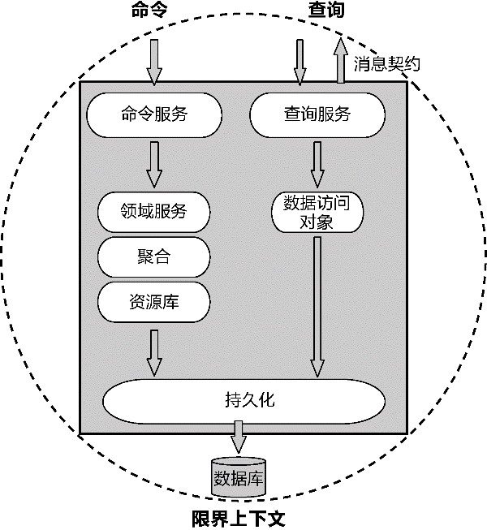

*图18-10 命令模型与查询模型*

#### 18.3.3 命令总线的引入

如果命令请求需要执行较长时间，或者服务端需要承受高并发的压力，又无须实时获取执行命令的结果，就可以引入命令总线，将同步的命令请求改为异步方式，以有效利用分布式资源，提高系统的响应能力。

大型软件系统通常会使用消息队列作为命令总线。消息队列引入的异步通信机制，使得发送方和接收方都不用等待对方返回成功消息即可执行后续的代码，提高了数据处理的能力。尤其在访问量和数据流量较大的情况下，可结合消息队列与后台任务，避开高峰期对任务进行批量处理，有效降低数据库处理数据的负荷，同时也减轻了命令端的压力。

为保证命令端与查询端的一致性，可以将命令服务定义为北向网关的远程服务或应用服务。它的调用方式看起来和查询服务完全一样。实现时，命令服务相当于是命令请求的中转站，在接收到调用者的命令请求后，不做任何处理，立刻将命令消息转发给消息队列。命令处理器作为命令消息的订阅者，在收到命令消息后，调用领域模型对象执行对应的领域逻辑。如此一来，限界上下文的架构就会发生变化，接收命令请求的远程服务和命令处理器在逻辑上属于同一个限界上下文，但在物理上却部署在不同的服务器节点，如图18-11所示。

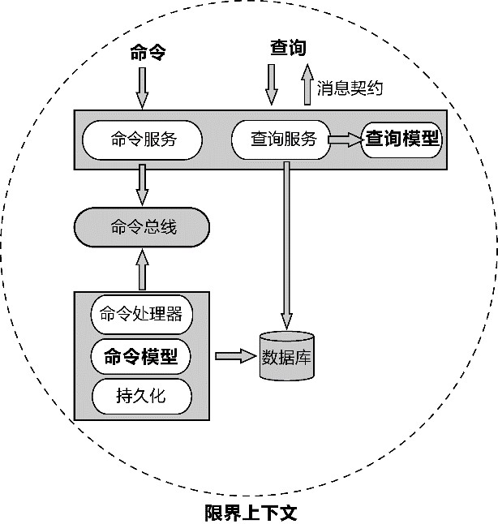

*图18-11 引入命令总线的CQRS架构*

不同的命令请求执行不同的业务逻辑，应用服务作为业务服务的统一外观，承担命令处理器的职责，提供与服务价值对应的命令处理方法。如订单应用服务需要响应下订单和取消订单命令：

```
// 此时的应用服务作为命令处理器
public class OrderAppService {
   // 为了体现命令请求的含义，消息对象的后缀统一为command
   public void placeOrder(PlaceOrderCommand placeOrderCommand) {}
   public void cancelOrder(CancelOrderCommand cancelOrderCommand) {}
}
```

应用服务的方法内部会调用命令请求对象或者装配器的转换方法，将命令请求对象转换为领域模型对象，然后委派给领域服务的对应方法。领域服务与聚合、资源库之间的协作和普通的领域驱动设计实现没有任何区别。显然，命令总线的引入增加了架构的复杂度，即使在同一个限界上下文内部，也引入了复杂的分布式通信机制，但提高了整个限界上下文的响应能力。

#### 18.3.4 事件溯源模式的引入

多数命令操作都具有副作用。如果将聚合状态的变更视为一种事件，就可以将命令操作转换为一种纯函数：Command ->Event。这实际上就引入了事件溯源模式（参见附录B）。这一模式不仅改变了领域模型的建模方式，同时也改变了资源库的实现。通常，事件溯源模式需要与事件存储结合，因为资源库需要通过事件存储获得过去发生的事件，实现聚合的重建与更新操作。

不过，CQRS对事件溯源是有约束的。由于CQRS强调命令与查询分离，命令模型中的资源库不支持查询操作，而事件溯源模式本身也无法很好地支持对聚合的查询功能，因此需要命令端的资源库不仅要负责追加事件，还需要将聚合持久化到业务数据库，以满足查询端的查询请求。为了避免引入不必要的分布式事务，事件存储与业务数据应放在同一个数据库。

#### 18.3.5 事件总线的引入

命令端与查询端可以进一步引入事件总线实现两端的完全独立。在做出这一技术决策之前，需要审慎地判断它的必要性。毫无疑问，事件总线的引入进一步增加了架构的复杂度。

首先，一旦引入事件总线，就需要调整命令端的建模方式，即采用事件建模范式。这种建模范式的建模核心为事件，它关注事件引起的状态迁移，改变了建模者观察真实世界的方式。这种迥异于对象建模范式的思想，并非每个团队都能熟练把握的。

其次，事件总线的作用是传递事件消息，然后由事件处理器订阅该事件消息，根据事件内容完成命令请求，操作业务数据库的数据。这意味着命令端的领域模型需采用事件溯源模式，且在存储事件的同时还需要发布事件。事件存储与业务数据位于消息队列的两端，属于不同的数据库，甚至可能选择不同类型的数据库。

最后，使用消息队列中间件担任事件总线，不可避免增加了分布式系统部署与管理的难度，通信也变得更加复杂。

价值呢？如果系统的并发访问量非常高，引入事件总线无疑可以改进每个服务器节点的响应能力，由于消息队列自身也能支持分布式部署，若能规划好事件发布与订阅的分区和主题设计，就能有效地分配和利用资源，满足不同业务场景的可扩展性需求。一些CQRS框架提供了对消息队列的支持，如Axon框架就允许使用者建立一个基于AMQP的事件总线，还可以使用消息代理对消息进行分配。

引入分布式事件总线的CQRS模式最为复杂，通常需要结合事件溯源模式。首先，客户端向命令服务发起请求，命令服务在接收到命令之后，将其作为消息发布到命令总线，如图18-12所示。

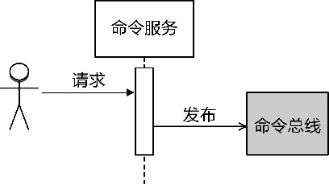

*图18-12 发布命令消息*

命令订阅者订阅了命令总线，一旦命令总线接收到了命令消息，就会调用命令处理器处理命令消息。命令模型的命令处理器其实就是位于北向网关的应用服务，或者说应用服务实现了命令处理器接口，将接收到的命令请求传递给领域服务，由领域服务负责协调聚合与资源库。由于模型采用了事件溯源模式，聚合承担了生成事件的职责。资源库表面看来是聚合的资源库，实际上完成的是领域事件的持久化。一旦领域事件被存储到事件存储中，作为应用服务的命令处理器就会将该领域事件发布到事件总线，如图18-13所示。

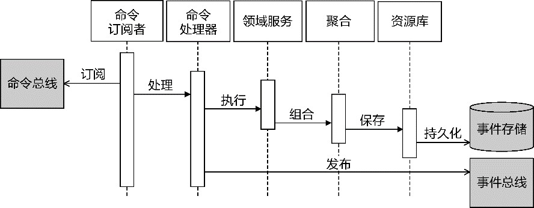

*图18-13 处理命令消息并发布事件*

在事件总线的客户端，事件订阅者负责监听事件总线，一旦接收到事件消息，就会将反序列化后的事件消息对象转发给事件处理器。由于事件处理器与命令处理器分属不同的进程，为了保证它们之间的独立性，传递的事件消息应采用事件携带状态迁移风格。事件自身携带了事件处理器需要的聚合数据，交由资源库完成对聚合的持久化，如图18-14所示。

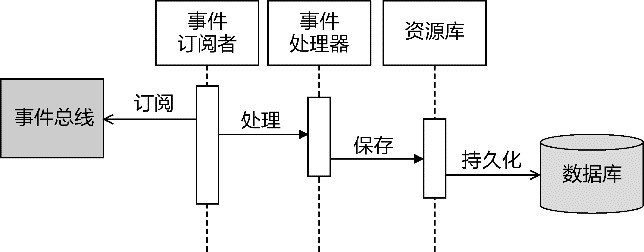

*图18-14 处理事件并持久化聚合*

事件总线发布侧的资源库负责持久化事件，事件总线订阅侧的资源库负责访问聚合数据库，完成对聚合内实体和值对象的持久化。

CQRS模式的复杂度可繁可简，对于领域驱动设计的影响亦可大可小，但最根本的是它改变了查询模型的设计。这一设计思想其实与领域驱动设计核心子领域的识别相吻合，即如果领域模型不属于核心子领域，可以选择适合其领域特点的最简便方法。一个限界上下文可能属于核心子领域的范围，然而，由于查询逻辑并不牵涉到太多的领域规则与业务流程，更强调快速方便地获取数据，因此可以打破领域模型的设计约束。

引入命令总线并不意味着必须引入事件，它仅仅改变了命令请求的处理模式。一旦CQRS模式引入了事件总线，它的设计与事件溯源模式更为匹配，就能够更好地发挥事件的价值。注意，CQRS并没有要求总线必须是运行在独立进程中的中间件。在CQRS架构模式下，总线的职责就是发布、传递和订阅消息，并根据消息特征与角色的不同分为命令总线和事件总线，根据消息处理方式的不同分为同步总线和异步总线。只要能够履行这样的职责，并能高效地处理消息，不必一定使用消息队列。例如，为了降低CQRS的复杂度，我们也可以使用Guava或AKKA提供的Event Bus库，以本地方式实现命令消息和事件消息的传递（AKKA同时也支持分布式消息）。

完整引入命令总线与事件总线的CQRS模式存在较高的复杂度，在选择该解决方案时，需要慎之又慎，认真评估复杂度带来的成本与收益之比。同时，团队也需要明白CQRS模式对领域驱动设计带来的影响。

### 18.4 事务

虽说领域驱动设计专注于领域，然而，一旦领域逻辑融合了战略和战术，让领域逻辑代码真正能够跑起来，对外提供完整的业务能力，就必然绕不开对事务的处理。根据通信边界的不同，事务可以分为本地事务和分布式事务。

由聚合和限界上下文的特征可确定同一个聚合和同一个限界上下文中的领域对象一定在同一个进程边界内。然而，参与协作的聚合可能位于不同的限界上下文，它的通信边界可以是进程内或进程间。也可认为以进程为边界的限界上下文是微服务，在考虑事务处理时，需要考虑聚合、限界上下文和微服务之间的关系。极端情况下，一个聚合就是一个限界上下文，一个限界上下文就是一个微服务。当然，这种一对一的映射关系实属偶然，多数情况下，一个限界上下文可能包含多个聚合，一个微服务也可能包含多个限界上下文。反之，绝不允许一个聚合分散在不同的限界上下文，更不用说微服务了。

如图18-15所示，一个微服务对应一个限界上下文，每个限界上下文包含了两个聚合，每个聚合有其事务边界。同一进程中的聚合A与聚合B、聚合C与聚合D之间的协作可考虑采用本地事务，确保数据的强一致性；聚合B和聚合C的协作为跨进程通信，可考虑采用柔性事务保证数据的最终一致性。

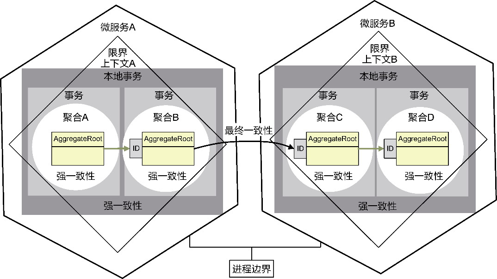

*图18-15 微服务、限界上下文、聚合与事务*

明确微服务、限界上下文、聚合与事务之间的关系后，我们就可以根据本地事务和分布式事务的技术特征分别对二者加以阐述。

#### 18.4.1 本地事务

尽管事务是一种技术实现机制，却要从业务角度对事务提出功能需求。一个完整的业务服务必须考虑异常流程，尤其牵涉到对外部资源的操作，往往因为诸多偶发现象或不可预知的错误导致操作失败。事务就是用来确保一致性的技术手段。

由于角色构造型规定应用服务应体现业务服务的服务价值，即它作为业务服务的内外协调接口。同时，应用服务还应承担调用横切关注点的职责，事务作为一种横切关注点，将其放在应用服务才是合情合理的。Vaughn Vernon就认为：“通常来说，我们将事务放在应用层中。常见的做法是为每一组相关用例创建一个外观(facade)。外观中的业务方法往往定义为粗粒度方法，常见的情况是每一个用例对应一个业务方法。业务方法对用例所需操作进行协调。调用外观中的一个业务方法时，该方法都将开始一个事务。同时，该业务方法将作为领域模型的客户端而存在。在所有的操作完成之后，外观中的业务方法将提交事务。在这个过程中，如果发生错误/异常，那么业务方法将对事务进行回滚。”^

Vaughn Vernon提到的用例就是我提到的业务服务。他还提到：“要将对领域模型的修改添加到事务中，我们必须保证资源库实现与事务使用了相同的会话(session)或工作单元(unit of work)。这样，在领域层中发生的修改才能正确地提交到数据库中，或者回滚。”^

由此可见，我们应该站在业务服务的角度去思考事务以及事务的范围。ThoughtWorks的滕云就认为：“事务应该与业务用例一一对应，而资源库其实只是聚合根的持久化，并不能匹配到某个独立的业务中。”遵循这一观点，实现资源库时就无须考虑事务。所谓的持久化其实是在自己的持久化上下文(persistence context)提供的缓存中进行，直到满足事务要求的业务服务执行完毕，再进行真正的数据库持久化，如此也可避免事务的频繁提交。事实上，Java持久层API(Java Persistence API，JPA)定义的persist()、merge()等方法就没有将数据即时提交到数据库，而是由JPA缓存起来，当真正需要提交数据变更时，再获得EntityTransaction并调用它的commit()方法进行真正的持久化。

在应用服务中完成一个业务服务的操作事务，就是一个工作单元(unit of work)，一个工作单元负责“维护一个被业务事务影响的对象列表，协调变化的写入和并发问题的解决”^。既然应用服务的接口对外代表了一个业务服务的服务价值，就应该在应用服务中通过一个工作单元来维护一个或多个聚合，并协调这些聚合对象的变化与并发。Spring提供的@Transactional注解就是以AOP的方式实现了一个工作单元。如果使用Spring管理事务，只需要在应用服务的方法上添加事务注解即可：

```
@Transactional(rollbackFor = ApplicationException.class)
public class OrderAppService {
   @Service
   private OrderService orderService;
​
   public void placeOrder(PlacingOrderRequest request) {
      try {
         orderService.placeOrder(request.toOrder());
      } catch (DomainException ex) {
         ex.printStackTrace();
         logger.error(ex.getMessage());
         throw new ApplicationDomainException(ex.getMessage(), ex);
      } catch (Exception ex) {
         throw new ApplicationInfrastructureException("Infrastructure Error", ex);
      }
   }
}
```

即使OrderService调用的OrderRepository资源库没有实现事务，OrderAppService应用服务在实现下订单业务用例时，也可以通过@Transactional控制事务，真正提交订单到数据库，并扣减库存中商品的数量。若操作时抛出了Exception异常，就会执行回滚，避免订单、订单项和库存之间产生不一致的数据。

虽然要求在应用服务中实现事务，但它与资源库是否使用事务并不矛盾。事实上，许多ORM框架的原子操作已经支持了事务。例如，使用Spring Data JPA框架时，倘若聚合的资源库接口继承自CrudRepository接口，框架通过代理生成的实现调用了框架的SimpleJpaRepository类。它提供的save()与delete()等方法都标记了@Transacational标注：

```
@Repository
@Transactional(readOnly = true)
public class SimpleJpaRepository<T, ID> implements JpaRepositoryImplementation<T, ID> {
   @Transactional
   @Override
   public <S extends T> S save(S entity) {
   if (entityInformation.isNew(entity)) {
      em.persist(entity);
      return entity;
   } else {
      return em.merge(entity);
   }
 }
 @Transactional
 @SuppressWarnings("unchecked")
 public void delete(T entity) {
   Assert.notNull(entity, "Entity must not be null!");
   if (entityInformation.isNew(entity)) {
      return;
   }
   Class<?> type = ProxyUtils.getUserClass(entity);
   T existing = (T) em.find(type, entityInformation.getId(entity));
   // if the entity to be deleted doesn't exist, delete is a NOOP
   if (existing == null) {
      return;
   }
   em.remove(em.contains(entity) ? entity : em.merge(entity));
   }
}
```

倘若资源库与应用服务都支持了事务，就必须满足约束条件：二者实现的事务使用相同的会话。例如，二者在实现事务时配置了相同的EntityManager或TransactionManager，就会产生多个事务方法的嵌套调用，其行为取决于设置的事务传播(propagation)值。例如，设置为Propagation.Required传播行为，就会在没有事务的情况下新建一个事务，在已有事务的情况下，加入当前事务。

有时候，一个应用服务需要调用另一个限界上下文提供的服务。倘若该限界上下文与当前限界上下文运行在同一个进程中，数据也持久化在同一个数据库中，即使在业务边界上分属两个不同的限界上下文，但在提供技术实现时也可实现为同一个本地事务。无论当前限界上下文对上游应用服务的调用是否使用了防腐层，只要保证它们的事务使用了相同的会话，就能保证事务的一致性。如果参与该本地事务范围的应用服务都配置了@Transactional，则保证各自限界上下文的事务配置保持一致即可，不会影响各自限界上下文的编程模型。

#### 18.4.2 分布式事务

倘若限界上下文之间采用进程间通信，且遵循零共享架构，各个限界上下文访问自己专有的数据库，就会演变为微服务风格。微服务架构不能绕开的一个问题，就是如何处理分布式事务。如果微服务访问的资源支持X/A规范，可以采用诸如二阶段提交协议等分布式事务来保证数据的强一致性。当一个系统的并发访问量越来越大，分区的节点越来越多时，使用这样一种分布式事务去维护数据的强一致性，成本是非常昂贵的。

作为典型的分布式系统，微服务架构受到CAP平衡理论的制约。所谓的CAP就是一致性(consistency)、可用性(availability)和分区容错性(partition-tolerance)的英文首字母缩写。

·一致性：要求所有节点每次读操作都能保证获取到最新数据。

·可用性：要求无论任何故障产生后都能保证服务仍然可用。

·分区容错性：要求被分区的节点可以正常对外提供服务。

CAP平衡理论是Eric Brewer教授在2000年提出的猜想，即“一致性、可用性和分区容错性三者无法在分布式系统中被同时满足，并且最多只能满足其中两个！”这一猜想在2002年得到Lynch等人的证明。由于分布式系统必然需要保证分区容忍性，在这一前提下，就只能在可用性与一致性二者之间取舍。要追求数据的强一致性，就得牺牲系统的可用性。

满足强一致性的分布式事务要解决的问题比本地事务复杂，因为它需要管理和协调所有分布式节点的事务资源，保证这些事务资源能够做到共同成功或者共同失败。为了实现这一目标，可以遵循X/Open组织为分布式事务处理制订的标准协议——X/A协议。遵循X/A协议的方案包括二阶段提交协议和基于它改进而来的三阶段提交协议。无论是哪一种协议，出发点都是在提交之前增加更多的准备阶段，使得参与事务的各个节点满足数据一致性的概率更高，但对外的表征其实与本地事务并无不同之处，都是成功则提交，失败则回滚。简而言之，满足ACID要求的本地事务与分布式事务可以抽象为相同的事务模型，区别仅在于具体的事务机制实现。当然，遵循X/A协议在实现分布式事务时，存在一个技术实现的约束：要求参与全局事务范围的资源必须支持X/A规范。许多主流的关系数据库、消息中间件都支持X/A规范，因此可以通过它实现跨数据库、消息中间件等资源的分布式事务。

由于事务与领域之间的交汇点集中在应用服务，若以横切关注点的方式调用事务，对本地事务和分布式事务的选择就是透明的，对领域模型的设计与实现并无影响。例如，Java Transaction API(JTA)作为遵循X/A协议的Java规范，屏蔽了底层事务资源以及事务资源的协作，以透明方式参与到事务处理中；Spring框架引入了JtaTransactionManager，可以通过编程方式或声明方式支持分布式事务。

以外卖系统的订单服务为例，下订单成功后，需要创建一个工单通知餐厅。下订单会操作订单数据库，创建工单会操作工单数据库，分别由OrderRepository与TicketRepository分别操作两个库的数据，二者必须保证数据的强一致性。如果使用Spring编程方式实现分布式事务，代码大致如下：

```
public class OrderAppService {
   @Resource(name = "springTransactionManager")
   private JtaTransactionManager txManager;
   @Autowired
   private OrderRepository orderRepo;
   @Autowired
   private TicketRepository ticketRepo;
   public void placeOrder(Order order) {
      UserTransaction transaction = txManager.getUserTransaction();
      try {            
         transaction.begin();
         orderRepo.save(order);
         ticketRepo.save(createTicket(order));
         transaction.commit();
      } catch (Exception e) {
         try {
            transaction.rollback();
         } catch (IllegalStateException | SecurityException | SystemException ex) {
            logger.warn(ex.getMessage());
         }
      }
   }
}
```

显然，通过对UserTransaction实现分布式事务的方式与实现本地事务的方式如出一辙，都可以统一为工作单元模式。具体的差异在于配置的数据源与事务管理器不同。如果采用标注进行声明式编程，同样可以使用@Transactional标注，在编程实现上完全看不到本地事务与分布式事务的差异。

许多业务场景对数据一致性的要求并非不能妥协。这时，BASE理论就体现了另一种平衡思想的价值。BASE是基本可用(basically available)、软状态(soft-state)和最终一致性(eventually consistent)的英文缩写，是最终一致性的理论支撑。BASE理论放松了对数据一致性的要求，允许在一段时间内牺牲数据的一致性来换取分布式系统的基本可用，只要数据最终能够达到一致状态。

如果将满足数据强一致性（即ACID）要求的分布式事务称为刚性事务，则满足数据最终一致性的分布式事务称为柔性事务。

#### 18.4.3 柔性事务

业界常用的柔性事务模式包括：

·可靠事件模式；

·TCC模式；

·Saga模式。

接下来，我将探讨这些模式对领域驱动设计带来的影响。为了便于说明，我为这些模式选择了一个共同的业务场景：手机用户在营业厅使用信用卡充值话费。该业务场景牵涉到交易服务、支付服务和充值服务之间的跨进程通信。这3个服务是完全独立的微服务，且无法采用X/A分布式事务来满足数据一致性的需求。

**1.可靠事件模式**

可靠事件模式结合了本地事务与可靠消息传递的特性。当前限界上下文的业务表与事件消息表位于同一个数据库，因此，本地事务就能保证业务数据更改与事件消息插入的强一致性。事件消息成功插入事件消息表后，再利用事件发布者轮询该事件消息表，向消息队列发布事件。利用消息队列传递消息的“至少一次”特性，保证该事件消息无论如何都会传递到消息队列，并被消息的订阅者成功订阅。只要保证事件处理器对该事件的处理是幂等的，就能保证执行操作的可靠性和正确性，最终达成数据的一致。

以话费充值业务场景为例，由交易服务发起支付操作，调用支付服务。支付服务在更新ACCOUNTS表账户余额的同时，还要将PaymentCompleted事件追加到属于同一数据库的EVENTS表。EventPublisher会定时轮询EVENTS表，获得新追加的事件后将其发布给消息队列。充值服务订阅PaymentCompleted事件，一旦收到该事件，就会执行充值服务的领域逻辑，更新FEES表。这个执行过程如图18-16所示。

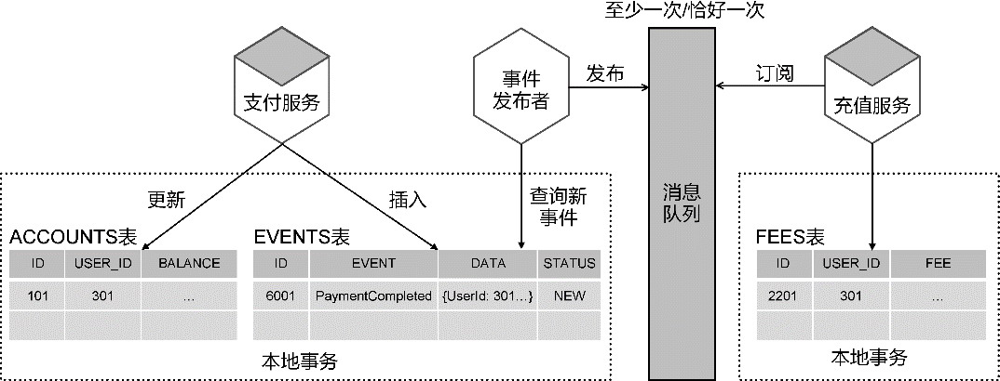

*图18-16 可靠消息模式*

充值服务在成功完成充值后更新话费，同时将PhoneBillCharged事件追加到充值数据库的EVENTS表中，然后由EventPublisher轮询EVENTS表并发布事件。交易服务会订阅PhoneBillCharged事件，然后添加一条新的交易记录到TRANSACTIONS数据表。该流程同样采用可靠事件模式。

在实现可靠事件模式时，领域事件是领域模型不可缺少的一部分。领域事件的持久化与聚合的持久化发生在一个本地事务范围内，为了保证它们的事务一致性，可以将该领域事件放在聚合边界内部，同时为聚合以及对应的资源库增加操作领域事件的功能，例如定义能够感知领域事件的聚合抽象类：

```
public abstract class DomainEventAwareAggregate {
   @JsonIgnore
   private final List<DomainEvent> events = newArrayList();
   protected void raiseEvent(DomainEvent event) {
      this.events.add(event);
   }
   void clearEvents() {
      this.events.clear();
   }
   List<DomainEvent> getEvents() {
      return Collections.unmodifiableList(events);
   }
}
```

定义资源库抽象类，使其能够在持久化聚合的同时持久化领域事件：

```
public abstract class DomainEventAwareRepository<AR extends DomainEventAwareAggregate> {
   @Autowired
   private DomainEventDao eventDao;
   public void save(AR aggregate) {
      eventDao.insert(aggregate.getEvents());
      aggregate.clearEvents();
      doSave(aggregate);
   }
   protected abstract void doSave(AR aggregate);
}
```

应用服务调用南向网关的发布者端口发布事件消息。事件发布成功后，还要更新或删除事件表的记录，避免事件消息的重复发布。事件消息的订阅者作为订阅上下文的远程服务，通过调用消息队列的SDK实现对消息队列的监听。处理事件时，需要保证处理逻辑的幂等性，这样就可以规避因为事件重复发送对业务逻辑的影响。

整体看来，倘若采用可靠事件模式的柔性事务机制，对领域驱动设计的影响，就是增加对事件消息的处理，包括事件的创建、存储、发布、订阅和删除。显然，可靠事件模式要求限界上下文之间采用发布者-订阅者模式进行协作，同时，在发布者-订阅者模式的基础上，增加了本地事件表来保证事件消息的可靠性。

**2.TCC模式**

要保证数据的最终一致性，就必须考虑在失败情况下如何让不一致的数据状态恢复到一致状态。一种有效办法就是采用补偿机制。补偿与回滚不同。回滚在强一致的事务下，资源修改的操作并没有真正提交到事务资源上，变更的数据仅仅限于内存，一旦发生异常，执行回滚操作就是撤销内存中还未提交的操作。补偿则是对已经发生的事实做事后补救，由于数据已经发生了真正的变更，因而无法对数据进行撤销，而是执行相应的逆操作。例如插入了订单，逆操作就是删除订单，反过来也当如是。因此，采用补偿机制实现数据的最终一致性，就需要为每个修改状态的操作定义对应的逆操作。

采用补偿机制的柔性事务模式被称为补偿模式或业务补偿模式。该模式与可靠事件模式最大的不同在于，可靠事件模式的上游服务不依赖于下游服务的运行结果，一旦上游服务执行成功，就通过可靠的消息传递机制要求下游服务无论如何也要执行成功；补偿模式的上游服务会强依赖于下游服务，它需要根据下游服务执行的结果判断是否需要进行补偿。

在话费充值的业务场景中，支付服务为上游服务，充值服务为下游服务。在支付服务执行成功后，如果充值服务操作失败，就会导致数据不一致。这时，补偿机制就会要求上游服务执行事先定义好的逆操作，将银行账户中已经扣掉的金额重新退回。

如果进行补偿的逆操作迟迟没有执行，就会导致软状态的时间过长，使服务长期处于不一致状态。为了解决这一问题，需要引入一种特殊的补偿模式：TCC模式。

TCC模式根据业务角色的不同，将参与整个完整业务用例的分布式应用分为主业务服务和从业务服务。主业务服务负责发起流程，从业务服务执行具体的业务。业务行为被拆分为3个操作，即Try、Confirm和Cancel，这3个操作分属于准备阶段和提交阶段，其中提交阶段又分为Confirm阶段和Cancel阶段。

·Try阶段：准备阶段，对各个业务服务的资源做检测以及对资源进行锁定或者预留。

·Confirm阶段：提交阶段，各个业务服务执行的实际操作。

·Cancel阶段：提交阶段，如果任何一个业务服务的方法执行出错，就需要进行补偿，即释放Try阶段预留的资源。

与普通的补偿模式不同，Cancel阶段的操作更像回滚，但实际并非如此。Try阶段对资源的锁定与预留，并不像本地事务那样以同步方式对资源加锁，而是真正执行对资源进行更改的操作，只是在业务接口的设计上体现为对资源的锁定。阿里的觉生认为：“TCC模型的隔离性思想就是通过业务的改造，在第一阶段结束之后，从底层数据库资源层面的加锁过渡为上层业务层面的加锁，从而释放底层数据库锁资源，放宽分布式事务锁协议，将锁的粒度降到最细，以最大限度提高业务并发性能。”

什么意思呢？TCC模式的两个阶段并不在一个要求数据强一致性的事务范围内。为了保证并发访问，准备阶段在数据库层面会对要修改的目标进行锁定，然后预留业务资源，待业务服务执行完毕后，就可以释放数据库层面的资源锁。到了提交阶段，根据业务服务执行的结果做出动作：如果成功就使用预留资源，如果失败就释放预留资源。准备阶段与提交阶段形成了业务上的隔离。

以支付服务为例，若采用TCC模式，Try阶段一般不会直接扣除账户余额，而会冻结金额。为此，需要为Account类增加一个frozenBalance字段。扣款发生时，需要锁定账户，检查账户余额，如果余额充足，就减少可用余额，同时增加冻结金额。注意，资源的锁定或预留仅限于对需要扣减的资源而言。相反地，例如充值服务是为账户增加话费余额，就无须调整话费资源的模型。

如果Try阶段成功锁定了资源，就进入Confirm阶段执行业务的实际操作。由于Try阶段已经做了业务检查，Confirm阶段的操作只需直接使用Try阶段锁定的业务资源（即扣除冻结金额）即可。如果Try阶段的操作执行失败，就进入Cancel阶段。这个阶段的操作需要释放Try阶段锁定的资源，即扣除冻结金额，同时增加可用余额。

为了应对TCC模式的这3个阶段，必须为支付服务的支付操作定义对应的操作，即对应的tryPay()、confirmPay()和cancelPay()方法。同理，既然TCC模式用于协调多个分布式服务，参与该模式的所有服务就都需要遵循该模式划分的3个阶段。故而在话费充值业务场景中，充值服务也需要定义3个操作：tryCharge()、confirmCharge()和cancelCharge()。不同之处在于话费充值的tryCharge()操作无须锁定或预留资源。

TCC模式将参与主体分为发起方（即主业务服务）与参与方（即从业务服务）。发起方负责协调事务管理器和多个参与方，在启动事务之后，调用所有参与方的Try方法。当所有Try方法均执行成功时，由事务管理器调用每个参与方的Confirm方法。倘若任何一个参与方的Try方法执行失败，事务管理器就会调用每个参与方的Cancel方法完成补偿。以话费充值场景为例，交易服务为发起方，支付服务与充值服务为参与方，它们采用TCC模式的执行流程如图18-17所示。

TCC模式改变了参与方代表事务资源的领域模型，并对服务接口的定义做出了要求。一个领域模型若要作为TCC模式的事务资源，就需要定义相关属性，以支持对资源自身的锁定或预留。同时，作为参与方的每个业务服务接口都需要定义Try、Confirm和Cancel方法。实现这些方法时，还需要保证这些方法具有幂等性。

为了尽量避免TCC模式对领域模型产生影响，仍然需要遵循菱形对称架构，隔离内部的领域模型和属于外部网关层逻辑的TCC实现机制或框架。可以由北向网关的服务作为TCC模式发起方与参与方。例如，如果使用tcc-transaction框架实现Dubbo服务的TCC模式，在提供者服务的实现类中，Try方法需要通过@Compensable标注来指定Confirm方法和Cancel方法，如支付服务：

```
package com.dddexplained.phonebill.paymentcontext.northbound.remote.provider;
public class DebitCardPaymentProvider implements PaymentProvider {
   @Compensable(confirmMethod = "confirmPay", cancelMethod = "cancelPay", transaction
ContextEditor = DubboTransactionContextEditor.class)
   public void tryPay(PaymentRequest request) {}
   public void confirmPay(PaymentRequest request) {}
   public void cancelPay(PaymentRequest request) {}
}
```

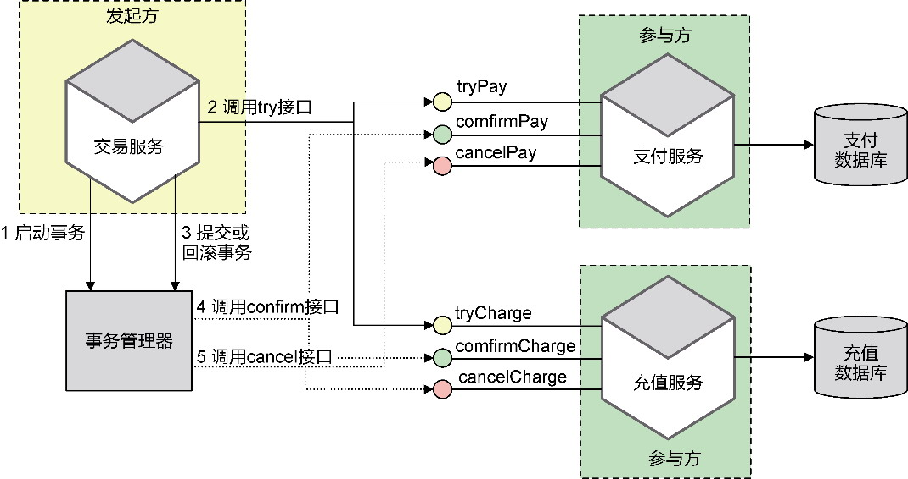

*图18-17 TCC模式*

根据Dubbo服务的要求，DebitCardPaymentProvider是远程服务，PaymentProvider才是应用服务。远程服务作为实现，会调用对应的领域服务完成对可用余额、冻结金额的增加与扣减。tcc-transaction框架要求Provider接口的Try方法必须标记@Compensable，意味着应用服务也依赖tcc-transaction框架：

```
package com.dddexplained.phonebill.paymentcontext.northbound.local.provider;
public interface PaymentProvider {
   @Compensable
   public void tryPay(PaymentRequest request) {}
   public void confirmPay(PaymentRequest request) {}
   public void cancelPay(PaymentRequest request) {}
}
```

我们一旦将TCC模式的实现尽量推到北向网关的服务，就能将它对领域模型的影响降到最低。TCC模式需要实现的3个方法，到了领域层，就是非常干净的领域逻辑，其实现与TCC模式无关。相较而言，为了实现资源锁定，引入的frozenBalance属性对领域逻辑的影响反而更大。但如果将冻结余额视为领域逻辑的一部分，在支付操作进行扣款时修改冻结余额的值，似乎也在情理之中。这属于Account聚合根实体需要定义的属性。

**3.Saga模式**

Saga模式又称作长时间运行事务(long-running-transaction)，由普林斯顿大学的H. Garcia-Molina等人提出，可在没有两阶段提交的情况下解决分布式系统中复杂的业务事务问题。Saga模式认为：“一个长事务应该被拆分为多个短事务进行事务之间的协调。”

对于微服务架构，一个完整的业务用例通常需要多个微服务协作。这时，讨论的焦点就不在于这个事务的执行时间长短，而在于该业务场景是否牵涉到多个分布式服务。在Saga模式的语境下，可以认为“一个Saga表示需要更新多个服务中数据的一个系统操作”。

Saga模式亦是一种补偿操作，但本质上与TCC模式不同。Saga模式没有Try阶段，不需要预留或冻结资源。从参与Saga模式的微服务的视角看服务自己，就是一个本地服务，因此在执行它自己的方法时，就可以直接操作该服务内的事务资源。这就可能导致一个本地服务操作成功、另一个本地服务操作失败的情况，造成数据的不一致。这时，就需要执行操作的逆操作来完成补偿。

根据微服务之间协作方式的不同，Saga模式也有两种不同的实现，Chris Richardson将其分别定义为协同式(choreography)和编排式(orchestrator)^。

·协同式：把Saga的决策和执行顺序逻辑分布在Saga的每个参与方，它们通过交换事件的方式进行沟通。

·编排式：把Saga的决策和执行顺序逻辑集中在一个Saga编排器类。Saga编排器发出命令式消息给各个Saga参与方，指示这些参与方服务完成具体操作（本地事务）。

协同式Saga的关键核心是事务消息与事件的发布者-订阅者模式。

所谓“事务消息”就是满足消息发送与本地事务执行的原子性问题。以本地数据库更新与消息发送为例，如果首先执行数据库更新，待执行成功后再发送消息，只要消息发送成功，就能保证事务的一致。但是，一旦消息发送不成功（包括经过多次重试），又该如何确保更新操作的回滚？如果首先发送消息，然后执行数据库更新，又会面临当数据库更新失败时该如何撤销业已发送的消息的难题。事务消息解决的就是这类问题。

Chris Richardson提出了事务消息的多个方案，如使用数据库表作为消息队列、事务日志拖尾(transaction log tailing)等^。在实际运用中，我们也可选择支持事务消息的消息队列中间件，如RocketMQ。

一旦满足事务消息的基本条件，协同式Saga模式中各个参与服务之间的通信就通过事件来完成，并能确保每个参与服务在本地是满足事务一致性的。与可靠事件模式不同的是，对于产生副作用的业务操作，需要定义对应的补偿操作。在Saga模式中，事件的订阅顺序刚好对应正向流程与逆向流程，执行的操作也与之对应。

仍以话费充值为例。在正向流程中，支付服务执行的操作为pay()，完成支付后发布PaymentCompleted事件；充值服务订阅该事件，并在接收到该事件后，执行charge()操作，成功充值后发布PhoneBillCharged事件。而在逆向流程中，充值失败将发布PhoneBillChargeFailed事件，支付服务订阅该事件，一旦接收到，就需要执行rejectPay()补偿操作。

为减少Saga模式对领域模型的影响，参与Saga协同的服务应由应用服务来承担，因此，正向流程的操作与逆向流程的补偿操作都定义在应用服务中。由于领域模型需要支持各种业务场景，即使不考虑分布式事务，也当提供完整的领域行为。以支付服务为例，即使不考虑充值失败时执行的补偿操作，也需要在领域模型中提供支付与退款这两种领域行为。这两个行为实则是互逆的，它们的定义并不受分布式事务的影响。

编排式Saga需要开发人员定义一个编排器类，用于编排一个Saga中多个参与服务执行的流程。可认为编排器类是一个Saga工作流引擎，通过它来协调这些参与的微服务。如果整个业务流程正常结束，业务就成功完成。一旦这个过程的任何环节出现失败，Sagas工作流引擎就会以相反的顺序调用补偿操作，重新进行业务回滚。

如果说协同式Saga是一种自治的协作行为，编排式Saga就是一种集权的控制行为。但这种控制行为并不像一个过程脚本那样由编排器类按照顺序依次调用各个参与服务，而是将编排器类作为服务协作的调停者(mediator)，且仍然采用消息传递来实现服务之间的跨进程通信。编排器类传递的消息是一个请求/响应消息。请求消息的发起者为Saga编排器，将消息发送给消息队列。消息队列为响应消息创建一个专门的通道，作为Saga的回复通道。当对应的参与服务接收到该请求消息后，会将执行结果作为响应消息（本质上还是事件）返回给回复通道。Saga编排器在接收到响应消息后，根据结果的成败决定调用正向操作还是逆向的补偿操作。

编排式Saga减轻了各个参与服务的压力，因为参与服务不再需要订阅上游服务返回的事件，减少了服务之间对事件协议的依赖，如编排式的支付服务无须了解充值服务返回的PhoneBillChargeFailed事件。支付服务的补偿操作由Saga编排器接收到作为响应消息的PhoneBillChargeFailed事件，然后编排器再向支付服务发起退款的命令请求。在引入编排器后，每个参与服务的职责就变得更为单一且一致：

·订阅并处理命令消息，该命令消息属于当前服务公开接口需要的输入参数；

·执行命令后返回响应消息。

编排式与协同式Saga的差异在于服务之间的协作方式，每个参与服务的接口定义并没有任何区别。只要隔离了外部网关层与领域模型，仍然能够保证领域模型的稳定性。

若能使用已有的Saga框架，就无须开发人员再去处理烦琐的服务协作与补偿方法调用的技术实现细节。Chris Richardson提供的Eventuate Tram Saga框架^能够支持编排式的Saga模式，但对Saga的封装并不够彻底。要使用该框架，仍然需要了解太多Saga的细节。ServiceComb Pack属于微服务平台Apache ServiceComb的一部分，为分布式柔性事务提供了整体解决方案，能够同时支持Saga与TCC模式。

ServiceComb Pack通过gRPC与Kyro序列化来实现微服务之间的分布式通信。它包含了两个组件：Alpha与Omega。Alpha作为Saga协调者，负责管理和协调事务。Omega是内嵌到每个参与服务的引擎，可以拦截调用请求并向Alpha上报事务事件。

采用协调者与拦截引擎的设计机制可以有效地将Saga机制封装起来，使开发人员在实现微服务之间的调用时，几乎感受不到Saga模式的事务处理。除了必要的配置与依赖，只需要在各个参与方应用服务的正向操作上指定补偿方法即可。例如，支付服务的应用服务定义：

```
import org.apache.servicecomb.pack.omega.transaction.annotations.Compensable;
import org.springframework.stereotype.Service;
@Service
public class PaymentAppService {
   @Compensable(compensationMethod = "rejectPay")
   public void pay(PaymentRequest paymentRequest) {}
   void rejectPay(String paymentId) {}
}
```

PaymentAppService应用服务接收到支付请求后，会由领域服务完成支付功能；补偿操作rejectPay()方法同样交由领域服务完成取消支付的功能。由于限界上下文的设计遵循菱形对称架构，领域模型对象并不知道位于外部网关层的应用服务，也没有依赖外部的ServiceComb Pack框架，保持了领域模型的纯粹性与稳定性。toc
