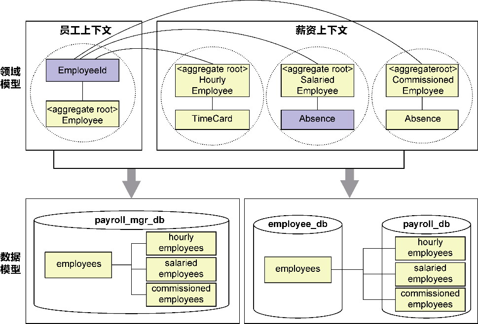

## 第19章 领域驱动设计的战术考量

> 战术就是在决定点上使用兵力的艺术,其目的就是要使他们在决定的时机、决定的地点上,发生决定性的作用。

> ——安东·亨利·约米尼，《战争艺术》

虽然领域驱动战术设计将关注重心放在“领域”上，但要让限界上下文的业务能力真正发挥出来，就得融合领域逻辑与技术实现，同时，又不能让技术复杂度影响到业务复杂度。这就需要从战术角度思考二者的融合点，做好设计与实现的规范与约束，我将这些战术层面的要求称为领域驱动设计的战术考量。

### 19.1 设计概念的统一语言

领域驱动设计引入了一套自成体系的设计概念：限界上下文、应用服务、领域服务、聚合、实体、值对象、领域事件以及资源库和工厂。这些设计概念与其他方法的设计概念互为参考和引用，再糅合不同团队、不同企业、不同领域的设计实践，就产生了更多的设计概念。诸多概念纠缠不清，人们理解不同，就会形成认知上的混乱，干扰整个团队对领域驱动设计的理解。既然领域驱动设计强调为领域逻辑建立统一语言，我们不妨也为这些设计概念定义一套“统一语言”，使不同人的理解一致，保证交流的畅通，确保架构和设计方案的统一性。

#### 19.1.1 设计术语的统一

当我们在讨论领域驱动设计时，不只会谈到领域驱动设计固有的设计概念，结合开发语言和开发平台的设计实践，还会有其他设计概念穿插其中。它们之间的关系并非正交的，解决的问题和思考的角度都不太一致。许多设计概念更有其历史渊源，却又在提出之后或被滥用，或被错用，到了最后已经失去了它本来的面目。我们需要驱散这些设计术语的历史迷雾，理解其本真，再确定它的统一语言。

**1.POJO对象**

Plain Old Java Object(POJO)的概念来自Martin Fowler、Rebecca Parsons和Josh MacKenzie在2000年一次大会的讨论。它的本来含义是指一个常规的、不受任何框架、平台的约束和限制的Java对象。除了遵守Java语法，它不应该继承预先设定的类、实现预先设定的接口或者包含预先指定的注解。可以认为，如果一个模块定义的对象皆为POJO，那么除了依赖JDK，它不会依赖任何框架或平台。借助这个概念，.NET框架也提出了Plain Old CLR Object(POCO)的概念。

Martin Fowler等人之所以提出POJO，是因为他们看到了“使用POJO封装业务逻辑的益处”，而2000年恰恰属于EJB开始流行的时代。受到EJB规范的限制，Java开发人员更愿意使用Entity Bean，而Entity Bean却是与EJB强耦合的。

一些人错误地将Entity Bean理解为仅具有持久化能力的Java对象，但事实并非如此。即使EJB规范也认为Entity Bean可以包含复杂的业务逻辑，例如Oracle对Entity Bean的定义就包括：

·管理持久化数据；

·通过主键形成唯一标识；

·引入依赖对象执行复杂逻辑。

由于定义一个Entity Bean类需要继承自javax.ejb.EntityBean（基于EJB 3.0之前的规范），如果Entity Bean封装了复杂的业务逻辑，就会使业务逻辑与EJB框架紧耦合，不利于对业务逻辑的测试、部署和运行。这也正是Rod Johnson提出抛开EJB进行J2EE开发的原因。当然，Entity Bean为人诟病的与EJB框架紧耦合问题，主要针对EJB 3.0之前的版本，随着Spring与Hibernate等轻量级框架的出现，EJB也开始向轻量级方向发展，大量使用注解来降低EJB对Java类的侵入性。

既然Entity Bean可以封装业务逻辑，针对它提出的POJO自然也可以封装业务逻辑。如前所述，Martin Fowler等人看到的是“使用POJO封装业务逻辑的益处”，这就说明POJO对象并非只有getter/setter的贫血对象，它的主要特征不在于它究竟定义了什么样的成员，而在于它作为一个常规的Java对象，并不依赖于除语言之外的任何框架。它的目的不是数据传输，也不是数据持久化，本质上，它是一种设计模式。

**2.Java Bean**

Java Bean是一种Java开发规范，要求一个Java Bean类必须同时满足以下3个条件：

·类必须是具体的、公共的；

·具有无参构造函数；

·提供一致性设计模式的公共方法将内部字段暴露为成员属性，即为内部字段提供规范的get和set方法。

认真解读这3个条件，你会发现它们都是为支持反射访问类成员而准备的前置条件，包括创建Java Bean实例和操作内部字段。只要遵循Java Bean规范，就可以采用完全统一的一套代码实现对Java Bean的访问。这一规范并没有提及业务方法的定义，这是因为规范无法对公开的方法做出任何一致性的限制，意味着框架使用Java Bean，看重的其实是对象携带数据的能力，可通过反射访问对象的字段值来简化代码的编写。例如，JSP对Java Bean的使用如下：

```
<jsp:useBean id="student" class="com.dddsample.javabeans.Student">
   <jsp:setProperty name="student" property="firstName" value="Bill"/>
   <jsp:setProperty name="student" property="lastName" value="Gates"/>
   <jsp:setProperty name="student" property="age" value="20"/>
</jsp:useBean>
```

JSP标签中使用的Student类就是一个Java Bean。如果该类的定义没有遵循Java Bean规范，JSP就可能无法实例化Student对象，无法设置firstName等字段值。

至于Session Bean、Entity Bean和Message Driven Bean则是Enterprise Java Bean的3个分类。它们都是Java Bean，但EJB对它们又有框架的约束，例如Session Bean需要继承自javax.ejb.SessionBean、Entity Bean需要继承自javax.ejb.EntityBean。

追本溯源，可发现POJO与Java Bean并没有任何关系。一个POJO如果遵循了Java Bean的设计规范，可以成为一个Java Bean，但并不意味着POJO一定是Java Bean。反过来，一个Java Bean如果没有依赖任何框架，也可以认为是一个POJO，但Enterprise Java Bean一定不是一个POJO。POJO可以封装业务逻辑，Java Bean的规范也没有限制它不能封装业务逻辑。一个提供了丰富领域逻辑的Java对象，如果同时又遵循了Java Bean的设计规范，也可以认为是一个Java Bean。

**3.贫血模型**

准确地说，贫血模型应该被称为“贫血领域模型”(anemic domain model)，因为该术语主要用于领域模型这个语境，来自Martin Fowler的创造。从贫血一词可知，这种领域模型必然是不健康的。它违背了面向对象设计的关键原则，即“数据与行为应该封装在一起”。在领域驱动设计中，如果一个实体或值对象除内部字段之外只有一系列的getter/setter方法，即可被称为贫血对象。

可以认为贫血领域模型是结构建模范式的产物（参见附录A）。它的封装性很弱，往往导致领域服务形成一种事务脚本的实现；它与面向对象的设计思想背道而驰，违背了“迪米特法则”与“信息专家模式”；它的存在会影响对象之间的协作，导致产生“特性依恋”^坏味道。

与贫血领域模型相对的是富领域模型(rich domain model)，也就是封装了领域逻辑的领域模型。它才符合面向对象设计思想。我们采用对象建模范式进行领域设计建模时，应将实体与值对象都定义为富领域模型。富领域模型就是Martin Fowler在《企业应用架构模式》一书中定义的领域模型模式。作为一种领域逻辑(domain logic)模式，它与事务脚本(transaction Script)、表模块(table module)属于不同的表达领域逻辑的模式。倘若遵循这一模式的定义，认为领域模型就应为富领域模型，那么贫血领域模型因为会导致事务脚本，本不应该被称为领域模型。

有了Martin Fowler对贫血模型的创造，所谓的“血”就用来指代领域逻辑，故而有人在贫血模型的基础上衍生出各种与“血”有关的各种模型，如失血模型、充血模型和胀血模型。这些模型非但没有进一步将领域模型的正确定义阐述清楚，反而引入太多的概念造成领域模型的混乱不清。

例如，一些人误用了贫血模型的定义，将只有字段和getter/setter方法的类称为“失血模型”，而将Martin Fowler提出的富领域模型称为“贫血模型”，却又无法清晰地区分哪些领域逻辑该放在领域模型、哪些领域逻辑该放在领域服务，于是又生搬硬造地创造出“充血模型”和“胀血模型”来区分领域模型对象包含领域逻辑的多寡。我将这些模型称为“×血模型”。

×血模型的定义无疑是不合理的。顾名思义，贫血这个词代表着不健康，贫血模型当然就意指不健康的模型。富领域模型应该是一种健康的定义，结果反而与贫血模型搅在了一起，何其无辜！“充血”一词仍隐隐有不健康的意义，更不用说更加惊悚的“胀血模型”了。后者违背了单一职责原则，将与该领域概念相关的所有逻辑，包括对数据访问对象或资源库的依赖以及对事务、授权等横切关注点的调用，都放到了领域模型对象中，在领域驱动设计的语境中，这相当于让一个聚合根实体承担了整个聚合、领域服务和应用服务的职责，明显有悖于领域驱动设计乃至面向对象的设计原则。

有的观点认为混入了持久化能力的领域模型属于充血模型，这更进一步模糊了×血模型的边界。实际上，Martin Fowler将这种具有持久化能力的领域对象称为活动记录(active record)^，属于数据源架构模式(data source architectural pattern)。采用这种设计模式并非不可，但在领域驱动设计中，却需要努力避免：如果每个实体都混入了持久化能力，聚合的边界就失去了保护作用，资源库也就没有存在的价值了。

人们经常会混淆领域模型与POJO的概念，认为贫血模型对象就是一个POJO，殊不知这二者根本就处于两个迥然不同的维度。POJO关注类的定义是否纯粹，领域模型关注对领域逻辑的表达与封装。即使是一个只有getter/setter方法的贫血模型对象，只要依赖了任何外部框架，例如标记了javax.persistence.Entity标注，在严格意义上，也不属于一个POJO。以Dubbo服务化最佳实践为例，它给出的其中一个建议要求“服务参数及返回值建议使用POJO对象，即通过getter/setter方法表示属性的对象”。这一描述其实是不正确的，因为Dubbo服务的输入参数与返回值需要支持序列化，不符合POJO的定义，应该描述为“支持序列化的Java Bean”。

为避免太多定义造成领域模型定义的混乱，我建议回归Martin Fowler对领域模型定义的本质，仅分为两种模型：贫血领域模型与富领域模型，后者需要遵循合理的职责分配，避免一个领域模型对象承担的职责过多。若在领域驱动设计的语境下，可以认为由实体、值对象、领域事件和领域服务共同构成了领域模型。一个设计良好的领域模型，需要满足两点要求：

·领域模型仅仅封装领域逻辑，尽可能不掺杂访问外部资源的技术实现；

·根据角色构造型分配职责，各司其职，共同协作。

采用角色构造型和服务驱动设计，可以很好地满足以上两点要求。

#### 19.1.2 诸多“XO”

在分层架构的约束以及职责分离的指引下，一个软件系统需要定义各种各样的对象，并在各自的层次承担不同的职责，又彼此协作，共同响应系统外部的各种请求，执行业务逻辑，让整个软件系统真正地跑起来。

若没有真正理解这些对象在架构中扮演的角色和承担的职责，就会导致误用和滥用，适得其反。因此，有必要在领域驱动设计的方法体系下，将各式各样的对象进行一次梳理，形成一套统一语言。由于这些对象皆以O结尾，因此我将其戏称为“XO”。

**1.数据传输对象**

数据传输对象(data transfer object，DTO)是一种模式，最早运用于J2EE。Martin Fowler将其定义为：“用于在进程间传递数据的对象，目的是减少方法调用的数量。”^DTO模式诞生的背景是分布式通信。考虑到网络传输的损耗与不可靠性，设计分布式服务需遵循一个总体原则：尽可能设计粗粒度的服务，每个服务的方法应代表一个完整的功能，而不是功能的一个步骤。粗粒度服务可以减少服务调用的次数，从而减少不必要的网络通信，同时也能避免对分布式事务的支持。粗粒度的服务自然需要返回粗粒度的数据契约。

领域模型对象遵循面向对象设计原则，在细粒度上分离职责，因而无法满足粗粒度服务契约的要求。这就需要对领域模型对象进行封装，组合更多的细粒度对象形成一个粗粒度的DTO对象。

在菱形对称架构中，我根据发布语言模式和限界上下文的稳定空间特性，提出了消息契约模型的概念。它实际上就是DTO模式的体现，通常定义在北向网关的本地服务层，远程服务和应用服务都以消息契约模型对象作为接口方法的输入参数和返回值。这实际上扩展了DTO的应用场景，使其不止限于进程间的数据传递，还能对领域模型提供保护。菱形对称架构的南向网关有时也需要定义消息契约模型，属于防腐层的一部分，用于隔离上游限界上下文的领域模型。

为了支持进程间的数据传递，消息契约模型必须支持序列化。最好将其设计为一个Java Bean，即定义为公开的类，具有默认构造函数和getter/setter方法，这样就有利于一些框架通过反射来创建与组装消息契约对象。消息契约对象通常还应该是一个贫血对象，因为它的目的是传输数据，没有必要定义封装逻辑的方法，但考虑到它与领域模型之间的映射关系，可能需要为其定义转换方法。

**2.视图对象**

视图对象(view object，VO)其实是消息契约模型中的一种，往往遵循MVC模式，为前端UI提供了视图呈现所需要的数据，我将其称为“视图模型对象”。当然，我们也可以沿用DTO模式。由于它主要用于后端控制器服务和前端UI之间的数据传递，这样的视图模型对象自然也属于DTO对象的范畴。

视图对象可能仅传输了视图需要呈现的数据，也可能为了满足前端UI的可配置，由后端传递与视图元素相关的属性值，如视图元素的位置、大小乃至颜色等样式信息。系统分层架构规定边缘层承担了BFF(Backend For Frontend)层的作用，定义在边缘层的控制器会操作这样的视图对象。

由于值对象(value object)的简称也是VO，因此在交流时，一定要明确VO的指代意义，避免概念的混淆。

**3.业务对象**

业务对象(business object，BO)是企业领域用来描述业务概念的语义对象。这是一个非常宽泛的定义。一些业务建模方法使用了业务对象的概念，如SAP定义的公共事业模型，就将客户相关信息抽象为合作伙伴、合同账户、合同、连接对象等业务对象。它是站在一个高层次角度的表述，并形成了高度抽象的业务概念。如果系统采用经典三层架构，可认为业务对象就是定义在业务逻辑层中封装了业务逻辑的对象。

业务对象的业务逻辑恰好也是领域驱动设计关注的核心，可认为领域驱动设计建立的领域模型皆是业务对象。业务对象由于并没有清晰地给出粒度的界定、职责的划分，更像组成领域分析模型中的领域概念对象。为避免混淆，我建议不要在领域驱动设计中使用该概念。

**4.领域对象**

领域驱动设计将业务逻辑层分解为应用层和领域层，业务对象在领域层中就变成了领域对象(domain object，DO)。领域驱动设计的准确说法是领域模型对象。领域模型对象包括聚合边界内的实体和值对象、领域事件和领域服务，游离在聚合之外的瞬态对象（往往定义为值对象）只要封装了领域逻辑，也可认为是领域模型对象。

有的语境，包括前面所述的贫血领域模型和富领域模型，将领域模型对象特指为组成聚合的实体与值对象，因为它们表达了领域的名词概念，以此和领域服务进行区分。这有一定的合理性。不过，宽泛地讲，领域行为也属于领域概念的一部分，同样受到统一语言的约束与指导，封装了领域行为逻辑的领域服务自然也可认为是领域模型对象了。

同样是简称惹的祸，DO也可以认为是数据对象(data object)的简称，这就与领域对象的定义完全南辕北辙了。再次强调，在使用简称来指代某一类对象时，交流的双方一定要事先明确设计的统一语言，否则很容易造成误解。

**5.持久化对象**

对象字段持有的数据需要被持久化到数据表中，参与到持久化操作的对象就被称为持久化对象(persistence object，PO)。注意，持久化对象并不一定就是数据对象，相反，在领域驱动设计中，持久化对象往往指的就是领域模型对象。领域模型对象与持久化对象并不矛盾，它们只是不同场景下扮演的不同角色：在领域层，不需要考虑领域模型对象的持久化，故而将其称为领域模型对象；在对象持久化时，许多满足ORM规范的持久化框架操作的仍然是领域模型对象，只是它们并不关心领域对象封装的领域行为逻辑罢了。

只要对象需要持久化，就会成为持久化对象，这与采用什么样的建模方法、什么样的设计方法没有关系。即使没有采用领域驱动设计，也可能需要持久化对象。区别在于由谁负责持久化。

不可否认，当我们将领域模型对象作为持久化对象完成数据的持久化时，可能会为领域模型对象带来外部框架的污染。理想的领域模型对象应该是一个POJO或POCO，不依赖于除语言在外的任何框架。Martin Fowler甚至将其称为持久化透明(persistence ignorance，PI)的对象，用以形容这样的持久化对象与具体的持久化实现机制之间的隔离。Jimmy Nilsson认为以下特征违背了持久化透明的原则^：

·从特定的基类（Object除外）进行继承；

·只通过提供的工厂进行实例化；

·使用专门提供的数据类型；

·实现特定接口；

·提供专门的构造方法；

·提供必需的特定字段；

·避免某些结构或强制使用某些结构。

这些特征无一例外都是外部框架对于持久化对象的一种侵入。在Martin Fowler总结的数据源架构模式中，活动记录(active record)模式^明显违背了持久化透明的原则，但其简单性却使它被诸如Ruby On Rails、jOOQ、scalikejdbc之类的框架运用。活动记录模式封装了数据与数据访问行为，这就相当于将后面讲的数据访问对象(DAO)与PO合并到了一个对象中。

领域驱动设计不赞成这样的设计，虽然因为持久化框架的限制，可能无法做到领域模型对象的持久化透明，但持久化工作却要求交给专门的资源库对象。资源库端口隔离了具体的持久化实现机制，资源库适配器调用ORM框架完成持久化。领域驱动设计还规定，资源库操作的持久化对象必须以聚合为单位的领域模型对象，也就是同属一个聚合边界的实体与值对象，领域服务不在此列。如果采用事件溯源模式，还需要持久化领域事件，但它的持久化并不经由资源库，而是专门的事件存储对象来承担。

**6.数据访问对象**

数据访问对象(data access object，DAO)对持久化对象进行持久化，实现数据的访问。它可以持久化领域模型对象，但对领域模型对象的边界没有任何限制。由于领域驱动设计引入了聚合边界，并力求领域模型与数据模型的分离，且引入了资源库专门用于聚合的生命周期管理，因此在领域驱动设计中，不再使用DAO这个概念。

#### 19.1.3 领域驱动设计的设计统一语言

通过对诸多设计概念的历史追寻与本质分析，我们理清了这些概念的含义与用途，将它们归纳到领域驱动设计体系中，得出设计统一语言如下。

·领域模型对象包含实体、值对象、领域服务和领域事件，有时候也可以单指组成聚合的实体与值对象。

·领域模型必须是富领域模型。

·远程服务与应用服务接口的输入参数和返回值为遵循DTO模式的消息契约模型，若客户端为前端UI，则消息契约模型又称为视图模型。

·领域模型对象中的实体与值对象同时作为持久化对象。

·只有资源库对象，没有数据访问对象。资源库对象以聚合为单位进行领域模型对象的持久化，事件存储对象则负责完成领域事件的持久化。

### 19.2 领域模型的持久化

领域驱动设计主要通过限界上下文应对复杂度，它是绑定业务架构、应用架构和数据架构的关键架构单元。设计由领域而非数据驱动，且为了保证定义了领域模型的应用架构和定义了数据模型的数据架构的变化方向相同，就应该在领域建模阶段率先定义领域模型，再根据领域模型定义数据模型。这就是领域驱动设计与数据驱动设计的根本区别。

#### 19.2.1 对象关系映射

如果领域建模采用对象建模范式，存储数据则使用关系数据库，那么领域模型就是面向对象的，数据模型则是面向关系表的。在领域驱动设计中，领域模型一方面充分地表达了系统的领域逻辑，同时还映射了数据模型，作为持久化对象完成数据的读写。

要持久化领域模型对象，需要为对象与关系建立映射，即所谓的“对象关系映射”(object relationship mapping，ORM)。当然，这主要针对关系数据库。对象与关系往往存在“阻抗不匹配”的问题，主要体现为以下3个方面。

·类型的阻抗不匹配：例如不同关系数据库对浮点数的不同表示方法，字符串类型在数据库的最大长度约束等，又例如Java等语言的枚举类型本质上仍然属于基本类型，关系数据库中却没有对应的类型来匹配。

·样式的阻抗不匹配：领域模型与数据模型不具备一一对应的关系。领域模型是一个具有嵌套层次的对象图结构，数据模型在关系数据库中却是扁平的关系结构，要让数据库能够表示领域模型，就只能通过关系来变通地映射实现。

·对象模式的阻抗不匹配：面向对象的封装、继承和多态无法在关系数据库得到直观体现。通过封装可以定义一个高内聚的类来表达一个细粒度的基本概念，但数据表往往不这么设计。数据表只有组合关系，无法表达对象之间的继承关系。既然无法实现继承关系，就无法满足Liskov替换原则，自然也就无法满足多态。

#### 19.2.2 JPA的应对之道

对象持久化为数据的问题如此重要，Java语言甚至为此定义了持久化的规范，用以指导面向对象的语言要素与关系数据表之间的映射，如JDK 5中引入的JPA，作为Java社区进程(Java Community Process，JCP)组织发布的Java EE标准，已成为Java社区指导ORM技术实现的规范。

ORM框架的目的是在对象与关系之间建立一种映射。为满足此目标，可通过配置文件或在领域模型中声明元数据来表现这种映射关系。JPA作为一种规范，全面地考虑了各种阻抗不匹配的情形，规定了标准的映射元数据，如@Entity、@Table和@Column等Java注解。只要领域模型声明了这些注解，具体的JPA框架，如Hibernate等，就可以通过反射识别这些元数据，获得对象与关系之间的映射信息，从而实现领域模型的持久化。

**1.类型的阻抗不匹配**

针对类型的阻抗不匹配，JPA元数据通过@Column注解的属性来指定长度、精度和对null的支持，通过@Lob注解表示字节数组，通过@ElementCollection等注解表达集合。至于枚举、日期和主键等特殊类型，JPA也针对性地给出了元数据定义。

(1)枚举类型

关系数据库的基本类型没有枚举类型。如果领域模型的字段定义为枚举，通常会在数据库中将相应的列定义为smallint类型，然后通过@Enumerated表示枚举的含义，例如：

```
public enum EmployeeType {
   Hourly, Salaried, Commission
}
public class Employee {
   @Enumerated
   @Column(columnDefinition = "smallint")
   private EmployeeType employeeType;
}
```

smallint虽然能够体现值的有序性，但在管理和运维数据库时，查询得到的枚举值却是没有任何业务含义的数字，制造了理解障碍。为此，可将列定义为VARCHAR，而在领域模型中定义枚举，然后通过在@Enumerated指定EnumType为STRING类型：

```
public enum Gender {
   Male, Female
}
public class Employee {
   @Enumerated(EnumType.STRING)
   private Gender gender;
}
```

注解@Enumerated(EnumType.STRING)可将枚举类型转换为字符串。注意，数据库的字符串应与枚举类型的字符串值以及大小写保持一致。

(2)日期类型

处理针对Java的日期和时间类型进行映射要相对复杂一些，因为Java定义了多种日期和时间类型，包括：

·用以表达数据库日期类型的java.sql.Date类和表达数据库时间类型的java.sql. Timestamp类；

·Java库用以表达日期、时间和时间戳类型的java.util.Date类或java.util.Calendar类；

·Java 8引入的新日期类型java.time.LocalDate类与新时间类型java.time. LocalDateTime类。

数据库本身支持java.sql.Date或java.sql.Timestamp类型，若领域模型对象的日期或时间字段属于这一类型，则无须任何配置即可使用，和使用其他基础类型一般自然。通过columnDefinition属性值，甚至还可以为其设置默认值，例如设置为当期日期：

```
@Column(name = "START_DATE", columnDefinition = "DATE DEFAULT CURRENT_DATE")
private java.sql.Date startDate;
```

如果字段定义为java.util.Date或java.util.Calendar类型，可通过@Temporal注解将其映射为日期、时间或时间戳，例如：

```
@Temporal(TemporalType.DATE)
private java.util.Calendar birthday;
@Temporal(TemporalType.TIME)
private java.util.Date birthday;
@Temporal(TemporalType.TIMESTAMP)
private java.util.Date birthday;
```

如果字段定义为Java 8新引入的LocalDate或LocalDateTime类型，情况稍显复杂，取决于JPA的版本。JPA 2.2版本已经支持Java 8日期时间API中除java.time.Duration外的日期和时间类型，因此无须再为JDK 8的日期或时间类型做任何设置。低于2.2版本的JPA发布在Java 8之前，无法直接支持这两种类型，需要为其定义AttributeConverter。例如为LocalDate定义转换器：

```
import javax.persistence.AttributeConverter;
import javax.persistence.Converter;
import java.sql.Date;
import java.time.LocalDate;
@Converter(autoApply = true)
public class LocalDateAttributeConverter implements AttributeConverter<LocalDate, Date> {
   @Override
   public Date convertToDatabaseColumn(LocalDate locDate) {
      return locDate == null ? null : Date.valueOf(locDate);
   }
   @Override
   public LocalDate convertToEntityAttribute(Date sqlDate) {
      return sqlDate == null ? null : sqlDate.toLocalDate();
   }
}
```

(3)主键类型

关系数据库表的主键列至为关键，通过它可以标注每一行记录的唯一性。主键还是建立表关联的关键列，通过主键与外键的关系可以间接支持领域模型对象之间的导航，同时也保证了关系数据库的完整性。

无论是单一主键还是联合主键，主键作为身份标识(identity)，只要能够确保它在同一张表中的唯一性，原则上都可以被定义为各种类型，如BigInt、VARCHAR等。在数据表定义中，只要某个列被声明为PRIMARY KEY，在领域模型对象的定义中，就可以使用JPA提供的@Id注解。这个注解还可以和@Column注解组合使用：

```
@Id
@Column(name = "employeeId")
private int id;
```

主流关系数据库都支持主键的自动生成，JPA提供了@GeneratedValue注解说明了该主键通过自动生成。该注解还定义了strategy属性用以指定自动生成的策略。JPA还定义了@SequenceGenerator与@TableGenerator等特殊的ID生成器。

在建立领域模型时，我们强调从领域逻辑出发考虑领域类的定义。尤其对实体类而言，ID代表的是实体对象的身份标识。它与数据表的主键有相似之处，例如二者都要求唯一性，但二者的本质完全不同：前者代表业务含义，后者代表技术含义；前者用于对实体对象生命周期的管理与跟踪，后者用于标记每一行在数据表中的唯一性。领域驱动设计往往建议定义值对象作为实体的身份标识。一方面，值对象类型可以清晰表达该身份标识的业务含义；另一方面，值对象类型的封装也有利于应对未来主键类型可能的变化。

JPA定义了一个特殊的注解@EmbeddedId来建立数据表主键与身份标识值对象之间的映射。例如，为Employee实体对象定义了EmployeeId值对象，则Employee的定义为：

```
@Entity
@Table(name="employees")
public class Employee extends AbstractEntity<EmployeeId> implements AggregateRoot
<Employee> {
   @EmbeddedId
   private EmployeeId employeeId;
}
```

JPA对主键类有两个要求：相等性比较与序列化支持，即需要主键类实现Serializable接口，并重写Object的equals()与hashcode()方法。值对象的类定义还需要声明Embeddable注解。由于框架需要通过反射创建值对象，因此，如果值对象定义了带参数的构造函数，还需要为其定义默认的构造函数：

```
@Embeddable
public class EmployeeId implements Identity<String>, Serializable {
   @Column(name = "id")
   private String value;
   private static Random random;
   static {
      random = new Random();
   }
   // 必须提供默认的构造函数
   public EmployeeId() {
   }
   private EmployeeId(String value) {
      this.value = value;
   }
   @Override
   public String value() {
      return this.value;
   }
   public static EmployeeId of(String value) {
      return new EmployeeId(value);
   }
   public static Identity<String> next() {
      return new EmployeeId(String.format("%s%s%s",
                   composePrefix(),
                   composeTimestamp(),
                   composeRandomNumber()));
   }
   @Override
   public boolean equals(Object o) {
      if (this == o) return true;
      if (o == null || getClass() != o.getClass()) return false;
      EmployeeId that = (EmployeeId) o;
      return value.equals(that.value);
   }
   @Override
   public int hashCode() {
      return Objects.hash(value);
   }
}
```

使用时，可以直接传入EmployeeId对象作为主键查询条件：

```
Optional<Employee> optEmployee = employeeRepo.findById(EmployeeId.of("emp200109101000001"));
```

**2.样式的阻抗不匹配**

样式(schema)的阻抗不匹配，就是对象图与关系表之间的不匹配。要做到二者的匹配，需要做到图结构与表结构之间的互相转换。在领域模型的对象图中，一个实体组合了另一个实体，由于两个实体都有各自的身份标识，映射到数据库，就可通过主外键关系建立关联。关联关系包括一对一、一对多、多对一和多对多。

例如，在领域模型中，HourlyEmployee聚合根实体与TimeCard实体之间的关系可以定义为：

```
@Entity
@Table(name="hourly_employees")
public class HourlyEmployee extends AbstractEntity<EmployeeId> implements AggregateRoot
<HourlyEmployee> {
   @EmbeddedId
   private EmployeeId employeeId;
   @OneToMany // 该注解定义了一对多关系
   @JoinColumn(name = "employeeId", nullable = false)
   private List<TimeCard> timeCards = new ArrayList<>();
}
@Entity
@Table(name = "timecards")
public class TimeCard {
   private static final int MAXIMUM_REGULAR_HOURS = 8;
   @Id
   @GeneratedValue
   private String id;
   private LocalDate workDay;
   private int workHours;
   public TimeCard() {
   }
}
```

在数据模型中，timecards表通过外键employeeId建立与employees表之间的关联：

```
CREATE TABLE hourly_employees(
   employeeId VARCHAR(50) NOT NULL,
   ......
   PRIMARY KEY(employeeId)
);
CREATE TABLE timecards(
   id INT NOT NULL AUTO_INCREMENT,
   employeeId VARCHAR(50) NOT NULL,
   workDay DATE NOT NULL,
   workHours INT NOT NULL,
   PRIMARY KEY(id)
);
```

如果对象图的实体和值对象之间形成了一对多的关联，由于值对象没有唯一的身份标识，因此它对应的数据模型也没有主键，而将实体表的主键作为外键，由此来表达彼此之间的归属关系。这时，领域模型仍然通过集合来表达一对多的关联，但使用的注解并非@OneToMany，而是@ElementCollection。例如，领域模型中的SalariedEmployee聚合根实体与Absence值对象之间的关系可以定义为：

```
@Embeddable
public class Absence {
   private LocalDate leaveDate;
   @Enumerated(EnumType.STRING)
   private LeaveReason leaveReason;
   public Absence() {
   }
   public Absence(LocalDate leaveDate, LeaveReason leaveReason) {
      this.leaveDate = leaveDate;
      this.leaveReason = leaveReason;
   }
}
@Entity
@Table(name="salaried_employees")
public class SalariedEmployee extends AbstractEntity<EmployeeId> implements AggregateRoot
<SalariedEmployee> {
   private static final int WORK_DAYS_OF_MONTH = 22;
   @EmbeddedId
   private EmployeeId employeeId;
   @Embedded
   private Salary salaryOfMonth;
   @ElementCollection
   @CollectionTable(name = "absences", joinColumns = @JoinColumn(name = "employeeId"))
   private List<Absence> absences = new ArrayList<>();
   public SalariedEmployee() {
   }
}
```

@ElementCollection说明了字段absences是SalariedEmployee实体的字段元素，类型为集合；@CollectionTable标记了关联的数据表以及关联的外键。其数据模型的SQL语句如下：

```
CREATE TABLE salaried_employees(
   employeeId VARCHAR(50) NOT NULL,
   ......
   PRIMARY KEY(employeeId)
);
CREATE TABLE absences(
   employeeId VARCHAR(50) NOT NULL,
   leaveDate DATE NOT NULL,
   leaveReason VARCHAR(20) NOT NULL
);
```

数据表absences没有自己的主键，employeeId列是employees表的主键。注意，在Absence值对象的定义中，无须再定义employeeId字段，因为Absence值对象并不能脱离SalariedEmployee聚合根单独存在。这是聚合对领域模型产生的影响，也可视为聚合的设计约束。

**3.对象模式的阻抗不匹配**

领域模型要符合面向对象的设计原则，一个重要特征是建立了高内聚松耦合的对象图。要做到这一点，就需要将具有高内聚关系的概念封装为一个类，通过显式的类型体现领域中的概念。这样既提高了代码的可读性，又保证了职责的合理分配，避免出现一个庞大的实体类。领域驱动设计更强调这一点，并因此引入了值对象的概念，用以表现那些无须身份标识却又具有内聚知识的领域概念。因此，一个设计良好的领域模型，往往会呈现出一个具有嵌套层次的对象图模型结构。

虽然嵌套层次的领域模型与扁平结构的关系数据模型并不匹配，但通过JPA提供的@Embedded与@Embeddable注解可以非常容易实现这一嵌套组合的对象关系，例如Employee类的address属性和email属性：

```
@Entity
@Table(name="employees")
public class Employee extends AbstractEntity<EmployeeId> implements AggregateRoot
<Employee> {
   @EmbeddedId
   private EmployeeId employeeId;
   private String name;
   @Embedded
   private Email email;
   @Embedded
   private Address address;
}
@Embeddable
public class Address {
   private String country;
   private String province;
   private String city;
   private String street;
   private String zip;
   public Address() {
   }
}
@Embeddable
public class Email {
   @Column(name = "email")
   private String value;
   public String value() {
      return this.value;
   }
}
```

Address类和Email类都是Employee实体的值对象。注意，为了支持JPA框架通过反射创建对象，若为值对象定义了带参的构造函数，需要显式定义默认构造函数。

EmployeeId类的定义与Address类的定义相同，也属于值对象，只是前者由于作为了实体的身份标识，并映射了数据模型的主键，因此应声明为@EmbeddedId注解。

无论是Address、Email还是EmployeeId类，在领域对象模型中虽然被定义为独立的类，但在数据模型中，却都是employees表中的列。其中，Email类仅仅对应表中的一个列，之所以要定义为类，目的是在领域模型中体现电子邮件的领域概念，并有利于封装对邮件地址的验证逻辑；Address类封装了多个内聚的值，体现为country、province等列，以利于维护地址概念的完整性，同时也可以实现对领域概念的复用。创建employees表的SQL脚本如下所示：

```
CREATE TABLE employees(
   id VARCHAR(50) NOT NULL,
   name VARCHAR(20) NOT NULL,
   email VARCHAR(50) NOT NULL,
   employeeType SMALLINT NOT NULL,
   gender VARCHAR(10),
   currency VARCHAR(10),
   country VARCHAR(20),
   province VARCHAR(20),
   city VARCHAR(20),
   street VARCHAR(100),
   zip VARCHAR(10),
   mobilePhone VARCHAR(20),
   homePhone VARCHAR(20),
   officePhone VARCHAR(20),
   onBoardingDate DATE NOT NULL
   PRIMARY KEY(id)
);
```

一个值对象如果在数据模型中被设计为一个独立的表，由于无须定义主键，依附于实体对应的数据表，因此在领域模型中依旧标记为@Embeddable。这既体现了面向对象的封装思想，又表达了一对一或一对多的关系。SalariedEmployee聚合中的Absence值对象就遵循了这样的设计原则。

面向对象的封装思想体现了对细节的隐藏，正确的封装还体现为对职责的合理分配。遵循“信息专家模式”，无论是针对领域模型中的实体，还是针对值对象，都应该从它们拥有的数据出发，判断领域行为是否应该分配给这些领域模型类。如HourlyEmployee实体类的payroll(Period)方法、Absence值对象的isIn(Period)与isPaidLeave()方法乃至于Salary值对象的add(Salary)等方法，都充分体现了对领域行为的合理封装，避免了贫血模型的出现：

```
public class HourlyEmployee extends AbstractEntity<EmployeeId> implements AggregateRoot
<HourlyEmployee> {
   public Payroll payroll(Period period) {
      if (Objects.isNull(timeCards) || timeCards.isEmpty()) {
         return new Payroll(this.employeeId, period.beginDate(), period.endDate(),
Salary.zero());
      }
      Salary regularSalary = calculateRegularSalary(period);
      Salary overtimeSalary = calculateOvertimeSalary(period);
      Salary totalSalary = regularSalary.add(overtimeSalary);
      return new Payroll(this.employeeId, period.beginDate(), period.endDate(), totalSalary);
   }
}
public class Absence {
   public boolean isIn(Period period) {
      return period.contains(leaveDate);
   }
   public boolean isPaidLeave() {
      return leaveReason.isPaidLeave();
   }
}
public class Salary {
   public Salary add(Salary salary) {
      throwExceptionIfNotSameCurrency(salary);
      return new Salary(value.add(salary.value).setScale(SCALE), currency);
   }
   public Salary subtract(Salary salary) {
      throwExceptionIfNotSameCurrency(salary);
      return new Salary(value.subtract(salary.value).setScale(SCALE), currency);
   }
   public Salary multiply(double factor) {
      return new Salary(value.multiply(toBigDecimal(factor)).setScale(SCALE), currency);
   }
   public Salary divide(double multiplicand) {
      return new Salary(value.divide(toBigDecimal(multiplicand), SCALE, BigDecimal.
ROUND_DOWN), currency);
   }
}
```

这充分证明领域模型对象既可以作为持久化对象，搭建起对象与关系表之间的桥梁，又可以体现包含丰富领域行为在内的领域概念与领域知识。合二者为一体的领域模型对象定义在领域层，可被南向网关的资源库端口与适配器直接访问，无须再定义单独的数据模型对象。前面提到的数据模型，实际上指的是数据库中创建的数据表。

对象模式中的泛化关系（通过继承体现）更为特殊，因为关系表自身不具备继承能力，这与对象之间的关联关系不同。继承体现了“差异式编程”，父类与子类以及子类之间存在属性的差异，但在数据模型中，却可以将父类与子类所有的属性无论差异都放在一张表中，就好似对集合求并集一般。这种策略在ORM中被称为Single-Table策略。为了区分子类的类型差异，需要在这张单表中额外定义一个列，作为区分子类的标识列，对应的JPA注解为@DiscriminatorColumn。例如，如果Employee存在继承体系，若选择Single-Table策略，整个继承体系映射到employees表中，则它的标识列就是employeeType列。

若子类之间的差异太大，采用Single-Table策略实现继承会让数据表的行数据出现太多不必要的列，又不得不为这些列提供存储空间。要避免这种存储空间的冗余，可采用Joined-Subclass策略实现继承。继承体系中的父实体与子实体在数据库中都有一个单独的表与之对应，子实体对应的表无须为继承自父实体的属性定义列，而是通过共享主键的方式与之关联。

由于Single-Table策略是ORM默认的继承策略，若要采用Joined-Subclass策略，需要在父实体类的定义中显式声明继承策略，如下所示：

```
@Entity
@Inheritance(strategy=InheritanceType.JOINED)
@Table(name="employees")
public class Employee {}
```

采用Joined-Subclass策略实现继承时，子实体与父实体在数据模型中的表现实则为一对一的连接关系，这可以认为是为了解决对象关系阻抗不匹配的无奈之举，毕竟用表的连接关系表达类的泛化关系，怎么看怎么觉得别扭。若领域模型中继承体系的子类较多，这一设计还会影响查询效率，因为它可能牵涉到多张表的连接。

如果既不希望产生不必要的数据冗余，又不愿意表连接拖慢查询的速度，则可以采用Table- Per-Class策略。采用这种策略时，继承体系中的每个实体类都对应一个独立的表，与Joined-Subclass策略不同之处在于，父实体对应的表仅包含父实体的字段，子实体对应的表不仅包含了自身的字段，同时还包含了父实体的字段。这相当于用数据表样式的冗余避免数据的冗余、用单表来避免不必要的连接。如果子类之间的差异较大，那么Table-Per-Class策略明显优于Joined-Subclass策略。

继承的目的绝不仅仅是复用，甚至可以说复用并非它的主要价值，毕竟“聚合/合成优先复用原则”^已经成为面向对象设计的金科玉律。继承的主要价值在于支持多态，以利用Liskov替换原则，使得子类能够替换父类而不改变其行为，并允许定义新的子类来满足功能扩展的需求，保证对扩展是开放的。在Java或C#中，由于受到单继承的约束，定义抽象接口以实现多态更为普遍。无论是继承多态还是接口多态，都应站在领域逻辑的角度，思考是否需要引入合理的抽象来应对未来需求的变化。在采用继承多态时，需要考虑对应的数据模型是否能够在对象关系映射中实现继承，并选择合理的继承策略以确定关系表的设计。如果继承多态与接口多态针对领域行为，则与领域模型的持久化无关，也就无须考虑领域模型与数据模型之间的映射。

#### 19.2.3 瞬态领域模型

领域服务作为对领域行为的封装，自然无须考虑持久化；如果不是采用事件溯源模式，领域事件也无须考虑持久化。位于聚合内部的实体和值对象需要持久化，否则就无须引入资源库来管理它们的生命周期了。除此之外，在设计领域模型时，往往会发现存在一些游离在聚合边界外的领域对象，它们拥有自己的属性值，体现了高内聚的领域概念，并遵循“信息专家模式”封装了操作自身信息的领域行为，但却没有身份标识，无须进行持久化，例如与HourlyEmployee聚合根交互的Period类，其作用是体现一个结算周期，作为薪资计算的条件：

```
public class Period {
   private LocalDate beginDate;
   private LocalDate endDate;
   public Period(LocalDate beginDate, LocalDate endDate) {
      this.beginDate = beginDate;
      this.endDate = endDate;
   }
   public Period(YearMonth yearMonth) {
      int year = yearMonth.getYear();
      int month = yearMonth.getMonthValue();
      int firstDay = 1;
      int lastDay = yearMonth.lengthOfMonth();
      this.beginDate = LocalDate.of(year, month, firstDay);
      this.endDate = LocalDate.of(year, month, lastDay);
   }
​
   public Period(int year, int month) {
      if (month < 1 || month > 12) {
         throw new InvalidDateException("Invalid month value.");
      }
​
      int firstDay = 1;
      int lastDay = YearMonth.of(year, month).lengthOfMonth();
​
      this.beginDate = LocalDate.of(year, month, firstDay);
      this.endDate = LocalDate.of(year, month, lastDay);
   }
​
   public LocalDate beginDate() {
      return beginDate;
   }
​
   public LocalDate endDate() {
      return endDate;
   }
​
   public boolean contains(LocalDate date) {
      if (date.isEqual(beginDate) || date.isEqual(endDate)) {
         return true;
      }
      return date.isAfter(beginDate) && date.isBefore(endDate);
   }
}
```

结算周期提供了成对的起止日期，缺少任何一个日期，就无法正确地进行薪资计算。将beginDate与endDate封装到Period类中，再利用构造函数限制实例的创建，就能避免起止日期任意一个值的缺失。引入Period类还能封装领域行为，让对象之间的协作变得更加合理。它的类型没有声明@Entity，并不需要持久化，也没有被定义在聚合边界内。为示区别，可将这样的类称为瞬态类(transient class)，由此创建的对象则称为瞬态对象。对应地，倘若在一个支持持久化的领域类中，需要定义一个无须持久化的字段，可将其称为瞬态字段(transient field)。JPA定义了@Transient注解用以显式声明这样的字段，例如：

```
@Entity
@Table(name="employees")
public class Employee extends AbstractEntity<EmployeeId> implements AggregateRoot
<Employee> {
   @EmbeddedId
   private EmployeeId employeeId;
   private String firstName;
   private String middleName;
   private String lastName;
   @Transient
   private String fullName;
}
```

Employee类对应的数据模型定义了firstName、middleName和lastName列。为了调用方便，该类又定义了fullName字段。该值并不需要持久化到数据库中，因此声明为瞬态字段。

瞬态类属于领域模型的一部分。相较于聚合内的实体和值对象，它更加纯粹，无须依赖任何外部框架，属于真正的POJO类；它的设计符合整洁架构思想，即处于内部核心的领域类不依赖任何外部框架。

#### 19.2.4 领域模型与数据模型

Eric Evans之所以要引入限界上下文，其中一个重要原因就是我们“无法维护一个涵盖整个企业的统一模型”，于是需要它“标记出不同模型之间的边界和关系”^。限界上下文作为业务能力的纵向切分，既是领域模型的逻辑边界，又是数据模型的逻辑边界。如此才能保证业务架构、应用架构和数据架构的一致性。

在领域模型内部，聚合是最小的设计单元，资源库是持久化实现的抽象。一个资源库对应一个聚合，故而聚合也是领域模型最小的持久化单元。

当领域模型引入限界上下文与聚合之后，领域模型类与数据表之间就有可能突破类与表之间一一对应的关系。因此，在遵循领域驱动设计原则实现持久化时，需要考虑领域模型与数据模型之间的关系，而在进行领域建模时，一定是先有领域模型，后有数据模型！在定义了领域模型之后，将其映射为数据模型时，不能破坏限界上下文和聚合确定的边界。至于聚合内部的实体和值对象，则不必保证类与表的一对一关系，也不应该将其设计为一对一关系。

不能忽视物理边界对架构的影响。限界上下文以进程为物理边界，确定了与业务架构对应的应用架构。进程内与进程间对领域模型的调用方式迥然不同。菱形对称架构限制了进程内直接调用领域模型的方式，这就为应用架构提供了演进的可能。在限界上下文与菱形对称架构的基础上，系统的应用架构可以很容易地从单体架构演进到微服务架构。

那么，数据架构能无缝演进吗？数据模型以数据库为物理边界，数据表为逻辑边界，由此确定了数据架构。但是，限界上下文的物理边界无法做到与数据模型物理边界的一对一关系，例如数据库共享架构就破坏了这种关系。此时就需要逻辑边界的约束力。

领域模型必须与数据模型建立映射关系，才能使资源库适配器通过ORM框架进行持久化。领域模型属于哪一个数据库，领域模型类属于哪一个数据表，类属性属于哪一个数据列，都是通过映射关系来配置和表达的。这种映射关系并不受数据库边界的影响。只要保证数据模型的逻辑边界与限界上下文的逻辑边界保持一致，就能保证数据架构的演进能力，前提是：数据模型需按照领域模型进行设计。

以薪资管理系统为例，员工管理和薪资结算分属两个不同的限界上下文：员工上下文和薪资上下文。员工上下文关注员工基本信息的管理，薪资上下文需要对各种类型的员工进行薪资结算。既然限界上下文是领域模型的知识语境，就可以在这两个限界上下文中同时定义员工Employee领域类，在领域设计模型中，体现为不同的聚合。

根据领域模型设计数据模型，就应该为不同限界上下文的员工领域概念建立不同的员工数据表。考虑到限界上下文物理边界的不同，数据模型存在两种不同的设计方案。

·进程内边界，设计为单库多表：所有限界上下文共享同一个数据库，员工上下文的员工领域模型映射为员工表，薪资上下文的员工领域模型各自映射对应员工类型的员工表，表之间由共同的员工ID进行关联。这一方案满足单体架构风格。

·进程间边界，设计为多库多表：为不同限界上下文建立不同的数据库，数据表的定义与单库多表一致。这一方案符合微服务架构风格。

无论数据模型采用哪一种设计方案，领域模型都几乎不会受到影响，唯一的影响是ORM元数据定义需要修改对库的映射。图19-1所示的领域模型代码结构不受数据模型设计方案的影响。


*图19-1 薪资管理系统的代码模型*

在领域模型中，员工上下文的Employee聚合根实体与薪资上下文的HourlyEmployee、SalariedEmployee和CommissionedEmployee这3个聚合根实体之间存在隐含的员工ID关联。设计数据模型时，这4个聚合根实体对应4张数据主表，它们的id主键都是员工ID，彼此之间的关系如图19-2所示。



*图19-2 领域模型与数据模型*

员工领域类的设计充分体现了限界上下文作为领域模型的知识语境，而数据模型与领域模型的对应关系又充分支持了限界上下文对业务能力的纵向切分。领域模型的战略设计与战术设计就是通过限界上下文和聚合的边界有机融合起来的。

### 19.3 资源库的实现

资源库的实现取决于开发人员对ORM框架的选择。Hibernate、MyBatis、jOOQ、Spring Data JPA（当然也包括基于.NET的Entity Framework、NHibernate或Castle等）……每种框架自有其设计思想和原则，提供了不同的最佳实践来指导开发人员以更适宜的方式编写持久化实现。在领域驱动设计统一过程中，无论选择什么样的ORM框架，为聚合定义管理其生命周期的资源库，且遵循菱形对称架构将资源库分为端口与适配器，都是资源库设计的基本要求。

#### 19.3.1 通用资源库的实现

遵循“聚合/合成优先复用原则”，为了完成对资源库实现的重用，可在南向网关的适配器层中实现一个与具体聚合无关的通用资源库类：

```
public class Repository<E extends AggregateRoot, ID extends Identity> {
   private Class<E> entityClass;
   private EntityManager entityManager;
   private TransactionScope transactionScope;
   public Repository(Class<E> entityClass, EntityManager entityManager) {
      this.entityClass = entityClass;
      this.entityManager = entityManager;
      this.transactionScope = new TransactionScope(entityManager);
   }
   public Optional<E> findById(ID id) {
      requireEntityManagerNotNull();
      E root = entityManager.find(entityClass, id);
      if (root == null) {
         return Optional.empty();
      }
      return Optional.of(root);
   }
   public List<E> findAll() {
      requireEntityManagerNotNull();
      CriteriaQuery<E> query = entityManager.getCriteriaBuilder().createQuery(entityClass);
      query.select(query.from(entityClass));
      return entityManager.createQuery(query).getResultList();
   }
   public List<E> findBy(Specification<E> specification) {
      requireEntityManagerNotNull();
      if (specification == null) {
         return findAll();
      }
      CriteriaBuilder criteriaBuilder = entityManager.getCriteriaBuilder();
      CriteriaQuery<E> query = criteriaBuilder.createQuery(entityClass);
      Root<E> root = query.from(entityClass);
      Predicate predicate = specification.toPredicate(criteriaBuilder, query, root);
      query.where(new Predicate[]{predicate});
      TypedQuery<E> typedQuery = entityManager.createQuery(query);
      return typedQuery.getResultList();
   }
   public void saveOrUpdate(E entity) {
      requireEntityManagerNotNull();
      if (entity == null) {
         return;
      }
      if (entityManager.contains(entity)) {
         entityManager.merge(entity);
      } else {
         entityManager.persist(entity);
      }
   }
   public void delete(E entity) {
      requireEntityManagerNotNull();
      if (entity == null) {
         return;
      }
      if (!entityManager.contains(entity)) {
         return;
      }
      entityManager.remove(entity);
   }
   private void requireEntityManagerNotNull() {
      if (entityManager == null) {
         throw new InitializeEntityManagerException();
      }
   }
   public void finalize() {
      entityManager.close();
   }
}
```

Repository类的内部使用了JPA的EntityManager管理实体的生命周期，提供了“增删改查”等持久化的基本方法。其中，增加和修改方法由saveOrUpdate()方法实现，查询方法定义了findBy(Specification<E>specification)方法，以满足各种条件的查询。

#### 19.3.2 资源库端口与适配器

通用的资源库能够支持聚合的基本持久化操作。在为每个聚合根定义资源库适配器时，可以在其内部调用它，完成持久化功能的复用。例如，HourlyEmployeeRepository资源库端口及其适配器实现：

```
package com.dddexplained.payroll.payrollcontext.southbound.port.repository;
public interface HourlyEmployeeRepository {
   Optional<HourlyEmployee> employeeOf(EmployeeId employeeId);
   List<HourlyEmployee> allEmployeesOf();
   void save(HourlyEmployee employee);
}
package com.dddexplained.payroll.payrollcontext.southbound.adapter.repository;
public class HourlyEmployeeRepositoryJpaAdapter implements HourlyEmployeeRepository {
   private Repository<HourlyEmployee, EmployeeId> repository;
   public HourlyEmployeeRepositoryJpaAdapter(Repository<HourlyEmployee, EmployeeId> 
repository) {
      this.repository = repository;
   }
   @Override
   public Optional<HourlyEmployee> employeeOf(EmployeeId employeeId) {
      return repository.findById(employeeId);
   }
   @Override
   public List<HourlyEmployee> allEmployeesOf() {
      return repository.findAll();
   }
   @Override
   public void save(HourlyEmployee employee) {
      if (employee == null) {
         return;
      }
      repository.saveOrUpdate(employee);
   }
}
```

为HourlyEmployee聚合定义的资源库端口与适配器，完全遵循了薪资上下文菱形对称架构的要求，分别定义在南向网关的端口层与适配器层。

#### 19.3.3 聚合的领域纯粹性

领域设计模型以聚合为单位，对领域模型的持久化需要遵循“一个聚合对应一个资源库”的设计原则。倘若调用者需要访问聚合边界内除根实体在外的其他实体或值对象，必须通过聚合根进行访问；如果要持久化这些对象，也必须交由聚合对应的资源库来实现。例如，要访问HourlyEmployee聚合内部的TimeCard实体，就只能通过HourlyEmployee聚合根实体；要持久化TimeCard，也只能通过HourlyEmployeeRepository资源库，不需要也不应该为TimeCard定义专有的资源库。

HourlyEmployeeRepository资源库虽然会负责对TimeCard的持久化，但不会直接持久化TimeCard对象，而是通过管理HourlyEmployee聚合的生命周期来完成。钟点工提交工作时间卡的领域行为需要分配给HourlyEmployee聚合根，而非HourlyEmployeeRepository资源库。实现该领域行为时，不需要考虑持久化，而应考虑一种自然的对象操作，保证领域纯粹性：

```
public class HourlyEmployee extends AbstractEntity<EmployeeId> implements Aggregate
Root<HourlyEmployee> {
   @OneToMany(cascade = CascadeType.ALL, orphanRemoval = true)
   @JoinColumn(name = "employeeId", nullable = false)
   private List<TimeCard> timeCards = new ArrayList<>();
   // 提交工作时间卡，看不到任何持久化的影子
   public void submit(List<TimeCard> submittedTimeCards) {
      for (TimeCard card : submittedTimeCards) {
         this.submit(card);
      }
   }
   public void submit(TimeCard submittedTimeCard) {
      if (!this.timeCards.contains(submittedTimeCard)) {
         this.timeCards.add(submittedTimeCard);
      }
   }
}
```

submit()方法调用List<TimeCard&gt;的add()方法，将工作时间卡添加到列表中，但不会在数据库中插入一条新的工作时间卡记录。聚合不操作数据库，与数据库打交道的只能是资源库适配器，这是明确规定的资源库角色构造型的职责。

#### 19.3.4 领域服务的协调价值

领域模型不建议聚合依赖资源库，更不允许将持久化的职责分配给聚合。如果业务需求要求对聚合的状态变更进行持久化，就需要调用资源库。调用工作由领域服务完成。

如前所述，钟点工提交工作时间卡由HourlyEmployee聚合完成，但要真正完成工作时间卡的提交，还需要将它持久化到数据库，这牵涉到HourlyEmployee与HourlyEmployeeRepository之间的协作。这时，需要引入领域服务TimeCardService：

```
public class TimeCardService {
   private HourlyEmployeeRepository employeeRepository;
   public void setEmployeeRepository(HourlyEmployeeRepository employeeRepository) {
      this.employeeRepository = employeeRepository;
   }
   public void submitTimeCard(EmployeeId employeeId, TimeCard submitted) {
      Optional<HourlyEmployee> optEmployee = employeeRepository.employeeOf(employeeId);
      optEmployee.ifPresent(e -> {
         e.submit(submitted);
         employeeRepository.save(e);
      });
   }
}
```

领域服务的submitTimeCard()方法先通过EmployeeId查询获得HourlyEmployee对象，这是生命周期管理中对聚合根实体对象的重建。资源库通过ORM重建聚合根实体时，会将它附加(attach)到持久化上下文中。该对象的任何变更都可以被ORM框架监听到，通过实体的唯一标识能够明确其身份。当HourlyEmployee执行submit(timecard)方法时，工作时间卡的新增操作就被记录在持久化上下文中，一旦执行了资源库的save()方法，持久化上下文就会完成对这一变更的提交。

在利用测试驱动开发驱动领域服务的实现时，若牵涉到领域服务与资源库之间的协作，应通过Mock框架模拟资源库的行为，以隔离对外部资源的依赖，让测试的反馈更加快速。为了保证领域实现模型的正确性，应考虑为资源库的实现类编写集成测试，以验证领域模型是否满足编码实现的要求：

```
public class HourlyEmployeeJpaRepositoryIT {
   private EntityManager entityManager;
   private Repository<HourlyEmployee, EmployeeId> repository;
   private HourlyEmployeeJpaRepository employeeRepo;
   @Before
   public void setUp() {
      entityManager = EntityManagerFixture.createEntityManager();
      repository = new Repository<>(HourlyEmployee.class, entityManager);
      employeeRepo = new HourlyEmployeeJpaRepository(repository);
   }
   @Test
   public void should_submit_time_card_then_remove_it() {
      EmployeeId employeeId = EmployeeId.of("emp200109101000001");
      HourlyEmployee hourlyEmployee = employeeRepo.employeeOf(employeeId).get();
      assertThat(hourlyEmployee).isNotNull();
      assertThat(hourlyEmployee.timeCards()).hasSize(5);
      TimeCard repeatedCard = new TimeCard(LocalDate.of(2019, 9, 2), 8);
      hourlyEmployee.submit(repeatedCard);
      employeeRepo.save(hourlyEmployee);
      hourlyEmployee = employeeRepo.employeeOf(employeeId).get();
      assertThat(hourlyEmployee).isNotNull();
      assertThat(hourlyEmployee.timeCards()).hasSize(5);
      TimeCard submittedCard = new TimeCard(LocalDate.of(2019, 10, 8), 8);
      hourlyEmployee.submit(submittedCard);
      employeeRepo.save(hourlyEmployee);
      hourlyEmployee = employeeRepo.employeeOf(employeeId).get();
      assertThat(hourlyEmployee).isNotNull();
      assertThat(hourlyEmployee.timeCards()).hasSize(6);
      hourlyEmployee.remove(submittedCard);
      employeeRepo.save(hourlyEmployee);
      assertThat(hourlyEmployee.timeCards()).hasSize(5);
   }
}
```

由于单元测试和集成测试的反馈速度不同，且后者还要依赖于真实的数据库环境，因此建议在项目工程中分离单元测试和集成测试，例如在Java项目中使用Maven的failsafe插件。该插件规定了集成测试的命名规范，如规定集成测试类以*IT结尾，只有执行mvn integration-test命令才会执行这些集成测试。

无论如何，做好业务与技术的隔离是非常重要的领域驱动设计原则。在考虑技术实现时，有时候又不可避免因为现实因素产生技术对领域模型的影响，定义好分界线、在二者之间取得平衡就显得尤为关键。更关键的是，明确设计的驱动力一定要来自领域，在领域建模阶段，经历领域分析建模、领域设计建模和领域实现建模，在完成业务服务的业务功能之后，再考虑南向网关的具体实现，以及在应用服务整合必要的横切关注点。千万不能本末倒置，让我们获得的领域模型受到技术的“污染”，从而在业务复杂度中混入技术复杂度。
