## 第20章 领域驱动设计体系

> 体系只有在其轮廓形成时从理念世界的构造本身获得了灵感，它才是有效的。

> ——瓦尔特·本雅明，《德意志悲苦剧的起源》

领域驱动设计是自成体系的一套软件研发方法论，涵盖了软件开发的全生命周期。它的体系庞大，包容性强，其中诸多模式与原则颠覆了以技术为核心的工程思想，使得领域驱动设计的学习者与实践者常常发出“不得其门而入”之叹。这并非领域驱动设计这套体系的过错，也并非Eric Evans等领域驱动设计大师们故弄玄虚，而是因为针对领域的分析和建模，本身有赖于设计者的行业知识与设计经验。

经验之说，只可意会，不可言传，而领域驱动设计若只有凭借经验才能做好，就不能称为一套方法体系了。为此，我针对领域驱动设计存在的不足，通过固化领域驱动设计的过程，提供更为直接有效的实践方法，建立具有目的性和可操作性的研发过程，即领域驱动设计统一过程(domain- driven design unified process，DDDUP)。这得益于领域驱动设计的开放性。这种开放性使得它具有海纳百川的包容能力，促进了它的演化与成长，是我提出领域驱动设计统一过程以及诸多实践方法与模式的根基所在。

但是，领域驱动设计毕竟不是一个无限放大的筐，我们不能将什么技术方法都往里装，然后美其名曰领域驱动设计。领域驱动设计是以领域为核心驱动力的设计方法，此乃其根本要旨，也可认为是运用领域驱动设计的最高准则。

不仅要遵循这一最高准则，还要抓住领域驱动设计的精髓。如此才能灵活地运用领域驱动设计，避免死板地遵照领域驱动设计统一过程的要求。

### 20.1 领域驱动设计的精髓

什么是领域驱动设计的精髓？它体现为两个要素：边界与纪律。

#### 20.1.1 边界是核心

无论从问题空间到解空间，还是从战略设计推进到战术设计，领域驱动设计一直强调的核心思想，就是对边界的界定与控制。

从全局分析开始，我们就需要确定目标系统的利益相关者与愿景以确定目标系统的范围。它的边界是领域驱动设计问题空间的第一重边界，可以用于界定问题空间；帮助团队明确了哪些功能属于目标系统的范围，也可以在未来需求发生变更或增加时作为团队的判断依据。系统范围边界的大小等于问题空间的大小，也就决定了目标系统的规模。确定系统范围是探索问题空间的主要目的，同时，也是求解问题空间的重要参考。

问题空间通过核心子领域、通用子领域和支撑子领域进行分解，以更加清晰地呈现问题空间，同时降低问题空间的复杂度。子领域确定的边界是领域驱动设计问题空间的第二重边界，帮助团队看清主次，理清了问题空间中领域逻辑的优先级，同时促使团队在全局分析阶段将设计的注意力放在领域和对领域模型的理解上，满足领域驱动设计的要求。

领域驱动设计问题空间的两重边界属于分析边界。

到了架构映射阶段，利用组织级映射获得的系统上下文成了领域驱动设计解空间的第一重边界。通过系统上下文明确哪些属于目标系统，哪些属于伴生系统，即可清晰地表达当前系统与外部环境之间的关系、确定解空间的规模大小。

通过业务级映射获得的限界上下文是领域驱动设计解空间的第二重边界，可以有效地降低系统规模。无论是在业务领域，还是架构设计，或者团队协作方面，限界上下文边界都成了重要的约束力。边界内外可以形成两个不同的世界：暴露在限界上下文边界外部的是远程服务或应用服务，每个服务都提供了完整的业务价值，并通过相对稳定的契约来展现服务、确定限界上下文之间的协作方式；在限界上下文边界之内，可以根据不同的需求场景，形成自己的一套设计与实现体系。外部世界的规则是契约、通信以及系统级别的架构风格与模式，内部世界的规则是分层、协作以及类级别的设计风格与模式。

在限界上下文内部，网关层与领域层的隔离成了领域驱动设计解空间的第三重边界。菱形对称架构形成了清晰的内外边界，有效地隔离了业务复杂度与技术复杂度。将领域层作为整个系统稳定而内聚的核心，是领域驱动设计的关键特征。唯有如此，才能逐渐将这个“领域内核”演化为企业的重要资产。这也是软件设计的核心思想，即分离变与不变。领域内核中的领域模型具有一种本质的不变性，只要我们将领域逻辑剖析清楚，该模型就能保证相对的稳定性；若能再正确地识别可能的扩展与变化，加以抽象与封装，就能维持领域模型绝对的稳定性。网关层封装或抽象的外部资源具有一种偶然的不变性。利用层次的隔离，就能有效应对外部形势的变化。

若要维持领域内核的稳定性，高内聚与松耦合是根本要则。虽然职责分配的不合理在网关层的隔离下可以将影响降到最低，但是，总在调整与修改的领域模型是无法维护领域概念完整性和一致性的。为此，领域模型引入了聚合这一最小的设计单元。它从完整性与一致性对领域模型进行了有效的隔离，成了领域驱动设计解空间的第四重边界。领域驱动设计为聚合规定了严谨的设计约束，使得整个领域模型的对象图不再变得散漫，彼此之间的协作也有了严格的边界控制。这一约束与控制或许加大了我们设计的难度，但却可以挽救因为限界上下文边界划分错误带来的不利决策。

领域驱动设计解空间的四重边界属于设计边界。

问题空间的分析边界与解空间的设计边界如图20-1所示。

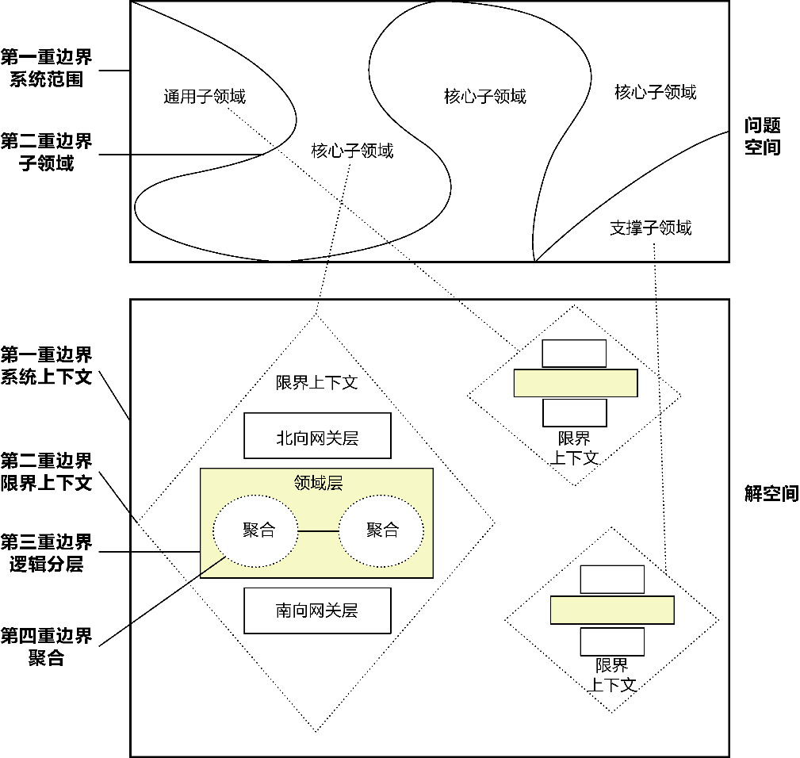

*图20-1 问题空间的分析边界与解空间的设计边界*

领域驱动设计在各个层次提出的核心模式具有不同的粒度和设计关注点，但本质都在于确定边界。毕竟，随着规模的扩大，一个没有边界的系统终究会变得越来越混乱；架构没有清晰的层次，职责缺乏合理的分配，代码就会变得不可阅读和维护，最终系统会形成一种无序设计。

我们看一个无序设计的软件系统，就好像隔着毛玻璃观察事物，系统中的软件元素都变得模糊不清，充斥着各种技术债。细节层面，代码污浊不堪，违背了高内聚松耦合的设计原则，导致要么放错了代码位置，要么出现重复的代码块；架构层面，缺乏清晰的边界，各种通信与调用依赖纠缠在一起，同一问题空间的解决方案各式各样，让人眼花缭乱，仿佛进入了没有规则的无序社会。

领域驱动设计问题空间的两重边界与解空间的四重边界可以保证系统的有序性。

#### 20.1.2 纪律是关键

不管一套方法体系多么完美，如果团队不能严格地执行方法体系规定的纪律，一切就都是空谈。ThoughtWorks的杨云就指出：“领域驱动设计是一种纪律，”他进一步解释道，“领域驱动设计本身没有多难，知道了方法的话，认真建模一次还是好搞的，但是持续地保持这个领域模型的更新和有效，并且坚持在工作中用统一语言来讨论问题是很难的。纪律才是关键。”

领域驱动设计强调对边界的划分与控制。如果团队在实施领域驱动设计时没有理解边界控制的意义，也不遵守边界的约束纪律，边界的控制力就会被削弱甚至丢失。例如，我们强调通过菱形对称架构隔离业务复杂度与技术复杂度，而团队成员在编写代码时却图一时的便捷，直接将网关层的代码放到领域模型对象中，或者为了追赶进度，没有认真进行领域建模就草率编写代码，却无视聚合对概念完整性、数据一致性的保护，领域驱动设计解空间强调的四重边界就形同虚设了。

纪律是关键，毕竟影响软件开发质量的关键因素是人，不是设计方法。对团队成员而言，学习领域驱动设计是提高技能，能否遵守领域驱动设计的纪律则是一种工作态度。需要向团队成员明确一个问题的答案：领域驱动设计到底有哪些必须遵守的纪律？

结合领域驱动设计的知识体系和统一过程，我总结了领域驱动设计的“三大纪律八项注意”，可作为团队的纪律规范。

·

      三大纪律：

·领域专家与开发团队在一起工作；

·领域模型必须遵循统一语言；

·时刻坚守两重分析边界与四重设计边界。

·

      八项注意：

·问题空间与解空间不要混为一谈；

·一个限界上下文不能由多个特性团队开发；

·跨进程协作通过远程服务，进程内协作通过应用服务；

·保证领域分析模型、领域设计模型与领域实现模型的一致；

·不要将领域模型暴露在网关层之外，共享内核除外；

·先有领域模型，后有数据模型，保证二者的一致；

·聚合的关联关系只能通过聚合根ID引用；

·聚合不能依赖访问外部资源的南向网关。

“三大纪律”是实施领域驱动设计的最高准则，是否遵守这“三大纪律”，决定了实施领域驱动设计的成败。“八项注意”则重申了设计要素与规则，并对设计规范进行了固化，避免因为团队成员能力水平的参差不齐导致实施过程的偏差。

当然，针对不同的项目、不同的团队，实施领域驱动设计的方式自然有所不同，在不违背“三大纪律”的最高准则下，团队也可以总结属于自己的“八项注意”，甚至更多的纪律条款。

### 20.2 领域驱动设计能力评估模型

要实施领域驱动设计，必须提高团队成员的整体能力。团队成员的能力与团队遵循的纪律是相辅相成的：能力足但纪律涣散，不足以打胜仗；纪律严而能力缺乏，又心有余而力不足。培养团队成员的能力并非一朝一夕之功，如果能够有一套能力评估模型对团队成员的能力进行评估，就能做到有针对性的培养。借助领域驱动设计统一过程引入的各种方法与模式，我建立了领域驱动设计的能力评估模型。

领域驱动设计能力评估模型(domain-driven design capability assessment model，DCAM)是我个人对领域驱动设计经验的一个提炼，可以指导团队进行能力的培养和提升。DCAM并非一个标准或一套认证体系，更非事先制订或强制执行的评估框架。建立这套模型的目的仅仅是更好地实施领域驱动设计。我不希望它成为一种僵化的评分标准，它应该是一个能够不断演化的评估框架。DCAM如图20-2所示，目前，它仅限于对象建模范式的领域驱动设计。

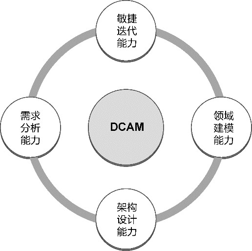

*图20-2 领域驱动设计能力评估模型*

图20-2所示的能力维度包括：

·敏捷迭代能力；

·需求分析能力；

·领域建模能力；

·架构设计能力。

根据能力水平，每个维度分为初始级、成长级和成熟级3个层次，各个层次的能力水平围绕领域驱动设计能力开展评估。层次越高，团队的领域驱动设计能力就越高，推行领域驱动设计成功的可能性也就越高。

#### 20.2.1 敏捷迭代能力

我认为，领域驱动设计之所以在近十余年未能取得举足轻重的成功，其中一个原因就是它没有与敏捷软件开发过程结合起来。敏捷开发的诸多实践，包括特性团队、持续集成、迭代管理等都可以为领域驱动设计的实施保驾护航。敏捷迭代能力等级评估标准如表20-1所示。

*表20-1 敏捷迭代能力等级评估标准*

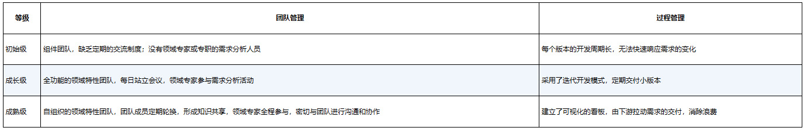

#### 20.2.2 需求分析能力

领域驱动设计的核心驱动力是“领域”，领域主要来自问题空间的业务需求。要从复杂多变的真实世界中提炼出满足建模需求的领域知识和领域概念，就要求团队具备成熟的需求分析能力。需求分析能力等级评估标准如表20-2所示。

*表20-2 需求分析能力等级评估标准*


#### 20.2.3 领域建模能力

团队成员的领域建模能力是推行领域驱动设计的基础，也是领域驱动设计有别于其他软件开发方法的根本。领域建模能力等级评估标准如表20-3所示。

*表20-3 领域建模能力等级评估标准*

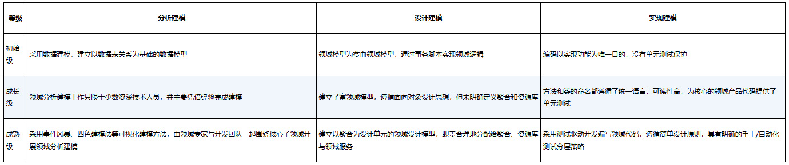

#### 20.2.4 架构设计能力

如果说领域建模完成了对问题空间真实世界的抽象与提炼，架构设计就是在解空间中进一步对领域模型进行规范，建立边界清晰、风格一致的演进式架构。架构设计能力等级评估标准如表20-4所示。

*表20-4 架构设计能力等级评估标准*


DCAM评估的这4种能力必须在领域驱动设计研发方法体系下进行，也对应了领域驱动设计统一过程中各个阶段的过程工作流与支撑工作流，是实施领域驱动设计统一过程的能力保障。当然，为了能够将该能力评估模型推广到领域驱动设计社区，我尽量避免将它与我提倡的领域驱动设计统一过程产生绑定关系。为此，我在确定评估标准时，选择了得到领域驱动设计社区普遍认可和推广的实践、方法和模式，由我提出的菱形对称架构、快速建模法、角色构造型、服务驱动设计以及对业务服务的抽象，都未体现在对应能力的评估标准中。

### 20.3 领域驱动设计参考过程模型

没有一套放之四海而皆准的过程方法能够一劳永逸地解决所有问题，但为了降低实施领域驱动设计的难度，确乎可以提供一套切实可行的最佳实践对整个过程进行固化与简化。这正是我提出领域驱动设计统一过程的主要原因。

领域驱动设计统一过程对领域驱动设计知识进行抽象与提炼，然后以一种标准而统一的过程为开发团队实施领域驱动设计形成指导，它的指导价值不言而喻。但就统一过程本身，它仅仅是一个抽象的过程体系。它虽然规定了在什么阶段应该采用什么样的工作流，但体系自身并没有确定究竟该用什么样的方法与模式帮助团队顺利地实施工作流。

为了帮助团队更好地实施领域驱动设计，有必要针对领域驱动设计统一过程做进一步的固化与简化，结合我个人实施领域驱动设计的经验，选择部分行之有效的方法与模式，填充到领域驱动设计统一过程的空白处，形成一套领域驱动设计参考过程模型。这套过程模型不能解决实施过程中的所有问题，也无法规避需要凭借经验的现实问题，但通过一些真实项目开发实践得到证明，它能够在一定程度降低实施门槛，从战略和战术层面获得高质量的领域模型。这一参考过程模型如图20-3所示。

整个参考过程模型通过业务流程泳道图体现，每个泳道代表领域驱动设计统一过程的一个阶段，矩形的流程图例代表领域驱动设计统一过程运用的方法或模式，文档图例代表融合了领域驱动设计模式的输出工件，虚线空心箭头为输入流，实线实心箭头为输出流。

从需求调研开始，参考过程模型建议使用商业模式画布对问题空间进行探索，获得利益相关者、系统愿景和系统范围，它们共同构成了目标系统的价值需求。根据价值需求的利益相关者，运用服务蓝图与业务流程图对业务需求进行梳理，获得业务流程。对业务流程按照业务目标进行时间上的阶段划分，就可以获得业务场景。对业务场景进一步分析，可以获得代表服务价值的业务服务。业务流程、业务场景和业务服务共同构成了目标系统的业务需求。

在系统愿景与系统范围的指导下，利用功能分类策略对问题空间进行分解，获得由核心子领域、通用子领域和支撑子领域组成的子领域。

参考全局分析阶段确定的价值需求，绘制业务序列图，通过C4模型的系统上下文图最终确定系统上下文。它确定了整个解空间的边界，明确了目标系统的解决方案范围，有助于我们确定哪些系统是目标系统、哪些系统是伴生系统，也确定了利益相关者、目标系统、伴生系统之间的关系。在系统上下文边界的约束下，以V型映射过程对业务服务表达的领域知识进行归类和归纳，获得体现业务能力的限界上下文，并运用菱形对称架构体现限界上下文的内部架构。需求分析人员在编写了业务服务规约之后，针对业务服务绘制服务序列图，结合业已识别出来的限界上下文，确定上下文映射模式，并为目标系统定义服务契约。最后在系统上下文边界的约束下，根据子领域和限界上下文之间的关系，确定系统分层架构。

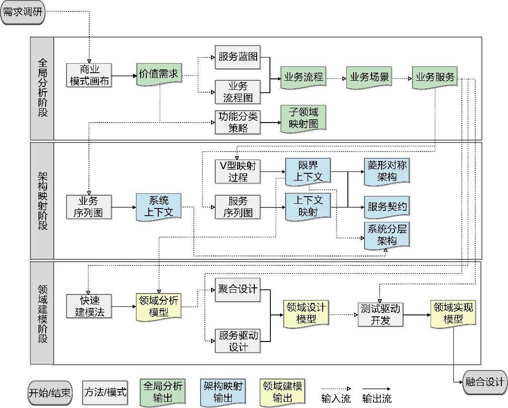

*图20-3 领域驱动设计参考过程模型*

领域建模需要在限界上下文的边界约束下进行。建模的前提是业务分析人员已经将全局分析阶段输出的业务服务细化为业务服务规约，在统一语言的指导下对其采用快速建模法获得领域分析模型。以领域分析模型为基础，运用聚合设计的庖丁解牛过程获得以聚合为核心要素的角色构造型，获得静态的领域设计模型。对业务服务开展服务驱动设计，根据业务服务规约定义的基本流程，将业务服务分解为任务树，分配职责获得序列图脚本，从而获得动态的领域设计模型。按照业务服务规约定义的验收标准，为任务树的每个任务编写测试用例，开展测试驱动开发，从而获得领域实现模型。领域分析模型、领域设计模型和领域实现模型共同构成了在限界上下文边界约束之下的领域模型，实现了战略设计与战术设计的融合。

领域驱动设计参考过程模型为领域驱动设计统一过程的每个阶段每个环节提供了具有实操性的方法和模式，也规定了每个阶段需要输出的工件。不过，我们还需要一个完整案例真实地展示它如何指导团队从问题空间走向解空间，最终获得高质量领域模型的过程。为此，我选择了一个中等规模的真实案例，全方位地展现在项目中如何实践领域驱动设计参考过程模型。这个真实案例就是企业应用套件(enterprise application suite，EAS)。

#### 20.3.1 EAS案例背景

企业应用套件是一款根据软件集团应用信息化的要求开发的企业级应用软件。该软件集团为各行各业提供软件交付服务，以在岸、近岸、离岸等多种模式交付软件。EAS系统提供了大量简单、快捷的操作界面，使得集团相关部门能够更快捷、更方便、更高效地处理日常事务工作，并为管理者提供决策参考、流程简化，建立集团与各部门、员工之间交流的通道，有效地提高工作效率，实现整个集团的信息化管理。

EAS系统为企业搭建了一个数据共享与业务协同平台，实现了人力资源、客户资源和项目资源的整合。系统包括人力资源管理、客户关系管理和项目过程管理等主要模块。系统用户为集团的所有员工，但角色的不同，决定了他们关注点之间的区别。

#### 20.3.2 EAS的全局分析

在全局分析阶段，需要针对目标系统进行价值需求分析。

**1.价值需求分析**

根据参考过程模型的描述，一种有效方法是通过商业模式画布来帮我们确定目标系统的客户、愿景和范围。EAS是一款面向B端的产品，它的客户实际上都是软件集团的员工。员工的角色不同，所属部门不同，职责也不相同，因而对其做客户细分非常有必要。实际上，我们在为EAS进行价值需求分析之前，重点调研了人力资源部、市场部与项目管理部的相关人员。作为支持者（提供部门的业务知识）与受益者（使用EAS的最终用户），他们各自提出了切合自身需要的业务功能，包括：

·市场部对客户和需求的管理，对合同的跟踪；

·项目管理部对项目和项目人员的管理，对项目进度的跟踪；

·人力资源部负责招聘人才，管理员工的日常工作包括工作日志、考勤等。

在对EAS的客户进行细分并确定各自的价值主张时，团队发现遗漏了最重要的利益相关者：集团管理层。作为集团业务的决策者，他们对业务目标的认识有利于更加准确地确定系统愿景。

作为一家提供软件交付服务的集团公司，核心生产力是从事软件开发的人力资源。各个业务部门的主要工作都是围绕着人力资源的供需进行的。决策者的痛点就是无法快速直观地了解公司人力资源的供需情况。例如，客户需要集团提供20名各个层次的Java开发人员，市场部门在确定是否签订该合同之前，需要通过EAS查询集团的人力资源库，了解现有的人力资源是否匹配客户需求。如果匹配，还需要各个参与部门审核人力成本，决定合同标的。如果集团当前的人力资源无法满足客户需求，就需要人力资源部提早启动招聘流程，或从人才储备库中寻找满足需求的候选人。通过EAS，管理人员还能够及时了解开发人员的闲置率，跟踪项目的进展情况，明确开发人员在项目中承担的职责和任务完成质量。

获得商业模式画布的渠道通路比较简单。这是因为EAS与其他创新产品不同，并不需要寻找各种渠道通路对产品进行宣传，只需利用行政力量要求相关部门使用即可。由此推导出来的客户关系，实际上就是对参与EAS系统的各种角色做进一步梳理，了解这些角色在什么时候会使用EAS，又该怎样使用EAS。

EAS是集团的内部系统，不牵涉具体的营收业务，因此它的收益来源更多地体现在对成本的控制和削减上，同时也包含该如何为集团的软件交付业务提供更好的服务与支持。虽然EAS的收益来源并不明显，但对它的思考有利于驱动我们对核心资源和关键业务的发掘。

为了保证EAS的顺利交付，需要哪些核心资源？交付的EAS能够提供哪些关键业务？在确定了EAS的客户、价值主张、收益来源等内容后，参与到商业模式画布头脑风暴的人员能够轻易回答这些问题。由于EAS主要解决人力资源问题，它需要的重要合作也应该与人力资源的招聘、培训有关。最后，EAS是企业内部系统，在考虑实现该系统之前，了解开发该系统需要的成本结构也就显得理所应当。由此，就可以获得图20-4所示的商业模式画布。

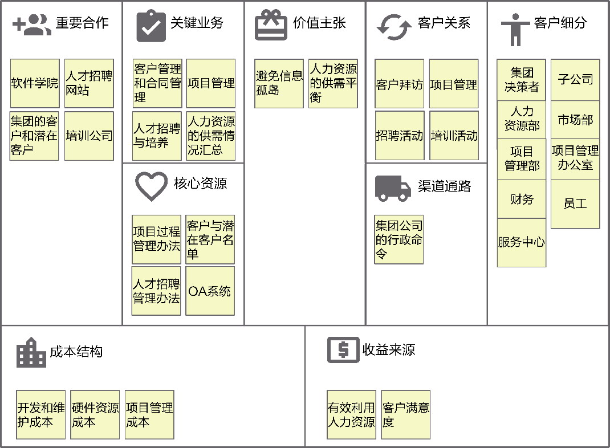

*图20-4 EAS的商业模式画布*

虽然EAS并非一个创新产品，但在全局分析阶段通过它探索价值需求，会更容易引导客户描绘出心中的设想，并通过这种可视化的形式将其真实地传递出来，形成对问题空间一致理解的，就价值需求达成共识。

一旦确定了商业模式画布的内容，就可以根据商业模式画布各个板块与价值需求之间的关系，获得EAS的价值需求，作为全局分析规格说明书的一部分。组成EAS全局分析规格说明书的价值需求如下所示。

1利益相关者

·集团决策者

·子公司

·人力资源部

·市场部

·项目管理部

·项目管理办公室

·财务

·员工

·服务中心

2 系统愿景

避免信息孤岛，实现人力资源的可控，从而达到人力资源的供需平衡。

3系统范围

3.1当前状态

·创建了由项目经理、业务分析师、开发人员和测试人员构成的特性团队

·集团项目管理部负责项目的流程管理

·集团已有OA系统作为部门之间的流程协作与消息通知

·集团已制订了人才招聘管理办法、项目过程管理办法

·软件学院和招聘网站的简历作为集团的人才储备库

·员工培训已有合作的培训公司

·市场部提供客户和潜在客户名单

·由集团下达行政命令在集团内部相关职能部门推广EAS系统

3.2 未来状态

·EAS系统在×年×月×日通过用户验收

·EAS系统在×年×月×日上线运行

·由EAS系统负责客户关系管理、项目管理、人力资源管理

·通过客户满意度评估EAS系统的价值

3.3 目标列表

·通过可视化方式体现人力资源的供需状况

·管理集团与客户和潜在客户之间的关系，管理市场需求，对合同进行跟踪

·管理项目和项目人员，跟踪项目进度

·实时调整用人需求，制订招聘和培训计划

·管理员工考勤、工作日志等日常工作

**2.业务需求分析**

在完成价值需求分析后，就可以在价值需求的引导与约束下开始业务需求分析。

业务需求分析起始于业务流程，能让目标系统的业务功能“动”起来，执行一系列的活动来满足参与角色的业务价值。为了快速把握EAS的需求全景，可以抓住体现业务愿景核心价值的主流程。既然EAS以“人力资源的供需平衡”为关注核心，那么所有参与角色需要执行的主要业务功能都与该核心价值有关。在价值需求的指引下，可以结合供需平衡将所有参与角色抽象为需求方与供应方，然后站在供需双方的角度思考各个参与角色之间的协作方式与协作过程，如图20-5所示。

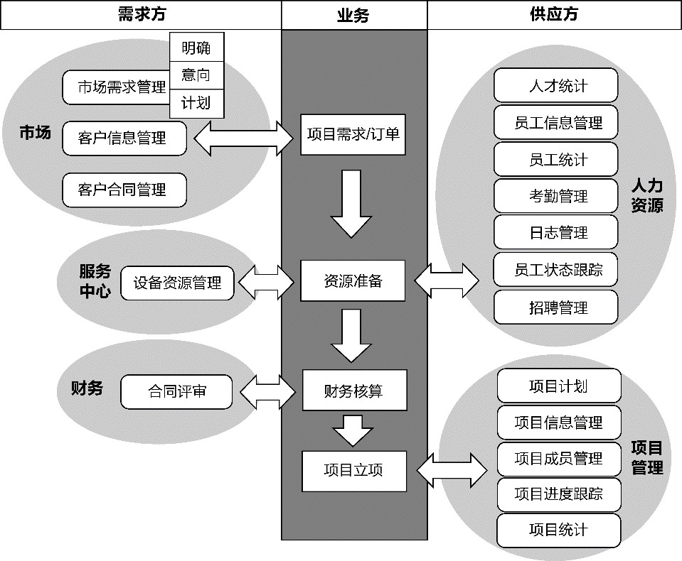

*图20-5 EAS的核心业务流程*

图20-5清晰地体现了需求与供应之间的关系，展现了核心业务流程的关键环节。注意，该协作示意图并非项目开始之前的当前状态，而是期望解决供需平衡问题的未来状态。这种协作关系也体现了打破部门之间信息壁垒的系统愿景。根据这一协作示意图，我们可以以泳道图形式的业务流程图表达整个系统的核心流程，如图20-6所示。

这个核心流程体现了业务流程的总体运行过程，属于更为宏观的业务流程表达。许多更为细致的协作细节并没有清晰地表现出来，项目管理流程和招聘流程更是作为子流程被“封装”起来了。为了更为详尽地探索问题空间，这些业务流程也需要进一步得到呈现。从目标系统为参与角色提供服务的角度，我们通过服务蓝图结合业务流程图呈现了EAS的以下业务流程。

·面向市场人员：客户合作的业务流程。

·面向项目管理人员：项目管理流程。

·面向培训专员：培训流程（培训需求是后续提出的需求变更）。

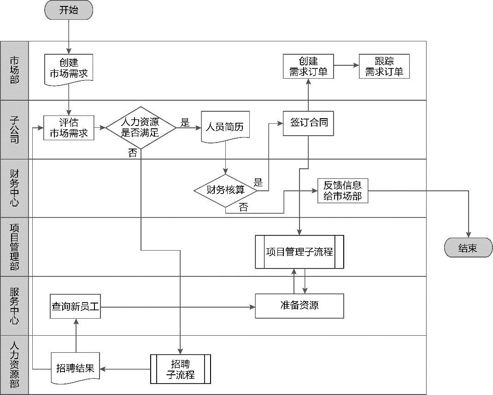

*图20-6 核心流程的泳道图*

由于EAS的所有用户都是组织内员工，如果使用服务蓝图绘制业务流程，客户角色就是向目标系统发起服务请求的用户，如签订合同业务流程中的市场人员、项目管理流程的项目管理人员和招聘流程的招聘专员。

(1)客户合作

当市场人员向目标系统发起创建市场需求的服务请求时，就形成了从市场需求到合同签订并形成需求订单的客户合作业务流程，它的服务蓝图如图20-7所示。

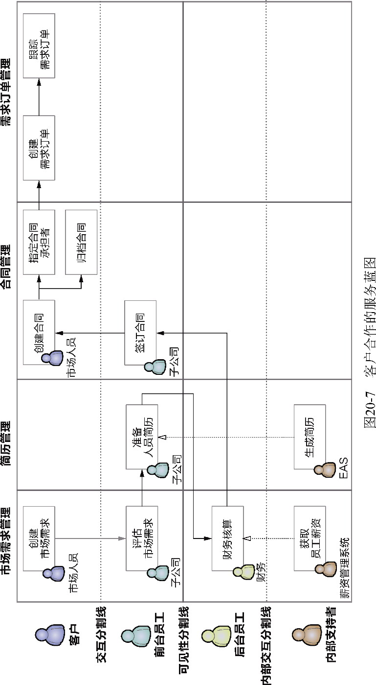

由于业务规则要求具有独立法人资格的子公司作为市场需求的承担者，因此子公司会成为合同中的乙方。市场人员作为服务蓝图中的客户，并不会参与合同的签订，只是关心子公司的现有资源能否满足市场需求。在签订了合同之后，市场人员可以通过合同信息创建需求订单，并跟踪需求订单，以保持与客户合作的良好关系。子公司作为前台员工需要与市场人员交互，但是市场人员却看不见财务的参与，因为财务核算行为发生在作为前台员工的子公司与财务之间，因此财务属于服务蓝图的后台员工。至于内部支持者，要么是EAS自身，要么就是EAS范围之外的外部系统。

根据客户合作流程的服务蓝图，整个流程由4个业务场景构成：市场需求管理、简历管理、合同管理和需求订单管理。根据业务服务的判断标准，对业务场景的活动进行判断，可以绘制出每个业务场景的业务服务图。

市场需求管理的业务服务图如图20-8所示。

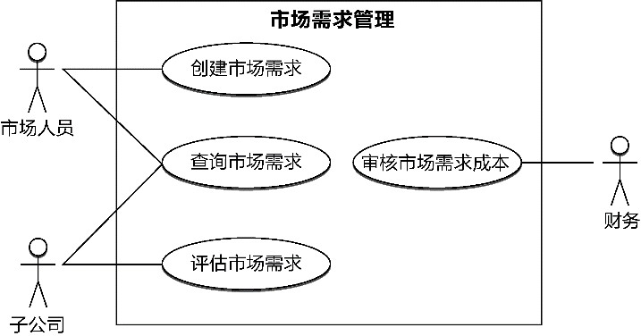

*图20-8 市场需求管理的业务服务图*

对“查询市场需求”业务服务而言，它虽然没有包含在服务蓝图，但在子公司对市场需求进行评估时，如果不提供这一功能，就无法获得指定的市场需求完成评估。二者提供的服务价值又是完全独立的，有必要为其单独定义一个业务服务。

简历管理的业务服务图如图20-9所示。

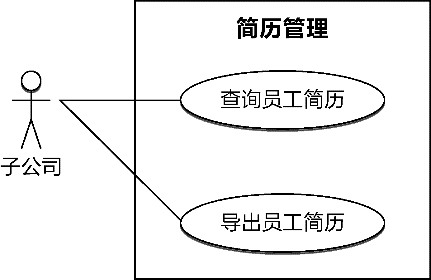

*图20-9 简历管理的业务服务图*

客户合作的业务流程说明是由系统生成员工简历，但实际上，这需要子公司的操作人员与系统进行一次交互，目的是导出员工简历，故而识别出该业务服务以满足功能需求。

合同管理的业务服务图如图20-10所示。

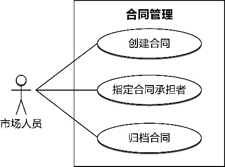

*图20-10 合同管理的业务服务图*

合同的签订在线下进行，EAS系统只负责维护合同信息，并将合同扫描版上传到系统中归档，以便市场人员查询合同信息，因此，业务流程中的签订合同活动并未出现在合同管理的业务服务图中。市场人员创建合同的目的其实是归档，以便相关人员（主要是市场人员）查询，故而“归档合同”体现了该业务服务的服务价值。

需求订单管理的业务服务图如图20-11所示。

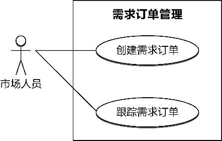

*图20-11 需求订单管理的业务服务图*

在梳理客户合作流程的业务服务时，我发现几个领域概念的定义并不清晰：合同、市场需求客户需求和需求订单之间的关系是什么？存在什么样的区别？

当我们发现有多个混乱的领域概念需要澄清时，就要建立统一语言，就这些领域概念达成一致共识。

通过与市场人员的交流，我发现市场部对这些概念的认识也是模糊不清的，甚至在很多场景中交替使用这些概念。在交谈过程中，他们有时还提到“市场需求订单”这个概念。例如在描写市场需求时，他们会提到“录入市场需求”，但同时又会提到“跟踪市场需求订单”和“查询市场需求订单”。在讨论“客户需求”时，他们提到了需要为客户需求指定“承担者”，在讨论“市场需求”时却并未提及这一功能。这似乎是“客户需求”与“市场需求”之间的区别。对于“合同”的理解，他们一致认为这是一个法律概念，等同于作为乙方集团或子公司和作为甲方的客户签订的合作协议，并以合同要件的形式存在。

鉴于这些概念存在诸多歧义，我们和市场人员一起梳理统一语言，一致认为需要引入“订单”(order)的概念。订单不是需求（无论是客户需求还是市场需求）。它借鉴了电商系统中的订单概念，用于描述市场部与客户达成的合作意向。每个合作意向可以包含多个客户需求，相当于订单中的订单项。例如，同一个客户可能提出3条客户需求：

(1)需要5名高级Java程序员、10名中级程序员；

(2)需要8名初级.NET程序员；

(3)需要开发一个OA系统。

这3条客户需求组成了一个订单。一个订单到底包含哪几个客户需求，取决于市场部与客户洽谈合作的业务背景。

引入订单概念后，市场需求与客户需求的区别也就一目了然了。市场需求是市场部售前人员了解到的需求，并未经过评估；公司也不知道能否满足需求，以及该需求是否值得去做。这也是市场需求无须指定“需求承担者”的原因。市场需求在经过各子公司的评估以及财务人员的审核后，就可以得到细化，并在与客户充分沟通后，形成订单。每一条市场需求通过评估，转换为订单中的客户需求。

我们仍然保留了“合同”的概念。“合同”领域概念与真实世界的“合同”法律概念相对应。它与订单存在相关性，但本质上并不相同。例如，一个订单中的每个客户需求可以由不同的子公司来承担，但合同却规定只能有一个甲方和一个乙方。订单没有合同需要的那些法律条款。未签订的合同内容确实有很大部分来自订单的内容，但也只是商务合作内容的一部分而已。在确定了订单后，市场部人员可以跟踪订单的状态，并且在订单状态发生变更时，修改对应的合同状态，但合同的状态与订单的状态并不一致。

在全局分析阶段执行业务需求工作流时，一定要使用统一语言。我们通过业务服务图将业务服务可视化后，对于每一个可能产生歧义的领域概念，一定要大声说出来，及时消除分歧与误解，形成团队内部的统一语言。

(2)项目管理

当项目管理人员（通常为指定该项目的项目经理）开始发起项目立项的服务请求时，就形成了从立项到结项一个完整的项目管理流程，其服务蓝图展现如图20-12所示。

项目管理流程由项目管理人员提交立项申请开始，从管理角度经历了一个项目的完整生命周期。项目管理人员扮演了服务蓝图的客户角色，整个流程的各个阶段都是为项目管理人员服务的。诸如子公司、项目管理部、项目成员和服务中心等只参与项目管理流程，提供交互或支撑行为。

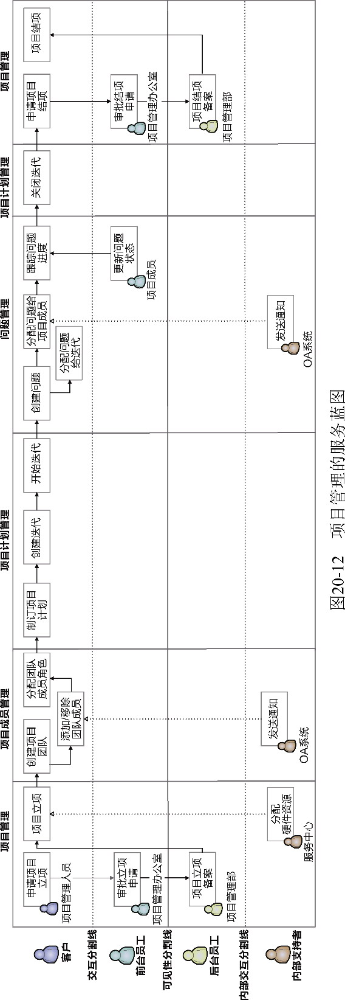

项目管理流程为项目管理人员提供了业务价值。如果要体现目标系统为项目成员提供的业务价值，就需要将项目成员当作服务蓝图的客户，思考它的客户旅程，例如处理迭代问题的流程。可以单独为这个流程绘制服务蓝图。由于视角不同，参与角色的身份也会发生变化。

项目管理流程根据业务目标的不同，分成了4个业务场景：项目管理、项目成员管理、项目计划管理和问题管理。此外，服务中心对硬件资源的分配属于项目管理场景的支持场景，也需要考虑。

在项目管理流程中，同为项目管理目标的业务场景被拆分到首尾两个阶段。在确定项目管理场景的业务服务图时，需要将这两个阶段的业务服务统一，形成图20-13所示的项目管理业务服务图。

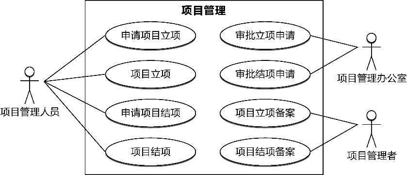

图20-13 项目管理的业务服务图

服务中心对硬件资源的分配支持了项目立项活动，为整个项目的项目组分配了资源，作为一种支撑活动放在一个单独的业务场景中。其业务服务图如图20-14所示。


*图20-14 资源分配的业务服务图*

分析项目成员管理场景的活动。在添加或移除团队成员时，需要通过OA系统发送通知。通知的发送不在目标系统范围内，也不是由某个参与者发起，而是在添加或移除了团队成员之后进行，属于业务服务的执行步骤，不需要列入图20-15所示的业务服务图。

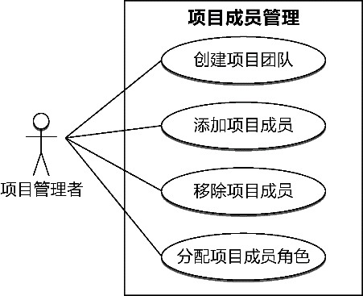

图20-15 项目成员管理的业务服务图

项目计划管理也分成了两个阶段，合并为一个业务服务图，如图20-16所示。

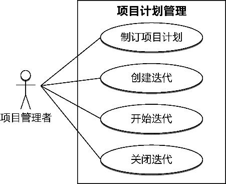

*图20-16 项目计划管理的业务服务图*

问题管理业务场景的业务服务图如图20-17所示。

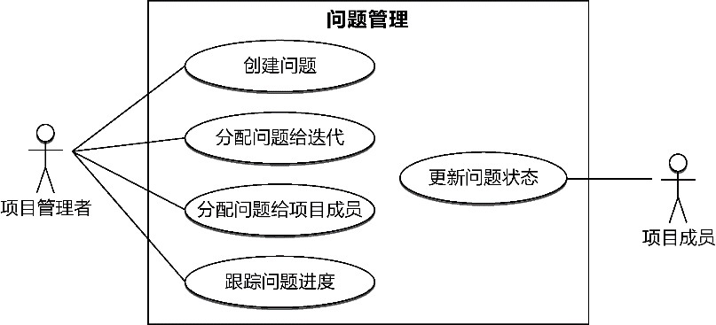

*图20-17 问题管理的业务服务图*

“问题”(issue)概念的获得并非一蹴而就。一开始，我倾向于使用任务(task)来表达这一概念，然而，在需求管理体系中，任务与用户故事(user story)、史诗故事(epic)、缺陷(defect)属于同一等级的概念，我需要寻找到一个抽象概念来同时涵盖这几个概念，由此就得到了“问题”概念。在Jira和GitHub的需求管理工具中，都使用了这一领域概念。

项目管理者在创建问题时，会指定问题的基本属性，如问题的标题、描述、问题类型等。那么，问题所属的迭代、承担人(owner)、报告人(reporter)是否也属于问题的属性呢？在确定问题管理业务场景的业务服务图时，我确实困惑不已。例如“分配问题给迭代”与“分配问题给项目成员”都可以认为是在编辑问题的属性。既然业务服务为角色提供了服务价值，很明显，无论是将一个创建好的问题分配给迭代，还是将其分配给项目成员使其成为问题的承担人，都具有项目管理价值，是由项目管理者向目标系统发起的一次独立而完整的功能交互，应该分别识别为两个业务服务。

在确定项目管理的业务服务时，统一语言再一次发挥了价值。最初在确定项目管理的业务流程时，项目管理者要查看问题的完成情况以了解迭代进度，故而将该流程中的一个活动命名为“查看问题完成情况”。在识别业务服务时，我认为该名称没有清晰地体现该业务服务的服务价值，经过与业务分析人员沟通，认为该业务服务需要清晰地表达问题在迭代周期内的过程，准确的术语是“进度”(progress)，将其命名为“跟踪问题进度”(tracking issue progress)更加符合该领域的统一语言。

(3)培训

培训的目的是提高员工的技能水平，需要根据员工的职业规划与企业发展制订培训计划，开展培训。培训的整个管理由人力资源部的培训专员负责。培训流程除了牵涉到培训专员，还牵涉到部门协调者、员工主管和员工本人。系统将分配给员工的培训机会称为票(ticket)，这实际上是领域概念的一种隐喻。培训专员发起培训的过程，实际上就是分配票的过程，整个流程如图20-18所示。

培训专员在分配票之前，会设定过滤器。过滤器主要用于过滤员工名单，获得一个与该培训相匹配的提名候选名单(candidate)。培训专员将票分配给部门协调者，部门协调者再将票分配给属于提名候选名单中的部门员工。员工在收到培训邮件后，可以选择“确认”或“拒绝”，若员工拒绝，票会退回给部门协调者，由部门协调者进行再分配，最终会形成一个提名名单(nomination)。

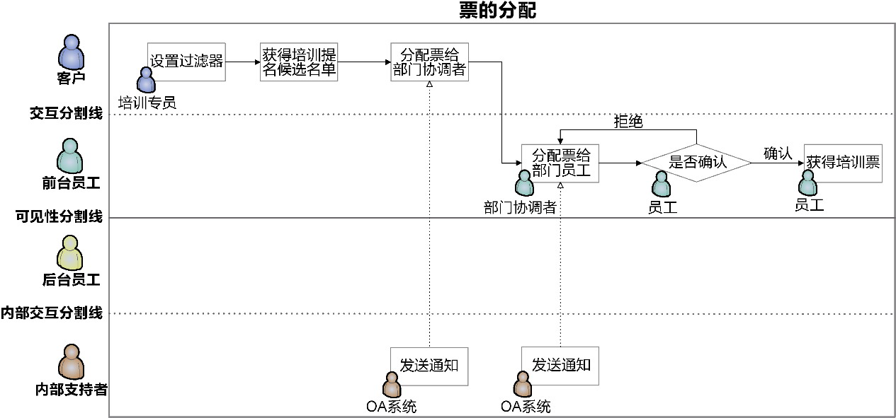

*图20-18 分配票的服务蓝图*

培训期间，每个参与培训的员工都需要通过培训专员出示的二维码签到，包括培训开始签到和培训结束签到。培训结束后，培训专员可以获得出勤名单。比较出勤与提名名单，可以获得缺席名单。培训专员确认了缺席名单后，系统会根据黑名单规则将缺席人员加入黑名单。员工若被列入黑名单中，将来就不会再出现在提名候选名单中，除非又被移出了黑名单。培训流程如图20-19所示。

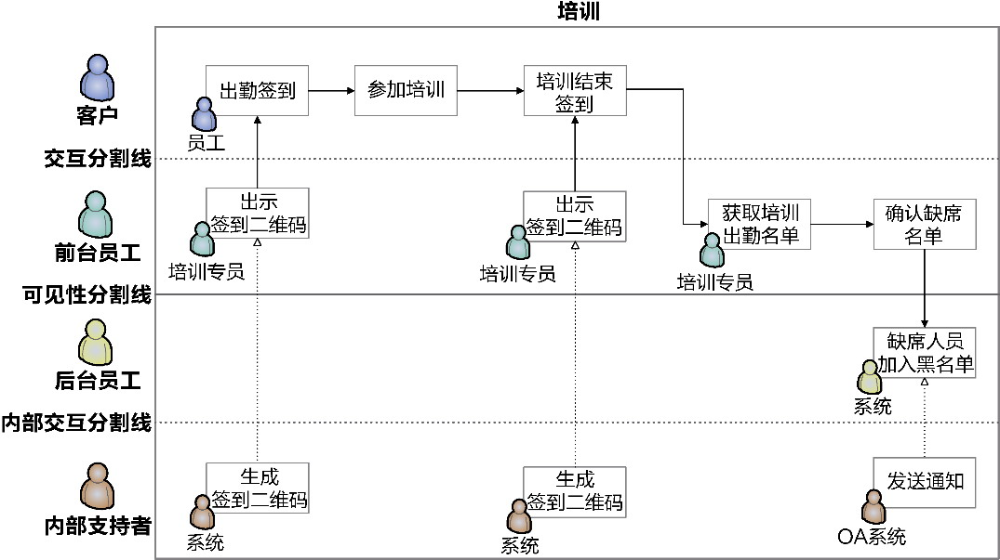

*图20-19 培训的服务蓝图*

培训专员在确定培训计划并分配票时，还可以事先设置有效日期，用于判断票的有效期限。从发起培训开始，到培训结束，一共有4个重要的截止时间(deadline)：

·提名截止时间；

·缺席截止时间；

·培训开始前；

·培训结束前。

在不同的截止时间，员工取消票的流程都不一样，票的处理规则也不相同，如图20-20所示。

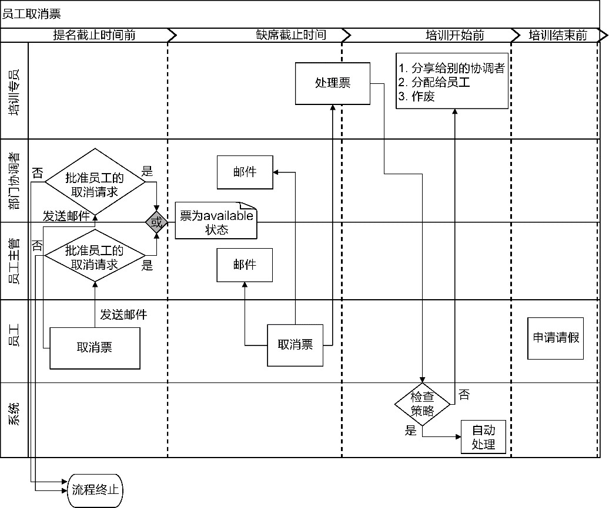

*图20-20 员工取消票的流程图*

在提名截止时间之前，获提名的员工可以取消票。取消后，系统会分别发送邮件给部门协调者与员工主管，只要任意一人批准了该取消请求，就认为取消成功，该票又会恢复到可用状态。在缺席截止时间之前，员工可以取消票。取消后，系统会发送邮件通知部门协调者和员工主管，但无须他们审批，而是直接由培训专员负责处理该票。处理票时，会先检查分配该票时设置的活动(action)策略，要么由系统自动处理，要么由培训专员处理该票。处理票有3种活动策略：

·将票分享给别的协调者；

·将票分配给员工；

·让票作废。

在培训开始前，不允许员工再显式地取消票。如果员工在收到票后一直未确认，系统会检查分配该票时设置的策略，要么由系统自动处理，要么由培训专员处理该票，处理票的策略与前相同。一旦培训开始后，就不再允许员工取消票，如果有事未能出席，应提交请假申请。

部门协调者在将票分配给员工后，也可以取消已经分配出去的票。不同截止日期的取消流程不同，如图20-21所示。

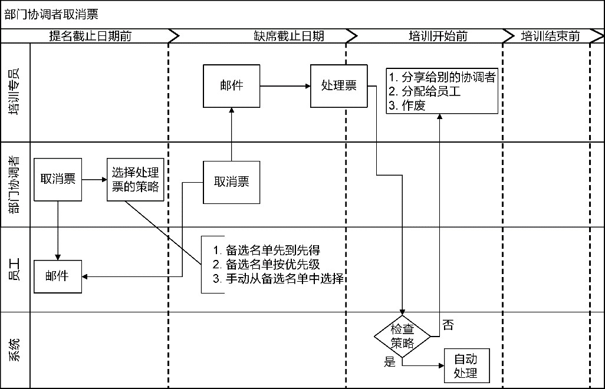

*图20-21 部门协调者取消票的流程图*

部门协调者取消票的流程与员工取消票的流程比较相似，不同之处在于取消票时无须审批，直接就可处理。在提名截止时间之间，处理票的活动策略有3种：

·备选名单先到先得；

·备选名单按优先级；

·手动从备选名单中选择。

这里的提名备选名单(backup)就是从之前设置的过滤器生成的提名候选名单中剔除掉已经被提名的员工列表后的名单。

培训专员也可以取消票，其流程如图20-22所示。

该执行流程与部门协调者取消票的流程几乎完全相同，这里不再赘述。

在分析培训流程时，我分别运用了服务蓝图和业务流程图展现了分配票、培训和取消票的业务流程，并根据不同阶段的业务目标确定了业务场景。

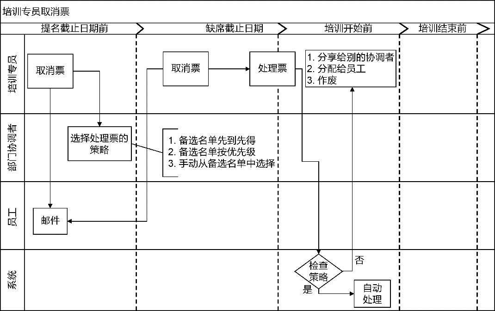

*图20-22 培训专员取消票的流程图*

票的分配业务服务图如图20-23所示。

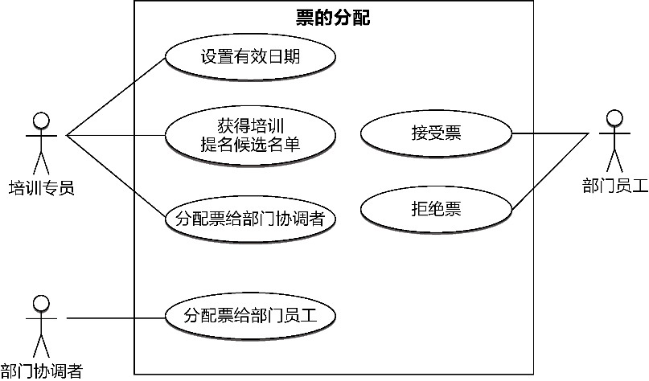

*图20-23 分配票的业务服务图*

在明确票的分配业务场景下的业务服务时，我们发现关于“票的分配”存在两个不同的业务服务：

·分配票给部门协调者；

·分配票给部门员工。

票的分配目标不同，而行为都是分配，是否存在语义不清的问题？实际上，虽然都是对票的分配操作，但它们的业务含义与服务价值完全不同。获得票的部门协调者并非票的拥有者，不会参加培训，而是拥有了分配票的资格，可以将票进一步分配给员工。为避免混淆这两个概念，可以将分配票给部门员工的操作视为对员工的提名。这就明确了如下概念。

·分配票给部门协调者：获得票的员工为部门协调者，并非参加培训的员工。

·提名部门员工：将票分给部门员工，使得他（她）具备了参加培训的资格。

虽然都是部门员工，但是在分配票和培训的不同业务场景中具有不同的身份。明确这些身份（角色），可以更加准确地体现部门员工与培训的不同关系。

·候选人：利用过滤器筛选或直接添加的员工，都是培训的候选人。这些候选人具备被培训专员或协调者提名参加培训的资格，但并不意味着候选人已经被提名了。

·被提名人：指获得培训票要求参加培训的员工，即被提名的对象。

·备选人：指备选名单中的员工，备选名单是提名候选名单中剔除掉被提名人的员工列表。

·学员：被提名人在收到培训票后确认参加，就会成为该培训的学员。

无论是明确“分配”的含义，还是进一步细化部门员工的不同身份，都是在定义和提炼统一语言。这些统一语言的确定需要即刻反映在业务服务图中。

票的取消业务服务图如图20-24所示。

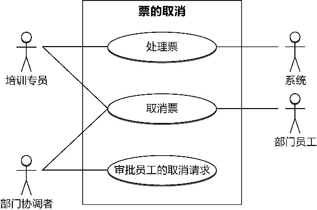

*图20-24 票的取消业务服务图*

不同参与者的取消流程虽然不同，但在业务服务图中，实际要执行的业务服务都是“取消票”。培训专员和系统都可以处理票，区别在于一个是人工，一个是自动，后者的触发条件与触发时机相对比较复杂。对这些领域逻辑的描述可以在领域建模阶段通过业务服务规约进一步细化。

获得提名并参加培训的部门员工称为“学员”，如此可以更好地体现其身份。培训的业务服务图如图20-25所示。

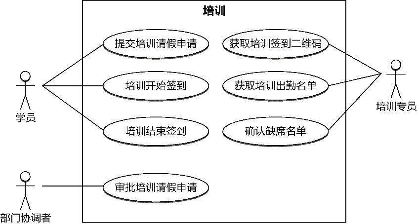

*图20-25 培训的业务服务图*

培训业务规则规定，如果学员没有提交培训请假申请或请假申请未通过，却未曾参加培训且未签到，会被视为缺勤。在培训流程的服务蓝图中，根据业务规则，缺勤学员会被放入黑名单，然而这一活动并未在业务服务图中体现出来。这是因为学员被加入黑名单实际是“确认缺勤名单”业务服务产生的一个结果，并非一个独立的业务服务。

分析EAS的业务需求时，从业务流程到业务场景，再从业务场景到业务服务，应该是一个水到渠成的过程。在这个过程中，最好能引入“现场客户”（极限编程中的一个实践），共同探索业务需求，梳理出问题空间的业务需求全貌。

为了避免分析瘫痪，在全局分析阶段，业务需求分析在获得业务服务这个粒度时就可以结束，进入架构映射阶段。然而，对业务服务做进一步细化仍然属于需求分析的过程，与开发团队开展架构映射属于两个并行不悖的工作，细化获得的业务服务规约也将作为领域建模阶段的重要输入。因此，需求分析人员也可在全局分析阶段针对核心子领域的业务服务编写业务服务规约。

组成EAS全局分析规格说明书的业务需求如下所示。

1业务流程

包括EAS的核心流程与各个具体的业务流程，可通过业务流程图或服务蓝图呈现。前文已述，现略去。

2 业务场景和业务服务

针对每个具体的业务流程，按照业务目标进行划分，获得每个具体的业务场景，并按照业务服务的判断标准识别业务服务，通过业务服务图呈现出来。前文已述，现略去。

3 业务服务规约

对每个业务服务进行细化，获得业务服务规约。

3.1 客户合作

3.1.1 市场需求管理

(1)创建市场需求

服务编号：EAS-0001

服务描述：

作为市场人员

我想要创建一条市场需求

以便随时了解市场需求的状态

触发事件：

市场人员输入市场需求，点击“创建”按钮

基本流程：

1.验证输入的市场需求，包括需求名称、描述、客户、备注

2.按照规则生成市场需求编号

3.验证市场需求名称是否已经存在

4.创建市场需求

替代流程：

1a.当市场需求名称在系统中已存在，给出提示信息

4a.若市场需求创建失败，给出失败原因

验收标准：

1.市场需求的名称只能为中文、英文或数字，长度不超过50个字符，不能重复

2.输入的市场需求中，必须包含市场需求名称、描述和客户，客户为系统已有客户，备注为可选

3.市场需求编号规则为：EAS-客户ID-自增长数，市场需求编号不允许重复

4.市场需求被成功创建

3.1.2合同管理

(1)归档合同

服务编号：EAS-0011

服务描述：

作为市场人员

我想要对合同进行归档

以便保存合同副本，避免合作纠纷

触发事件：

市场人员选择合同文档，点击“上传”按钮

基本流程：

1.验证文档类型的有效性

2.上传合同文档

3.保存合同文档

4.更新合同信息

替代流程：

1a.若上传的文档类型并非PDF文档，给出提示信息

2a.若上传的文档超出系统规定的文件大小，给出提示信息

3b.若上传合同文档时，文件传输失败，给出失败原因

4a.更新合同信息失败，给出失败原因

验收标准：

1.归档的合同文档只能为PDF文件，可仅验证文档文件的扩展名

2.服务器归档主文件夹为contract/archive，归档保存时，需验证该文件夹是否存在，如果不存在，需要创建该文件夹

3.为合同归档文件创建子文件夹，子文件夹名为合同ID

4.若归档时，在指定文件夹中已有同名文件存在，则为“另存为”操作，当前文件名增加“(1)”作为后缀

5.合同的归档文件属性添加归档文件夹路径

……

3.3项目管理

……

3.3.3项目成员管理

(1)添加项目成员

服务编号：EAS-0105

服务描述：

作为项目管理者

我想要添加项目成员

以便管理项目成员

触发事件：

项目管理者选定员工和项目角色，点击“添加”按钮

基本流程：

1.验证员工是否工作在其他项目

2.将员工加入项目团队，成为项目成员

3.修改员工的工作状态

4.发送邮件通知员工

5.为员工简历追加项目经验

替代流程：

1a.选定员工如果已经加入其他项目，给出提示

2a.添加员工失败，给出错误信息

5a.若员工已具备该项目经验，则忽略

验收标准：

1.选定的员工应为“on bench”状态

2.员工被加入项目团队后，状态应变更为“项目中”

3.员工简历中的项目经验信息不能重复

4.员工简历中的项目经验包括：项目名称、项目描述、担任的项目角色

**3.划分子领域**

全局分析阶段对问题空间的识别也是对客户痛点与系统价值的识别。之所以要开发目标系统，就是要解决客户的痛点，并为客户提供具有业务价值的功能。在识别痛点与价值的过程中，需要始终从业务期望与愿景出发，与不同的利益相关者进行交流，如此才能达成对问题空间的共同理解。

对EAS而言，集团决策层要解决“供需平衡”这一根本的痛点，就需要及时了解当前有哪些客户需求、目前又有哪些人力资源可用，这就需要打破市场部、人力资源部和项目管理部之间的信息壁垒，对市场需求、人力资源、项目的信息进行统计，提供直观的分析结果，进而根据这些分析结果为管理决策提供支持。我们需要就这几个主要部门了解部门员工的痛点和对价值的诉求。

市场部员工（市场人员）面临的痛点是无法通过人工管理的方式高效维护与客户的良好合作关系，故而其价值诉求就是提高客户关系管理的效率，使得能够快速地响应客户需求，敏锐地发现潜在客户，掌握客户动态，进而针对潜在客户开展针对性的市场活动。市场部员工希望能够建立快速通道，及时明确项目承担者（即子公司）是否能够满足客户需求，降低市场成本。市场部门还需要准确把握需求的进展情况，跟进合同签署流程，提高客户满意度。

人力资源部员工（招聘专员）的痛点是需要制订合理的招聘计划，使得聘用的人才满足日益增长的客户需求，又不至于产生大量的人力资源闲置，导致集团的人力成本浪费。站在精细管理的角度考虑，从潜在的市场需求开始，招聘专员就需要与市场部、子公司共同确定招聘计划。制订计划的依据在于潜在的人力资源需求，包括对技能水平的要求、语言能力的要求，同时也需要考虑目前子公司的员工利用率，并参考历史的供需关系来做出尽可能准确的预测。员工的技能是一种重要的输出资源，人力资源部需要针对客户对人员能力的要求制订培训计划，在企业内部组织员工培训，提升员工技能，如此就能以最小成本输出最大的人力资源价值。因此，人力资源部的价值诉求就是让招聘与培训具有计划前瞻性与精确性，更好地在客户需求与人力资源之间维护供需的平衡。

项目管理部负责企业的“生产管理”，对项目以及项目成员的管理直接关系到客户满意度。在没有EAS之前，市场部的苦恼是不了解已签合同的项目执行情况，即使市场部主动与项目管理部进行沟通，项目管理部也无法提供精确的项目信息，更谈不上及时了解项目的进度情况。因此，市场部的价值诉求是了解项目进度以促进与客户的良好合作关系，而项目管理部的价值诉求是及时了解项目过程执行情况，发现不健康的项目，通过项目管理手段规避延迟交付甚至交付失败的风险，提高项目的成功率。

识别了痛点与价值，即可借此划分子领域细分问题空间。并通过识别核心子领域、通用子领域和支撑子领域来区分核心问题和次要问题。

由于EAS是为软件集团应用信息化服务的，我们可以在识别出痛点与价值的基础之上，从业务职能与业务概念相结合的功能分类策略确定整个问题空间的子领域，由此获得的核心子领域如下：

·决策分析；

·市场需求管理；

·客户关系管理；

·员工管理；

·人才招聘；

·技能培训；

·项目进度管理。

除了这些核心子领域，诸如组织结构、认证和授权都属于通用的子领域，每个核心子领域都需要调用这些子领域提供的功能。注意，虽然通用子领域提供的功能不是系统业务的核心，但缺少这些功能，业务却无法流转。之所以没有将这些功能识别为核心子领域，是因为有对问题空间的理解分析。例如，组织结构管理是保证业务流程运转以及员工管理的关键，用户的认证与授权则是为了保证系统的访问安全，都没有直接对“供需平衡”这一业务愿景提供业务价值，因而不是利益相关人亟待解决的痛点。

在分辨系统的利益相关者时，服务中心作为参与EAS的业务部门，主要为项目及项目人员提供工位和硬件资源，要解决的是资源分配的问题。这一功能的引入固然可以帮助企业降低运营成本，却与价值需求中的系统愿景没有直接关系，因此可以将该子领域作为一种支撑子领域。除此之外，消息通知和文件上传下载也支持了大部分核心领域的执行活动，都属于独立的支撑子领域。

EAS的子领域映射图如图20-26所示。

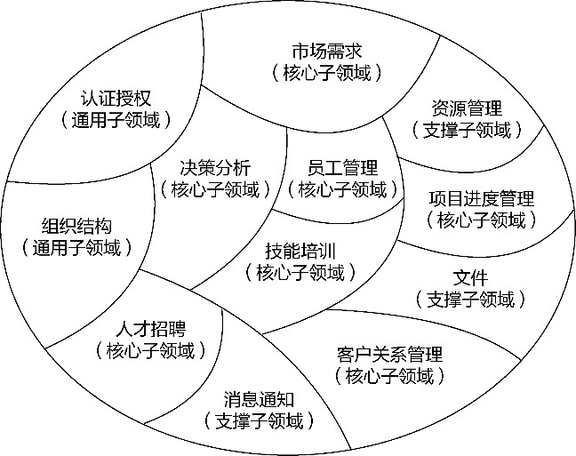

*图20-26 EAS的子领域映射图*

划分子领域分解了问题空间，使得团队能对EAS达成共同理解，识别出来的各个子领域也将作为解空间形成的架构方案的参考，尤其是系统分层架构的参考。子领域也属于全局分析规格说明书的一部分。

#### 20.3.3 EAS的架构映射

通过对EAS展开全局分析，我们已经获得了EAS系统的价值需求和业务需求。接下来，我将延续全局分析阶段输出的这些成果，开展架构映射，获得遵循领域驱动架构风格的架构映射战略设计方案。

**1.映射系统上下文**

全局分析阶段确定了EAS的利益相关者。通过对目标系统的分析，可以得出参与系统上下文的用户包括：集团决策者、市场部、人力资源部、项目管理部、子公司、服务中心、财务、员工。

整个目标系统就是EAS系统。在确定系统范围时，系统的当前状态告诉我们：集团已有OA系统提供部门之间的流程协作与消息通知，它是EAS系统的伴生系统。系统的当前状态虽然还告知软件学院和招聘网站的简历会作为集团的人才储备库，却并未确认EAS系统是否需要和软件学院与招聘网站集成。通过招聘流程服务蓝图可以确知，这些简历信息需要招聘专员手工录入EAS系统，因此，EAS系统的伴生系统并不包含软件学院和招聘网站。客户合作流程服务蓝图中的内部支持者包含了薪资管理系统，调用它提供的服务接口可以获得员工薪资，以便财务进行财务核算，这说明薪资管理系统也是EAS系统的伴生系统。EAS系统的系统上下文如图20-27所示。

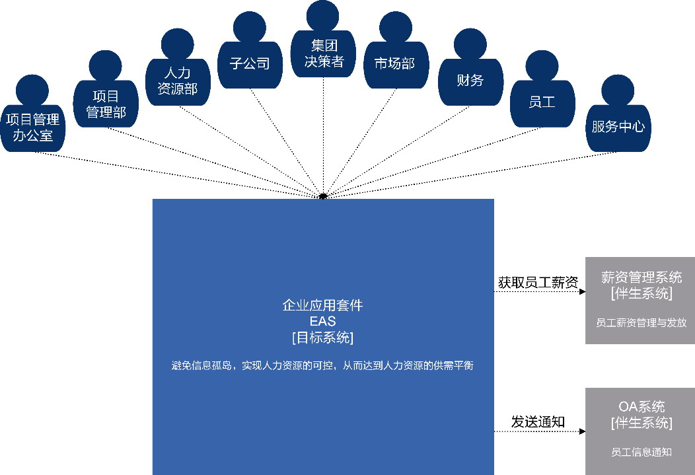

*图20-27 EAS系统的系统上下文*

确定了系统上下文，就确定了EAS系统的解空间，同时也确定了位于解空间之外的伴生系统。

**2.映射限界上下文**

在全局分析阶段，EAS系统的问题空间被分解为业务场景下的各个业务服务。遵循业务维度的V型映射过程，需要针对这些业务服务进行归类和归纳，获得各个业务主体，再根据亲密度和限界上下文的特征对业务主体的边界进行调整，并运用验证原则验证业务边界的合理性。之后，根据管理维度的工作边界、技术维度的应用边界逐步对限界上下文做进一步的调整。

(1)归类与归纳

V型映射过程从识别业务服务的语义相关性与功能相关性开始。

语义相关性主要针对业务服务名的名词。例如，在客户活动业务流程中，诸如“创建合同”“添加附加合同”“指定合同承担者”等业务服务都包含“合同”一词，可归类到同一个业务主体，如图20-28所示。

功能相关性则从业务服务的业务目标进行归类，如图20-29中的业务服务都与市场管理的业务目标有关，可归类到同一个业务主体。

通过语义相关性和功能相关性对业务服务进行归类后，可以进一步针对它们表达的概念建立抽象，寻找共同特征完成对类别的归纳。例如，图20-29中的业务服务涵盖了市场需求、需求订单、客户需求等领域概念，它们都可以提炼为一个更高的抽象层次——市场。这也是图中业务主体名称的由来。从中也可发现，虽然归类与归纳属于V型映射过程的两个环节，但这两个环节并没有清晰的界限，在进行归类时，可以同时进行归纳。

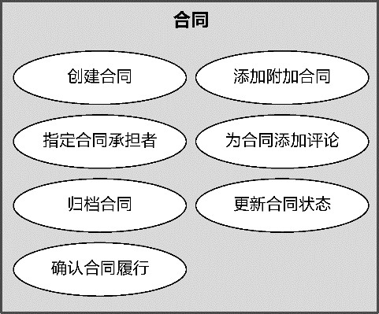

*图20-28 合同的业务主体*

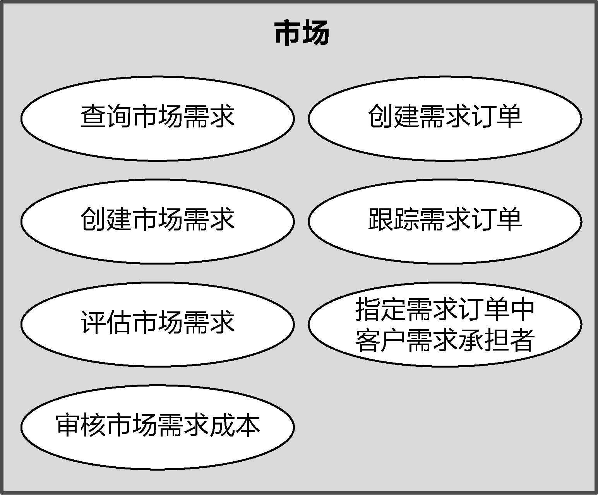

*图20-29 市场业务主体*

无论是寻找领域概念的共同特征，还是识别领域行为的业务目标，都需要一种抽象能力。在进行抽象时，可能出现“向左走还是向右走”的困惑，因为抽象层次的不同，抽象的方向或依据亦有所不同。这时就需要做出设计上的决策。

例如对识别出来的“员工”与“储备人才”领域概念，可以抽象出“人才”的共同特征，得到图20-30所示的人才业务主体。从共同的业务目标考虑，储备人才又是服务于招聘和面试的，似乎归入招聘业务主体才是合理的选择，如图20-31所示。

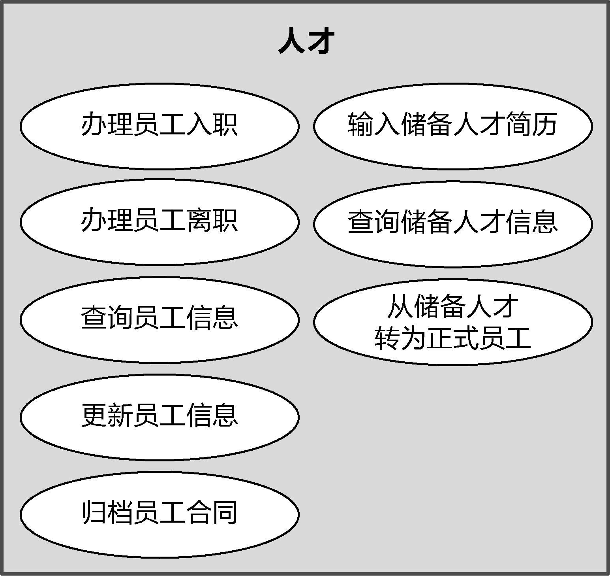

*图20-30 人才业务主体*

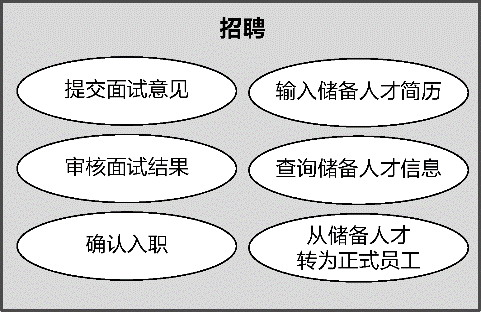

*图20-31 招聘业务主体*

还有第三种选择，就是将储备人才单独抽离出来，形成自己的储备人才业务主体，如图20-32所示。

该如何抉择呢？我认为须得思考识别业务主体的目的。业务主体是架构映射过程的中间产物，并非最终的设计目标。业务主体是对业务服务的分类，为限界上下文的识别提供了参考。因此，选择人才主体，还是招聘主体，或者单独的储备人才主体，都需要从限界上下文与领域建模的角度去思考。如果暂时分辨不清楚，可以先做出一个初步选择，待所有的业务主体都归纳出来之后，在梳理业务主体的边界时再决定。

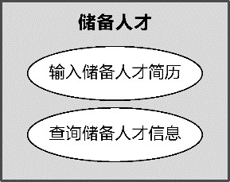

*图20-32 储备人才业务主体*

识别业务主体不是求平衡，更不是为了让设计的模型更加好看。业务主体是根据业务相关性进行归类和归纳的，必然会出现各个业务主体包含的业务服务数量不均等的情形。例如，与项目管理有关的业务主体，包含的业务服务数量非常不均匀。项目业务主体的业务服务数量最多，如图20-33所示。

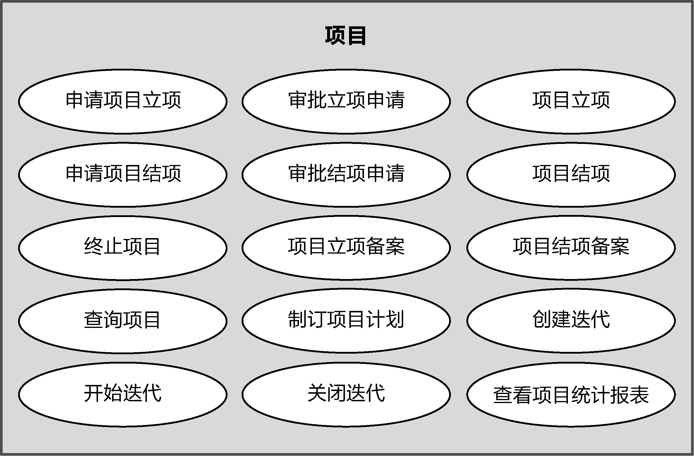

*图20-33 项目业务主体*

问题业务主体的业务服务数量也比较多，如图20-34所示。

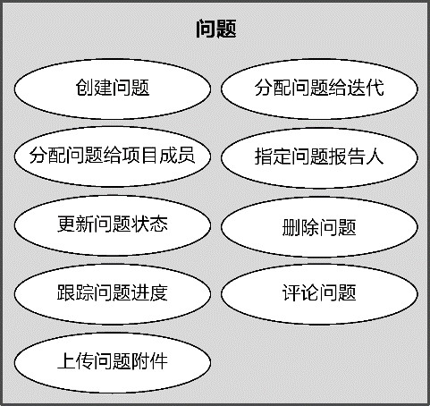

*图20-34 问题业务主体*

项目成员业务主体的业务服务最少，如图20-35所示。

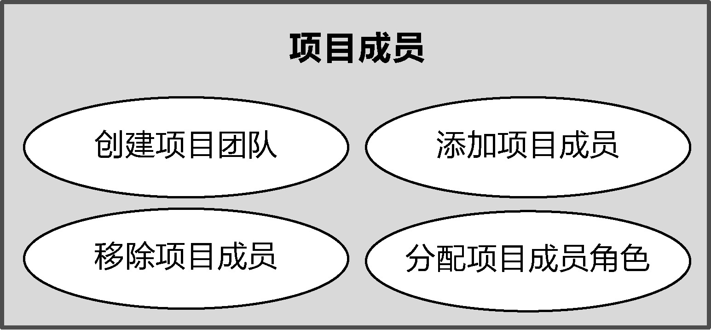

*图20-35 项目成员业务主体*

不用担心业务主体的这种不均等。遵循V型映射过程，针对业务服务进行业务相关性分析获得的业务主体只是候选的限界上下文，还需要我们根据业务服务的亲密度进一步梳理业务主体的边界。

通过对业务相关性的归类和归纳，初步获得图20-36所示的业务主体视图。

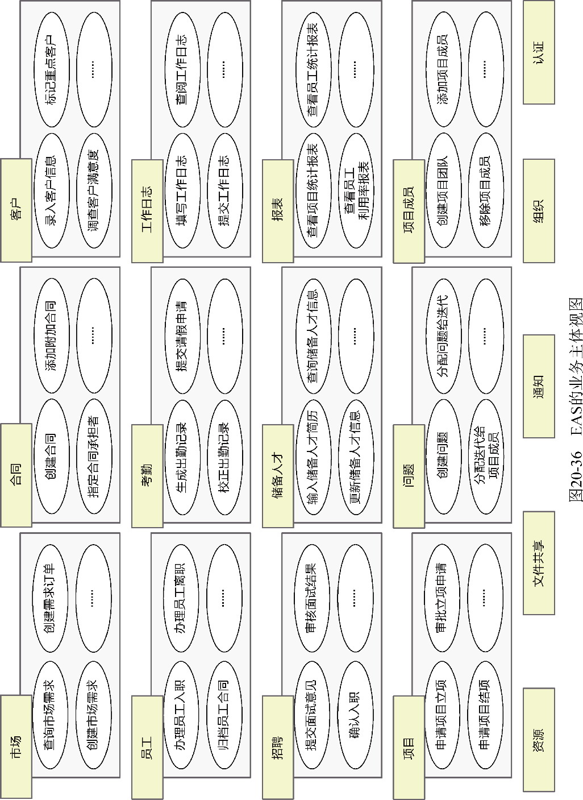

(2)亲密度分析

一旦确定了各个业务主体的业务服务，就可以通过分析亲密度的强弱来调整业务服务与业务主体之间的关系。例如，“从储备人才转为正式员工”业务服务究竟属于储备人才主体，还是属于员工主体？虽说该业务服务需要同时用到储备人才和员工的领域知识，但由于其服务价值是生成员工记录，储备人才的信息仅仅作为该领域行为的输入，因此它与员工业务主体的亲密度显然更高。

亲密度分析也可以判断业务服务的归类是否合理。例如，项目主体中的创建迭代、开始迭代等业务服务牵涉到迭代这一领域概念，它与项目概念固然存在较亲密的关系，但问题概念与迭代概念之间的亲密关系也不遑多让，进一步，项目成员与问题之间的亲密关系也有目共睹。划分业务主体时，项目计划、迭代等概念被放到了项目主体，问题却没有被一并放入，显得领域知识的分配有些失衡。用亲密度来解释，就是迭代与问题之间的亲密度几乎等于项目与项目计划、迭代之间的亲密度，而问题与项目之间的亲密度却要明显低于问题与迭代之间的亲密度。为了保证领域知识分配的均衡，可以考虑两种设计方案：

·将项目主体、问题主体和项目成员主体合并，形成项目上下文；

·将项目计划、迭代等造成亲密度不均匀的领域概念单独剥离出来，定义独立的项目计划业务主体。

(3)判断限界上下文的特征

从知识语境看，合同上下文与员工上下文都具有合同(contract)领域概念，二者在各自的业务主体边界内，代表了各自的领域概念。前者为商务合同，后者为劳务合同。

员工主体与储备人才主体存在几乎完全相同的领域模型，如图20-37所示。

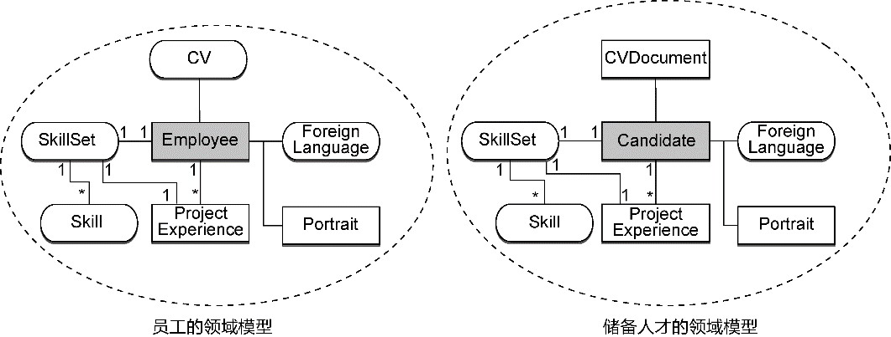

*图20-37 员工与储备人才的领域模型*

两个模型除了员工Employee与储备人才Candidate的名称不同，几乎是一致的。我们是否可以把这两个概念抽象为Talent，由此来来统一领域模型？如图20-38所示。

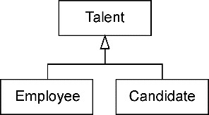

*图20-38 对员工和储备人才的抽象*

面向对象设计思想鼓励这样的抽象，以避免代码的重复。然而，若从领域模型的知识语境看，这是两个完全不同的领域模型：员工属于员工管理的领域范畴，储备人才并非正式员工，是招聘的目标。以模型中的项目经验Project Experience为例，虽然员工和储备人才的项目经验具有完全相同的属性，但它们面向的关注点是迥然不同的，如市场人员就完全不关心储备人才的项目经验。

从业务能力看，员工与储备人才之间存在清晰的界限，提供了各自独立的业务能力，一个服务于员工的日常管理，一个服务于人才的招聘。虽说“从储备人才转为正式员工”需要二者的结合，但在储备人才转为正式员工之后，二者就不存在任何关系了。

因此，员工和储备人才这两个领域模型应该放在不同的限界上下文。这也体现了领域驱动设计与面向对象设计之间的差异。

(4)运用验证原则

运用正交原则、单一抽象层次原则，可以进一步确定限界上下文业务边界的合理性。

例如，为何选择将问题而非项目成员归入项目上下文？除了因为项目成员与组织之间存在黏性，在概念上，问题其实属于项目的子概念，在层次上处于“劣势”地位。遵循单一抽象层次原则，项目与问题并不在同一个抽象层次。相反，以招聘业务主体和储备人才业务主体为例，二者就没有非常明显的“上下级”层次关系。它们之间的关系或许比较亲密，却处于平等的层次。

在运用单一抽象层次原则时，业务主体的命名会影响我们对主体关系的判断。如果命名过于抽象，就可能使得过高的抽象隐隐然包含别的主体。以市场业务主体和合同业务主体为例，市场的抽象层次明显高于合同（即合同的概念也应属于市场的范畴），故而带来两个设计选择：要么将合同业务主体纳入市场业务主体，进而形成一个市场上下文，要么将市场业务主体命名为订单，而订单与合同显然处于同一层次。

正交原则警醒了设计者：限界上下文之间不能存在重叠内容。为何需要单独分离出文件共享上下文与通知上下文？因为诸如员工、储备人才、合同等业务主体都需要调用文件上传下载功能，项目、合同、招聘等业务主体都需要调用消息通知功能。如果不分离出来，一旦文件上传下载或者消息通知的实现有变，就会影响到相关的业务主体，造成“霰弹式修改”^的代码坏味道，违背了正交原则。

运用单一抽象层次原则与正交原则，对前面获得的业务主体进一步梳理和验证，可初步获得如图20-39所示限界上下文的草案。

在图20-39中，订单上下文与项目上下文就是在对业务主体的边界进行梳理，并通过验证原则验证后调整的结果。

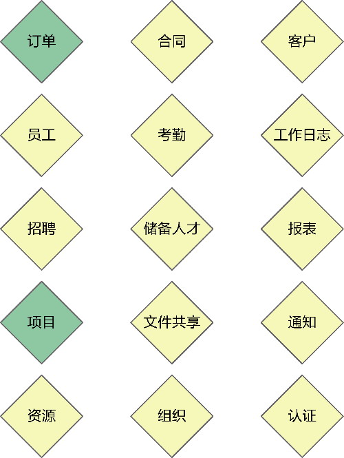

*图20-39 EAS系统的限界上下文草案*

(5)工作边界的识别

从工作边界识别限界上下文是一个长期过程，其中，也牵涉到需求变更和新需求加入时的柔性设计^168。

如前所述，限界上下文之间是否允许进行并行开发可以作为判断工作边界分配是否合理的依据。在EAS限界上下文草案中，我发现报表上下文与客户、合同、订单、项目、员工等上下文都存在非常强的依赖关系。如果这些上下文没有完成相关的特性功能，就很难实现报表上下文。由于报表上下文的诸多统计报表与各自的业务强相关，如查看项目统计报表用例只需统计项目的信息，因此可以考虑将这些用例放到与业务强相关的限界上下文中。

结合工作边界和业务边界，我认为工作日志业务主体的边界过小，且从业务含义看，可将其视为员工管理的一项子功能，因而决定将工作日志合并到员工上下文，同样地，也将考勤业务主体合并到员工上下文。这实际也遵循了验证原则中的奥卡姆剃刀原则。

储备人才和招聘之间的关系类似于工作日志和员工之间的关系，我最初也想将储备人才合并到招聘上下文中。然而，客户对需求的反馈打消了这一决策考量。因为该软件集团旗下还有一家软件学院，集团负责人希望将软件学院培养的软件开发专业学生也纳入企业的储备人才库中。这一需求影响了储备人才的管理模式，也扩充了储备人才的领域内涵，使它与招聘领域形成了正交关系，为它的“独立”增加了有力的砝码。

一些限界上下文之间的依赖无法通过需求分析直观呈现出来，这就有赖于上下文映射对这种协作（依赖）关系的识别。一旦明确了这种协作关系，定义了服务契约，就可以利用Mock或Stub解除开发的依赖，实现并行开发。

通过工作边界识别限界上下文的一个重要出发点是激发团队成员对工作职责的主观判断。这种边界也就是第9章提及的针对团队的“渗透性边界”。团队成员需要对自己负责开发的需求抱有成见，尤其是在面对需求变更或新增需求的时候。

在EAS系统的设计开发过程中，客户提出了增加员工培训的需求。该需求要求人力资源部能够针对员工的职业规划制订培训计划，确定培训课程，实现对员工培训过程的全过程管理。考虑到这些功能与员工上下文有关，我最初考虑将这些需求直接分配给员工上下文的领域特性团队。然而，团队的开发人员提出：这些功能虽然看似与员工有关，但实际上是一个完全独立的培训领域，包括了培训计划制订、培训提名、培训过程管理等业务知识，与员工管理的业务是正交的。最终，我们选择为培训建立一个专门的领域特性团队，同时引入培训上下文。

类似文件共享和通知这样一些属于支撑子领域或者通用子领域的限界上下文，可能具有并不均匀的粒度，且互相之间又不存在关联。此时，可维持限界上下文的业务边界不变，然后视粒度酌情将它们分配给一个或多个领域特性团队。如果该支撑功能需要团队成员具备一定的专业知识，也可将它单独抽离出来，建立专门的组件团队。如果它提供的功能具有普遍适用性，不仅可以支撑目标系统，还可以支持组织内其他软件系统，就可以考虑将其演进为企业范围内的框架或平台。这些框架和平台就不再属于目标系统的范围了（在系统上下文边界之外）。

根据需求变化以及对团队开发工作的分配，我们调整了限界上下文，如图20-40所示。

在图20-40中，将工作日志与考勤合并到了员工上下文，同时为了应对新需求的变更，增加了培训上下文，并暂时去掉了报表上下文。之所以说“暂时”，是因为还需要对其做一些技术层面的判断。

(6)应用边界的识别

对应用边界的识别，就是从技术维度考量限界上下文，包括考虑系统的质量属性、模块的复用性、对需求变化的应对和处理遗留系统的集成等。

我们与客户决策层一起确认了报表功能的需求，客户希望统计报表能够准确及时地展现历史和当前的人才供需情况。统计报表功能直接影响了目标系统的愿景，是系统的核心功能之一，需要花费更多精力来明确设计方案。通观与统计报表有关的业务服务，除了与职能部门管理工作有关的统计日报、周报和月报，报表的统计结果实际上为集团领导进行决策提供了数据层面的辅助支持。要提供准确的数据统计，就需要对市场需求、客户需求、项目、员工、储备人才、招聘活动等数据做整体分析，也就需要整个系统核心限界上下文的数据支持。倘若EAS的每个限界上下文并未采用微服务这种零共享架构，整个系统的数据就可以存储在一个数据库中，无须进行数据的采集和同步即可支持统计分析。另一种选择是引入数据仓库，采用诸如ETL等形式完成对各个生产数据库和日志文件的采集，经过统一的数据治理后为统计分析提供数据支持。

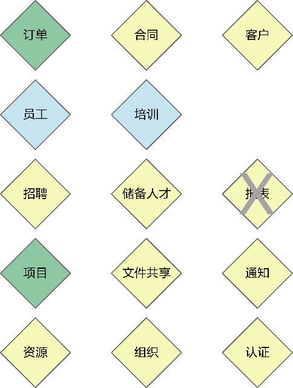

*图20-40 工作边界对限界上下文的影响*

在分析工作边界时，我考虑到报表上下文与其他限界上下文之间存在强依赖关系，无法支持并行开发，因而将该上下文的功能按照业务相关性分配给其他限界上下文。如今，通过技术分析得知，虽然依赖仍然存在，但该上下文更多地体现了“决策分析”的特定领域。最终，我决定保留该限界上下文，并将其更名为决策分析上下文。

在考虑通知上下文的实现时，基于之前确定的系统上下文，EAS系统要与集团现有的OA系统集成。我们了解了OA系统公开的服务接口，发现这些接口已经提供了多种消息通知功能，包括站内消息、邮件通知和短消息通知，没有必要在EAS系统中重复开发通知功能。那么，通知上下文是否就没有存在的必要呢？一旦去掉通知上下文，与OA系统集成的功能又该放在哪里？领域驱动设计建议将这种与第三方服务集成的功能放在防腐层，可EAS系统中的多个限界上下文都需要调用该功能，会形成防腐层的重复建设。为了满足功能的复用性，可以为它单独创建一个限界上下文。为了说明其意图，将它更名为OA集成上下文。

最终，得到图20-41所示的限界上下文。

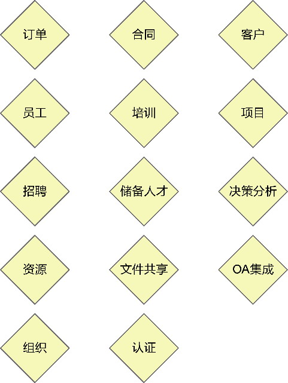

*图20-41 EAS系统的限界上下文*

**3.上下文映射**

确定了目标系统的限界上下文之后，即可通过业务服务获得的服务序列图确定限界上下文之间的协作关系，从而确定上下文映射模式，设计出服务契约。

(1)创建市场需求

创建市场需求业务服务属于订单上下文，它拥有的领域知识已经足以满足该业务服务的需求，无须求助于其他的限界上下文，因此在本业务服务中，没有上下文映射。服务序列图如图20-42所示。

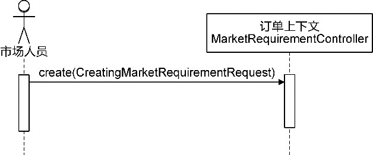

*图20-42 创建市场需求的服务序列图*

虽然创建市场需求没有多个限界上下文参与协作，但为其绘制服务序列图仍有必要，因为可以通过它驱动出创建市场需求的服务契约。

(2)归档合同

归档合同业务服务属于合同上下文，具备合同相关的领域知识，但不具备上传文件的业务能力，需要求助于文件共享上下文，服务序列图如图20-43所示。

文件共享上下文作为支撑子领域的限界上下文，主要提供了文件上传与下载的功能。它具有的领域知识还包括针对不同类型的文档维护了服务器文件存储的路径映射，故而参与协作的是北向网关的应用服务。形成的上下文映射图如图20-44所示。

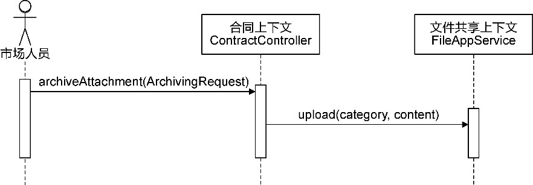

图20-43 归档合同的服务序列图


图20-44 归档合同产生的　上下文映射图

(3)添加项目成员

添加项目成员业务服务属于项目上下文，拥有与项目相关的所有领域知识和业务能力，但并不具备发送通知的业务能力，也不知道该如何将当前项目的信息添加到员工的项目经验中，因此需要分别求助于OA集成上下文和员工上下文。服务序列图如图20-45所示。

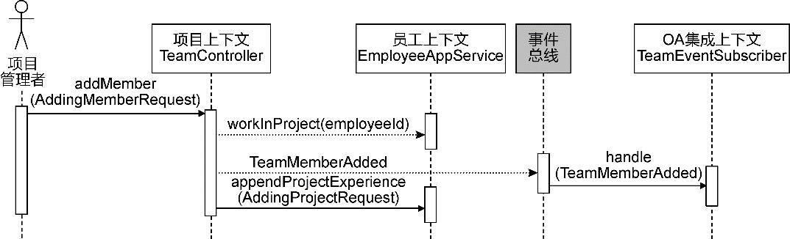

*图20-45 添加项目成员的服务序列图*

OA集成上下文要实现的功能都与通知有关。无论是短信通知、邮件通知还是站内通知，都没有副作用，且允许以异步形式调用，适合使用事件的调用机制，因而为其选择发布者/订阅者模式。选择该模式既可以解除OA集成上下文与大多数限界上下文之间的耦合，又能较好地保证EAS系统的响应速度，减轻主应用服务器的压力。不足是需要增加一台部署消息队列的服务器，并在一定程度增加了架构的复杂度。如图20-45所示，项目管理者在添加了项目成员之后，会向事件总线发布TeamMemberAdded应用事件，并由OA集成上下文的事件订阅者订阅该事件。形成的上下文映射图如图20-46所示。

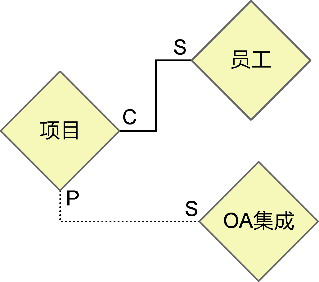

*图20-46 添加项目成员产生的上下文映射图*

为主要的业务服务绘制服务序列图，深层次地思考各个限界上下文如何参与到每个业务服务、它们又该如何协作、应该采用什么样的上下文映射模式，就可以得到整个EAS系统的上下文映射图，如图20-47所示。

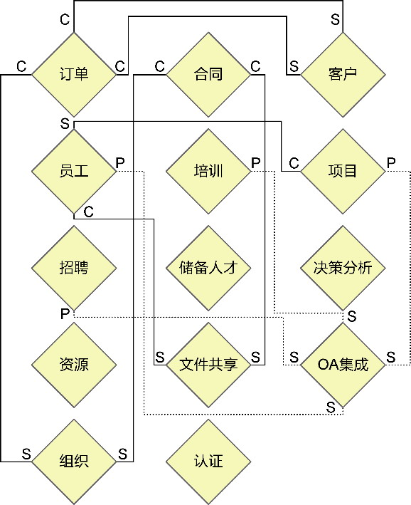

*图20-47 EAS的上下文映射图*

上下文映射图不仅说明了限界上下文之间的协作关系、彼此间采用的团队协作模式，也可以作为服务契约设计的参考和补充。

**4.服务契约设计**

服务序列图驱动我们获得了消息定义，由此可以驱动出服务契约。如果目标系统规模大，限界上下文数量多，可以为每个限界上下文定义一个服务契约表。服务契约表除了体现了整个项目的服务契约定义，同时也为领域特性团队提供了设计约束。

表20-5列出了EAS系统的部分服务契约。

*表20-5 EAS系统的服务契约*

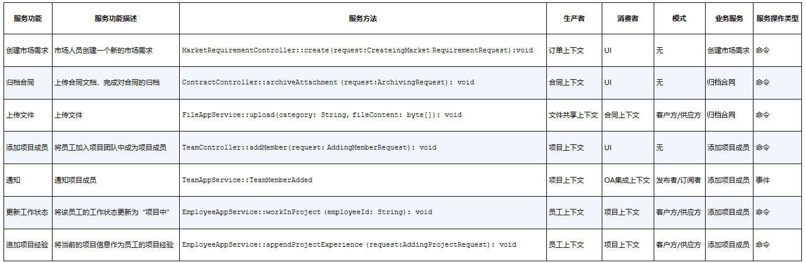

除了UI作为下游发起服务请求，表20-5列出的服务契约都标记了上下文映射模式。表20-5的“服务方法”列给出了类和方法的明确定义，也指出了方法参数的形参名和类型。若有返回值，也需要给出返回值类型。

在确定EAS的限界上下文时，我并没有明确指出限界上下文的通信边界。边界取决于质量属性的要求，自然也需要权衡库和服务的优缺点。在无法给出必须跨进程通信的证据之前，应优先考虑进程内通信。EAS系统作为一个企业内部系统，对并发访问与低延迟的要求并不高。可用性固然是一个系统该有的特质，但EAS系统毕竟不是“生死攸关”的一线生产系统，即使短时间出现故障，也不会给企业带来致命的打击或难以估量的损失。既然如此，我们应优先考虑将限界上下文定义为进程内的通信边界。唯一的例外是OA集成上下文被定义为进程间通信，因为它需要跨进程调用OA系统。这种方式一方面解除了OA系统上下文与大多数限界上下文之间的耦合，另一方面也能够较好地保证EAS系统的响应速度，减轻主应用服务器的压力。

因此，对于采用客户方/供应方模式的限界上下文，作为供应方的上游只需通过应用服务对外公开服务契约，如员工上下文的EmployeeAppService应用服务公开了追加项目经验的服务契约，这一设计满足菱形对称架构北向网关的要求。对采用发布者/订阅者模式的限界上下文而言，作为发布者的限界上下文也通过应用服务发布事件，如项目上下文通过TeamAppService应用服务发布了TeamMemberAdded事件，该事件属于应用事件，需要支持分布式通信。

所有服务契约的方法参数和返回值都是消息契约的一部分，也需要按照消息契约模型的要求进行定义，尤其需要满足菱形对称架构的要求，不能直接将领域模型暴露在外。

**5.映射系统分层架构**

在系统上下文的约束下，确定限界上下文属于哪种类型的子领域，即可将它们分别映射到系统分层架构的业务价值层与基础层。显然，资源上下文、文件共享上下文和OA集成上下文都属于支撑子领域，组织上下文和认证上下文属于通用子领域，其余限界上下文属于核心子领域。

EAS系统需要为集团决策者提供移动端应用程序，满足他（她）们提出的决策分析要求，也有利于他（她）们实时了解市场动态、人员动态和项目进度。针对市场部、人力资源部、项目管理部以及子公司等职能部门，主要提供Web前端，方便用户在办公环境的使用。因此，有必要为EAS系统引入一个边缘层来应对不同UI前端的需求。

根据系统级映射的方法，可以为EAS设计出图20-48所示的系统分层架构。

我们为限界上下文建立了菱形对称架构。可将它们看作一个个封闭的架构单元，它们之间的关系由上下文映射确定，在系统分层架构中，只需要考虑它们所处的层次即可。分层架构作用于整个系统上下文，业务价值层和基础层的内部架构由各个限界上下文控制，边缘层则汇聚了每个限界上下文提供的业务能力，统一对外向前端或其他客户端公开服务。

虽然EAS的每个限界上下文都引入了菱形对称架构，不过在其内部，网关层与领域层的设计仍有细微的差异。如决策分析上下文的领域逻辑主要为统计分析，受技术决策的影响，通常可以直接针对数据进行操作，无须建立领域模型，形成弱化的菱形对称架构，内部只包含北向网关与南向网关。其中，南向网关是一个薄薄的数据访问层，从数据库获得的统计分析数据会直接转换为消息契约模型。

OA集成上下文是一个由防腐层发展起来的限界上下文。它与其他限界上下文的协作采用了发布者/订阅者模式，内部又需要调用OA系统的服务接口，因而它的领域层只包含了组装消息内容的领域模型。在网关层，定义了应用事件作为消息契约模型，事件订阅者为北向网关的远程服务，事件处理器为北向网关的应用服务，事件发布者则属于南向网关，分为端口与适配器。

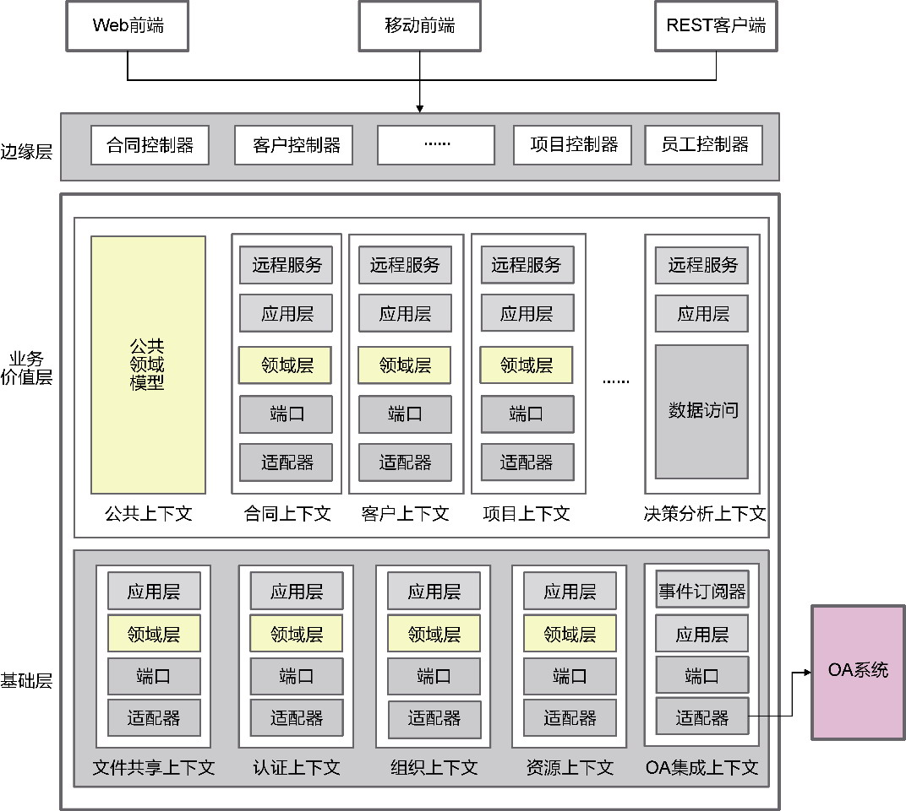

*图20-48 系统分层架构*

文件共享上下文的定义打破了惯有的设计方式。它负责的工作是文件上传和下载，通常会考虑将其作为基础设施层的一个公共组件。正如我们在第9章对模块、组件、库、服务等概念的澄清，一个限界上下文可以实现为库或者服务，但本质上仍然表达了对业务能力的纵向切分。由于不需要跨进程通信，可以将文件共享上下文实现为基础层（注意不是基础设施层）的库。它提供的业务能力为具备支撑功能的文件共享能力，封装的领域逻辑除了上传文件与下载文件的领域行为，还规定了属于不同类别的文件存放在文件服务器的不同位置。文件传输的实现由于操作了外部资源，因而属于南向网关适配器的内容。以归档合同为例，合同上下文调用文件共享上下文的FileAppService，其内部的协作序列如图20-49所示。

系统分层架构属于架构的逻辑视图，并没有确定限界上下文的通信边界。例如，OA集成上下文与其他限界上下文并不在一个进程中，但系统分层架构并不需要体现这一点。

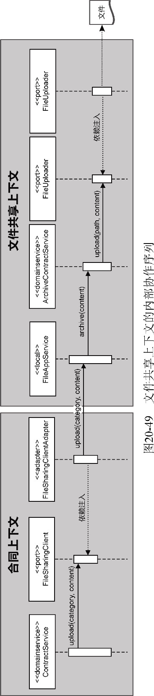

遵循系统分层架构与菱形对称架构对代码模型的约束和规定，EAS系统的代码模型如图20-50所示。

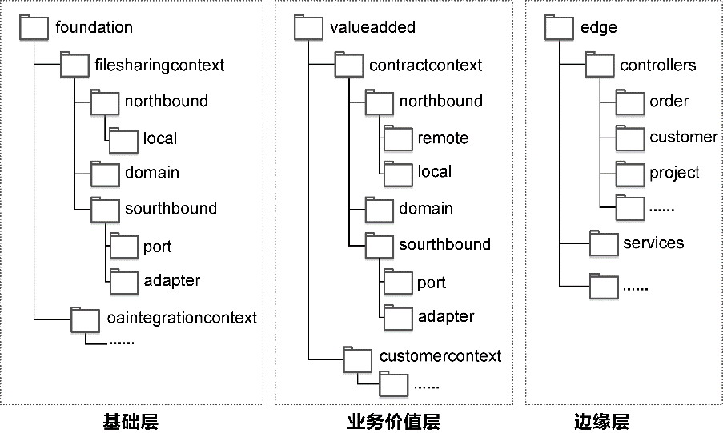

*图20-50 EAS的代码模型*

所有限界上下文都采用了菱形对称架构规定的标准代码模型，只是根据具体情况作了少量调整。各个限界上下文在系统分层架构所处的层次，也通过包的命名空间清晰地呈现出来了。

#### 20.3.4 EAS的领域建模

在确定了EAS系统的限界上下文与系统上下文，并通过菱形对称架构和系统分层架构设计出EAS的整体架构后，接下来就进入了战术层面的领域建模阶段。考虑到篇幅原因，我仅选择了业务逻辑相对复杂的培训上下文，运用快速建模法对其进行领域分析建模，获得领域分析模型后，采用庖丁解牛的过程设计聚合，然后相继开展服务驱动设计与测试驱动开发获得最终的领域模型。

**1.领域分析建模**

领域分析建模阶段的关键是识别领域概念，为限界上下文建立领域分析模型。参考过程模型推荐使用快速建模法进行领域分析建模，它的基础是业务服务规约。以“提名候选人”业务服务为例，它的业务服务规约如下。

服务编号：EAS-0202

服务名：提名候选人

服务描述：

作为一名协调者

我想要提名候选人参加培训

以便部门的员工得到技能培训的机会

触发事件：

协调者选定候选人后，点击“报名”按钮

基本流程：

1.确定候选人是否已经参加过该课程

2.对培训票提名候选人

3.邮件通知获得提名的候选人

替换流程：

1a.候选人参加过该培训要学习的课程，提示员工已经学习过该课程

2a.提名操作失败，提示失败原因

验收标准：

1.被提名人属于候选名单中的员工

2.提名的票状态必须为Available

3.提名后的票状态为WaitForConfirm

4.候选人获得培训票

识别业务服务规约的名词，可以获得领域概念：候选人(Candidate)、协调者(Coordinator)、培训(Training)、课程(Course)、票(Ticket)、候选名单(CandidateList)、票状态(TicketStatus)、邮件(Mail)。

识别业务服务规约的动词，然后逐一检查该动词代表的领域行为是否需要产生过程数据。发现“提名候选人”，除了候选人获得培训票，还要记录票的变更历史，因而获得票历史(TicketHistory)领域概念；发现“员工学习过课程”，需要记录该员工的学习记录，因而获得学习记录(Learning)领域概念。

对识别出来的领域概念进行归纳和抽象，发现CandidateList实际上是Candidate的集合，用List<Candidate&gt;即可表达，没有必要单独引入；邮件通知由专门的OA集成上下文发送邮件，在培训上下文中没有必要列出，故而可以删去Mail概念。

对于其他业务服务的领域分析建模，也如法炮制。由于培训上下文的业务服务皆位于同一个限界上下文，因而只需要考虑该上下文内部领域模型之间的关系。由此可获得图20-51所示的领域分析模型。

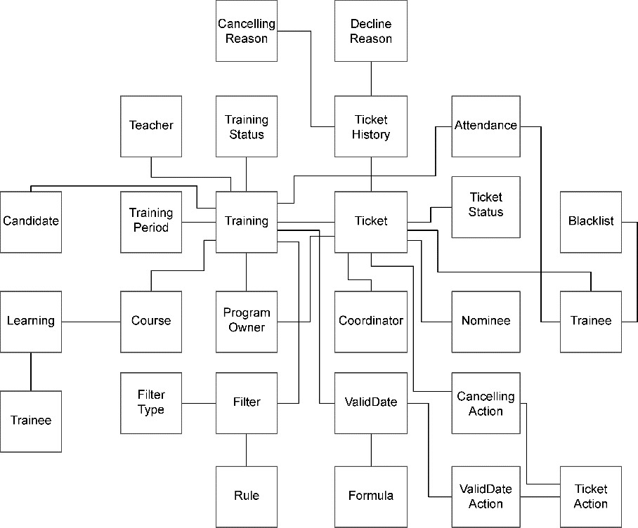

*图20-51 培训上下文的领域分析模型*

**2.领域设计建模**

领域设计建模牵涉两个重要的设计阶段：识别聚合和服务驱动设计。

(1)识别聚合

首先梳理对象图。确定领域模型对象到底是实体还是值对象，并分别用不同的颜色表示。一些较容易识别的值对象可以最先标记出来，例如体现了单位、枚举、类型的内聚概念等，如图20-52所示。

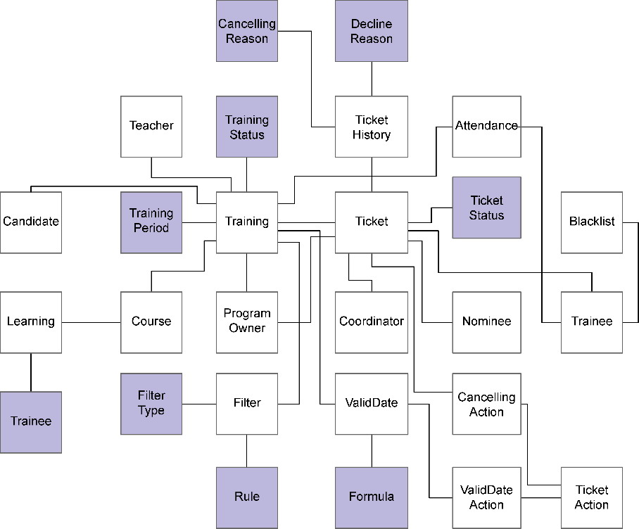

*图20-52 识别出值对象*

一些容易识别的实体类也可以提前标记出来。这些实体类往往是业务服务中扮演主要作用的领域概念，体现了非常清晰的生命周期特征。

ProgramOwner、Coordinator、Nominee和Trainee都是参与培训上下文的角色，都拥有员工上下文的员工ID，如此即可建立这些角色与Training和Ticket等实体类之间的关联。它们对应的角色(role)来自认证上下文，用于安全认证和权限控制。角色具有的基本信息，如姓名、电子邮件等，又来自员工上下文。因此，这些领域模型类虽然定义了ID，但在培训上下文中不过是其主实体的一个属性值而已，并不需要管理它们的生命周期，应该定义为值对象。由于培训上下文并未要求为培训维护一个单独的教师信息，故而与Training相关的Teacher应定义为值对象。

Filter和ValidDate都与Training关联。它们看似具有值对象的特征。对过滤器而言，只要TrainingId的值以及类型与规则相同，就应视为同一个Filter对象；有效日期也是如此，只要公式、日期和时间相同，就是同一个ValidDate对象。但是，由于它们的生命周期需要单独管理，将它们定义为实体更加适合。同理，ValidDateAction与CancellingAction也需要单独管理生命周期，应定义为实体。TicketAction却不同，它的差异仅在于具体的活动内容，而它又不需要管理生命周期，应定义为值对象。于是，获得图20-53所示的领域设计类图。

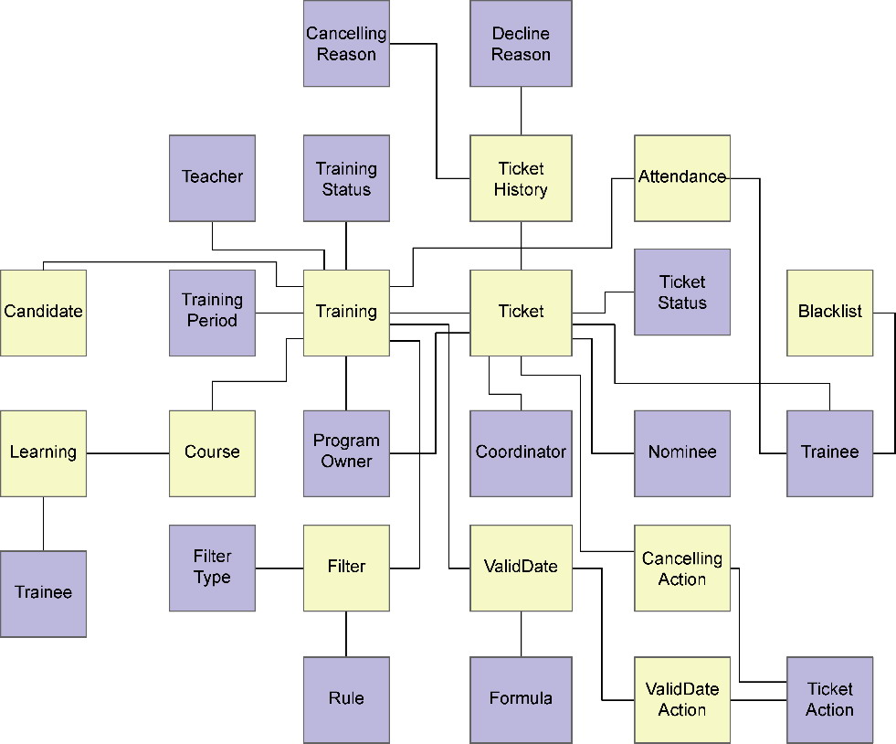

*图20-53 识别出实体*

在确定了值对象与实体后，可以简化对领域模型对象关系的确认，即只需梳理实体之间的关系。一个Course聚合了多个Training，一个Training聚合了多个Ticket，这三者之间的组合关系非常清晰。一个Training可以配置多个Filter与ValidDate，但它们之间并非必须有的关系，故而定义为OO聚合关系。同理，一个ValidDate聚合多个ValidDateAction、一个Ticket聚合多个CancellingAction和多个TicketHistory、一个Training聚合多个Candidate和多个Attendance，而BlackList则是完全独立的。确定了实体关系的领域设计类图如图20-54所示。

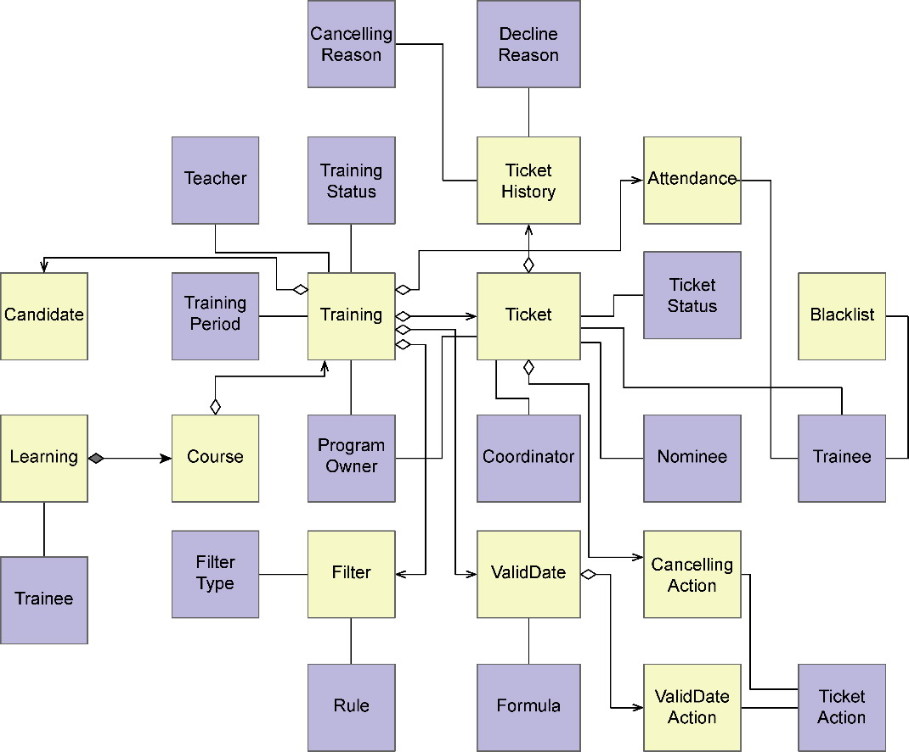

*图20-54 确定实体之间的关系*

梳理之后的领域设计类图非常规范。除了合成关系，存在OO聚合关系的实体都分到不同的聚合中，更不用说完全独立的Backlist实体。如果多个聚合边界的实体依赖了相同的值对象，可以定义多个相同的值对象，然后将它们放到各自的聚合边界内。分解关系薄弱处确定的聚合边界如图20-55所示。

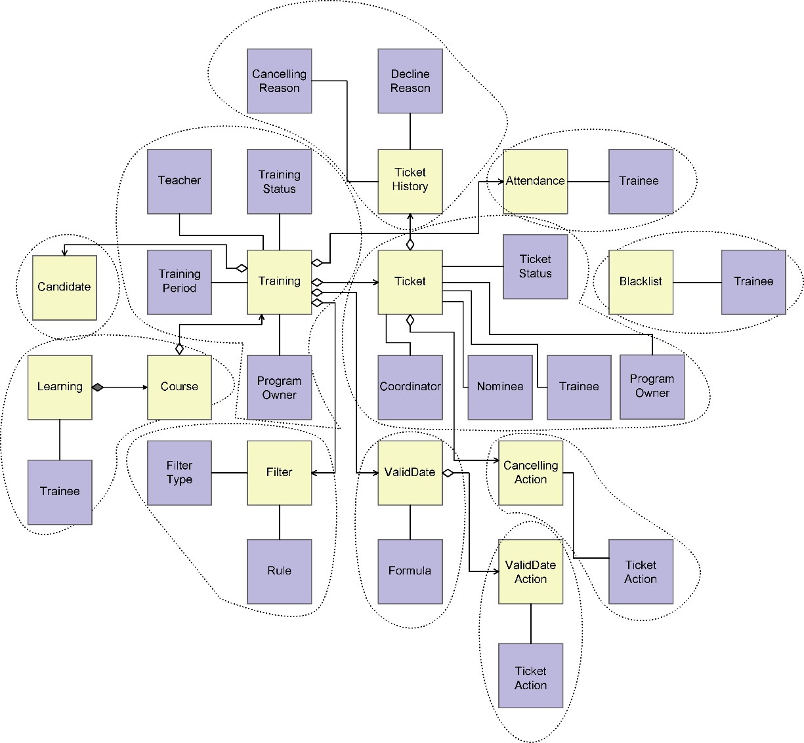

*图20-55 根据关系强弱确定聚合边界*

考虑聚合设计原则，由于Learning聚合中的Course实体具有独立性，因此需要对图20-55稍做调整，将Course实体分离出来，定义为单独的聚合。除此之外，其余聚合边界都是合理的，不需再做调整。最终，确定了聚合边界的领域设计类图如图20-56所示。

由此得到的聚合包括：

·Training聚合；

·Course聚合；

·Learning聚合；

·Ticket聚合；

·TicketHistory聚合；

·Filter聚合；

·ValidDate聚合；

·ValidDateAction聚合；

·CancellingAction聚合；

·Candidate聚合；

·Attendance聚合；

·Blacklist聚合。

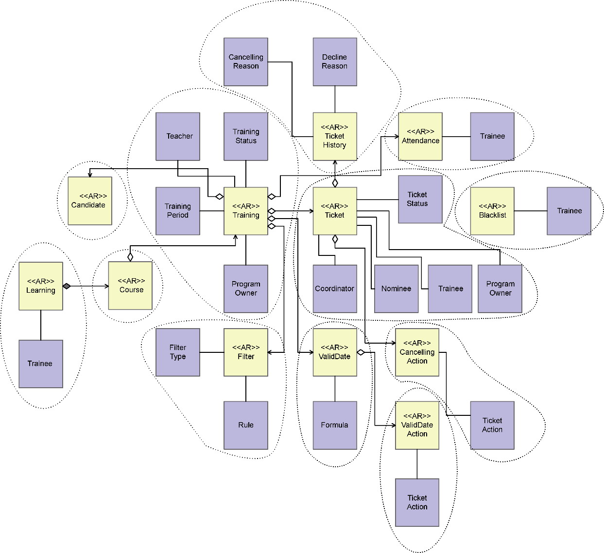

*图20-56 确定了聚合边界的领域设计模型*

即使在领域设计模型中，我们也无须为领域模型对象定义字段。每个聚合内的实体或值对象到底需要定义哪些字段，可以结合业务服务，通过测试驱动开发逐步驱动出来。领域设计类图最重要的要素是聚合。一旦确定了聚合，实际上也就确定了管理聚合生命周期的资源库。至于需要哪些领域服务和其他角色构造型，可以交由服务驱动设计来识别。

(2)服务驱动设计

服务驱动设计的起点是业务服务。以提名候选人业务服务为例，将业务服务规约的基本流程转换为由动词短语组成的任务，然后通过向上归纳和向下分解获得由组合任务与原子任务组成的任务树：

·

      提名候选人（业务服务）

·

          确定候选人是否已经参加过该课程

·○获取该培训对应的课程

·○确定课程学习记录是否有该候选人

·

          如果未参加，则提名候选人

·○获得培训票

·○提名

·○保存票的状态

·

          发送提名通知

·○获取通知邮件模板

·○组装提名通知内容

·○发送通知

结合任务分解与角色构造型，它的序列图脚本如下：

```
NominationAppService.nominate(nominationRequest) {
   LearningService.beLearned(candidateId, trainingId) {
      TrainingRepository.trainingOf(trainingId);
      LearningRepository.isExist(candidateId, courseId);
   }
   TicketService.nominate(ticketId, candidate) {
      TicketRepository.ticketOf(ticketId);
      Ticket.nominate(candidate);
      TicketRepository.update(ticket);
   }
   NotificationService.notifyNominee(ticket, nominee) {
      MailTemplateRepository.templateOf(templateType);
      MailTemplate.compose(ticket, nominee);
      NotificationClient.notify(notificationRequest);
   }
}
```

该序列图脚本对应的序列图如图20-57所示。

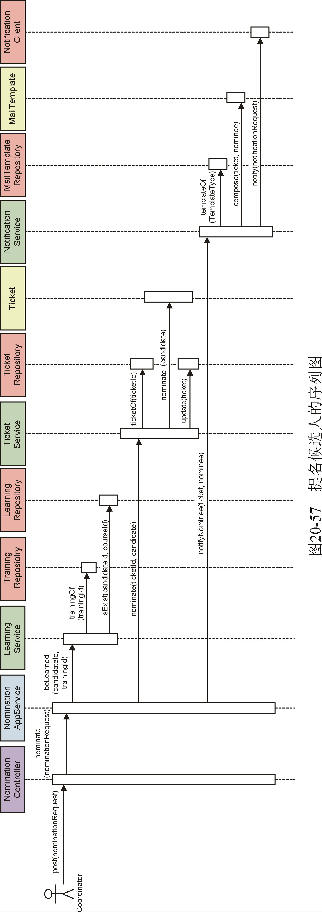

图20-57中的NominationAppService应用服务承担了多个领域服务之间的协作职责，且需要根据beAttend()方法的返回结果决定提名的执行流程。这实际上属于领域逻辑的一部分，故而应该在NominationAppService应用服务内部引入一个领域服务来封装这些业务逻辑。新增的领域服务为NominationService，修改后的序列图如图20-58所示。

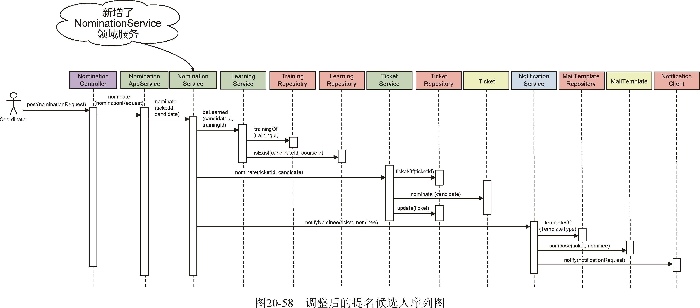

图20-58中的MailTemplate是一个聚合，存储了不同类型操作需要通知的邮件模板。在前面的领域分析建模与领域设计建模时，未能发现该聚合。这也印证了领域建模很难一蹴而就，需要不断地迭代更新和演进。

**3.领域实现建模**

在服务驱动设计的基础上，需要针对培训上下文的每个业务服务的任务编写测试用例，并严格遵循测试驱动开发的过程进行领域实现建模。

(1)聚合的测试驱动开发

根据测试驱动开发的方向，应首选由聚合履行职责的原子任务开始测试驱动开发。以“提名候选人”业务服务为例，首先选择“提名”原子任务，它的测试用例包括：

·验证提名之前的票状态必须为Available；

·提名给候选人后，票的状态更改为WaitForConfirm；

为Ticket聚合创建TicketTest测试类。为第一个测试用例编写测试如下：

```
public class TicketTest {
   private String trainingId;
   private Candidate candidate;
   @Before
   public void setUp() {
      trainingId = "111011111111";
      candidate = new Candidate("200901010110", "Tom", "tom@eas.com", trainingId);
   }
   @Test
   public void should_throw_TicketException_given_ticket_is_not_AVAILABLE() {
      Ticket ticket = new Ticket(TicketId.next(), trainingId, TicketStatus.WaitForConfirm);
      assertThatThrownBy(() -> ticket.nominate(candidate))
             .isInstanceOf(TicketException.class)
             .hasMessageContaining("ticket is not available");
   }
}
```

遵循简单设计原则与测试驱动设计三大支柱，只需要编写让该测试通过的实现代码即可：

```
package xyz.zhangyi.ddd.eas.valueadded.trainingcontext.domain.ticket;
import xyz.zhangyi.ddd.eas.valueadded.trainingcontext.domain.candidate.Candidate;
import xyz.zhangyi.ddd.eas.valueadded.trainingcontext.domain.exceptions.TicketException;
import xyz.zhangyi.ddd.eas.valueadded.trainingcontext.domain.tickethistory.TicketHistory;
public class Ticket {
   private TicketId ticketId;
   private String trainingId;
   private TicketStatus ticketStatus;
   public Ticket(TicketId ticketId, String trainingId, TicketStatus ticketStatus) {
      this.ticketId = ticketId;
      this.trainingId = trainingId;
      this.ticketStatus = ticketStatus;
   }
   public void nominate(Candidate candidate) {
      if (!ticketStatus.isAvailable()) {
         throw new TicketException("ticket is not available, cannot be nominated.");
      }
   }
}
```

由于当前测试仅验证了票分配前的状态，故而只需要考虑对票状态的验证，让测试快速通过。

接下来为第二个测试用例编写测试方法：

```
public class TicketTest {
   @Test
   public void ticket_status_should_be_WAIT_FOR_CONFIRM_after_ticket_was_nominated() {
      Ticket ticket = new Ticket(TicketId.next(), trainingId);
      ticket.nominate(candidate);
      assertThat(ticket.status()).isEqualTo(TicketStatus.WaitForConfirm);
      assertThat(ticket.nomineeId()).isEqualTo(candidate.employeeId());
   }
}
```

该测试类验证了Ticket的状态和提名人ID。为保证测试通过，只需做如下实现：

```
public class Ticket {
   public void nominate(Candidate candidate) {
      if (!ticketStatus.isAvailable()) {
         throw new TicketException("ticket is not available, cannot be nominated.");
      }
      this.ticketStatus = TicketStatus.WaitForConfirm;
      this.nomineeId = candidate.employeeId();
   }
}
```

在领域分析建模时通过动词建模寻找到了隐藏的领域概念TicketHistory。实际上，这意味着当培训票成功提名给候选人之后，需要生成票的历史记录。它作为过程数据也应是验收标准的一部分。在编写测试用例时，自然也需要考虑该测试场景，故而为“提名”原子任务增加第三个测试用例：

·为票生成提名历史记录。

既然是成功提名后生成了历史记录，就需要修改nominate(candidate)方法，使其返回TicketHistory对象。为了确保返回结果的正确性，需要验证它的属性值。究竟要验证哪些属性呢？我们可以从测试出发，确定培训票需要保存的历史记录包括：

·票的ID；

·票的操作类型；

·状态迁移的状况；

·执行该操作类型后的票的拥有者；

·谁执行了本次操作；

·何时执行了本次操作。

体现为测试方法，即对ticketHistory的验证：

```
@Test
public void should_generate_ticket_history_after_ticket_was_nominated() {
   Ticket ticket = new Ticket(TicketId.next(), trainingId);
   TicketHistory ticketHistory = ticket.nominate(candidate, nominator);
   assertThat(ticketHistory.ticketId()).isEqualTo(ticket.id());
   assertThat(ticketHistory.operationType()).isEqualTo(OperationType.Nomination);
   assertThat(ticketHistory.owner()).isEqualTo(new TicketOwner(candidate.employeeId(),
TicketOwnerType.Nominee));
   assertThat(ticketHistory.stateTransit()).isEqualTo(StateTransit.from(TicketStatus.
Available).to(TicketStatus.WaitForConfirm));
   assertThat(ticketHistory.operatedBy()).isEqualTo(new Operator(nominator.employeeId(),
nominator.name()));
   assertThat(ticketHistory.operatedAt()).isEqualToIgnoringSeconds(LocalDateTime.now());
}
```

票的操作者operator就是作为协调者或培训主管的提名人。由于之前定义的nominate (candidate)方法并无提名人的信息，故而需要引入Nominator类，修改方法接口为nominate (candidate, nominator)。

验证TicketHistory的属性值，也驱动出TicketOwner、StateTransit、OperationType和Operator类。这些类皆作为TicketHistory聚合内的值对象，在领域设计建模时，并没有被识别出来。领域设计模型为TicketHistory聚合定义了CancellingReason与DeclineReason类，在当前的TicketHistory定义中并没有给出，因为当前的业务服务还未牵涉到这些领域概念。TicketHistory类的定义为：

```
public class TicketHistory {
   private TicketId ticketId;
   private TicketOwner owner;
   private StateTransit stateTransit;
   private OperationType operationType;
   private Operator operatedBy;
   private LocalDateTime operatedAt;
   public TicketHistory(TicketId ticketId,
                    TicketOwner owner,
                    StateTransit stateTransit,
                    OperationType operationType,
                    Operator operatedBy,
                    LocalDateTime operatedAt) {
      this.ticketId = ticketId;
      this.owner = owner;
      this.stateTransit = stateTransit;
      this.operationType = operationType;
      this.operatedBy = operatedBy;
      this.operatedAt = operatedAt;
   }
   public TicketId ticketId() {
      return this.ticketId;
   }
   public TicketOwner owner() {
      return this.owner;
   }
   public StateTransit stateTransit() {
      return this.stateTransit;
   }
   public OperationType operationType() {
      return this.operationType;
   }
   public Operator operatedBy() {
      return this.operatedBy;
   }
   public LocalDateTime operatedAt() {
      return this.operatedAt;
   }
}
```

为了让当前测试快速通过，Ticket的nominate(candidate, nominator)方法实现为：

```
public TicketHistory nominate(Candidate candidate, Nominator nominator) {
   if (!ticketStatus.isAvailable()) {
      throw new TicketException("ticket is not available, cannot be nominated.");
   }
   this.ticketStatus = TicketStatus.WaitForConfirm;
   this.nomineeId = candidate.employeeId();
   return new TicketHistory(ticketId,
          new TicketOwner(candidate.employeeId(), TicketOwnerType.Nominee),
          StateTransit.from(TicketStatus.Available).to(this.ticketStatus),
          OperationType.Nomination,
          new Operator(nominator.employeeId(), nominator.name()),
          LocalDateTime.now());
}
```

考虑到TicketOwner的属性值来自Candidate、Operator的属性值来自Nominator，可以将Candidate与Nominator分别视为它们的工厂，因而可以重构代码：

```
public TicketHistory nominate(Candidate candidate, Nominator nominator) {
   if (!ticketStatus.isAvailable()) {
      throw new TicketException("ticket is not available, cannot be nominated.");
   }
   this.ticketStatus = TicketStatus.WaitForConfirm;
   this.nomineeId = candidate.employeeId();
   return new TicketHistory(ticketId,
          candidate.toOwner(),
          transitState(),
          OperationType.Nomination,
          nominator.toOperator(),
          LocalDateTime.now());
}
```

通过提取方法，该方法还可以进一步精简为：

```
public TicketHistory nominate(Candidate candidate, Nominator nominator) {
   validateTicketStatus();
   doNomination(candidate);
   return generateHistory(candidate, nominator);
}
```

对比测试用例，你会发现重构后的方法包含的3行代码恰好对应这3个测试用例，清晰地展现了“提名候选人”的执行步骤。

当然，测试代码也可以进一步重构：

```
@Test
public void should_generate_ticket_history_after_ticket_was_nominated() {
   Ticket ticket = new Ticket(TicketId.next(), trainingId);
   TicketHistory ticketHistory = ticket.nominate(candidate, nominator);
   assertTicketHistory(ticket, ticketHistory);
}
```

(2)领域服务的测试驱动开发

为原子任务编写了产品代码和测试代码后，即可在此基础上选择对组合任务的测试驱动开发。一个组合任务对应一个领域服务，除了访问外部资源的原子任务，其余原子任务都已完成编码实现。与“提名候选人”组合任务对应的领域服务为TicketService，需要考虑的测试用例为：

·没有符合条件的Ticket，抛出TicketException；

·培训票被成功提名给候选人。

在考虑候选人被提名后的验收标准时，通过与开发人员、需求分析人员和测试人员对需求的沟通，发现之前编写的业务服务规约忽略了两个功能：

·添加票的历史记录；

·候选人被提名之后的处理，即将被提名者从该培训的候选人名单中移除。

故而需要调整该领域服务对应的序列图脚本：

```
TicketService.nominate(ticketId, candidate, nominator) {
   TicketRepository.ticketOf(ticketId);
   Ticket.nominate(candidate, nominator);
   TicketRepository.update(ticket);
   TicketHistoryRepository.add(ticketHistory);
   CandidateRepository.remove(candidate);
}
```

现在，针对测试用例编写测试方法：

```
public class TicketServiceTest {
   @Test
   public void should_throw_TicketException_if_available_ticket_not_found() {
      TicketId ticketId = TicketId.next();
      TicketRepository mockTickRepo = mock(TicketRepository.class);
      when(mockTickRepo.ticketOf(ticketId, TicketStatus.Available)).thenReturn(Optional. empty());
      TicketService ticketService = new TicketService();
      ticketService.setTicketRepository(mockTickRepo);
      String trainingId = "111011111111";
      Candidate candidate = new Candidate("200901010110", "Tom", "tom@eas.com", trainingId);
      Nominator nominator = new Nominator("200901010007", "admin", "admin@eas.com", 
TrainingRole.Coordinator);
      assertThatThrownBy(() -> ticketService.nominate(ticketId, candidate, nominator))
             .isInstanceOf(TicketException.class)
             .hasMessageContaining(String.format("available ticket by id {%s} is not 
found", ticketId.id()));
      verify(mockTickRepo).ticketOf(ticketId, TicketStatus.Available);
   }
}
```

通过Mockito的mock()方法模拟TicketRepository获取Ticket的行为，并假定它返回Optional.empty()模拟未能找到培训票的场景。注意，在验证该方法时，除了要验证指定异常的抛出，还需要通过Mockito的verify()方法验证领域服务与资源库的协作。实现代码如下：

```
 public class TicketService {
   private TicketRepository tickRepo;
   public void setTicketRepository(TicketRepository tickRepo) {
      this.tickRepo = tickRepo;
   }
   public void nominate(TicketId ticketId, Candidate candidate, Nominator nominator) {
      Optional<Ticket> optionalTicket = tickRepo.ticketOf(ticketId, TicketStatus.Available);
      if (!optionalTicket.isPresent()) {
         throw new TicketException(String.format("available ticket by id {%s} is not 
found.", ticketId));
      }
   }
}
```

驱动出来的TicketRepository定义为：

```
public interface TicketRepository {
   Optional<Ticket> ticketOf(TicketId ticketId, TicketStatus ticketStatus);
}
```

为TicketService编写的第二个测试需要验证提名候选人的结果。由于原子“提名”任务已经被Ticket的测试完全覆盖，故而在领域服务的测试中，只需要验证聚合与资源库之间的协作逻辑即可。如此既能保证代码质量和测试覆盖率，又可减少编写和维护测试的成本：

```
@Test
public void should_nominate_candidate_for_specific_ticket() {
   // given
   String trainingId = "111011111111";
   TicketId ticketId = TicketId.next();
      Ticket ticket = new Ticket(TicketId.next(), trainingId, Available);
      TicketRepository mockTickRepo = mock(TicketRepository.class);
      when(mockTickRepo.ticketOf(ticketId, Available)).thenReturn(Optional.of(ticket));
      TicketHistoryRepository mockTicketHistoryRepo = mock(TicketHistoryRepository.class);
      CandidateRepository mockCandidateRepo = mock(CandidateRepository.class);
      TicketService ticketService = new TicketService();
      ticketService.setTicketRepository(mockTickRepo);
      ticketService.setTicketHistoryRepository(mockTicketHistoryRepo);
      ticketService.setCandidateRepository(mockCandidateRepo);
      Candidate candidate = new Candidate("200901010110", "Tom", "tom@eas.com", trainingId);
      Nominator nominator = new Nominator("200901010007", "admin", "admin@eas.com", 
TrainingRole.Coordinator);
      // when
      ticketService.nominate(ticketId, candidate, nominator);
      // then
      verify(mockTickRepo).ticketOf(ticketId, Available);
      verify(mockTickRepo).update(ticket);
      verify(mockTicketHistoryRepo).add(isA(TicketHistory.class));
      verify(mockCandidateRepo).remove(candidate);
   }
```

编写以上测试方法，不仅能验证TicketService的功能，还能驱动出各个资源库的接口。该测试对应的实现为：

```
public class TicketService {
   private TicketRepository tickRepo;
   private TicketHistoryRepository ticketHistoryRepo;
   private CandidateRepository candidateRepo;
   public void nominate(TicketId ticketId, Candidate candidate, Nominator nominator) {
      Optional<Ticket> optionalTicket = tickRepo.ticketOf(ticketId, TicketStatus.Available);
      Ticket ticket = optionalTicket.orElseThrow(() -> availableTicketNotFound(ticketId));
      TicketHistory ticketHistory = ticket.nominate(candidate, nominator);
      tickRepo.update(ticket);
      ticketHistoryRepo.add(ticketHistory);
      candidateRepo.remove(candidate);
   }
   private TicketException availableTicketNotFound(TicketId ticketId) {
      return new TicketException(String.format("available ticket by id {%s} is not 
found.", ticketId));
   }
}
```

(3)领域层的代码模型

在编写代码的过程中，要保证定义的类与接口遵循代码模型对模块、包、命名空间的划分。原则上，当前限界上下文的领域模型对象都定义在domain包里。在进一步对domain包进行划分时，千万不要按照领域驱动设计的设计要素类别进行划分——将领域服务、实体、值对象分门别类放在一起的做法是绝对错误的！包或模块的划分应依据变化的方向。这一划分原则满足“高内聚松耦合”原则。根据设计要素归类的类不是高内聚的，聚合的归类才是高内聚的。

因此，在编写领域层代码时，应根据领域设计建模获得的设计模型，按照聚合对domain包进行划分，确定领域模型对象的命名空间，如图20-59所示。

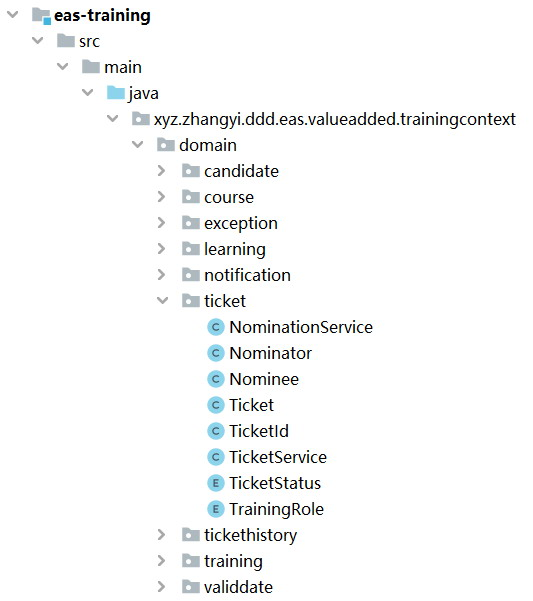

*图20-59 培训上下文的产品代码模型*

图20-59的candidate、course、learning、ticket等命名空间，正是之前设计建模时识别出来的聚合。领域层的测试代码模型与之对应，如图20-60所示。

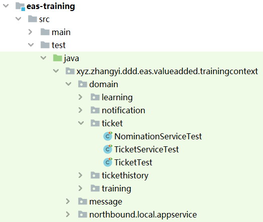

*图20-60 培训上下文的测试代码模型*

#### 20.3.5 EAS的融合设计

针对一个业务服务而言，只有实现了北向网关的远程服务和应用服务、南向网关的端口和适配器，才算真正完成了整个业务服务。它们的设计与开发并不属于领域实现建模的范畴。需要站在系统架构的角度，在系统分层架构、菱形对称架构和前后端分离的背景下，进行整个系统解空间的融合设计。

**1.资源库的实现**

实现了业务服务的领域层代码后，关注点将在北向网关的应用服务交汇。由于应用服务通过集成测试进行验证，因此需要先实现访问外部资源的南向网关适配器。

EAS的数据库为MySQL关系数据库，应选择ORM框架实现资源库。我选择了MyBatis，并采用配置方式定义了Mapper，如此可减少该框架对Repository接口的侵入。虽然MyBatis建议将数据访问对象定义为×××Mapper，但这里我沿用了领域驱动设计的资源库模式，将其定义为资源库接口。它属于菱形对称架构的端口角色。在进行领域实现建模时，端口已经通过测试驱动开发推导出接口的定义，如TicketHistory聚合对应的资源库端口TicketHistoryRepository：

```
package xyz.zhangyi.ddd.eas.valueadded.trainingcontext.southbound.port.repository;
import org.apache.ibatis.annotations.Mapper;
import org.springframework.stereotype.Repository;
import java.util.Optional;
import xyz.zhangyi.ddd.eas.valueadded.trainingcontext.domain.ticket.TicketId;
import xyz.zhangyi.ddd.eas.valueadded.trainingcontext.domain.tickethistory.TicketHistory;
@Mapper
@Repository
public interface TicketHistoryRepository {
   Optional<TicketHistory> latest(TicketId ticketId);
   void add(TicketHistory ticketHistory);
   void deleteBy(TicketId ticketId);
}
```

它对应的mapper配置文件如下：

```
<?xml version="1.0" encoding="UTF-8" ?>
<!DOCTYPE mapper PUBLIC "-//mybatis.org//DTD Mapper 3.0//EN" "http://mybatis.org/dtd/
mybatis-3-mapper.dtd" >
<mapper namespace="xyz.zhangyi.ddd.eas.valueadded.trainingcontext.southbound.port.
repository.TicketHistoryRepository" >
   <resultMap id="ticketHistoryResult" type="TicketHistory" >
      <id column="id" property="id" jdbcType="VARCHAR"/>
      <result column="ticketId" property="ticketId.value" jdbcType="VARCHAR" />
      <result column="operationType" property="operationType" jdbcType="VARCHAR" />
      <result column="operatedAt" property="operatedAt" jdbcType="TIMESTAMP" />
      <association property="owner" javaType="TicketOwner">
         <constructor>
            <arg column="ownerId" jdbcType="VARCHAR" javaType="String"/>
            <arg column="ownerType" jdbcType="VARCHAR" javaType="TicketOwnerType" />
         </constructor>
      </association>
      <association property="stateTransit" javaType="StateTransit">
         <constructor>
            <arg column="fromStatus" jdbcType="VARCHAR" javaType="TicketStatus" />
            <arg column="toStatus" jdbcType="VARCHAR" javaType="TicketStatus" />
         </constructor>
      </association>
      <association property="operatedBy" javaType="Operator">
         <constructor>
            <arg column="operatorId" jdbcType="VARCHAR" javaType="String" />
            <arg column="operatorName" jdbcType="VARCHAR" javaType="String" />
         </constructor>
      </association>
   </resultMap>
   <select id="latest" parameterType="TicketId" resultMap="ticketHistoryResult">
      select
      id, ticketId, ownerId, ownerType, fromStatus, toStatus, operationType, operatorId, 
operatorName, operatedAt
      from ticket_history
      where ticketId = #{ticketId} and operatedAt = (select max(operatedAt) from
ticket_history where ticketId = #{ticketId})
   </select>
​
   <insert id="add" parameterType="TicketHistory">
      insert into ticket_history
      (id, ticketId, ownerId, ownerType, fromStatus, toStatus, operationType, operatorId, 
operatorName, operatedAt)
      values
      (
      #{id},
      #{ticketId}, #{ticketOwner.employeeId}, #{ticketOwner.ownerType},
      #{stateTransit.from}, #{stateTransit.to}, #{operationType},
      #{operatedBy.operatorId}, #{operatedBy.name}, #{operatedAt}
      )
   </insert>
​
   <delete id="deleteBy" parameterType="TicketId">
      delete from ticket_history where ticketId = #{ticketId}
   </delete>
</mapper>
```

虽然领域服务与聚合已经实现，端口的接口定义也已确定，但它们的实现却不曾得到验证。为此，可以考虑在实现应用服务之前，先为南向网关适配器的实现编写集成测试，以验证其正确性。例如，为TicketHistoryRepository编写的集成测试如下：

```
@RunWith(SpringJUnit4ClassRunner.class)
@ContextConfiguration("/spring-mybatis.xml")
public class TicketHistoryRepositoryIT {
   @Autowired
   private TicketHistoryRepository ticketHistoryRepository;
   private final TicketId ticketId = TicketId.from("18e38931-822e-4012-a16e-ac65dfc56f8a");
   @Before
   public void setup() {
      ticketHistoryRepository.deleteBy(ticketId);
      StateTransit availableToWaitForConfirm = StateTransit.from(Available).to(WaitForConfirm);
      LocalDateTime oldTime = LocalDateTime.of(2020, 1, 1, 12, 0, 0);
      TicketHistory oldHistory = createTicketHistory(availableToWaitForConfirm, oldTime);
      ticketHistoryRepository.add(oldHistory);
      StateTransit toConfirm = StateTransit.from(WaitForConfirm).to(Confirm);
      LocalDateTime newTime = LocalDateTime.of(2020, 1, 1, 13, 0, 0);
      TicketHistory newHistory = createTicketHistory(toConfirm, newTime);
      ticketHistoryRepository.add(newHistory);
   }
   @Test
   public void should_return_latest_one() {
      Optional<TicketHistory> latest = ticketHistoryRepository.latest(ticketId);
      assertThat(latest.isPresent()).isTrue();
      assertThat(latest.get().getStateTransit()).isEqualTo(StateTransit.from(WaitForConfirm).to(Confirm));
   }
}
```

考虑到集成测试需要准备测试环境，且它的执行效率也要低于单元测试，故而需要将单元测试和集成测试分为两个不同的构建阶段。

**2.应用服务的实现**

根据服务契约的定义，可以确定应用服务的接口与消息契约对象。在实现应用服务时，需要考虑如下几点。

·应用服务的测试为集成测试：需要通过setup与teardown准备和清除测试数据，并准备运行集成测试的环境。

·依赖管理：考虑应用服务、领域服务、资源库之间的依赖管理，确定依赖注入框架。

·消息契约对象的定义：需要结合对外暴露的远程服务接口定义消息契约对象。

·横切关注点的结合：包括事务、异常处理等横切关注点的实现与集成。

·南向网关的实现：考虑资源库和其他访问外部资源的网关接口的实现，包括框架和技术选型。

“提名候选人”的应用服务NominationAppService实现如下：

```
@Service
@EnableTransactionManagement
public class NominationAppService {
   @Autowired
   private NominationService nominationService;
   @Transactional(rollbackFor = ApplicationException.class)
   public void nominate(NominationRequest nominationRequest) {
      if (Objects.isNull(nominationRequest)) {
         throw new ApplicationValidationException("nomination request can not be null");
      }
      try {
         nominationService.nominate(
                nominationRequest.getTicketId(),
                nominationRequest.getTrainingId(),
                nominationRequest.toCandidate(),
                nominationRequest.toNominator());
      } catch (DomainException ex) {
         throw new ApplicationDomainException(ex.getMessage(), ex);
      } catch (Exception ex) {
         throw new ApplicationInfrastructureException("Infrastructure Error", ex);
      }
   }
}
```

我选择了Spring作为依赖注入的框架，事务处理则采用声明式事务。异常的设计遵循领域驱动设计对异常进行分层的原则，应用服务抛出的异常为派生自ApplicationException类的异常子类。

应用服务接口的消息契约对象负责消息契约与领域模型的转换。若转换行为包含了业务逻辑，则需要编写单元测试去覆盖它，甚至可采用测试驱动开发的过程；如果引入了装配器，更要通过测试来保证代码质量。消息契约对象如果要支持远程服务，就需要消息契约对象支持序列化与反序列化。一些序列化框架会通过反射调用对象的构造函数与getter/setter访问器，故而消息契约对象的定义应遵循Java Bean规范。

为应用服务编写集成测试时，至少需要考虑两个测试用例：正常执行完成的用例与抛出异常需要回滚事务的用例。如下所示：

```
@RunWith(SpringJUnit4ClassRunner.class)
@ContextConfiguration("/spring-mybatis.xml")
public class NominationAppServiceIT {
   @Autowired
   private TrainingRepository trainingRepository;
   @Autowired
   private TicketRepository ticketRepository;
   @Autowired
   private ValidDateRepository validDateRepository;
   @Autowired
   private TicketHistoryRepository ticketHistoryRepository;
   @Autowired
   private NominationAppService nominationAppService;
   @Before
   public void setup() {
      training = createTraining();
      ticket = createTicket();
      validDate = createValidDate();
      // 清除脏数据
      trainingRepository.remove(training);
      ticketRepository.remove(ticket);
      validDateRepository.remove(validDate);
      ticketHistoryRepository.deleteBy(ticketId);
      // 准备测试数据
      trainingRepository.add(this.training);
      ticketRepository.add(ticket);
      validDateRepository.add(validDate);
   }
   @Test
   public void should_nominate_candidate_to_nominee() {
      // given
      NominationRequest nominationRequest = createNominationRequest();
      // when
      nominationAppService.nominate(nominationRequest);
      // then
      Optional<Ticket> optionalAvailableTicket = ticketRepository.ticketOf(ticketId, 
Available);
      assertThat(optionalAvailableTicket.isPresent()).isFalse();
​
      Optional<Ticket> optionalConfirmedTicket = ticketRepository.ticketOf(ticketId, 
TicketStatus.WaitForConfirm);
      assertThat(optionalConfirmedTicket.isPresent()).isTrue();
      Ticket ticket = optionalConfirmedTicket.get();
      assertThat(ticket.id()).isEqualTo(ticketId);
      assertThat(ticket.trainingId()).isEqualTo(trainingId);
      assertThat(ticket.status()).isEqualTo(TicketStatus.WaitForConfirm);
      assertThat(ticket.nomineeId()).isEqualTo(candidateId);
​
      Optional<TicketHistory> optionalTicketHistory = ticketHistoryRepository.latest
(ticketId);
      assertThat(optionalTicketHistory.isPresent()).isTrue();
      TicketHistory ticketHistory = optionalTicketHistory.get();
      assertThat(ticketHistory.ticketId()).isEqualTo(ticketId);
      assertThat(ticketHistory.getStateTransit()).isEqualTo(StateTransit.from(Available).
to(WaitForConfirm));
   }
   @Test
   public void should_rollback_if_DomainException_had_been_thrown() {
      // given
      NominationRequest nominationRequest = createNominationRequest();
      // 移除Valid Date以便抛出DomainException异常
      validDateRepository.remove(validDate);
      // when
      try {
         nominationAppService.nominate(nominationRequest);
      } catch (ApplicationException e) {
         // then
         Optional<Ticket> optionalAvailableTicket = ticketRepository.ticketOf(ticketId, 
Available);
         assertThat(optionalAvailableTicket.isPresent()).isTrue();
         Ticket ticket = optionalAvailableTicket.get();
         assertThat(ticket.id()).isEqualTo(ticketId);
         assertThat(ticket.trainingId()).isEqualTo(trainingId);
         assertThat(ticket.status()).isEqualTo(Available);
         assertThat(ticket.nomineeId()).isEqualTo(null);
      }
   }
}
```

NominationAppService的测试类本应该仅依赖于被测应用服务，此处之所以引入TrainingRepository等资源库的依赖，是为了给集成测试准备和清除数据所用。系统通过flywaydb管理数据库版本与数据迁移，但集成测试需要的数据不在此列，需要由测试提供。由于集成测试会被反复运行，每个测试用例需要的数据都是彼此独立的。

数据的清除本该由JUnit的teardown钩子方法负责，不过，在运行集成测试之后，通常需要手工查询数据库以了解被测方法执行之后的数据结果。如果在测试方法执行后通过teardown清除了数据，就无法查看执行后的结果了。为避免此情形，可以将数据的清除挪到准备数据之前。如上述测试代码所示，清除数据与准备数据的实现都放到了setup钩子方法中。

在编写事务回滚的测试用例时，可以故意营造抛出异常的情况，上述测试方法中，我故意通过ValidDateRepository删除了提名场景需要的有效日期，导致抛出DomainException异常。应用服务在捕获该领域异常后，统一抛出了ApplicationException，因此事务回滚标记的异常类型为ApplicationException：

```
@Transactional(rollbackFor = ApplicationException.class)
public void nominate(NominationRequest nominationRequest) throws ApplicationException {}
```

**3.远程服务的实现**

实现应用服务后，继续逆流而上，编写作为北向网关的远程服务。如果将其定义为REST风格服务，需要遵循REST风格服务接口的设计原则，如TicketResource的实现：

```
@RestController
@RequestMapping("/tickets")
public class TicketResource {
   private Logger logger = Logger.getLogger(TicketResource.class.getName());
   @Autowired
   private NominationAppService nominationAppService;
   @PutMapping
   public ResponseEntity<?> nominate(@RequestBody NominationRequest nominationRequest) {
      if (Objects.isNull(nominationRequest)) {
         logger.log(Level.WARNING,"Nomination Request is Null.");
         return new ResponseEntity<>(HttpStatus.BAD_REQUEST);
      }
      try {
         nominationAppService.nominate(nominationRequest);
         return new ResponseEntity<>(HttpStatus.ACCEPTED);
      } catch (ApplicationException e) {
         logger.log(Level.SEVERE, "Exception raised by nominate REST Call.", e);
         return new ResponseEntity<>(HttpStatus.INTERNAL_SERVER_ERROR);
      }
   }
}
```

REST资源远程服务定义了多个服务方法，虽然对应的服务契约存在差异，但服务方法的实现却大同小异，都会执行对应的应用服务的方法、捕获异常、根据执行结果返回带有不同状态码的值。为了避免重复代码，应用层定义的应用异常类别就派上了用场，利用catch捕获不同类型的应用异常，就可以实现相似的执行逻辑。为此，我在ddd-core模块中定义了一个Resources辅助类：

```
public class Resources {
   private static Logger logger = Logger.getLogger(Resources.class.getName());
   private Resources(String requestType) {
      this.requestType = requestType;
   }
   private String requestType;
   private HttpStatus successfulStatus;
   private HttpStatus errorStatus;
   private HttpStatus failedStatus;
   public static Resources with(String requestType) {
      return new Resources(requestType);
   }
   public Resources onSuccess(HttpStatus status) {
      this.successfulStatus = status;
      return this;
   }
   public Resources onError(HttpStatus status) {
      this.errorStatus = status;
      return this;
   }
   public Resources onFailed(HttpStatus status) {
      this.failedStatus = status;
      return this;
   }
   public <T> ResponseEntity<T> execute(Supplier<T> supplier) {
      try {
         T entity = supplier.get();
         return new ResponseEntity<>(entity, successfulStatus);
      } catch (ApplicationValidationException ex) {
         logger.log(Level.WARNING, String.format("The request of %s is invalid", 
requestType));
         return new ResponseEntity<>(errorStatus);
      } catch (ApplicationDomainException ex) {
         logger.log(Level.WARNING, String.format("Exception raised %s REST Call", 
requestType));
         return new ResponseEntity<>(failedStatus);
      } catch (ApplicationInfrastructureException ex) {
         logger.log(Level.SEVERE, String.format("Fatal exception raised %s REST Call", 
requestType));
         return new ResponseEntity<>(HttpStatus.INTERNAL_SERVER_ERROR);
      }
   }
   public ResponseEntity<?> execute(Runnable runnable) {
      try {
         runnable.run();
         return new ResponseEntity<>(successfulStatus);
      } catch (ApplicationValidationException ex) {
         logger.log(Level.WARNING, String.format("The request of %s is invalid", 
requestType));
         return new ResponseEntity<>(errorStatus);
      } catch (ApplicationDomainException ex) {
         logger.log(Level.WARNING, String.format("Exception raised %s REST Call", 
requestType));
         return new ResponseEntity<>(failedStatus);
      } catch (ApplicationInfrastructureException ex) {
         logger.log(Level.SEVERE, String.format("Fatal exception raised %s REST Call", 
requestType));
         return new ResponseEntity<>(HttpStatus.INTERNAL_SERVER_ERROR);
      }
   }
}
```

execute()方法的不同重载对应于返回各种响应消息对象的场景。不同的异常类别对应的状态码由调用者传入。为了有效地记录日志信息，需要由调用者提供该服务请求的描述。引入Resources类后，TicketResource的服务实现为：

```
@RestController
@RequestMapping("/tickets")
public class TicketResource {
   private Logger logger = Logger.getLogger(TicketResource.class.getName());
   @Autowired
   private NominationAppService nominationAppService;
   @PutMapping
   public ResponseEntity<?> nominate(@RequestBody NominationRequest nominationRequest) {
      return Resources.with("nominate ticket")
             .onSuccess(ACCEPTED)
             .onError(BAD_REQUEST)
             .onFailed(INTERNAL_SERVER_ERROR)
             .execute(() -> nominationAppService.nominate(nominationRequest));
   }
}
```

TrainingResource的实现为：

```
@RestController
@RequestMapping("/trainings")
public class TrainingResource {
   private Logger logger = Logger.getLogger(TrainingResource.class.getName());
   @Autowired
   private TrainingAppService trainingAppService;
   @GetMapping(value = "/{id}")
   public ResponseEntity<TrainingResponse> findBy(@PathVariable String id) {
      return Resources.with("find training by id")
             .onSuccess(HttpStatus.OK)
             .onError(HttpStatus.BAD_REQUEST)
             .onFailed(HttpStatus.NOT_FOUND)
             .execute(() -> trainingAppService.trainingOf(id));
   }
}
```

显然，这样的重构可以有效地规避远程服务出现相似的重复代码。

为了保证远程服务的正确性，应考虑为远程服务编写集成测试或契约测试。若选择Spring Boot作为REST框架，可利用Spring Boot提供的测试沙箱spring-boot-starter-test为远程服务编写集成测试，或者选择Pact 之类的测试框架为其编写消费者驱动的契约测试(consumer- driven contract test)。如果要面向前端定义控制器(controller)，还可考虑引入GraphQL 定义服务，这些服务为前端组成了边缘层的BFF服务。此外，还可以引入Swagger 为这些远程服务定义API文档。

**4.完整的代码模型**

架构映射阶段根据系统分层架构与菱形对称架构的规定，定义了EAS的代码模型。应根据确定的限界上下文划分模块，并保证每个限界上下文的内部遵循菱形对称架构要求的代码模型。在完成了领域建模和融合设计后，EAS最终的代码模型如图20-61所示。

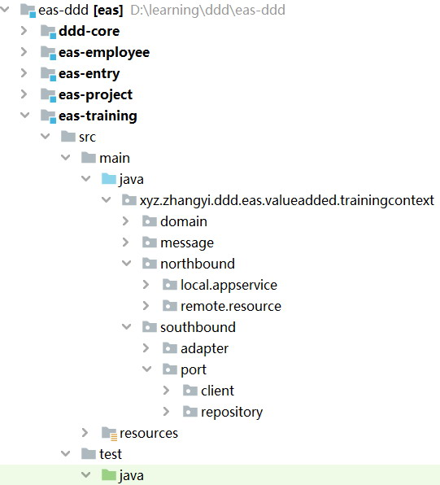

*图20-61 EAS的代码模型*

以下是对代码模型的详细说明。

·eas-ddd：项目名称为EAS。

·eas-training：以项目名称为前缀，命名限界上下文对应的模块。

·eas.valueadded.trainingcontext：限界上下文的命名空间，以context为后缀，用valueadded表示它属于业务价值层。

·message：消息契约对象，遵循领域驱动设计发布语言模式，亦可命名为pl。

·

      northbound：北向网关，遵循领域驱动设计的开放主机服务模式，亦可命名为ohs。

·remote：北向网关的远程服务，根据服务的不同可以分为resource、controller、provider和subscriber。

·

          local：北向网关的本地服务。

·appservice：领域驱动设计应用层的应用服务。

·domain：领域层，内部按照聚合边界进行命名空间划分。每个聚合内的实体、值对象和它对应的领域服务都定义在同一个聚合内部。若领域服务负责协调多个聚合，可以考虑将其放在主要聚合所在的命名空间。

·

      southbound：南向网关，遵循领域驱动设计的防腐层模式，亦可命名为acl。

·port：所有访问外部资源的抽象定义，根据端口类型的不同分为repository、client等。

·adapter：对应于端口的具体实现，同样分为repository、client等。

即使EAS是一个单体架构，也仍然需要清晰地为每个限界上下文定义单独的模块。其中，ddd-core作为遵循共享内核的公共上下文，包含了各个限界上下文都需要调用的领域内核。EAS项目的pom文件体现了这些模块的定义：

```
<project xmlns="http://maven.apache.org/POM/4.0.0"
       xmlns:xsi="http://www.w3***/2001/XMLSchema-instance"
       xsi:schemaLocation="http://maven.apache.org/POM/4.0.0 http://maven.apache.org/
xsd/maven-4.0.0.xsd">
   <modelVersion>4.0.0</modelVersion>
   <groupId>xyz.zhangyi.ddd</groupId>
   <artifactId>eas</artifactId>
   <version>1.0-SNAPSHOT</version>
   <packaging>pom</packaging>
   <modules>
      <module>ddd-core</module>
      <module>eas-employee</module>
      <module>eas-attendance</module>
      <module>eas-project</module>
      <module>eas-training</module>
      <module>eas-entry</module>
   </modules>
</project>
```

eas-entry是整个系统的主程序入口，仅仅定义了一个EasApplication类：

```
package xyz.zhangyi.ddd.eas;
import org.springframework.boot.SpringApplication;
import org.springframework.boot.autoconfigure.SpringBootApplication;
import org.springframework.transaction.annotation.EnableTransactionManagement;
@SpringBootApplication
@EnableTransactionManagement
public class EasApplication {
   public static void main(String[] args) {
      SpringApplication.run(EasApplication.class, args);
   }
}
```

通过它可以为整个系统启动一个服务。Spring Boot需要的配置也定义在eas-entry模块的resource文件夹下。该入口加载的所有远程服务均定义在各个限界上下文的内部，确保了每个限界上下文的架构完整性。

EAS系统的代码模型将限界上下文作为系统的业务边界和应用边界。作为逻辑架构的组成部分，它并不受到或者较少受到通信边界变化的影响，如此就能降低架构从单体架构迁移到微服务架构的成本。事实上，若遵循我建议的代码模型，就会发现：两种迥然不同的架构风格其实拥有完全相同的代码模型。执行架构迁移时，只需注意以下几点：

·与单体架构不同，需要为每个微服务提供一个主程序入口，即去掉eas-entry模块，为每个限界上下文（微服务）定义一个Application类。

·修改southbound\adapter\client的实现，将进程内的通信改为跨进程通信。

·修改数据库的配置文件，让数据库的统一资源定位器(Uniform Resource Locator，URL)指向不同的数据库。

·调整应用层的事务处理机制。如果事务需要协调多个微服务之间的聚合，考虑使用分布式柔性事务。

以上修改皆不影响包括产品代码与测试代码在内的领域层代码。领域层作为菱形对称架构的内核，体现出一如既往的稳定性。

到此为止，我们严格遵循领域驱动设计统一过程，从全局分析、架构映射到领域建模，一丝不苟地采用了领域驱动设计参考过程模型推荐的方法与模式，获得了各个阶段要求输出的工件，完成了EAS系统从问题空间到解空间的完整构建过程。

### 20.4 总结

许多人反映领域驱动设计很难。Eric Evans创造了许多领域驱动设计的专有术语，这为团队学习领域驱动设计制造了知识障碍。对象建模范式的领域驱动设计建立在良好的面向对象设计基础上，如果开发人员对面向对象设计的本质思想理解不深，就会在运用领域驱动设计模式时感到迷茫，不知道该做出怎样的设计决策才满足领域驱动设计的要求。拘泥于书本知识的运用方式过于僵化，使开发人员一旦遇到设计难题又找不到标准答案，就会不知该如何是好。

本书试图解构领域驱动设计，对领域驱动设计方法体系做了进一步精化与提炼，以领域驱动设计统一过程作为过程指导，总结了领域驱动设计的精髓，明确提出了“边界是核心、纪律是关键”的要求，并以领域驱动设计参考过程模型作为具体的实践参考。我们要明其道、求其术，如果说领域驱动设计方法体系是道，各种领域驱动设计的实践就是术。道引导你走在正确的方向上，术帮助你走得更快、更稳健，道与术的融合开拓了更加宽广的领域驱动设计之路。

这一切的基础在于拥有一个成熟的领域驱动设计团队。利用领域驱动设计能力评估模型对团队进行评估，发现团队成员的能力短板后进行针对性的训练，提升敏捷迭代能力、需求分析能力、领域建模能力和架构设计能力，就能让团队推进领域驱动设计无往不利，距离领域驱动设计的成功就不远了！
