# 附录A 领域建模范式

> 我们把世界拿在手里，就是为了一样样放好。

> ——顾城，《节日》

即使采用领域模型驱动设计，不同人针对同一个领域设计的领域模型也会千差万别。这除了因为不同人的设计能力、经验以及对真实世界的理解不一致，还因为对模型产生根本影响的是建模范式(modeling paradigm)。

“范式”一词最初由美国哲学家托马斯·库恩(Thomas Kuhn)在其经典著作《科学革命的结构》(The Structure of Scientific Revolutions)中提出，用于对科学发展的分析。库恩认为每一个科学发展阶段都有特殊的内在结构，而体现这种结构的模型即范式。他明确地给出了一个简洁的范式定义：“按既定的用法，范式就是一种公认的模型或模式。”^

范式可以用来界定什么应该被研究、什么问题应该被提出，也可以用来探索如何对问题进行质疑以及在解释我们获得的答案时该遵循什么样的规则。倘若将范式运用在软件领域的建模过程中，就可以认为建模范式是建立模型的一种模式，是针对业务需求提出的问题进行建模时需要遵循的规则。

建立领域模型可以遵循的主要建模范式包括结构建模范式、对象建模范式和函数建模范式，恰好对应3种编程范式：结构化编程(structured programming)、面向对象编程(object-oriented programming)和函数式编程(functional programming)。建模范式与编程范式的对应关系，也证明了分析、设计和实现三位一体的关系。

### A.1 结构建模范式

一提及面向过程设计，浮现在我们脑海中的大多是一些贬义词：糟糕、邪恶、混乱、贫瘠……实际上，面向过程设计就是结构化编程思想的体现。如果追溯它的发展历史，我们会发现该范式提倡的设计思想大有可观，一些设计原则为面向对象编程和函数式编程提供了有价值的借鉴，并不一定代表“坏”的设计。

#### A.1.1 结构化编程的设计原则

结构化编程的理念最早由Edsger Wybe Dijkstra在1968年提出。在给Communications of the ACM编辑的一封信中，Dijkstra论证了使用goto是有害的，并明确提出了顺序、选择和循环3种基本的结构。这3种基本的结构可以使程序结构变得更加清晰，富有逻辑。

结构化编程强调模块作为功能分解的基本单位。David Parnas解释了何谓“结构”：“所谓‘结构’通常指用于表示系统的部分。结构体现为分解系统为多个模块，确定每个模块的特征，并明确模块之间的连接关系。”针对模块间的连接关系，在同一篇论文中Parnas还提到：“模块间的信息传递可以视为接口(interface)”。这些观点体现了结构化设计的系统分解原则：通过模块对职责进行封装与分离，通过接口管理模块之间的关系。

模块对职责的封装体现为信息隐藏(information hiding)，这一原则同样来自结构化编程。Parnas在1972年发表的论文《论将系统分解为模块的准则》中强调了信息隐藏的原则。Steve McConnell认为：“信息隐藏是软件的首要技术使命中格外重要的一种启发式方法，因为它强调的就是隐藏复杂度，这一点无论是从它的名称还是实施细节上都能看得很清楚。”^在面向对象设计中，信息隐藏其实就是封装和隐私法则的体现。

结构化编程的着眼点是“面向过程”，采用结构化编程范式的语言就被称为“面向过程语言”。因此，面向过程语言同样可以体现“封装”的思想，如C语言允许在头文件中定义数据结构和函数声明，然后在程序文件中具体实现。这种头文件与程序代码的分离，可以保证程序代码中的具体实现细节对调用者而言不可见。当然，结构化语言提供的封装层次不如面向对象语言丰富，对数据结构不具有控制权。倘若有别的函数直接操作数据结构，会在一定程度上破坏这种封装性。

以过程为中心的结构化编程思想强调“自顶向下、逐步向下”的设计原则。它对待问题空间的态度，就是将其分解为一个一个步骤，再由函数来实现每个步骤，并按照顺序、选择或循环的结构对这些函数进行调用，组成一个主函数。每个函数内部同样采用相同的程序结构。以过程式的思想对问题进行步骤拆分，就可以利用功能分解让程序的结构化繁为简，变混乱为清晰。显然，只要问题拆分合理，且注意正确的职责分配与信息隐藏，采用结构化编程思想进行程序设计同样可以交出优秀设计的答卷。

#### A.1.2 结构化编程的问题

不可否认，面向对象设计是面向过程设计暨结构化编程的进化，软件设计人员也在这个发展过程中经历了编程范式的迁移，即从结构化编程范式迁移到面向对象编程范式。为何要从体现结构的过程进化到对象呢？根本原因在于这两种方法对程序的理解截然不同。Pascal语言的发明人沃斯教授认为：数据结构 + 算法 = 程序。这一公式概况了结构化编程范式的特点：数据结构与算法分离，算法用来操作数据结构。这一设计思想会导致以下几个问题。

·无法直观说明算法与数据结构之间的关系：当数据结构发生变化时，分散在整个程序各处的对应算法都需要修改。

·无法限制数据结构可被操作的范围：任何算法都可以操作任何数据结构，就有可能因为某个错误操作导致程序出现问题而崩溃。

·操作数据结构的算法被重复定义：算法的重复定义并非人为所致，而是封装性不足的必然结果。

假设算法f1()和f2()分别操作了数据结构X和数据结构Y^。粒度的原因使数据结构X和数据结构Y共享了底层数据结构Z中标记为i的数据。X、Y和Z之间的关系如图A-1所示。

如果Z的数据i发生了变化，会影响到算法f1()和f2()，由于三者的关系是清晰可知的，因此这一变化是可控的。由于数据结构与算法完全分离，如果同时有别的开发人员增加了一个操作底层数据结构Z的算法，原有开发人员却不知情，如图A-2所示，算法f3()操作了数据结构Z的数据i，就有可能在i发生变化时并没有做相应调整，从而带来隐藏的缺陷。

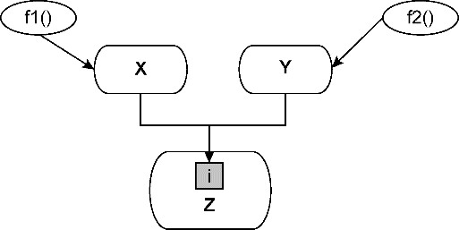

*图A-1 X、Y和Z的关系*

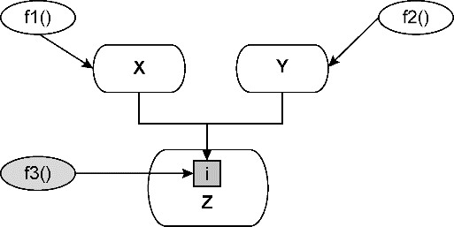

*图A-2 增加了对操作Z数据的算法f3()*

面向对象则不然，它强调将数据结构与算法封装在一起。数据结构作为一个类，它拥有的数据就是类的属性，操作数据的算法则为类的方法，这就使得数据结构与算法之间的关系更加清晰。例如数据结构X与算法f1()封装在一起，数据结构Y和算法f2()封装在一起，同时为数据结构Z提供算法fi()，作为访问数据i的公有接口。任何需要访问数据i的操作包括前面提及的算法f3()都必须通过fi()算法进行调用，如图A-3所示。

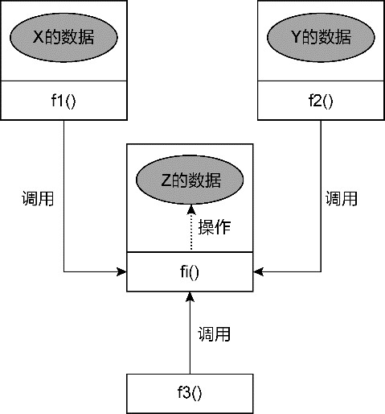

*图A-3 封装了数据i和算法fi()的Z*

倘若Z的数据发生了变化，算法fi()一定会知晓这个变化；由于X和Y的算法f1()、f2()以及后来增加的f3()并没有直接操作该数据，这种变化就被有效地隔离了，不会受到影响。

即使使用了面向对象语言，如果仍然遵循数据结构与算法分离的设计原则，实则也是采用了结构化编程的过程式设计。例如，在Java语言中定义一个矩形Rectangle类，它具有宽度和长度的数据属性：

```
public class Rectangle {
   private int width;
   private int length;
   public Rectangle(int width, int length) {
      this.width = width;
      this.length = length;
   }
   public int getWidth() {
      return width;
   }
   public int getLength() {
      return length;
   }
}
```

一个几何类Geometric需要计算矩形的周长和面积，因此定义了这两个方法，并调用Rectangle拥有的数据：

```
public class Geometric {
   public int area(Rectangle rectangle) {
      return rectangle.getWidth() * rectangle.getLength();
   }
   public int perimeter(Rectangle rectangle) {
      return (rectangle.getWidth() + rectangle.getLength()) * 2;
   }
}
```

其他开发人员需要编写一个绘图工具，同样需要用到Rectangle：

```
public class Painter {
   public void draw(Rectangle rectangle) {
      // ...
      // 产生了和Geometric::area()方法一样的代码
      int area = rectangle.getWidth() * rectangle.getLength();
      //...
   }
}
```

由于Rectangle类将数据与方法分别定义到了不同的地方，调用者Painter在复用Rectangle时并不知道Geometric已经提供了计算面积和周长的方法，因此首先想到的就是由自己实现。这就会造成相同的方法被多个开发人员重复实现的局面。只有极其用心的开发人员才会尽力地降低这类重复。当然，这是以付出额外精力为代价的。

倘若改变结构范式，将数据与操作它的方法放在一起，就能进一步提高封装性。数据被隐藏，开发人员就失去了自由访问数据的权力。如果一个开发人员需要计算Rectangle的面积，数据访问权的丧失会让他首先考虑的不是在类的外部亲自实现某个算法，而是寻求复用别人的实现，从而最大限度地避免重复：

```
public class Rectangle {
   // 没有访问width的需求时，就不暴露该字段
   private int width;
   // 没有访问length的需求时，就不暴露该字段
   private int length;
   public Rectangle(int width, int length) {
      this.width = width;
      this.length = length;
   }
   public int area() {
      return this.width * this.length;
   }
   public int perimeter() {
      return (this.width + this.length) * 2;
   }
}
```

由于数据与方法封装在了一起，因此当我们调用对象时，IDE可以让开发人员迅速判断被调对象是否提供了自己所需的接口，如图A-4所示。

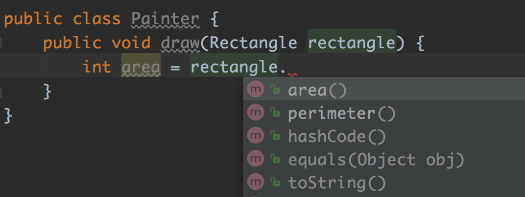

*图A-4 IDE的智能感应*

遵循结构化编程“数据结构与算法分离”的原则建立领域模型，是结构建模范式的典型特征。获得的领域模型往往只有数据没有行为，Martin Fowler将这样的对象组成的模型称为贫血模型，他认为：“贫血模型一个明显的特征是它仅仅是看上去和领域模型一样，都拥有对象、属性，对象间通过关系关联。但是当你观察模型所持有的业务逻辑时，你会发现，贫血模型中除了一些getter、setter方法，几乎没有其他业务逻辑。”

#### A.1.3 结构建模范式的设计模型

在进行模型驱动设计时，若以数据库建立的模型作为设计的驱动力，就会很自然地得到贫血模型，因为在针对数据库和数据表建模时，数据模型中的持久化对象(persistence object，PO)作为数据表的映射，可以认为是一种数据结构，而非真正意义上的对象。操作它的算法（也就是业务逻辑）被转移到了服务对象，通常以过程形式将整个业务服务按照顺序分解为多个子任务，然后组合成为一个完整的过程，操作过程中需要的数据由持久化对象提供。与数据库的交互交给数据访问对象(DAO)，即由其“负责管理与数据源的连接，并通过此连接获取、存储数据”^。数据访问对象封装了数据访问及操作的逻辑，并分离持久化逻辑与业务逻辑，使得数据源可以独立于业务逻辑而变化。

在结构建模范式的指导下，遵循职责分离的设计原则，业务逻辑、数据访问和数据分别以不同的对象参与到设计模型中，形成图A-5所示的关系。

虽然这一设计模型由类来构成，但其设计思想却采用了结构建模范式，持久化对象与服务对象各自体现了数据结构与算法的特征，二者是分离的。

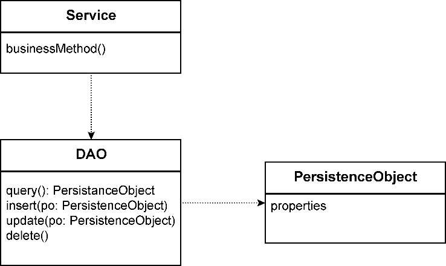

*图A-5 结构建模范式的设计模型*

**1.持久化对象**

持久化对象的数据结构就是对数据表的映射。数据表的设计可以遵循包括一范式(1NF)、二范式(2NF)、三范式(3NF)、BC范式(BCNF)和四范式(4NF)等数据库范式。遵循这些范式可以保证数据表属性的原子性，避免数据冗余等问题。

数据模型的关系数据表并不支持自定义类型，设计模型时为了确保数据表的每一列保持原子性，必须将这个内聚的组合概念进行拆分。例如，地址不能作为一个整体定义为数据表的一个列，因为系统需要访问地址中的城市信息，如果仅设计为一个地址列，就违背了一范式。为此，需要将地址概念设计为包含国家、省份、城市、街道等信息的多个数据列，此时的地址在数据模型中就成了一个分散的概念。

如果要保证地址的概念完整性，在关系数据表中的解决方案是将地址定义为一个独立的数据表，但这又会增加数据模型的复杂度，更会因为引入不必要的表关联影响数据库的访问性能。

避免数据冗余的目的在于避免重复数据，以保证相同数据在整个数据库中的一致性，但是，避免数据冗余并不意味着代码能支持复用。例如，员工表与客户表都定义了“电子邮件”这个属性列。该属性列具有完全相同的业务含义，但在设计数据表时，却分属于两个表不同的列，因为对数据表而言，“电子邮件”列其实是原子的，属于varchar类型。

通过数据模型驱动出来的持久化对象往往与数据表的数据结构形成一一对应的关系。虽然仍可以将这样的持久化对象定义为类，但这样往往没有发挥对象模型的优势。例如数据库中的员工数据表与客户数据表的定义为：

```
# 员工数据表
CREATE TABLE employees(
   id VARCHAR(50) NOT NULL,
   name VARCHAR(20) NOT NULL,
   gender VARCHAR(10),
   email VARCHAR(50) NOT NULL,
   employeeType SMALLINT NOT NULL,
   country VARCHAR(20),
   province VARCHAR(20),
   city VARCHAR(20),
   street VARCHAR(100),
   zip VARCHAR(10),
   onBoardingDate DATE NOT NULL,
   createdTime TIMESTAMP NOT NULL DEFAULT CURRENT_TIMESTAMP,
   updatedTime TIMESTAMP NULL DEFAULT NULL ON UPDATE CURRENT_TIMESTAMP,
   PRIMARY KEY(id)
);
# 客户数据表
CREATE TABLE customers (
   id VARCHAR(50) NOT NULL,
   name VARCHAR(20) NOT NULL,
   gender VARCHAR(10),
   email VARCHAR(50) NOT NULL,
   customerType SMALLINT NOT NULL,
   country VARCHAR(20),
   province VARCHAR(20),
   city VARCHAR(20),
   street VARCHAR(100),
   zip VARCHAR(10),
   registeredDate DATE NOT NULL,
   createdTime TIMESTAMP NOT NULL DEFAULT CURRENT_TIMESTAMP,
   updatedTime TIMESTAMP NULL DEFAULT NULL ON UPDATE CURRENT_TIMESTAMP,
   PRIMARY KEY(id)
);
```

与这两个数据表对应的对象模型如图A-6所示。

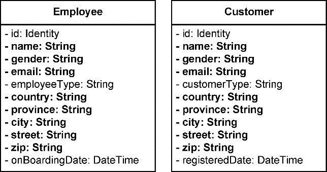

*图A-6 数据模型对应的对象模型*

员工类与客户类都定义了诸如country、city等地址信息，但它们是分散的，各自被定义为基本类型，无法实现对地址概念的复用。遵循对象建模范式设计出来的对象模型就不同了，往往会引入细粒度的类型定义来表达高内聚的概念，如此即可提供恰如其分的复用粒度，如图A-7所示。

遵循结构建模范式建立的模型不仅没有利用好对象模型的优势，还往往被当作数据结构，而将操作数据结构的算法即对象的行为分配给了服务对象。

**2.服务对象**

由于持久化对象和数据访问对象都不包含业务逻辑，服务对象就成了业务逻辑的唯一栖身之地。在实现一个业务服务时，持久化对象作为数据的提供者，服务则作为数据的操作者，将整个业务服务按照顺序分解为多个子任务，然后组合为一个完整的过程。这一设计方式是事务脚本(transaction script)的体现。

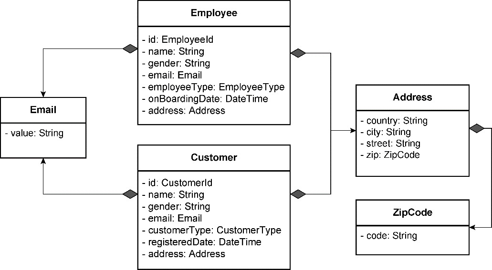

*图A-7 对象建模范式的对象模型*

事务脚本“使用过程来组织业务逻辑，每个过程处理来自表现层的单个请求”^。这是一种典型的过程式设计，每个服务功能都是一系列步骤的组合，形成一个完整的过程事务。例如，为一个音乐网站提供添加好友功能，可以分解为以下步骤：

·确定用户是否已经是朋友；

·确定用户是否已被邀请；

·若未邀请，发送邀请信息；

·创建朋友邀请。

采用事务脚本模式定义的服务如下：

```
public class FriendInvitationService {
   public void inviteUserAsFriend(String ownerId, String friendId) {
      try {
         bool isFriend = friendshipDao.isExisted(ownerId, friendId);
         if (isFriend) {
            throw new FriendshipException(String.format("Friendship with user id %s 
is existed.", friendId));
         }
         bool beInvited = invitationDao.isExisted(ownerId, friendId);
         if (beInvited) {
            throw new FriendshipException(String.format("User with id %s had been 
invited.", friendId));
         }
         FriendInvitation invitation = new FriendInvitation();
         invitation.setInviterId(ownerId);
         invitation.setFriendId(friendId);
         invitation.setInviteTime(DateTime.now());
         User friend = userDao.findBy(friendId);
         sendInvitation(invitation, friend.getEmail());
         invitationDao.create(invitation);
      } catch (SQLException ex) {
         throw new ApplicationException(ex);
      }
   } 
}
```

不要因为事务脚本采用面向过程设计就排斥这一模式。Martin Fowler对于事务脚本说了一句公道话：“不管你是多么坚定的面向对象的信徒，也不要盲目排斥事务脚本。许多问题本身是简单的，一个简单的解决方案可以加快你的开发速度，而且运行起来也会更快。”^

即使采用事务脚本，也可通过提取方法来改进代码的可读性。每个方法提供了一定的抽象层次，提取的方法可在一定程度上隐藏细节，保持合理的抽象层次。这种方式被Kent Beck总结为组合方法(composed method)模式^：

·把程序划分为方法，每个方法执行一个可识别的任务；

·让一个方法中的所有操作处于相同的抽象层；

·这会自然地产生包含许多小方法的程序，每个方法只包含少量代码。

如上的inviteUserAsFriend()方法可重构为：

```
public class FriendInvitationService {
   public void inviteUserAsFriend(String ownerId, String friendId) {
      try {
         validateFriend(ownerId, friendId);
         FriendInvitation invitation = createFriendInvitation(ownerId, friendId);
         sendInvitation(invitation, friendId);
         invitationDao.create(invitation);
      } catch (SQLException ex) {
         throw new ApplicationException(ex);
      }
   } 
}
```

贫血模型加事务脚本的实现直接而简单，在面对相对简单的业务逻辑时，这种方式在处理性能和代码可读性方面都有着明显的优势，但可能会导致设计出一个庞大的持久化对象类与服务类。由于缺乏清晰而粒度合理的领域概念，随着需求的变化与增加，代码很容易膨胀。当代码膨胀到一定程度后，由于缺乏对数据和行为的封装，难以形成合理的职责分配，导致职责被挤在了一起，就会形成意大利面条似的代码。

显然，结构建模范式并非一无是处，在模块划分与层次分解方面建立的设计原则和设计思想仍然值得借鉴，实则对象建模范式要遵循的设计原则有许多来自结构建模范式的贡献，但在建立领域模型时，结构建模范式提倡数据结构与算法分离的做法，会影响领域对象的封装能力。在面对纷繁复杂的领域逻辑时，封装能力的不足会随着规模的扩大而影响代码的质量，扁平的持久化对象形成的贫血模型缺乏业务的表达能力，服务对象又采用事务脚本来表达业务逻辑，容易使相同的业务代码分散在各个服务方法乃至各个服务类。代码缺乏边界的控制，使得程序结构容易陷入混乱、无序和重复的局面，增加了系统的复杂度。

### A.2 对象建模范式

领域驱动设计通常采用面向对象的编程范式，这种范式将领域中的所有概念都视为“对象”。遵循面向对象的设计思想，社区的重要声音是避免设计出只有数据属性的贫血模型。当然，对象建模范式要遵循的设计思想和原则并不止于此，要把握面向对象设计的核心，我认为需要抓住职责与抽象这两个核心。

#### A.2.1 职责

职责(responsibility)之所以名为职责而非行为(behavior)或功能(function)，是从角色拥有何种能力的角度做出的思考。职责是对象封装的判断依据：因为对象拥有了数据，即认为它掌握了某个领域的知识，从而具备完成某一功能的能力；因为该对象拥有了这一能力，故而在定义对象时，赋予了它参与业务场景的角色，产生与其他对象之间的协作。以“职责”为核心进行面向对象设计，就是要通过职责去寻找应该履行该职责的角色，再思考角色之间如何协作完成一个完整的任务。

角色由对象承担，职责的履行使得对象似乎拥有了生命与意识，使得我们能够以拟人的方式对待对象。一个聪明的对象知道自己应该履行哪些职责、拒绝哪些职责以及如何与其他对象协作共同履行职责。这就要求对象必须成为一名行为的协作者，而非只知提供数据的愚笨对象。

**1.行为的协作者**

设想在超市购物的场景，顾客Customer通过钱包Wallet付款给超市收银员Cashier。这3个对象之间的协作如下代码所示：

```
public class Wallet {
   private float value;
   public Wallet(float value) {
      this.value = value;
   }
   public float getTotalMoney() {
      return value;
   }
   public void setTotalMoney(float newValue) {
      value = newValue;
   }
   public void addMoney(float deposit) {
      value += deposit;
   }
   public void subtractMoney(float debit) {
      value -= debit;
   }
}
public class Customer {
   private String firstName;
   private String lastName;
   private Wallet myWallet;
   public Customer(String firstName, String lastName) {
      this(firstName, lastName, new Wallet(0f));
   }
   public Customer(String firstName, String lastName, Wallet wallet) {
      this.firstName = firstName;
      this.lastName = lastName;
      this.myWallet = wallet;
   }
   public String getFirstName(){
      return firstName;
   }
   public String getLastName(){
      return lastName;
   }
   public Wallet getWallet(){
      return myWallet;
   }
}
public class Cashier {
   public void charge(Customer customer, float payment) {
      Wallet theWallet = customer.getWallet();
      if (theWallet.getTotalMoney() > payment) {
         theWallet.subtractMoney(payment);
      } else {
         throw new NotEnoughMoneyException();
      }
   }
}
```

在购买超市商品的业务场景下，Cashier与Customer对象之间产生了协作。然而，这种协作关系很不合理：站在顾客角度讲，他在付钱时必须将自己的钱包交给收银员，暴露了自己的隐私，让钱包处于危险的境地；站在收银员的角度讲，他需要像一个劫匪一般要求顾客把钱包交出来，在检查钱包内的钱足够之后，还要从顾客的钱包中掏钱出来完成支付。双方对这次协作都不满意，原因就在于参与协作的Customer对象仅仅作为数据提供者，为Cashier对象提供了Wallet数据。

这种职责协作方式违背了迪米特法则(Law of Demeter)。该法则要求任何一个对象或者方法，只能调用下列对象：

·该对象本身；

·作为参数传进来的对象；

·在方法内创建的对象。

作为参数传入的Customer对象，可以被Cashier调用，但Wallet对象既非通过参数传递，又非方法内创建的对象，当然也不是Cashier对象本身。按照迪米特法则，Cashier不应该与Wallet协作，甚至都不应该知道Wallet对象的存在。

从代码坏味道的角度来讲，以上代码属于典型的“依恋情结”坏味道。Martin Fowler认为这种经典气味是：“函数对某个类的兴趣高过对自己所处类的兴趣。这种孺慕之情最通常的焦点便是数据。”^Cashier对Customer的Wallet产生了过度的“热情”，Cashier的charge()方法操作的几乎都是Customer对象的数据。该坏味道说明职责的分配有误，应该将这些特性“归还”给Customer对象：

```
public class Customer {
   private String firstName;
   private String lastName;
   private Wallet myWallet;
   public void pay(float payment) {
      // 注意这里不再调用getWallet()，因为wallet本身就是Customer拥有的数据
      if (myWallet.getTotalMoney() >= payment) {
         myWallet.subtractMoney(payment);
      } else {
         throw new NotEnoughMoneyException();
      }
   }
}
public class Cashier {
   // charge行为与pay行为进行协作
   public void charge(Customer customer, float payment) {
      customer.pay(payment);
   }
}
```

将支付行为分配给Customer之后，收银员的工作就变轻松了，顾客也不担心钱包被收银员看到了。协作的方式之所以焕然一新，原因就在于Customer不再作为数据的提供者，而是通过支付行为参与协作。Cashier负责收钱，Customer负责交钱，二者只需关注协作行为的接口，而不需要了解具体实现该行为的细节。这就是封装概念提到的“隐藏细节”。这些被隐藏的细节其实就是对象的“隐私”，不允许轻易公开。当Cashier不需要了解支付的细节之后，Cashier的工作就变得更加简单，符合“Unix之父”Dennis Ritchie和Ken Thompson提出的“保持简单和直接”(Keep It Simple and Stupid，KISS)原则。

注意区分重构前后的Customer类定义。当我们将pay()方法转移到Customer类后，去掉了getWallet()方法，因为Customer不需要将自己的钱包公开出去。至于对Wallet钱包的访问，由于pay()与myWallet字段都定义在Customer类中，就可以直接访问定义在类中的私有变量。

Jeff Bay总结了优秀软件设计的9条规则，其中一条规则为“不使用任何getter/setter/property”^。这一规则是否打破了许多Java或C#开发人员的编程习惯？能做到这一点吗？为何要这样要求呢？Jeff Bay认为：“如果可以从对象之外随便询问实例变量的值，那么行为与数据就不可能被封装到一处。在严格的封装边界背后，真正的动机是迫使程序员在完成编码之后，一定有为这段代码的行为找到一个适合的位置，确保它在对象模型中的唯一性。”^

这一原则其实就是为了避免一个对象在协作场景中“沦落”为一个低级的数据提供者。虽然在面向对象设计中，对象才是“一等公民”，但对象的行为才是让对象社区活起来的唯一动力。基于这个原则，我们可以继续优化以上代码。我们发现，Wallet的totalMoney属性也无须公开给Customer。采用行为协作模式，应该由Wallet自己判断钱是否足够，而非直接返回totalMoney：

```
public class Wallet {
   private float value;
   public boolean isEnough(float payment) {
      return value >= payment;
   }
   public void addMoney(float deposit) {
      value += deposit;
   }
   public void subtractMoney(float debit) {
      value -= debit;
   }
}
```

Customer的pay()方法则修改为：

```
public class Customer {
   public void pay(float payment) {
      if (myWallet.isEnough(payment)) {
         myWallet.subtractMoney(payment);
      } else {
         throw new NotEnoughMoneyException();
      }
   }
}
```

通过行为协作的方式满足命令而非询问(tell, don’t ask)原则。这个原则要求一个对象应该命令其他对象做什么，而不是去查询其他对象的状态来决定做什么。显然，顾客应该命令钱包：钱够吗？而不是去查询钱包中装了多少钱，然后由顾客自己来判断钱是否足够。看到了吗？在真实世界，钱包是一个没有生命的东西，但到了对象的世界里，钱包拥有了智能意识，它自己知道自己的钱是否足够。

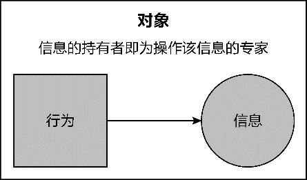

*图A-8 信息专家模式*

在进行面向对象设计时，设计者需具有“拟人化”的设计思想。我们需要代入设计对象，就好像他们都是一个个可以自我思考的人一般。Cashier不需要“知道”支付的细节，因为这些细节是Customer的“隐私”。这些隐藏的细节其实就是Customer拥有的“知识”，它能够很好地“理解”这些知识，并做出符合自身角色的智能判断。分配职责的标准是看哪个对象真正“理解”这个职责。怎么才能理解呢？就是看对象是否拥有理解该职责的知识。知识即信息，信息就是对象所拥有的数据。这就是信息专家模式的核心内容：信息的持有者即为操作该信息的专家。图A-8清晰地表达了这一模式的本质。

**2.信息专家模式**

信息专家模式体现了专业的事情交给专业的对象去做的行事原则。在对象世界里，若每个对象都能成为信息专家，就能做到各司其职、各尽其责。例如，在报表系统中，ParameterController类需要根据客户的Web请求参数作为条件动态生成报表。这些请求参数根据其数据结构的不同分为以下3种。

·简单参数SimpleParameter：代表键(key)和值(value)的一对一关系。

·元素项参数ItemParameter：一个参数包含多个元素项，每个元素项又包含键和值的一对一关系。

·表参数TableParameter：参数的结构形成一张表，包含行头、列头和数据单元格。

这些参数都实现了Parameter接口，该接口的定义为：

```
public interface Parameter {
   String getName();
}
public class SimpleParameter implements Parameter {}
public class ItemParameter implements Parameter {}
public class TableParameter implements Parameter {}
```

在报表的元数据中已经配置了各种参数，包括它们的类型信息。服务端在接收到Web请求时，通过ParameterGraph加载配置文件，利用反射创建各自的参数对象。此时，ParameterGraph拥有的参数并没有填充具体的值，需要通过ParameterController从Servlet包的HttpServletRequest接口获得参数值，对各个参数进行填充。代码如下：

```
public class ParameterController {
   public void fillParameters(HttpServletRequest request, ParameterGraph parameterGraph) {
      for (Parameter para : parameterGraph.getParameters()) {
         if (para instanceof SimpleParameter) {
            SimpleParameter simplePara = (SimpleParameter) para;
            String[] values = request.getParameterValues(simplePara.getName());
            simplePara.setValue(values);
         } else {
            if (para instanceof ItemParameter) {
               ItemParameter itemPara = (ItemParameter) para;
               for (Item item : itemPara.getItems()) {
                  String[] values = request.getParameterValues(item.getName());
                  item.setValues(values);
               }
            } else {
               TableParameter tablePara = (TableParameter) para;
               String[] rows =
                      request.getParameterValues(tablePara.getRowName());
               String[] columns =
                      request.getParameterValues(tablePara.getColumnName());
               String[] dataCells =
                      request.getParameterValues(tablePara.getDataCellName());
               int columnSize = columns.length;
               for (int i = 0; i < rows.length; i++) {
                  for (int j = 0; j < columns.length; j++) {
                     TableParameterElement element = new TableParameterElement();
                     element.setRow(rows[i]);
                     element.setColumn(columns[j]);
                     element.setDataCell(dataCells[columnSize * i + j]);
                     tablePara.addElement(element);
                  }
               }
            }
         }
      }
   }
}
```

这3种参数对象都将自己的数据“屈辱”地交给了ParameterController，却没想到自己拥有填充参数数据的能力，毕竟只有它们自己才最清楚各自参数的数据结构。如果让这些参数对象成为操作自己信息的专家，情况就完全不同了：

```
public class SimpleParameter implements Parameter {
   public void fill(HttpServletRequest request) {
      String[] values = request.getParameterValues(this.getName());
      this.setValue(values);
   }
}
public class ItemParameter implements Parameter {
   public void fill(HttpServletRequest request) {
      ItemParameter itemPara = this;
      for (Item item : itemPara.getItems()) {
         String[] values = request.getParameterValues(item.getName());
         item.setValues(values);
      }
   }
}
// TableParameter的实现略去
```

当参数自身履行了填充参数的职责时，ParameterController就变得简单了：

```
public class ParameterController {
   public void fillParameters(HttpServletRequest request, ParameterGraph parameterGraph) {
      for (Parameter para : parameterGraph.getParameters()) {
         if (para instanceof SimpleParameter) {
            ((SimpleParameter) para).fill(request);
         } else {
            if (para instanceof ItemParameter) {
               ((ItemParameter) para).fill(request);
            } else {
               ((TableParameter) para).fill(request);
            }
         }
      }
   }
}
```

各种参数的数据结构不同，导致了填充行为存在差异，但从抽象层面看，都是将一个HttpServletRequest填充到Parameter中。于是可以将fill()方法提升到Parameter接口，形成3种参数类型对Parameter接口的多态实现：

```
public class ParameterController {
   public void fillParameters(HttpServletRequest request, ParameterGraph parameterGraph) {
      for (Parameter para : parameterGraph.getParameters()) {
         para.fill(request);
      }
   }
}
```

当一个对象成为操作自己信息的专家时，调用者就可以仅关注对象能够“做什么”，无须操心其“如何做”，从而将实现细节隐藏起来。由于各种参数对象自身履行了填充职责，ParameterController就可以只关注抽象Parameter提供的公开接口，无须考虑实现，对象之间的协作变得更加松耦合，对象的多态能力才能得到充分体现。

**3.单一职责原则**

信息专家模式承诺将操作信息的行为优先分配给拥有该信息的对象，当它牢牢地攥紧自己拥有的数据时，就像小孩子害怕别人抢走自己的糖果紧紧捂住自己的口袋，腾不出手去抢别人兜里的糖果了。每个对象皆为操作信息的专家，就能审时度势地决定职责的履行者究竟是谁，并发出行为协作的请求。由于完成一个完整的职责往往需要操作分布在不同对象的信息，意味着需要多个局部的信息专家通过协作来完成任务，从而形成对象的分治。

要形成对象的分治，就要求对象拥有的职责不能过多，也不能什么都不做。如何衡量职责的多寡？需要遵循单一职责原则(single responsibility principle，SRP)，即“一个类应该有且只有一个变化的原因”^。该如何理解这一原则？当一个类只有一个引起它变化的原因时，就意味着分配给它的职责必须是紧密相关的。如果发现一个类存在多于一个的变化点，就应该分离变化。

将信息专家模式与单一职责原则结合起来，就给了我们一个启示，即优先根据信息专家模式分配职责，当信息专家拥有的职责存在多于一个的变化点时，再考虑分离其中一个变化点，分配给另外一个对象。例如，针对上游系统发送来的航班计划信息，需要将JSON格式的消息转换为Flight对象。虽然Flight对象不具备JSON消息拥有的数据，但由于它了解自己的结构，根据信息专家模式，转换逻辑可以优先分配给它来完成：

```
public class Flight {
   public void from(JsonObject flightPlanMessage) {}
}
```

随着需求的变化，除了需要支持JSON格式，还需要支持XML格式的消息。难道我们该直接修改Flight类，使其支持这两种消息格式吗？如下所示：

```
public class Flight {
   public void fromJson(JsonObject flightPlanMessage) {}
   public void fromXml(XmlNodes flightPlanMessage) {}
}
```

这一实现虽有见招拆招之嫌，不过毕竟满足了变化的需求。然而，随着变化不断出现，系统需要支持越来越多的机场，每个机场发送航班计划消息的系统可能都不相同，消息协议和消息格式也不尽相同，难道我们应该为这些差异化不断地增加新的方法吗？设计是没有定论的，每个设计原则都有其适用场景，到了此时，已不再是信息专家模式所能满足的，必须遵循单一职责原则，将发生变化的转换行为分离出去，同时，还应对消息协议做一层统一的抽象：

```
public interface FlightTransformer {
   Flight transformFrom(MessageNodes flightPlanMessage);
}
```

识别变化是运用单一职责原则的关键，只有正确地识别了变化，才能以正确的方式分离变化。有分就有合，分离出去的变化点还会被原有的类调用。有了调用关系，就会出现依赖。如果分离出去的变化点是不稳定的，原有的类依旧会受到变化的影响。容易变化的内容往往牵涉到具体的实现，只有抽象才是相对稳定不变的。

#### A.2.2 抽象

什么是设计的抽象呢？我们来看一则故事。

3个秀才到省城参加乡试，临行前3人都对自己能否中举惴惴不安，于是求教于街头的算命先生。算命先生徐徐伸出一个手指，就闭上眼睛不再言语，一副高深莫测的模样。3人纳闷，给了银子，带着疑惑到了省城参加考试。发榜之日，3人一起去看成绩，得知结果后，3人齐叹，算命先生真乃神人矣！

抽象就是算命先生的“一指禅”，一个指头代表了4种完全不同的含义——是一切人高中，还是一个都不中？是一个人落榜，还是一个人高中？算命先生并不能未卜先知，因此只能给出一个包含了所有可能却无具体实现的答案，至于是哪一种结果，就留给3个秀才慢慢琢磨吧。这就是抽象，它意味着可以包容变化，也就意味着稳定。

**1.提炼行为特征**

抽象是对共同特征的一种高度提炼，可以从行为之间的差异识别共性。例如按钮与灯泡之间的关系如图A-9所示。

Button依赖于具体的Lamp类，使得按钮只能控制灯泡，导致了二者之间的强耦合。如果没有变化，这样的耦合不会带来坏的影响，一旦变化发生，耦合就会制约程序的扩展性。例如，客户希望生产的按钮不仅能够控制灯泡，还要能够控制电视机或者其他电器设备，这一设计就不可取了。灯泡的开关和电视机的开关在行为上必然存在差异，抽象的共性却都是开和关。抹掉电器设备之间的差异，按钮操作的是开关，而非具体的电器。根据这一共性特征，可定义一个抽象的接口Switchable。该接口代表开和关的能力，只要具备这一能力的设备都可以被按钮控制，如图A-10所示，增加了按钮可以控制的电视机。

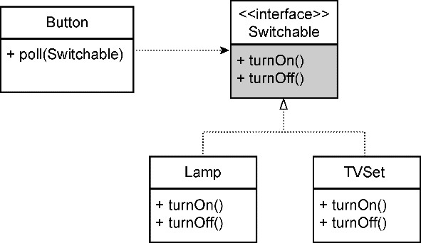

*图A-10 抽象为Switchable接口*

按钮察觉不到电器设备的存在，对Button而言，它只知道Switchable接口。只要该接口定义的turnOn()与turnOff()方法不变，Button就不会受到影响。这意味着任何实现了Switchable接口的电器设备都可以替换Lamp或TVSet，并被按钮所操作。谁来决定按钮操作的电器设备呢？它们的调用者，如Client类：

```
public class Client {
   public static void final main(String[] args) {
      Button button = new Button();
      Switchable switchable = new Lamp();
      // 开/关灯
      button.poll(switchable);
      switchable = new TVSet();
      // 开/关电视
      button.poll(switchable);
   }
}
```

Client类的main()函数通过new关键字分别创建了Lamp与TVSet具体类的实例，带来了Client与具体类的依赖。

只要无法彻底绕开对具体对象的创建，抽象就不能完全解决耦合的问题。因此在面向对象设计中，需要尽量将导致具体依赖的创建对象逻辑往外推，直到调用者必须创建具体对象为止。这种把依赖往外推，直到在最外层不得不创建具体对象时，再将依赖从外部传递进来的方式，就是依赖注入。

**2.依赖注入**

依赖注入最初的名称叫“控制反转”(inversion of control)，Martin Fowler在探索了这个模式的工作原理之后，给它取了现在这个更能体现其特点的名字。依赖注入解除了调用者与被调用者之间的耦合，其中的关键在于抽象和依赖外推，最后再通过某种机制注入依赖。

例如，下订单业务场景提供了同步和异步插入订单的策略，插入订单时需要根据不同情况选择本地事务和分布式事务。下订单的实现者并不知道调用者会选择哪种插入订单的策略，插入订单的实现者也不知道调用者会选择哪种事务类型。要做到各自的实现者无须关心具体策略或事务类型的选择，就应该将具体的决策向外推：

```
public interface TransactionScope {
   void using(Command command);
}
public class LocalTransactionScope implements TransactionScope {}
public class DistributedTransactionScope implements TransactionScope {}
public interface InsertingOrderStrategy {
   void insert(Order order);
}
public class SyncInsertingOrderStrategy implements InsertingOrderStrategy {
   // 把对TransactionScope的具体依赖往外推
   private TransactionScope ts;
   // 通过构造函数允许调用者从外边注入依赖
   public SyncInsertingOrderStrategy(TransactionScope ts) {
      this.ts = ts;
   }
   public void insert(Order order) {
      ts.using(() -> {
         // 同步插入订单，实现略
         return;
      });
   }
}
public class AsyncInsertingOrderStrategy implements InsertingOrderStrategy {
   // 把对TransactionScope的具体依赖往外推
   private TransactionScope ts;
   // 通过构造函数允许调用者从外边注入依赖
   public AsyncInsertingOrderStrategy(TransactionScope ts) {
      this.ts = ts;
   }
   public void insert(Order order) {
      ts.using(() -> {
         // 异步插入订单，实现略
         return;
      });
   }
}
public class PlacingOrderService {
   // 把对InsertingOrderStrategy的具体依赖往外推
   private InsertingOrderStrategy insertingStrategy;
   // 通过构造函数允许调用者从外边注入依赖
   public PlacingOrderService(InsertingOrderStrategy insertingStrategy) {
      this.insertingStrategy = insertingStrategy;
   }
   public void execute(Order order) {
      insertingStrategy.insert(order);
   }
}
```

从内到外，在SyncInsertingOrderStrategy和AsyncInsertingOrderStrategy类的实现中，把具体的TransactionScope依赖向外推给PlacingOrderService；在Placing OrderService类中，又把具体的InsertingOrderStrategy依赖向外推给潜在的调用者。到底使用何种插入策略和事务类型，与PlacingOrderService等提供服务行为的类无关，选择权交给了最终的调用者。如果使用类似Spring这样的依赖注入框架，就可以通过配置或者注解等方式完成依赖的注入。例如使用注解：

```
public interface InsertingOrderStrategy {
   void insert(Order order);
}
@Component
public class SyncInsertingOrderStrategy implements InsertingOrderStrategy {
   @Autowired
   private TransactionScope ts;
   public void insert(Order order) {
      ts.using(() -> {
         // 同步插入订单，实现略
         return;
      });
   }
}
public class PlacingOrderService {
   @Autowired
   private InsertingOrderStrategy insertingStrategy;
   public void execute(Order order) {
      insertingStrategy.insert(order);
   }
}
```

**3.封装变化**

单一职责原则要求将多余的变化分离出去。分离，并不意味着彻底斩断关系，分离出去的行为还需要与原对象产生协作。若要降低协作产生的依赖强度，就需要进一步对变化进行抽象。识别变化点，对变化的职责进行分离和抽象，这一设计思想可称为“封装变化”。封装变化通过封装隐藏内部的实现细节，对外公开不变的接口，如图A-11所示。

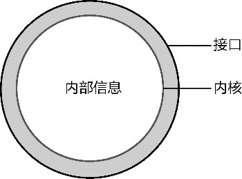

*图A-11 封装变化 要让对象的内核保持稳定性，就需要将不稳定的因素排除在外。封装变化的一种典型体现是“分离变化与不变”。一个对象的职责既有不变的部分，又有可变的部分，就不能让变化影响不变的职责。解决方案是将可变的部分分离出去，抽象为一个不变的接口，再以委派的形式传回原对象，如图A-12所示。*

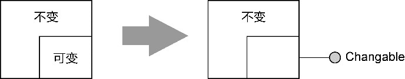

*图A-12 分离变化与不变*

抽象出来的接口Changable其实就是策略(strategy)模式或者命令(command)模式的体现。例如，Java线程的实现机制是不变的，但运行在线程中的业务却随时可变，将这部分可变的业务分离出来，抽象为Runnable接口，再以构造函数参数的方式传入Thread中：

```
public class Thread ... {
   private Runnable target;
   public Thread(Runnable target) {
      init(null, target, "Thread-" + nextThreadNum(), 0);
   }
   public void run() {
      if (target != null) {
         target.run();
      }
   }
}
```

模板方法(template method)模式同样分离了变与不变，只是分离变化的方向是向上提取为抽象类的抽象方法，如图A-13所示。

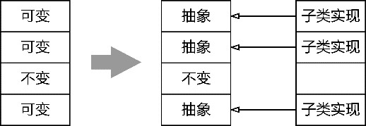

*图A-13 向上提取抽象方法*

这种形式有效地利用了继承对代码复用和类型多态的支持。例如，授权认证功能的主体是对认证信息令牌进行处理，完成认证。如果通过认证就返回认证结果，如果无法通过就抛出AuthenticationException异常。整个认证功能的执行步骤是不变的，但对令牌的处理需要根据认证机制的不同提供不同实现，甚至允许用户自定义认证机制。为了满足部分认证机制的变化，可以对这部分可变的内容进行抽象。AbstractAuthenticationManager是一个抽象类，定义了authenticate()模板方法：

```
public abstract class AbstractAuthenticationManager {
   // 模板方法，它是稳定不变的
   public final Authentication authenticate(Authentication authRequest)
         throws AuthenticationException {
      try {
         Authentication authResult = doAuthentication(authRequest);
         copyDetails(authRequest, authResult);
         return authResult;
      } catch (AuthenticationException e) {
         e.setAuthentication(authRequest);
         throw e;
      }
   }
   private void copyDetails(Authentication source, Authentication dest) {
      if ((dest instanceof AbstractAuthenticationToken) && (dest.getDetails() == null)) {
         AbstractAuthenticationToken token = (AbstractAuthenticationToken) dest;
         token.setDetails(source.getDetails());
      }
   }
   // 基本方法，定义为受保护的抽象方法，具体实现交给子类
   protected abstract Authentication doAuthentication(Authentication authentication)
         throws AuthenticationException;
}
```

该模板方法调用的doAuthentication()是一个受保护的抽象方法，没有任何实现。这就是可变的部分，交由子类实现，如ProviderManager子类：

```
public class ProviderManager extends AbstractAuthenticationManager {
   // 实现了自己的认证机制
   public Authentication doAuthentication(Authentication authentication)
         throws AuthenticationException {
      Class toTest = authentication.getClass();
      AuthenticationException lastException = null;
      for (AuthenticationProvider provider : providers) {
         if (provider.supports(toTest)) {
            logger.debug("Authentication attempt using " + provider.getClass().getName());
            Authentication result = null;
            try {
               result = provider.authenticate(authentication);
               sessionController.checkAuthenticationAllowed(result);
            } catch (AuthenticationException ae) {
               lastException = ae;
               result = null;
            }
            if (result != null) {
               sessionController.registerSuccessfulAuthentication(result);
               applicationEventPublisher.publishEvent(new AuthenticationSuccessEvent
(result));
               return result;
            }
         }
      }
      throw lastException;
   }
}
```

如果一个对象存在两个可能变化的职责，就需要将其中一个变化的职责分离出去，这也是单一职责原则的要求。为了应对变化，还需要分别抽象，然后组合这两个抽象职责，形成图A-14所示的桥接(bridge)模式。

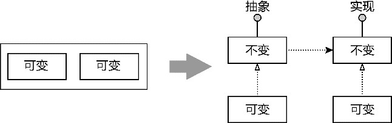

*图A-14 分离并抽象变化*

桥接模式充分利用了职责分离与抽象的稳定性。例如，在实现数据权限控制时，需要根据解析配置内容获得数据权限规则，再根据解析后的规则对数据进行过滤。规则解析职责与数据过滤职责的变化方向完全不同，不能将它们定义到一个类或接口中：

```
public interface DataRuleParser {
   List<DataRule> parseRules();
   T List<T> filterData(List<T> srcData);
}
```

正确的做法是分离规则解析与数据过滤职责，定义到两个独立接口。数据权限控制的过滤数据功能是实现数据权限的目标，应以数据过滤职责为主，再通过依赖注入的方式传入抽象的规则解析器：

```
public interface DataFilter<T> {
   List<T> filterData(List<T> srcData);
}
public interface DataRuleParser {
   List<DataRule> parseRules();
}
public class GradeDataFilter<Grade> implements DataFilter {
   private DataRuleParser ruleParser;
   // 注入一个抽象的DataRuleParser接口
   public GradeDataFilter(DataRuleParser ruleParser) {
      this.ruleParser = ruleParser;
   }
   @Override
   public List<Grade> filterData(List<Grade> sourceData) {
      if (sourceData == null || sourceData.isEmpty() {
         return Collections.emptyList();
      }
      List<Grade> gradeResult = new ArrayList<>(sourceData.size());
      for (Grade grade : sourceData) {
         for (DataRule rule : ruleParser.parseRules()) {
            if (rule.matches(grade) {
               gradeResult.add(grade);
            }
         }
      }      
      return gradeResult;
   }
}
```

GradeDataFilter是过滤规则的一种。它在过滤数据时选择什么解析模式，取决于通过构造函数参数传入的DataRuleParser接口的具体实现类型。无论解析规则怎么变，只要不修改接口定义，就不会影响到GradeDataFilter的实现。

封装变化的关键在于识别变化点，只有对可能发生变化的功能进行抽象才是合理的设计。譬如，领域模型的业务规则往往容易发生变化，如电商领域的商品促销规则、支付规则、订单有效性验证规则随时都可能调整，它就是我们需要封装的变化点。

根据封装变化的思想，首先需要将业务规则从领域模型对象分离出来，然后识别规则的共同特征，为其建立抽象接口。例如验证购物车有效性需要针对国内顾客和国外顾客的购买行为提供不同的限制，验证购物车采购数量的行为会因为顾客类型的不同发生变化，将其从领域模型对象Basket中分离出来，就不会因为验证规则的变化影响它的稳定性。SellingPolicy抽象了验证规则的共同特征，确保了验证规则的开放性，二者又可以通过依赖注入的形式实现协作，并尽可能地将具体依赖推到外部的调用者。该设计如图A-15所示。

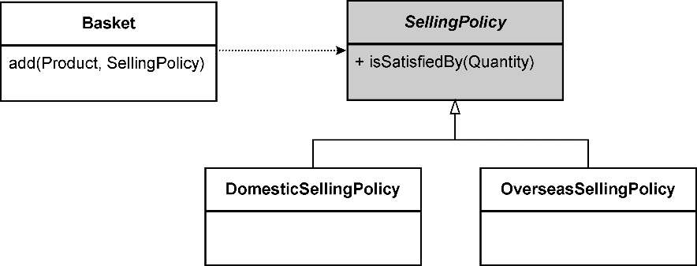

*图A-15 分离出`SellingPolicy*

`这一设计实际上是规格(specification)模式的体现，该模式的目的就是对频繁变化的业务规则进行分离与抽象。

我们也需要克制设计的过度抽象，不要考虑太多不切实际的扩展性与灵活性，避免引入过度设计，毕竟未来是不可预测的。

为了避免过度抽象，在引入抽象进行可扩展设计时，一定要结合具体的业务场景做出判断。职责是良好设计的基础，抽象就是对设计加分。应首先遵循信息专家模式考虑职责的合理分配，在发现了超过一个变化点之后，再基于单一职责原则分离职责，形成对象行为之间的协作，然后考虑是否需要对分离出去的变化进行抽象。抽象应保持足够的前瞻性，又必须恰如其分，最好是水到渠成的设计决策。

无论是职责的合理分配，还是对变化的适度抽象，目的都在于建立一个良好协作的对象社区。对象范式的根本在于信息专家模式，基于它就可以避免设计出贫血模型，形成了遵循对象建模范式的领域模型。普遍认为，良好的面向对象设计可以更好地应对复杂的业务逻辑，通过一张相互协作的对象图来表达领域模型，也是领域驱动设计推崇的做法。

Martin Fowler将领域模型分为以下两种风格^。

·简单领域模型：几乎每一个数据库表都与一个领域对象对应，通常使用活动记录实现对象与数据的映射。这实际上是遵循结构建模范式建立的领域模型。

·复杂领域模型：按照领域逻辑设计对象，广泛运用了继承、策略和其他设计模式，通常使用数据映射器实现对象与数据的映射。这实际上是遵循对象建模范式建立的领域模型，也是Eric Evans建议的建模方式。

建模范式对领域模型的影响可见一斑。结构建模范式未必不佳，但在体现领域逻辑的丰富性方面始终力有未逮。虽然Eric Evans认为“面向对象设计是目前大多数项目所使用的建模范式”^33，但随着领域事件在领域驱动设计中逐渐凸显的重要地位，我们也不能忽略另一种建模范式，那就是运用函数式编程思想的函数建模范式。

### A.3 函数建模范式

Ken Scambler认为函数范式的主要特征为模块化(modularity)、抽象化(abstraction)和可组合(composability)。这3个特征可以帮助我们编写简单的程序。

为了降低系统复杂度，需要将系统分解为多个功能的组成部分，每个组成部分有着清晰的边界。模块化的编码范式要支持实现者轻易地对模块进行替换，这就要求模块具有隔离性，避免在模块之间出现太多的纠缠。函数建模范式以“函数”为核心，将其作为模块化的重要组成部分，要求函数均为没有副作用的纯函数(pure function)。在推断每个函数的功能时，由于函数没有副作用，就可以不考虑该函数当前所处的上下文，形成清晰的隔离边界。这种相互隔离的纯函数使得模块化成为可能。

函数的抽象能力不言而喻，因为它本质上是一种将输入类型转换为输出类型的转换行为。任何一个函数都可以视为一种转换(transform)。这是对行为的最高抽象，代表了类型(type)之间的某种动作。极端情况下，我们甚至不用考虑函数的名称和类型，只需要关注其数学本质：f(x) = y。其中，x是输入，y是输出，f就是极度抽象的函数。

遵循函数建模范式建立的领域模型，其核心要素为代数数据类型（algebraic data type，ADT）和纯函数。代数数据类型表达领域概念，纯函数表达领域行为。由于二者皆被定义为不变的、原子的，因此在类型的约束规则下可以对它们进行组合。可组合的特征使得函数范式建立的领域模型可以由简单到复杂，能够利用组合子来表现复杂的领域逻辑。

#### A.3.1 代数数据类型

代数数据类型借鉴了代数学中的概念，作为一种函数式数据结构，体现了函数建模范式的数学意义。通常，代数数据类型不包含任何行为。它利用和类型(sum type)展示相同抽象概念的不同组合，使用积类型(product type)展示同一个概念不同属性的组合。

和与积是代数中的概念，它们在函数编程范式中体现了类型的两种组合模式。和意味着相加，用以表达一种类型是它的所有子类型相加的结果。例如表达时间单位的TimeUnit类型：

```
sealed trait TimeUnit
case object Days extends TimeUnit
case object Hours extends TimeUnit
case object Minutes extends TimeUnit
case object Seconds extends TimeUnit
case object MilliSeconds extends TimeUnit
case object MicroSeconds extends TimeUnit
case object NanoSeconds extends TimeUnit
```

TimeUnit是对时间单位概念的一个抽象。定义为和类型，说明它的实例只能是以下值的任意一种：Days、Hours、Minutes、Seconds、MilliSeconds、MicroSeconds或NanoSeconds。这是一种逻辑或的关系，用加号来表示：

```
type TimeUnit = Days + Hours + Minutes + Seconds + MilliSeconds + MicroSeconds + NanoSeconds
```

积类型体现了一个代数数据类型是其属性组合的笛卡儿积，例如一个员工类型：

```
case class Employee(number: String, name: String, email: String, onboardingDate: Date)
```

它表示Employee类型是(String, String, String, Date)组合的集合，也就是这4种数据类型的笛卡儿积，在类型语言中可以表达为：

```
type Employee = (String, String, String, Date)
```

也可以用乘号来表示这个类型的定义：

```
type Employee = String * String * String * Date
```

和类型和积类型的这一特点体现了代数数据类型的可组合(combinability)特性。代数数据类型的这两种类型并非互斥的，有的代数数据类型既是和类型，又是积类型，例如银行的账户类型：

```
sealed trait Currency
case object RMB extends Currency
case object USD extends Currency
case object EUR extends Currency
case class Balance(amount: BigDecimal, currency: Currency)
sealed trait Account {
   def number: String
   def name: String
}
case class SavingsAccount(number: String, name: String, dateOfOpening: Date) extends Account
case class BilledAccount(number: String, name: String, dateOfOpening: Date, balance: 
Balance) extends Account
```

代码中将Currency定义为和类型，将Balance定义为积类型。Account首先是和类型，它的值要么是SavingsAccount，要么是BilledAccount，同时，每个类型的Account又是一个积类型。

代数数据类型与对象建模范式的抽象数据类型有着本质的区别。前者体现了数学计算的特性，具有不变性。使用Scala的case object或case class语法糖会帮助我们创建一个不可变的抽象。当我们创建了如下的账户对象时，它的值就已经确定，不可改变：

```
val today = Calendar.getInstance.getTime
val balance = Balance(10.0, RMB)
val account = BilledAccount("980130111110043", "Bruce Zhang", today, balance)
```

数据的不变性使得代码可以更好地支持并发，可以随意共享值而无须承受对可变状态的担忧。不可变数据是函数式编程实践的重要原则之一，可以与纯函数更好地结合。

代数数据类型既体现了领域概念的知识，又通过和类型和积类型定义了约束规则，从而建立了严格的抽象。例如类型组合(String, String, Date)是一种高度的抽象，但却丢失了领域知识，因为它缺乏类型标签。如果采用积类型方式进行定义，则在抽象的同时，还约束了各自的类型。和类型在约束上更进了一步，它将“变化”建模到特定的数据类型内部，限制了类型的取值范围。和类型与积类型结合起来，与操作代数数据类型的函数放在一起，就可利用模式匹配实现表达业务规则的领域行为。

我们以17.3.1节给出的薪资管理系统的需求为例，针对“计算公司雇员薪资”功能，利用函数建模范式来说明代数数据类型的特性。

从需求看，需要建立的领域模型是雇员，它是一个积类型。注意，虽然需求清晰地勾勒出3种类型的雇员，但它们的差异实则体现在收入的类型上，这种差异体现为和类型不同的值。于是，可以得到由如下代数数据类型呈现的领域模型：

```
// 代数数据类型，体现了领域概念
// Amount是一个积类型，Currency则为前面定义的和类型
calse class Amount(value: BigDecimal, currency: Currency) {
   // 实现了运算符重载，支持Amount的组合运算
   def +(that: Amount): Amount = {
      require(that.currency == currency)
      Amount(value + that.value, currency)
   }
   def *(times: BigDecimal): Amount = {
      Amount(value * times, currency)
   }
}
// 以下类型皆为积类型，分别体现了工作时间卡与销售凭条领域概念
case class TimeCard(startTime: Date, endTime: Date)
case class SalesReceipt(date: Date, amount: Amount)
// 支付周期是一个隐藏概念，不同类型的雇员支付周期不同
case class PayrollPeriod(startDate: Date, endDate: Date)
// Income的抽象表示成和类型与积类型的组合
sealed trait Income
case class WeeklySalary(feeOfHour: Amount, timeCards: List[TimeCard], payrollPeriod: 
PayrollPeriod) extends Income
case class MonthlySalary(salary: Amount, payrollPeriod: PayrollPeriod) extends Income
case class Commission(salary: Amount, saleReceipts: List[SalesReceipt], payrollPeriod: 
PayrollPeriod)
// Employee被定义为积类型，它组合的Income具有不同的抽象
case class Employee(number: String, name: String, onboardingDate: Date, income: Income)
```

定义以上由代数数据类型组成的领域模型后，即可将其与表示领域行为的函数结合起来。由于Income被定义为和类型，它表达的是一种逻辑或的关系，因此它的每个子类型都将成为模式匹配的分支。和类型的组合有着确定的值（类型理论的术语将其称为inhabitant），例如，Income和类型的值为3，模式匹配的分支就应该是3个，这就使得Scala编译器可以检查模式匹配的穷尽性。如果模式匹配缺少了对和类型的值表示，编译器会给出警告。倘若和类型增加了一个新的值，编译器也会指出所有需要新增ADT变体来更新模式匹配的地方。针对Income积类型，利用模式匹配结合业务规则对它进行解构，代码如下：

```
def calculateIncome(employee: Employee): Amount = employee.income match {
   case WeeklySalary(fee, timeCards, _) => weeklyIncomeOf(fee, timeCards)
   case MonthlySalary(salary, _) => salary
   case Commision(salary, saleReceipts, _) => salary + commistionOf(saleReceipts)
}
```

`

calculateIncome()是一个纯函数，利用模式匹配，针对Employee的特定Income`类型计算雇员的不同收入。

#### A.3.2 纯函数

函数建模范式往往使用纯函数表现领域行为。所谓“纯函数”，就是指没有“副作用”(side effect)的函数。Paul Chiusano与Runar Bjarnason认为常见的副作用包括^：

·修改一个变量；

·直接修改数据结构；

·设置一个对象的成员；

·抛出一个异常或以一个错误终止；

·打印到终端或读取用户的输入；

·读取或写入一个文件；

·在屏幕上绘画。

例如，读取花名册文件，解析内容获得收件人电子邮件列表的函数为：

```
def parse(rosterPath: String): List[Email] = {
         val lines = readLines(rosterPath)
         lines.filter(containsValidEmail(_)).map(toEmail(_))
}
```

代码中的readLines()函数需要读取一个外部的花名册文件，这是引起副作用的一个原因。该副作用为单元测试带来了影响。要测试parse()函数，需要为它事先准备好一个花名册文件，这增加了测试的复杂度。同时，该副作用使得我们无法根据输入参数推断函数的返回结果，因为读取文件可能出现一些未知的错误，如读取文件错误，又如有其他人同时在修改该文件，就可能抛出异常或者返回一个不符合预期的邮件列表。

要将parse()定义为纯函数，就需要分离这种副作用。一旦去掉副作用，调用函数返回的结果就与直接使用返回结果具有相同效果，二者可以互相替换，这称为引用透明(referential transparency)。引用透明的替换性可以用于验证一个函数是否是纯函数。假设客户端要根据解析获得的电子邮件列表发送邮件，解析的花名册文件路径为roster.txt，解析该花名册得到的电子邮件列表为：

```
List(Email("liubei@dddcompany.com"), Email("guanyu@dddcompany.com"))
```

如果parse()是一个纯函数，遵循引用透明的原则，如下函数调用的行为应该完全相同：

```
// 调用解析方法
send(parse("roster.txt"))
// 直接调用解析结果
send(List(Email("liubei@dddcompany.com"), Email("guanyu@dddcompany.com")))
```

显然，parse()函数的定义做不到这一点。后者传入的参数是一个电子邮件列表，而前者除了提供了电子邮件列表，还读取了花名册文件。函数获得的电子邮件列表不由花名册文件路径决定，而由读取文件的内容决定。读取外部文件的这种副作用使得我们无法根据确定的输入参数推断出确定的计算结果。要将parse()改造为支持引用透明的纯函数，就需要分离副作用，把读取外部文件的功能推向parse()函数外部：

```
def parse(content: List[String]): List[Emial] =
   content.filter(containsValidEmail(_)).map(toEmail(_))
```

修改之后，以下代码的行为完全相同：

```
send(parse(List("liubei, liubei@dddcompany.com", "noname", "guanyu, guanyu@dddcompany.com")))
send(List(Email("liubei@dddcompany.com"), Email("guanyu@dddcompany.com")))
```

这意味着改进后的parse()可以根据输入结果推断出函数的计算结果，这正是引用透明的价值所在。保持函数的引用透明，不产生任何副作用，也是函数式编程的基本原则。如果说面向对象设计需要将依赖尽可能向外推，最终采用依赖注入的方式来降低耦合，那么，函数式编程思想就是要利用纯函数来隔离变化与不变，内部由无副作用的纯函数组成，纯函数将副作用向外推，形成由不变的业务内核与可变的副作用外围组成的结构，如图A-16所示。

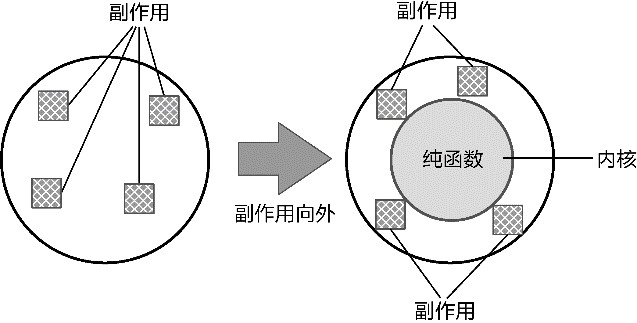

*图A-16 将副作用往外推*

具有引用透明特征的纯函数更加贴近数学的函数概念：没有计算，只有转换。转换操作不会修改输入参数的值，只是基于某种规则把输入参数值转换为输出。输入值和输出值都是不变的，只要给定的输入值相同，总会给出相同的输出结果。例如，我们定义add1()函数：

```
def add1(x: Int):Int => x + 1
```

基于数学函数的转换(transformation)特征，完全可以将其翻译为如下代码：

```
def add1(x: Int): Int => x match {
   case 0 => 1
   case 1 => 2
   case 2 => 3
   case 3 => 4
   // ...
}
```

我们看到的不是对变量x增加1，而是根据x的值进行模式匹配，然后基于业务规则返回确定的值。这就是纯函数的数学意义。

引用透明、无副作用以及数学函数的转换本质，为纯函数提供模块化的能力，再结合高阶函数的特性，使纯函数具备强大的可组合特性，这正是函数式编程的核心原则。这种组合性如图A-17所示。

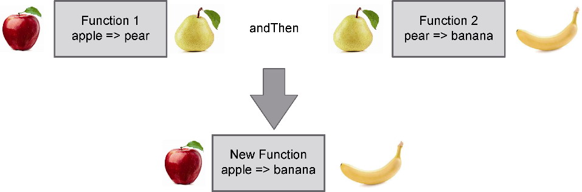

*图A-17 函数的组合特性*

图A-17中的andThen是Scala语言提供的组合子，可以组合两个函数形成一个新的函数。Scala还提供了compose组合子。二者的区别在于组合函数的顺序不同。图A-17的内容可以表现为如下Scala代码：

```
sealed trait Fruit {
   def weight: Int
}
case class Apple(weight: Int) extends Fruit
case class Pear(weight: Int) extends Fruit
case class Banana(weight: Int) extends Fruit
val appleToPear: Apple => Pear = apple => Pear(apple.weight)
val pearToBanana: Pear => Banana = pear => Banana(pear.weight)
// 使用组合
val appleToBanana = appleToPear andThen pearToBanana
```

组合后得到的函数类型，以及对该函数的调用如下所示：

```
scala> val appleToBanana = appleToPear andThen pearToBanana
appleToBanana: Apple => Banana = 
scala> appleToBanana(Apple(15))
res0: Banana = Banana(15)
```

除了纯函数的组合性，函数式编程中的Monad模式也支持组合。我们可以简单地将一个Monad理解为提供bind功能的容器。在Scala语言中，bind功能就是flatMap函数。要理解flatMap函数的功能，可以将其看作map与flatten的组合。例如，针对如下的编程语言列表：

```
scala> val l = List("scala", "java", "python", "go")
l: List[String] = List(scala, java, python, go)
```

对该列表执行map操作，该操作接受toCharArray()函数，就可以把一个字符串转换为同样是Monad的字符数组：

```
scala> l.map(lang => lang.toCharArray)
res7: List[Array[Char]] = List(Array(s, c, a, l, a), Array(j, a, v, a), Array(p, y, t, h, o, n), Array(g, o))
```

map函数完成了从List[String]到List[Array[Char]]的转换。flatMap函数则不同，传入同样的转换函数：

```
scala> l.flatMap(lang => lang.toCharArray)
res6: List[Char] = List(s, c, a, l, a, j, a, v, a, p, y, t, h, o, n, g, o)
```

flatMap函数将字符串转换为字符数组后，还执行了一次展平(flatten)操作，完成了List[String]到List[Char]的转换。

在Monad的真正实现中，flatMap并非map与flatten的组合。恰恰相反，map函数是flatMap基于unit演绎出来的。Monad的核心其实是flatMap函数：

```
class M[A](value: A) {
   private def unit[B] (value : B) = new M(value)
   def map[B](f: A => B) : M[B] = flatMap {x => unit(f(x))}
   def flatMap[B](f: A => M[B]) : M[B] = ...
}
```

flatMap和map以及filter往往可以组合起来，实现更加复杂的针对Monad的操作。一旦操作变得复杂，这种组合操作的可读性就会降低。例如，我们将两个同等大小列表中的元素项相乘，使用flatMap与map的代码为：

```
val ns = List(1, 2)
val os = List(4, 5)
val qs = ns.flatMap(n => os.map(o => n * o))
```

这样的代码并不好理解。为了提高代码的可读性，Scala提供了for-comprehensions。它是Monad的语法糖，组合了flatMap、map和filter等函数，但从语法上看，却类似一个for循环。这就使得我们多了一种可读性更强的调用Monad的形式。使用for-comprehensions语法糖，同样的功能就变成了：

```
val qs = for {
   n <- ns
   o <- os
} yield n * o
```

这里演示的for语法糖看起来像一个嵌套循环，分别从ns和os中取值，然后利用yield生成器将计算得到的积返回为一个列表。实质上，这段代码与使用flatMap和map的代码完全相同。

在使用纯函数表现领域行为时，我们可以让纯函数返回一个Monad容器，再通过for-comprehensions进行组合。这种方式既保证了代码对领域行为知识的体现，又能因为其不变性避免状态变更带来的缺陷。同时，结合纯函数的组合子特性，使得代码的表现力更加强大，非常自然地传递了领域知识。

例如，针对下订单场景，需要验证订单，并对验证后的订单进行计算。验证订单时，需要验证订单自身的合法性、客户状态和库存；对订单的计算则包括计算订单的总金额、促销折扣和运费。遵循函数建模范式对需求进行领域建模时，需要先寻找到表达领域知识的各个原子元素，包括具体的代数数据类型和实现原子功能的纯函数：

```
// 积类型
case class Order(id: OrderId, customerId: CustomerId, desc: String, totalPrice: Amount, discount: Amount, shippingFee: Amount, orderItems: List[OrderItem])
// 以下是验证订单的行为，皆为原子的纯函数，并返回scalaz定义的Validation Monad
val validateOrder : Order => Validation[Order, Boolean] = order =>
   if (order.orderItems isEmpty) Failure(s"Validation failed for order $order.id")
   else Success(true)
val checkCustomerStatus: Order => Validation[Order, Boolean] = order => 
   Success(true)
val checkInventory: Order => Validation[Order, Boolean] = order => 
   Success(true)
// 以下定义了计算订单的行为，皆为原子的纯函数
val calculateTotalPrice: Order => Order = order => 
   val total = totalPriceOf(order)
   order.copy(totalPrice = total)
val calculateDiscount: Order => Order = order => 
   order.copy(discount = discountOf(order))
val calculateShippingFee: Order => Order = order =>
   order.copy(shippingFee = shippingFeeOf(order))
```


这些纯函数是原子的、分散的、可组合的，接下来，可利用纯函数与Monad的组合能力，编写满足业务场景需求的实现代码：

```
val order = ...
// 组合验证逻辑
// 注意返回的orderValidated也是一个Validation Monad
val orderValidated = for {
   _ <- validateOrder(order)
   _ <- checkCustomerStatus(order)
   c <- checkInventory(order)
} yield c
if (orderValidated.isSuccess) {
   // 组合计算逻辑，返回了一个组合后的函数
   val calculate = calculateTotalPrice andThen calculateDiscount andThen calculateShippingFee
   // 返回具有订单总价、折扣与运费的订单对象
   // 在计算订单的过程中，订单对象是不变的
   val calculatedOrder = calculate(order)
   // ...
}
```

#### A.3.3 函数建模范式的演绎法

遵循函数建模范式建立领域模型时，代数数据类型与纯函数是主要的建模元素。代数数据类型中的和类型与积类型可以表达领域概念，纯函数则用于表达领域行为。它们都被定义为不变的原子类型。将这些原子的类型与操作组合起来，满足复杂业务逻辑的需要。这是函数式编程中面向组合子(combinator)的建模方法，是函数建模范式的核心。

在观察真实世界时，对象建模范式和函数建模范式遵循了不同的建模思想。

对象建模范式采用了归纳法，通过分析和归纳需求，找到问题并逐级分解问题，然后通过对象来表达领域逻辑，以职责的角度分析这些领域逻辑，并根据角色的特征把职责分配给各自的对象，通过对象之间的协作实现复杂的领域行为。

函数建模范式采用了演绎法，通过在领域需求中寻找和定义最基本的原子操作，然后根据基本的组合规则利用组合子将这些原子类型与原子函数组合起来。

因此，函数建模范式对领域建模的影响是全方位的。对象建模范式是在定义一个完整的世界，然后以“上帝”的身份去规划各自行使职责的对象，而函数建模范式是在组合一个完整的世界，就像古代哲学家一般，看透了物质的本原，识别出不可再分的原子微粒，再按照期望的方式组合这些微粒。故而，采用函数建模范式进行领域建模，关键是组合子以及组合规则的设计，既要简单，又要完整，还需要保证每个组合子的正交性。只有如此，才能对其进行组合，使其互不冗余，互不干涉。这些组合子，就是代数数据类型和纯函数。

函数建模范式的领域模型颠覆了面向对象思想中“贫血模型是坏的”这一观点。不过，函数建模范式的贫血模型不同于结构建模范式的贫血模型。结构建模范式是将数据与行为分离，每个行为组成一个完成的过程，用以体现一个完整的业务场景。由于缺乏足够的封装性，因而无法控制因为数据和行为的修改对其他调用者带来的影响。对象建模范式之所以要求将数据与行为封装在一起，就是为了解决这一问题。函数建模范式虽然同样建立了贫血模型，但它的模块化、抽象化和可组合特征降低了变化带来的影响。在组合这些组合子时引入高内聚松耦合的模块对这些功能进行分组，就能避免细粒度的组合子过于散乱，形成更加清晰的代码层次。

Debasish Ghosh总结了函数建模范式的基本原则，用以规范领域模型的设计^：

·利用函数组合的力量，把小函数组装成一个大函数，获得更好的组合性；

·纯粹，领域模型的很多部分都由引用透明的表达式组成；

·通过方程式推导，可以很容易地推导和验证领域行为。

不止如此，根据代数数据类型的不变性以及对模式匹配的支持，它还天生适合表达领域事件。例如，地址变更事件就可以用一个积类型来表示：

```
case class AddressChanged(eventId: EventId, customerId: CustomerId, oldAddress:
Address, newAddress: Address, occurred: Time)
```

还可以用和类型对事件进行抽象，这样就可以在处理事件时运用模式匹配：

```
sealed trait Event {
   def eventId: EventId
   def occurred: Time
}
case class AddressChanged(eventId: EventId, customerId: CustomerId, oldAddress: Address, 
newAddress: Address, occurred: Time) extends Event
case class AccountOpened(eventId: EventId, Account: Account, occurred: Time) extends
Event
def handle(event: Event) = event match {
   case ac: AddressChanged => ...
   case ao: AccountOpened => ...
}
```

函数建模范式的代数数据类型仍然可以用来表示实体和值对象，但它们都是不变的，二者的区别主要在于是否需要定义唯一标识符。聚合的概念同样存在，如果使用Scala语言，往往会为聚合定义满足角色特征的trait，如此即可使聚合的实现通过混入多个trait来完成代数数据类型的组合。由于资源库会与外部资源进行协作，意味着它会产生副作用，因此遵循函数式编程思想，往往会将其推向纯函数的外部。在函数式语言中，可以利用柯里化（currying，又译作“咖喱化”）或者Reader Monad来推迟对资源库具体实现的注入。

通常，领域驱动设计运用对象建模范式进行领域建模，利用函数建模范式建立的领域模型多少显得有点“另类”，因此，我将其称为“非主流”的领域驱动设计。这里所谓的“非主流”，仅仅是从建模范式的普及性角度来考虑的，并不能说明二者的优劣与高下之分。事实上，函数建模范式可以很好地与事件结合在一起，以领域事件作为模型驱动设计的驱动力。针对事件进行建模，任何业务流程皆可用状态机来表达。状态的迁移，就是命令对事件的触发。我们还可以利用事件风暴帮助我们识别这些事件，而事件的不变性特征又可以很好地与函数式编程结合起来（参见附录B）。
