# 附录B 事件驱动模型

> 企图对一具体现象的存在全貌，在因果关系上做透彻而无遗漏的回溯，不仅在实际上办不到，而且此一企图根本就没有意义。我们只能指出某些原因，因为就这些原因而言，我们有理由去推断，在某个个案中，这些原因是某一个事件的“本质”性成素的成因。

> ——马克思·韦伯，《学术与政治》

领域驱动设计可以选择不同的建模范式，由此得到的领域模型也将有所不同。在附录A，我介绍了结构建模范式、对象建模范式、函数建模范式和领域模型之间的关系，尤其明解了对象建模范式和函数建模范式之间的本质区别。对象建模范式重视领域逻辑中的名词概念，并将领域行为封装到对象中；函数建模范式重视领域逻辑中的领域行为，将其视为类型的转换操作，主张将领域行为定义为无副作用的纯函数。本书讲解的领域建模阶段选择了对象建模范式。

倘若领域驱动设计的整个过程围绕着“事件”进行，就会因为事件改变我们观察真实世界的方式。在第15章介绍领域事件时，我谈到了它对建模思想的影响。由于事件的与众不同之处，我特别将这种方式称为事件建模范式。

事件建模范式的关注点既非对象建模范式中的领域概念，也非函数建模范式中的领域行为，自然也不属于结构建模范式，而是领域行为引起的领域概念状态的变化。事件针对状态建模，在此观察视角下，大多数业务流程都可以视为由命令触发的引起状态迁移的状态机。状态的迁移本质上可认为是形如State1 =>State2这样的纯函数，这种建模方式更贴近于函数建模范式，或者说是函数建模范式的一个分支。

相比函数建模范式，事件建模范式有自己的独到之处。分析与设计的驱动力是事件，建模的核心是事件，事件引起的是领域对象状态的迁移。事件建模范式通过事件观察真实世界，并围绕着“事件”为中心去表达领域对象的状态迁移，进而以事件来驱动业务场景。

事件建模范式影响的是建模者观察真实世界的态度，而这种以事件为模型核心元素的范式又会影响到整个软件的体系架构、模型设计和代码实现。通过事件建模范式驱动出来的模型，可称为事件驱动模型，以此有别于对象建模范式驱动出来的领域模型。对事件驱动模型而言，它使用的建模方法、模式和风格皆以事件为中心，体现出别具一格的特征。事件驱动模型常用的建模方法就是事件风暴，与之相关的模式为事件溯源模式，以及事件驱动架构风格。

### B.1 事件风暴

事件风暴由Alberto Brandolini提出，是一种以工作坊形式对复杂业务领域进行探索的高效协作方法，它的运用范围自然不仅限于事件建模范式。然而，事件风暴提倡由“事件”驱动团队观察、探索和分析业务领域，更加契合事件建模范式的领域建模。

#### B.1.1 理解事件风暴

事件风暴之所以以事件为驱动力，源于事件意味一种因果关系。这使得一个静态的概念隐藏着流动的张力。在识别和理解事件时，可以考虑为什么要产生这一事件，以及为什么要响应这一事件，进而思考响应事件的后续动作，驱动着设计者的“心流”不断思考下去，犹如搅起了一场激烈的风暴。

不同的团队角色在思考事件时，看到的可能是事物的不同面。事件犹如棱镜一般将光线色散为不同色彩，折射到每个人的眼睛。

·事件对于业务人员：事件前后的业务动作是什么，产生了什么样的业务流程？

·事件对于管理人员：事件导致的重要结果是什么，会否影响到管理和运营？

·事件对于技术人员：是什么触发了事件消息，当事件消息发布时，谁来负责订阅和处理事件？

虽然关注点不同，但事件却能够让这些不同的团队角色“团结”到一个业务场景下，体会到统一语言的存在。业务场景就像一条新闻报道，团队的参与角色就是新闻报道的读者，他们关注新闻的目的各不相同，却又不约而同地被同一个新闻标题所吸引，这个新闻的标题就是事件。例如2019年6月17日，沪伦通正式启动，众多新闻媒体皆有报道，如图B-1所示。


*图B-1 沪伦通启动的新闻网页*

这一影响国内甚至国际金融界的重磅事件吸引了许多人尤其是广大投资人的目光。角色不同，对这一新闻事件的着眼点也不相同。经济学家关心此次事件对证券交易市场特别是对上交所、伦交所带来的影响，政治家关心这种金融互通机制对中英以及中欧之间政治格局带来的影响，股市投资人关心如何进入沪伦通进行股票交易以谋求高额投资回报，证券专业人士则关心沪伦通这种基于存托凭证的跨境转换方式和交易模式……不一而足，但他们关心的却是同一条新闻事件。

之所以将事件比喻为新闻，在于它们之间存在本质的共同点：它们都是过去已经发生的事实。新闻不可能报道未来，即使是对未来的预测，预测这个行为也是发生在过去的某个时间点。整条新闻报道的背景就是该事件的场景要素，如表B-1所示。

*表B-1 新闻和事件*

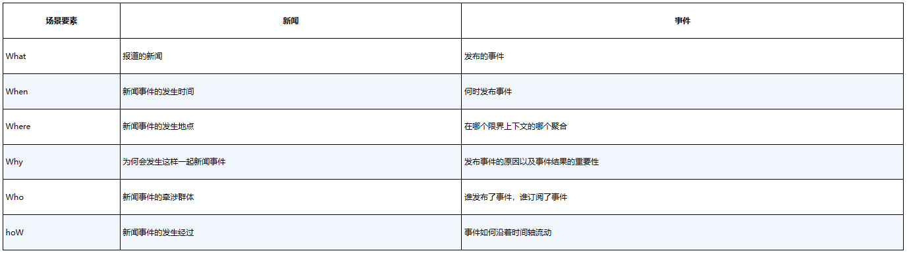

在运用事件风暴时，分析者可以像一名记者那样敏感地关注一些关键事件的发生，并按照时间轴的顺序把这些事件串起来。设想乘坐地铁的场景。

·车票已购买TicketPurchased：我只关心票买了，并不关心是怎么支付的。

·车票有效TicketAccepted：我只关心闸机认可了车票的有效性，并不关系是刷卡还是插入卡片。

·闸机门已打开StationGateOpened：门打开了是刷卡有效的结果，意味着我可以通行，我并不关心之前闸机门的状态，例如某些地铁站在人流高峰期会保持闸机门常开。

·乘客已通过PassengerPassed：我一旦通过闸机，就可以等候地铁准备上车，我并不关心通过之后闸机门的状态。

·地铁到站MetroArrived：是否是我要乘坐的地铁到站？如果是，我就要准备上车，我并不关心地铁如何行驶。

·地铁车门已打开MetroDoorOpened：只有车门打开了，我才能上车，我并不关心车门是如何打开的。

·……

这就是与时间相关的一系列事件。分析乘坐地铁的业务场景，识别出一系列关键事件并将其连接起来，就会形成一条显而易见的基于时间轴的事件路径，如图B-2所示。

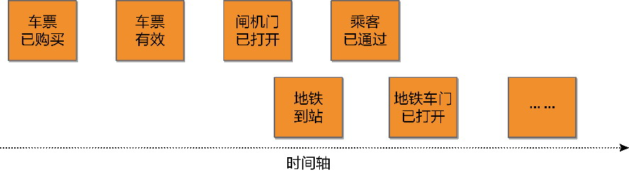

*图B-2 乘坐地铁的关键事件*

以事件为领域分析建模的关注起点，就可以让开发团队与业务人员（包括领域专家）都能够关注每个环节的结果，而不考虑每个环节的实现。事件可以让整个团队在事件风暴过程中统一到领域模型中。这种以“事件”为核心的建模思路，改变了我们观察业务领域的世界观。在事件风暴的眼中，领域的世界是一系列事件的留存。这些业务动作留下的不可磨灭的足迹牵涉到状态之迁移、事实之发生，忠实地记录了每次执行命令后产生的结果。如上所述，乘坐地铁的事件路径实则是乘客、闸机、地铁等多个领域对象的状态迁移。这种状态迁移过程体现了业务之间的因果关系。

事件风暴中事件的特征与领域事件相似，只是更加凸显它对于建模的驱动力，除了领域事件具备的特征（参见15.7.1节），还强调了：

·事件会导致目标对象状态的变化；

·事件是管理者和运营者重点关心的内容，若缺少该事件，会对管理与运营产生影响；

·事件具有时间点的特征，所有事件连接起来会形成明显的时间轴。

运用事件风暴的一个关键就是扭转对真实世界业务的认识，以事件作为理解业务的起点，考虑在业务流程中究竟需要留存什么样的关键事实，以满足管理和运营的要求，从而识别出事件。

事件自身具备时间特征，使得业务场景的事件一经识别，就能形成动态的流程。事件会导致目标对象状态的变更，说明唯有命令才会触发事件，这就要求我们在开展事件风暴时，需要区分命令和查询。

如前所述，事件体现了业务之间的因果关系。在事件风暴中，事件作为果，必然有将其触发的起因，这些起因统统称为事件的角色。

·用户：用户执行一个业务活动，触发一个事件，如用户将商品加入购物车，触发ProductAddedToCart事件。

·策略(policy)：一个定时条件形成一条业务规则，当定时条件满足时会触发一个事件，例如提交订单后超过规定时间未支付，触发OrderCancelled事件。

·伴生系统：由目标系统之外的外部系统触发一个事件，如外部的支付系统向电商平台返回交易凭证，触发PaymentCompleted事件。

·前置事件：一个事件成为另一事件的因，如提交订单触发的OrderPlaced事件，又作为起因触发InventoryLocked事件。

事件的因与果体现为事件的发布与订阅，它们形成了因果关系的不断传递。

事件风暴是一种高度强调交流与协作的可视化工作坊，需大量使用大白纸与各色即时贴。面对着糊满整面墙的大白纸，工作坊的参与人员通过充分地交流与沟通，然后用马克笔在各色即时贴上写下各个领域模型概念，贴在墙上呈现生动的模型。这些模型都是可视化的，就可以给团队直观印象。大家站在墙面前观察这些模型，及时开展讨论。若发现有误，就可以通过移动即时贴来调整与更新，也可以随时贴上新的即时贴，完善建模结果。

Alberto Brandolini设计的事件风暴通常分为两个层次。如果在工作坊过程中将主要的精力用于寻找业务流程中产生的领域事件，可以认为是宏观级别的事件风暴，目的是探索业务全景(big picture exploration)。在识别出全景事件流之后，就可以标记时间轴的关键时间点作为划分领域边界和限界上下文边界的依据，同时也可以基于事件表达的业务概念对领域进行划分，最终确定候选的子领域和限界上下文。采用事件风暴识别限界上下文的方式仍然遵循限界上下文的V型映射过程。事件是业务服务的一种体现，对事件表达的业务概念进行划分，就是利用语义相关性和功能相关性对业务知识进行归类，进而获得候选的限界上下文。

另一个层次则属于设计级别的领域分析建模方法，通过探索业务全景获得的事件流，围绕事件获得领域分析模型。这个模型除了包含事件与角色，还包括决策命令、写模型和读模型。事件风暴的领域分析建模方法通常会将业务全景探索的结果作为领域分析建模的基础。

#### B.1.2 探索业务全景

在探索业务全景的过程中，为了使每个人保持专注，需要排除其余领域概念的干扰，一心寻找沿着时间轴发展的事件。事件是事件风暴的主要驱动力，寻找出来的事件则是领域分析模型的骨架。事件风暴使用橙色即时贴代表事件(event)。

事件风暴工作坊要求沿着时间轴对事件进行识别。通常由领域专家贴上第一张他/她最为关心的事件，然后由大家分头围绕该事件写出在它之前和之后发生的事件，并按照时间顺序从左向右排列。以电商平台购物流程的业务为例，领域专家认为“订单已创建”是我们关注的核心事件，于是就可以在整面墙的中间贴上橙色即时贴，上面写上订单已创建事件，如图B-3所示。

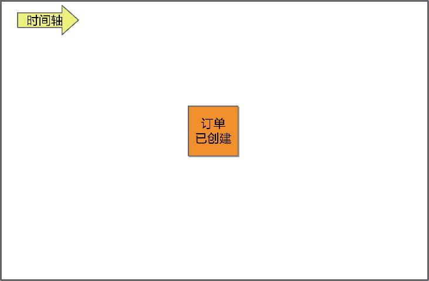

*图B-3 贴上第一个核心事件*

在确定该核心事件后，以此为中心，向前推导它的起因，向后推导它的结果，根据这种因果关系层层推进，逐渐形成一条或多条沿着时间轴且彼此之间存在因果关系的事件流，如图B-4所示。

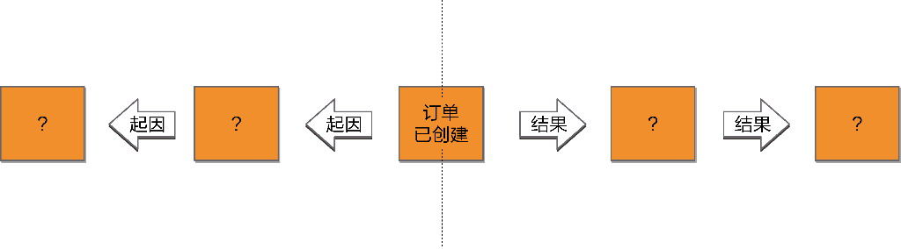

*图B-4 事件的前后因果关系*

在识别事件的过程中，工作坊的参与人员应尽可能站在管理和运营的角度去思考事件。这里所谓的“因果关系”，也可以理解为，产生事件的前置条件是什么，由此推导出前置事件；事件导致的后置结果是什么，由此推导出后置事件。

从“订单已创建”事件往前推导，它的前置条件是什么呢？显然，需要买家将商品加入购物车，才可以创建订单，于是可推导出前置事件“商品被加入购物车”，如图B-5所示。

从“订单已创建”事件往后推导，它的结果是什么呢？订单创建后，为了避免超卖，需要锁定库存，由此得到后置事件“库存已锁定”。随后，买家发起支付请求，产生后置事件“订单已支付”，如图B-6所示。

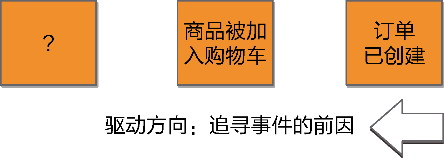

*图B-5 寻找前置事件*

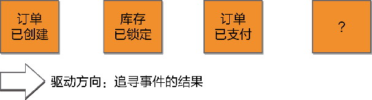

*图B-6 寻找后置事件*

事件风暴是一种探索性的建模活动。在探索事件的过程中，不要急于去识别其他的领域对象；基于事件结果，也不要急于去寻找导致事件发生的起因。尤其是在探索业务全景期间，更要如此。毕竟人的注意力是有限的。从一开始，就应该让工作坊的参与人员集中精力专注于事件。倘若存在疑问，又或者需要提醒业务人员或技术人员特别注意，可以用粉红色即时贴表达该警告信息，Alberto Brandolini将其称为热点(hot spot)，例如，图B-7针对“库存已锁定”事件，需要说明若订单支付超时，需要释放库存；“订单已支付”事件需要考虑支付成败的异常情况。

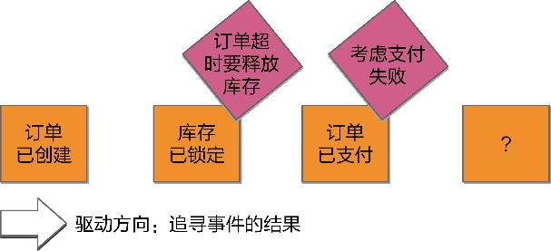

*图B-7 增加热点*

除了通过分析事件的前置条件和后置结果来寻找事件，也可以发挥集体的力量，由参与事件风暴工作坊的所有人按照自己对业务流程的理解逐一识别出事件，然后汇总所有人的输出，进一步梳理获得最终的事件流，如图B-8所示。

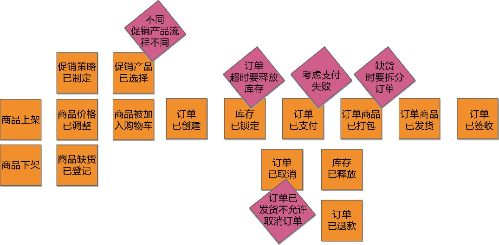

*图B-8 订单事件流*

触发事件的起因就是事件的角色。通过事件风暴进行业务全景探索时，可在获得全景事件流后，明确各个事件的角色，分别用不同颜色的即时贴进行标记。

·用户：标记参与事件的用户角色，用黄色小即时贴绘制火柴棍人表示。

·策略：标记引起事件的策略角色，用紫色小即时贴表示。

·伴生系统：标记引起事件的目标系统外的伴生系统角色，用浅粉色小即时贴表示。

如果一个事件没有上述3种角色，说明它的前置事件是触发事件的起因，就无须标记了。

前面获得的事件流在添加了角色后，表示为图B-9。

不要小看对事件起因的标记。在完成全景事件流之后，对事件的起因进行再一次梳理有助于团队就识别的事件达成一致，检查事件是否存在疏漏和谬误。作为事件起因的用户、策略和伴生系统，还为后面的领域分析建模奠定基础。识别出的伴生系统也有助于我们绘制系统上下文图。

事件风暴的探索业务全景过程属于全局分析阶段的一种方法，通过事件展示了分析者对业务需求的探索和分析。在获得全景的事件流后，可在此基础上识别限界上下文。该方法通过识别关键事件，将整个事件流划分为多个明确的阶段，它对应于在全局分析阶段划分业务流程获得的业务场景。识别出来的业务场景也可以作为限界上下文的参考。如图B-9所示的事件流，就可以通过“商品被加入购物车”“订单已支付”“订单商品已打包”3个关键事件将整个事件流分为4个阶段：商品、订单、库存和物流，如图B-10所示。

寻找事件时，描述事件、热点和角色都需要在统一语言的指导下完成，一个或多个事件可能组成一个业务服务，仍然可以对它们开展V型映射过程，即根据业务相关性进一步明确限界上下文。获得初步确定了限界上下文边界的事件流，如图B-11所示。

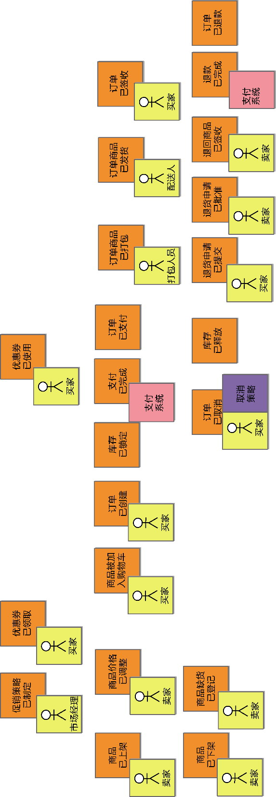

*图B-9 识别事件的角色*

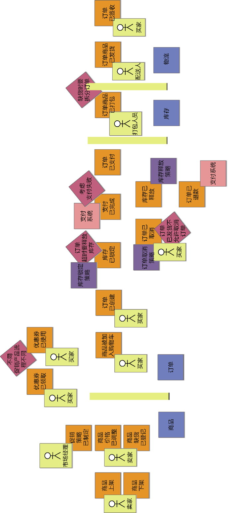

*图B-10 通过关键事件划分阶段*

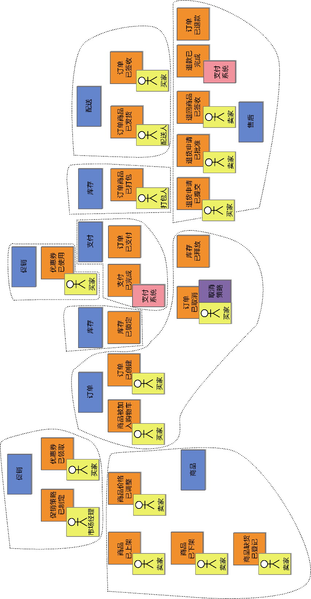

*图B-11 确定了限界上下文的事件流*

#### B.1.3 领域分析建模

通过事件风暴探索业务全景，帮助团队识别出了事件、热点以及作为角色的用户、策略和伴生系统，到了领域分析建模阶段，要继续使用事件风暴，还需要了解决策命令、写模型和读模型。

**1.决策命令**

实际上，用户、策略、伴生系统和前置事件等角色都需要执行一个命令(command)来触发事件，命令才是直接导致事件发生的“因”。在事件风暴中，Alberto Brandolini将命令称为决策命令(decision command)，使用蓝色即时贴表示。

决策命令往往由动词短语组成，例如提交订单(place order)、发送邀请(send invitation)等。

由于决策命令和事件存在因果关系，二者往往一一对应。例如，取消订单(Cancel Order)决策命令会触发OrderCanceled事件，预订课程(subscribe course)决策命令会触发CourseSubscribed事件。这种一一对应关系使得它们存在语义上的重叠。

**2.写模型**

写模型(write model)就是状态发生了变化的目标对象，正是写模型状态的变更才导致了事件的触发。如此一来，识别写模型就是水到渠成的过程，因为在探索业务全景时，我们甄别事件的一个特征，就是看它是否引起目标对象状态的变化。识别出了事件，意味着已经明确了状态发生变化的目标对象，它就是我们要寻找的写模型。写模型用黄色即时贴表示。

写模型状态的变化分为3种形式：

·从无到有创建了新的写模型对象，例如OrderCreated事件标志着新订单的产生；

·修改了写模型对象的属性，例如OrderCanceled事件使得订单从之前的状态变更为Canceled，也可能意味着内容的变化，如CartItemAdded事件，说明购物车添加了一个新的条目；

·从有到无删除了已有的写模型对象，例如一个错误的航班被删除触发的FlightDeleted事件；当然，在大多数业务场景中，所谓的删除并非真正的从有到无，而是修改了写模型对象的属性值，如MemberUnregistered事件和ProductRemoved事件，都不会真正删除会员和商品，而是将写模型的状态修改为Unregistered与Removed。

写模型的状态一旦发生变更，就会触发事件，因为事件是状态变更产生的事实。这意味着该由写模型承担发布事件的职责，因为只有它才具备侦知状态是否变更以及何时变更的能力。以买家创建订单为例，一旦成功创建订单，就意味着订单状态从Pending变更为Created，触发订单已创建事件OrderCreated，所以写模型就是订单Order，如图B-12所示。

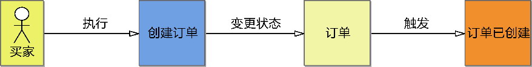

*图B-12 订单写模型的获得*

**3.读模型**

角色执行决策命令时，如何才能变更写模型的状态呢？很明显，需要结合业务场景为角色提供充足的信息，角色才能做出正确的决策。业务场景为角色提供的信息在事件风暴中被称为读模型(read model)。读模型用绿色即时贴表示。

读模型拥有的信息可以由角色通过读（查询）操作获得。在业务场景中，读模型为角色提供恰如其分的决策信息。例如，买家创建订单，要先查看购物车，只有获得了购物车内容才能成功创建订单、触发订单已创建事件。这时，查看购物车获得的信息购物车ShoppingCart就是读模型，如图B-13所示。

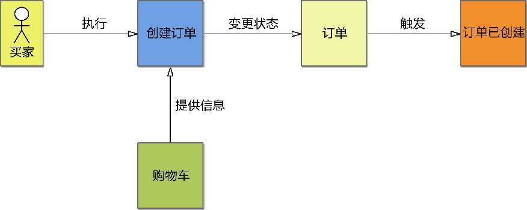

*图B-13 购物车读模型的获得*

读模型是用户执行决策命令必需的输入信息，在代码层面，读模型就是执行决策命令领域行为所需的输入参数。

如果决策命令的角色是用户，就是用户执行了某个活动。用户活动的执行与用户体验有关。真实世界的业务场景正是通过用户体验将用户与读模型结合起来，把信息传输给事件风暴的决策命令。以创建订单为例，买家点击了“创建订单”按钮。但在此之前，是用户执行了查看购物车列表，获得了购物车，然后将其作为读模型传递给了提交订单决策命令。有的事件风暴实践者将查询操作也纳入到事件风暴的模型中，认为是用户执行查询操作获得读模型后，触发了决策命令，如图B-14所示。

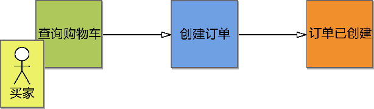

*图B-14 将查询操作纳入事件风暴中*

我认为这一方式并不妥当，它将流程图与事件的因果关系混为一谈了。流程图反映了现实世界的问题空间，事件风暴获得领域模型是解空间的内容，分属领域驱动设计的两个阶段。买家查询购物车然后创建订单，是买家的操作流程。从事件的因果关系看，并非查询购物车触发了创建订单这个决策命令，而是用户在查询获得购物车读模型后，再度由用户发起创建订单的决策命令，触发了订单已创建事件。查询购物车和创建订单是两个不同的业务服务，不具有时序上的连续性，可以认为是两个独立的业务服务。根据事件的定义，查询操作不会改变目标对象的状态，因而不会触发事件，也不会导致决策命令的发生。因此，事件风暴驱动的建模过程没有查询操作的位置，操作的结果会以读模型的形式出现。

**4.事件风暴的领域模型**

在事件风暴中，决策命令起到了连接角色、事件、写模型和读模型的枢纽作用。图B-15清晰地体现了决策命令的核心地位。


*图B-15 决策命令的核心地位*

决策命令并不只是触发事件的命令这么简单。决策命令代表了一个动作，执行动作的是角色。角色执行动作的目的是触发事件，而事件的触发又源于写模型状态的变化。

虽说决策命令具有重要的枢纽作用，但在事件风暴中，事件才是中心。在领域分析建模阶段，事件风暴以“事件”为中心，给出了一条有章可循的领域分析建模路径，如图B-16所示。

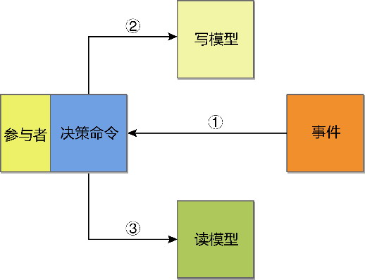

*图B-16 事件风暴的领域分析建模路径*

通过探索业务全景获得的事件流，按照时间轴顺序从左到右对每一个事件进行如下过程的领域分析建模。

① 通过事件反向驱动出决策命令：从事件驱动出决策命令非常容易，只需将事件的过去时态转换为动词形式的决策命令即可。

② 根据事件状态变更的目标确定写模型：一个事件只能有一个写模型，若出现多个写模型，要么说明这多个写模型之间存在聚合关系，要么说明遗漏了写模型对应的事件。

③ 综合确定读模型：从角色角度思考决策命令的执行，若要让写模型对象的状态发生变更，需要提供哪些读模型。一个事件对应的决策命令可能需要零到多个读模型。

以订单事件流为例，我选择了图B-17中的3个事件演示通过事件风暴建立领域分析模型的过程。

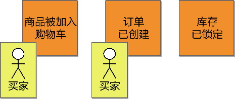

*图B-17 订单的3个事件*

首先是买家参与的“商品被加入购物车”事件。执行第1步，由该事件反向驱动出决策命令“添加商品到购物车”。第2步根据事件状态变更的目标，确定“商品被加入购物车”事件影响了购物车的状态，由此驱动出“购物车”写模型。第3步从角色思考决策命令的执行：买家要将商品添加到购物车，需要的前置信息是“商品”和“买家”，若缺乏这两个信息，买家就无法做出“添加商品到购物车”的决策。获得的领域模型如图B-18所示。

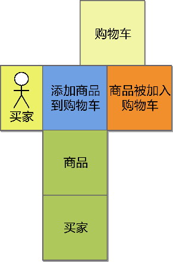

*图B-18 商品被加入购物车事件驱动获得的领域模型*

选择下一个后置事件“订单已创建”。它的角色仍然是买家，决策命令为“创建订单”。毫无疑问，“订单已创建”事件改变了订单的状态，获得写模型“订单”。买家要创建订单，需要购物车、买家、联系信息、配送地址，在创建订单时，还需要根据订单验证规则验证订单的有效性，由此可以获得对应的读模型。库存已锁定事件的领域模型推导也如是。结果如图B-19所示。

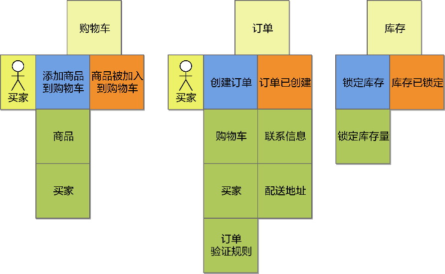

*图B-19 增加卡号已生成事件的领域模型*

以“事件”为驱动力的事件风暴领域分析建模过程提供了清晰的建模步骤，具有可操作性。参与事件风暴工作坊的建模人员按照步骤依次进行，每一步的执行都需要团队与领域专家讨论和确认，保证识别出来的模型对象遵循该领域的统一语言。识别的每个领域模型对象都有着建模的参考依据，包括模型对象的身份特征、彼此之间的关系、承担的职责。这在一定程度上减轻了对建模人员经验的依赖。

#### B.1.4 事件风暴与建模范式

在事件风暴确定了由事件、决策命令、写模型和读模型构成的领域分析模型之后，就可根据建模范式的不同，将其映射为不同的领域模型设计要素。

若选择对象建模范式，可考虑将写模型映射为一个聚合的聚合根实体。读模型则不确定，要结合具体的业务场景确定究竟是实体、值对象还是聚合根实体。事件通常被建模为领域事件，不过，如果不需要将聚合间的协作实现为事件协同风格，就未必需要领域事件这一设计要素，事件风暴识别出来的事件仅仅作为驱动建模的动力而已。至于决策命令，通常被定义为聚合根实体的领域行为，执行了改变其状态的业务逻辑。如果根据事件协同风格引入了领域事件，通常就由决策命令发布领域事件。

若遵循事件建模范式，通过事件风暴获得的以事件为核心的模型，就是事件驱动模型。该模型是对状态建模的真实体现，事件风暴识别的事件就是领域事件。每一个领域场景，都体现为一系列决策命令-领域事件的响应模式，写模型作为聚合，是状态的持有者，读模型是决策命令或领域事件携带的消息数据。

事件建模范式针对状态迁移进行建模，领域事件作为聚合状态迁移历史的“留存”，改变了聚合的生命周期管理方式。聚合由状态的持有者和控制者变成了响应命令和发布事件的中转站，聚合的状态也不再发生变更，而是基于“事实”的特征，为每次状态的变更记录（新增）一条领域事件记录。聚合不再被持久化，被持久化的是一系列沿着时间轴不停记录下来的历史事件。这就是与事件建模范式相匹配的事件溯源模式。该模式对事件的溯源，满足管理和运营的审计需求，通过回溯整个状态变更的过程可以完美地重现聚合的生命旅程。

### B.2 事件溯源模式

事件溯源(event sourcing)模式是为事件建模范式提供的设计模式。在这一模式下，领域事件与聚合成了领域设计模型的核心要素。

事件溯源模式不同于对象建模范式，主要体现为对聚合生命周期的管理。对象建模范式的资源库负责管理聚合的生命周期，直接针对边界内的实体与值对象执行持久化，事件溯源则不然，它将聚合以一系列事件的方式进行持久化，因为领域事件记录的就是聚合状态的变化，如果能够将每次状态变化产生的领域事件记录下来，就相当于记录了聚合生命周期每一步成长的脚印。此时，持久化的事件就成了一个自由的“时空穿梭机”，随时可以根据需求通过重放(replaying)回到任意时刻的聚合对象。

Chris Richardson总结了事件溯源的优点和缺点：“事件溯源有几个重要的好处。例如，它保留了聚合的历史记录，这对于实现审计和监管的功能非常有帮助。它可靠地发布领域事件，这在微服务架构中特别有用。事件溯源也有弊端。它有一定的学习曲线，因为这是一种完全不同的业务逻辑开发方式。”^177

事件溯源模式的首要原则是“事件永远是不变的”，因此对事件的持久化就变得非常简单：无论发生什么样的事件，在持久化时都是追加操作。这就好似在GitHub上提交代码，每次提交都会在提交日志上增加一条记录。因此，理解事件溯源模式需把握两个关键原则：

·聚合的每次状态变化，都是一个事件的发生；

·事件是不变的，以追加方式记录事件，形成事件日志。

由于事件溯源模式运用在限界上下文的边界内，它所操作的事件属于领域设计模型的一部分。若要准确说明，应称其为领域事件，以区分发布/订阅模式操作的应用事件。

#### B.2.1 领域事件的定义

事件溯源既然以追加形式持久化领域事件，就可以不受聚合持久化实现机制的限制，如对象与关系之间的阻抗不匹配、复杂的数据一致性问题、聚合的历史记录存储等。事件溯源持久化的不是聚合，而是由聚合状态变化产生的领域事件。这种持久化方式称为事件存储(event store)。

事件存储会建立一张事件表，记录下事件的ID、类型、关联聚合、事件的内容和事件产生的时间戳，其中，事件内容将作为重建聚合的数据来源。事件表需要支持各种类型的领域事件，意味着事件内容需要存储不同结构的数据值，因此通常选择JSON格式的字符串。例如IssueCreated事件：

```
{
   "eventId": "111",
   "eventType": "IssueCreated",
   "aggregateType": "Issue",
   "aggregateId": "100",
   "eventPayload": {
      "issueId": "100",
      "title": "Global Consent Management",
      "description": "Manage global consent for customer",
      "label": "STORY",
      "iterationId": "111",
      "points": 5
   },
   "occuredOn": "2019-08-30 12:10:11 756"
}
```

只要保证eventPayload的内容为可解析的标准格式，IssueCreated事件也可存储在关系数据库中，通过eventType、aggregateType和aggregateId可以确定事件以及该事件对应的聚合，重建聚合的数据则来自eventPayload的值。领域事件包含的值必须是订阅方需要了解的信息，例如IssueCreated事件会创建一张任务卡，如果事件没有提供该任务的title、description等值，就无法通过这些值重建Issue聚合对象。

#### B.2.2 聚合的创建与更新

实现事件溯源需要执行的操作（或职责）包括：

·处理命令；

·发布事件；

·存储事件；

·查询事件；

·创建以及重建聚合。

事件溯源虽然采用了和传统领域驱动设计不同的建模范式和设计模式，但仍然需要遵守领域驱动设计的根本原则：保证领域模型的纯粹性。参与到事件溯源的角色构造型包括领域事件、命令、聚合、资源库和事件存储，其中，资源库与事件存储属于南向网关，定义了端口和适配器。

事件溯源由于采用了事件存储模式，因此与发布/订阅模式不同，并不会真正发布事件到消息队列或者事件总线。事件溯源的所谓“发布事件”实则为创建并存储事件。

领域事件、命令和聚合属于内部领域层的领域设计模型。为保证领域模型的纯粹性，应将存储事件和查询事件的职责交给事件存储。与服务驱动设计的要求相似，领域服务承担了协作这些领域模型对象实现业务服务的职责，并由它与事件存储端口协作。为了让领域服务知道该如何存储事件，聚合在处理了命令之后，需要将生成的领域事件返回给领域服务。聚合仅负责创建领域事件，领域服务通过调用事件存储端口对领域事件进行持久化。

初次创建聚合实例时，聚合还未产生任何一次状态的变更，不需要重建聚合。因此，聚合的创建操作与更新操作的流程并不相同，在实现事件溯源时需区分对待。

创建聚合需要执行如下活动：

·创建一个新的聚合实例；

·聚合实例接收命令生成领域事件；

·运用生成的领域事件改变聚合状态；

·存储生成的领域事件。

例如，项目经理在项目管理系统中创建一张新的问题卡片。在领域层，首先由领域服务接收命令：

```
@DomainService
public class CreatingIssueService {
   private EventStore eventStore;
   public void execute(CreateIssue command) {
      Issue issue = Issue.newInstance();
      List<DomainEvent> events = issue.process(command);
      eventStore.save(events);
   }
}
```

领域服务通过Issue聚合的工厂方法创建一个新的聚合，然后调用该聚合实例的process()方法处理创建Issue的决策命令，然后通过EventStore端口将返回的事件集合持久化。

Issue聚合的process()方法首先会验证命令有效性，然后根据命令执行领域逻辑，再生成新的领域事件。在返回领域事件之前，会调用apply()方法更改聚合的状态：

```
@Aggregate
public class Issue {
   public List<DomainEvent> process(CreateIssue command) {
      try {
         command.validate();
         IssueCreated event = new IssueCreated(command.issueDetail());
         apply(event);
         return Collections.singletonList(event);
      } catch (InvalidCommandException ex) {
         logger.warn(ex.getMessage());
         return Collections.emptyList();
      }      
   }
   public void apply(IssueCreated event) {
      this.state = IssueState.CREATED;
   }
}
```

process()方法并不负责修改聚合的状态，这一职责交给了单独定义的apply()方法，并在返回领域事件之前调用该方法。之所以要单独定义apply()方法，是为了聚合的重建。重建聚合时需要先遍历该聚合发生的所有领域事件，再调用单独定义的apply()方法完成对聚合实例的状态变更。如此设计就能重用该逻辑，并保证聚合状态变更的一致性，真实地体现状态变更的历史。

IssueCreated事件是不可变的，process()方法就可以定义为一个没有副作用的纯函数。此为状态变迁的本质特征，即聚合从一个状态（事件）变迁到另一个新的状态（事件），而非修改聚合本身的状态值。这也正是事件建模范式与函数建模范式更为契合的原因所在。

聚合处理了命令并返回领域事件后，领域服务通过聚合依赖的事件存储端口存储这些领域事件。事件的存储既可认为是对外部资源的依赖，也可以认为是一种副作用。将存储事件的职责转移给领域服务，既符合面向对象尽量将依赖向外推的设计原则，也符合函数编程将副作用往外推的设计原则。遵循这一原则设计的聚合，能很好地支持单元测试的编写。

更新聚合需要执行如下活动：

·从事件存储加载聚合对应的事件；

·创建一个新的聚合实例；

·遍历加载的事件，完成对聚合的重建；

·聚合实例接收命令生成领域事件；

·运用生成的领域事件改变聚合状态；

·存储生成的领域事件。

例如，要将刚才创建好的Issue分配给团队成员，可发送命令AssignIssue给领域服务：

```
@DomainService
public class AssigningIssueService {
   private EventStore eventStore;
   public void execute(AssignIssue command) {
      Issue issue = Issue.newInstance();
      List<DomainEvent> events = eventStore.eventsOf(command.aggregateId());
      issue.applyEvents(events);
      // 注意process方法内部会调用apply()方法运用新的领域事件
      List<DomainEvent> events = issue.process(command);
      eventStore.save(events);
   }
}
```

领域服务首先创建了一个新生的聚合对象，然后通过EventStore与命令传递过来的聚合ID获得与该聚合相关的历史事件，然后针对新生的聚合进行生命状态的重建。这就相当于重新执行了一遍曾经执行过的领域行为，使得当前聚合恢复到接受本次命令之前的正确状态，然后处理当前决策命令，生成事件并存储。

#### B.2.3 快照

聚合的生命周期各有长短。例如，项目管理系统中Issue聚合的生命周期就相对简短，一旦该问题被标记为完成，几乎就可以认为具有该身份标识的Issue已经寿终正寝。除了极少数的Issue需要被重新打开，该聚合不会再发布新的领域事件了。有的聚合则不同，或许聚合变化的频率不高，但它的生命周期相当漫长。例如，银行系统的账户Account聚合就可能随着时间的推移，积累大量的领域事件。一个聚合的历史领域事件一旦随着时间的推移变得越来越多，如前所述的加载事件以及重建聚合的执行效率就会越来越低。

事件溯源通过“快照”(snapshot)来解决此问题。

使用快照时，通常会定期将聚合以JSON格式持久化到聚合快照表中。注意，快照表持久化的是聚合数据，而非事件数据。故而快照表记录了聚合类型、聚合ID和聚合的内容，当然也包括持久化快照时的时间戳。创建聚合时，可直接根据聚合ID从快照表中获取聚合的内容，然后通过反序列化创建聚合实例。如此即可让聚合实例直接从某个时间戳“带着记忆重生”，省去了从初生到快照时间戳的重建过程。快照内容不一定是最新的聚合值，因而还需要运用快照时间戳之后的领域事件，才能快速而正确地回归到最新状态：

```
@DomainService
public class AssigningIssueService {
   private EventStore eventStore;
   private SnapshotRepository snapshotRepo;
   public void execute(AssignIssue command) {
      // 利用快照重建聚合
      Snapshot snapshot = snapshotRepo.snapshotOf(command.aggregateId());
      Issue issue = snapshot.rebuildTo(Issue.getClass());
      // 获得快照时间戳之后的领域事件
      List<DomainEvent> events = eventStore.eventsAfter(command.aggregateId(), snapshot.
createdTimestamp());
      // 运用快照时间戳之后的领域事件，回归最新状态
      issue.applyEvents(events);
      List<DomainEvent> events = issue.process(command);
      eventStore.save(events);
   }
}
```

#### B.2.4 面向聚合的事件溯源

事件溯源有两个不同的视角。一个视角面向事件，另一个视角面向聚合。在前述代码中，无论是获取事件、存储事件或者运用事件，其目的都是操作聚合。例如，获取事件是为了实例化或者重建一个聚合实例；存储事件虽然是针对事件的持久化，但最终目的还是将来对聚合的重建，可等同为聚合的持久化；运用事件是为了正确地变更聚合的状态，相当于更新聚合。因此，我们可以通过聚合资源库来封装事件溯源与事件存储的底层机制。这样既能简化领域服务的逻辑，又能帮助代码的阅读者更加直观地理解领域逻辑。仍以Issue聚合为例，可定义IssueRepository类：

```
public class IssueRepository {
   private EventStore eventStore;
   private SnapshotRepository snapshotRepo;
   // 查询聚合
   public Issue issueOf(IssueId issueId) {
      Snapshot snapshot = snapshotRepo.snapshotOf(issueId);
      Issue issue = snapshot.rebuildTo(Issue.getClass());
      List<DomainEvent> events = eventStore.eventsAfter(command.aggregateId(), snapshot.
createdTimestamp());
      issue.applyEvents(events);
      return issue;
   }
   // 新建聚合
   public void add(CreateIssue command) {
      Issue issue = Issue.newInstance();
      processCommandThenSave(issue, command);
   }   
   // 更新聚合
   public void update(AssignIssue command) {
      Issue issue = issueOf(command.issueId());
      processCommandThenSave(issue, command);
   }
   private void processCommandThenSave(Issue issue, DecisionCommand command) {
      List<DomainEvent> events = issue.process(command);
      eventStore.save(events);
   }   
}
```

定义了面向聚合的资源库后，事件溯源的细节就被隔离在资源库内，领域服务操作聚合就如同对象建模范式的实现，不同之处在于领域服务接收的仍然是决策命令，使得它从承担领域行为的职责蜕变为对决策命令的分发，由于领域服务封装的领域逻辑非常简单，因此可以为一个聚合定义一个领域服务：

```
public class IssueService {
   private IssueRepository issueRepo;
   public void execute(CreateIssue command) {
      issueRepo.add(command);
   }
   public void execute(AssignIssue command) {
      issueRepo.update(command);
   }
}
```

领域服务的职责是完成对命令的分发，在事件建模范式中，可考虑将领域服务命名为命令分发器，如将IssueService更名为IssueCommandDispatcher，才算名副其实。

#### B.2.5 聚合查询的改进

通过IssueRepository的实现，可以看出事件溯源在聚合查询功能上存在的限制：仅仅支持基于主键的查询。这是由事件存储机制决定的。若要提高对聚合的查询能力，唯一有效的解决方案就是在存储事件的同时存储聚合。

聚合的存储与领域事件无关，它是根据领域模型对象的数据结构进行设计和管理的，可以满足复杂的聚合查询请求。存储的事件由于真实地反映了聚合状态的变迁，故而用于满足客户端发起的命令请求，因为只有命令请求才会引起状态的变化；存储的聚合则依照对象建模范式的聚合对象进行设计，通过ORM框架就能满足对聚合的高级查询请求。事件与聚合的分离，意味着命令与查询的分离，实际上就是命令查询职责分离(CQRS)模式（参见第18章）的设计初衷。

CQRS模式将系统的领域模型分为查询与命令两个类别：查询模型与命令模型。查询模型采用查询视图模式，直接查询业务数据库获得聚合；命令模型采用事件溯源模式，聚合负责命令的处理与事件的创建，需要同时操作事件数据库和业务数据库，前者用于每一个事件数据的存储，后者用于更新或创建聚合。

这一机制存在一个风险：若事件的持久化与聚合的持久化不一致该怎么办？

一个聚合产生的所有领域事件和聚合应处于同一个限界上下文。因此，可以选择将事件存储与聚合存储放在同一个数据库，以保证事件存储与聚合存储的事务强一致性。存储事件时，同时将更新后的聚合持久化。既然数据库已经存储了聚合的最新状态，就无须通过事件存储来重建聚合，但领域逻辑的处理模式仍然体现为命令-事件的状态迁移形式。至于查询，就与事件无关了，可以直接查询聚合所在的数据库。修改后的IssueRepository如下所示：

```
public class IssueRepository {
   private EventStore eventStore;
   private AggregateRepository<Issue> repo;
   public Issue issueOf(IssueId issueId) {
      return repo.findBy(issueId);
   }
   public List<Issue> allIssues() {
      return repo.findAll();
   }
   public void add(CreateIssue command) {
      Issue issue = Issue.newInstance();
      processCommandThenSave(issue, command);
   }   
public void update(AssignIssue command) {
      // 这里不再通过事件进行聚合的重建，而是直接查询聚合数据库
      Issue issue = issueOf(command.issueId());
      processCommandThenSave(issue, command);
   }
   private void processCommandThenSave(Issue issue, DecisionCommand command) {
      List<DomainEvent> events = issue.process(command);
      eventStore.save(events);
      repo.save(issue);
   }   
}
```

该方案的优势在于事件存储和聚合存储都在本地数据库，通过本地事务即可保证数据存储的一致性，且在支持事件追溯与审计的同时，还能避免重建聚合带来的性能影响。与不变的事件不同，聚合会被更新，因此它的持久化要比事件存储更加复杂。由于本地已经存储了聚合对象，事件的重要性就被削弱了，事件溯源的价值仅仅体现为对状态变迁的追溯。由于存储事件与聚合的操作发生在一个强一致的事务范围内，事件的异步非阻塞特性被“无情”地抹杀了。

要充分发挥事件异步非阻塞的特性，可以考虑将事件和聚合存储在不同数据库，先持久化事件，然后将事件的最新状态反映到业务数据库，形成对聚合的操作。这实际上才是事件的拿手好戏，通过发布或轮询事件搭建事件存储与聚合存储之间沟通的桥梁。事件不仅能用于溯源，还起到了通知状态变更的作用。

由于事件模型与聚合模型分属不同的进程，一旦选择发布事件，就需要引入事件总线作为传输事件的通道，并使用诸如Kafka、RabbitMQ之类的消息中间件作为事件总线以支持分布式消息的传输。这就相当于在事件溯源模式的基础之上引入了发布/订阅模式。要通知状态变更，可以直接将领域事件视为应用事件进行发布，也可以将领域事件转换为耦合度更低的应用事件。

事件存储端是发布者。当聚合接收到命令请求后生成领域事件，然后将领域事件或转换后的应用事件发布到事件总线。发布事件的同时还需存储事件，以支持事件的溯源。

聚合存储端是订阅者。它会订阅自己关心的事件，借由事件携带的数据创建或更新业务数据库中的聚合。由于事件消息的发布是异步的，处理命令请求和存储聚合数据的功能又分布在不同的进程，就能更快地响应客户端发送来的命令请求，提高整个系统的响应能力。

如果不需要实时发布事件，也可以让订阅者定时轮询存储在事件表的事件，获取未曾发布的新事件发布到事件总线。为了避免事件的重复发布，可以在事件表中增加一个published列，用于判断该事件消息是否已经发布。一旦成功发布了该事件消息，就需要更新事件表中的published，将其标记为true。

无论发布还是轮询事件，都需要考虑分布式事务的一致性问题，事务范围要协调的操作包括：

·存储领域事件（针对发布事件）；

·发送事件消息；

·更新聚合状态；

·更新事件表标记（针对轮询事件）。

虽然在一个事务范围内要协调的操作较多，但要保证数据的一致性也没有想象中那么棘手。事件的存储与聚合的更新并不要求强一致性，尤其对命令端而言，选择了这一模式，意味着你已经接受了执行命令请求时的异步非实时能力。要选择实时发布事件，为了避免存储领域事件与发送事件消息之间的不一致，可以考虑在事件存储成功之后再发送事件消息。由于领域事件是不变的，存储事件皆以追加方式进行，故而无须对数据行加锁来控制并发，这使得领域事件的存储操作相对高效。

许多消息中间件都可以保证消息投递做到“至少一次”，只要事件的订阅方保证更新聚合状态操作的幂等性，就能避免重复消费事件消息，变相地做到了“恰好一次”。更新聚合状态的操作包括创建、更新和删除，除了创建操作，其余操作本身就是幂等的。可以通过聚合的ID保证创建操作的幂等性：在执行创建操作之前先检查业务数据库是否已经存在该聚合ID，若已存在，证明该事件消息已经消费过，应忽略该事件消息，避免重复创建。当然，我们也可以在事件订阅方引入事件发送历史表。该历史表可以和聚合所在的业务数据表放在同一个数据库，可保证二者的事务强一致性，也能避免事件消息的重复消费。

针对轮询事件的实现方式，由于消息中间件保证了事件消息的成功投递，就无须等待事件消息发送的结果，即可更新事件表标记。即使更新标记的操作有可能出现错误，只要能保证事件的订阅者遵循了幂等性，就能避免事件消息的重复消费，降低一致性要求。哪怕更新事件表的标记时未能满足一致性，也不会产生负面影响。

剩下的问题就是如何保证聚合状态的成功更新。在确保了事件消息已成功投递之后，对聚合状态更新的操作已经由分布式事务的协调“降低”为对本地数据库的访问操作。许多消息中间件都可以缓存甚至持久化队列中的事件，在设置了合理的保存周期后，倘若事件的订阅者处理失败，还可通过重试机制提高更新操作的成功率。

### B.3 事件驱动架构

倘若采用事件驱动模型，应优先考虑限界上下文之间的协作遵循事件驱动架构风格。

#### B.3.1 事件驱动架构风格

事件驱动架构(event-driven architecture)是一种以事件为媒介、实现组件或服务之间最大松耦合的架构风格。遵循事件驱动架构风格，限界上下文的协作将采用发布者/订阅者模式，事件消息的传递通过事件总线完成。事件总线往往由消息中间件承担，消息中间件支持消息的异步和并发处理，并利用分布式系统的扩展优势，整体提高系统的响应能力。

事件驱动架构不仅仅是一种架构风格，实际上还延续了事件建模范式的思想，改变了我们观察限界上下文之间协作的视角。Sam Newman就认为限界上下文之间的协作有两种不同的风格：编排(orchestration)与协同(choreography)^36。

编排协作风格会将一个限界上下文的应用服务作为中心控制器，由它来协调多个限界上下文之间的协作。这一方式清晰地体现了该服务方法的执行过程，但问题在于主服务“作为中心控制点承担了太多职责”，这样的协作方式自然也带来了多个限界上下文之间的耦合。

协同协作风格采用发布事件和订阅事件的方式。主服务以异步方式将事件发布到事件总线，与之相关的限界上下文通过订阅该事件各自处理属于自己的业务。限界上下文之间通过事件总线隔离，唯一的耦合点就是事件。

事件驱动架构采用了协同协作风格。这一风格是对发布者/订阅者上下文映射模式的运用。作为事件发布者的上游限界上下文发布事件到事件总线，关注该事件的下游限界上下文订阅该事件，并在接收到该事件后处理事件，完成相关的领域行为。

#### B.3.2 引入事件流

事件的发布和订阅属于一种异步通信机制，触发事件的只能是引起目标对象状态变化的命令请求，而查询操作就不会触发事件，且请求者在发起查询操作后，需要实时等待查询返回的结果，属于同步操作。若查询操作发生在限界上下文之间，就不能基于事件进行协作了。这一协作方式带来了限界上下文之间的耦合，同步的执行方式也会抵消异步非阻塞操作带来的高响应优势。

一个纯粹的事件驱动架构需要将所有限界上下文参与协作的业务场景都设计为发布/订阅事件的异步协作模式。改进方法是引入事件流，在当前限界上下文缓存和同步本该由上游限界上下文提供的数据，以将本该属于跨限界上下文的查询操作改为本地查询操作。例如，订单上下文下订单时，本来需要调用库存上下文的库存服务，以验证商品是否缺货。为了避免调用库存上下文的远程服务，就可以在订单上下文的数据库中也建立一个库存表，并通过订阅库存上下文发布的InventoryChanged事件，将库存记录的变更同步到订单上下文的库存表，保证库存数据的一致。当订单上下文需要验证商品是否缺货时，只需查询自己的库存表，跨限界上下文的查询服务就变成了限界上下文内部的查询操作。

这一改进彻底消除了限界上下文之间的同步查询操作，将所有协作都变成了异步模式的命令操作，每个限界上下文只需要考虑向事件总线发布事件，并订阅自己感兴趣的事件，真正做到了限界上下文的自治（事件消息协议产生的耦合除外）。

为了清晰地展现引入事件流之后限界上下文协作方式的变化，我们以订单、支付、库存和通知上下文之间的关系为例加以说明。首先，考虑下订单业务服务，通过事件进行通信的序列图如图B-20所示。

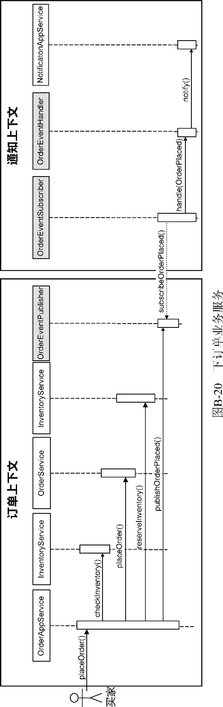

订单上下文的对象在同一个进程内协作。OrderAppService在接收到下订单请求后，需要通过InventoryService领域服务验证库存量。注意，InventoryService是订单上下文的领域模型对象，在它的checkInventory()方法实现中，调用了InventoryRepository查询了库存表，确定库存量是否满足订单的购买要求（这一协作过程在图B-20中被省略了，没有体现）。InventoryRepository和库存表也属于订单上下文，因为订单上下文通过事件流同步了库存上下文的库存数据（该同步操作在支付场景中有所体现）。下订单成功后，由OrderEventPublisher发布OrderPlaced事件。通知上下文的OrderPlacedEventSubscriber订阅了OrderPlaced事件，在收到事件后由OrderEventHandler处理该事件，然后通过NotificationAppService应用服务发送通知。

再考虑支付业务服务，它的执行序列如图B-21所示。

买家向支付上下文发起付款请求。完成支付操作后，PaymentEventPublisher发布了PaymentCompleted事件。订单上下文订阅了该事件，收到该事件后由OrderAppService对订单进行了确认，将订单的状态修改为Granted，然后发布OrderGranted事件。库存上下文订阅了这一事件，由InventoryAppService执行扣减库存量的操作，并发布InventoryChanged事件。为了实现库存上下文与订单上下文库存表的同步，订单上下文订阅了InventoryChanged事件，并在收到该事件后由订单上下文的InventoryAppService对本地的库存表执行扣减库存量的操作，保证库存数据的一致性。

支付业务服务的限界上下文协作相对比较复杂。实际上这里还省略了其他限界上下文的协作，例如除了库存上下文订阅了订单上下文发布的OrderGranted事件，通知上下文也会订阅该事件，并在收到该事件后向库存管理人员、买家和卖家发送通知。

图B-20和图B-21所示的限界上下文之间的协作均通过异步的事件进行，因此较难看出明显的整体业务流程，这也是事件驱动架构的一个缺陷。但是，对每个限界上下文而言，它们只需负责处理属于自己的业务，并在完成业务后发布相应的事件，充分体现了自治的特征。

事件驱动架构在引入事件总线后，通过事件流将远程查询操作改为本地查询操作，极大程度地保证了参与协作的每个限界上下文做到充分自治。如图B-22所示，每个限界上下文除需要关心发布和订阅的事件外，只需要知道作为事件总线的Kafka。

事件驱动架构虽然改变了限界上下文之间的协作方式，但仍然属于领域驱动架构的一部分。采用事件驱动架构进行限界上下文协作，对应的上下文映射模式即为发布者/订阅者模式。事件的发布与订阅仍然属于一种服务契约，其类型为服务事件契约。若将采用事件协作的限界上下文视为微服务，可将这样的微服务称为事件驱动服务。

事件驱动架构与事件溯源模式并不矛盾，前者关注限界上下文之间的协作，后者关注限界上下文内部的领域逻辑。二者也可以结合起来，围绕着事件建立事件驱动模型。以限界上下文为边界，对内，将所有的领域行为都理解为状态的变更，然后以事件形式进行存储和处理；对外，将所有的通信机制都理解为是事件消息的传递，然后以事件形式进行发布与订阅。如此就能做到系统的可追溯性、高响应性、弹性伸缩和松耦合。这正是事件驱动模型的核心优势。

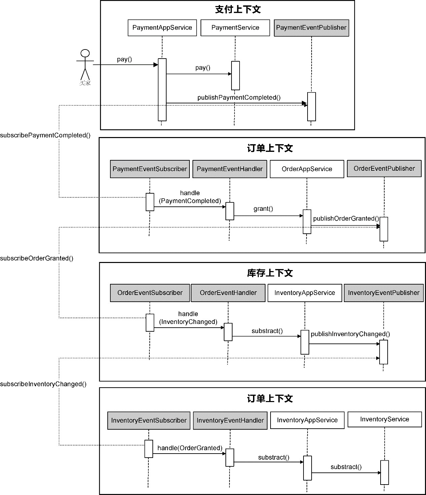

*图B-21 支付业务服务*

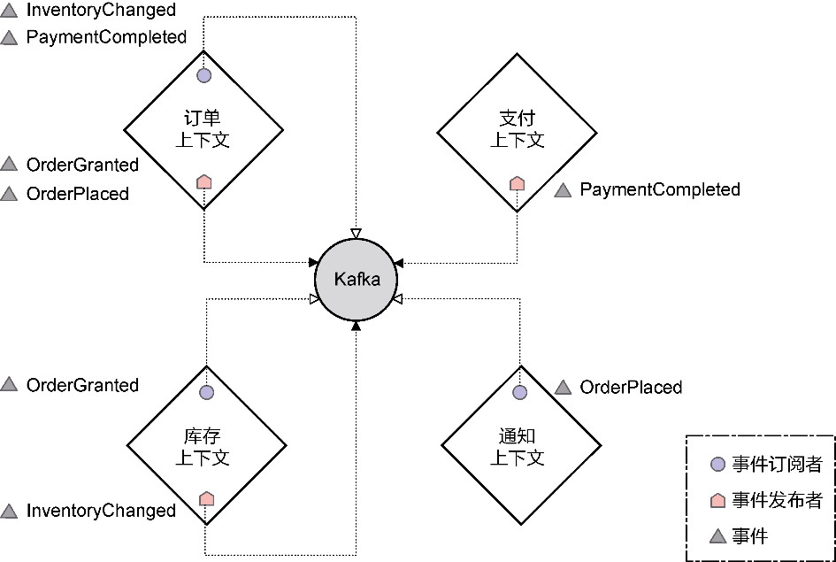

*图B-22 限界上下文只需知道事件总线*

毫无疑问，事件驱动模型存在一定的复杂度，若对此缺乏驾驭信心，就需慎用这一模型，或者选择性地为部分业务场景建立事件驱动模型，并做好限界上下文边界的控制。作为函数建模范式的分支，事件驱动模型还可以采用函数式编程，甚至考虑引入响应式编程框架，以匹配这种异步非阻塞的事件流模式。
