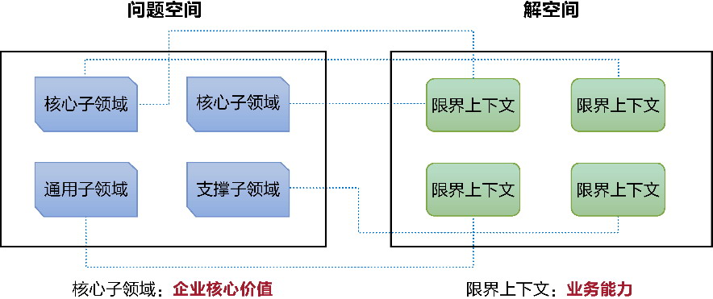
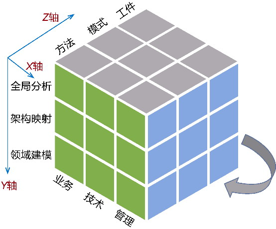
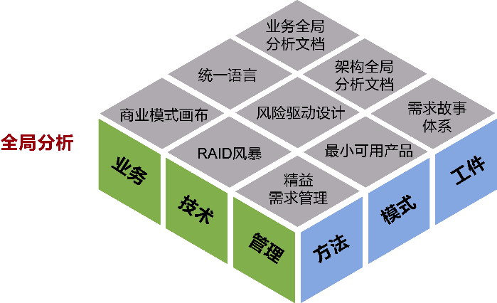
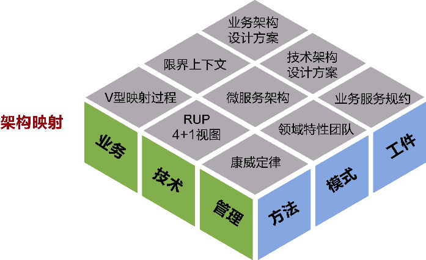
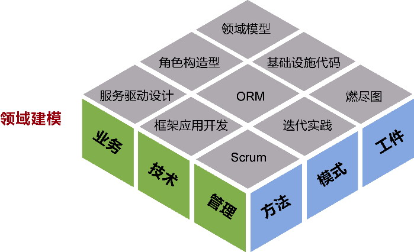

# 附录C 领域驱动设计魔方

> 只有体系在其轮廓形成时从理念世界的构造本身获得了灵感，它才是有效的。

> ——瓦尔特·本雅明，《德意志悲苦剧的起源》

在领域驱动设计统一过程中，结合我对领域驱动设计的理解和项目实践，我引入了一些新的模式和方法，丰富了领域驱动设计的知识体系。

实际上，领域驱动设计知识体系本身就不是一成不变的，从2003年Eric Evans的著作《领域驱动设计》面世以来，领域驱动设计作为一种模型驱动设计方法就在不断的演化和丰富之中。在丰富领域驱动设计知识体系之前，可以对领域驱动设计的发展做一次历史性的回眸。

### C.1 发展过程的里程碑

在领域驱动设计的发展过程中，有几个值得注意的里程碑。

首先是领域事件的引入。它不仅丰富了领域驱动设计元模型，还引起了建模思想与建模范式的变革。围绕领域事件，社区提出了诸多设计模式与架构模式，如事件溯源、事件存储、CQRS，事件驱动架构也在潜移默化地影响着领域驱动架构。领域事件关注状态的迁移，可以促进我们定义出无副作用的纯函数，从而改变过去以“名词”为主的对象建模范式，逐步丰富以“动词”为主的函数建模范式，甚至单独形成了以“事件”为核心的事件建模范式。

其次，微服务的引入凸显了领域驱动设计的重要性。除去微服务架构技术设施自身具有的复杂度，设计人员面临的最大难题就是如何设计合理的微服务。除了高内聚松耦合原则，微服务的设计原则竟然乏善可陈。此时，领域驱动设计进入了设计者的视野，限界上下文表现出来的自治性，对领域概念的知识语境界定和业务能力切分，恰好与微服务的粒度与边界不谋而合。谁能想到，Eric Evans已经为十年后诞生的微服务架构风格量身定做了这一套完整的方法体系？借由微服务架构的大行其道，人们似乎又重新认识了领域驱动设计，并将限界上下文抬高到了至高无上的地位。

作为“企业级能力复用平台”的业务中台战略，也在领域驱动设计中找到了完美的契合点。首先，领域驱动设计问题空间的核心子领域代表了企业的核心价值，这一核心价值又通过解空间的限界上下文彰显其业务能力，如图C-1所示。

*图C-1 核心子领域与限界上下文*

要做到企业级能力的复用，限界上下文是关键，内部的领域模型可作为基本的复用单元。在限界上下文知识语境下定义的领域模型，可在统一语言的指导下准确地表达领域概念，经过领域分析建模、领域设计建模和领域实现建模获得的领域模型，以可运行的代码工件为解决企业相关问题的解决方案子集，并逐步演化为企业信息系统需要的核心资产。

业务中台是企业级的规划与设计战略，领域驱动设计的作用域更倾向于软件系统。但是，我们也可以在领域驱动设计统一过程的全局分析阶段，开展对整个企业问题空间的梳理。这其实也对领域驱动设计提出了更高的要求，也就是我们需要突破领域驱动设计作为技术体系的定位，将其视为一种设计哲学，即领域驱动设计哲学(domain-driven design philosophy)。

为何说是哲学？哲学是一种智慧，是人类对宇宙、世界和人的洞见与思考，并由此提出的一种认知宇宙、世界和人的观点。如果将软件需要解决的真实世界视为宇宙或世界，一种设计体系不就是一套哲学观点吗？领域驱动设计将“领域”作为打开真实世界运行规律箱子的钥匙，体现的正是软件设计的一种哲学观。要匹配这种哲学观，就需要为领域驱动设计构建一套相对完整的知识体系。世界总在变化，为了对准我们观察的世界，这套知识体系自然也应该不断丰富和演化。

### C.2 领域驱动设计魔方

为了丰富领域驱动设计的知识体系，我们需要突破领域驱动设计的定义，扩大领域驱动设计的外延，引入更多与之相关的知识来丰富这一套方法体系，弥补自身的不足。这套方法体系能够从更大的范围打破战略与战术之间的隔阂，将二者在一个规范的知识体系中融合起来。我将这一知识体系称为领域驱动设计魔方(domain-driven design magic cube)。

要融合领域驱动的战略设计和战术设计，需要打破按照不同抽象层次进行割裂的过程方法，引入更为丰富的维度，全方位说明领域驱动设计方法体系。将整个体系分为3个维度进行剖析。

·X维度：基于观察角度定义维度。领域驱动设计不仅是一种架构设计方法，还牵涉到了研发过程的各个环节与内容，故而根据不同的观察角度将其分为业务、技术和管理3部分；

·Y维度：基于设计阶段定义维度。战略设计与战术设计不足以表现从问题空间到解空间的全过程，根据领域驱动设计统一过程的要求，将整个体系划分为全局分析、架构映射和领域建模3个阶段；

·Z维度：基于实践方式定义维度。每个抽象层次针对业务、技术和管理3个方面需要思考和分析的实践方式，包括方法、模式和工件。

如果将整个目标系统视为一个正方体，则它被从X轴、Y轴和Z轴3个维度切割，恰似一个可以任意转动的魔方，这正是“领域驱动设计魔方”得名之由来。X维度限定领域驱动设计的内容，Y维度分解领域驱动设计的过程，Z维度蕴含领域驱动设计的实践。由此站在全方位的角度融合了领域驱动的战略设计与战术设计，但又不至于过分地夸大领域驱动设计的作用，依旧将整个过程控制在领域驱动设计的范畴。领域驱动设计魔方的形式如图C-2所示。

*图C-2 领域驱动设计魔方的形式*

下面我将根据全局分析、架构映射和领域建模3个阶段，依次对领域驱动设计魔方进行阐释。

### C.3 全局分析的魔方切面

全局分析阶段是问题空间的定义与分析阶段，主要目的是明确系统的愿景与目标，确定业务问题、技术风险和管理挑战，通过全局调研与战略分析，在宏观层面确定整个系统在业务、技术和管理方面的战略目标、指导原则，为架构映射阶段与领域建模阶段提供有价值的输出。

全局分析的魔方切面如图C-3所示。

*图C-3 全局分析的魔方切面*

#### C.3.1 业务角度

业务角度的全局分析阶段就是确定整个系统的愿景与目标，确保开发的软件项目能够对准战略目标，避免软件投资偏离战略目标。通过全方位的全局分析，了解系统的当前状态，确定系统的未来状态，为探索系统的解决方案提供战略指导和范围界定。对应的Z轴实践包括：

·方法——商业模式画布、服务蓝图、业务流程图、业务服务图、事件风暴；

·模式——价值流、统一语言、子领域；

·工件——业务全局分析文档，包括系统的利益相关者、系统愿景与范围、系统核心子领域、系统通用子领域与支撑子领域、业务流程、业务场景、业务服务。

在全局分析的业务角度，通过引入商业模式画布、服务蓝图等方法，遵循全局分析5W模型，获得目标系统的价值需求与业务需求，构成业务全局分析文档。

#### C.3.2 技术角度

技术角度的全局分析需要考虑问题空间的技术需求，即对软件架构提出的质量属性需求。针对技术问题，团队需要调查架构资源，明确架构目标，评估整个系统可能存在的风险，确定风险优先级，由此确定架构战略。对应的Z轴实践包括：

·方法——RAID风暴；

·模式——风险驱动设计；

·工件——架构全局分析文档，包括架构资源与架构目标、技术风险优先级列表。

在全局分析的技术角度，通过引入RAID风暴识别目标系统的风险、假设、问题和依赖，对质量属性需求进行梳理，调查架构资源，明确架构目标，评估风险并确定风险优先级，由此获得架构全局分析文档。

#### C.3.3 管理角度

软件开发归根结底属于工程学的范畴，必须要有对应的管理体系支持。许多企业实施领域驱动设计之所以没有取得成功，固然有团队技能不足的原因，但没能在项目管理流程、需求管理体系和团队管理制度做出相应调整，可能才是主因。领域驱动设计统一过程定义了3个支撑工作流，分别响应项目管理、需求管理和团队管理的要求。全局分析阶段对应的Z轴实践包括：

·方法——精益需求管理、敏捷项目管理；

·模式——最小可用产品、故事地图；

·工件——需求故事体系，包括史诗故事、特性和用户故事，制订发布和迭代计划。

全局分析阶段属于管理流程的先启阶段，在确定了目标系统的需求后，可以按照精益需求管理体系的要求，将业务需求分解为史诗故事、特性与用户故事，按照最小可用产品(minimal viable product，MVP)划分发布阶段，根据敏捷项目管理的要求制订发布与迭代计划，并建立故事地图。

### C.4 架构映射的魔方切面

架构映射阶段是解空间中确定软件系统架构的设计阶段。它会针对问题空间寻找和确定战略层面的解决方案，基于领域驱动架构风格获得系统的业务架构、应用架构、数据架构和技术架构，并由系统的架构确定团队的组织结构，对业务需求和质量属性需求进行工作分配，满足领域驱动设计迭代建模的前置条件。

架构映射的魔方切面如图C-4所示。

*图C-4 架构映射的魔方切面*

#### C.4.1 业务角度

根据全局分析阶段输出的业务全局分析文档，引入业务架构的价值流和业务序列图，确定系统上下文，通过结合语义和功能进行相关性分析的V型映射过程识别限界上下文，明确每个业务服务的服务序列图确定限界上下文之间的协作关系，进而确定以限界上下文为架构单元的业务架构、应用架构和数据架构。对应的Z轴实践包括：

·方法——价值流、业务序列图、V型映射过程、服务序列图、事件风暴；

·模式——系统上下文、限界上下文、上下文映射、菱形对称架构、系统分层架构；

·工件——业务架构设计方案，包括系统的业务架构、应用架构、数据架构和服务定义文档。

通过引入业务架构的价值流分析、C4模型中的系统上下文图和业务序列图执行组织级映射，获得系统上下文；通过V型映射过程执行业务级映射，获得限界上下文，定义菱形对称架构，通过服务序列图确定上下文映射模式与服务契约；通过子领域确定限界上下文的层次，进而确定系统分层架构。然后，在领域驱动架构风格的指导下，以系统上下文、限界上下文为基础确定系统的业务架构、应用架构和数据架构，形成业务架构设计方案。

#### C.4.2 技术角度

根据全局分析阶段输出的架构全局分析文档，对系统的技术风险列表做出技术决策，确定系统的架构风格，如选择单体架构风格、微服务架构风格或者事件驱动架构风格，明确不同业务场景的通信协议。在评估风险后，确定解决或降低风险的架构因素，对具体的设计方案进行技术选型，确定目标系统的技术架构，并根据RUP 4+1视图给出整个系统的总体架构。对应的Z轴实践包括：

·方法——RUP 4+1视图；

·模式——单体架构风格、微服务架构风格、事件驱动架构风格、CQRS模式；

·工件——技术架构设计方案，包括系统的技术架构，以及质量属性列表和对应的解决方案。

根据全局分析阶段输出的风险列表和架构战略，结合不同的业务场景确定架构风格，从而明确限界上下文的边界与通信模式，并对每个限界上下文的内部架构进行技术选型，遵循业务与技术分离的原则确定技术架构，形成技术架构设计方案。最后，利用RUP 4+1视图对系统总体架构进行规范，基于业务场景视图确定系统的逻辑视图、开发视图、进程视图和物理视图，获得架构映射战略设计方案。

#### C.4.3 管理角度

根据康威定律，目标系统的架构应与团队组织结构保持一致，架构映射阶段在业务角度确定了限界上下文这一架构单元，又在技术角度确定了系统的架构风格。如此就能确定限界上下文的物理边界和系统分层架构，然后根据系统分层架构建立与之映射的领域特性团队和组件团队，规定团队各个角色的职责，根据上下文映射模式确定各个团队之间的协作模式。同时，在明确了项目管理流程和需求管理体系之后，根据全局分析阶段确定的发布与迭代计划，按照优先级为迭代待办项(spring backlog)编写业务服务规约。对应的Z轴实践包括：

·方法——康威定律、业务服务；

·模式——领域特性团队、组件团队；

·工件——确定团队组织结构，明确团队的沟通形式，由业务服务规约组成的需求规格说明书。

架构映射阶段仍然属于管理流程的先启阶段。根据康威定律组建与系统分层架构匹配的由领域特性团队与组件团队组成的项目团队，并根据Scrum敏捷项目管理要求，按照发布与迭代计划完成高优先级的业务服务需求分析。

### C.5 领域建模

全局分析与架构映射偏重于宏观层次的问题分析与战略规划，领域建模的活动则属于战术环节，需要根据架构设计的要求对业务需求做进一步梳理和细化，深化设计领域模型，并在技术实现过程中进一步评估技术风险对架构带来的影响，从而给出可行的设计方案，继续梳理和细化需求，确定每个领域特性团队的任务，在敏捷项目管理的要求下推动整个系统以迭代建模与增量开发的方式完成构建。

领域建模的魔方切面如图C-5所示。

*图C-5 领域建模的魔方切面*

#### C.5.1 业务角度

根据限界上下文所处领域是否为核心子领域确定不同的建模范式，然后在统一语言的指导下，分别开展领域分析建模、领域设计建模和领域实现建模，从而为限界上下文输出领域模型。对应的Z轴实践包括：

·方法——快速建模法、事件风暴、四色建模法、服务驱动设计、测试驱动开发；

·模式——角色构造型（包含了聚合与领域服务）、实体、值对象、领域事件、事件溯源；

·输出——领域模型，包括领域分析模型、领域设计模型和领域实现模型。

在领域建模阶段的业务角度，通过快速建模法、四色建模法或事件风暴确定领域分析模型，然后遵循角色构造型的要求确定以聚合为核心的领域设计模型，利用服务驱动设计将不同的职责分配给对应的角色构造型，丰富领域设计模型，最后结合测试驱动开发获得由业务产品代码和测试代码构成的领域实现模型。当然，不同建模范式得到的领域模型会有所差异，甚至可以围绕着事件进行分析和设计，获得事件驱动模型。

#### C.5.2 技术角度

在菱形对称架构模式的要求下确保技术复杂度与业务复杂度的隔离，评估技术实现对领域模型带来的影响，例如持久化框架、事务一致性对领域模型的影响。同时，也需要评估领域模型对技术实现的影响，例如事件溯源模式对基础设施的影响。由此进行框架应用开发，实现基础设施代码。同时，还需要考虑运维部署的技术因素，包括自动化测试、持续集成等DevOps实践。对应的Z轴实践包括：

·方法——框架应用开发、持续集成；

·模式——ORM、事务模式、测试金字塔；

·输出——基础设施的产品代码与测试代码。

领域建模的技术角度需要确定持久化框架等基础设施的技术选型，确定事务、安全等横切关注点的实现要求，在隔离业务复杂度与技术复杂度的原则下进行框架应用开发，实现基础设施代码，保证让整个软件系统能够运行起来，满足客户的业务需求和质量属性需求。除了必要的基础设施实现代码，还应遵循DevOps的工程实践，提供自动化测试代码与自动化运维脚本。

#### C.5.3 管理角度

需求的管理步伐必须与业务和技术保持一致。进入领域建模阶段后，需求分析与业务服务规约的编写直接影响了领域建模的质量和进度。进度管理的重点是对迭代计划的把控，即在迭代过程中合理安排不同层次的设计与开发活动，尤其是领域建模活动的时间与内容，并实时了解迭代开发过程的健康状况。在团队管理方面，需要继续促进开发团队与领域专家在领域建模过程中的交流与协作，通过定期召开回顾会议，总结最佳实践，梳理技术债务。在迭代开发过程中引入一些实践如故事启动会与故事验收来加强团队不同角色之间对需求的沟通。对应的Z轴实践包括：

·方法——Scrum或极限编程流程；

·模式——Scrum四会、任务看板、迭代实践，即故事启动会与故事验收；

·输出——由业务服务规约组成的需求规格说明书、迭代计划、技术债雷达图、进度燃烧图/燃尽图、回顾会议待办项。

无论是领域特性团队，还是组件团队，都必须遵循迭代计划的开发要求，在Scrum的迭代周期内完成。团队通过用户故事体现需求，通过看板跟踪迭代进度。为了加强需求、开发、测试等角色之间的交流，引入诸如故事启动会与故事验收等迭代实践，最终的进度情况可以通过燃尽图或者燃烧图来表示。

虽然领域驱动设计以业务为主，但业务与技术、管理是相互影响的。领域驱动设计魔方以领域驱动设计研发方法论为中心，将有利于将领域驱动设计的诸多方法、模式和实践整合进来，形成多层次、多维度、多角度的整体知识体系。领域驱动设计统一过程建立了以“领域”为核心驱动力的动态设计过程，领域驱动设计魔方则建立了一套静态的多层次知识体系，可以作为企业或组织实施领域驱动设计的参考体系。
