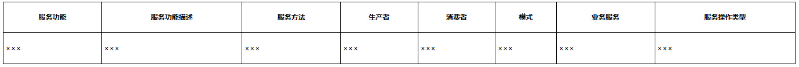

# 附录D 领域驱动设计统一过程交付物

全局分析规格说明书

（基于领域驱动设计统一过程）

版本：V1.0

### D.1 价值需求

描述目标系统的价值需求，可以附上商业模式画布。

#### D.1.1 利益相关者

描述目标系统的利益相关者，包括终端用户、企业组织、投资人等。

#### D.1.2 系统愿景

描述利益相关者共同达成一致的愿景，该愿景的描述需要对准企业的战略目标。

#### D.1.3 系统范围

确定了目标系统问题空间的范围和边界，可以通过未来状态减去当前状态确定范围。

**1.当前状态**

识别当前已有的资源（人、资金），已有的系统，当前的业务执行流程。

**2.未来状态**

根据业务愿景和利益相关者确定构建目标系统后希望达到的未来状态。

**3.业务目标**

明确各个利益相关者提出的业务目标。

### D.2 业务需求

#### D.2.1 概述

对目标系统整体业务需求的描述，展开对整个问题空间的探索，划分核心子领域、通用子领域和支撑子领域，可附上子领域映射图。

#### D.2.2 业务流程

整个目标系统的核心业务流程和主要业务流程，可以通过服务蓝图、泳道图或活动图绘制业务流程图。

#### D.2.3 子领域1…n

按照每个子领域对业务需求进行描述。业务需求的层次：

子领域->业务场景->业务服务

**1.业务场景1…n**

描述业务场景的业务目标，并通过业务服务图体现业务场景与业务服务之间的关系。

业务服务1…n

按照业务服务规约的模式编写业务服务。

(1)编号

标记业务服务的唯一编号。

(2)名称

动词短语形式的业务服务名称。

(3)描述

作为<角色>；

我想要<服务功能>；

以便于<服务价值>。

(4)触发事件

角色主动触发的该业务服务的具体事件，可以是点击UI的控件、具体的策略或伴生系统发送的消息。

(5)基本流程

用于表现业务服务的主流程，即执行成功的场景，也可以称之为“主成功场景”。

(6)替代流程

用于表现业务服务的扩展流程，即执行失败的场景。

(7)验收标准

一系列可以接受的条件或业务规则，以要点形式列举。

架构映射战略设计方案

（基于领域驱动设计统一过程）

版本：V1.0

### D.3 系统上下文

结合全局分析阶段获得的价值需求（利益相关者、系统愿景、系统范围）确定系统上下文，体现用户、目标系统与伴生系统之间的关系。

#### D.3.1 概述

绘制系统上下文图，明确解空间的系统边界。

#### D.3.2 系统协作

业务流程1…n

根据全局分析阶段获得的业务流程，为每个业务流程绘制业务序列图，并以文字简要说明彼此之间的协作关系。

### D.4 业务架构

结合业务愿景与业务范围，描绘出核心子领域、支撑子领域与通用子领域之间的关系。

#### D.4.1 业务组件

结合全局分析阶段获得的业务服务，根据V型映射过程从业务相关性识别限界上下文，并将其作为组成业务架构的业务组件，通过业务服务图展现业务服务与业务组件之间的包含关系。为每个业务组件中的业务服务绘制服务序列图，展现前端、业务组件（限界上下文）与伴生系统之间的调用关系。

#### D.4.2 业务架构视图

确定业务组件与子领域之间的关系，从业务角度绘制整个目标系统的业务架构。

### D.5 应用架构

#### D.5.1 应用组件

在限界上下文的指导与约束下，将业务架构的业务组件映射为应用架构的应用组件。应用组件的粒度对应于限界上下文，但需要从团队维度和技术维度进一步梳理限界上下文的边界，同时根据质量属性的要求确定进程边界。应用组件以库或服务的形式呈现，除共享内核外，应用组件的内部架构遵循菱形对称架构的要求。

#### D.5.2 应用架构视图

在业务架构视图的指导下，通过系统分层架构体现应用架构视图。其中，系统分层架构的业务价值层与基础层由具有限界上下文特征的应用组件组成。

### D.6 子领域架构

根据各个不同的子领域，设计各自的架构。

#### D.6.1 核心子领域1…n

**1.概述**

描述核心子领域提供的业务能力，并以列表方式给出每个应用组件的说明，为其绘制上下文映射图，体现该子领域内各个应用组件的协作关系。

**2.应用组件1…n**

描述应用组件的基本信息，包括组件名、组件描述与组件类型。

全局分析阶段输出的业务服务对应于解空间的服务契约，而服务契约又属于应用组件。为当前应用组件编写服务契约定义，包括服务功能、服务功能描述、服务方法、生产者、消费者、模式、业务服务与服务操作类型，以表D-1的形式给出。

*表D-1 服务契约列表*

服务契约1…n

详细描述每一个服务契约定义，内容包括服务功能、服务功能描述、服务方法、生产者、消费者、模式、业务服务与服务操作类型，并给出与服务质量相关的要素，包括幂等性、安全性、同步或异步及其他设计要素，如性能、兼容性、环境等。

#### D.6.2 支撑子领域

同D.6.1核心子领域。

#### D.6.3 通用子领域

同D.6.1核心子领域。
