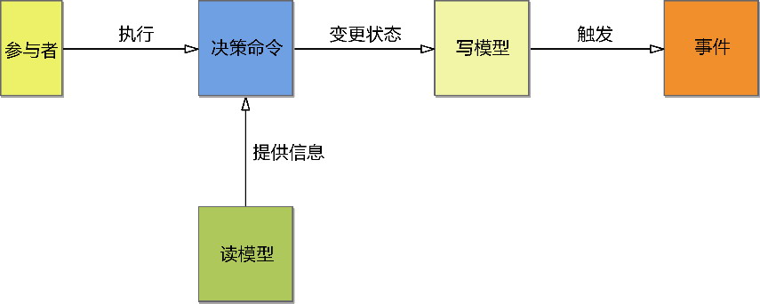

# 第六部分 附录

> 卡片结构：📖原文＝逐字引用（附录X.M · uid NN 双锚点）｜🧭归纳＝编者从上述原文提炼，不冒充原文。来源：`00-原书档案/fulltext/uid-NN-*.md`

## 附录A 附录A 领域建模范式

- **章节 UID**: 26
- **章节号**: 附录A
- **字数**: 38439
- **父模块**: 附录
- **原文出处**: [`uid-26-领域建模范式.md`](../00-原书档案/fulltext/uid-26-领域建模范式.md)

> 📖 **原文**（附录A.引言）：“范式”一词最初由美国哲学家托马斯·库恩(Thomas Kuhn)在其经典著作《科学革命的结构》(The Structure of Scientific Revolutions)中提出，用于对科学发展的分析。库恩认为每一个科学发展阶段都有特殊的内在结构，而体现这种结构的模型即范式。他明确地给出了一个简洁的范式定义：“按既定的用法，范式就是一种公认的模型或模式。”

> 📖 **原文**（附录A.引言）：建立领域模型可以遵循的主要建模范式包括结构建模范式、对象建模范式和函数建模范式，恰好对应3种编程范式：结构化编程(structured programming)、面向对象编程(object-oriented programming)和函数式编程(functional programming)。建模范式与编程范式的对应关系，也证明了分析、设计和实现三位一体的关系。

> 📖 **原文**（附录A.1.1）：结构化编程的理念最早由Edsger Wybe Dijkstra在1968年提出。在给Communications of the ACM编辑的一封信中，Dijkstra论证了使用goto是有害的，并明确提出了顺序、选择和循环3种基本的结构。这3种基本的结构可以使程序结构变得更加清晰，富有逻辑。

> 📖 **原文**（附录A.1.1）：模块对职责的封装体现为信息隐藏(information hiding)，这一原则同样来自结构化编程。Parnas在1972年发表的论文《论将系统分解为模块的准则》中强调了信息隐藏的原则。

> 📖 **原文**（附录A.1.1）：以过程为中心的结构化编程思想强调“自顶向下、逐步向下”的设计原则。它对待问题空间的态度，就是将其分解为一个一个步骤，再由函数来实现每个步骤，并按照顺序、选择或循环的结构对这些函数进行调用，组成一个主函数。

> 📖 **原文**（附录A.1.2）：Pascal语言的发明人沃斯教授认为：数据结构 + 算法 = 程序。这一公式概况了结构化编程范式的特点：数据结构与算法分离，算法用来操作数据结构。

> 📖 **原文**（附录A.1.2）：Martin Fowler将这样的对象组成的模型称为贫血模型，他认为：“贫血模型一个明显的特征是它仅仅是看上去和领域模型一样，都拥有对象、属性，对象间通过关系关联。但是当你观察模型所持有的业务逻辑时，你会发现，贫血模型中除了一些getter、setter方法，几乎没有其他业务逻辑。”

> 📖 **原文**（附录A.1.3）：事务脚本“使用过程来组织业务逻辑，每个过程处理来自表现层的单个请求”。这是一种典型的过程式设计，每个服务功能都是一系列步骤的组合，形成一个完整的过程事务。

> 📖 **原文**（附录A.1.3）：Martin Fowler对于事务脚本说了一句公道话：“不管你是多么坚定的面向对象的信徒，也不要盲目排斥事务脚本。许多问题本身是简单的，一个简单的解决方案可以加快你的开发速度，而且运行起来也会更快。”

> 📖 **原文**（附录A.2.1）：领域驱动设计通常采用面向对象的编程范式，这种范式将领域中的所有概念都视为“对象”。遵循面向对象的设计思想，社区的重要声音是避免设计出只有数据属性的贫血模型。当然，对象建模范式要遵循的设计思想和原则并不止于此，要把握面向对象设计的核心，我认为需要抓住职责与抽象这两个核心。

> 📖 **原文**（附录A.2.1）：职责(responsibility)之所以名为职责而非行为(behavior)或功能(function)，是从角色拥有何种能力的角度做出的思考。职责是对象封装的判断依据：因为对象拥有了数据，即认为它掌握了某个领域的知识，从而具备完成某一功能的能力；因为该对象拥有了这一能力，故而在定义对象时，赋予了它参与业务场景的角色，产生与其他对象之间的协作。以“职责”为核心进行面向对象设计，就是要通过职责去寻找应该履行该职责的角色，再思考角色之间如何协作完成一个完整的任务。

> 📖 **原文**（附录A.2.1）：通过行为协作的方式满足命令而非询问(tell, don’t ask)原则。这个原则要求一个对象应该命令其他对象做什么，而不是去查询其他对象的状态来决定做什么。显然，顾客应该命令钱包：钱够吗？而不是去查询钱包中装了多少钱，然后由顾客自己来判断钱是否足够。

> 📖 **原文**（附录A.2.1）：信息专家模式体现了专业的事情交给专业的对象去做的行事原则。在对象世界里，若每个对象都能成为信息专家，就能做到各司其职、各尽其责。

> 📖 **原文**（附录A.2.1）：需要遵循单一职责原则(single responsibility principle，SRP)，即“一个类应该有且只有一个变化的原因”。该如何理解这一原则？当一个类只有一个引起它变化的原因时，就意味着分配给它的职责必须是紧密相关的。如果发现一个类存在多于一个的变化点，就应该分离变化。

> 📖 **原文**（附录A.2.2）：抽象就是算命先生的“一指禅”，一个指头代表了4种完全不同的含义——是一切人高中，还是一个都不中？是一个人落榜，还是一个人高中？算命先生并不能未卜先知，因此只能给出一个包含了所有可能却无具体实现的答案，至于是哪一种结果，就留给3个秀才慢慢琢磨吧。这就是抽象，它意味着可以包容变化，也就意味着稳定。

> 📖 **原文**（附录A.2.2）：依赖注入最初的名称叫“控制反转”(inversion of control)，Martin Fowler在探索了这个模式的工作原理之后，给它取了现在这个更能体现其特点的名字。依赖注入解除了调用者与被调用者之间的耦合，其中的关键在于抽象和依赖外推，最后再通过某种机制注入依赖。

> 📖 **原文**（附录A.2.2）：我们也需要克制设计的过度抽象，不要考虑太多不切实际的扩展性与灵活性，避免引入过度设计，毕竟未来是不可预测的。

> 📖 **原文**（附录A.3.引言）：Ken Scambler认为函数范式的主要特征为模块化(modularity)、抽象化(abstraction)和可组合(composability)。这3个特征可以帮助我们编写简单的程序。

> 📖 **原文**（附录A.3.引言）：遵循函数建模范式建立的领域模型，其核心要素为代数数据类型（algebraic data type，ADT）和纯函数。代数数据类型表达领域概念，纯函数表达领域行为。由于二者皆被定义为不变的、原子的，因此在类型的约束规则下可以对它们进行组合。可组合的特征使得函数范式建立的领域模型可以由简单到复杂，能够利用组合子来表现复杂的领域逻辑。

> 📖 **原文**（附录A.3.1）：代数数据类型不包含任何行为。它利用和类型(sum type)展示相同抽象概念的不同组合，使用积类型(product type)展示同一个概念不同属性的组合。

> 📖 **原文**（附录A.3.2）：如果说面向对象设计需要将依赖尽可能向外推，最终采用依赖注入的方式来降低耦合，那么，函数式编程思想就是要利用纯函数来隔离变化与不变，内部由无副作用的纯函数组成，纯函数将副作用向外推，形成由不变的业务内核与可变的副作用外围组成的结构，如图A-16所示。

> 📖 **原文**（附录A.3.3）：对象建模范式采用了归纳法，通过分析和归纳需求，找到问题并逐级分解问题，然后通过对象来表达领域逻辑，以职责的角度分析这些领域逻辑，并根据角色的特征把职责分配给各自的对象，通过对象之间的协作实现复杂的领域行为。

> 📖 **原文**（附录A.3.3）：函数建模范式采用了演绎法，通过在领域需求中寻找和定义最基本的原子操作，然后根据基本的组合规则利用组合子将这些原子类型与原子函数组合起来。

> 📖 **原文**（附录A.3.3）：采用函数建模范式进行领域建模，关键是组合子以及组合规则的设计，既要简单，又要完整，还需要保证每个组合子的正交性。只有如此，才能对其进行组合，使其互不冗余，互不干涉。这些组合子，就是代数数据类型和纯函数。

> 🧭 **归纳**：附录A是对领域驱动设计底层**建模范式**的回顾与对比，关键词：①**三种范式 = 三种编程范式**：结构范式 = 结构化编程（过程式）= 数据结构与算法分离；对象范式 = OOP（信息隐藏+封装）= 数据与行为绑定；函数范式 = FP（纯函数+ADT）= 类型不变+行为无副作用。三者一一对应，验证了“分析、设计、实现三位一体”。②**结构范式的贡献与局限**：模块化、接口、信息隐藏（封装前身）、自顶向下分解、组合方法模式、事务脚本都是其遗产；但“数据结构+算法=程序”的公式导致算法可重复定义、无法限制数据可操作范围、修改波及全程序，催生了以数据库为驱动的**贫血模型**——只有 getter/setter 几乎无业务逻辑（Martin Fowler 名言）。事务脚本虽“过程式”，但 Martin Fowler 也承认简单问题就该用简单方案。③**对象范式的核心 = 职责+抽象**：a) **职责**——对象因拥有数据而具备能力，按角色参与协作；**信息专家模式**（知识的持有者即为操作该信息的专家）+ **迪米特法则**（只与朋友说话）+ **tell-don't-ask**（命令而非询问）+ **SRP**（一个类一个变化原因）共同构成协作准则；b) **抽象**——提炼行为共性（如 Switchable 接口替代 Lamp/TVSet 具体依赖）→ **依赖注入**（推依赖至最外层）→ **封装变化**（策略/命令/模板方法/桥接模式分离变化与不变，最后形成规格模式封装业务规则）；克制抽象 = 不要为不可预测的未来设计。④**函数范式的核心 = ADT+纯函数**：a) **ADT**——和类型（sum，逻辑或，限制取值范围，如 Currency=RMB+USD+EUR）+ 积类型（product，笛卡儿积，如 Employee=String×String×String×Date）；不可变 → 天然线程安全；模式匹配分支数 = 和类型的 inhabitant 数，编译器可检查穷尽性；b) **纯函数**——无副作用（无修改、无 IO、无异常），引用透明（同输入必同输出可互换），andThen/compose 组合子 + Monad 的 flatMap + Scala for-comprehensions 实现高阶组合；副作用被推到外围，业务内核保持纯函数；c) **方法论差异**——对象范式是**归纳法**（拆问题→分对象→定职责→协作），函数范式是**演绎法**（找原子→定组合规则→正交组合子组合），二者出发点截然相反。⑤**范式选择影响领域模型**：结构范式→简单领域模型（活动记录）；对象范式→复杂领域模型（数据映射器，DDD 推荐）；函数范式→“非主流”DDD（ADT+纯函数），可与事件、状态机天然契合。一句话：**范式决定世界观**——同一领域用不同范式建模得到迥异的领域模型；DDD 推荐对象范式，但函数范式与事件驱动结合时反而更自然（详见附录B）。

## 附录B 附录B 事件驱动模型

- **章节 UID**: 27
- **章节号**: 附录B
- **字数**: 22918
- **父模块**: 附录
- **原文出处**: [`uid-27-事件驱动模型.md`](../00-原书档案/fulltext/uid-27-事件驱动模型.md)

> 📖 **原文**（附录B.引言）：事件建模范式的关注点既非对象建模范式中的领域概念，也非函数建模范式中的领域行为，自然也不属于结构建模范式，而是领域行为引起的领域概念状态的变化。事件针对状态建模，在此观察视角下，大多数业务流程都可以视为由命令触发的引起状态迁移的状态机。

> 📖 **原文**（附录B.引言）：事件建模范式有自己的独到之处。分析与设计的驱动力是事件，建模的核心是事件，事件引起的是领域对象状态的迁移。事件建模范式通过事件观察真实世界，并围绕着“事件”为中心去表达领域对象的状态迁移，进而以事件来驱动业务场景。

> 📖 **原文**（附录B.1）：事件风暴由Alberto Brandolini提出，是一种以工作坊形式对复杂业务领域进行探索的高效协作方法，它的运用范围自然不仅限于事件建模范式。然而，事件风暴提倡由“事件”驱动团队观察、探索和分析业务领域，更加契合事件建模范式的领域建模。

> 📖 **原文**（附录B.1.1）：事件风暴之所以以事件为驱动力，源于事件意味一种因果关系。这使得一个静态的概念隐藏着流动的张力。在识别和理解事件时，可以考虑为什么要产生这一事件，以及为什么要响应这一事件，进而思考响应事件的后续动作，驱动着设计者的“心流”不断思考下去，犹如搅起了一场激烈的风暴。

> 📖 **原文**（附录B.1.1）：事件风暴是一种高度强调交流与协作的可视化工作坊，需大量使用大白纸与各色即时贴。面对着糊满整面墙的大白纸，工作坊的参与人员通过充分地交流与沟通，然后用马克笔在各色即时贴上写下各个领域模型概念，贴在墙上呈现生动的模型。

> 📖 **原文**（附录B.1.1）：运用事件风暴的一个关键就是扭转对真实世界业务的认识，以事件作为理解业务的起点，考虑在业务流程中究竟需要留存什么样的关键事实，以满足管理和运营的要求，从而识别出事件。

> 📖 **原文**（附录B.1.1）：事件自身具备时间特征，使得业务场景的事件一经识别，就能形成动态的流程。事件会导致目标对象状态的变更，说明唯有命令才会触发事件，这就要求我们在开展事件风暴时，需要区分命令和查询。

> 📖 **原文**（附录B.1.2）：在探索业务全景的过程中，为了使每个人保持专注，需要排除其余领域概念的干扰，一心寻找沿着时间轴发展的事件。事件是事件风暴的主要驱动力，寻找出来的事件则是领域分析模型的骨架。事件风暴使用橙色即时贴代表事件(event)。

> 📖 **原文**（附录B.1.2）：触发事件的起因就是事件的角色。通过事件风暴进行业务全景探索时，可在获得全景事件流后，明确各个事件的角色，分别用不同颜色的即时贴进行标记。

> 📖 **原文**（附录B.1.3）：决策命令往往由动词短语组成，例如提交订单(place order)、发送邀请(send invitation)等。由于决策命令和事件存在因果关系，二者往往一一对应。例如，取消订单(Cancel Order)决策命令会触发OrderCanceled事件，预订课程(subscribe course)决策命令会触发CourseSubscribed事件。这种一一对应关系使得它们存在语义上的重叠。

> 📖 **原文**（附录B.1.3）：写模型(write model)就是状态发生了变化的目标对象，正是写模型状态的变更才导致了事件的触发。如此一来，识别写模型就是水到渠成的过程，因为在探索业务全景时，我们甄别事件的一个特征，就是看它是否引起目标对象状态的变化。识别出了事件，意味着已经明确了状态发生变化的目标对象，它就是我们要寻找的写模型。写模型用黄色即时贴表示。

> 📖 **原文**（附录B.1.3）：读模型是用户执行决策命令必需的输入信息，在代码层面，读模型就是执行决策命令领域行为所需的输入参数。

> 📖 **原文**（附录B.1.3）：决策命令起到了连接角色、事件、写模型和读模型的枢纽作用。图B-15清晰地体现了决策命令的核心地位。*图B-15 决策命令的核心地位*决策命令并不只是触发事件的命令这么简单。决策命令代表了一个动作，执行动作的是角色。角色执行动作的目的是触发事件，而事件的触发又源于写模型状态的变化。

> 📖 **原文**（附录B.1.3）：以“事件”为驱动力的事件风暴领域分析建模过程提供了清晰的建模步骤，具有可操作性。参与事件风暴工作坊的建模人员按照步骤依次进行，每一步的执行都需要团队与领域专家讨论和确认，保证识别出来的模型对象遵循该领域的统一语言。

> 📖 **原文**（附录B.1.4）：若遵循事件建模范式，通过事件风暴获得的以事件为核心的模型，就是事件驱动模型。该模型是对状态建模的真实体现，事件风暴识别的事件就是领域事件。每一个领域场景，都体现为一系列决策命令-领域事件的响应模式，写模型作为聚合，是状态的持有者，读模型是决策命令或领域事件携带的消息数据。

> 📖 **原文**（附录B.2）：事件溯源(event sourcing)模式是为事件建模范式提供的设计模式。在这一模式下，领域事件与聚合成了领域设计模型的核心要素。

> 📖 **原文**（附录B.2）：事件溯源模式的首要原则是“事件永远是不变的”，因此对事件的持久化就变得非常简单：无论发生什么样的事件，在持久化时都是追加操作。这就好似在GitHub上提交代码，每次提交都会在提交日志上增加一条记录。因此，理解事件溯源模式需把握两个关键原则：·聚合的每次状态变化，都是一个事件的发生；·事件是不变的，以追加方式记录事件，形成事件日志。

> 📖 **原文**（附录B.2.1）：事件溯源持久化的不是聚合，而是由聚合状态变化产生的领域事件。这种持久化方式称为事件存储(event store)。

> 📖 **原文**（附录B.2.2）：process()方法并不负责修改聚合的状态，这一职责交给了单独定义的apply()方法，并在返回领域事件之前调用该方法。之所以要单独定义apply()方法，是为了聚合的重建。重建聚合时需要先遍历该聚合发生的所有领域事件，再调用单独定义的apply()方法完成对聚合实例的状态变更。如此设计就能重用该逻辑，并保证聚合状态变更的一致性，真实地体现状态变更的历史。

> 📖 **原文**（附录B.2.2）：IssueCreated事件是不可变的，process()方法就可以定义为一个没有副作用的纯函数。此为状态变迁的本质特征，即聚合从一个状态（事件）变迁到另一个新的状态（事件），而非修改聚合本身的状态值。这也正是事件建模范式与函数建模范式更为契合的原因所在。

> 📖 **原文**（附录B.2.3）：使用快照时，通常会定期将聚合以JSON格式持久化到聚合快照表中。注意，快照表持久化的是聚合数据，而非事件数据。故而快照表记录了聚合类型、聚合ID和聚合的内容，当然也包括持久化快照时的时间戳。

> 📖 **原文**（附录B.2.4）：事件溯源有两个不同的视角。一个视角面向事件，另一个视角面向聚合。在前述代码中，无论是获取事件、存储事件或者运用事件，其目的都是操作聚合。例如，获取事件是为了实例化或者重建一个聚合实例；存储事件虽然是针对事件的持久化，但最终目的还是将来对聚合的重建，可等同为聚合的持久化；运用事件是为了正确地变更聚合的状态，相当于更新聚合。因此，我们可以通过聚合资源库来封装事件溯源与事件存储的底层机制。这样既能简化领域服务的逻辑，又能帮助代码的阅读者更加直观地理解领域逻辑。

> 📖 **原文**（附录B.2.5）：聚合的存储与领域事件无关，它是根据领域模型对象的数据结构进行设计和管理的，可以满足复杂的聚合查询请求。存储的事件由于真实地反映了聚合状态的变迁，故而用于满足客户端发起的命令请求，因为只有命令请求才会引起状态的变化；存储的聚合则依照对象建模范式的聚合对象进行设计，通过ORM框架就能满足对聚合的高级查询请求。事件与聚合的分离，意味着命令与查询的分离，实际上就是命令查询职责分离(CQRS)模式（参见第18章）的设计初衷。

> 📖 **原文**（附录B.2.5）：许多消息中间件都可以保证消息投递做到“至少一次”，只要事件的订阅方保证更新聚合状态操作的幂等性，就能避免重复消费事件消息，变相地做到了“恰好一次”。

> 📖 **原文**（附录B.3.1）：事件驱动架构(event-driven architecture)是一种以事件为媒介、实现组件或服务之间最大松耦合的架构风格。遵循事件驱动架构风格，限界上下文的协作将采用发布者/订阅者模式，事件消息的传递通过事件总线完成。

> 📖 **原文**（附录B.3.1）：编排协作风格会将一个限界上下文的应用服务作为中心控制器，由它来协调多个限界上下文之间的协作。这一方式清晰地体现了该服务方法的执行过程，但问题在于主服务“作为中心控制点承担了太多职责”，这样的协作方式自然也带来了多个限界上下文之间的耦合。

> 📖 **原文**（附录B.3.1）：协同协作风格采用发布事件和订阅事件的方式。主服务以异步方式将事件发布到事件总线，与之相关的限界上下文通过订阅该事件各自处理属于自己的业务。限界上下文之间通过事件总线隔离，唯一的耦合点就是事件。

> 📖 **原文**（附录B.3.2）：事件的发布和订阅属于一种异步通信机制，触发事件的只能是引起目标对象状态变化的命令请求，而查询操作就不会触发事件，且请求者在发起查询操作后，需要实时等待查询返回的结果，属于同步操作。若查询操作发生在限界上下文之间，就不能基于事件进行协作了。

> 📖 **原文**（附录B.3.2）：一个纯粹的事件驱动架构需要将所有限界上下文参与协作的业务场景都设计为发布/订阅事件的异步协作模式。改进方法是引入事件流，在当前限界上下文缓存和同步本该由上游限界上下文提供的数据，以将本该属于跨限界上下文的查询操作改为本地查询操作。

> 📖 **原文**（附录B.3.2）：这一改进彻底消除了限界上下文之间的同步查询操作，将所有协作都变成了异步模式的命令操作，每个限界上下文只需要考虑向事件总线发布事件，并订阅自己感兴趣的事件，真正做到了限界上下文的自治（事件消息协议产生的耦合除外）。

> 📖 **原文**（附录B.3.2）：事件驱动架构与事件溯源模式并不矛盾，前者关注限界上下文之间的协作，后者关注限界上下文内部的领域逻辑。二者也可以结合起来，围绕着事件建立事件驱动模型。以限界上下文为边界，对内，将所有的领域行为都理解为状态的变更，然后以事件形式进行存储和处理；对外，将所有的通信机制都理解为是事件消息的传递，然后以事件形式进行发布与订阅。如此就能做到系统的可追溯性、高响应性、弹性伸缩和松耦合。这正是事件驱动模型的核心优势。

> 🧭 **归纳**：附录B 是事件驱动模型的完整论述，关键词：①**事件建模范式 = 第四种范式**：不同于结构/对象/函数三者对“概念”或“行为”的关注，事件建模范式关注“领域行为引起的领域概念状态的变化”，把大多数业务建模为**命令触发的状态机**，状态迁移形如 State1=>State2 的纯函数，更贴近函数范式（是其分支）。②**事件风暴（Alberto Brandolini）**——以“事件”为驱动力的可视化工作坊：a) **本质**：事件意味着因果，张力隐含静态概念；像新闻报道已是过去发生的事实，把事件当作新闻的标题可统一不同角色（业务/管理/技术）的语言；b) **三大特征**：事件导致状态变化 / 管理者与运营者重点关心（缺则影响管理）/ 沿时间轴排列；c) **工作坊**：橙色即时贴=事件，沿时间轴左→右排列，向前推导“前置条件”、向后推导“后置结果”；用粉红色即时贴标“热点(hot spot)”；探索业务全景属于宏观级事件风暴，用关键事件切分阶段→确定候选子领域与限界上下文。d) **领域分析建模阶段要素**：**决策命令**（蓝色，动词短语，与事件一一对应，如 CancelOrder→OrderCanceled）+ **写模型**（黄色，状态变更的目标对象，状态变化三形式：从无到有创建/修改属性/从有到无删除——后者通常仅改属性不真删）+ **读模型**（绿色，决策命令必需的输入信息，代码层面即领域行为的入参）；查询操作不触发事件不应纳入事件风暴，否则混了流程图与因果关系。f) **建模路径**：事件→反向驱动决策命令（过去时态→动词）→确定写模型→综合读模型。③**事件溯源模式**：a) **核心**：领域事件与聚合是设计模型核心；事件永远不变，以追加方式持久化到事件存储(event store)，存事件不存聚合；b) **聚合创建 vs 更新**：创建=新建聚合实例+处理命令生成事件+apply事件改变状态+存储事件；process()不直接改状态，单独 apply() 方法同时供 process 和重建使用以保证一致性；c) **快照**：定期 JSON 序列化聚合到快照表，含聚合类型/ID/内容/时间戳；聚合可从快照“带着记忆重生”，再加快照后的事件回到最新；d) **面向聚合的视角**：把事件溯源封装在 IssueRepository 内，领域服务退化为“命令分发器”（IssueCommandDispatcher）；e) **CQRS 起源**：事件溯源仅支持主键查询，要支持复杂查询必须存聚合快照，事件与聚合的分离 = 命令与查询的分离 = CQRS 的初衷；f) **分布式事务**：存储事件+发送事件消息+更新聚合+更新事件表标记需协调；先存事件再发消息（消息中间件至少一次 + 订阅方幂等 = 恰好一次）；创建操作通过聚合 ID 判重保证幂等。④**事件驱动架构**——以事件为媒介的最大松耦合风格：a) **编排 vs 协同**：编排由中心控制器协调多限界上下文（中心控制点承担太多职责）；协同通过发布/订阅事件，限界上下文间唯一耦合点是事件；b) **事件流解决同步查询**：把跨限界上下文的查询改为本地查询——本地缓存同步上游数据（如订单上下文订阅 InventoryChanged 事件同步库存表）→ 跨查询变本地查询 → 限界上下文彻底自治；c) **核心优势 = 可追溯性+高响应+弹性伸缩+松耦合**，对内所有领域行为=状态变更（事件溯源），对外所有通信=事件消息（发布订阅）；d) **复杂度代价**：纯事件驱动架构使整体流程不直观（异步协作），需慎用，可与函数式编程/响应式框架结合。一句话：**事件驱动模型 = 以事件为建模中心的范式（事件风暴识别）+ 以事件为持久化形式的设计（事件溯源）+ 以事件为通信媒介的架构（事件驱动架构）**，三者合一构成以状态迁移为核心、贯穿分析-设计-实现的统一方法。

## 附录C 附录C 领域驱动设计魔方

- **章节 UID**: 28
- **章节号**: 附录C
- **字数**: 6731
- **父模块**: 附录
- **原文出处**: [`uid-28-领域驱动设计魔方.md`](../00-原书档案/fulltext/uid-28-领域驱动设计魔方.md)

> 📖 **原文**（附录C.1）：首先是领域事件的引入。它不仅丰富了领域驱动设计元模型，还引起了建模思想与建模范式的变革。围绕领域事件，社区提出了诸多设计模式与架构模式，如事件溯源、事件存储、CQRS，事件驱动架构也在潜移默化地影响着领域驱动架构。领域事件关注状态的迁移，可以促进我们定义出无副作用的纯函数，从而改变过去以“名词”为主的对象建模范式，逐步丰富以“动词”为主的函数建模范式，甚至单独形成了以“事件”为核心的事件建模范式。

> 📖 **原文**（附录C.1）：其次，微服务的引入凸显了领域驱动设计的重要性。除去微服务架构技术设施自身具有的复杂度，设计人员面临的最大难题就是如何设计合理的微服务。除了高内聚松耦合原则，微服务的设计原则竟然乏善可陈。此时，领域驱动设计进入了设计者的视野，限界上下文表现出来的自治性，对领域概念的知识语境界定和业务能力切分，恰好与微服务的粒度与边界不谋而合。谁能想到，Eric Evans已经为十年后诞生的微服务架构风格量身定做了这一套完整的方法体系？

> 📖 **原文**（附录C.1）：为何说是哲学？哲学是一种智慧，是人类对宇宙、世界和人的洞见与思考，并由此提出的一种认知宇宙、世界和人的观点。如果将软件需要解决的真实世界视为宇宙或世界，一种设计体系不就是一套哲学观点吗？领域驱动设计将“领域”作为打开真实世界运行规律箱子的钥匙，体现的正是软件设计的一种哲学观。

> 📖 **原文**（附录C.2）：我将这一知识体系称为领域驱动设计魔方(domain-driven design magic cube)。

> 📖 **原文**（附录C.2）：X维度：基于观察角度定义维度。领域驱动设计不仅是一种架构设计方法，还牵涉到了研发过程的各个环节与内容，故而根据不同的观察角度将其分为业务、技术和管理3部分；·Y维度：基于设计阶段定义维度。战略设计与战术设计不足以表现从问题空间到解空间的全过程，根据领域驱动设计统一过程的要求，将整个体系划分为全局分析、架构映射和领域建模3个阶段；·Z维度：基于实践方式定义维度。每个抽象层次针对业务、技术和管理3个方面需要思考和分析的实践方式，包括方法、模式和工件。如果将整个目标系统视为一个正方体，则它被从X轴、Y轴和Z轴3个维度切割，恰似一个可以任意转动的魔方，这正是“领域驱动设计魔方”得名之由来。

> 📖 **原文**（附录C.3）：全局分析阶段是问题空间的定义与分析阶段，主要目的是明确系统的愿景与目标，确定业务问题、技术风险和管理挑战，通过全局调研与战略分析，在宏观层面确定整个系统在业务、技术和管理方面的战略目标、指导原则，为架构映射阶段与领域建模阶段提供有价值的输出。

> 📖 **原文**（附录C.3.3）：许多企业实施领域驱动设计之所以没有取得成功，固然有团队技能不足的原因，但没能在项目管理流程、需求管理体系和团队管理制度做出相应调整，可能才是主因。

> 📖 **原文**（附录C.4）：架构映射阶段是解空间中确定软件系统架构的设计阶段。它会针对问题空间寻找和确定战略层面的解决方案，基于领域驱动架构风格获得系统的业务架构、应用架构、数据架构和技术架构，并由系统的架构确定团队的组织结构，对业务需求和质量属性需求进行工作分配，满足领域驱动设计迭代建模的前置条件。

> 📖 **原文**（附录C.4.3）：根据康威定律，目标系统的架构应与团队组织结构保持一致，架构映射阶段在业务角度确定了限界上下文这一架构单元，又在技术角度确定了系统的架构风格。如此就能确定限界上下文的物理边界和系统分层架构，然后根据系统分层架构建立与之映射的领域特性团队和组件团队，规定团队各个角色的职责，根据上下文映射模式确定各个团队之间的协作模式。

> 📖 **原文**（附录C.5）：全局分析与架构映射偏重于宏观层次的问题分析与战略规划，领域建模的活动则属于战术环节，需要根据架构设计的要求对业务需求做进一步梳理和细化，深化设计领域模型，并在技术实现过程中进一步评估技术风险对架构带来的影响，从而给出可行的设计方案，继续梳理和细化需求，确定每个领域特性团队的任务，在敏捷项目管理的要求下推动整个系统以迭代建模与增量开发的方式完成构建。

> 📖 **原文**（附录C.5.3）：无论是领域特性团队，还是组件团队，都必须遵循迭代计划的开发要求，在Scrum的迭代周期内完成。团队通过用户故事体现需求，通过看板跟踪迭代进度。为了加强需求、开发、测试等角色之间的交流，引入诸如故事启动会与故事验收等迭代实践，最终的进度情况可以通过燃尽图或者燃烧图来表示。

> 📖 **原文**（附录C.5.3）：领域驱动设计魔方以领域驱动设计研发方法论为中心，将有利于将领域驱动设计的诸多方法、模式和实践整合进来，形成多层次、多维度、多角度的整体知识体系。领域驱动设计统一过程建立了以“领域”为核心驱动力的动态设计过程，领域驱动设计魔方则建立了一套静态的多层次知识体系，可以作为企业或组织实施领域驱动设计的参考体系。

> 🧭 **归纳**：附录C 把整本书的方法论提炼为一个**三轴魔方**——本质是一个把领域驱动设计“立体化”的可视化框架，关键词：①**思想溯源**：a) **领域事件**催生了建模范式变革（事件溯源/CQRS/事件驱动架构），从名词主导的对象范式→动词主导的函数范式→事件主导的事件范式；b) **微服务**让 Eric Evans 十年前定做的限界上下文重新被认识（自治性=微服务粒度与边界）；c) **业务中台**与核心子领域契合——限界上下文可作为企业级能力复用的基本单元；d) **哲学观**——领域驱动设计不止是技术体系，更是一种**设计哲学**：将“领域”作为打开真实世界运行规律箱子的钥匙，世界在变，知识体系也应不断丰富。②**领域驱动设计魔方 = 三轴正方体**：a) **X 轴=观察角度（内容）**：业务 / 技术 / 管理 三部分；b) **Y 轴=设计阶段（过程）**：全局分析 / 架构映射 / 领域建模 三阶段（替代原本的战略/战术二分，覆盖问题空间→解空间全过程）；c) **Z 轴=实践方式（实践）**：每个抽象层次包含方法、模式、工件；正方体被三轴切割 → 魔方可任意转动 → X 限定内容 / Y 分解过程 / Z 蕴含实践 → 立体融合战略与战术而不夸大作用。③**Y 轴三阶段的魔方切面**：a) **全局分析（问题空间）**——业务角度：商业模式画布/服务蓝图/业务流程图/事件风暴 → 价值流/统一语言/子领域 → 业务全局分析文档（全局分析5W模型）；技术角度：RAID风暴 → 风险驱动设计 → 架构全局分析文档；管理角度：精益需求管理/敏捷项目管理 → MVP/故事地图 → 需求故事体系；**许多企业 DDD 失败主因不在技能，而在项目管理流程/需求管理体系/团队管理制度未做调整**；b) **架构映射（解空间-战略）**——业务角度：价值流/业务序列图/V型映射/服务序列图/事件风暴 → 系统上下文/限界上下文/上下文映射/菱形对称架构/系统分层架构 → 业务架构设计方案；技术角度：RUP 4+1 视图 → 单体/微服务/事件驱动/CQRS → 技术架构设计方案；管理角度：**康威定律**驱动团队组建 → 领域特性团队+组件团队 → 项目团队组织结构+需求规格说明书；c) **领域建模（解空间-战术）**——业务角度：快速建模法/事件风暴/四色建模法/服务驱动设计/TDD → 角色构造型（含聚合+领域服务）/实体/值对象/领域事件/事件溯源 → 领域分析/设计/实现模型；技术角度：框架应用开发/持续集成 → ORM/事务模式/测试金字塔 → 基础设施产品代码+测试代码；管理角度：Scrum/极限编程 → Scrum 四会/任务看板/故事启动会+故事验收 → 需求规格说明书/迭代计划/技术债雷达图/燃烧图/回顾会议待办项。④**魔方 vs 统一过程的区别**：统一过程是**动态设计过程**（以领域为驱动力的研发流水线），魔方是**静态知识体系**（多层次多维度多角度的整体框架），两者互补——统一过程定义做什么/先后，魔方定义用什么/怎么搭配。一句话：**领域驱动设计魔方 = 业务×技术×管理 × 全局分析×架构映射×领域建模 × 方法×模式×工件**，把 DDD 的方法、模式、实践整进一个可任意切分的三维参考框架，是企业或组织实施 DDD 的静态蓝图。

## 附录D 附录D 领域驱动设计统一过程交付物

- **章节 UID**: 29
- **章节号**: 附录D
- **字数**: 1991
- **父模块**: 附录
- **原文出处**: [`uid-29-领域驱动设计统一过程交付物.md`](../00-原书档案/fulltext/uid-29-领域驱动设计统一过程交付物.md)

> 📖 **原文**（附录D.1）：描述目标系统的价值需求，可以附上商业模式画布。

> 📖 **原文**（附录D.2）：对目标系统整体业务需求的描述，展开对整个问题空间的探索，划分核心子领域、通用子领域和支撑子领域，可附上子领域映射图。

> 📖 **原文**（附录D.2.3）：按照每个子领域对业务需求进行描述。业务需求的层次：子领域->业务场景->业务服务**1.业务场景1…n**描述业务场景的业务目标，并通过业务服务图体现业务场景与业务服务之间的关系。

> 📖 **原文**（附录D.4.1）：结合全局分析阶段获得的业务服务，根据V型映射过程从业务相关性识别限界上下文，并将其作为组成业务架构的业务组件，通过业务服务图展现业务服务与业务组件之间的包含关系。为每个业务组件中的业务服务绘制服务序列图，展现前端、业务组件（限界上下文）与伴生系统之间的调用关系。

> 📖 **原文**（附录D.6.1.2）：全局分析阶段输出的业务服务对应于解空间的服务契约，而服务契约又属于应用组件。为当前应用组件编写服务契约定义，包括服务功能、服务功能描述、服务方法、生产者、消费者、模式、业务服务与服务操作类型，以表D-1的形式给出。

> 🧭 **归纳**：附录D 是**两套交付物清单**——对应统一过程中“全局分析”与“架构映射”两个阶段的文档模板，是把整本书的方法论落到具体产出物的契约。关键词：①**全局分析阶段 → 《全局分析规格说明书》**——分两大主板块：**价值需求**（D.1）含利益相关者（D.1.1 终端用户/企业组织/投资人）+ 系统愿景（D.1.2 对准企业战略目标）+ 系统范围（D.1.3 通过“未来状态减去当前状态”确定范围，其中当前状态=已有资源/系统/流程）；**业务需求**（D.2）含概述（D.2.1 划分核心子领域/通用子领域/支撑子领域）+ 业务流程（D.2.2 服务蓝图/泳道图/活动图）+ 子领域1…n（D.2.3 业务需求的层次：**子领域→业务场景→业务服务**）。②**业务服务的标准规约**（D.2.3）：每个业务服务必须包含——编号（唯一）/名称（动词短语）/描述（“作为<角色>，我想要<服务功能>，以便于<服务价值>”）/触发事件（UI控件/策略/伴生系统消息）/基本流程（主成功场景）/替代流程（失败场景）/验收标准（要点列举）——这是把业务服务规约当成可测试、可验收的最小单元。③**架构映射阶段 → 《架构映射战略设计方案》**——四大主板块：**系统上下文**（D.3 结合价值需求绘制系统上下文图明确解空间边界 + 系统协作即业务流程的业务序列图）/**业务架构**（D.4 描绘核心/支撑/通用子领域关系 + 业务组件：通过 V 型映射过程从业务相关性识别限界上下文作为业务组件，业务服务图展现业务服务与业务组件的包含关系，服务序列图展现前端/业务组件/伴生系统的调用关系）/**应用架构**（D.5 应用组件粒度=限界上下文，但需从团队维度、技术维度进一步梳理边界 + 按质量属性确定进程边界；应用组件以库或服务呈现，除共享内核外内部架构遵循菱形对称架构；通过系统分层架构体现应用架构视图，业务价值层与基础层由具有限界上下文特征的应用组件组成）/**子领域架构**（D.6 按核心子领域/支撑子领域/通用子领域分别设计各自的架构，每个核心子领域含概述+应用组件1…n；概述绘制上下文映射图体现协作关系；应用组件含组件名/描述/类型；服务契约包括服务功能/描述/方法/生产者/消费者/模式/业务服务/服务操作类型+幂等性/安全性/同步异步/性能/兼容性/环境等服务质量要素，列表以表 D-1 给出）。④**清单的实战价值**：a) 是项目立项/启动会的检查项；b) 是评审与验收的客观依据；c) 是新人 onboarding 的索引；d) 把“价值需求→业务需求→业务服务→限界上下文→应用组件→服务契约”的层层映射落到**文档骨架**——每层都有明确产出物，避免“做 DDD 却没有 DDD 文档”的常见痛点。一句话：**附录D = DDDUP 两个阶段的标准化交付物清单**，把“做对的事”（价值+业务）与“把事做对”（架构+服务）的产出物**显性化**，是任何想落地领域驱动设计统一过程的团队都该打印贴墙的检查表。